# TOL — Time-Oriented Language: Technical Specification Sheet

> Generated from a full-repository review of the bootsielon/tol fork at HEAD `3026db38`, 2026-09-06.

## Table of Contents

1. Overview
2. Architecture
3. The TOL Language
4. Kernel Subsystems
5. Bindings and Front-ends
6. Build System and Dependencies
7. Testing
8. Documentation Corpus
9. Packaging and Distribution
10. Project History
11. Quality Assessment and Risks
12. Open Questions
13. Appendix: File-Level Index

## 1. Overview

### 1.1 What TOL is

`tol/README:3-6` describes TOL ("Time-Oriented Language") in its own words as "an interpreter, declarative, autoevaluative programming language with dinamic memory management and lazy evaluation". Concretely, it is a GPL-licensed, statically typed, expression-oriented interpreted language for time-series analysis and Bayesian modelling, implemented as a C++ kernel (`tol/`) compiled into one shared library `tol` (`libtol.so` / `tol.dll`, `tol/CMakeLists.txt:438`) and driven either by the console interpreter `tolcon` (`tol/tol.cpp`), by the Tcl extension `Toltcl` (`toltcl/`) that underlies both the Tk IDE TOLBase (`tolbase/`) and the Tclkit shell/compute server `tolsh` (`tolsh/`), or by frozen Java, R and Visual Basic bridges (`TolJava/`, `rtol/`, `vbtol/`).

As a language, TOL has a closed registry of 15 grammars (Real, Text, Date, Complex, Set, Matrix, TimeSet, Serie, Polyn, Ratio, Code, NameBlock, VMatrix, PolMatrix, Anything; `tol/btol/bgrammar/tol_bgrammar.h:86-107`), a hand-written operator-precedence parser (`tol/bparser/`), and a lazy tree-walking evaluator with reference-counted objects and forced dynamic scoping (`tol/btol/bgrammar/graimp.cpp:600`).

The kernel ships about 1,406 C++ built-ins spanning calendar algebra, dense/sparse linear algebra (GSL, LAPACK, CHOLMOD), probability distributions, ARIMA exact maximum-likelihood estimation and Bayesian sparse regression; a binary object-serialization format, OIS (`.oza`, `tol/OIS/`); pluggable database drivers (`tol/dbdrivers/`); and an uncompiled TOL standard library with a package manager, TolPackage v4.4 (`tol/stdlib/`).

### 1.2 Origin, organizations and license

| Aspect | Fact | Evidence |
|---|---|---|
| Inception | Internal project of Bayes Decisión SA (Madrid) started in 1995; TolTcl added in 2002 | `tol/NEWS`; `toltcl/NEWS:7` ("TolTcl was an internal project developed in 2002 at Bayes Decisión, SA", Latin-1 in the file); oldest embedded copyright `doc/modeling/ARIMA_Estimate/EstConInt2.doc` (1995) |
| Open-sourcing | Released as GNU TOL at version 0.1.9 when Daniel Rus (daniel@uponeits.com) bootstrapped autotools on 2003-11-03 | `tol/ChangeLog:4178`, `tol/configure.in:4-6` |
| Organizations | Bayes Decisión SA / Bayes Decision SL (396 files mention "Bayes Decision, SL" by `git grep -l`, 370 of them `.h`/`.cpp`/`.c`; 391 of them carry the full header line "Copyright (C) <years> - Bayes Decision, SL (Spain [EU])", the figure used in 10.1 and 10.5), Bayes Inference (bayesinf.com), Bayes Forecast (bayesforecast.com; homepage `http://tol.bayesforecast.com`, git author domain, GitLab group), uponeits.com (Daniel Rus); project infrastructure at tol-project.org (Bugzilla ids 2..608, CVS, SVN, package repository packages.tol-project.org) and later Trac tickets #57..#1957 | `tol/THANKS`, `tol/README:20-38`, `tol/NEWS`, `tolbase/lib/toltk/tolpkg_gui.tcl:16-19` |
| Principal authors | Víctor de Buen 2,537 of 3,618 commits, Jorge Pérez 786, Pedro Gea 211, Liván Ramírez Dorta 36, Javier Portugal 14; CVS-era names (Manuel Balderrábano, Daniel Rus, Roberto Cuesta Soto, Hugo Amorós, Oscar Fernández García) survive only in ChangeLogs | `git shortlog -sne`, `tol/ChangeLog`, `tol/dbdrivers/AUTHORS` |
| Hosting lineage | tol-project.org SVN trunk r1..r7586 (git-svn import, 3,610 of 3,618 commits, 2008-10-19..2018-02-13) -> GitHub josp70/tol (2018-02-13) -> GitLab BayesForecast/tol-project/tol (MR !1 added the one-line `README.md`) -> fork github.com/bootsielon/tol (single 2024-09-22 commit `3026db38` adding repository analytics scripts; no TOL code changed) | `git log`, `README.md`, `explore_tol_proj.py`, `rank_explore_tol.py` |
| License of record | `tol/COPYING` is GPL version 3 (29 June 2007 text) since commit `11cb1c4b` (2015-05-29, refs #1818) | `tol/COPYING:1-2` |
| License inconsistencies | `toltcl/COPYING`, `tolbase/COPYING`, `tolbaseBLT/COPYING` are GPLv2 (June 1991); 533 files carry the GPLv2 file-header phrase "either version 2, or (at your option)" / "any later version" (split across two lines, so grep for the first half: `tol/` 505, `toltcl/` 15, `tolbase/`, `tolbaseBLT/` and `vbtol/` 4 each, `windows/` 1), of which 113 are vendored (KMlocal, libltdl, libtai, dbdrivers ...); no `.h`/`.cpp`/`.c` file mentions "either version 3"; `tolsh/` and `tol/dbdrivers/` have no COPYING; `tol/libltdl/COPYING.LIB` is LGPL | `tolbase/COPYING`, `tol/bbasic/tol_btext.h:8-9`, `git grep -l 'either version 2'`, `tol/libltdl/COPYING.LIB` |
| Bundled third-party licenses | ANN 1.1.2 (LGPL), KMlocal 1.7 (GPLv2+), clusterlib (permissive), ALGLIB AP 1.2/1.3 (BSD-style), optimal_bw (LGPL), ZipArchive 4.0.1 (GPLv2, tarball), libtai (GPL-relicensed public-domain code), libltdl 2.2.8 (LGPL); problematic: BasicExcel/ExcelFormat (CPOL), Triangle 1.6 inside `tol/contrib/tpp` (commercial-use restriction), CSparse without license headers (`tol/bmath/csparse/cs.h`), DCDFLIB re-stamped with a Bayes Decision GPL header (`tol/bmath/dcdflib/dcdflib.c`) | `tol/contrib/*`, `tol/tai/`, `tol/bmath/` |

### 1.3 Versions

The kernel's version of record is 3.4 p005: `tol/tol_version_def.h:24-26` defines `VERSION_MAJOR 3`, `VERSION_MINOR 4`, `VERSION_BUILD "p005"` (last bumped in commit `18d02f2e`, 2017-05-24). `TOLVersionBuild()` (`tol/init.cpp:1063-1117`) appends build date/time, compiler, system and bit width, and an SVN revision that is always "unknown" in a git checkout. Release notes stop at 1.1.7 (`tol/NEWS`, 30-Jan-2009); every later release (2.0.1/2.0.2 alphas 2009-2012, 3.1, 3.2, 3.3, 3.4) exists only as 130 bumps of `tol_version_def.h`, and the repository has no tags. The 2.x/3.x version history used throughout this document is therefore reconstructed from the commits touching `tol/tol_version_def.h` (`git log --follow --format='%h %ad %an %s' tol/tol_version_def.h`), not from any release notes. The other build systems and components disagree with the kernel:

| Source | Version stamped | Evidence |
|---|---|---|
| Kernel (`tol/tol_version_def.h`) | **3.4 p005** (authoritative) | lines 24-26 |
| toltcl CMake | 3.4 (`TOLTCL_VERSION_MAJOR 3`, `MINOR 4`), injected as `__TOLTCL_MAJOR_VERSION__`/`__TOLTCL_MINOR_VERSION__` | `toltcl/CMakeLists.txt:13-14`, `toltcl/generic/CMakeLists.txt:2-3` |
| toltcl C source fallback and TEA index | `TOLTCL_VERSION` defaults to **3.3** when the `__TOLTCL_*_VERSION__` macros are absent (i.e. in the TEA/MSVC builds), and this string is what `Tcl_PkgProvide(interp, "Toltcl", TOLTCL_VERSION)` announces; the checked-in TEA `toltcl/pkgIndex.tcl` says `package ifneeded Toltcl 3.3` while `toltcl/library/pkgIndex.tcl.in` takes the CMake 3.4 | `toltcl/generic/toltcl.h:29-48`, `toltcl/generic/toltcl.c:1644`, `toltcl/pkgIndex.tcl:21`, `toltcl/library/pkgIndex.tcl.in` |
| tolbase CMake | 3.4 (`TOLBASE_VERSION_MAJOR 3`, `MINOR 4`), used by `lib/pkgIndex.tcl.in:6` to set `tolbase_version` | `tolbase/CMakeLists.txt:13-14` |
| tolbase runtime script | `set tolbase_version 1.1.3` — sourced by `tolbase/conf.tcl:11` and shown in the project window title ("TOLBase $::tolbase_version (32-bits)") | `tolbase/tolbase_version.tcl:1`, `tolbase/lib/toltk/project.tcl:137-139` |
| installer/ CPack (2016-2018 tree) | 3.4.0, package name `tol` | `installer/CMakeLists.txt:10-14` |
| tolbaseBLT CMake | 3.3 | `tolbaseBLT/CMakeLists.txt:13-14` |
| rtol and vbtol CMake | 3.3 (both use variables named `RTOL_VERSION_*`) | `rtol/CMakeLists.txt:11-12`, `vbtol/CMakeLists.txt:11-12` |
| Linux build wrapper | 3.3 (`version="3.3"`, install prefix `/usr/local/tol3.3`) | `building/Linux/current_version.sh` |
| tolsh starpack | requires `-exact Toltcl 3.3` (satisfiable only by a TEA/MSVC-built Toltcl, since the CMake build provides 3.4); output file `Linux/tolsh3.2` | `tolsh/tolsh.vfs/lib/app-tolsh/tolsh.tcl:402`, `tolsh/build.sh` |
| Top-level CPack (2015 tree) | 3.2.0 (`CPACK_PACKAGE_VERSION_MAJOR "3"`, `MINOR "2"`, `PATCH "0"`) | `CMakeLists.txt:24-27` |
| Boost.Build | `TOL_VERSION : 3.2` | `tol/Jamroot:51` |
| toltcl autoconf | 3.2 | `toltcl/configure.in:22` |
| GNU autotools | `AC_INIT([tol], [1.1.7], ...)` | `tol/configure.in:6` |
| Checked-in `tol/config.h` | 1.1.5 | `tol/config.h:171` |
| TolJava link path | TOL 2.0.1 (`/usr/local/tol201-gcc-release`) | `TolJava/TOLJavaJNI/nbproject/Makefile-Release.mk:50` |

The practical discrepancy: the maintained kernel and Tcl front ends say 3.4 while the top-level `CMakeLists.txt` CPack project still packages "3.2" and the newer `installer/` tree packages "3.4" — two CPack projects with the same project name `TOL-Installer` coexist, and `installer/windows/CMakeLists.txt:3,86` still consumes the root `CPackOptions.cmake.in`.

### 1.4 Repository facts

Counts below were taken in `C:\dev\tol` (branch `master`, HEAD `3026db38`) with `git ls-files` and `git ls-files -z <patterns> | xargs -0 cat | wc -l` (physical lines, comments and blanks included).

| Measure | Value | Command |
|---|---|---|
| Tracked files | 4,287 | `git ls-files \| wc -l` |
| Commits | 3,618 | `git rev-list --count HEAD` |
| First commit | 2008-10-19 (`6d7779d8`, "initial import", git-svn) | `git log --reverse --format=%ad --date=short \| head -1` |
| Last commit | 2024-09-22 (`3026db38`, bootsielon fork, analytics scripts only) | `git log --format=%ad --date=short \| head -1` |
| Last upstream commit | 2018-02-14 (`e95dfdb6`, GitLab MR !1, README proofreading); last kernel code commit `fca97861` 2017-05-24 | `git log` |
| Commits per year | 2008 296, 2009 1,110, 2010 740, 2011 495, 2012 407, 2013 110, 2014 41, 2015 284, 2016 100, 2017 26, 2018 8, 2024 1 | `git log --format=%ad --date=format:%Y` |

Files and physical lines by language (a file is counted once per row; rows overlap only where noted):

| Language / file class | Pattern | Files | Lines | Notes |
|---|---|---|---|---|
| C++ sources | `*.cpp *.cc *.hpp` | 278 | 244,454 | largest: `tol/btol/bgsl/tolgsl_usrapi_real.cpp` 7,745 (generated), `tol/btol/matrix_type/matgra.cpp` 7,599 |
| C/C++ headers | `*.h` | 265 | 58,520 | 152 of the 252 headers under `tol/` use the `tol_*.h` prefix (148 of 247 below the top level; four of the five top-level headers `tol/tol_bcommon.h`, `tol_bmethodhook.h`, `tol_init.h`, `tol_version_def.h` carry it, `tol/config.h` does not) |
| C sources | `*.c` | 143 | 224,893 | 82% is vendored `tol/dbdrivers/sqlite/sqlite3.c` (184,251); rest is libtai, CSparse, libltdl, DCDFLIB, drivers |
| **All C/C++** | union of the three rows | **686** | **527,867** | |
| TOL | `*.tol` | 881 | 56,519 | 772 in `tol_tests/`, 53 in `tol/stdlib/`, remainder kernel tests/generators |
| Tcl | `*.tcl` | 767 | 349,868 | tcllib 1.10 verbatim in `tolsh/tolsh.vfs/lib/tcllib1.10` 175,355; `tolbase` 83,667; `tolbaseBLT` 84,200 |
| Java | `*.java` | 49 | 8,503 | all under `TolJava/` |
| Python | `*.py` | 2 | 328 | fork-added `explore_tol_proj.py`, `rank_explore_tol.py` |
| Shell | `*.sh` | 23 | 15,789 | dominated by autotools helpers (`tol/config/*.sh`, `tol/libltdl/ltmain.sh`); hand-written shell outside them totals 748 lines (`building/Linux` 394, `tol/contrib/atlas` 168, `tol/bin` 90, `tolbase`+`tolbaseBLT` `bin/` 39, `toltcl` 30, `tolsh` 16, `tol_tests` 9, `TolJava` 2) |
| Windows batch | `*.bat` | 34 | 2,045 | `building/MinGW`, `windows/build_tools`, `windows/NSIS`, `tolsh/build.bat` |
| CMake | `*.cmake CMakeLists.txt *.cmake.in` | 113 | 5,422 | `tol/CMakeLists.txt` 580 is the main one |
| HTML | `*.html *.htm` | 113 | 32,585 | 98 files are TolJava javadoc/web; `tol_tests/how_to.html`, `doc/.../brief_estimate.html` |
| LyX | `*.lyx` | 25 | 39,800 | all under `doc/` (BSR book 17 files, time-algebra, guides) |
| PDF | `*.pdf` | 25 | 15.4 MB | 22 under `doc/`, plus `TolJava/`, `tol_tests/` |
| Automake | `Makefile.am`, `Makefile.in` | 53 | 4,129 | dead since 2008-2012 |
| Boost.Build | `Jamfile`, `Jamroot`, `*.jam` | 48 | 1,313 | legacy Linux production path 2009-2015 |
| MSVC projects | `*.vcproj *.sln *.dsp` | 37 | 18,336 | duplicated `tol/win-VC8` and `tol/win-VC9` trees |
| JavaScript | `*.js` | 35 | 11,069 | vendored SyntaxHighlighter/Dygraphs in `TolJava/` |

Other tracked binaries (per `git ls-files`): 118 `.oza` OIS images (7,785,878 bytes in total; 117 of them, 7,632,859 bytes, under `tol_tests/`), 15 `.ods`, 12 `.xls`, 12 `.exe`/`.EXE` (10 lowercase `.exe` plus `vbtol/MIN.EXE` and `vbtol/distribution/MIN.EXE`; largest `windows/tol-contrib.exe` 39.4 MB and `windows/ActiveTOL_Base.exe` 11.4 MB), 9 `.tar.gz`, 6 `.zip`, 6 `.odt`, 1 `.kit`, 1 `.dll`, 1 `.so`. Together with the 25 PDFs (15,402,402 bytes), `windows/` self-extractors and `tolbase/ThirdParty` tarballs (10,898,125 bytes), tracked binaries are the bulk of the checkout by bytes. There is no `.gitattributes`; 180 files are stored with CRLF in the index, the rest LF, so CRLF seen in a Windows checkout is a `core.autocrlf` artefact.

### 1.5 Component inventory

Sizes come from the per-subsystem maps produced during this review (working files, not part of the repository); "files" is `find -type f`, "LOC" is `wc -l` over the source extensions listed in each map's `loc_method`, so methods differ slightly per row and the small per-component `doc/` folders are counted both in their component and in the documentation row.

| Component | Path | Language(s) | Purpose | Files | LOC |
|---|---|---|---|---|---|
| Basic runtime (bbasic) | `tol/bbasic` | C++ (2 C) | Object root BCore/BAtom/BObject with intrusive refcount, BText, BDate, BArray/BList/Tree, BFSMEM pool allocator, BOut bilingual message router, BSys/BDir OS facade | 53 | 18,026 |
| Numeric core (bmath) | `tol/bmath` | C++, C (vendored DCDFLIB, CSparse) | BDat scalar, BComplex, polynomials, special functions, root-finding/optimisation engines, CBLAS/LAPACK/GSL wrappers, 28 distributions, ARIMA exact likelihood, FFTW wrapper | 144 | 39,866 (~26,600 first-party) |
| Language kernel and built-ins (btol) | `tol/btol` | C++ (1 C) | BGrammar evaluator, symbol tables, special forms, NameBlock/Class OOP, one `*_type/` directory per grammar, ~1,406 built-ins, bdb/bmodel/bmonte/bgsl; covered by two maps (kernel, builtins) | 279 | 136,643 |
| Parser, language bootstrap, executables | `tol/bparser`, `tol/lang`, `tol/init.cpp`, `tol/tol.cpp`, `tol/toldll.cpp`, `tol/tol_init.h` ... | C++ | BFilter -> BScanner -> BParser front end, GraXxx accessors, REPL, GUI hooks, file writers, BPackage (#Require), InitGrammars, tolcon CLI, extern "C" embedding API | 27 | 9,311 |
| Serialization and support libs | `tol/OIS`, `tol/PackArchive`, `tol/LoadDynLib`, `tol/tai`, `tol/replace` | C++, C | OIS binary object images and `.oza` archives, ZipArchive wrapper, libltdl plugin loader, vendored libtai (unbuilt), gnulib shims (dead) | 105 | 18,416 |
| Bundled third-party (contrib) | `tol/contrib`, `tol/libltdl` | C++, C | ANN, ALGLIB, clusterlib, KMlocal, optimal_bw, Triangle++ (disabled), BasicExcel (unbuilt), CINT wrapper, ZipArchive tarball, libltdl 2.2.8 (unused) plus TOL glue files | 239 | 93,012 |
| Stdlib, config, DB drivers, bin scripts | `tol/stdlib`, `tol/config`, `tol/dbdrivers`, `tol/bin` | TOL, C, Tcl, sh | Auto-loaded TOL standard library and TolPackage v4.4, TolConfigManager, four C driver modules (ODBC/MySQL/PostgreSQL/SQLite 3.9.2 vendored), autotools m4 helpers, `confenv.sh`/`tolcon.sh` | 102 | 216,275 (192,694 is SQLite) |
| Kernel build system | `tol/CMakeLists.txt`, `tol/cmake`, `tol/configure.in`, `tol/Jamroot`, `tol/config.jam`, `tol/win-VC8`, `tol/win-VC9`, platform notes | CMake, m4, Jam, MSVC XML | Four generations of build machinery; only CMake is alive | 86 | 22,597 |
| Tcl binding (toltcl) | `toltcl` | C, C++, Tcl | Tcl-stubs extension `Toltcl` with 21 `::tol::*` commands, reverse hooks, C `tolsh` launcher, TEA/CMake/MSVC builds | 74 | 17,761 |
| Tk IDE (tolbase, tolbaseBLT) | `tolbase`, `tolbaseBLT` | Tcl/Tk (snit, BWidget), C launcher | TOLBase MDI IDE (RBC/tktreectrl branch) and its frozen 2016-10-17 BLT snapshot | 1,109 | 180,723 |
| Tcl shell / compute server (tolsh) | `tolsh` | Tcl, TOL, sh/bat | Tclkit 8.5.8 starpack: CLI runner, `TOL>` REPL, `-server` mode behind stdlib Tpa, rmtps_client, bundled tcllib 1.10 | 451 | 180,617 (175,355 is tcllib) |
| Java binding | `TolJava` | Java, C++ (JNI), JSP | TOLMachine facade with 30 natives, examples, JSF demo; frozen 2011, no longer compiles against current `tol_init.h` | 290 | 13,022 |
| R and VB bindings | `rtol`, `vbtol` | C++, CMake, VB6/VBA, NSIS | `tolRlink` with 13 `.C()` entry points; `VBTol.dll` with 18 `__stdcall` exports (plain Declare DLL, Win32 only) | 37 | 4,684 |
| Test suite | `tol_tests` | TOL, Tcl, C, sh/bat | 498 `test.tol` scripts in batteries (Bugzilla 331 active, BSR 28, toldb, toltcl); framework functions absent from the tree | 1,107 | 44,674 |
| Documentation | `doc`, `toltcl/doc`, `tolbase/doc`, `tolbaseBLT/doc`, `tolsh/doc`, `vbtol/doc` | LyX, PDF, ODF, txt (Spanish) | BSR book, time-algebra/OIS/FSMEM/VirtualMatrix design notes, 2010 user manuals, Bugzilla exports | 103 | 44,187 (text sources; 22.26 MB total) |
| Packaging and release tooling | `CMakeLists.txt`, `cpack`, `NSIS`, `installer`, `windows`, `linux`, `building`, fork analytics | CMake, NSIS, bat, sh, TOL, Python | Two CPack projects (3.2 and 3.4), legacy UPTOL MSVC pipeline, MinGW/Linux build wrappers, tracked installers | 77 | 8,115 |
| Project metadata | `tol/NEWS`, `tol/ChangeLog`, `*/TODO`, `*/AUTHORS`, `*/COPYING`, `revision_alias.txt` | text | Release notes to 1.1.7, ChangeLogs to 2008, licenses | 16 | 9,558 |
| **Total** | | | | **4,299** | **1,057,487** |

Roughly 496,000 of those lines (47%) are vendored third-party code counted inside the rows above: SQLite 3.9.2 192,694 (`tol/dbdrivers/sqlite/`), tcllib 1.10 175,355 (`tolsh/tolsh.vfs/lib/tcllib1.10/`), `tol/contrib` + `tol/libltdl` 93,012, DCDFLIB + CSparse 13,241 (`tol/bmath/dcdflib`, `tol/bmath/csparse`), libtai + gnulib `replace/` 7,636, autotools helpers 10,454 (`tol/config/`), TEA `tclconfig/tcl.m4` 3,971 (`toltcl/`). A further 90,599 lines are the `tolbaseBLT/` duplicate of `tolbase/` (84,200 of them Tcl). What remains — about 470,000 lines — is unique first-party code, of which the C/C++ kernel under `tol/` is the largest share; the file total (4,299) exceeds the 4,287 tracked files because the per-component `doc/` folders are counted twice, as noted above.

### 1.6 How to read this document

Section 2 gives the architecture: layering, a dependency diagram, the runtime data flow from `.tol` source to values and `.oza` images, the repository layout and cross-cutting conventions. Section 3 specifies the TOL language itself (grammars, syntax, evaluation model, built-in catalogue, stdlib, file formats). Section 4 walks the C++ kernel in three parts: bbasic and bmath (4.1-4.2), the btol evaluator, parser, bootstrap and executables (4.3-4.4), and the remaining kernel areas — libtai, OIS, PackArchive, LoadDynLib, replace, database drivers and contrib (4.5 onwards). Section 5 covers the bindings and front ends, first the Tcl stack (toltcl, tolbase/tolbaseBLT, tolsh) and then TolJava, rtol and vbtol. Section 6 documents the build systems and external dependencies, Section 7 the test suite, Section 8 the documentation corpus, Section 9 packaging and distribution, Section 10 the project history, versions and contributors, Section 11 the quality assessment (duplicated trees, dead code, portability, encoding, unmaintained components, security) ending in a risk table, Section 12 the consolidated open questions, and Section 13 a file-level index, one subsection per subsystem map (13.1-13.18).

## 2. Architecture

### 2.1 Layering

TOL is a five-layer stack in which everything below the bindings is compiled into a single shared library and everything above it is a separate project that locates that library at configure time.

1. **Kernel libraries (C/C++, `tol/`)**. `tol/bbasic` is the foundation — object root `BCore`/`BAtom`/`BObject` with intrusive reference counting, `BText`, `BDate`, the `BArray<T>`/`BList`/`Tree` containers, the BFSMEM pool allocator, the bilingual output router `BOut` and the OS facade `BSys`/`BDir` (`tol/bbasic/tol_bcore.h`, `tol_btext.h`, `tol_bfsmem.h`, `tol_bout.h`, `tol_bsys.h`). `tol/bmath` is the numeric layer — `BDat` (double with NaN-as-unknown), complex numbers, polynomials, special functions, optimisation engines, linear-algebra wrappers, 28 probability distributions, ARIMA exact likelihood (`tol/bmath/mathobjects/tol_bdat.h:57`, `tol/bmath/bprdist/tol_bprdist.h`). The layering is not clean: `bbasic/out.cpp` calls up into btol and OIS (`tol/bbasic/out.cpp:31-33,455,477,628`), and bmath includes btol headers (`tol_matrix.h`, `tol_bvmat.h`, `tol_bratio.h`) because the dense/sparse matrix classes live in `tol/btol/matrix_type` and `tol/btol/vmatrix_type`; bbasic, bmath and btol are mutually dependent and none links standalone.
2. **Language runtime (`tol/btol`, `tol/bparser`, `tol/lang`, `tol/OIS`, `tol/PackArchive`, `tol/LoadDynLib`, `tol/contrib` glue, `tol/init.cpp`)**. `tol/bparser` is the hand-written `BFilter -> BScanner -> BParser` pipeline producing a generic `Tree` (`tol/bparser/par.cpp:105`); `tol/btol/bgrammar` is the tree-walking evaluator `BGrammar::EvaluateTree` (`tol/btol/bgrammar/graimp.cpp:600`) with one `BGrammar` singleton per type, a global symbol table plus a local stack (`tol_bsymboltable.h`, `tol_bgrastk.h`), 35 special forms (`spfuninst.cpp:2434-2993`) and the NameBlock/Class object model; each `tol/btol/*_type/` directory owns one grammar and registers its built-ins with `DefIntOpr`/`DefExtOpr`; `tol/btol/bdb` holds the 15 `DB*` built-ins that load the driver modules at run time. `tol/lang` provides the `GraXxx()` accessors, the REPL, GUI method hooks, table writers and `BPackage::Load` for `#Require` (`tol/lang/language.cpp:1399-1580`); `tol/OIS` serializes object graphs to `.oza`; `tol/init.cpp` boots the grammars (`InitGrammars`, `tol/init.cpp:496`), locates and loads the uncompiled TOL standard library `tol/stdlib/_init_stdlib.tol` (`tol/init.cpp:345-383`) and exposes the `extern "C"` embedding API of `tol/tol_init.h:33-64` (`InitTolKernel`, `LoadInitLibrary`, `InitializeFromMainArgs`, `TOLVersion*`). CMake assembles 43 OBJECT sub-libraries into the one SHARED target `tol` (`tol/CMakeLists.txt:147-164,438`) and builds `tolcon` from `tol/tol.cpp` (`:452-453`).
3. **Bindings**. `toltcl/` is a Tcl-stubs extension (`Toltcl`) exposing 21 `::tol::*` commands (20 registered at `toltcl/generic/toltcl.c:268-326`, `::tol::initkernel` separately in `Toltcl_Init`, `:1653`) and installing reverse hooks so TOL can call Tcl (`InstallTclEval`/`InstallTclEvalEx`, `tol/btol/set_type/tol_bsetgra.h:58-59`; `Tol_HciWriter`, `Tol_SerieChart`). `TolJava/` (JNI, 30 natives), `rtol/` (`tolRlink`, 13 `.C()` entry points) and `vbtol/` (`VBTol.dll`, 18 `__stdcall` exports declared from VB via `vbtol/vbasic/tol.bas` — a plain Declare DLL, not a COM server) embed `libtol` directly; only toltcl still matches the current kernel API.
4. **GUI and shells**. `tolbase/` (and the frozen `tolbaseBLT/` snapshot) is a snit/BWidget Tk MDI IDE whose every TOL interaction goes through Toltcl (`::tol::console` 89 uses, `::tol::info` 84; `tolbase/lib/toltk/init_toltk.tcl`). `tolsh/` is a Tclkit 8.5.8 starpack that runs Toltcl as a command-line interpreter, `TOL>` REPL or `-server` compute node; the server mode is the transport behind the stdlib `Tpa` parallel API (`tol/stdlib/system/tpa/_server.tol`). A second, CMake-built C launcher `tolsh` lives in `toltcl/generic/tolsh.c` + `toltcl/library/tolsh.tcl`.
5. **Packaging**. Nothing in the packaging layer compiles: `installer/` (TOL 3.4, NSIS 32/64-bit, RPM/DEB/TGZ by component) and the older root `CMakeLists.txt` CPack project (3.2) — two CPack projects that both declare `project(TOL-Installer)` (`CMakeLists.txt:2`, `installer/CMakeLists.txt:4`) — wrap an already-installed `TOL_RUNTIME_DIR` produced by the `tol`, `toltcl`, `tolbase` and `rtol` projects, driven by `building/Linux/*.sh` and `building/MinGW/*.bat`; `windows/build_tools` is the legacy MSVC "UPTOL" pipeline.

### 2.2 Dependency diagram

```mermaid
graph TD
  subgraph kernel ["libtol — single SHARED target tol (tol/CMakeLists.txt:438)"]
    bbasic["tol/bbasic (BCore, BText, BDate, BOut, BFSMEM)"]
    bmath["tol/bmath (BDat, distributions, ARIMA, linalg)"]
    btol["tol/btol (BGrammar evaluator, *_type grammars, bdb, bmodel, bgsl)"]
    bparser["tol/bparser (BFilter, BScanner, BParser)"]
    lang["tol/lang + tol/init.cpp (accessors, REPL, BPackage, InitGrammars, tol_init.h)"]
    ois["tol/OIS (.oza images)"]
    pack["tol/PackArchive"]
    ldl["tol/LoadDynLib"]
    contrib["tol/contrib glue (ANN, ALGLIB, clusterlib, KMlocal, optimal_bw)"]
  end
  stdlib["tol/stdlib (TOL source, auto-loaded; TolPackage, Tpa, CurlApi)"]
  drivers["tol/dbdrivers modules tolodbc0 tolmysql0 tolpgsql0 tolsqlite0"]
  tolcon["tolcon (tol/tol.cpp)"]
  toltcl["toltcl: Toltcl Tcl extension"]
  tolbase["tolbase / tolbaseBLT (Tk IDE)"]
  tolsh["tolsh starpack (Tclkit 8.5.8)"]
  toljava["TolJava (JNI)"]
  rtol["rtol: tolRlink"]
  vbtol["vbtol: VBTol.dll"]
  installer["installer/ + root CPack (NSIS, RPM, DEB, TGZ)"]
  tests["tol_tests (498 test.tol)"]

  sparsehash["Google sparsehash"]
  boost["Boost thread/system/filesystem"]
  gsl["GSL + CBLAS"]
  lapack["BLAS/LAPACK + CLAPACK or LAPACKE"]
  cholmod["SuiteSparse CHOLMOD"]
  fftw["FFTW3"]
  bzip2["bzip2"]
  zlib["zlib"]
  ziparch["ZipArchive 4.0.1"]
  ltdl["libltdl"]
  odbc["ODBC"]
  mysql["MySQL client"]
  libpq["libpq (PostgreSQL)"]
  sqlite["SQLite 3.9.2 (vendored)"]
  tcl["Tcl stubs >= 8.3 (built/tested against 8.4-8.6)"]
  tk["Tk + BWidget + snit"]
  rbc["BLT (tolbaseBLT) / RBC + tktreectrl + Tktable + Img + tclodbc"]
  tclcurl["TclCurl / libcurl"]
  metakit["Metakit + Tequila"]
  jni["JDK 6 / JNI"]
  r["R (.C interface)"]
  vb["VB6 / VBA Declare (SAFEARRAY, BSTR)"]

  bbasic --> sparsehash
  bbasic --> boost
  bmath --> gsl
  bmath --> lapack
  bmath --> fftw
  bmath --> boost
  bmath --> bbasic
  bmath -.->|"mutual: matrix classes live in btol"| btol
  btol --> bbasic
  btol --> bmath
  btol --> boost
  btol --> cholmod
  btol --> gsl
  bparser --> bbasic
  bparser --> btol
  bparser -.->|"mutual: BPackage::Load (par.cpp:1195)"| lang
  lang --> btol
  lang --> bparser
  lang --> ois
  ois --> btol
  ois --> bzip2
  ois --> ziparch
  pack --> ziparch
  ziparch --> zlib
  ldl --> ltdl
  contrib --> btol
  btol -.->|"dlopen by name (bdb/dbtol.cpp)"| drivers
  drivers --> odbc
  drivers --> mysql
  drivers --> libpq
  drivers --> sqlite
  kernel -.->|"Include at start-up (init.cpp:345-383)"| stdlib
  stdlib -.->|"tcl:curl downloader"| tclcurl
  tolcon --> kernel
  toltcl --> kernel
  toltcl --> tcl
  tolbase --> toltcl
  tolbase --> tk
  tolbase --> rbc
  tolsh --> toltcl
  tolsh --> metakit
  tolsh --> tclcurl
  toljava --> kernel
  toljava --> jni
  rtol --> kernel
  rtol --> r
  vbtol --> kernel
  vbtol --> vb
  installer -.->|"wraps TOL_RUNTIME_DIR"| tolcon
  installer -.-> toltcl
  installer -.-> tolbase
  tests -.->|"tolcon / tolsh"| tolcon
  tests -.->|"tol_tests/toltcl"| toltcl
  tests -.->|"tol_tests/toldb (MySQL, PgSql)"| drivers
```



Solid edges are link-time or `#include` dependencies; dotted edges (from `installer` and `tests`) are packaging or run-time relations — the two CPack projects wrap an already-built `TOL_RUNTIME_DIR` (section 9), and the test suite drives `tolcon`/`tolsh`, the `tol_tests/toltcl` battery and the database drivers without linking anything (section 7). The solid edges follow the `find_package` list of `tol/CMakeLists.txt` (GSL 251, CBLAS 260, CLAPACK 277, BZip2 292, Boost 300, BLAS/LAPACK 309-315, ODBC 321, PostgreSQL 331, MySQL 341, FFTW 349, CintHeaders 356, ZipArchive 370, ZLIB 378, CHOLMOD 385, LTDL 392) and the component `FindTOL.cmake` modules (`toltcl/cmake/modules/FindTOL.cmake`, `rtol/cmake/modules/FindTOL.cmake`). Boost is not a bmath-only dependency: `tol/bbasic/dir.cpp:68,280-282` and `tol/bbasic/sys.cpp` use Boost.Filesystem, `tol/bmath/barith/arith.cpp` and `tol/bmath/matfun.cpp` use it in bmath, and `tol/btol/bgrammar/oprimp.cpp` and `tol/btol/vmatrix_type/tol_bvmat_bsr_impl.h` in btol (`git grep -l 'boost/' -- 'tol/*.cpp' 'tol/*.h'`). Likewise `tol/bparser` is not a leaf over bbasic: `tol/bparser/par.cpp:30-32` includes `tol_bsetgra.h`, `tol_bnameblock.h` and `tol_blanguag.h` and `par.cpp:1195` calls `BPackage::Load`, so the parser depends on btol and on lang while lang depends on the parser. Google sparsehash is required by the hard-coded `__USE_HASH_MAP__=__HASH_MAP_GOOGLE__` (`tol/CMakeLists.txt:237`) but has no Find module. Database access is split across the boundary of the shared library: the 15 `DB*` built-ins in `tol/btol/bdb/bdspool.cpp` dlopen the driver modules `tolodbc0`/`tolmysql0`/`tolpgsql0`/`tolsqlite0`, built from `tol/dbdrivers`, by bare file name (`tol/btol/bdb/dbtol.cpp:134-144,228-267`), so the drivers are never linked into `libtol`. libcurl reaches TOL only indirectly: the stdlib `UrlDownloader` default is `"tcl:curl"` (`tol/stdlib/TolConfigManager/default.tol`) and `tol/stdlib/system/CurlApi/TolCurl.tcl` drives TclCurl from a Tcl host, so `tolcon` alone has no HTTP client. CINT is loaded at run time through `lt_dlopen` and never linked (`tol/contrib/cint/tolCint.cpp`).

### 2.3 Runtime data flow

**Boot.** `tolcon` calls `InitializeFromMainArgs(argc, argv, env)` (`tol/tol.cpp:43`, `tol/init.cpp:1585`), which parses the options `-np`, `-ndp`, `-v`, `-m`, `-f` (`BOut::PutDumpFile`), `-i`, `-e`, `-s`, `-d`, `-h`, `-c` and, on MSVC builds only, `-S` (`_set_sbh_threshold`) (`tol/init.cpp:1625-1655`), sets the message language (`BText::PutLanguage`, Spanish by default when `<TolAppData>/language.txt` is absent, `tol/bbasic/txt.cpp:69-90`), calls `InitGrammars` (`tol/init.cpp:496`; `BAnyGrammar::InitGrammar()` at `:547` is followed by the numbered `BUserXxx::InitGrammar(n, "Name", ...)` calls, n = 1 Real .. 14 PolMatrix, at `:552-870`) to instantiate the `BGrammar` singletons in precedence order and to run every delayed `DefIntOpr`/`DefExtOpr` registration (`USE_DELAY_INIT`), initialises OIS globals (`BOis::Initialize`, `tol/init.cpp:926`), then searches `<exe>/stdlib`, `./stdlib`, `$TOL_LIBRARY`, the DLL directory (Win32) and `TOLINIT_LIB_DIR` for `_init_stdlib.tol` and evaluates `Set InitTol = Include("...")` (`tol/init.cpp:345-383,1270`). `_init_stdlib.tol` defines `Error`/`Warning`, loads `TolConfigManager`, then compiles the rest of the stdlib once through `Ois.UseModule("_tolcore.tol")` into an OIS module and flattens it into `NameBlock TolCore`, initialises `TolPackage::Client` (installing `stdlib/DefaultPackages/*.zip`, `#Require StdLib`/`TclCore`) and finally `CheckTOLRelease`. Command-line files are then evaluated as `Set Include("<file>")` (`tol/init.cpp:1674`), `-c` expressions directly through `MultyEvaluate` (`:1640`), and `-d` enters `InteractiveTOL()` (`:1578`).

**Parse.** `Include` dispatches on extension (`tol/btol/set_type/setgrainc.cpp:1903-1915`: `.prj .in .tol .bst .bdt .bdc .bsi .bmt .oza`, OIS directories); for `.tol` the text goes to `BParser::Parsing` (`tol/bparser/par.cpp:105`). `BFilter` first normalises the source and rewrites markers — `) {` becomes `#F#`, `[[ ]]` becomes `SetOfAnything #{# #}#`, `[ ]` becomes `#E#` (`tol/bparser/fil.cpp:466-539`) — `BScanner` tokenises against process-global static symbol tables with the 18-level binary precedence table (`tol/bparser/scn.cpp:304-350`), and `BParser` builds a generic `Tree` by operator precedence (`ParseMonary`/`ParseBinary`, `par.cpp:814-877`). Parse time is also when `Struct`/`Class` layouts are registered, `#Embed` splices files, and `#Require` triggers `BPackage::Load`, which asks the stdlib `TolPackage::Client` for a compatible local version, unzips `<id>.zip` via `StoreZipArchive` and loads `<id>/<id>.oza` with `BOisLoader::LoadFull` (`tol/bparser/par.cpp:1195`, `tol/lang/language.cpp:1399-1580`).

**Evaluate.** `BGrammar::EvaluateTree` (`tol/btol/bgrammar/graimp.cpp:600`) walks the tree: leaves resolve through the symbol order constants > NameBlock members > local stack > class statics > global `BSymbolTable` > using'd symbols > `@`-struct fallback, with scoping forced dynamic by `__USE_DYNSCOPE__` (`tol/btol/bgrammar/tol_bgrammar.h:36-38`); operator nodes pick the overload of the highest-precedence grammar that defines the name; special forms (`If`, `While`, `Eval`, `::`, `Class`, ...) receive unevaluated subtrees. Built-in results are `BTmpContens` nodes whose `CalcContens()` runs only on the first `Contens()` call (`tol_bgencon.h:651-672`), so evaluation is lazy; every value is a reference-counted `BSyntaxObject` and named level-0 objects are inserted into the global symbol table by `BGrammar::AddObject` (`graacc.cpp:75-93`). Errors never unwind: `Error()`/`Warning()` (`tol/bbasic/tol_bout.h:291-293`) route bilingual `I2` text through `BOut`, bump the counters exposed as `NError`/`NWarning`, and optionally dump the `BUserFunction::activeFunctions_` call stack. String expressions from hosts take the same path through `BGrammar::EvaluateExpr` (`graimp.cpp:933`) or `MultyEvaluate` (`graimp.cpp:1023`), which splits a multi-statement text and returns a `BList` of results.

**Serialize.** `Ois.Create(Text root, Set address, Set data [, Set docInfo=Empty, Set options=Empty])` (`tol/OIS/oisapitol.cpp:553-554`) walks the object graph with `BOisCreator`, assigning each `BSyntaxObject` an `OisOffset` (`tol/btol/bgrammar/tol_bsyntax.h:337-339`) and writing `header.xml` (ISO-8859-1) plus 14 typed streams (`.tolref .oisref .object .set .serie .timeset .matrix .polyn .ratio .code .hrchyDetail .hrchyOffset .hrchyOrder export.csv`, `tol/OIS/tol_ois.h:415`), bzip2-compressing blocks above 32 bytes, either into a directory or a ZipArchive file with extension `.oza` (`tol/OIS/ois.cpp:340`). Images are always written at format 02.16 although `OIS_VERSION` is 03.01 (`tol_ois.h:41`, `oisapitol.cpp:80`). `Ois.Load` (`oisapitol.cpp:762`) reads them back with `BOisLoader`, auto-extracting `.oza` files above 20 MiB, and `Ois.UseModule`/`Ois.UseCache` (`oisapitol.cpp:1233,1395`) implement compile-once caching; during a `UseModule` build `BOis::RunningUseModule` makes `out.cpp:628` reject non-declarative actions. Package `.oza` images travel inside `<id>.zip` archives fetched from `repository.php` by `TolPackage`.

**Host call-in.** Every host reduces to the same three kernel entry points — `InitTolKernel`, `LoadInitLibrary` and an evaluator (`MultyEvaluate` or `BGrammar::EvaluateExpr`) — but only toltcl calls them with the signatures now declared in `tol/tol_init.h:36-38`: rtol never uses `InitializeFromMainArgs` and passes `NULL` as the program name, and TolJava was written against an older two-argument `InitTolKernel`. Tcl: `::tol::initkernel` calls `InitTolKernel(Tcl_GetNameOfExecutable(), lang, vmode)` (`toltcl/generic/toltcl.c:250`), `::tol::initlibrary` calls `LoadInitLibrary(loadInitProject, loadDefaultPackages)` (`:392`), and `::tol::console eval` runs `MultyEvaluate(expr)` and pushes the resulting `BList` onto a console stack of object references (`toltcl/generic/tolaccess.cpp:175`) that the other 18 commands (`tol::info`, `tol::getserie`, `tol::tableset`, ...) inspect; the kernel calls back through `BOut::PutHciWriter` (`tol/bbasic/tol_bout.h:153`) into `Tol_HciWriter` and through `InstallTclEval` for the TOL builtins `Tcl_Eval`/`Tcl_EvalEx`. tolbase and tolsh sit entirely on those commands. R: `RInitTolKernel` calls `InitTolKernel(NULL,0,"vA")` and `LoadInitLibrary(true,true)`; `RTolCompile` evaluates through `GraAnything()->EvaluateExpr(name)` and keeps the object on a process-wide `R_stack` (`rtol/source/tolRlink.cpp:52-70,110-115`); `RTolSet*` create named `BGraContens` objects that the kernel registers globally. VB: `TolInit` installs a VB callback as the HCI writer, `TolEval`/`TolDecompile` evaluate, and `TolGet*/TolPut*` marshal SAFEARRAYs (`vbtol/source/vbtol.cpp:141-156`). Java: `TOLMachine` natives call the old two-argument `InitTolKernel(1, NULL)` and one-argument `LoadInitLibrary(0)` (`TolJava/TOLJavaJNI/toljavajni.cpp:104-105`) and therefore no longer compile against `tol/tol_init.h:37-38`.

### 2.4 Repository layout

| Top-level entry | What it holds |
|---|---|
| `tol/` | The kernel: `bbasic/`, `bmath/`, `btol/`, `bparser/`, `lang/`, `OIS/`, `PackArchive/`, `LoadDynLib/`, `dbdrivers/`, `contrib/`, `stdlib/` (TOL source), `bin/` (`confenv.sh`, `tolcon.sh`), `cmake/` (toolchains, Find modules), `config/` (autotools m4), plus unbuilt `tai/`, `replace/`, `libltdl/`, MSVC trees `win-VC8/`, `win-VC9/`, the top-level sources `tol.cpp`, `toldll.cpp`, `init.cpp` and headers `tol_init.h` (embedding API), `tol_bcommon.h` (primitive typedefs, `TOL_API`), `tol_bmethodhook.h`, `tol_version_def.h`, `config.h` (checked-in autotools output), the four build descriptions (`CMakeLists.txt`, `configure.in`, `Jamroot`, `config.jam`), GNU metadata (`NEWS`, `ChangeLog`, `COPYING`, `README`, `TODO`) and platform notes (`CentOS5.4_Install.txt`, `CentOS6.x_Install.txt`, `debian_install.txt`); `tol/tol/` contains only a stray `Makefile.am` |
| `toltcl/` | Toltcl Tcl extension: `generic/` C/C++, `library/` Tcl (incl. `tolsh.tcl`), `bin/` (`tolsh.sh`), `tests/`, `tclconfig/` TEA, `cmake/`, `common-build/`, `debug/` and `release/` (`default_config.sh`), `linux-i686.toolchain.cmake`, `ThirdParty/` (TclCurl tarball), `OTAN/` package-repository scripts, `win-vc8/`, `win-vc9/` (lowercase, unlike `tol/win-VC8`), `doc/` |
| `tolbase/` | TOLBase Tk IDE: `generic/tolbase.c` launcher, `lib/` (13 Tcl package directories — autoscroll, byswidget, markupparser, markupviewer, mimetex, mkWidgets1.3, nbdbmanager, notebookdb, renderpane, rmtps_client, toltk, trycatch, wtree — of which `toltk/` is the app), `bin/`, `ThirdParty/` (tclodbc, Tktable, Img, rbc, tktreectrl tarballs, 10.9 MB), `cmake/`, `doc/`, `tests/`, `tolbase_version.tcl` |
| `tolbaseBLT/` | Verbatim copy of `tolbase/` frozen on 2016-10-17 (commit `56ade3b7`) before the BLT -> RBC/tktreectrl migration; referenced by no build or installer script |
| `tolsh/` | Tclkit starpack: `tolsh.vfs/` (app-tolsh, tolcomm server/client, rmtps_client, tequila, tcllib 1.10), prebuilt `Linux/tclkitsh-8.5.8`, `Windows/` (`tclkitsh858.exe`, `tclkitsh.exe`, `tclkit-rt.exe`), `sdx.kit`, `build.sh`/`build.bat`, `doc/`, `tests/` |
| `TolJava/` | Four NetBeans 6.5 projects: `TOLJava/`, `TOLJavaJNI/`, `TOLJava-Ejemplos/`, `WebTOLJavaDEMO/`; the web demo's `web/dist/` carries five download zips — `toljava-netbeans.zip` (4,249,753 bytes), `toljava-bin-linux.zip` (172,696), `toljava-bin-windows.zip` (35,846), `toljava-ejemplos.zip` (18,779, duplicated in `TOLJava-Ejemplos/src/`) |
| `rtol/` | `source/tolRlink.cpp`, `CMakeLists.txt`, `cmake/modules/` (FindR, FindRINSIDE, FindTOL) |
| `vbtol/` | `source/` (vbtol.cpp, datatype.cpp, vbutils.*, `vbtol.def`), `vbasic/tol.bas`, `VBTol.nsi`, `distribution/`, `tests/` (six `.xls`), `doc/`, VS2005/VS2008 projects, CMake |
| `tol_tests/` | Regression battery: `tol/` (Bugzilla, BSR, LinearAlgebra, OIS, Statistics, ... with `_tolTester.tol` drivers), `toldb/`, `toltcl/`, `gsl/`, `run_all_tests.sh/.bat`, `how_to.html` |
| `doc/` | Static documentation archive (87 files, 22 MB): `general/` (manuals, MOLE spec, developer HOWTO), `kernel/` (Time, OIS, matrix, MemoryHandlers), `modeling/` (BSR book, ARIMA_Estimate, MultiTryMetropolis), `bugzilla/`, `performance/` |
| `installer/` | 2016-2018 CPack project (TOL 3.4): `windows/` (NSIS template, `EnvVarUpdate.nsh`), `linux/` (component RPM/DEB/TGZ, `cpack_generator.cmake`) |
| `CMakeLists.txt`, `CPackOptions.cmake.in`, `NSIS/`, `cpack/` | 2015 root CPack project (TOL 3.2) with `rpm_post_install.sh.in`; `installer/windows` still reads the root `CPackOptions.cmake.in` |
| `building/` | Interactive build wrappers: `Linux/` (`build.sh`, `build_contrib.sh`, `build_installer.sh`, `current_version.sh`), `MinGW/` (`build.bat`, `cmake_prepare.bat`, `produce_package.bat`, `path_cmake_readme.txt`), `produce_package.tol` |
| `windows/` | Legacy MSVC/UPTOL pipeline: `build_tools/` (`uptol.bat`, `_uptol.bat`, `build_tol_sdk/`), `NSIS/` (TOL-generated `Tolbase.nsi`, `tdt.txt`), `setup_contrib.bat`, `setx.exe`, tracked self-extractors `ActiveTOL_Base.exe` (11.4 MB) and `tol-contrib.exe` (39.4 MB), `notes/` |
| `linux/` | `uptol` bjam-era update script with vendored `shflags` |
| `TestCMake/` | Two CMake probes, one `CMakeLists.txt` each (2 tracked files, both added by `4ecf0e5c`, 2015-11-30, "test de deteccion de clapack"): `TestFileDownload/` (`project(TestDownload)`) defines `get_tol_plat` and `download_tol_package` and, if `find_package(Wget)` succeeds, fetches the `StdLib` and `TclCore` packages from `packages.tol-project.org/OfficialTolArchiveNetwork/repository.php` with `wget --content-disposition`, renaming the `*.zip.1` copies — the prototype of the download block at `tol/CMakeLists.txt:547-580`; `TestLAPACK/` (also named `project(TestDownload)`, a copy-paste) points `CMAKE_MODULE_PATH` at `tol/cmake/modules` and prints `CLAPACK_INCLUDE_DIR`/`CLAPACK_LIBRARY`/`CLAPACK_LIBRARIES` from `find_package(CLAPACK REQUIRED)`. Neither is referenced by any build script |
| `README.md` | One line, added by GitLab MR !1 (2018) |
| `explore_tol_proj.py`, `rank_explore_tol.py`, `exploration_results.csv`, `revision_alias.txt` | Fork-added pandas repository analytics (2024) and a 2009 SVN revision-alias bookmark; no consumers |

### 2.5 Cross-cutting conventions

Naming and layout conventions:

| Convention | Description | Evidence |
|---|---|---|
| `B*` class prefix | Every first-party kernel class starts with `B`: `BCore`, `BAtom`, `BText`, `BDate`, `BDat`, `BArray<T>`, `BList`, `BGrammar`, `BSyntaxObject`, `BOperator`, `BUserFunction`, `BNameBlock`, `BClass`, `BSet`, `BMatrix<T>`, `BVMat`, `BOis`, `BParser`, `BScanner`, `BFilter`. Grammar-side value wrappers are `BGraContens<T>` / `BTmpContens<T>` and their user-visible objects `BUserXxx` (e.g. `BUserDat`, `BUserSet`). Free-function accessors `GraReal()`, `GraSet()`, `GraAnything()` return the grammar singletons | `tol/bbasic/tol_bcore.h`, `tol/btol/bgrammar/tol_bgencon.h`, `tol/lang/tol_blanguag.h` |
| Primitive typedefs and macros | `BChar`, `BInt`, `BReal`, `BBool`, `BINT64` are `#define`d/typedef'd in `tol/tol_bcommon.h`; `TOL_API` (driven by `TOLDLL_EXPORTS` on WIN32, `tol_bcommon.h:249-253`) marks exported symbols; `NIL` is the null list | `tol/tol_bcommon.h` |
| Header naming `tol_*.h` | 152 of the 252 `.h` files under `tol/` carry the `tol_` prefix (148 of 247 below the top level; `tol/config.h` is the only top-level header without it); CMake's `create_header_links` copies or symlinks exactly these into `<build>/tol/` so sources include them as `<tol/tol_xxx.h>` | `tol/CMakeLists.txt:169-200`, `git ls-files 'tol/*.h'` |
| Source naming by role | Within each `*_type/` directory the core implementation uses a short stem and the grammar-registration file adds `gra`: `dat.cpp`/`datgra.cpp` (Real), `tsr.cpp`/`tsrgra.cpp` (Serie), `matgra.cpp`, `setgra.cpp`, `txtgra.cpp`, `vmatgra.cpp`; suffix variants split the built-in catalogue by theme (`datgrav.cpp` variables, `datgrast.cpp` statistics, `datgrapr.cpp` probability, `datgralg.cpp` algebra, `tsrgrai.cpp`, `setgrainc.cpp` Include). In `bgrammar/` the evaluator itself is `gra.cpp`/`graimp.cpp`/`graacc.cpp`/`grastk.cpp` (grammar, implementation, access, stack) alongside `opr.cpp`/`oprimp.cpp`, `spfun.cpp`/`spfuninst.cpp`, `syn.cpp`, `symboltable.cpp`, `nameblock.cpp`, `class.cpp` | `ls tol/btol/bgrammar`, `tol/btol/real_type`, `tol/btol/serie_type` |
| One directory per grammar | `tol/btol/{real,text,date,complex,set,matrix,vmatrix,timeset,serie,polynomial,ratio,code,polmat}_type/` each own one `BGrammar`; NameBlock lives in `bgrammar/`; the unbuilt `ctime_type`, `ctimeset_type`, `cseries_type` mirror the scheme under `__USE_TC__` | `tol/btol/` listing, `tol/CMakeLists.txt` |
| Built-in registration | Operators are declared with the `DefIntOpr`/`DefExtOpr` macro family and `DeclareContensClass`, stored as `BExternalOperator`/`BInternalOperator` and materialised lazily under `USE_DELAY_INIT` (`tol/btol/delay_init.cpp`); each carries a `BOperClassify` category and a bilingual description | `tol/btol/bgrammar/tol_boper.h`, `tol/CMakeLists.txt:233` |
| Comment and identifier languages | Identifiers and Doxygen headers are English; explanatory comments, commit messages (from 2010 on), TODOs, test fixtures and most documentation are Spanish (`OJO:`, `NO ESTA IMPLEMENTADO`); Spanish literals are stored as ISO-8859-1 bytes in most kernel files but UTF-8 in others (about 100 of 215 btol text files, 5 bbasic and 15 bmath files are Latin-1), and the lexer's identifier rules depend on byte encoding | `tol/bparser/fil.cpp:83-115`, `tol/init.cpp:995` |
| Three parallel build descriptions per directory | Nearly every kernel directory carries `CMakeLists.txt`, `Makefile.am` and `Jamfile` side by side (19/21/19 under `tol/btol`, 10/10/10 under `tol/bmath`); only CMake reflects the current source lists | `tol/btol/*/`, `tol/bmath/*/` |

Runtime conventions:

| Convention | Description | Evidence |
|---|---|---|
| Bilingual messages | Every user-facing string is `I2("English","Español")` (`#define I2(E,S) I2Function(Out()+E,Out()+S)`), selected by `BText::PutLanguage` from `<TolAppData>/language.txt` (0 English, 1 Spanish; absent = Spanish) or `tolcon -e/-s`; there is no message catalogue file in the repository | `tol/bbasic/tol_btext.h:35,49`, `tol/bbasic/txt.cpp:69-90` |
| Global compile definitions | Every kernel TU and every binding is built with `HAVE_CONFIG_H USE_DELAY_INIT __USE_ZIP_ARCHIVE__ __USE_DYNSCOPE__ __USE_POOL__=__POOL_BFSMEM__ __USE_HASH_MAP__=__HASH_MAP_GOOGLE__`, plus `UNIX` on Linux and `TOLDLL_EXPORTS` on WIN32; the same list is duplicated in `FindTOL.cmake`, `win-VC8/VC9 config.h` and TolJava's `configurations.xml` | `tol/CMakeLists.txt:233-242`, `rtol/cmake/modules/FindTOL.cmake:51-53` |
| Per-user data directory | `$TOLHOME`, else `%APPDATA%/tol/` (Windows) or `$HOME/.tol/` (Unix), holding `syslog/start.log`, `OIS/`, `tests_results/`, `tmp/`, `language.txt`, `.tolConfig.<version>.tol` and `TolPackage.4/` | `tol/bbasic/sys.cpp:70-97,312`, `tol/bbasic/out.cpp:50-86` |
| Text data formats | Semicolon-delimited, Latin-1 tables `.bdt` (dated series), `.bst` (struct-headed sets), `.bmt` (matrices); binary `.bsi` series; `.bsr` Bayesian sparse-regression models; `.oza` OIS images; `.prj` GUI projects written only by tolbase | `tol/lang/language.cpp:603-1333`, `tol/btol/set_type/setgrainc.cpp:1903-1915` |

**Memory management.** There is no garbage collector and no smart-pointer library; ownership follows four house rules:

- Intrusive reference counting on `BAtom` (`IncNRefs`/`DecNRefs`, `tol/bbasic/tol_batom.h`), extended on `BSyntaxObject` with a refcount, a lexical level and a mode; an object is deleted on its last `DecNRefs`.
- Pooled allocation: classes opt into the fixed-size-page allocator BFSMEM through `DeclareClassNewDelete(Class)` (`tol/bbasic/tol_bfsmem.h:90`), which CMake enables globally with `-D__USE_POOL__=__POOL_BFSMEM__` (`tol/CMakeLists.txt:235`); it keeps 1024 size handlers and never returns pages to the OS (`tol/bbasic/bfsmem.cpp:118`). `BText` uses its own pool.
- Laziness: `BTmpContens` values are computed on first `Contens()` and released on last reference (`tol/btol/bgrammar/tol_bgencon.h:651-672`).
- User-level destructors: a `Class` may declare `Real __destroy(Real void)` (`tol/btol/bgrammar/class.cpp:392-420`), which `BClass::DestroyInstance` runs — parents first — with the dying instance as its NameBlock (`class.cpp:1312-1335`).

**Error system.** There are no C++ exceptions and no stack unwinding:

- `Error(const BText&)` and `Warning(const BText&)` (`tol/bbasic/tol_bout.h:291-293`) write through `BOut` (stdout, the log file, or the HCI writer set by `BOut::PutHciWriter`), increment `TOLErrorNumber()`/`TOLWarningNumber()` (exposed to TOL as `NError`/`NWarning`) and, when `ShowStackAtError`/`ShowStackAtWarning` are set, dump the `BUserFunction::activeFunctions_` call stack (`tol/bbasic/out.cpp:220-228,450-474`, `tol/btol/real_type/datgra.cpp:177-205,531-542`; full description in 3.3).
- A global stop flag (`BGrammar::stopFlag_`, `Turn_StopFlag_On`/`Turn_StopFlag_Off`, `tol/btol/bgrammar/tol_bgrammar.h:361-363`) aborts evaluation cooperatively; built-ins signal failure by returning `NULL` or an unknown value, never by throwing.
- Hard exits do exist: 27 first-party kernel sites call `abort()`/`exit()` directly (`grep -rnE '(^|[^A-Za-z_])(abort|exit)\s*\(' tol/{bbasic,bmath,btol,bparser,lang,OIS,PackArchive,LoadDynLib,init.cpp}`): 10 in `tol/btol/bgrammar/` (`opr.cpp` 5x `abort()` at :623-808 and 3x `exit(-1)` at :827-864, `gra.cpp:159`, `graacc.cpp:270`), 6 `exit(n)` in the ARMS sampler `tol/btol/real_type/arms.cpp` (:485-849), 2 in `tol/btol/real_type/datgrav.cpp` (`:1213` implements the TOL built-in `Exit`, `:2318` `abort()`), 1 `exit(-1)` in `tol/OIS/ois.cpp:149`, and 8 `exit(sig)` in the signal handlers of `tol/init.cpp` (:198-287); vendored `tol/bmath/dcdflib/dcdflib.c:8102` adds one more.
- The stdlib re-exports `Error`/`Warning` as wrappers over `WriteLn(msg,"E"|"W")` (`tol/stdlib/_init_stdlib.tol:20-42`).

## 3. The TOL Language

TOL ("Time Oriented Language") is a statically-typed, expression-oriented interpreted language whose values are all instances of a closed set of *grammars* (types). Every value is a `BSyntaxObject` (`tol/btol/bgrammar/tol_bsyntax.h`); every type is one `BGrammar` singleton identified by the fixed `BGrammarId` enum (`tol/btol/bgrammar/tol_bgrammar.h:86-107`, `MAXGRAMMAR 20` at line 40). Source text is normalised by `BFilter`, tokenised by `BScanner` and turned into a `Tree` of `BToken` by the hand-written operator-precedence `BParser` (`tol/bparser/fil.cpp`, `scn.cpp`, `par.cpp`); `BGrammar::EvaluateTree` (`tol/btol/bgrammar/graimp.cpp:600-930`) walks that tree. Every user-visible message is bilingual via the `I2("en","es")` macro (`tol/bbasic/tol_btext.h:35`).

### 3.1 Data types

The grammar registry is closed: adding a type requires editing the `BGrammarId` enum, the name map in `gra.cpp:78-104` (whose constructor `abort()`s on unknown names, `gra.cpp:149-160`), `tol/init.cpp InitGrammars()` and the lexer's `defTyp_` table (`tol/bparser/scn.cpp:352-372`). Precedence is assigned in `tol/init.cpp:552-870`; when the same function name exists in several grammars the one with the *lowest* precedence wins (`graacc.cpp:627, 984, 1068`). "Value" grammars are created through `BGraContensBase<Any>::InitGrammar` (autoContens = true, `tol_bgencon.h:117-138`); TimeSet and Serie are "reference" grammars created through `BGraObject<Any>::InitGrammar` (autoContens = false, `tol_bgenobj.h:114-134`).

| Grammar | Id | Prec. | One-line semantics | Literal / constructor syntax | Defining directory |
|---|---|---|---|---|---|
| `Anything` | 0 | 999999999 | Wildcard type; no operators of its own, delegates lookup to every grammar (`tol_bgrammar.h:373-406`) | — | `bgrammar` |
| `Real` | 1 | 1 | IEEE double with an explicit *unknown* value `?`; also used as Boolean (`True`/`False`, `1`/`0`) | `3.14`, `1e-5`, `?`, `Inf`, `pi`; `"inf"` rejected on UNIX (`datgra.cpp:554-567`) | `real_type` |
| `Complex` | 2 | 4 | Complex number; implicit cast from Real (`init.cpp:612`) | `i` arithmetic via functions | `complex_type` |
| `Matrix` | 3 | 6 | Dense real matrix (rows x columns) | `((1,2),(3,4))` matrix literal parsed by `EvaluateMatrix` (`graimp.cpp:495`); `Rand`, `Zeros`, `SetMat` | `matrix_type` |
| `Date` | 4 | 3 | Calendar date-time; implicit cast to TimeSet (`init.cpp:689`) | `y2004m01d12`, `y2004m1d1h12i30s00` (literal parser `FindConstant`, `dtegra.cpp:119-144`); constants `Today`, `Now`, `NowGmt` (`BSystemDate` classes, `tol_bdtegra.h:49-88`) and `UnknownDate` (created in `InitInstances`, `dtegra.cpp:76`) | `date_type` |
| `TimeSet` | 5 | 7 | Set of dates ("dating"): calendars, periodic sets, algebra of dates | Constants `C`/`Diario`/`Daily`, `Easter`/`Pascua`; `WD(1)`, `D(15)`, `M(3)`, `Y(2000)`, `In(d1,d2)`, `+ * -` (`tmsgra.cpp`, `tmsgrav.cpp`) | `timeset_type` |
| `Serie` | 6 | 8 | Time series = TimeSet + values, possibly unbounded; implicit cast from Real (constant series, `init.cpp:722`) | `SubSer(s,d1,d2)`, `CalInd(tms,dating)`, `Pulse`, `Step`, `Rand` | `serie_type` |
| `Set` | 7 | 5 | Ordered heterogeneous container, optionally with a `Struct` layout; result of every `Include` | `[[ a, b, c ]]` (rewritten to `SetOfAnything #{# ... #}#` by the filter, `fil.cpp:466-539`), `SetOfReal(...)`, `Range(1,10,1)` | `set_type` |
| `Polyn` | 8 | 9 | Polynomial in the lag operators `B` (backshift) and `F` (forward); implicit cast from Real (`init.cpp:744`) | `1 - 0.5*B + 0.2*B^2`, `F` | `polynomial_type` |
| `Ratio` | 9 | 10 | Rational function of polynomials (transfer function); implicit cast from Polyn (`init.cpp:761`); keyword alias `Ration` (`scn.cpp:382-385`) | `(1-B)/(1-0.7*B)`, `AdjustQuotient` | `ratio_type` |
| `Text` | 10 | 2 | String with C-style escapes `\" \\ \n \t` (`fil.cpp:552-581`) | `"hello"`; constants `NULL`, `TolAppDataPath`, `OSName`, `Version` | `text_type` |
| `Code` | 11 | 11 | First-class function object; every operator has a twin `BUserFunCode` so any function can be passed as an argument (`codgra.cpp`) | `Real f(Real x) { x^2 }` then `Code g = f`; `FindCode("Real","Sin")` | `code_type` |
| `NameBlock` | 12 | 12 | Namespace/object: a Set of named members with a hash, privacy conventions and `::` access; instances of `Class` are NameBlocks | `NameBlock nb = [[ Real x = 1; Real f(Real a) { a+x } ]]` (`nameblock.cpp:427`) | `bgrammar` |
| `VMatrix` | 13 | 13 | "Virtual" matrix with dense (BLAS) and sparse (CHOLMOD) subtypes `ESC_blasRdense`, `ESC_chlmRsparse`, `ESC_chlmRfactor`, `ESC_chlmRtriplet` (`tol_bvmat.h:118-126`) | `Mat2VMat(m)`, `Zeros(nrow [, ncol, subType])` (`vmatgra.cpp:774`), `Triplet` | `vmatrix_type` |
| `PolMatrix` | 14 | 14 | Matrix whose cells are polynomials (VARMA operators) | `SetMat2PolMat`, `TabPol2PolMat` | `polmat_type` |

Not in the table: `CTime`, `CTimeSet`, `CSeries` are reserved keywords in the scanner (`scn.cpp:355-368`) and have 12,433 lines of source under `tol/btol/ctime_type`, `ctimeset_type`, `cseries_type`, but they are compiled only under the autotools `--enable-TC` option (`__USE_TC__`, `tol/configure.in:123`), which CMake never sets; their names are absent from `BGrammar::Initialize` so enabling them would abort at start-up (`gra.cpp:85-99`). `Struct` and `Class` are not grammars: a `Struct` is a named field layout applied to a `Set` (`bgrammar/str.cpp`), and a `Class` is a member template for `NameBlock` instances (`bgrammar/class.cpp`). For every grammar `X` the bootstrap also creates a one-field reference struct `@X` (`tol/lang/language.cpp:159-180`).

### 3.2 Syntax essentials

**Declarations.** Every statement is `Type name = expr` or a bare expression; statements are separated by `;` (precedence 1) and the last expression of a file or block is its value. `BEqualOperator::Evaluate` (`oprimp.cpp:1106`) analyses the left side through `GetLeft` (`oprimp.cpp:738`) and emits diagnostics when a name hides a local, a global, a NameBlock member or a function parameter. `Type name := expr` reassigns an existing variable (`PutValue`, `spfuninst.cpp:1023`); a `TimeSet` cannot be reassigned. Struct-typed declarations use the `@` form: `@InputDef input = @InputDef(1-B, s)`.

**Left values.** `:=` is itself a special function (`PutValue`), and 12 special functions are registered a second time with `AddLeftInstance` (defined at `spfuninst.cpp:2012`, 12 call sites between `:2501` and `:2952`; `Field`, `->`, `Element`, `$`, `#E#`, `Find`, `TOLPath`, `GetObjectFromAddress`, `Dating`, `::`, `" :: "`, `Class`), so their result can stand on the *left* of `:=` and be assigned in place: `LeftEvaluateTree` (`graimp.cpp:434`) resolves the target object instead of copying its value. This is how a struct field, a Set element or a NameBlock member is updated: `Polyn arima.0[k]->AR := closeToCeroStationary(arima.0[k]->AR)` (`tol_tests/tol/ARIMA/mcmc/maxlh.tol:10`), `Real BysMcmc::Bsr::DynHlm::DBApi::doQueryTrace := False` (`tol_tests/tol/BSR/test_04/test.tol:41`). Plain `Type name := expr` on a non-left-value name is the ordinary reassignment of an existing variable.

```tol
// tol/stdlib/system/_system.tol:551-561 (adapted)
Real handler = FOpen(file,"r+b");
While(!handler, {
  WriteLn("File "+file+" is locked. Waiting ...");
  Real Sleep(2);
  Real handler := FOpen(file,"r+b")
});
Real If(handler, FClose(handler));
```

**Comments and lexical rules.** `//` line and `/* */` block comments are removed by `BFilter::GetBlocks` (`fil.cpp:350-400`, unterminated comments report a line number). Identifiers start with `[A-Za-z_]`, `@`, or the Latin-1 bytes for ñ/Ñ and may continue with `[0-9.']`, so dotted names such as `ok.1`, `_.autodoc.version.high` and `Ois.Load` are single identifiers (`fil.cpp:75-115`); the limit is 255 characters (`fil.cpp:235`). Real literals are recognised by a leading digit or `.`, dates by `y` + four digits, strings by `"` (`tok.cpp:51-67`). The parser canonicalises `EQ`->`Eq`, `Sqrt`->`SqRt`, `Pow`->`^`, `!`->`Not`, `**`->`^` (`par.cpp:689-691, 825, 894`).

**Operators and precedence** (`tol/bparser/scn.cpp:304-350`; higher number binds tighter; `MAXPRECEDENCE 1000` in `tol_btoken.h:27`). The lexer table only fixes how a token parses; whether it *means* anything depends on some grammar registering an operator of that name with `Def*Opr` or a special function. The last column separates the two cases: a token with no implementation parses but fails at evaluation with an unknown-operator error.

| Prec. | Tokens | Meaning | Implemented by |
|---|---|---|---|
| 1 | `;` | statement separator | parser |
| 2 | `,` | argument / element separator | parser |
| 3 | `=` `:=` | declaration (`BEqualOperator`), reassignment (`PutValue` special function) | `oprimp.cpp:1106`; `spfuninst.cpp:1023` |
| 4 | `#F#` | internal: function-body marker inserted for `) {` by the filter | `BUserFunctionCreator` (`opr.cpp:560`) |
| 5 | `\|` | Real: logical or; Set: appends the columns of two table-sets; Matrix: column concatenation | `datgralg.cpp:292`; `setgra.cpp:1786`; `matgra.cpp:3351` |
| 6 | `&` | Real: logical and (the only registration; Set has no `&`) | `datgralg.cpp:279` |
| 7 | `Of` | **lexer only**: no `Def*Opr` or special function anywhere in `tol/` | none |
| 8 | `> < == >= <= !=` | comparisons, per grammar (`>` is listed twice, `scn.cpp:312/314`) | e.g. `datgralg.cpp` |
| 8 | `<:` | Set membership `x <: set` (`Anything Set`) | `datgrav.cpp:401` (`BDatBelong`) |
| 8 | `:>` | **lexer only** | none |
| 9 | `#+# #-#` | binary `+`/`-`, reached through the monary `+`/`-` tokens (`scn.cpp:342-343`) | 12 / 11 grammars |
| 10 | `* $*` | product, element-wise product | per grammar |
| 11 | `/ $/ %` | division, element-wise division, modulo | per grammar |
| 12 | `^ **` | power (`**` is renamed to `^` by the parser, `par.cpp:894`) | per grammar |
| 13 | `&& \|\|` | **lexer only**: no registration, and no test in `tol_tests/tol` uses them | none |
| 14 | `:` | application of a lag polynomial: `Polyn : Serie`, `Polyn : Matrix`, `PolMatrix : Matrix`; Ratio: quotient `q1:q2` | `tsrgrav.cpp:782`; `matgra.cpp:4352`; `polmatgra.cpp:308`; `ratgra.cpp:217` |
| 15 | `<<` | concatenation: Set, Text (`Text << Anything`), Serie (left concat), Matrix/VMatrix/PolMatrix (row concat) | `setgra.cpp:833`; `txtgra.cpp:632`; `tsrgrav.cpp:1120`; `matgra.cpp:3421`; `vmatgra.cpp:1063`; `polmatgra.cpp:1143` |
| 15 | `>>` | Serie right concatenation; there is no shift operator | `tsrgrav.cpp:1169` |
| 16 | `->` | Struct field access `s->Field` | special function `->` (`spfuninst.cpp:2526`) |
| 17 | `#E#` | internal: indexing `set[i]` (rewritten from `[ ]`) | special function `#E#` (`spfuninst.cpp:2607`) |
| 18 | `#::#` | NameBlock / Class static member access `nb::member`, `@Class::member` | special functions `::`, `" :: "` (`spfuninst.cpp:2925, 2942`) |

Monary tokens: `+ - ~ ! $ Do Struct Class Static ::` (`scn.cpp:339-350`). Unary `+`/`-` are registered under the operator names `" + "` and `" - "` in eight grammars (`datgra.cpp`, `cmpgra.cpp`, `matgra.cpp`, ...). `+` is overloaded in 12 grammars, `-` in 11, `*` in 10, `^` in 9 (comment-stripped scan of `Def*Opr` registrations).

**Control flow.** These are *special functions* whose arguments are not pre-evaluated (`BSpecialFunction`, `spfuninst.cpp:2434-2993`): `If(cond, then [, else])` and its alias `IF` (an `Unknown` condition returns `UnknownVar` with a warning, `spfuninst.cpp:249`), `Case(c1, v1, c2, v2, ..., 1==1, default)` (`:305`), `While(cond, body)` (non-declarative, returns `NIL`, `:1257`), `Do(expr)` / `ReCalc(obj)` to force evaluation (`:1583`, `:1603`), `Eval(Text)` and `EvalArg(Text fn, Set args)` for meta-evaluation (`:442`, `:483`), `Copy`/`DeepCopy` (`:1306`, `:1512`), `Group("And", set)` / `BinGroup` to fold an operator over a Set (`:514`, `:627`), `MakeGlobal(obj)` (`:377`), `Write`/`WriteLn` (`:1716`, `:1761`). Iteration over sets is done with the ordinary built-ins `For(from, to, Code)`, `EvalSet(set, Code)`, `Select`, `Apply` (`set_type/setgra.cpp`). The bare identifier `Stop` sets the interpreter's stop flag (`graimp.cpp:199`).

**Functions and Code.** A function is declared `RetType name(ArgType a, ...) { body }`; the filter turns `) {` into `) #F# {` and `BUserFunctionCreator` (the `#F#` operator, `opr.cpp:560`, `oprimp.cpp:1215`) compiles it into a `BUserFunction` plus its `BUserFunCode` twin. Argument types may be `Anything`; a `Real void`/`Anything unused` dummy is the idiom for nullary methods (`tol_tests/tol/kernel/Class/test01/example.01.tol`). A block `{ ... }` opens a scope (`IncLevel`, `graimp.cpp`) and the last expression is returned.

**Struct.** `Struct @Name { Type f1, Type f2 }` (fields separated by commas, `tol/stdlib/arima/_structs.tol:6-16`) creates a `BStruct` and a constructor operator `@Name(...)` (`str.cpp:591`). The body may be written with braces or parentheses independently of the prefix: the test suite has `Struct @tSt (Text t1)` (`tol_tests/tol/Bugzilla/bug_000065/test.tol:16`), `Struct @St(Polyn a)` (`bug_000234/test.tol:15`), `Struct str(` (`bug_000857/test.tol:17`) and `Struct S {` forms side by side (11 `@{`, 4 `@(`, 2 `{`, 1 `(` in `tol_tests/tol`). What `ALLOW_NON_STANDARD_STRUCT` (`tol_bstruct.h:28`) controls is only the *name*: a struct declared as `@Name` is also registered in the scanner without the `@` so the legacy spelling `Struct PerData(...)`/`PerData(...)` keeps working (`str.cpp:258-268`). Fields are read with `->`, and `StructFields(s)` returns the layout (`str.cpp:732-746`).

```tol
Struct @InputDef { Polyn Omega, Serie X };      // tol/stdlib/arima/_structs.tol
@InputDef in1 = @InputDef(1-0.5*B, myserie);
Polyn w = in1->Omega;
```

**NameBlock.** `NameBlock nb = [[ ... ]]` evaluates the members as a Set and hashes them (`nameblock.cpp:427-658`). Conventions enforced by `EvMember` (`spfuninst.cpp:2122`): members starting with `_` are private, `_.x` is public but read-only, `_this` refers to the block itself (`nameblock.cpp:714, 1012`); `nb::x` reads a member; `UsingNameBlock(nb)` exports members to the global scope (`nameblock.cpp:1101-1177`). `_.autodoc.name/description/version.high/low/dependencies/member.<name>` members feed the runtime help (`nameblock.cpp:770-811`). Other built-ins: `SetToNameBlock`, `NameBlockToSet`, `Members`, `GetNameBlock`, `FullName`, `AddMember`, `RequiredPackages` (`nameblock.cpp:1596-1946`).

```tol
// tol/stdlib/various/_timer.tol (abridged)
NameBlock Timer = [[
  NameBlock Start(Text msg) {
    WriteLn("Starting " << msg);
    NameBlock [[
      Text _.msg = msg;
      Real _.t0 = Copy(Time);
      Real Finish(Real void) { Real elapsed = Copy(Time)-_.t0; elapsed }
    ]]
  }
]];
NameBlock tm0 = Timer::Start("TASK");  Real tm0::Finish(0);
```

**Class / OOP.** `Class @Name : @Parent1, @Parent2 { members }` (`BClass::Evaluate`, `class.cpp:1957`); class names must start with `@` and are registered as new TYPE tokens at parse time (`par.cpp:1395-1447`). Members declared without a body are abstract and block instantiation; methods are bound per instance (`BuildMethod`, `class.cpp:388`); `Static Type x = ...` members are evaluated once (`BuildStatic`, `class.cpp:444`); `Real __destroy(Real void)` is the destructor (`class.cpp:392-420`, invoked by `DestroyInstance :1316`); multiple inheritance raises an "Inheritage conflict" error when parents disagree (`class.cpp:967, 1024`). Instances are created with `@Name inst = [[ ... ]]` and inspected with `ClassMembers`, `IsInstanceOf`, `ClassOf`.

```tol
// tol_tests/tol/kernel/Class/test01/example.01.tol (abridged)
Class @WithName { Text _.name };
Class @Doc : @WithName { Text _.description };
Class @Vector { Real has.timeInfo(Anything unused); TimeSet dating(Anything unused) };
Class @VectorDoc : @Vector, @Doc;
Class @VectorDoc.Ser : @VectorDoc {
  Serie _ser;
  Real    has.timeInfo(Anything unused) { True };
  TimeSet dating      (Anything unused) { Dating(_ser) }
};
```

**Includes.** Three mechanisms coexist. `Set Include("file.ext")` is a hand-built operator that dispatches on the lower-cased extension (`setgrainc.cpp:1903-1915`; see 3.7) and returns the file's objects as a `Set` with a `BSubType` tag; `IncludeTOL` runs `MultyEvaluate` after `chdir`-ing to the file's directory. `#Embed "file.tol"` is a *parse-time* macro that splices the file's parse tree into the current statement list (`par.cpp:1083-1182`), so the embedded definitions belong to the enclosing NameBlock (used by `TolConfigManager.tol` and `TolPackage.tol`). `#Require pkg[.ver]` is also parse-time: `ParseDelayed` calls `BPackage::Load` (`par.cpp:1195`) and the requirement is recorded in `_.autodoc.dependencies` (`nameblock.cpp:532`). Objects inside a compiled file are addressable by "TOLPath" strings such as `"file.tol,4,7"` (`BSetFromFile::FindObject`, `setgrainc.cpp:453`).

### 3.3 Evaluation model

**Tree walking.** `BGrammar::EvaluateTree` (`graimp.cpp:600-930`) resolves `ARGUMENT` tokens through `FindOperand` in this order: literal constants -> current NameBlock members -> local stack (`FindLocal`, `graacc.cpp:100`) -> `BClass::currentStatic_` members (`:550`) -> global symbol table -> `using`'d NameBlock symbols -> `@`-prefixed struct fallback (`:647`). `TYPE` tokens switch the target grammar, `{` blocks call `IncLevel()` and are unwound with `DestroyStackUntil`, and everything else goes to a `BSpecialFunction` or to a `BOperator` found by `FindOperator`, followed by an implicit cast to the requested grammar (castings: Complex<-Real, TimeSet<-Date, Serie<-Real, Polyn<-Real, Ratio<-Polyn, `init.cpp:612-761`). Resolved system objects are cached in the token (`'A'/'F'/'G'/'S'` classes) and `CleanTreeCache` (`graimp.cpp:294`) invalidates non-system entries before each user-function call.

**Lazy evaluation.** Each built-in call creates a `BTmpContens<Any>` node that keeps its argument list and computes `CalcContens()` only when `Contens()` is first requested, then sets `calculated_` and calls `ForgetArgs()` (`tol_bgencon.h:651-672`). `Do(x)` and `ReCalc(x)` force this from TOL. `Serie` and `TimeSet` objects are additionally evaluated on demand by date (`BGraObject`, `tol_bgenobj.h`, `ReadData`/`DoCalcObject`). A separate consequence of the reference model: system constants such as `Time` are `BSystemDat` objects whose `Contens()` recomputes on every access (`BDatTime`, `real_type/datgra.cpp:107-114`, returns `BSys::SessionTime()`), and `Real t = Time` creates a shared reference rather than a snapshot, so a value must be frozen with `Copy(Time)` (`stdlib/various/_timer.tol:26, 30`). Non-declarative actions (e.g. `WriteFile`) are refused while `Ois.UseModule` is compiling a module (`BOis::RunningUseModule`, `tol/bbasic/out.cpp:628`).

**Memory.** Every object derives from the reference-counted `BAtom` (`tol/bbasic`); `DESTROY`/`SAFE_DESTROY` release references, system objects are pinned by a triple `IncNRefs` in `InitSynObj` (`syn.cpp:182`) with a `DecNRefs` floor of 1 (`syn.cpp:240`). `BRefObject`/`BCopyContens` implement `Real y = x` as shared references (`tol_bgentmp.h`, `tol_bgencon.h`). Small objects come from the `BFixedSizeMemory` pool (`__USE_POOL__=__POOL_BFSMEM__`, `tol/CMakeLists.txt:233-235`). The system constants `NObject` and `NCore` (`real_type/datgra.cpp`) and the Set built-in `MemoryStatus()` (`setgra.cpp:361`) expose the live-object count from TOL; the C++ `TOL_API BText AliveObjInfo()` (`syn.cpp:97`, declared in `tol_bsyntax.h:66`) reports the same information to embedders but is not registered as a TOL function.

**Scoping and symbol tables.** Globals live in `BSymbolTable`: two crossed google dense hash maps keyed by `BObjClassify(grammar, mode)` and by name (`tol_bsymboltable.h:52-59`), so the same name may exist in different grammars except for Code-vs-function collisions (`symboltable.cpp:244-321`). Locals live in `BStackManager`: a linked `BStackNode` stack plus per-name `BDictionaryEntry` heaps for O(1) push/pop/find (`grastk.cpp:39-120`). Scoping is **dynamic**: `FindLocal` returns the most recently pushed object with that name regardless of the defining function; `__USE_DYNSCOPE__` is force-defined in `tol_bgrammar.h:36-38` and again by `tol/CMakeLists.txt:234`, and the lexical variant in `graacc.cpp:115-187` references a commented-out member and cannot compile. `MakeGlobal(obj)` promotes a local to the global table and attaches it to its source file (`BSourcePath`, `setgrainc.cpp:104-258`).

**Call stack.** `BUserFunction::Evaluator` (`oprimp.cpp:1890-2044`) increments the level, pushes `BFunArg` wrappers with the parameters' local names, sets the current NameBlock / static-class owner, evaluates the body, destroys the stack back to the saved position and copies the auto-contents result out of the dying scope. Active calls are recorded in `BUserFunction::activeFunctions_` (`opr.cpp:67`) and dumped by `GetCallStack()/ShowCallStack()` (`opr.cpp:942-975`). The `Real` parameters `ShowStackAtError` and `ShowStackAtWarning` (`real_type/datgra.cpp:531-542`, bound to `BOut::showStackAtError/Warning`) make error and warning messages include that dump; `TolConfigManager::Apply` sets them from `Config::Various::Verbose` (`methods.tol:64-68`). A per-operator profiler (`BTolOprProfiler`, `oprimp.cpp:104`) writes `<file>.TolOprProfiler.csv` and `.TolOprCalling.csv`; it is switched on either by setting the Real parameter `TolOprProfiler.Enabled` (a `BParamDat`, `oprimp.cpp:204`) or by calling `TolOprProfiler.Init(microSec)` (`:620`), and `TolOprProfiler.Dump(pathPrefix)` (`:594`) writes the report — its help text says it can be used only once per session (`:598`). `Ctrl-C` sets the stop flag through `SIGINT` (`init.cpp:190-335`); an RAII `eval_depth_t` clears it when evaluation depth returns to zero (`graimp.cpp:80-102`).

**Errors and warnings.** The C++ channels are `Error`, `Warning`, `Std`, `Info`, `Trace` in `BOut` (`tol/bbasic/out.cpp`); each error increments `TOLErrorNumber()` and each warning `TOLWarningNumber()` (`out.cpp:220-228, 450-474`), surfaced to TOL as the system constants `NError` and `NWarning` (`datgra.cpp:177-205`) — the test-suite idiom is `Real numErr0 = Copy(NError); ...; numErr0 == numErr1`. Errors do not unwind: evaluation continues with `Unknown`/`NIL` results (`UnknownVar`, `graacc.cpp:376`), and `NameBlock` construction reports how many errors happened inside it (`nameblock.cpp:512, 647`). TOL-level `Error(Text)` and `Warning(Text)` are stdlib wrappers around `WriteLn(msg, "E"|"W")` (`_init_stdlib.tol:20-42`; note the `PutDescription` for `Warning` is mistakenly attached to `Error`, lines 39-42). The message language is chosen by `PutLanguage(Text)`, which accepts `ENGLISH`/`INGLES` and `SPANISH`/`CASTELLANO`/`ESPAÑOL`, warns on anything else and returns the previous language (`txtgra.cpp:518-545`); `TolConfigManager::Apply` maps `Config::Various::Language` to a `langId` of 0/1 through the same spellings, calls `PutLanguage` and writes the id to `<TolAppDataPath>/language.txt` (`methods.tol:53-63`). At start-up `BText::language_ = ReadLanguage()` (`tol/bbasic/txt.cpp:128`) reads that file (or one in the current directory, which it copies to AppData); when neither exists the default is `1`, i.e. Spanish (`txt.cpp:72`). `ReadLanguage` also calls `SetLanguagePageCode`, which sets `LC_CTYPE` to `Spanish_Spain.1252` / `English_United States.1252` on Windows only — every UNIX `setlocale` line is commented out with a `//FAIL` note (`txt.cpp:34-60`). See 3.7 for the file. Command-line flags `-v<AEWSUT>`/`-m<AEWSUT>` enable or mute the channels per file (`init.cpp:1323-1399`), `-e`/`-s` force English/Spanish, and the stdlib `CMsg::Coded` layer adds severities abort=9, stop=7, error=5, warning=3, info=1 (`stdlib/system/cmsg/_coded.tol`; abort calls `Exit(-9)`).

### 3.4 Built-in function catalog

About 1,406 built-ins are registered in the live tree: 1,027 `DefIntOpr`/`DefExtOpr` registrations after stripping comments, 343 generated GSL wrappers (341 Real + 2 Matrix) and 35 special functions plus one (`Cint.export_to_tol`) that exists only under `HAVE_CINT`. Registration goes through `DeclareContensClass(BDat, BDatTemporary, BDatSum2)` + `DefIntOpr(1, BDatSum2, "+", 2, 2, "x1 + x2 {Real x1, Real x2}", I2(...), BOperClassify::RealArythmetic_)` (`real_type/datgra.cpp:1005-1013`; macros at `tol_boper.h:543-612`); `{Matrix|Real}` in a grammar list means alternatives tried in order, `MAXARG=0` means variadic (73 uses). Under `USE_DELAY_INIT` (always on in CMake, `tol/CMakeLists.txt:233`) the macros queue a clone thunk that `tol/init.cpp:930` flushes after all grammars exist. Built-ins are grouped into 24 help themes (`tol_boper.h:77-100`), and every registration carries an `I2(en, es)` description that is the de-facto reference manual. Counts below are live (comment-stripped) registrations by *result* grammar, from the builtins map.

| Result type | Live built-ins | Notable functions (evidence) |
|---|---|---|
| Real | 390 (+341 GSL) | `+ - * / ^ %`, `Abs Round Floor SqRt Log Exp`, trig/hyperbolic, `Gamma Beta Factorial Comb GCD LCM` (`datgra.cpp`, 41); comparisons and logic `> < == != & \| And Or Not IsUnknown` (`datgralg.cpp`, 23); `Dens*/Dist*/DistInv*/Rand*/Prob*` for ~25 distributions (`datgrapr.cpp`, 89); `Min Max Avr Var StDs Median Quantile Moment`, `Set*/Mat*` aggregates, normality and Box-Pierce tests (`datgrast.cpp`, 57); `FirstS LastS AvrS VarS QuantileS BoxPierceLjungACF` (`datgsrst.cpp`, 26); `Card Rows Columns Year Month Day DateDif System FileExist MkDir TextFind NewtonSolve IntegrateQAG ObjectExist` (`datgrav.cpp`, 92; `ShellExecute`/`WinSystem`/`WinRmt*` only on Windows); `gsl_*` wrappers (`bgsl/tolgsl_usrapi_real.cpp`, generated, header claims 387 but 343 exist; generator described in 4.3); C-stdio handles `FOpen FPutText FTell FSeek FEof FFlush FClose SysErrNum` (`bdb/filehandle.cpp`, 11 registrations, 4.3) |
| Matrix | 169 | `+ - * $* / $/ ^ \| << Tra`, `Row Col Sub SetRow SetCol ConcatRows ConcatColumns Diag`, `Solve GaussInverse Choleski* LTInverse SVD QRDecomposition Kernel`, `Marquardt Gradient Hessian`, `Cov Cor PCor RegressionCoef AutoCov AutoCor PartAutoCor`, `Rand Gaussian RandWishart RandMultinomial RandPermutation`, `MatReadFile MatWriteFile`, `EvalPol KroneckerProduct fftw_dft_1d` (`matgra.cpp`, 157); `GibbsSampler`, `MetropolisHastings` (`gibbssampler.cpp`); `MultidimMin`, `InnerPoint`, `KMeans`; `FGetNumbers` (`bdb/filehandle.cpp`); classes in 4.3 |
| Set | 111 | `Apply Select For EvalSet EvalSetOfCode Sort Classify Range Unique Concat << + - * CartProd ^ Extract Traspose Structure PutStructure Parse Tcl_Eval Tcl_EvalEx GetDir PExec PlatformInfo MemoryStatus` (`setgra.cpp`, 47); `Include*`, `WriteSet`, `ReadSet` (`setgrainc.cpp`, 11); `Cluster HierarchicalCluster` (`clustergra.cpp`); `Estimate LinearRegression AutoRegression Logit Probit Levinson YuleWalkerDurbin` (`bmodel/estim.cpp`); `AIA`, `SparseLinearRegression`, `TransPrev`, `IncludeBFM` (`bmodel`, 4.3); `DBGetOpened DBExecQuery DBSeries DBSeriesColumn DBSeriesTable DBMatrix DBTable` (`bdb/bdspool.cpp`); `BDB*` binary-database readers (`bdb/bdb.cpp`); `MonteCarloPlain/Miser/Vegas` (`bmonte`) |
| Text | 84 | `+ << SetSum TextJoinWith Replace Sub ToUpper ToLower Compact Repeat Char I2 Name Description Grammar Identify Expression FormatReal FormatDate PutRealFormat PutDateFormat ReadFile WriteFile AppendFile EncodeBase64FromFile DecodeBase64ToFile Tokenizer GetFilePath GetFileName GetEnv GetTOLPath PutDumpFile ClassOf StructName PutLanguage ENCRYPT` (`txtgra.cpp`, 74); `TestCoherenceOfTimeSet`, `GetNameBlock`, `FullName`, `SysErrMsg`, `FGetText` (`bdb/filehandle.cpp`, 4.3), `DBGetDBMSName` |
| Serie | 71 | `+ - * / ^ Sum Prod Min Max IfSer` and trig/logic (`tsrgrai.cpp`, 50 internal); `Rand Gaussian Pulse Step Compens Trend Line CalVar CalInd DatCh InvCh Expand SubSer : DifEq Concat << >> OmmitFilter EvalSerie ReadYearlyTable` (`tsrgrav.cpp`, 19) |
| VMatrix | 68 | `Mat2VMat VMat2Mat Convert Pack Triplet Zeros Eye Diag Sub* Set* ConcatRows + - * / ^ $* $/ Tra MtMSqr DifEq`, `CholeskiFactor/Solve/Inv/Update`, `MinimumResidualsSolve`, `Rand Gaussian TruncStdGaussian GetBoundsInPolytope KroneckerProduct Histogram VMatReadFile VMatWriteFile`, `BSR.Parse` (`vmatgra.cpp`, 104 lines incl. Real/Matrix/Set-returning); `BVMat` sub-types and the BSR parser in 4.3 |
| PolMatrix | 35 | `PolMatDegree Determinant PolMatIsStationary EvalPolMatrix CompanionMatrix Tra + - * ^ PolProd PolSum SetMat2PolMat TabPol2PolMat Diag Zeros Constant Sub* Set*` (`polmatgra.cpp`, 44 lines) |
| Polyn | 29 | `+ - * / ^ Monomes ChangeB ChangeBF InverseRoots Expand Quotient Numerator Denominator MatPol RandStationary ExtractPeriod Derivate Integrate` (`polgra.cpp`, 26); `AutoReg`, `Vec2Pol`, `UncVec2SttPol`, `ARMATACov` (`estim.cpp`) |
| Complex | 24 | unary `+ -`, `~` (conjugate), `+ - * / ^ SqRt Log LogBase Exp Sin Cos Tan ASin ACos ATan` and hyperbolics (`cmpgra.cpp`; `Gamma/Beta/EvalPol` commented out) |
| TimeSet | 19 | `WD D M H Mi S` (`tmsgra.cpp`), `Day Y In + * - Union Intersection Periodic Succ Range DatesOfSet SerTms` (`tmsgrav.cpp`); constants `C Diario Daily Easter Pascua` |
| Date | 13 | `Min Max Succ First Last YMD FirstNotEqual LastNotEqual IndexToDate TextToDate + - FileTime` (`dtegra.cpp`); constants `Today Now NowGmt` |
| Ratio | 9 | unary `+ -`, `+ - * : / ^`, `AdjustQuotient` (`ratgra.cpp`) |
| NameBlock | 9 | `SetToNameBlock NameBlockToSet Members UsingNameBlock GetNameBlock FullName AddMember RequiredPackages RequireSetOfPackages` (`nameblock.cpp:1596-1946`); `ClassMembers` (`class.cpp:2197`), `StructFields` (`str.cpp:733`) |
| Code | 3 | `FindCode(Text type, Text name)` (`codgra.cpp:171`); `gsl_interp`, `gsl_vector_interp` (`bgsl/tolgsl_interp.cpp`); `Polynomial(Polyn)` is inside a comment block (`codgra.cpp:214-262`) |
| Anything | 0 | no operators; wildcard only |
| Special functions | 35 (+1) | `PutName PutDescription PutValue := Field -> Element $ #E# Eval EvalArg MakeGlobal Find Group BinGroup While If IF Case Copy DeepCopy Do ReCalc IsUnknownObject TOLPath GetObjectFromAddress Dating Write WriteLn MHWSPut MHWSGet :: " :: " Class AvoidErr.NonDecAct` (`spfuninst.cpp:2434-2993`); `Cint.export_to_tol` under `HAVE_CINT` |

The rows are not additive and do not sum to the 1,027 headline (they add up to 1,034): the NameBlock row counts the nine registrations in `nameblock.cpp` by *file* although only `SetToNameBlock` and `AddMember` return a NameBlock (the others are already in the Set/Text/Real rows), and the Matrix row includes the two generated `DecDefIntOprMatGsl` wrappers (`bgsl/tolgsl_usrapi_real.cpp:4361, 4393`) that are also part of the 343 GSL wrappers. The authoritative figure is the map's comment-stripped scan by result grammar. The 15 `DB*` connectors (`bdb/bdspool.cpp`) are inside `btol` and already counted above; they dlopen the driver modules `tolodbc0`/`tolmysql0`/`tolpgsql0`/`tolsqlite0` at run time (`bdb/dbtol.cpp:134-137`).

Further built-ins live outside `btol` and outside these counts: `Ois.*` (`tol/OIS/oisapitol.cpp`, 3.7), `PackArchive.*` (`tol/PackArchive/PackArchive.cpp:167-341`), `LoadDynLib`/`DynLoad` (`tol/LoadDynLib/LoadDynLib.cpp`), `BSTFile BMTFile StatFile BDTFile BSIFile CompiledFiles` and the `Table`/`Chart`/`Statistics`/`PeriodicTable`/`TextCalendar` methods (`tol/lang/language.cpp:603-1333`). Per-grammar `View`/`Show` methods are built by `BuildMethodFunctions` (`init.cpp:409`) and are not in the counts either.

### 3.5 Standard library

The stdlib is TOL source, not compiled: CMake installs `tol/stdlib` wholesale into `<prefix>/bin/stdlib` (`tol/CMakeLists.txt:462-466`). At start-up `InitTolPath` (`init.cpp:345-383`) searches for `_init_stdlib.tol` in `<exe dir>/stdlib`, `./stdlib`, `$TOL_LIBRARY`, `<dll dir>/stdlib` (Win32) and finally the autotools-only `TOLINIT_LIB_DIR`; `LoadInitLibrary` (`init.cpp:1303-1320`) first evaluates `Real __NODEFAULTPACKAGES = 0|1` (1 with `-ndp`), includes `_init_stdlib.tol`, then `_init_project.tol` unless `-np`. Command-line `-i` skips the stdlib entirely.

| Module | Path (`tol/stdlib/`) | Provides |
|---|---|---|
| Bootstrap | `_init_stdlib.tol` (149 lines) | `Error`, `Warning`; loads `TolConfigManager`; fills `Ois.DefDoc`; compiles the core as an OIS module; `NameBlock TolCore` + `UsingNameBlock(TolCore)`; `PutRealFormat("%.15lg")`, `PutTableRealFormat(8,4)`; `TolPackage::Client::Initialize(0)`; `Tpa.Hosts` (tolsh only); `CheckTOLRelease` |
| Core include list | `_tolcore.tol` | ordered includes: `system/_init_system.tol`, `various/_init_various.tol`, `TolPackage/TolPackage.tol`, `arima/_init_arima.tol` |
| Project hook | `_init_project.tol` | `Set DefaultInitialProject`: includes `$HOME/.tol/_iniproject.tol` or `../`, `../../`, `../../../_iniproject.tol` if present |
| OS helpers | `system/_system.tol` (590 lines) | `OSUnix OSWin SLASH OSWinCmd`, `OSCmdWait/NoWait`, `OSConWait/NoWait`, `OSFilExist/Remove/Copy/Move/Cat`, `OSDirExist/Make/Remove/Copy/Move`, `OSSvnInfo`, `OSWaitForLockedFile`, `OSTrace`; line 571 includes a non-existent `_system_test.tol` (the file is `_system_sample.tol`) |
| Deprecated | `system/_deprecated.tol` | `SystemCat/SystemCopy` referencing undefined `CatSys/CopySys` |
| URL download | `system/_geturl.tol` | `GetUrlContents(url)` dispatching on `Config::ExternalTools::UrlDownloader` (`tcl:uri`, `tcl:curl`, `sys:wget`, `tcom:iexplore`); `GetVersionFromTolProject`; `CheckTOLRelease` (Win32/MSVC tolbase only) |
| OIS helpers | `system/_ois.tol` | `Ois.Store`, `Ois.StoreEngine`, `Ois.CheckUpdCaducity`, `Ois.GetAddress`, `Ois.SerSetCumCache` (has `serGen`/`serSetGen` naming bug at :187, :213) |
| Directory walker | `system/recursive_dir/_functions.tol` | `RecDir.DoWithTree`, `RecDir.Grep`, `RecDir.FindNotStandardAscii`, `RecDir.Count.Line/Char`, `RecDir.Delete.OlderThan` |
| Parallel API | `system/tpa/_init_tpa.tol`, `_server.tol`, `_cycle.tol` | `NameBlock Tpa`: `initCluster`, `launchServer` (`tolsh -server <port>` via rmtpsd on port 6668), `killServer`, `testLocal/RemoteSpeed`, `doForEachTask/Server`, structs `@stHostInfo @stServerInfo @stTaskForServer`; persists host/server lists as `.bst` next to the source |
| Controlled messages | `system/cmsg/_cmsg.tol` + `_trace/_phase/_coded/_log.tol` | `CMsg::Trace::show`, `CMsg::Phase` (timing + `MemoryStatus` balance), `CMsg::Coded` (severities, argument-check codes `_.invType` ...), `CMsg::Log` via `PutDumpFile` |
| Curl | `system/CurlApi/CurlFunctions.tol`, `TolCurl.tcl` | `CurlApi::GetUrl(NameBlock args)` through `Tcl_EvalEx` and TclCurl |
| Zip | `system/PackArchive/PackArchive.tol`, `Store.tol` | `PackArchive::PackFile/UnpackFile/PackFull/UnpackFull`, `Class @Store` over the C++ `PackArchive.*` primitives |
| Various | `various/_sortselect.tol`, `_plotter.tol`, `_axistimeset.tol`, `_tools.tol`, `regexp.tol`, `_timer.tol` | `SortAndSelect`, `Plot* SetHistConMult`, `AxisDatingList FitDating`, `PlainNamedObjects getOptArg`, `RegReplace` (Tcl `regsub`), `NameBlock Timer` |
| ARIMA | `arima/_structs.tol`, `_constants.tol`, `_diagbounds.bst` | Structs `@InputDef @LinRegParamInf @ModelDef @ParameterInf @NonLinearInputDef @TestResult @NormalDistSerie @TestBounds`; `MinCorrelation=0.7`; `BoxCox10/00/01`; `DiagnosticsBounds` |
| Configuration | `TolConfigManager/TolConfigManager.tol`, `default.tol`, `methods.tol` | see 3.6 |
| Packages | `TolPackage/*.tol`, `listA.oza`, `DefaultPackages/DefaultPackages.tol` | see 3.6 |

Initialization order inside `_init_stdlib.tol`: (1) `Error`/`Warning`; (2) `TolConfigManager` via `Include(...)[1]` unless already defined — its constructor `#Embed`s `default.tol` and `methods.tol` and runs `LoadConfig(0)`; (3) `Ois.DefDoc`; (4) `Set TolCore.Tree = Ois.UseModule("_tolcore.tol")`, which compiles the four sub-inits once into `<Ois.DefRoot>/module/*.oza` and reloads without parsing while sources are unchanged; (5) `NameBlock TolCore = SetToNameBlock(PlainNamedObjects(TolCore.Tree))` and `UsingNameBlock(TolCore)` so every stdlib symbol is callable unprefixed; (6) `CMsg` resets and number formats; (7) `Ois.ModuleLoader = FindCode("Set","Ois.UseModule")`; (8) `TolPackage::Client::Initialize(0)`, which creates `<TolAppDataPath>/TolPackage.4/Client/`, installs zips found in `stdlib/DefaultPackages` and `#Require`s the entries flagged 1 in `DefaultPackages.tol` (`StdLib`=1, `TclCore`=0) unless `__NODEFAULTPACKAGES`; (9) `Tpa.Hosts` when `TOLAppName=="tolsh"`; (10) `CheckTOLRelease` if `Config::Upgrading::TolVersion::CheckAllowed`. Within `system/_init_system.tol` the order is `_system`, `_deprecated`, `_geturl`, `recursive_dir/`, `tpa/`, `cmsg/`, `CurlApi/`, `PackArchive/`, `_ois`; `various/_init_various.tol` loads `_sortselect`, `_plotter`, `_axistimeset`, `_tools`, `regexp`, `_timer`; `arima/_init_arima.tol` loads `_structs` then `_constants`.

### 3.6 Package system

**TolConfigManager** (`tol/stdlib/TolConfigManager/`, 19-line root + `default.tol` + `methods.tol`) is a NameBlock holding `Default` (built-in options) and `Config` (user options). The persisted file is TOL source, `NameBlock Config = [[ ... ]]`, at `<TolAppDataPath>.tolConfig.<first token of Version>.tol`; `LoadConfig` falls back to the newest older-version file using `Compare.VersionString` (`methods.tol:153`), `MergeOptions` warns about newly added options (`:85`), `Save`/`SaveConfig` rewrite the file (`:34`, `:74`), and `__destroy` autosaves (`:218`). Option groups (`default.tol`): `Time` (default dates), `Output` (error/warning colours), `Precision`, `ExternalTools` (`Navigator`, `PdfViewer`, `Helper`, `UrlDownloader="tcl:curl"`, `CurlApiCfg`), `Upgrading` (`TolVersion::CheckAllowed/MaxDaysOfDelay=1`; `TolPackage::LocalOnly/CaducityInMinutes=60/Repositories`), `Various` (`Recent`, `Language="CASTELLANO"`, `View`, `Verbose::IncludingFile/IncludedFile/ShowStackAtError/ShowStackAtWarning`). `Apply` (`methods.tol:44-69`) pushes these into the kernel: `PutDefaultDates`, `PutLanguage`, `WriteFile(TolAppDataPath+"language.txt", langId)`, `ShowStackAtError/Warning`. The kernel reads `Config::Various::Verbose::IncludingFile/IncludedFile` by name when including files (`setgrainc.cpp:1876-1881`).

**TolPackage** (v4.4, `minTolVersion` v3.1; `TolPackage.tol` with `_.localRoot = <TolAppDataPath>TolPackage.4/`) `#Embed`s nine files (`common.tol`, `def_localblock.tol`, `def_catalog.tol`, `TolVersion.tol`, `TolPlatform.tol`, `client.tol`, `server.tol`, `packager.tol`, `builder.tol`; `TolPackage.tol:30-38`) and is split into four `@LocalBlock` roles (the class itself is the 10-line `def_localblock.tol`) plus shared code:

| Component | File | Role |
|---|---|---|
| Public API | `TolPackage/common.tol` | `Require(id)`, `Platform`, `AddRepository(url)`, `InstallPackage`, `InstallCompatible`, `InstallLastCompatible`, `Update/Upgrade/LowUpgrade/FullUpgrade[All]`, structs `@PackageSource @VersionSynchro @PackageSynchro`, `_ListA = Ois.Load("listA.oza")` fallback metadata (377 records, ~70 packages, written 2012-05-04) |
| Catalog | `def_catalog.tol` (553 lines) | `Class @Catalog`: `FindRecord`, `GetRecord[_Compatible]`, `_Record.IsCompatible`, `Get{Free,Main,Deep}Dependencies`, `Obtain{Update,Upgrade,LowUpgrade,FullUpgrade}List`, `Static Local/Remote/Stored`; remote catalogue fetched from `<repo>/repository.php?tol_package_version=4&action=versions` (`:432`) |
| Version / platform | `TolVersion.tol`, `TolPlatform.tol` | `CompareVersions`, `ComparePackages` accepting `v1.1.7`, `v3.1 p.3`, `v2.0.1 b.4`; `ObtainPlatform(os, wordsize, compiler)`, `ObtainDllFolder` -> `CppTools/<platform>[_dbg]`, `PreloadLibraries` via `LoadDynLib` |
| Client | `client.tol` | installed-package catalogue under `TolPackage.4/Client/`; `UpdateCatalog`, `GetPackageInfo`, `LocalLastCompatible`, `RemoteInstall`, `InstallZip` (base64 download -> `DecodeBase64ToFile` -> `PackArchive::UnpackFull("ZipArchive")`), `ExportPackage`, `UninstallPackage`, `CppTools.Path/Check`, `_.DefaultRequire`, `Initialize`. `_.localRoot`, `RemoteInstall` and `LocalLastCompatible` are evaluated *by name* from C++ (`tol/lang/language.cpp:1404, 1420, 1451`), so they are mandatory |
| Server | `server.tol` | HTTP download `...&action=download&format=base64&package=<id>` (`:104-105`); `DB.UploadPackage/DeletePackage/IdentifyRepository` writing a PostgreSQL repository (`INSERT INTO package_f_contents ... decode(...,'base64')`, SQL built by concatenation) |
| Packager | `packager.tol` | `CompilePackage`, `TestAutodoc` (mandatory `_.autodoc.name brief description url authors version.high version.low dependencies`, `:58-59`), `TestTolVersion`, `BuildZip` (`:146-172`) |
| Builder | `builder.tol` | source/repository lists, `DownloadPackage` (SVN only, `svn --force co -r`), `BuildLocalPackage`, `UploadPackage`, `ProducePackage`; `BuildPackage` prints `[Obsoleto]` |

A package is a NameBlock whose source root compiles to `<id>/<id>.oza` plus `info.oza` (or an empty `info.oza` + `infov.oza` for variants `name#variant`) and non-TOL resources, zipped as `<id>.zip`; identifiers are `name.high.low`. Loading is triggered by `#Require pkg` at parse time: `BPackage::Load` (`language.cpp:1399-1580`) resolves `TolPackage::Client::_.localRoot` (or `TolAppData()+"TolPackage/Client/"`), expects `<pkg>/<pkg>.oza`, unzips `.oza.zip` via `StoreZipArchive` (`:1523`), loads with `BOisLoader::LoadFull` (`:1543`) and evaluates `<pkg>::StartActions(0)`; missing packages go through `TolPackage::Client::RemoteInstall`. `RequireSetOfPackages` (`nameblock.cpp:1946`) and OIS headers' `RequiredPackages` section (`oisxml.cpp:71, 226`) call the same loader. The default packages `StdLib` and `TclCore` are downloaded at CMake configure time with `wget` from `packages.tol-project.org` (`tol/CMakeLists.txt:551-579`); whether that repository still exists is an open question.

### 3.7 File formats

| Extension | What it is | Written by | Read by | Evidence |
|---|---|---|---|---|
| `.tol` (also `.in`) | TOL source: `;`-separated expressions, free format, `//` and `/* */` comments, Latin-1 in the shipped tree | authors; `TolConfigManager::Save` (`.tolConfig.<v>.tol`); `CheckTOLRelease` (`tol_release_check.tol`) | `Include`/`IncludeTOL(file [, isModule])` -> `MultyEvaluate`, result `BSet::TOLFile`; `#Embed` at parse time; `tolcon file.tol` (`init.cpp:1666-1680`) | `setgrainc.cpp:930, 1903-1915`; `par.cpp:1083` |
| `.oza` / OIS directory | "Objects Indexed Serialization" image: `header.xml` (ISO-8859-1) + binary streams `.tolref .oisref .object .set .serie .timeset .matrix .polyn .ratio .code .hrchyDetail .hrchyOffset .hrchyOrder` + `export.csv`, optionally `._tol_source_/` copies; each block bzip2-compressed above 32 bytes, integers in variable-length endian-safe encoding, floats raw; ZIP-packed as `.oza` when the archive engine is `ZipArchive` (`ois.cpp:340`); written as version `02.16` although `OIS_VERSION` is `03.01` | `Ois.Create(root, address, data [, doc, options])`, `Ois.UseModule`, `Ois.Store` (stdlib), `TolPackage::Packager::BuildZip` | `Ois.Load(root [, address, options])` (partial load by hierarchy path; auto-extracts `.oza` > 20 MiB), `IncludeOZA`/`Include` (delegates to `Ois.Load(...)[1]`, `setgrainc.cpp:1008`; also any directory containing `header.xml`), `BPackage::Load`, `Ois.CheckIsUpdated` | `tol/OIS/oiscreator.cpp:229-257`, `oisapitol.cpp:551-1420`, `oiscompress.cpp`, `tol_ois.h:41` |
| `.bdt` | "Bayes Data Table": text table of series sharing one dating; first row `<dating>;name1;name2;...`, following rows `date;v1;v2;...` with `;` separator (e.g. `C ;value;` / `2004/01/12; 1;`); out-of-order or missing dates get `BDTFILLVALUE` (default 0) | `BDTFile(Set [, file, header, rewrite, colSep, rowSep])` (`language.cpp:917`) | `IncludeBDT(file [, separator, from, until, header])` -> Set of primary Series, subtype `BDTFile` | `setgrainc.cpp:1061-1126`; sample `tol_tests/tol/Bugzilla/bug_000123/test.bdt` |
| `.bst` | "Bayes Set Table": text table whose first row names a `Struct` (`@TestBounds ; Accept ; Refuse ;`) followed by `;`-separated rows; yields a Set of struct instances | `BSTFile(Set [, file, header, rewrite, colSep, rowSep])` (`language.cpp:603`); `Tpa::initCluster` (`_.hostList.bst`) | `IncludeBST(file)`, subtype `BSTFile` | `setgrainc.cpp:1566`; `tol/stdlib/arima/_diagbounds.bst`; `tol_tests/tol/BSR/test_30/PropertyData.bst` |
| `.bmt` | "Bayes Matrix Table": one matrix row per line, cells separated by `;` | `BMTFile(...)` (`language.cpp:704`); Matrix `Chart`/`Table` fallbacks (`language.cpp:1262-1321`) | `IncludeBMT(file [, cellDelim=";", rowDelim="\n", skip])` -> Set containing one Matrix, subtype `BMTFile` | `setgrainc.cpp:651-683`; binary fixtures `tol/btol/bkfilter/prueba/*.bmt` |
| `.bsr` | "Bayesian Sparse Regression" model language (ASCII) describing `Y = X*B + E` with linear inequality constraints `A*B <= a`. A file is bracketed by `$BEGIN` ... `$END` and starts with `Model.Name`/`Model.Description`/`Session.Name`/`Session.Description`/`Session.Authors = "..."`. A *modular* model is split across files: the master declares `Module.Type = master;`, `Modular.Schema = monophasic;` and pulls in sub-modules with `Include master module "./obs/master.bsr";` (`test_21/Mat.Veh/master.bsr:5-20`); the block-level content lives in the module files, e.g. `LinearBlk::<node>::<input>::Coef <- value;` (`test_11/model.bsr:19-21`; also `test_13`, `test_14`, `test_18`) | authors / model generators (test fixtures) | `BSR.Parse(Text filePath, Text moduleType)` -> Set with `@BSR.ModelDef` structure (VMatrix grammar, Bayesian sparse regression) | `vmatrix_type/vmatgra.cpp:2791`, `tol_bvmat_bsr.h`, `vmat_bsr_struct.cpp` (parser described in 4.3); samples under `tol_tests/tol/BSR/` |
| `.bsi` | "Bayes Serie Index": binary index of series by name with offsets (sample shows `InpFirstSummer`, `InpLastSummer`, ... followed by binary offsets) | `BSIFile(Set, Text)` (`language.cpp:1098`) | `IncludeBSI(file)` -> Set of primary Series, subtype `BSIFile` | `setgrainc.cpp:1340`; sample `tol_tests/tol/Bugzilla/bug_000430/input.bsi` |
| `.bdc` | "Bayes Data Column": series of any dating, each with a header (name, description, dating, initial date) followed by its values | Serie method `BDC File` (`language.cpp:1063`) | `IncludeBDC(file)`, subtype `BDCFile` | `setgrainc.cpp:1364`; no sample in `tol_tests` |
| `.prj` | Project file for the tolbase GUI: INI-style sections written by `iniparse`, plus a final section of `name = expression;` entries so the file can be included from TOL | `tolbase/lib/toltk/tolprj.tcl` (`FileSave :723`, `AddEntry`, `WriteIni :1763`; default name `untitled.prj`) | `IncludePRJ(file)`: splits on `]`, takes the last section, evaluates the right side of each `name = expr;` and returns the objects as subtype `PRJFile` (`setgrainc.cpp:876-925`) | no `.prj` sample in the repository (`find . -name "*.prj"` is empty) |
| `.bfm` | "Bayes-Forecast Model" text file read by `IncludeBFM(Text fileName [, Real periodicity])` (4.3) | — | `IncludeBFM` (`bmodel/foread.cpp:363`) | `bmodel/foread.cpp:362-378`; no sample in the repository |
| BDB files | Binary database files handled through a `@BDB` struct | `BDBSaveAs`, `BDBSortAndSave` (`BDBSaveSeries` is commented out) | `BDBOpen`, `BDBRead`, `BDBTable`, `BDBSeries`, ... (15 live built-ins) | `bdb/bdb.cpp`; the raw C-stdio handle API (`FOpen` ... `FClose`, `bdb/filehandle.cpp`) is described in 4.3 |
| Matrix files | Dense `Matrix`: `MatReadFile(file [, format="BINARY", forceReadAvailableRows])`/`MatWriteFile` know only the formats `BINARY` (TOL's own binary layout) and `WGRIB2TXT` (`wgrib2 ... -text` output: `cols rows` then one datum per line) — `matgra.cpp` does not reference `mmio` at all. `VMatrix`: `VMatReadFile`/`VMatWriteFile` go through `vmat_io.cpp`, which is the only user of the vendored NIST Matrix Market `mmio.c`/`mmio.h` (`mm_write_banner`, `vmat_io.cpp:364`) | those built-ins | those built-ins | `matgra.cpp:468-486`; `vmatrix_type/vmat_io.cpp`, `mmio.c` |
| `.zip` (package) | `<id>.zip` containing `<id>/<id>.oza`, `info.oza`[, `infov.oza`], resources; also `.oza.zip` accepted by `BPackage::Load` | `TolPackage::Packager::BuildZip` via `PackArchive` | `TolPackage::Client::InstallZip`, `BPackage::Load` (`language.cpp:1523`) | `packager.tol:146-172`, `client.tol:161` |
| `language.txt` | Runtime file, not in the repository: a single integer (0 = English, 1 = Spanish; absent file = 1) at `<TolAppDataPath>/language.txt`; `ReadLanguage()` also accepts one in the current directory and copies it to AppData | `TolConfigManager::Apply` (`methods.tol:63`) — `PutLanguage` itself only switches `BText::language_`, it does not write the file | `tol/bbasic/txt.cpp:69-90` (`ReadLanguage` -> `SetLanguagePageCode`) at start-up via `BText::language_ = ReadLanguage()` (`:128`); `-e`/`-s` flags override | `find . -iname language.txt` is empty; the bparser map's note is correct that no such file is checked in |

The `Include` dispatcher (`setgrainc.cpp:1903-1915`) recognises exactly `prj in tol bst bdt bdc bsi bmt oza`, an OIS directory, or any other directory (`IncludeDIR`, "all recognisable files"); anything else raises `Unknown file type`. Two negative findings belong here: `BSet::BSubType` (`tol_bset.h:60-72`) additionally names `MODFile`, `TSIFile` and `BMIFile`, for which no reader exists in the current tree; and there is no `.tpa` format — `find . -name "*.tpa"` and a grep for `.tpa"` over all sources return nothing. "Tpa" is the parallel-execution NameBlock (`stdlib/system/tpa/`), whose only persisted artifacts are `_.hostList.bst` / `_.serverList.bst` (template `_.hostList.bst.tpl`, written at `_server.tol:369, 423`). All shipped text formats use `;` as the cell delimiter and, like the sources, are Latin-1 encoded.

## 4. Kernel Subsystems

The TOL kernel (`tol/`) is compiled as a single shared library `tol` assembled from CMake OBJECT sub-libraries (`add_tol_sublibrary` macro, `tol/CMakeLists.txt:147-164`; `add_library(tol SHARED ${TOL_SUBLIBRARIES})` at `tol/CMakeLists.txt:438`). The two lowest layers are `tol/bbasic` (object root, strings, dates, containers, pool allocator, logging, OS facade) and `tol/bmath` (scalars, polynomials, linear algebra, statistics, distributions, optimisation, ARIMA). Every header in bbasic, and all but two in bmath, is named `tol_*.h`; the exceptions are `tol/bmath/gsl_ext/gsl_ext.h` and the vendored `tol/bmath/csparse/cs.h`. `create_header_links` globs `*.h *.hpp` (`tol/CMakeLists.txt:175`) — not a `tol_` prefix — and copies (Win32) or symlinks (Unix) every match into `${PROJECT_BINARY_DIR}/tol` (`tol/CMakeLists.txt:169-200`), so consumers include them as `<tol/tol_xxx.h>` and `gsl_ext.h` is also exposed as `<tol/gsl_ext.h>` (`gsl_ext/CMakeLists.txt:5`); `cs.h` is not linked because `csparse/` has no `CMakeLists.txt`. Both directories keep three parallel build descriptions (CMake, Automake `Makefile.am`, Boost.Jam `Jamfile`); CMake is the one maintained most recently (last commit `fca97861`, 2017-05-24).

Subsections 4.3 and 4.4 cover the two subsystems that turn TOL source text into running objects: `tol/btol` (the evaluator, type system, symbol tables and OOP layer, plus the `Code` and `Set` types that are part of the kernel proper) and the front end around it — `tol/bparser` (filter, scanner, parser), `tol/lang` (grammar accessors, REPL, method hooks, file writers, package loader), `tol/init.cpp` (process bootstrap) and the executables/embedding surface (`tol/tol.cpp`, `tol/toldll.cpp`, `tol/tolcon.cpp`, `tol/tol_init.h`, `tol/tol_bcommon.h`, `tol/tol_bmethodhook.h`). Everything here is compiled into the single shared library `tol` (`libtol.so` / `tol.dll`, `tol/CMakeLists.txt:438`); there is no separate btol or bparser artifact. The catalogue of built-in functions is in section 3 and is only cross-referenced there.

Subsections 4.5 to 4.11 cover the remaining kernel directories under `tol/`: five small support libraries (`tol/tai`, `tol/OIS`, `tol/PackArchive`, `tol/LoadDynLib`, `tol/replace`, together 105 files / 18,416 source LOC), the four run-time database driver modules in `tol/dbdrivers` (31 files, 197,083 lines of which 192,694 are the vendored SQLite amalgamation), and the vendored third-party code in `tol/contrib` and `tol/libltdl` (239 files, 93,012 source LOC). A recurring theme is that three parallel build descriptions (CMake, Automake, Boost.Jam, plus two checked-in MSVC project trees) disagree about which of these directories are compiled at all; each subsection states what the live CMake build actually does.

### 4.1 tol/bbasic

**Purpose.** `tol/bbasic` ("libbasic") is the foundation every other C++ component stands on: btol, bmath, bparser, OIS, lang, PackArchive, LoadDynLib and the external bindings (`rtol/source/tolRlink.cpp`, `vbtol/source/vbtol.cpp`, `TolJava/TOLJavaJNI/toljavajni.cpp`) all include its headers. It defines the abstract object root with intrusive reference counting (`BCore` → `BAtom` → `BObject`), the owned string `BText`, the calendar type `BDate` with `BDateFormat`, generic containers (`BArray<T>`, the cons-cell `BList`, and a second method-style `List`/`Tree` pair used by the parser and grammar layers), an opt-in fixed-size-page pool allocator (`BFixedSizeMemoryHandler`, "BFSMEM"), the global output/logging router `BOut` with the `Error`/`Warning`/`Std`/`Trace`/`Info`/`Dump` functions, and OS abstractions (`BSys`, `BDir`, `BTimer`, `TolFindExecutable`). It also carries smaller utilities: a `hash_map` portability shim, a glob matcher borrowed from Tcl, a set-classification helper (`BClassifier`), a fixed/separated-width ASCII record reader (`BQFile`), a parametric text template (`BSeed`) and a command-line option parser (`BOpt`, unused outside the directory).

**Size.** 53 files: 26 `.cpp`, 22 `.h`, 2 `.c` (`unix_findexe.c`, `win_findexe.c`) plus `CMakeLists.txt`, `Makefile.am`, `Jamfile`; 18,026 physical source lines. Largest units: `txtalgeb.cpp` (2,133), `dtealgeb.cpp` (1,463), `sys.cpp` (1,156), `txt.cpp` (877), `qfile.cpp` (750), `tol_btext.h` (740), `dir.cpp` (711), `bfsmem.cpp` (678), `tol_barray.h` (663), `out.cpp` (633), `lstalgeb.cpp` (626).

#### Internal architecture

The directory is flat, with paired `tol_<thing>.h` / `<thing>.cpp` files, and layers bottom-up as follows.

1. **Object root.** `tol_bcore.h`/`cor.cpp` declare abstract `BCore` with a global live-instance counter `nCore_`, pure virtuals `IsListClass()`/`Destroy()`, virtual `IsAssigned()`/`GetPageNum()`/`GetSizeOf()` (plus `GetMemHandler()` only under BFSMEM), a `MemAssignInfo` helper with separate `__POOL_NONE__` and `__POOL_BFSMEM__` implementations (`cor.cpp:59-104`), and the `DESTROY`/`SAFE_DESTROY` macros. `tol_batom.h`/`atm.cpp` add `BAtom` with `nRefs_`; `Destroy()` deletes only when `nRefs_==0` and reports negative counts as FATAL (`atm.cpp:82-134`). `tol_bobject.h`/`bobject.cpp` add `BObject` (= `BAtom` + `BText name_`) and `BObjectCRef`, which wraps a `const BText&` as a lightweight probe for `bsearch`-style lookups.
2. **Strings.** `tol_btext.h`, `txt.cpp` and `txtalgeb.cpp` implement `BText` (fields `buffer_`, `length_`, `size_` and an `unsigned short bfsmem_numPage_` so the character buffer itself lives in the pool). `InitializeClass` sets a 10% growth margin, default size 16 and the `%d`/`%g`/`%lld`|`%I64d` formats (`txt.cpp:111-131`). The Tcl-derived glob matcher `StringMatch.cpp` is compiled by textual `#include` at `txtalgeb.cpp:1175` and appears in no build source list.
3. **Containers.** `tol_barray.h` is a header-only `BArray<Any>` with `SafeNew` (catches `std::bad_alloc` and reports via `Error()`), `Add` growth by `ReallocMarginFactor` 1.2, `qsort`/`bsearch`-based `Sort`/`FindSorted`, and a static `Overflow()` sentinel returned by out-of-range `operator[]` instead of throwing; `operator()` is bounds-checked only when `ENSURE_DIM` (i.e. `!NDEBUG`). `tol_blist.h`/`lst.cpp`/`lstalgeb.cpp`/`lsttext.cpp` implement the car/cdr `BList` with 36 `Lst*` free functions and the `ForAll`/`EndFor`/`Until`/`LstFastAppend` macros. `tol_list.h`/`list.cpp` and `tol_tree.h`/`tree.cpp` implement the method-style `List` and `Tree` used by `bparser/tol_bparser.h`, `btol/bgrammar` (`nameblock.cpp`, `tol_bclass.h`, `tol_bgenobj.h`, `tol_boper.h`), `btol/set_type/setgra.cpp`, `btol/text_type/txtgra.cpp`, `contrib/excel/tolExcel.cpp` and `vbtol/source/vbtol.cpp`.
4. **Dates.** `tol_bdate.h`, `dte.cpp` and `dtealgeb.cpp` implement `BDate` (y/m/d/h/mi/s with sentinels `Begin`=1582-12-31, `End`=2500-01-01, `Unknown`=all zeros), day-index arithmetic over 400/100/4-year cycles (`DAYSCICLE400`=146097, `DAYSCICLE100`=36524, `DAYSCICLE4`=1461) from `DayNumberZero`=693595 (1899-12-31), Easter Sunday, hash↔date round trips and `BDateFormat` with English/Spanish month and weekday tables (`dte.cpp:45-94`).
5. **Output.** `tol_bout.h`/`out.cpp` implement the static `BOut` router: five message classes (std, trace, error, warning, info), each with independent HCI/terminal/log flags, an optional HCI callback (plain or with client data), configurable error/warning tags and `BDat` error/warning counters (`out.cpp:94-124, 440-621`).
6. **OS layer.** `tol_bsys.h`/`sys.cpp` (environment, `system()`, Win32 `CreateProcess`/pipe capture, `popen` capture, temp names, `mkdir`/`rmdir`, editor hooks, locked-file retry, session time and memory, an MSVC `gettimeofday` shim); `tol_bdir.h`/`dir.cpp`/`dirtext.cpp`/`dircomma.cpp` (directory snapshot via `_findfirst` on MSVC or `opendir` elsewhere, path normalisation, `stat` helpers); `tol_btimer.h`/`timer.cpp` (`clock()`-based timers plus a 1024-slot per-process CPU-time table); and `unix_findexe.c`/`win_findexe.c` (`TolFindExecutable`, one chosen per platform by CMake).

**Memory management** is a compile-time choice. `tol_memhandler.h` maps `__USE_POOL__` either to no-op macros (`__POOL_NONE__`) or to `tol_bfsmem.h` (`__POOL_BFSMEM__`, the value forced by `tol/CMakeLists.txt:235`, `rtol/cmake/modules/FindTOL.cmake:51` and the `win-VC8`/`win-VC9` `config.h`). Under BFSMEM, `DeclareClassNewDelete(Class)` injects a protected `unsigned short _bfsm_PageNum__`, class-specific `operator new`/`delete` routed to `BFSMSingleton<sizeof(Class)>::Handler()`, and the `IsAssigned()`/`GetMemHandler()`/`GetSizeOf()`/`GetPageNum()` accessors (`tol_bfsmem.h:58-108`). `bfsmem.cpp` — whose entire body sits inside `#if(__USE_POOL__==__POOL_BFSMEM__)` — lazily builds 1024 `BFixedSizeMemoryHandler` instances, one per object size 1..1024 bytes (`BFSMEM_BuildInstances`); each manages a growing array of `BPage` blocks (first page 64 objects, growth factor 4.0, page cap 65535, threshold 90%, a bit-vector `isAssigned_` and a free-index stack `avail_`) and sizes above 1024 fall back to a malloc-backed `BSTLMemoryHandler` (`bfsmem.cpp:36-39, 85-115, 226-266, 462-604`). Pool deletes are silently skipped once `TOLHasBeenEnded()` is true (`bfsmem.cpp:99, :538`); `BPage::~BPage` is commented out and `~BFixedSizeMemoryHandler` is empty, so pool memory is never returned to the OS. In this directory `BList`, `List`, `Tree`, `BDir` and `BParam` opt in (`tol_blist.h:85`, `tol_list.h:80`, `tol_tree.h:208`, `tol_bdir.h:156`, `tol_bseed.h:59`); `BArg`/`BOpt` use `UndeclareClassNewDelete` (malloc/free).

**Cross-cutting conventions.** Static-storage `BText`/`BDate`/`BDateFormat` objects are constructed with the `BStaticInit` tag and later initialised by `Class::InitializeClass()` guarded by `DefIsAlreadyInitilialized`/`IsAlreadyInitilialized` (sic). 19 of the 26 `.cpp` files start with `BTraceInit("file.cpp")`; the exceptions are `StringMatch.cpp`, `classify.cpp`, `opt.cpp`, `optargtx.cpp`, `opttext.cpp`, `timer.cpp` and `tree.cpp` (`grep -L BTraceInit tol/bbasic/*.cpp`). User-facing messages are wrapped in `I2(english, spanish)` and resolved through `I2Function` on `BText::Language()` (`enum BIdiomEnum {BENGLISH=0, BSPANISH=1}`, `tol_btext.h:49`). The language is read at `BText::InitializeClass` from `<TolAppData>/language.txt`, falling back to `./language.txt` (which is then copied into TolAppData); when no file exists the default is `1` = Spanish (`txt.cpp:73`). Basic typedefs (`BInt`, `BReal`, `BBool`, `BChar`, `BINT64`, `BAny`, `BOrderCriterium`, `NIL`, `TOL_API`) come from the parent `tol/tol_bcommon.h`.

#### Key classes and files

| File(s) | Class / content | Role |
|---|---|---|
| `tol/bbasic/tol_bcore.h`, `cor.cpp` | `BCore` | Abstract root: `nCore_` counter, `IsListClass`/`Destroy` pure virtuals, pool accessors, `MemAssignInfo`, `DESTROY`/`SAFE_DESTROY` |
| `tol_batom.h`, `atm.cpp` | `BAtom` | Ref-counted node (`NRefs`/`IncNRefs`/`DecNRefs`), pure-virtual `Name()`, `AtmCmp`/`AtmRCmp` |
| `tol_bobject.h`, `bobject.cpp` | `BObject`, `BObjectCRef` | Named atom; const-reference probe for sorted search |
| `tol_bfsmem.h`, `bfsmem.cpp`, `tol_memhandler.h` | `BFixedSizeMemoryBase`, `BFixedSizeMemoryHandler`, `BPage`, `BSTLMemoryHandler`, `BFSMSingleton<N>` | Per-size pool allocator, opt-in macros, `BFSMEM_BuildInstances`/`FreeInstances`/`ShowStatsOfAllInstances` |
| `tol_btext.h`, `txt.cpp`, `txtalgeb.cpp`, `StringMatch.cpp` | `BText`, `BIdiomEnum`, `Tol_StringCaseMatch` | Owned string, 13 `Copy`/9 `Concat` overloads, padding/search/replace/tokenisers/base64, Tcl glob matcher |
| `tol_barray.h` | `BArray<Any>` | Header-only dynamic array with `Overflow()` sentinel |
| `tol_blist.h`, `lst.cpp`, `lstalgeb.cpp`, `lsttext.cpp` | `BList` + 36 `Lst*` functions | Cons-cell list used throughout btol |
| `tol_list.h`, `list.cpp`, `tol_tree.h`, `tree.cpp` | `List`, `Tree` | Method-style list and syntax tree for bparser/bgrammar |
| `tol_bdate.h`, `dte.cpp`, `dtealgeb.cpp` | `BDate`, `BDateFormat`, `Dte*` functions | Calendar arithmetic, formatting, Easter, hashes |
| `tol_bout.h`, `out.cpp` | `BOut`, `Out()`/`Error`/`Warning`/`Std`/`Trace`/`Info`/`Dump` | Message routing to HCI callback, terminal and dump file; error counters |
| `tol_bsys.h`, `sys.cpp` | `BSys`, `LongRandom` | OS facade, TolAppData bootstrap, process spawning, temp files, file locking |
| `tol_bdir.h`, `dir.cpp`, `dirtext.cpp`, `dircomma.cpp` | `BDir` + path helpers | Directory snapshot, `GetAbsolutePath`/`GetStandardAbsolutePath`, file size/time |
| `tol_btimer.h`, `timer.cpp` | `BTimer` | CPU stopwatch, `TimeToDate`/`DateToTime`, 1024-entry process registry |
| `unix_findexe.c`, `win_findexe.c` | `TolFindExecutable` | PATH walk (from Tcl `tclUnixFile.c`) / `GetModuleFileName`; consumed by `tol/init.cpp:958` |
| `tol_hash_map.h` | `hash_map_by_name/int/size_t/double/BIntPair/unikey<T>`, `BUniKey` | Back-end shim: google sparsehash, `stdext::hash_map`, `__gnu_cxx::hash_map` |
| `tol_classify.h`, `classify.cpp` | `BClassifier` | Partition by equivalence/symmetric/binary relation with transitive closure |
| `tol_bqfile.h`, `qfile.cpp` | `BQFile`, `BQFixedFile`, `BQSepFile`, `BQuery` family | Fixed-width / delimited ASCII record reader and predicates |
| `tol_bseed.h`, `seed.cpp` | `BParam`, `BSeed` | Parametric text substitution with implicit `_NOW_`/`_TODAY_` |
| `tol_bopt.h`, `opt.cpp`, `optargtx.cpp`, `opttext.cpp` | `BArg`, `BOpt` | argc/argv option parser (no callers outside bbasic) |
| `tol_butil.h`, `tol_bexc.h` | inline helpers, `BException` | `Div`/`Mod` floor semantics, order criteria, bilingual exception |
| `CMakeLists.txt`, `Makefile.am`, `Jamfile` | build | 25 `.cpp` (all but `StringMatch.cpp`) + platform `findexe.c`; `add_tol_sublibrary(bbasic)`; `create_header_links(bbasic)` |

#### Public API highlights

- **Object model:** `BCore { IsListClass()=0; Destroy()=0; static NCore(); }`, `BAtom { NRefs/IncNRefs/DecNRefs; Name()=0; Dump/HasName/IsDeadObj/System }`, `BObject(const BChar*|const BText&) { Name(); String(); PutName() }` (`tol_bcore.h`, `tol_batom.h`, `tol_bobject.h`).
- **Pool:** `DeclareClassNewDelete(Class)`, `RedeclareClassNewDelete`, `UndeclareClassNewDelete`; `BFixedSizeMemoryBase::New/Delete/IsAssigned/Instance(baseSize)`; `BFSMEM_MAX_BASE_SIZE=1024`. `BFSMEM_BuildInstances()`, `BFSMEM_FreeInstances()` (no callers) and `BFSMEM_ShowStatsOfAllInstances()` (forward-declared and called from `tol/lang/language.cpp:322-323`) are defined in `bfsmem.cpp` but declared in no header.
- **BText:** constructors from `const char*`/size/fill/substring; `Copy`/`Concat` for `BText`, `BChar*`, `BInt`, `unsigned`, `long`, `BINT64`, `BReal`, `long double`, `BChar`; `SubString`, `RightPad`/`LeftPad`/`Pad`/`InsidePad`, `BeginWith`/`EndAt`/`Find`/`FindAdv`/`FindLast`/`Occurrences`/`Replace`/`Reverse`/`ToLower`/`ToUpper`/`Compact`*/`Match(pattern,caseSensitive)`/`Wrap`; `BinWrite`/`BinRead`; `base64_encode`/`base64_decode`/`base64_encode_from_file`/`base64_decode_to_file`; statics `Language`/`PutLanguage`, `FormatBInt`/`FormatBReal`, `Unknown()`, `None()`, `Overflow()` (`tol_btext.h`, `txtalgeb.cpp:99-654, 2033-2133`). Free helpers: `I2(E,S)`, `StrCmp` (NULL-safe), `CompareText`, `TxtFmt`, `ReadAllTokens`, `ReadAllCells`, `ReadFile`, `OverWrite`, `AppendWrite`.
- **BArray<Any>:** `Size`/`MaxSize`/`Buffer`, `operator[]`/`operator()`, `AllocBuffer`/`ReallocBuffer`/`Copy`/`Replicate`, `Add`/`AddSorted`/`AddUnique`/`AddUniqueSorted`, `Sort(BOrderCriterium)`, `Find`, `FindSorted`, `SafeNew(int)` (`tol_barray.h`).
- **Lists:** `BList { Car/Cdr/PutCar/PutCdr }` with `LstAppend`, `LstConcat`, `LstFind`, `LstFindByName`, `LstSort`, `LstIntersect`, `LstDifference`, `LstMatch`, `LstReverse`, `LstSublist`, `LstToArr`, `LstDestroyAll`… (`tol_blist.h:185-223`); `List { cons/nCons; car/cdr; insert/append; toBList }`, `Tree { create/createMonary/createBinary; treBranch/treLeft/treRight/treNode }` (`tol_list.h:42-102`, `tol_tree.h:46-208`).
- **Dates:** `BDate(y,m,d,h=0,mi=0,s=0)`, `Index`/`DayIndex`/`Hash` and `Put*` inverses, `IncSecond`…`IncYear`, `WeekDay`, `IsTheBegin`/`IsTheEnd`/`IsUnknown`/`HasValue`, statics `Begin`/`End`/`Unknown`/`DefaultFirst`/`DefaultLast`; `DteToday`, `DteNow`, `DteNowGmt`, `DteEasterSunday`, `DteDaysInMonth`, `DteYearIsLeap`, `TextToDate`, `ConstantDate`, `DifInYears`…`DifInSeconds`, `DateCmp`; `BDateFormat` tokens `%u %c %Y %y %m %n %N %d %w %W %h %i %s %%`, default `"%cy%Ym%md%d%uh%hi%is%s"` (`tol_bdate.h:81-494`, `dte.cpp:122`, `dtealgeb.cpp:94-153`).
- **Output:** `BOut::Enable/Disable`, `PutDumpFile`, `PutHciWriter[Ex]`, `PutLogHciWriter[Ex]`, per-class `Put{Error,Warning,Trace,Std,Info,Log}{Hci,Term,Log}`, `setErrorTags`/`setWarningTags`, `showStackAtError`/`showStackAtWarning`; `BText& Out()`, `Error`, `Warning`, `Deprecated`, `Std`, `Trace`, `Info`, `Dump`, `TRZ(A)`, `TOLErrorNumber()`/`TOLWarningNumber()`, C-style `HCIWriteString`/`WriteDumpFile` (`tol_bout.h:35-303`).
- **OS:** `BSys::TolAppData()`, `GetEnv`, `System`, `WinSystem`/`WinSystemQuiet` (non-UNIX), `PExecQuiet`, `ChildProcess`, `TempNam(dir,prefix="TOL",ext,len=8)`, `MkDir`/`RmDir`, `Copy`/`Cat`/`Remove`, `Unix2Dos`/`Dos2Unix`, `SessionTime`/`SessionAvailMem`, `SleepMilliSeconds`, `FOpenAndLock`/`FUnlockAndClose`, editor hooks `PutFileEditor`/`PutTableEditor`/`PutChartEditor(BOpenProc)` (`tol_bsys.h:42-181`); `BDir` plus `CheckIsFile`, `GetFilePath`/`Name`/`Extension`/`Prefix`, `GetAbsolutePath`, `GetStandardAbsolutePath`, `GetFileSize`/`GetFileTime`/`SetFileTime`, `TouchAsFile` (`tol_bdir.h:51-199`); `BTimer` with `InitTotalTime`/`SumPartialTime` macros (`tol_btimer.h:31-125`); `char* TolFindExecutable(const char* argv0)`.
- **Configuration inputs:** `__USE_POOL__`, `__USE_HASH_MAP__` (`__HASH_MAP_GOOGLE__`/`__HASH_MAP_MSVC__`/`__HASH_MAP_GCC__`/`__HASH_MAP_ICC__`), `UNIX`, `WIN32`, `_MSC_VER`, `__MINGW32__`, `__GNUC__`, `HAVE_DIRENT_H` and friends, `NDEBUG` (controls `ENSURE_DIM` and `BFSMEM_DEBUG_*`), `__USE_TC__`, `STATREALLOC`, `_TEST_STRING_MATCH_`.
- **Runtime files:** TolAppData is `$TOLHOME`, else `%APPDATA%/tol/` (WIN32) or `$HOME/.tol/` (Unix), with `syslog/`, `OIS/`, `tests_results/` created on first use and `tmp/` created lazily by `TempNam`; `<TolAppData>/language.txt`; default dump file `<TolAppData>/syslog/start.log` or `start_N.log` (`sys.cpp:70-97, 312`; `txt.cpp:67-92`; `out.cpp:50-86`).

#### Feature list

- Per-size fixed-block pool allocator with statistics dump (`BFSMEM_ShowStatsOfAllInstances`, `bfsmem.cpp:607-676`) and shutdown-safe no-op deletes.
- Intrusive reference counting; `BList`/`List` cons cells inc/dec the car's refs on construction/destruction (`lst.cpp:51-83`, `list.cpp:40-71`); global live-object counter reported in every `Trace()` line together with `BTimer::Text()` (`out.cpp:519-542`).
- `BText` with pooled buffer, 10% growth margin, `printf`-style numeric formatting (`%I64d` on MinGW/MSVC<1400), padding, compaction, search/replace, `Wrap`, tokenisers (`ReadAllTokens` plain and quote/escape-aware; `ReadAllCells` → `BTextCell`), base64 to/from `BArray<unsigned char>` and files, and binary serialisation.
- Bilingual (English/Spanish) messages via `I2`; on Windows `setlocale(LC_CTYPE)` to `Spanish_Spain.1252` / `English_United States.1252` (`txt.cpp:59`), no-op on UNIX (`txt.cpp:34-64`).
- Glob matching (`*`, `?`, `[a-z]`, backslash escapes) via the Tcl-derived `Tol_StringCaseMatch`; the pre-Tcl implementation is retained under `#if 0` (`txtalgeb.cpp:1197-1237`).
- `BArray<T>` with sentinel-returning bounds checks and `qsort`/`bsearch` search; two list abstractions plus `Tree`.
- Calendar arithmetic with sentinel dates, day-index clamps (−115782 Begin / 219147 End / −300000 Unknown, `dtealgeb.cpp:475-551, 617-627`), 1/100-second precision (`SECONDPARTS`=100), real-valued date hash (yyyymmdd + day fraction) used as sort key with 1e-7 tolerance, Easter Sunday from a 19-row full-moon table with hard-coded exceptions for 1954/2049/2106 (April 18) and 1609/1981/2076/2133 (April 19) (`dtealgeb.cpp:806-990`), `DteToday`/`DteNow`/`DteNowGmt`, and `ConstantDate` parsing of `y2001m01d01`, `a2001m01d01` and `Y/m/d:h:i:s` forms.
- `BOut` router: five message classes with independent HCI/terminal/log routing, numbered errors/warnings, optional call-stack dump through `BUserFunction::ShowCallStack`, global `Disable` that silences everything including `Dump` (`out.cpp:202-217, 545-553`).
- `BSys`: `CreateProcess` with stderr redirect and pipe capture, `ShellExecute "open"`, `mkdir -p` vs `cmd.exe /C mkdir`, `rm -r -f` vs `rmdir /S /Q`, byte-level `Cat` with a static 1 MB buffer, temp names from a Lehmer LCG (16807 mod 2^31−1) seeded from `clock()`, available memory via `GlobalMemoryStatusEx.ullAvailVirtual` or `getrusage` `ru_maxrss`, locked-file open with growing retry sleep and a `Warning` per retry (`sys.cpp:1074-1156`).
- `BDir` directory snapshots (files, subdirs, sizes, mtimes, sorted), recursive `Text()` listing and `Command()` applying a shell command to files matching a glob; path utilities with `GetFullPathName` normalisation on WIN32 only and `boost::filesystem::file_size` on MinGW.
- `BTimer` CPU stopwatch with bilingual text and a 1024-entry per-function call-count/CPU-time registry.
- `BClassifier` (used by `btol/set_type/setgra.cpp`), `BQFile` family (used by `btol/bdb/bdb.cpp`, `tol_bdb.h`, `real_type/datgra.cpp`, `set_type/setgrainc.cpp`), `BSeed` (used by `btol/text_type/txtgra.cpp`), `BOpt` (no external callers).

#### External dependencies

| Library / API | Where used | Condition |
|---|---|---|
| C/C++ standard library (`stdio`, `stdlib`, `string`, `ctype`, `math`, `time`, `assert`, iostreams, `<string>`, `<vector>`, `<set>`, `<limits>`, `<typeinfo>`) | everywhere | always |
| google sparsehash (`<google/dense_hash_map>`, `<google/sparse_hash_map>`) | `tol_hash_map.h` | `__USE_HASH_MAP__==__HASH_MAP_GOOGLE__` — the value set by `tol/CMakeLists.txt:237`, `rtol/cmake/modules/FindTOL.cmake:53`, `win-VC8/config.h:197`, `win-VC9/config.h:193`; not vendored in bbasic |
| `<ext/hash_map>` (`__gnu_cxx::hash_map`) | `tol_hash_map.h:273-275, 370-374` | `__HASH_MAP_GCC__`/`__HASH_MAP_ICC__` — and, incorrectly, the `__HASH_MAP_MSVC__` branch |
| Boost.Filesystem | `dir.cpp:67-69, 278-284` (`GetFileSize`) | `WIN32 && __GNUC__` (MinGW) only |
| Win32 API (`windows.h`, `process.h`, `io.h`, `direct.h`: `ShellExecute`, `CreateProcess`, `CreatePipe`, `CreateThread`, `GetFullPathName`, `GetModuleFileName`, `GlobalMemoryStatusEx`, `GetSystemTimeAsFileTime`, `_findfirst`, `_mkdir`) | `sys.cpp`, `dir.cpp`, `win_findexe.c` | `!UNIX` / `_MSC_VER` |
| POSIX (`dirent.h`, `unistd.h`, `sys/stat.h`, `sys/resource.h`, `utime.h`, `popen`, `usleep`, `getcwd`, `chdir`) | `dir.cpp`, `sys.cpp`, `unix_findexe.c` | `UNIX` |
| `tol_bctime.h` / `BCTime` | `tol_btimer.h:26-28, 94-96`, `timer.cpp:313-330` | `__USE_TC__`, defined by no build file |

Internal upward dependency (layer inversion): `out.cpp:31-33` includes `tol/tol_bdat.h`, `tol/tol_boper.h`, `tol/tol_ois.h` and calls `BUserFunction::ShowCallStack()` and `BOis::RunningUseModule()` (`out.cpp:455, 477, 628`); `tol_bout.h:35-39` forward-declares `BDat` and exposes `BDat& TOLErrorNumber()`. `bfsmem.cpp:32` depends on `tol/tol_init.h` for `TOLHasBeenEnded()`. Consequently libbasic cannot be linked or tested standalone.

#### Build and tests

CMake lists 25 `.cpp` in `basic_src` (`tol/bbasic/CMakeLists.txt:1-4` — every `.cpp` in the directory except `StringMatch.cpp`, which reaches the build only through the `#include` in `txtalgeb.cpp`; the map's figure of 26 counts the directory, not the list), appends `win_findexe.c` on WIN32 else `unix_findexe.c`, and calls `add_tol_sublibrary(bbasic …)` and `create_header_links(bbasic)`; `tol/CMakeLists.txt:431` adds `add_dependencies(bbasic tol_init)`. `Makefile.am` (untouched since 2008-10-19) builds `noinst_LTLIBRARIES libbasic.la` from the same 25 `.cpp` plus `unix_findexe.c` unconditionally (`tol/bbasic/Makefile.am:25`; Unix-only path); `tol/configure.in:219` generates `bbasic/Makefile`, and it is only on this autotools path that the pool and hash-map back ends are user-selectable: `configure.in:114-120` maps `--enable` options to `__USE_HASH_MAP__` (`google`/`msvc`/`icc`, default `__HASH_MAP_GCC__`) and `configure.in:176-178` sets `__USE_POOL__` to `__POOL_BFSMEM__` or `__POOL_NONE__`, whereas CMake, `rtol/cmake/modules/FindTOL.cmake` and the VC8/VC9 `config.h` hard-code BFSMEM and google sparsehash. `Jamfile` (referenced from `tol/Jamroot:205`) mirrors the Automake list. `bfsmem.cpp` compiles to an empty translation unit under `__POOL_NONE__`. The git index stores all 53 files as LF (`git ls-files --eol`); CRLF in the working tree is an `autocrlf=true` checkout artefact. There are no unit tests: the only executable check is the self-test `main` in `StringMatch.cpp` under `_TEST_STRING_MATCH_`; `tol_tests/` exercises these primitives only indirectly through the interpreter. Documentation is Doxygen-style comments, English prose (often non-native: "Inizialices", "Destroyes", "Retraying") with Spanish in `I2()` second arguments and in all 90 commit messages touching the directory (Víctor de Buen 58, Jorge Pérez 27, Pedro Gea 5).

#### Quality notes

- **Mixed encodings:** `classify.cpp`, `dir.cpp`, `dtealgeb.cpp`, `qfile.cpp`, `txtalgeb.cpp` are ISO-8859-1 while `txt.cpp:541-643` is UTF-8, so Spanish accented messages will render as mojibake in one build or the other.
- **Layering inversion** in `out.cpp` (see above) prevents standalone use of libbasic.
- **Duplicate list abstractions:** `BList` and `List`/`Tree` implement the same cons-cell semantics; `List::toBList` exists purely for compatibility ("para mantener la compatibilidad con el ant BList", `tol_list.h:78`).
- **Undefined behaviour / latent bugs:** `List::IsList()` tests `this &&` (`tol_list.h:57-60`); `BText::AllocItems(int numItems, unsigned short&)` sizes the pool request from `size_` instead of `numItems` and asserts on the old buffer (`txt.cpp:340-354`); `BArray::operator[]` is `const` but returns a mutable `Any&` (`tol_barray.h:344-354`); `BFixedSizeMemoryHandler::New` uses static locals for `address`/`pg` (`bfsmem.cpp:471-472`); file-static `byte_pos_`/`bit_pos_` in `GetBit`/`PutBitTrue`/`PutBitFalse` make the allocator non-thread-safe (`bfsmem.cpp:54-82`); `BFSMEM_FreeInstances` deletes the 1024 handler objects (whose destructor is empty) but never their pages (`bfsmem.cpp:242-251`); `BSTLMemoryHandler::IsAssigned` returns `-1` for any non-NULL pointer, i.e. carries no information (`bfsmem.cpp:102-109`); in debug builds `BText::String()`/`Buffer()` assert `HasAssignedItems()` — a pool page search — on every call (`txt.cpp:678-689`).
- **Declared-but-undefined API:** `BSys::DirFiles` (`tol_bsys.h:143`) has no definition anywhere in the repository; `BClassifier::ClassifyByPartialOrder` is an empty stub (`classify.cpp:288-296`); `BANDQuery::Check`/`BORQuery::Check` take `(const BQFile*, BInt)` so they do not override `BQuery::Check(BInt)` and both classes remain abstract (`tol_bqfile.h:166, 237, 258`).
- **Wrong behaviour:** `TouchAsFile(fromFile,toFile)` ignores `fromFile` and copies `toFile`'s own mtime onto itself (`dir.cpp:334-343`); `DeleteTmpFiles` increments `deleted` before checking the prefix (`sys.cpp:263-279`); `SessionAvailMem` returns `ullAvailVirtual` on Windows but `ru_maxrss` (a different quantity, in KB) on Unix (`sys.cpp:164-183`); `SessionInitTime()` dereferences NULL if called before `SessionTime()` (`sys.cpp:133-161`).
- **Portability:** the `__HASH_MAP_MSVC__` branch includes `<ext/hash_map>` before `using stdext::hash_map`, so it cannot compile as written; `register` storage class in `tol_bfsmem.h:79-86` is ill-formed in C++17; unbounded `strcat`/`strncat` into a `MAXPATHLEN` buffer in `unix_findexe.c:161-171`; obsolete `ios::nocreate`, `CLK_TCK` and `<typeinfo.h>` paths.
- **Static-initialisation-order hazards:** `BSys::hostName_` and `BSys::editor_` are load-time `BText`s built before `BText::InitializeClass` (`sys.cpp:51-65`); `seed.cpp:36` constructs a static `BSeed(0,NIL)` whose constructor calls `BTimer::Text()` and `DteToday()` at load time; `dtealgeb.cpp:35-40` and `timer.cpp:336` hold further static objects.
- **Security/robustness:** `BSys::System`/`Copy`/`RmDir`/`MkDir(force)` build shell command strings by concatenation without quoting (`sys.cpp:210-238, 694-701`); `TempNam` names are predictable and racy (`sys.cpp:284-345, 1049-1068`).
- **Dead code and misleading banners:** pre-Tcl `Match` under `#if 0`, `fOpenAndLock` under `#if 0` (`sys.cpp:1085-1102`), `TRACE_MEMORY_ATM` tracer with `if(0 && …)`, `STATREALLOC` instrumentation; `WinSystem` has an `else if(wait)` branch annotated "(pgea) y esto ?" (`sys.cpp:504-514`); `tol_bfsmem.h`, `tol_memhandler.h` and `bfsmem.cpp` are titled "BGrammar (gra) class and functions header", `tol_bseed.h` "Interface with HTML", `win_findexe.c` "Unix version"; misspellings are baked into the API (`DefIsAlreadyInitilialized`, `AssingDefaultsAndCheck`, `TransitiveClossure`, `IsMayorThan`).
- **Open questions carried from the map:** whether `__USE_POOL__=__POOL_BFSMEM__` is what shipped binaries actually use on every platform — `tol/config.h:204` has `/*#define __USE_POOL__ __POOL_NONE__*/` commented out while CMake (`tol/CMakeLists.txt:235`), `rtol/cmake/modules/FindTOL.cmake:51` and the `win-VC8`/`win-VC9` `config.h` force BFSMEM, and the `__POOL_NONE__` path (no-op macros in `tol_memhandler.h`, `cor.cpp:59-81`, `txt.cpp:344-345`, empty `bfsmem.cpp`) has never been verified to compile; which `hash_map` back end works on modern GCC/Clang, since `__gnu_cxx::hash_map` and `stdext::hash_map` are removed from current toolchains, the MSVC branch includes the wrong header, and google sparsehash is not vendored; whether TOL is ever run multi-threaded, given the unguarded static state in the allocator, `BOut`, the `BText` statics, `BFixedSizeMemoryHandler::New` and `LongRandom`, and given that `ChildProcess` spawns a Win32 thread that calls `BSys::System`; which of the three build descriptions is authoritative (none lists `StringMatch.cpp`, and they differ in how `findexe` is chosen); whether any caller of the undefined `BSys::DirFiles` exists (a link would fail); and whether the `__USE_TC__`/`BCTime` variant is still buildable, since no build file defines `__USE_TC__`.

### 4.2 tol/bmath

**Purpose.** `tol/bmath` is the numerical layer between bbasic and the language/type layer btol. It defines the scalar `BDat` (a `double` with NaN-as-unknown semantics), `BComplex`, generic `BMonome<Any>`/`BPolyn<Any>`, special functions, real-function objects with root-finding/integration/optimisation engines, dense linear-algebra wrappers over CBLAS/LAPACK/GSL plus home-grown SVD and eigen solvers, descriptive and time-series statistics, 28 concrete univariate probability distributions with multivariate/truncated-normal samplers and a slice sampler, ARIMA factor algebra with exact likelihood and preliminary estimation, an FFTW wrapper, and vendored third-party C (Burkardt's DCDFLIB port, Tim Davis's CSparse). The dense matrix classes themselves (`BMatrix`, `BSymMatrix`, `BDiagMatrix`, `BLowTrMatrix`, `BUpTrMatrix`) are **not** in bmath — they live in `tol/btol/matrix_type`; the sparse `BVMat` is in `tol/btol/vmatrix_type` and `BRational` in `tol/btol/ratio_type`. bmath includes those headers, so bmath and btol are mutually dependent.

**Size.** 144 files: 30 `.h`, 26 `.cpp`, 55 `.c`, 2 `.tol`, 10 `Makefile.am`, 10 `Jamfile`, 10 `CMakeLists.txt`, 1 `README.txt`; 39,866 lines over source files. Per directory: `dcdflib` 11,107 (`dcdflib.c` alone 10,947), `bstat` 6,219, `bprdist` 5,091, `blinalg` 4,234, `mathobjects` 3,872, `bfunct` 3,007, `gsl_ext` 2,570, `csparse` 2,134 (source files; 2,214 tracked lines with its `Makefile.am`, the 11.7 figure), root (`matfun.cpp` + `tol_bmatfun.h`) 1,100, `barith` 399, `fftw` 133. Excluding vendored `dcdflib` and `csparse`, TOL-authored code is roughly 26,600 lines.

#### Internal architecture

bmath is a flat set of ten sibling sub-libraries. Nine of them plus the root `matfun.cpp` are compiled by CMake as OBJECT libraries (`tol/bmath/CMakeLists.txt` iterates `barith bfunct blinalg bprdist bstat dcdflib gsl_ext mathobjects fftw` and registers `matfun.cpp` as sub-library `bmath`); `csparse` is built only by the autotools `Makefile.am` and by nothing else.

Layering, bottom-up:

1. **mathobjects** — `BDat` (`tol_bdat.h`/`dat.cpp`; the class holds a single `BReal value_`, `tol_bdat.h:57`), `BData : BArray<BDat>` with static `KBytes()` accounting (`tol_bdat.h:526-594`), `BComplex` with lazily synchronised cartesian/polar representations (`complex.cpp`), header-only `BMonome<Any>`/`BPolyn<Any>` (sorted sparse monomial arrays supporting negative degrees, with static generators `B` = 1·x¹ and `F` = 1·x⁻¹ used to represent ARIMA backshift operators, `tol_bpolyn.h:589-617`), and `tol_ieee.h` (bit-dump helpers; no include guard, non-inline definitions, included by nothing).
2. **barith** — long-double epsilon/infinity constants, prime helpers, GCD/LCM via `boost::math` (`arith.cpp`).
3. **root `matfun.cpp`** — special functions on `BDat`: tabulated factorial to 100!, reciprocal-power-sum/zeta table to m=100, Bernoulli numbers, `Gamma`/`LogGamma`, `Beta`, `FHyp` (₂F₁ via `gsl_sf_hyperg_2F1`), `MCHyp` (₁F₁ via `gsl_sf_hyperg_1F1`, `matfun.cpp:824`; the old `MCHypSmall`/`MCHypLarge` sit under `#if 0` at 720-783), Tricomi `UCHyp`, parabolic-cylinder `UParCyl`/`DParCyl`, `Hh`, repeated integrals of erfc, `GCD`/`LCM`.
4. **bfunct** — `BFunction<Domain,Range>` template (`tol_bfunct.h`) specialised into `BRealSuc`, `BRRFunction`, `BRnRFunction`, `BInitialValueProblem`, `BRnRmFunction` (`tol_brealfun.h`) and `BFibonacci` (`tol_bfibonac.h`). `realfun.cpp` holds 1-D calculus (Richardson derivative, Newton, Newton-Cotes integral, adaptive Simpson, bisection, fixed point, secant, Muller); `nrealfun.cpp` holds the multivariate engines (`AutoScale`, numerical `Gradient`/`Hessian`/`Jacobian`, Runge-Kutta-Fehlberg, `LeastSqrGaussNewton`, `LeastSqrMarquardt`, `ConjugateGradient`, `gsl_Marquardt` over `gsl_multifit_fdfsolver_lmsder` with a `GSL_MAJOR_VERSION>=2` Jacobian compatibility shim at line 1791).
5. **blinalg** — `TolBlas::{dgemm,dsyrk,dtrmm,dtrsm}` over row-major `cblas_*` (`tol_blas.cpp`), `TolLapack::{dpotrf,dpotri}` (`tol_lapack.cpp`, with `replicateTriang` to mirror the computed triangle), `MatProd`/`operator*`/`MtMSqr` dispatch by storage type (`mfastpro.cpp`), explicit template instantiations of the btol matrix classes for `BDat` and `double` plus `Choleski`/`Inverse` (`matimp.cpp`), GSL least squares and `LinearLeastSquareSolve`/`Kernel`/`OrthonormalCompletion` (`linalg.cpp`), Lanczos bidiagonalisation and a home-grown SVD (`svdsep.cpp`), and a tridiagonal divide-and-conquer eigen solver (`divconq.cpp`).
6. **bprdist** — the `BProbDist` hierarchy (`prd.cpp`, 143 member definitions), the process-wide GSL RNG `BProbDist::rng_` (`InitGSLRand` seeds `gsl_rng_default` from time+clock+last seed with 5 LCG rounds; `PutRandomSeed` also calls `kmInitialice` in `contrib/kmlocal`, `prd.cpp:77-135`), `BMultivarDist` and truncated-multinormal helpers (`multvar.cpp`), and Neal's slice sampler (`slice_sampler.cpp`).
7. **bstat** — descriptive/time-series statistics and seven `Diagnostic_*` functions (`stat.cpp`), AR identification and the Schur stationarity test (`ar.cpp`), ARIMA machinery `BARIMAFactor`/`BARIMA`/`BARIMACondLeastSqr` (`arma.cpp`), unit-root probability (`unitroot.cpp`), OLS (`linreg.cpp`), logit/probit (`logit.cpp`), normality tests (`test.cpp`, tables in `tol_nortest.h`).
8. **fftw** — a cached `fftw_plan` wrapper (`fftw.cpp`).
9. **gsl_ext** — C GSL-style extensions (`rtnorm.c`, `gsl_linalg_ext.c`, `gsl_util_ext.c`, `tmvnd.c`) and the C++ Gibbs sampler `rcmnorm.cpp`.
10. **dcdflib**, **csparse** — vendored C.

A pervasive idiom is **layout punning**: `BMatrix<BDat>` and `BMatrix<double>` are treated as identical and converted with C-style reference casts — the `b2dMat`/`cb2dMat` macros `((BMatrix<double>&)(M))` at `tol_blas.cpp:33-34`, `mfastpro.cpp:140-153`, `arma.cpp:588-598`, `fftw.cpp:89-91` — and by `memcpy` between `BArray<BDat>` and `BArray<double>` in `matimp.cpp:52-91`. This relies on `sizeof(BDat)==sizeof(double)`, which holds because `BDat` has the single `BReal value_` member. Commit `5c877e0f` (2015-09-25) records a related MSVC crash: a `#pragma pack` in `btol/vmatrix_type/tol_bvmat_impl.h` leaked without push/pop so `BPolyn`/`BMonome<BDat>` had `sizeof` 16 in some translation units and 12 in others.

Dependencies flow upward into btol: `linalg.cpp:27`, `arma.cpp:27`/`:35` (duplicate) and `fftw.cpp:28` include `tol_bvmat.h`; `tol_barma.h:25-26` includes `tol_bratio.h` and `tol_bsparse.h`; `arma.cpp:36` includes `tol_bratgra.h`; `stat.cpp:33,36` includes `tol_gsl.h` and `tol_bratio.h`. All error/trace output goes through bbasic's `Std`/`Warning`/`Error` and the bilingual `I2()` macro.

#### Numeric areas

| Area | Implementing files | External library used |
|---|---|---|
| Scalars, complex numbers | `mathobjects/tol_bdat.h`, `dat.cpp`, `tol_bcomplex.h`, `complex.cpp` | GSL (`gsl_math`; `gsl_poly_complex_solve` for polynomial roots, `complex.cpp:427-453`) |
| Polynomials (sparse monomials, negative degrees) | `mathobjects/tol_bmonome.h`, `tol_bpolyn.h` (header-only) | none |
| Rational functions (`BRational<BDat>`) | not in bmath — `tol/btol/ratio_type/tol_bratio.h`, consumed by `bstat/tol_barma.h`, `stat.cpp` | none |
| Special functions, integer arithmetic | `matfun.cpp`, `tol_bmatfun.h`, `barith/arith.cpp`, `tol_barith.h` | GSL (`gsl_sf_hyperg_2F1`, `gsl_sf_hyperg_1F1`); Boost (`boost/math/common_factor_rt.hpp` gcd/lcm, `matfun.cpp:33`, `arith.cpp:272-280`) |
| Dense matrices | class definitions in `tol/btol/matrix_type`; explicit instantiations and BDat↔double converters in `blinalg/matimp.cpp:38-91` | none for storage/conversion; products, Cholesky and inverses go through the CBLAS/LAPACK row below |
| Sparse matrices | `csparse/` (vendored, dead: no file outside `csparse/` includes `cs.h`); live sparse work goes through btol's `BVMat` (`tol_bvmat.h`), reached from `linalg.cpp`, `arma.cpp`, `fftw.cpp` | CSparse (vendored); SuiteSparse CHOLMOD indirectly via `BVMat` (`tol/CMakeLists.txt:385`) |
| Dense products, Cholesky, inverses (BLAS/LAPACK) | `blinalg/tol_blas.cpp`, `tol_lapack.cpp`, `mfastpro.cpp`, `matimp.cpp:121-185` | CBLAS (system `cblas.h` if `HAVE_CBLAS_H`, else `gsl/gsl_cblas.h`, `tol_blas.h:28-32`); LAPACKE `<lapacke.h>` (`HAVE_LAPACKE_H`) or ATLAS `<clapack.h>` (`tol_lapack.h:27-43`) |
| Least squares, kernel, orthonormal completion | `blinalg/linalg.cpp` | GSL (`gsl_multifit_wlinear`, `gsl_linalg_HH_solve`); btol `BVMat` for `MinimumResidualsSolve` |
| SVD and eigenproblems | `blinalg/svdsep.cpp` (Lanczos bidiagonalisation, Golub-Kahan SVD, Sturm bisection), `divconq.cpp` (tridiagonal divide-and-conquer, inverse iteration) | GSL for `gsl_SingularValueDecomposition` (`Golub_Reinsch`/`Golub_Reinsch_Mod`/`Jacobi`, `svdsep.cpp:922-1069`); the rest is home-grown |
| Function objects, root finding, integration, ODEs | `bfunct/realfun.cpp` (1-D calculus and root finders), `nrealfun.cpp:554-608` (`BInitialValueProblem::RungeKuttaFehlberg`, the only ODE solver), `fib.cpp`, `tol_brealfun.h`, `tol_bfibonac.h` | none |
| Optimisation (Gauss-Newton, Marquardt, conjugate gradient) | `bfunct/nrealfun.cpp` | GSL (`gsl_multifit_fdfsolver_lmsder` in `gsl_Marquardt`, `nrealfun.cpp:1746-1808`; `gsl_SingularValueDecomposition` inside `LeastSqrMarquardt`) |
| Descriptive and time-series statistics | `bstat/stat.cpp`, `tol_bstat.h` | none in practice: `stat.cpp` includes `gsl_math.h`, `gsl_linalg.h`, `tol_gsl.h` and `tol_gslmat.h` (lines 26-34) but calls no GSL function — its only `gsl_SingularValueDecomposition` calls are commented out (680-681) and `PartialCorrelationF` uses the home-grown `SingularValueDecomposition` (`stat.cpp:682`) |
| Regression (OLS, logit, probit) | `bstat/linreg.cpp`, `logit.cpp` | LAPACK `dpotrf` via `TolLapack` (validated by `CheckCholeski`, `linreg.cpp:39-62`); GSL SVD fallback (`linreg.cpp:153`) |
| Probability distributions | `bprdist/prd.cpp`, `tol_bprdist.h`, `multvar.cpp`, `slice_sampler.cpp` | DCDFLIB (`cdfgam`, `cdfbet`, `cdft`, `cdff`, `cdffnc`, `cdfbin`, `cdfnbn`, `cdfpoi`); GSL (`gsl_cdf_ugaussian_P/Pinv`, `gsl_ran_tdist`, `gsl_ran_negative_binomial_pdf`, `gsl_cdf_pareto_Pinv`, `gsl_ran_multinomial`); LAPACK `dpotrf` in `BMultivarDist::Build` (`multvar.cpp:110`) |
| Random numbers | `bprdist/prd.cpp:77-135` (`BProbDist::rng_`, `InitGSLRand`, `PutRandomSeed`), `tol_bprdist_internal.h` (`getGslRng()`) | GSL (`gsl_rng_default`); `contrib/kmlocal` `kmInitialice` (seed coupling) |
| Constrained/truncated multinormal, Wishart | `gsl_ext/rtnorm.c`, `rcmnorm.cpp`, `tmvnd.c`, `gsl_linalg_ext.c`, `gsl_util_ext.c`, `gsl_ext.h` | GSL (`gsl_blas`, `gsl_permutation`, `gsl_monte_vegas` for the truncated-MVN normaliser, `tmvnd.c:111-118`) |
| ARIMA/ARMA | `bstat/arma.cpp`, `tol_barma.h`, `ar.cpp`, `tol_bar.h`, `unitroot.cpp`, `tol_bunitroot.h` | btol `BVMat` sparse Cholesky for theoretical autocovariances with GSL SVD fallback (`arma.cpp:585-614`); `BRational` from btol |
| Normality tests | `bstat/test.cpp`, `tol_btest.h`, `tol_nortest.h` (static critical-value tables) | none |
| FFT | `fftw/fftw.cpp`, `tol_fftw.h` | FFTW3 (`<fftw3.h>`, `tol_fftw.h:25`; plans cached per `sign*n` in a `hash_map_by_int<…>::sparse_`, `FFTW_ESTIMATE`, never freed) |
| CDF library | `dcdflib/dcdflib.c`, `tol_cdflib.h` (~96 prototypes) | vendored DCDFLIB (Burkardt port, "Last revised on 17 November 2006", `dcdflib.c:21-22`) |

#### Key classes and files

| File(s) | Content |
|---|---|
| `tol/bmath/mathobjects/tol_bdat.h`, `dat.cpp` | `BDat`: `InitializeClass` sets `Pi`, `E`, `maxIter` 40, `tolerance` 1e-5, `relTolerance` 1e-5, `zero` = 2.22e-16/2 (`dat.cpp:88-115`); three-valued comparisons; locale-aware formatting with thousands separators (`markThousands` 1050, `lc_format` 1118); `BData : BArray<BDat>` |
| `mathobjects/tol_bpolyn.h`, `tol_bmonome.h` | `BPolyn<Any>`: `+ - * ^`, `Derivate` (702), `Integrate` (729), `ChangeBF` (328), `InverseRoots` (341), `Period` (362), `Aggregate` (275), `ToBText` (678), static `X()`/`B()`/`F()` |
| `mathobjects/tol_bcomplex.h`, `complex.cpp` | `BComplex`, `tcomplex`, `ComplexRootCmp`, `tol_gsl_poly_complex_solve` with `Period()` (GCD of degrees) reduction |
| `matfun.cpp`, `tol_bmatfun.h` | Special functions; macros `TOL` (= `BDat::Tolerance()`), `EULER`, `SQRT2PI` |
| `barith/tol_barith.h`, `arith.cpp` | `LInf`/`DInf`/`LEpsilon`/`DEpsilon`/`FEpsilon`, `IsPrime`/`FirstPrimeAfter`/`FirstPrimes`, `GreatestCommonDivisor`/`LeastCommonMultiple` |
| `bfunct/tol_brealfun.h`, `realfun.cpp`, `nrealfun.cpp`, `fib.cpp`, `tol_bfibonac.h` | Function-object hierarchy, 1-D calculus, multivariate optimisation engines, Fibonacci search; macros `HOUSEHOLDER=1`/`GIVENS=2`/`CHOLESKI=3`; globals `MarquardtFactor()`, `MarquardtLinearMethod()`, `CGMaxIter()` |
| `blinalg/tol_blas.h`, `tol_blas.cpp` | `TolBlas` namespace; custom `cblas_xerbla` formats "[XERBLA] Parameter %d to routine %s was incorrect" (line 36); three "VBR: Comprobar si hay error" TODOs (108, 187, 256) |
| `blinalg/tol_lapack.h`, `tol_lapack.cpp` | `TolLapack::dpotrf`/`dpotri` for `double` and `BDat`; header switch between LAPACKE and ATLAS clapack |
| `blinalg/linalg.cpp`, `tol_blinalg.h` | `MatTraze`, `gsl_linalgHHSolve`, `gsl_MinimumResidualsSolve`, `MinimumResidualsSolve`, `CholeskiMinimumResidualsSolve`, `SvdMinimumResidualsSolve`, `Kernel`, `OrthonormalCompletion`, `EliminateLinearRelations`, `LinearLeastSquareSolve`; deprecated Jacobi/Gauss-Seidel/CG solvers under `__USE_DEPRECATED_LINALG_METHOD__` (734-1009, never defined) |
| `blinalg/svdsep.cpp`, `tol_bsvdsep.h` | `LanczosBidiagonalization`, `TridiagSEPNegCount`, `TridiagSEPBisection`, `gsl_SingularValueDecomposition`, `SingularValueDecomposition`, `SymmetricEigenvalueProblem` (empty body, 575-588) |
| `blinalg/divconq.cpp` | `SymTridiagByMatrixProduct`, `TridiagMinimumResidualsSolve`, `TridiagSEPDivideAndConquer`, `SEPInverseMethod` |
| `blinalg/mfastpro.cpp`, `tol_bmfstpro.h`; `matimp.cpp` | `MatProd`/`operator*`/`MtMSqr`; `MatrixInitialize`, explicit instantiations, `BArrDouble2BDat`/`BMatBDat2Double` etc., `InversePivots`, `Choleski`, `Inverse` (declared in `btol/matrix_type/tol_bmatimp.h`) |
| `bprdist/tol_bprdist.h`, `prd.cpp` | `BProbDist` base + 28 concrete classes (see features); helper `BInvDFunction`/`BDensFunction`/`BDistFunction`; `slice_sampler_1D` |
| `bprdist/tol_bmultvar.h`, `multvar.cpp` | `BMultivarDist`, `RandPermutation`, `RandCombination`, `RandMultinomial`, `RandTruncatedMultNormal`, `LogDensTruncatedMultNormal` |
| `bstat/tol_bstat.h`, `stat.cpp` | Descriptive/time-series API (40+ functions) and unheadered `Diagnostic_*` functions (1379-1604) |
| `bstat/tol_barma.h`, `arma.cpp` | `BARIMAFactor` (105), `BARIMA` (141), `BARIMACondLeastSqr : BRnRmFunction` (214); filters, backcasting, `ARMAAutoCovarianze`, `YuleWalkerDurbin`, `Levinson` |
| `bstat/ar.cpp`, `tol_bar.h`; `unitroot.cpp`, `tol_bunitroot.h` | `IdentifyAutoReg` (Schwarz criterion, order chosen by `BFibonacci::Minimum`), `IsStationary`/`StationaryValue` via Schur recursion, `InverseNonStationaryRoots`; `ProbUnitRoot`, `IdentifyUnitRoot` |
| `bstat/linreg.cpp`, `tol_blinreg.h`; `logit.cpp`, `tol_blogit.h`; `test.cpp`, `tol_btest.h`, `tol_nortest.h` | `LinearRegression(y,X,A,e,L,Li,cov,cor,R2,F,v1,v2,alfa,resSqSum,totSqSum)`; `Logit`, `Probit`, `BooleanModel`; `HannShapiroW`, `DAgostinoD`, `NormalityTest` |
| `fftw/fftw.cpp`, `tol_fftw.h` | `tol_fftw_dft_1d(in, out, sign)` for `BMatrix<double>` and `BMatrix<BDat>`; input is n×2 real/imag; sole caller `tol/btol/matrix_type/matgra.cpp:7534` |
| `gsl_ext/gsl_ext.h` (+ 5 compiled C/C++ files, 4 excluded `test_*.c`) | `gsl_rtnorm*` samplers, `gsl_rcmnorm_workspace_t` Gibbs sampler with 8 `cov_t` modes, `gsl_svd_matrix_t`, `gsl_mvn`/`gsl_tmvn` workspaces, `gsl_kronecker_prod`, `gsl_Solve_LU`, `gsl_rwish`/`gsl_riwish` |
| `dcdflib/dcdflib.c`, `tol_cdflib.h`; `csparse/cs.h` + 46 `.c` | Vendored DCDFLIB and CSparse (beta Dec 9 2005 per `tol/ChangeLog:1707`) |
| `CMakeLists.txt`, `Makefile.am`, `Jamfile` (×10 each) | Build descriptions; see "Build" below |

#### Public API highlights

- **Scalars:** `class BDat` with `Abs`/`Sign`/`Round`/`Floor`/`Ceil`/`Sqrt`/`Log`/`Log10`/`Exp`/trig/hyperbolic/`Pow`/`Mod`, three-valued `And`/`Or`/`Not`/`Eq`/`Ne`/`Lt`/`Gt`/`Le`/`Ge`, `FrobeniusNorm`, `lc_format`; statics `Unknown`/`Pi`/`E`/`MaxIter`/`Tolerance`/`RelTolerance`/`Zero`/`PosInf`/`NegInf`/`Nan` (`tol_bdat.h`). `BComplex` (XY/polar constructors, `Conj`, `Sqrt`, `Log`, `Exp`, trig, static `Unknown()`).
- **Polynomials:** `BPolyn<Any>` with `X()`/`B()`/`F()`/`One()`/`Zero()`, `Coef`/`PutCoef`/`Degree`/`Period`/`Eval`/`Derivate`/`Integrate`/`ChangeBF`/`InverseRoots`/`Aggregate`/`ToBText`.
- **Special functions:** `LogFactorial`, `Factorial`, `LogBiFactorial`, `Combinat`, `RiemmanZeta`, `Bernouilli0`, `LogGamma`, `Gamma`, `LogBeta`, `Beta`, `FHyp`, `MCHyp`, `UCHyp`, `UParCyl`, `DParCyl`, `Erfc(n,z)`, `Hh`, `LogStirling`, `InvFactorial`, `GCD`, `LCM` (`tol_bmatfun.h:27-72`).
- **Functions and optimisation:** `BRRFunction::{FirstDerivative, FirstDerivativeRichardson, NewtonSolve, Integral, AdaptiveSimpson, Bisection, FixedPoint, Secant, MullerMethod, MaximumMinimum, SecondDerivative, CriticPoints}`; `BRnRFunction::{AutoScale, Gradient, Gradient2, Hessian}`; `BInitialValueProblem::{Dy, Primitive, Solve, RungeKuttaFehlberg}`; `BRnRmFunction::{SetDimensions, Jacobian, OneWaySearch, LeastSqrGaussNewton, LeastSqrMarquardt, ConjugateGradient, gsl_Marquardt}`; `BFibonacci::{Generate, Minimum, Solve, Number, Inverse}`.
- **Linear algebra:** `TolBlas::{dgemm,dsyrk,dtrmm,dtrsm}`, `TolLapack::{dpotrf,dpotri}`, `MatProd`, `operator*(BMatrix,BMatrix)`, `MtMSqr`, `Choleski`, `Inverse`, `LinearLeastSquareSolve`, `Kernel`, `OrthonormalCompletion`, `LanczosBidiagonalization`, `TridiagSEPDivideAndConquer`, `SingularValueDecomposition`, `gsl_SingularValueDecomposition(A,U,D,V,method)`.
- **Distributions:** `BProbDist { Random, Average, Varianze, Desviation, NIntegrate, InverseAprox, InverseFrom, InverseFib, Inverse, Dist, Dens, GetDist, GetDens; static rng(), InitGSLRand, PutRandomSeed, GetRandomSeed }`; 28 concrete classes: `BUniformDist`, `BNormalDist`, `BTruncatedDist`, `BTruncatedNormalDist`, `BClosestInsideDist`, `BLogNormalDist`, `BLogisticDist`, `BGammaDist`, `BExpDist`, `BChiSquareDist`, `BBetaDist`, `BTStudentDist`, `BNCTDist`, `BFSnedecorDist`, `BNCFDist`, `BZFisherDist`, `BWeibullDist`, `BLaplaceDist`, `BCauchyDist`, `BParetoDist`, `BDiscreteDist` (abstract), `BDiscreteUniformDist`, `BBinomialDist`, `BNegBinomialDist`, `BGeometricDist`, `BPoissonDist`, `BGenCountDist`, `BZeroInflGenCountDist`, `BHypergeometricDist` (`tol_bprdist.h`); `slice_sampler_1D(rng,x0,g,gdata,gx0,w,m,lower,upper)`; `BMultivarDist`, `RandTruncatedMultNormal`, `LogDensTruncatedMultNormal`.
- **Statistics:** `Sum`, `Average`, `HarmonicAverage`, `GeometricAverage`, `Moment`, `CenterMoment`, `Varianze`, `StandardDeviation`, `AsymmetryCoefficient`, `Kurtosis`, `Quantile`, `Median`, `Covarianze`, `Correlation`, `PartialCorrelation[F]`, `RegressionCoef`, `R2Coefficient`, `AutoCov`, `AutoCor`, `DurbinAutoReg`, `PartAutoCor`, `InverseAutoCor`, `BoxPierceLjung[ACF]`, `BoxPierceModACF`, `BoxCoxTrans`, `Frequency` (`tol_bstat.h`); `LinearRegression`, `Logit`, `Probit`, `BooleanModel`; `HannShapiroWTest`, `DAgostinoDTest`, `NormalityTest`.
- **ARIMA:** `MatBackwardDifEq`, `MatForwardDifEq`, `ForecastingToNull`, `ARMABackasting[Hist]`, `Pol2Mat`, `ARMAAutoCovarianze[Vector]`, `ARMAACovGamma`, `YuleWalkerDurbin`, `Levinson`; `BARIMA { PutFactors, PutCoef, GetCoef, PutOutputData, CalcResiduals, CalcResidualsJacobian, CheckStationary, CalcAutoCovarianze, CalcLikelihood_Levinson, CalcLikelihood_Almagro, CalcLikelihood, static ACVF_ARFilter, static PreliminaryEstimation }`; `BARIMACondLeastSqr { Evaluate, Jacobian, Marquardt, StationarityProb }`; `IdentifyAutoReg`, `IdentifyAutoRegIntegrated`, `IsStationary`, `ProbUnitRoot`, `IdentifyUnitRoot` (`tol_barma.h`, `tol_bar.h`, `tol_bunitroot.h`).
- **FFT:** `tol_fftw_dft_1d(const BMatrix<double|BDat>& in, BMatrix<…>& out, int sign)`.
- **C APIs:** `gsl_ext.h` (see table), `tol_cdflib.h` (~96 prototypes in `BEGIN_DECLS`/`END_DECLS`), `cs.h` (autotools-only, unreferenced).
- **Unheadered functions:** the seven `Diagnostic_*` functions in `stat.cpp:1379-1604` (three re-prototyped locally in `tol/btol/real_type/datgrast.cpp:1174-1273`), and `Backward`, `Reverse`, `PolynSecTriangInverse`, `MaxComDiv`, `LevinsonARMA` in `arma.cpp`.

#### Feature list

- `BDat` NaN-encoded unknown with three-valued logic and infinity-aware comparisons; locale-aware formatting that special-cases `Spanish`/`es_ES` locales (`dat.cpp:1050-1070`) and sets `LC_NUMERIC` from `TOL_lc_numeric()` (1118-1122).
- Polynomial complex roots via `gsl_poly_complex_solve` with degree-GCD (`Period`) reduction.
- Special-function library including ₂F₁, ₁F₁, Tricomi U and parabolic-cylinder functions, with Abramowitz & Stegun page references inline.
- 1-D calculus and root finders; adaptive Simpson with eight fixed stack arrays of `MaxLevel`=10000 (`realfun.cpp:177, 204-211`); Fibonacci-search minimisation.
- Numerical gradient/Hessian/Jacobian with per-variable `AutoScale`; Runge-Kutta-Fehlberg adaptive ODE integration (`nrealfun.cpp:554-608`).
- Nonlinear least squares: `LeastSqrMarquardt` with SVD of the Jacobian, Tikhonov/Marquardt λ search and `OneWaySearch` line search (1288-1579); `LeastSqrGaussNewton`; `ConjugateGradient`; `gsl_Marquardt` (added in commit `302c2f0c`, 2016-12-05).
- CBLAS/LAPACK wrappers with dimension checks and bilingual errors; `cblas_xerbla` routed into TOL messages; post-`dpotrf`/`dpotri` triangle replication.
- GSL-backed least squares with 1-row/1-column special cases; `MinimumResidualsSolve` delegating to sparse `BVMat`; `LinearLeastSquareSolve` returning information/covariance matrices and a kernel basis (rank by Schwarz criterion, computed then discarded with `r=r0` at `linalg.cpp:670`); `Kernel` temporarily mutates `BDat::Tolerance`/`RelTolerance` (366-407).
- Home-grown SVD via Lanczos bidiagonalisation with μ/ν partial-reorthogonalisation (`svdsep.cpp:88-90`), Golub-Kahan embedding (1096), Sturm-count bisection (441-556), deflation-based eigenvectors (636-896); GSL SVD wrapper with sign normalisation of U/V columns; tridiagonal divide-and-conquer with a Newton secular-equation solver (`divconq.cpp:258-347`).
- Single process-wide GSL RNG; generic distribution inverse by Newton with Fibonacci/bisection fallback and discrete inverse by bracketing (`prd.cpp:190-512`); truncated standard-normal sampler with |K|=6 tail cutoff (901-1073); `BGenCountDist` choosing Binomial/Poisson/NegBinomial by mean-variance relation and a zero-inflated variant (2885-3021).
- Multivariate normal via Cholesky factor, permutations/combinations, multinomial, truncated multinormal sampling and log-density in a hyper-rectangle (`multvar.cpp`); Neal (2003) slice sampler with stepping-out and shrinkage.
- Descriptive statistics tolerant to unknowns; ACF/PACF (Durbin), inverse autocorrelation, Box-Pierce/Ljung-Box/modified Box-Pierce with closed-form first two moments (`stat.cpp:1070/1082`), Box-Cox exponent selection over the grid {−1, −½, −⅓, −¼, 0, ¼, ⅓, ½, 1} (1327).
- AR order identification by Schwarz criterion with Fibonacci search, seasonal and integrated variants; Schur stationarity test; unit-root identification by Monte Carlo under `BTStudentDist` perturbations over 3 or 9 candidate polynomials (`unitroot.cpp:83-103, 152-158`).
- ARIMA: rational difference-equation filters, backcasting, ψ-weights and theoretical autocovariances (sparse Cholesky with GSL SVD fallback), Yule-Walker/Durbin and `LevinsonARMA` Toeplitz solvers with log-determinant, exact likelihood by Levinson (1425) and an "Almagro" sparse formulation (1571; `CalcLikelihood` always uses Levinson, 1688-1692), Box-Jenkins `PreliminaryEstimation` (1763), conditional least squares via Marquardt with `StationarityProb` by simulation (2005-2031).
- OLS with LAPACK Cholesky validated by a random quadratic-form check (relative error < 1e-10) and SVD fallback; logit/probit Newton-Raphson with per-iteration `Std()` logging; Hann-Shapiro W and D'Agostino D normality tests with tabulated critical values.
- FFTW3 1-D complex DFT with plan caching keyed by `sign*n`.
- GSL-style C extensions: truncated-normal samplers (with MSVC `finite`/`__PRETTY_FUNCTION__` shims, `rtnorm.c:11-12`), Gibbs sampler for `B·x ≤ b`-constrained multinormal, SVD workspace/pseudo-inverse, Kronecker product, LU/SVD determinants and inverses, Wishart/inverse-Wishart draws ("coherent with MCMCpack", `gsl_ext.h:402`).

#### External dependencies

| Library | Where used | Notes |
|---|---|---|
| GSL | `mathobjects` (`gsl_math`, `gsl_poly`), `matfun.cpp` (`gsl_sf_hyperg`), `blinalg` (`gsl_linalg`, `gsl_multifit`), `bfunct` (`gsl_multifit_nlin`, `gsl_version`), `bprdist` (`gsl_rng`, `gsl_randist`, `gsl_cdf`, `gsl_sf_gamma`, `gsl_sys`), `bstat` (indirectly only — through the TOL wrappers `gsl_SingularValueDecomposition` in `arma.cpp:614, 2020` and `linreg.cpp:153`, `gsl_MinimumResidualsSolve` in `logit.cpp:137, 242` and `tol_gsl_poly_complex_solve` in `ar.cpp:471`; `stat.cpp` includes GSL headers but calls no GSL function), `gsl_ext` (`gsl_blas`, `gsl_permutation`, `gsl_monte_*`) | REQUIRED (`tol/CMakeLists.txt:251`) |
| CBLAS | `blinalg/tol_blas.h:28-32`, `tol_blas.cpp` | system `cblas.h` when `FindCBLAS` succeeds (`HAVE_CBLAS_H`), else GSL's `gsl/gsl_cblas.h`; `tol/CMakeLists.txt:259-270` |
| LAPACK C interface | `blinalg/tol_lapack.h:27-43`, `tol_lapack.cpp`, `matimp.cpp`, `linreg.cpp`, `multvar.cpp:110` | LAPACKE `<lapacke.h>` (`HAVE_LAPACKE_H`) or ATLAS/CLAPACK `<clapack.h>`; `find_package(CLAPACK REQUIRED)` at `tol/CMakeLists.txt:277`, plus `find_package(BLAS/LAPACK REQUIRED)` at 309-315; `HAVE_CBLAS_H`/`HAVE_LAPACKE_H` are `#cmakedefine`d in `tol/config.h.in:17-18` |
| ATLAS | legacy builds: `configure.in` checks `lapack_atlas`; `win-VC8`/`VC9` `tollib.vcproj` reference `$(ATLAS_INC)`; `tol/contrib/atlas` holds two shell scripts | no direct `#include` in bmath |
| FFTW3 | `fftw/tol_fftw.h:25` | REQUIRED (`tol/CMakeLists.txt:349`); `FFTW_INCLUDES` private to `fftw/CMakeLists.txt` |
| Boost | `matfun.cpp:33`, `arith.cpp` (`boost/math/common_factor_rt.hpp`) | Boost thread/system/filesystem REQUIRED at top level (`tol/CMakeLists.txt:300`) |
| SuiteSparse CHOLMOD | indirectly through btol `BVMat` | REQUIRED (`tol/CMakeLists.txt:385`; `configure.in:65-67`) |
| kmlocal (`contrib/kmlocal/KMrand.h`) | `prd.cpp:124` `kmInitialice(int)` | include dir `PROJECT_SOURCE_DIR/contrib` added in `bprdist/CMakeLists.txt`; built by `contrib/CMakeLists.txt` |
| MPFR/mpreal | `ar.cpp:32` (`#define USE_MPREAL` commented out) | optional, disabled; `mpreal.h` not in repo |
| `win_tolinc.h` (`tol/win-VC8`/`win-VC9`) | 26 of the 35 non-csparse `.cpp`/`.c` sources under `_MSC_VER` (none of the 9 `gsl_ext` files) | — |

#### Build and tests

CMake (authoritative by recency): each subdirectory calls `add_tol_sublibrary(name sources)` then `create_header_links(name)`. Sources per sub-library: `mathobjects` `complex.cpp dat.cpp`; `barith` `arith.cpp`; `bfunct` `fib.cpp nrealfun.cpp realfun.cpp`; `blinalg` `divconq.cpp matimp.cpp svdsep.cpp tol_lapack.cpp linalg.cpp mfastpro.cpp tol_blas.cpp`; `bprdist` `multvar.cpp prd.cpp slice_sampler.cpp`; `bstat` `ar.cpp arma.cpp linreg.cpp logit.cpp stat.cpp test.cpp unitroot.cpp`; `dcdflib` `dcdflib.c`; `gsl_ext` `rtnorm.c rcmnorm.cpp gsl_linalg_ext.c gsl_util_ext.c tmvnd.c` (`test_*.c` excluded); `fftw` `fftw.cpp`; `bmath` `matfun.cpp`. Private include dirs: `blinalg` and `bstat` get `TOL_CBLAS_INCLUDE_DIR` and `CLAPACK_INCLUDE_DIR`; `bprdist` additionally `PROJECT_SOURCE_DIR/contrib` and `bmath/gsl_ext`; `fftw` gets `FFTW_INCLUDES`. The final `tol` shared library links `GSL_LIBRARY`, `TOL_CBLAS_LIBRARIES`, `CLAPACK_LIBRARIES`, BZip2, Boost, FFTW, ZLIB, ZipArchive, CHOLMOD, LTDL, `ws2_32` (Win32) and `LAPACK_LIBRARIES` (`tol/CMakeLists.txt:442-447`). Global definitions: `-DHAVE_CONFIG_H -DUSE_DELAY_INIT -D__USE_ZIP_ARCHIVE__ -D__USE_DYNSCOPE__ -D__USE_POOL__=__POOL_BFSMEM__ -D__USE_HASH_MAP__=__HASH_MAP_GOOGLE__` (233-237) and `-DUNIX` on Linux.

Autotools: `tol/bmath/Makefile.am` lists `SUBDIRS = mathobjects dcdflib barith bfunct blinalg bprdist bstat gsl_ext csparse fftw` and aggregates ten `.la` libraries (including `csparse/libcspack.la` and `fftw/libfftw.la`) into `noinst libbmath.la`. However, `tol/bmath/fftw/` contains only `CMakeLists.txt`, `Jamfile`, `fftw.cpp` and `tol_fftw.h` — there is no `fftw/Makefile.am` (the ten `Makefile.am` files are the root plus `barith`, `bfunct`, `blinalg`, `bprdist`, `bstat`, `csparse`, `dcdflib`, `gsl_ext`, `mathobjects`), and `dcdflib/Makefile.am:23` lists a non-existent `ipmpar.c` (`ipmpar` is defined inside `dcdflib.c`). The autotools path for bmath therefore cannot configure as checked in. Boost.Jam `Jamfile`s mirror the CMake subdirectory list (no `csparse`). The MinGW/Rtools port landed in commit `434fc17e` (2015-01-22).

Tests are minimal and not wired into any build: `mathobjects/tests/operator+.tol` (21 lines, dated 30-04-2004, checks `Real+Real`); `gsl_ext/test_rcmnorm.tol` (61 lines exercising `GibbsConstrainedMNormal` with `fact_chol`/`fact_svd`); four standalone C programs `test_mvn.c`, `test_rcmnorm.c`, `test_rtnorm.c`, `test_svd.c` with gcc command lines in header comments; `slice_sampler.cpp` self-test under `_SLICE_SAMPLER_MAIN_` (line 229). No CTest or unit framework. Documentation is Doxygen-style with frequent Spanish inline comments (e.g. the Spanish derivation of the truncated-normal sampler at `prd.cpp:917-946`) and inline citations of Abramowitz & Stegun, Johnson & Kotz, Neal 2003, Box & Jenkins and Golub & Van Loan.

#### Quality notes

- **Triplicated, inconsistent build metadata:** `csparse` is built only by `Makefile.am`; `fftw` has no `Makefile.am` though the root `Makefile.am` requires it; `dcdflib/Makefile.am:23` lists the missing `ipmpar.c`.
- **Dead vendored code:** no file outside `tol/bmath/csparse` includes `cs.h`; VC projects reference `csparse` only as an include directory; `tol/ChangeLog:1706-1711` records the 2005-12-26 import for `btol/bmodel/sparselinreg.cpp`, which later moved to CHOLMOD; its entire git history is one "initial import" commit (`6d7779d8`, 2008-10-19); the 46 `.c` files carry no license header (CSparse is LGPL upstream). `dcdflib.c` carries a TOL GPL header above the Burkardt citation — attribution is misleading.
- **Encoding:** 15 files are not valid UTF-8 (Latin-1 Spanish accents such as "Decisión", "incógnita"): `barith/Makefile.am`, `bfunct/fib.cpp`, `nrealfun.cpp`, `realfun.cpp`, `blinalg/linalg.cpp`, `svdsep.cpp`, `bprdist/multvar.cpp`, `bstat/arma.cpp`, `logit.cpp`, `bstat/Makefile.am`, `tol_nortest.h`, `dcdflib/Makefile.am`, `gsl_ext/gsl_linalg_ext.c`, `mathobjects/Makefile.am`, `tol_bpolyn.h`; `prd.cpp`/`dat.cpp` are UTF-8. Some messages are Spanish-only: `Warning("MRS: Solucion trivial")` (`linalg.cpp:116`), `cout` output in `realfun.cpp:453-460`.
- **Layout punning** between `BMatrix<BDat>`/`BArray<BDat>` and their `double` counterparts is formally undefined behaviour (see architecture).
- **`tol_ieee.h`** has no include guard, defines functions non-inline, and is included by nothing; yet `dat.cpp:110-112` calls `PrintBitsAllSpecialDouble()` under `__USE_TOL_IEEE__ && NDEBUG` without including it, so enabling that macro would not compile.
- **Static tables in a header:** `tol_nortest.h` defines six static `BReal` arrays (38-182), duplicated in every including TU (currently only `test.cpp:26`); line 54 contains `0.6273` among ~0.06 neighbours (likely a typo for 0.0673); the tables have never been validated against the ANSI N15-1974 source.
- **Stubs and unimplemented members:** `SymmetricEigenvalueProblem` has an empty body (`svdsep.cpp:575-588`); `BNCFDist::Dens` (`prd.cpp:1946-1951`), `BWeibullDist::Average`/`Varianze` (2117/2126 — the `Varianze` message wrongly says "Average"), `BLaplaceDist::InverseAprox` (2183), `BCauchyDist` and `BParetoDist` `InverseAprox`/`Average`/`Varianze` (2263-2280, 2325-2358) raise "Not implemented"; `BTruncatedNormalDist::Average`/`Varianze` are marked "VBR: Unimplemented!" (883-898); `BHypergeometricDist::Inverse` is commented "waiting for gsl development" (3110-3111); `Diagnostic_ARIMA_ParamUnitRoots` always returns `statValue`=0/`refuseProb`=1 (`stat.cpp:1588-1604`).
- **Suspicious logic:** `BLaplaceDist::Dist` compares standardised `y` against `nu_` instead of 0 (`prd.cpp:2174`); `BRRFunction::Bisection` evaluates `fp=(*this)[a]` instead of `[p]` (`realfun.cpp:288, 298`); `MullerMethod` uses a never-assigned `b` (397, 415-418); `BInitialValueProblem::Dy` writes `xy[1]`,`xy[2]` on a 2-element buffer (`nrealfun.cpp:489-492`); `NewtonSolve` uses bitwise `&` in a boolean condition (`realfun.cpp:114`); `gsl_Solve_LU` LU-decomposes an allocated but never-filled matrix (`gsl_linalg_ext.c:329-338`); `MaxComDiv` returns `c=p/q` instead of `q` when `r==0` and recurses on `(q,c)` instead of `(q,r)` (`arma.cpp:444-446`); `BProbDist::InverseFrom` has an `#ifdef UNIX` branch using `BNormalDist::Dist01`/`Dens01` regardless of distribution ("VBR : Error inexplicable del GNU", `prd.cpp:310-316`).
- **Retained dead code:** `__USE_DEPRECATED_LINALG_METHOD__` block (`linalg.cpp:734-1009`, macro never defined); `MCHypSmall`/`MCHypLarge` under `#if 0`; `CalcLikelihood_Almagro` never selected; `LevinsonARMA` experimental branches guarded by `0*k` expressions (`arma.cpp:775, 881, 1031`); `StrassenCutoff()` vestige with no Strassen implementation (`mfastpro.cpp:33-36`); duplicate `MtMSqr<double>` declaration (`tol_bmfstpro.h:36-37`); duplicate `#include <tol/tol_bvmat.h>` (`arma.cpp:27, 35`). Three duplicate GCD implementations exist (`matfun.cpp`, `arith.cpp`, and the incorrect `MaxComDiv`).
- **Global mutable state, none thread-safe:** single `gsl_rng` shared by all distributions, the slice sampler and `multvar`; never-freed fftw plan/buffer cache; file-static `check_B`/`check_bx` in `rcmnorm.cpp:38-42`; temporary mutation of `BDat::Tolerance()` inside `Kernel()`.
- **Heavy console logging in numerical kernels:** `Std()` call counts — `nrealfun.cpp` 50, `logit.cpp` 20, `divconq.cpp` 18, `unitroot.cpp` 4.
- **Open questions carried from the map:** which LAPACK flavour production builds expect (ATLAS clapack vs LAPACKE vs Fortran LAPACK) is undocumented; whether row-major CBLAS `dsyrk`/`dtrmm` results are consistent with `replicateTriang`'s upper/lower conventions (three "VBR: Comprobar si hay error" TODOs remain in `tol_blas.cpp`); whether the home-grown SVD/eigen routines are still reached (`SingularValueDecomposition` is called from `linalg.cpp:652`, `stat.cpp:682` and `btol/matrix_type/matgra.cpp:2397`; `gsl_SingularValueDecomposition` dominates elsewhere); whether `kmlocal` is required at link time on every platform (`prd.cpp:124` references `kmInitialice` unconditionally).

### 4.3 tol/btol

#### Purpose

`tol/btol` is the C++ runtime kernel of the interpreter. Its `bgrammar` subdirectory implements the tree-walking evaluator (`BGrammar::EvaluateTree`, `tol/btol/bgrammar/graimp.cpp:600`), the type system (one `BGrammar` singleton per TOL type; `BSyntaxObject` as the universal evaluable object), scoping (global `BSymbolTable` plus the `BStackManager` local stack), operator and user-function machinery (`BOperator` hierarchy), 35 special forms, structs, NameBlocks and user-defined classes with multiple inheritance, a per-operator CSV profiler and a disabled dynamic-extension loader. The sibling `*_type` directories hold the concrete types; of these `code_type` (first-class function objects) and `set_type` (the `Set` container, `Include` file compilation, `BSourcePath`/`BSetFromFile`) belong to the kernel proper. `matrix_type`, `vmatrix_type`, `timeset_type`, `serie_type`, `bmodel`, `bgsl`, `bmonte`, `bdb` and the unbuilt `bkfilter`/`ctime_type`/`ctimeset_type`/`cseries_type` share the tree; they are numerical, time-series and data libraries rather than evaluator code and are described under "Architecture — numerical, time-series and data libraries inside btol" below.

#### Size

279 files, 136,643 LOC (`.cpp/.h/.hpp/.cc/.c/.tol`): 98 `.cpp`, 85 `.h`, 9 `.hpp`, 5 `.cc` (the standalone GSL experiment programs `real_type/funllk/{p,p2,prueba}.cc` and `bkfilter/{LLKKFSS.cc, prueba/prueba.cc}`, never built by CMake), 1 `.c` (`vmatrix_type/mmio.c`, NIST Matrix Market I/O), 11 `.tol`, 21 `Makefile.am`, 19 `CMakeLists.txt`, 19 `Jamfile`, 2 orphan GNU Makefiles, 5 `.bmt` and 2 `.dat` (binary data for those experiments: `funllk/N.bmt`, `funllk/noise1.dat`, `bkfilter/prueba/{Fhi,H,U,Z}.bmt`, `Gamma.dat`), 1 `.xml`.

| Directory | LOC | Role |
|---|---|---|
| `bgrammar` | 19,442 (30 files) | Evaluator, grammars, symbol tables, operators, special forms, NameBlock, Class, Struct |
| `vmatrix_type` / `matrix_type` | 18,981 / 18,083 | VMatrix (sparse, CHOLMOD) and Matrix types |
| `real_type` | 12,390 | Real type and most numeric builtins |
| `bmodel` / `bgsl` / `bdb` / `bmonte` / `bkfilter` | 10,874 / 9,287 / 4,860 / 657 / 405 | ARIMA modelling, GSL bindings, database, Monte Carlo, Kalman (non-kernel) |
| `set_type` | 7,763 | Set container, 47 `Set` builtins in `setgra.cpp` (comment-stripped `Def*Opr` count, as in 3.4), Include/compilation |
| `timeset_type` / `serie_type` | 6,837 / 6,021 | TimeSet and Serie types |
| `ctimeset_type` / `cseries_type` / `ctime_type` | 7,188 / 2,715 / 2,530 | Continuous-time types (`__USE_TC__`, never built by CMake) |
| `text_type` / `polmat_type` / `ratio_type` / `polynomial_type` / `code_type` / `date_type` / `complex_type` | 2,903 / 1,592 / 899 / 863 / 838 / 634 / 503 | Remaining concrete types |

LOC in this table count source files only (`.cpp/.h/.hpp/.cc/.c/.tol`, from the btol map). The risk table in 11.7 counts every tracked file (`git ls-files <dir> | xargs cat | wc -l`, i.e. including `Makefile.am`, `Jamfile`, `CMakeLists.txt`, data fixtures and man pages), which is why `bkfilter` is 405 here and 749 there, `ctime_type` 2,530 vs 2,551, `ctimeset_type` 7,188 vs 7,215 and `cseries_type` 2,715 vs 2,736; the same distinction explains `csparse` 2,134 vs 2,214 (4.2), `replace` 5,586 vs 5,611 (4.9) and `tai` 2,050 vs 2,879 (4.5, 11.2).

#### Architecture — object model

Every evaluable thing derives from `BSyntaxObject` (`bgrammar/tol_bsyntax.h`), which extends the refcounted `BAtom` from `tol/bbasic`. It carries a `flags_` struct of eight 1-bit fields (`system_`, `isHashed_`, `released_`, `calculated_`, `calculating_`, `isDeadObj_`, `isConst_`, `isMethod_`, `tol_bsyntax.h:109-116`), a `short level_` (0 = global, `:165`), a lazily allocated `BSynObjOptInfo` (name, expression, description, NameBlock pointer, `:121-163`), a `const BSourcePath* sourcePath_` (`:166`), an OIS offset, and a virtual `Mode()` drawn from 13 constants `BNOMODE(0)`..`BSOURCEPATHMODE(11)`, `BLASTMODE(12)` (`:80-92`). Each TOL type is exactly one `BGrammar` singleton (`tol_bgrammar.h`): its `gid_` comes from the `BGrammarId` enum (`BGI_NotFound=-1`, `BGI_Anything=0`, `BGI_Real=1`, `BGI_Complex=2`, `BGI_Matrix=3`, `BGI_Date=4`, `BGI_TimeSet=5`, `BGI_Serie=6`, `BGI_Set=7`, `BGI_Polyn=8`, `BGI_Ratio=9`, `BGI_Text=10`, `BGI_Code=11`, `BGI_NameBlock=12`, `BGI_VMatrix=13`, `BGI_PolMat=14`, `BGI_LastId=15`, `tol_bgrammar.h:86-107`), resolved by name in the constructor (`gra.cpp:148-152`, `abort()` on an unknown name at `:159`); `MAXGRAMMAR=20` (`:40`). The grammar also owns `castingFunction_`, `findConstant_`, `newRenamed_`/`newFunArg_` creators, `compare_` and an `int precedence_` (`:200`). Note that the integer passed as first argument to `BUserXxx::InitGrammar(int precedence, ...)` (`tol_bgencon.h:117`, `init.cpp:552-870`: Real=1, Text=2, Date=3, Complex=4, Set=5, Matrix=6, TimeSet=7, Serie=8, Polyn=9, Ratio=10, Code=11, NameBlock=12, VMatrix=13, PolMatrix=14) is this precedence, not the `BGrammarId` — the two numberings differ.

Values are instances of the template family in `tol_bgencon.h`/`tol_bgentmp.h`: `BGraContensBase<Any>` (`:40`) → `BGraContens<Any>` (`:153`, owns a value), `BGraContensP` (`:241`), `BGraContensFND` (`:338`), `BGraConstant` (`:396`, system constants), `BGraParameter` (`:456`, wraps a C++ global), `BRenContens`/`BCopyContens` (renamed references, `Real y = x`), `BFunArgContens` (function parameters with a local name), and `BTmpContens<Any> = BTmpObject<BGraContens<Any>>` (`:651`), the expression node that keeps its argument list and computes `CalcContens()` lazily on the first `Contens()` call (`:660-669`). Concrete types instantiate these through `DeclareContensClass` (`:675`), `DeclareNoLazzyClass` (`:687`) and `CastingsDeclaration` (`:706`). `BGraObject<Any>` (`tol_bgenobj.h`) is a second, multiple-inheritance value template with OIS tree storage and `ReadData`/`DoCalcObject`, used by `timeset_type`, `serie_type` and the unbuilt continuous-time types.

#### Architecture — evaluation

The parser (section 4.4) produces a `List`/`Tree` of `BToken`; `BGrammar::EvaluateTree` (`graimp.cpp:600-930`) walks it. ARGUMENT tokens resolve through `FindOperand` (`graacc.cpp`): constants → members of the NameBlock under construction → local stack (`FindLocal`, `:100`) → static members of `BClass::currentStatic_` (`:550`) → global `BSymbolTable` → symbols exported by `UsingNameBlock` → `@`-prefixed struct fallback (`:647`, `ALLOW_NON_STANDARD_STRUCT`). TYPE tokens switch the target grammar; `{...}` SEPARATOR blocks call `IncLevel()` and later `DestroyStackUntil()`; everything else dispatches either to a `BSpecialFunction` (hash lookup; `spfun.cpp:82/105/120`) or to a `BOperator` found by `FindOperator`, with an optional cast to the requested grammar and a bilingual conversion error. Tokens cache the resolved system object and a class char (`'A'`/`'F'`/`'G'`/`'S'`); `CleanTreeCache` (`graimp.cpp:294`) invalidates non-system entries before each user-function call (`oprimp.cpp:1951`) and after a failed alternative-type attempt (`:1601`). An RAII `eval_depth_t` (`graimp.cpp:80-102`) resets the stop flag at depth 0; the identifier `Stop` (`:199`) sets it. `BStandardOperator::Evaluate` (`oprimp.cpp:1501`) evaluates each argument in its declared grammar (trying `{A|B}` alternatives under `BOut::Disable()`), checks Struct/Class constraints, calls the C++ evaluator (which usually `new`s a `BTmp...` node), calls `result->Do()` and wraps the call in `BTolOprProfiler` (`:104`). `BUserFunction::Evaluator` (`:1890`) increments the level, pushes `BFunArg` wrappers, sets the current NameBlock/static-class owner, evaluates the definition tree, destroys the stack back to the saved position and copies auto-contents results out of the dying scope. `BEqualOperator::Evaluate` (`:1106`) with `GetLeft` (`:738`) analyses `Type name = expr` declarations and emits duplicate/hiding diagnostics; `BUserFunctionCreator` (the `#F#` operator, `opr.cpp:560`, `oprimp.cpp:1215`) builds `BUserFunction`+`BUserFunCode` pairs; `BStructCreator` (`oprimp.cpp:1395`) builds a `BStruct` plus a `BNewStruct` constructor. Built-in signatures are self-validated at registration: mismatches between the argument-spec string and the grammar list call `abort()` (`opr.cpp:623, :642, :662, :715, :808`) or `exit(-1)` (`:827, :849, :864`).

#### Architecture — symbol tables and scoping

Globals live in `BSymbolTable` (`symboltable.cpp`, 383 lines) as two crossed google dense hash maps keyed by `BObjClassify(grammar, mode)` and by name (`tol_bsymboltable.h:52-59`); `AreCompatible` (`symboltable.cpp:244-321`) allows the same name across types except a Code object colliding with a function. Locals live in `BStackManager` (`grastk.cpp`): a `BStackNode` linked stack plus a `BDictionaryHash` (google dense hash by name, `:87`) of per-name `BDictionaryEntry` heaps giving O(1) push/pop/find; `DestroyUntil(size, except)` frees block locals except the returned value (`tol_bgrastk.h:54-71`). Scoping is *dynamic*, forced three ways: `#define __USE_DYNSCOPE__` in `tol_bgrammar.h:36-38`, `-D__USE_DYNSCOPE__` in `tol/CMakeLists.txt:234`, and `#define __USE_DYNSCOPE__ 1` in `tol/win-VC8`/`win-VC9/config.h`; the lexical-scope `FindLocal` variant (`graacc.cpp:115-187`) references the commented-out member `stack_` (`tol_bgrammar.h:136`) and cannot compile, so configure's `--enable-DS` switch is meaningless.

#### Architecture — NameBlock and Class

`BNameBlock` (`nameblock.cpp`, 1,969 lines; `EvaluateTree` at `:427`) is a `BSet` plus a `public_` hash of members, a `father_` pointer, an optional `BClass` and a required-package list (statics `current_`, `building_`, `unknown_`, `using_`, `usingSymbols_`, `globalRequiredPackages_` at `tol_bnameblock.h:70-76`). It implements `NameBlock nb = [[ ... ]]` construction, `::` member access with privacy checks (`EvMember`, `spfuninst.cpp:2122`), the `_x` private and `_.x` read-only conventions, `_this` (`:714`, `:1012`), `UsingNameBlock` globalisation (`Using :1101` / `Unusing :1158`, with collision warnings), `#Require` collection into `_.autodoc.dependencies` (`:532`, `:770-783`) and `RequireSetOfPackages` → `BPackage::Load` (`:1964`); construction reports the `TOLErrorNumber` delta (`:512`, `:647`). `BClass`/`BMember`/`BMemberOwner` (`class.cpp`, 2,282 lines; `BClass::Evaluate` at `:1957`) parse `Class @X : @P1, @P2 { members }` into hashed member tables with multiple inheritance ("Inheritage conflict" errors `:967`, `:1024`), static members evaluated once with `BClass::currentStatic_` set (`BuildStatic :444`, `:469-472`), non-static methods (`BuildMethod :388`), abstract (undefined) methods that block instantiation, a `Real __destroy(Real void)` destructor validated at `:392-420` and invoked from `BClass::DestroyInstance` (`:1316-1341`, walking parents), and `_.autodoc.*` documentation members (`:1590-1663`). The autodoc convention is: `_.autodoc.member.<name>` members are intercepted in `BMemberOwner::AddMember` (`class.cpp:903-908`) and routed to `AddAutodocMember`, whose two `BMemberOwner` base versions are no-op stubs returning `true` (`:876-889`) and whose `BClass` overrides (`:1567`, `:1613`) store the description; `BNameBlock::EvaluateTree` recognises `_.autodoc.dependencies` and `_.autodoc.name` (`nameblock.cpp:770-811`), attaches `_.autodoc.member.<name>` texts to members (`:880`, `:905`), and `RequireSetOfPackages` composes `<pkg>::_.autodoc.version.high << "." << _.autodoc.version.low` for version checks (`:1425-1426`). Instances are built by `BNameBlock::EvaluateTree` from the sorted member list; `ClassMembers` (`:2197`) and `Members` (`nameblock.cpp:1646`) return member-info tables.

#### Architecture — memory

Reference counting comes from `BAtom` (`NRefs`, `DESTROY`/`SAFE_DESTROY`); system objects are pinned by a triple `IncNRefs` in `InitSynObj` (`syn.cpp:182`) and a `DecNRefs` floor of 1 for `System()` objects (`:240`). `BRefObject`/`BCopyContens` share results; `BTmpContens` releases its argument list with `ForgetArgs()` once calculated. Static-init order is avoided by delayed initialisation: `DefIntOpr`/`DefExtOpr`/`DefineMethodObject` (`tol_boper.h:541-612`) register clone functions with `__delay_init` (`delay_init.cpp`: `malloc`/`realloc`'d registry, `qsort` by priority key, run when called with `obj==NULL`; `tol_delay_init.h`, default priority 1000) under `USE_DELAY_INIT` (`tol/CMakeLists.txt:233`, `tol/config.h:168`, `configure.in:151`). Object pools come from `bbasic` (`__USE_POOL__=__POOL_BFSMEM__`). A `TRACE_MEMORY` SQL logger (`syn.cpp:39-58`) and `TRACE_OPTINFO` counters (`tol_bsyntax.h:94`) exist but are commented out. Objects can be addressed from GUIs by hex strings: `GetAddressFromObject` (`syn.cpp:517`) / `GetObjectFromAddress` (`:478`) encode pointer, grammar, memhandler, mode and page and validate before dereferencing.

#### Architecture — errors

The channel model — bilingual `I2(en, es)` literals (macro at `tol/bbasic/tol_btext.h:35`) routed through `BOut`, `TOLErrorNumber()`/`TOLWarningNumber()` counters surfaced as `NError`/`NWarning`, non-unwinding errors and optional call-stack dumps — is described once in 3.3 (summary in 2.5). What `bgrammar` adds: the `Unknown` value propagates through `UnknownVar` (`graacc.cpp:376-380`), `If` with an Unknown condition returns `UnknownVar` with a warning (`spfuninst.cpp:249`), and `AvoidErr.NonDecAct` (`:2315`) exists as a special form. Unrecoverable conditions (malformed built-in specs, unknown grammar name) call `abort()`/`exit(-1)` — 10 such sites in `bgrammar` (`opr.cpp` ×8, `gra.cpp:159`, `graacc.cpp:270`).

#### Architecture — file compilation and OIS hooks

`set_type/setgrainc.cpp` (2,109 lines) implements `Include`: a hand-constructed `BExternalOperator "Include"` (`:1952-1980`, written twice for the two `USE_DELAY_INIT` variants) whose `IncludeEvaluator` dispatches on the lower-cased extension (`:1903-1915`) to `BSetIncludePRJ` (`.prj`), `BSetIncludeTOL` (`.tol`, `.in`; chdirs to the file's directory, runs `MultyEvaluate`, stores results as `BSet` subtype `TOLFile`), `BSetIncludeBST/BDT/BDC/BSI/BMT`, `BSetIncludeOZA` (`.oza`, or a directory whose `BOis::AutoPath` contains `header.xml`) and `BSetIncludeDIR`. `BSetIncludeOZA` delegates entirely to the TOL-level `Ois.Load("...")[1]` (`:1008`) implemented in `tol/OIS`. `BSourcePath` tracks which file created each object, `MakeGlobal` hooks promoted objects onto their file (`:104-258`, `spfuninst.cpp:414-431`), and TOLPath strings (`file.tol,4,7`) address compiled objects through `BSetFromFile::FindObject` (`:453`). Other OIS touch points: `BSyntaxObject` carries an OIS offset (`tol_bsyntax.h`); `BGraObject` stores an OIS tree; `BOis::RunningUseModule`/`SetRunningUseModule` are consulted in `spfuninst.cpp:38` and `setgrainc.cpp:41`; `BOis::Initialize` is called from `init.cpp:924-926`; `BSet::PutOisLocalDependencies` is a no-op that assigns the parameter to itself (`set_type/tol_bset.h:154-157`); `BSetFromFile::BinWrite/BinRead` bodies are commented out yet `BinWrite()` is still called from the destructor (`setgrainc.cpp:331`, `:559-646`). Verbosity for inclusion messages is read from the stdlib's `TolConfigManager::Config::Various::Verbose::IncludingFile/IncludedFile` (`:1876-1881`).

#### Architecture — numerical, time-series and data libraries inside btol

The remaining `tol/btol` directories are not evaluator code, but `tol/btol/CMakeLists.txt` compiles them into the same `tol` library; they are the C++ side of the headline features named in 1.1 (dense/sparse linear algebra, calendar algebra, ARIMA estimation, Bayesian sparse regression) and register the built-ins catalogued in 3.4. All were last touched by the 2017-05-24 kernel commit `fca97861` (`git log -1 -- tol/btol/<dir>`).

- **`matrix_type` (18,083 source LOC).** Dense matrices are the template family `BMatrix<Any>` (`tol_bmatrix.h:34`) with the subclasses `BSymMatrix`, `BDiagMatrix`, `BLowTrMatrix`, `BUpTrMatrix` and `BSpaMatrix` (`tol_bsymmat.h:28`, `tol_bdiagmat.h:28`, `tol_bltrimat.h:28`, `tol_butrimat.h:28`, `tol_bspamat.h:30`), implemented in header-only `.hpp` files (`tol_mat.hpp` 1,512 lines, `tol_matgen.hpp` 1,023, `tol_symmat.hpp` 631, `tol_ltrimat.hpp` 572, `tol_matopr.hpp` 571); the TOL `Matrix` grammar instantiates `BGraContens<BMat>` for `BMat = BMatrix<BDat>` (`tol_bmatgra.h:37-38`), and `tol_gslmat.h` converts to and from `gsl_matrix` (`bmat_to_gsl`, `:39-66`). `matgra.cpp` (7,599 lines) registers the 157 live `Matrix` built-ins; `gibbssampler.cpp` (2,233 lines) provides `GibbsSampler` (`:379`) and `MetropolisHastings` (`:2002`) and the `MHWS_put_extra`/`MHWS_get_extra` hooks (`:1005/1018`) behind the `MHWSPut`/`MHWSGet` special forms; `multimin.cpp` registers `MultidimMin` (`:328`) and `tol_innerpoint.cpp` `InnerPoint` (`:504`).
- **`vmatrix_type` (18,981 source LOC).** `BVMat` (`tol_bvmat.h`, 869 lines) is a tagged union over storage sub-types crossed from the engine (`EET_Blas`/`EET_Cholmod`), cell (`ECT_Real`/`ECT_Complex`) and store (`EST_Dense`/`Sparse`/`Factor`/`Triplet`/`Banded`/`Triang`) enums; only four combinations exist — `ESC_blasRdense`, `ESC_chlmRsparse`, `ESC_chlmRfactor`, `ESC_chlmRtriplet` — held in the `UStore` union (`tol_bvmat.h:95-134`), with a `StrConvert` table of pairwise conversions (`:156-163`, `:247`, `FindConvert :425`). The implementation is split by concern: `vmat.cpp` (2,091 lines; `cholmod_error_handler :43-45`), `vmat_arith.cpp` (1,020), `vmat_chol.cpp` (931; Cholesky factor/solve/update), `vmat_convert.cpp` (1,545), `vmat_stats.cpp` (877), `vmat_iterative.cpp`, `vmat_logic.cpp`, `vmat_subtypes.cpp`, and `vmat_io.cpp` (914 lines; `BVMat::WriteMatrixMarket :342-386` is the only user of the vendored NIST `mmio.c`/`mmio.h`). `vmatgra.cpp` (2,947 lines) registers the 104 live `VMatrix`-family built-ins listed in 3.4. The `.bsr` model-language parser (3.7) lives here too: `vmat_bsr_struct.cpp` builds the `@BSR.ModelDef` struct (`ModelDefStr`, `:43-50`), `vmat_bsr_master.cpp`, `vmat_bsr_primary.cpp` and `vmat_bsr_joint.cpp` parse master, primary and joint modules, `tol_bvmat_bsr.h` declares the `doc_info`/`variable_info`/`missing_info`/`sigma_info`/`noise_info`/`moduleDef` records (`:41-332`), `tol_bvmat_bsr_impl.h` (1,925 lines) holds the parsing templates (it includes `boost/version.hpp`, the btol Boost use noted in 2.2), and `BSR.Parse(Text filePath, Text moduleType)` is registered at `vmatgra.cpp:2791`.
- **`timeset_type` (6,837 source LOC).** `BTimeSet` (`tol_btmset.h:31`) is the abstract calendar set: `Contain`/`Includes`, `Successor`/`Predecessor` (aliases of `Next`/`Prev`, `:62-63`), `FirstNoLess`/`FirstNoGreat`, `Difference`, `PeriodsBetween` (`tms.cpp:376-773`), plus a per-set *hash cache* — a `BHash = BArray<BReal>` of date hashes between `BeginCache` and `EndCache` (`tol_btmset.h:25, 68-87`; `PutCache`/`GetHashBetween`/`CalcHashBetween`/`HashIncludes`/`HashSuccessor`/`HashPredecessor` at `tms.cpp:161-502`) whose aggregate size is tracked in the static `hashUsedKBytes_` (`tms.cpp:37`). `BUserTimeSet` (`tol_btmsgra.h:37`) binds it to the grammar through `BGraObject<BTimeSet>`; the concrete sets are the `BTmsStaticCached` singletons `BTmsVoid`, `BTmsAllDays`, `BTmsEaster`, `BTmsWeekDay` (`tol_btmsgra.h:364-515`) and the `BTmsCached`/`BTmsAbortable` families of `tol_btmsgrav.h` — `BTmsInterval`, `BTmsOneDay`, `BTmsYear`, `BTmsAllUnion`/`BTmsAllIntersection`, the binary `BTmsUnion`/`BTmsIntersection`/`BTmsDifference`, `BTmsPeriodical`, `BTmsSuccessor`, `BTmsRangeSuc`, `BTmsOfSerie`, `BTmsDatesOfSet` (`:30-609`). the inline helpers `SuccSetStatus`/`SuccIncludes`/`SuccSuccessor` (two variants, `tmsgrav.cpp:1586` and `:1764`) implement the successor arithmetic shared by the `Succ`/`Range` built-ins (`BTmsSuccessor` methods from `:1920`); `TestCoherenceOfTimeSet(TimeSet [, Real, Date, Date, Real, Real, Real])` (`tmsgrav.cpp:2609`, returns Text) is the only built-in self-check of the algebra; `dnf.cpp`/`mnf.cpp` implement the `BDayInformation`/`BMonthInformation` calendar helpers (`tol_bdayinfo.h:39`, `tol_bmoninfo.h:33`).
- **`serie_type` (6,021 source LOC).** `BTimeSerie` (`tol_btmser.h:34`) is a dated data buffer: a `BUserTimeSet*` dating, `FirstDate`/`LastDate` bounds, a `BData` buffer reached through `GetDataBuffer`, `GetIndex`/`IndexToDate` and `operator[](const BDate&)` (`tsr.cpp:102-440`). `ReadData()` is a virtual no-op (`tol_btmser.h:80`) that lazily materialised subclasses override, and `BUserTimeSerieDo::Do` (`tsrgra.cpp:79`) triggers evaluation on demand — the date-range laziness mentioned in 3.3. The grammar-side hierarchy is `BUserTimeSerie` → `BUserTimeSerieDo` → `BTsrPrimary` (data series), `BTsrBSI` (from `.bsi` files), `BTsrTemporary` (computed) and `BTsrFromReal` (`tol_btsrgra.h:34-368`); the computed families in `tol_btsrgrav.h` (`BTsrDummy`, `BTsrLine`, `BTsrCalendary`, `BTsrIndicator`, `BTsrDatingChange`/`BTsrInverseDatingChange`, `BTsrExpand`, `BTsrSubSerie`, `BTsrPolyn`, `BTsrDifEq`, `BTsrRandom`, `BTsrConcat` with its Left/Center/Right variants, `:44-383`) back the 19 external Serie built-ins of `tsrgrav.cpp`, while `tsrgrai.cpp` holds the 50 internal operators. `srg.cpp` (`BSerieGroup`/`BSerieTable`, `tol_btsrgrp.h:36-179`) aligns several series on one dating (`PrepareFill`, `TestDates`) and writes the `.bdt`/`.bdc` text tables (`WriteAsBDT :473`, `WriteAsBDC :437`).
- **`bmodel` (10,874 source LOC).** The ARIMA estimation engine: `BModel` (`tol_bmodel.h:65`) and `BPolStationaryFunction` (`:45`), `BEstimation : BRnRmFunction` (`tol_bestim.h:29`, the residual function handed to the `bmath` optimisers), and the outlier detectors `BAia`/`BOutlier`/`BTsrRationExpand` (`tol_baia.h:41-135`) with their multivariate versions `BMultAia`/`BMultOutlier` (`tol_bmaia.h:41-106`). `model.cpp` (1,021 lines) reads the TOL-side `@ModelDef` struct (declared in `tol/stdlib/arima/_structs.tol:35`, looked up with `FindStruct("@ModelDef")` at `model.cpp:478,563` and `estim.cpp:246`), `modcalc.cpp` (2,110) computes likelihoods and residuals, `moddiag.cpp` (784) diagnostics and `modprev.cpp` (222) forecasts. Built-ins: `estim.cpp` (2,628 lines) registers the 25 estimation functions listed in 13.4, headed by `Estimate(Set modelDef [, Date from, Date until, Set parameterAPriori])` (`:236`); `aia.cpp` registers `AIA(Serie ser, Ratio rat [, Set outliers, Real optMaxOrder=2, Real optMaxCrossNum=100, Real optMinNonZeroParamProb=0.99, Real optMaxEigenValueRelativeRange=100])` (`:540`) and `RationExpand` (`:752`); `modprev.cpp` registers `TransPrev(Set model, Date from, Date until, Real previsionNumber)` (`:199`); `foread.cpp` registers `IncludeBFM(Text fileName [, Real periodicity])` (`:363`), the reader of the "Bayes-Forecast Model" `.bfm` text format (3.7); and `sparselinreg.cpp` (1,437 lines, the CHOLMOD client that replaced the 2005 CSparse import, 4.2) registers `SparseLinearRegression(Text result, Matrix y, Set SparseX [, Set SparseCW])` (`BSetSparseLinReg`, `:1160`), whose `result` keywords `BETA SSE MSE SST R2 R2A RES VAR SAMPLE=B,N` and Set-based sparse encoding are the ones described by `doc/kernel/matrix/tolsparse.txt` (8.2).
- **`bgsl` (9,287 source LOC), `bmonte` (657), `bkfilter` (405).** `tolgsl_usrapi_real.cpp` (7,745 lines) is *generated*: the function inventory is kept in the Excel-2003 XML spreadsheet `tolgsl_usrapi_real.xml`, transcribed into the TOL structs of `tolgsl_usrapi_real_def.tol` (`gsl.class.info` etc., 563 lines), and `tolgsl_usrapi_real_build.tol` (306 lines) writes the C++ file (`Text cpp = "tolgsl_usrapi_real.cpp"`, `:12`), emitting one `DecDefIntOprDatGsl(ORD, NAME, MINARG, MAXARG, LISTARGS, DESC)` per function (macro at `:179-181`, 341 expansions) plus two `DecDefIntOprMatGsl` (`:183-185`), all classified `RealArythmetic_GSL_`. The header comment (`:44-176`) says the API covers two GSL chapters — *Special Functions* and *Random Number Distributions* — in 107 sub-groups, and claims 387 functions where 343 exist. `#define GSL_VERSION_NUM 10800` (`:177`) is what the `#if (GSL_VERSION_NUM >= 10400)` guards (`:208, 230, 252`) compare against, with `ErrorGslFVer` ("Needed GSL version ...") in the `#else` branches, so the file encodes GSL 1.8 semantics regardless of the GSL actually linked. `tolgsl.cpp` (143 lines) installs `GslErrorHandler` (`:43-59`) and the `RealGSLFunction`/`RealGSLFunctionR1` adapters that let a TOL `Code` be called back from GSL; `tolgsl_interp.cpp` registers `gsl_interp(Text interpType, Matrix x, Matrix y)` (`:246`; types `linear polynomial cspline cspline_periodic akima akima_periodic`) and `gsl_vector_interp` (`:389`), both returning `Code`; `tol_gsl.h` (79 lines) is the shared include shim, and the Spanish `tolgsl_usrapi_real.leame.txt` (178 lines) documents the regeneration procedure, which no build runs (11.1). `bmonte/mc-integrator.cpp` wraps GSL Monte-Carlo integration as `MonteCarloPlain/Miser/Vegas` (Set-returning); `bkfilter` (`LLKKFSS.cc/.h`, a Kalman-filter experiment with `prueba/` fixtures) is compiled by nothing (11.2).
- **`bdb` (4,860 source LOC).** Three unrelated I/O layers share the directory: `bdspool.cpp` — the 15 `DB*` connectors and their connection pool, fed by `dbtol.cpp`, which dlopens `tolodbc0`/`tolmysql0`/`tolpgsql0`/`tolsqlite0` by bare name (`:134-137`; drivers in 4.10); `bdb.cpp` — the 15 live `BDB*` built-ins over the `@BDB` flat-file database (`BDBOpen BDBClose BDBFieldName BDBFieldPos BDBLine BDBReg BDBTable BDBRead BDBCell BDBSort BDBSortAndSave BDBClassify BDBSeries BDBSaveAs BDBExtract`; a 16th, `BDBSaveSeries`, is commented out); and `filehandle.cpp` — 11 C-stdio built-ins over integer handles: `FOpen(Text filePath, Text access [, Real clean, Real verbose=false]) -> Real` (`:182`), `FGetText(Real handle, Real maxSize [, Text delim="\n"]) -> Text` (`:241`), `FPutText(Real handle, Text txt) -> Real` (`:268`), `FTell(handle)` (`:290`), `FSeek(handle, offset)` (`:309`), `FGetNumbers(Real handle, Real numItems, Text numberType) -> Matrix` (`:329`), `FEof` (`:415`), `FFlush` (`:438`), `FClose(handle [, clean, verbose])` (`:472`), and `SysErrNum(Real clean [, Real verbose])` / `SysErrMsg(Real sysErrCod) -> Text` (`:142, :162`). These are the primitives behind the stdlib file-locking idiom quoted in 3.2 (`FOpen(file,"r+b")`, `tol/stdlib/system/_system.tol:551-561`).

#### Key files

| File | Role |
|---|---|
| `tol/btol/bgrammar/tol_bsyntax.h` | `BSyntaxObject` base (347 lines): flags, `BSynObjOptInfo`, `level_`, `sourcePath_`, mode constants, OIS offset, address encoding externs |
| `tol/btol/bgrammar/tol_bgrammar.h` | `BGrammar` (506 lines), `BGrammarId` enum, `MAXGRAMMAR=20`, forced `__USE_DYNSCOPE__`, StopFlag API (`:361-363`), `PutDbiFinder` (`:303`), `PutEditor` (`:358`), `Gram()`/`ApplyMethod()` inlines (`:420-425`) |
| `tol/btol/bgrammar/graimp.cpp` | The evaluator (1,164 lines): `EvaluateTree` (`:600`), `LeftEvaluateTree` (`:434`), matrix/set literals (`:495`/`:569`), `Evaluate` (`:1008`), `MultyEvaluate` (`:1023`) |
| `tol/btol/bgrammar/graacc.cpp` | Symbol resolution (1,159 lines): `FindLocal`, `FindOperand`, `FindOperator`, `UnknownVar`, `@` struct fallbacks |
| `tol/btol/bgrammar/gra.cpp` | `BGrammar` statics/ctor (257 lines), `BGrammar::Initialize()` (`:78`) creating the `BSymbolTable`, gid-by-name table (`:85-99`) |
| `tol/btol/bgrammar/tol_boper.h`, `opr.cpp`, `oprimp.cpp` | `BOperator` hierarchy (`BEqualOperator`, `BUserFunctionCreator`, `BStructCreator`, `BStandardOperator`, `BInternalOperator`, `BExternalOperator`, `BNewStruct`, `BUserFunction`), `DefIntOpr`/`DefExtOpr` macros, argument-spec parsing, call stack (`opr.cpp:921-986`), profiler, `GetLeft`, `Compile`/`Evaluator` (2,133 lines) |
| `tol/btol/bgrammar/tol_bspfun.h`, `spfun.cpp`, `spfuninst.cpp` | `BSpecialFunction` registry declaration (140 lines) and implementation (`spfun.cpp`, 132 lines); the 35 special-form evaluators in `spfuninst.cpp` (2,994 lines), registered in `BSpecialFunction::Initialize` (`spfuninst.cpp:2434-2993`; first `AddInstance` at `:2442`) |
| `tol/btol/bgrammar/tol_bgencon.h`, `tol_bgentmp.h`, `tol_bgenobj.h` | Value-object template families (`BGraContens*`, `BTmpContens`, `BRefObject`, `BFunArgObject`, `BTmpObject`, `BGraObject`) |
| `tol/btol/bgrammar/tol_bsymboltable.h`, `symboltable.cpp` | Global symbol table (crossed dense hash maps) |
| `tol/btol/bgrammar/tol_bgrastk.h`, `grastk.cpp` | Local stack manager (325 lines) |
| `tol/btol/bgrammar/syn.cpp` | `BSyntaxObject` implementation (548 lines): refcount pinning, `Identify`/`FullName`/`LexInfo`, `GetModeName`, address encoding |
| `tol/btol/bgrammar/tol_bnameblock.h`, `nameblock.cpp` | NameBlocks (201 + 1,969 lines) and their builtins (`SetToNameBlock`, `NameBlockToSet`, `Members`, `UsingNameBlock`, `GetNameBlock`, `FullName`, `AddMember`, `RequiredPackages`, `RequireSetOfPackages`) |
| `tol/btol/bgrammar/tol_bclass.h`, `class.cpp` | Classes (`BAutoDocInf`, `BMember`, `BMemberOwner`, `BClass`; 2,282 lines) |
| `tol/btol/bgrammar/tol_bstruct.h`, `str.cpp` | Structs (`BField`/`BStruct`/`BNewStruct`; `ALLOW_NON_STANDARD_STRUCT` at `tol_bstruct.h:28`; `StructFields` builtin `str.cpp:733`) |
| `tol/btol/bgrammar/tol_bmethod.h`, `met.cpp` | Grammar-level methods (`View`/`Show`), auto-generated TOL access function per method (`met.cpp:144-152`) |
| `tol/btol/bgrammar/tol_bext.h`, `ext.cpp`, `ext_loader.cpp` | Dynamic extension loader (`__USE_EXT_LOADER__` only; `dlopen`/`LoadLibrary`, symbol `TolExt`) — not in the CMake source list |
| `tol/btol/delay_init.cpp`, `tol_delay_init.h` | `__delay_init` registry (77 lines) |
| `tol/btol/code_type/tol_bcode.h`, `cod.cpp`, `codgra.cpp` | `BCode` wrapper, `BRRCode`/`BRnRmCode`/`BRnRCode` adapters to `bmath` function objects, `Code` grammar, `FindCode` builtin (the `Polynomial(Polyn)` registration sits inside a `/* */` block, `codgra.cpp:214-262`, and is not live) |
| `tol/btol/set_type/tol_bset.h`, `set.cpp`, `tol_bsetgra.h`, `setgra.cpp`, `setgrainc.cpp`, `clustergra.cpp`, `kmeans_tolapi.cpp` | `BSet` container, `Set` grammar and its 47 builtins (`setgra.cpp`), `BSourcePath`/`BSetFromFile`/`Include*`, `Cluster`/`HierarchicalCluster`/`KMeans`. `tol_bsetgra.h` (340 lines) also holds `EvalSet` (`:42`), the `Tcl_Eval` hook installers (`:58-59`), the `BTerminator` typedef with `__stdcall`/`_stdcall` variants for MSVC vs other Windows compilers under `#ifdef UNIX … #else` (`:61-72`), `BSetTuple` (`:109`), `BSetOfType` (`:154`), `BSourcePath` (`:176`), `BSetFromFile` (`:207`), `BSetIncludeBDT` (`:275`), `BSetWriteSet` (`:312`) and the `FindCompiled`/`IncludeFile` externs (`:328-329`) |
| `tol/btol/tol_bsparse.h` | Header-only Sherman-Morrison sparse templates depending on `bmath` — misplaced in the btol root |
| `tol/btol/CMakeLists.txt`, `bgrammar/CMakeLists.txt`, `Makefile.am`, `Jamfile` | Build descriptions (see Build) |

#### Public API (C++)

Everything below is exported with `TOL_API` (dllexport under `TOLDLL_EXPORTS`).

| Area | Entry points |
|---|---|
| Free evaluation functions | `Evaluate(const BText&)` → `BSyntaxObject*` (`graimp.cpp:1008`); `MultyEvaluate(const BText&)` → `BList*` (`:1023`, used by `IncludeTOL` and the `-c` option); `GraList(const BText&)` (`tol_bgrammar.h:411-414`) |
| Bootstrap | `BGrammar::Initialize()` (`gra.cpp:78`, creates the `BSymbolTable`); `BAnyGrammar::InitGrammar()`; the live process-level entry point is `BBool InitGrammars(const char* calledProgram)` in `tol/init.cpp:496` (section 4.4) — the zero-argument `InitGrammars()` declared at `tol_bgrammar.h:412` is stale and has no definition (see Quality notes) |
| `BGrammar` evaluation and lookup (`tol_bgrammar.h:257-363`) | `EvaluateTree(const List*, BInt from_UF, bool forceType)`, `LeftEvaluateTree`, `EvaluateExpr`, `LeftEvaluateExpr`; `FindByName`, `FindByGid`, `Gra(gid)`, `Gid(gra)`, `Exists`; `FindOperand`, `FindOperator`, `FindVariable`, `FindFunction`, `FindUserFunc`, `FindConstant`, `FindLocal`, `UnknownVar`; `AddObject`/`DelObject`; `Level`/`IncLevel`/`DecLevel`/`PutLevel`, `StackSize`, `DestroyStackUntil`; `PutDbiFinder` (`:303`), `PutEditor` (`:358`), `CleanTreeCache` (`:357`), `Turn_StopFlag_On/Off`, `StopFlag` (`:361-363`); inline `Gram(name)`, `ApplyMethod(name, met, lst, file)` (`:420-425`) |
| `BSyntaxObject` (`tol_bsyntax.h`) | `Name/Description/Expression/FullName/Identify/LexInfo/Dump/Info`; `Mode/Grammar/Level/IsGlobal/System/IsHashed/IsConstant/IsMethod` (`:194-199`); `PutSystem/PutHashed` (`:208-209`), `PutName/PutDescription/PutExpression/PutNameBlock`; `Do/ReCalc/CopyContens`; `SourcePath/GetSourcePath/Source/GlobalSource`; `extern "C" GetModeName(int)`, `TOLHasBeenInitialized()`, `TOLHasBeenEnded()`, `BText AliveObjInfo()` (`:66-72`); `GetObjectFromAddress` (`syn.cpp:478`)/`GetAddressFromObject` (`:517`) |
| Symbol tables | `BSymbolTable::Add/Kill/Search(oc,name)/Search(name)/Select/AreCompatible/LexInfo/Dump`, `BGrammar::SymbolTable()` (`tol_bsymboltable.h`); `BStackManager::Initialize/Push/Pop(except)/DestroyUntil(size,except)/Find/FindStruct/FindClass/CurrentEntries` (`tol_bgrastk.h:54-71`) |
| Operators (`tol_boper.h:128-461`) | `BOperator`/`BStandardOperator`/`BInternalOperator`/`BExternalOperator`/`BUserFunction` constructors, `Evaluate(const List*)`/`Evaluator(BList*)`, `GrammarForArg`, `MinArg/MaxArg/NumArg`, `Arguments`, `GetCode/PutCode`, `PutCppFile`; `BUserFunction::ActiveFunction/AddActiveFunction/RemoveActiveFunction/GetCallStack/ShowCallStack` (`opr.cpp:921-986`), `Compile` (`oprimp.cpp:1767`), `SetExpression`, `Replicate`, `staticOwner_` (`tol_boper.h:419`); `GetLeft(BGrammar*, List*, BText& name, List*& rest, BStruct*&, BClass*&)` (`oprimp.cpp:738`) |
| Registration macros | `DefIntOpr(ORD,CLASS,NAME,MIN,MAX,ARGS,DESC,CL)`, `DefExtOpr(ORD,CLASS,NAME,MIN,MAX,GRAMMARS,ARGS,DESC,CL)` (`tol_boper.h:541-612`), `DeclareEvaluator` (`:471`), `DeclareContensClass(ANY,TMP,CLASS)` (`tol_bgencon.h:675`), `DeclareNoLazzyClass` (`:687`), `CastingsDeclaration(ANY)` (`:706`), `PrefixFNDParam/PrefixNewFND` (`:374-386`), `DefineMethodClass` (`tol_bmethod.h`) |
| Special forms | `BSpecialFunction::AddInstance/AddLeftInstance` (`spfuninst.cpp:1998/2012`), `Get/LeftGet` (`spfun.cpp:105/120`), `Evaluate` (`:82`), `Instances`, `Initialize`; evaluator signature `BSpecialEvaluator(BGrammar*, const List*, BBool left)` (`tol_bspfun.h`) |
| Structs, NameBlocks, Classes | `BStruct`/`BField`, `NewStruct(name,def)`, `NewStructSymbol`, `FindStruct(name,addArroba,removeArroba)`, `BStruct::Alive` (`str.cpp:337`), `PutFunction` (`:367`), `Match` (`:663`); `BNameBlock::Current/SetCurrent, Building/SetBuilding, EvaluateTree, Using/Unusing, LocalMember/UsingMember` (`tol_bnameblock.h:100-113`), `Member/PublicMember/PrivateMember/DeepMember`, `AddElement`, `Fill/Build`, `RebuildFullNameDeep` (`nameblock.cpp:1313`), `FindPublicMember(gra,"a::b::c")` (`:1487`), `AddRequiredPackage/GlobalRequiredPackages`; `BClass::Evaluate(tree)` (`class.cpp:1957`), `FindClass(name,defined)` (`:1829`), `GetClassIfExist`, `PredeclareClassIfNeeded`, `PredeclareNewClass` (`:1919`), `FindMethod/FindStatic/FindStaticMethod/FindStaticMember`, `GetSortedMembers/Methods`, `PutMemberDescription`, `DestroyInstance` (`:1316`) |
| Code and Set types | `BCode::Operator/SpecialFunction/PutOperator/Replicate/Evaluate/Evaluator`, `BUserFunCode`, `GetOperator(BUserCode*)`, `BRRCode/BRnRmCode/BRnRCode` (`code_type/tol_bcode.h:30-131`); `BSetFromFile::Open/Close/FindCompiled(n|path)` (`tol_bsetgra.h:261-262`), `FindObject(tolPath)` (`setgrainc.cpp:453`), `TableInfo/PutTerminator/Compiled/AddMakeGlobal`; `BSourcePath::Current/SetCurrent/Find/IsAlive/AddEmbed`; free `IncludeFile(fileName)`, `FindCompiled(fileName)` (`tol_bsetgra.h:328-329`), `EvalSet(expr, defVal)` (`:42`), `InstallTclEval/InstallTclEvalEx` (`:58-59`) |
| Miscellaneous | `void* __delay_init(void** obj, void*(*clone)(), int key=1000)` (`tol_delay_init.h`); `BGrammar::Ext_Load/Ext_FindOperator/Ext_Unload` and `BExtension::addOperator/findOperator/removeOperators` (`ext.cpp:46-89`, `__USE_EXT_LOADER__` only) |

#### Public API (TOL language surface defined here)

The 35 special forms registered in `spfuninst.cpp:2434-2993`: `PutName`, `PutDescription`, `PutValue`, `:=`, `Field`*, `->`*, `Element`*, `$`*, `#E#`* (`[]` indexing), `Eval`, `EvalArg`, `MakeGlobal`, `Find`*, `Group`, `BinGroup`, `While`, `If`, `IF`, `Case`, `Copy`, `DeepCopy`, `Do`, `ReCalc`, `IsUnknownObject`, `TOLPath`*, `GetObjectFromAddress`*, `Dating`*, `Write`, `WriteLn`, `MHWSPut`, `MHWSGet`, `::`*, `' :: '`* (global find), `Class`*, `AvoidErr.NonDecAct`, and `Cint.export_to_tol` under `HAVE_CINT` (* = also registered with `AddLeftInstance`, usable on the left of `:=`). Built-ins registered in `bgrammar`, `code_type` and `set_type` (`StructFields`, `ClassMembers`, the NameBlock helpers, `TolOprProfiler.Dump/Init`, `FindCode`, `Include*`, `WriteSet`/`ReadSet`, the 47 `Set` operators in `setgra.cpp`, `Cluster`, `HierarchicalCluster`, `KMeans`) are enumerated in section 3; the file formats accepted by `Include` are `.prj`, `.in`/`.tol`, `.bst`, `.bdt`, `.bdc`, `.bsi`, `.bmt`, `.oza` or a directory with `header.xml`, and any other directory (`setgrainc.cpp:1903-1915`).

#### Features

Grammar-directed tree walking with automatic casting; per-token resolution cache; lazy evaluation exposed to TOL as `Do`/`ReCalc`; `Stop` interrupt with RAII reset; dynamic scoping with O(1) local lookup; user functions with per-argument grammar/struct/class constraints and `{Real|Text}` alternatives in built-in signatures (`oprimp.cpp:1543-1620`, option parsing `opr.cpp:816`); diagnostic call stack (`activeFunctions_`, `opr.cpp:67`); left-value special forms; control flow `If`/`IF`/`Case`/`While` (non-declarative, returns NIL); `PutValue`/`:=` type-switched over all grammars but refusing `TimeSet` (`spfuninst.cpp:1023`); `PutName` (`:1107`) re-hashes the renamed object — `DelObject`, `PutName`, then `AddObject` again only if the new name passes `BFilter::IsIdentifier` (`:1133-1137`) — and `PutDescription` (`:1154`) also propagates the text to the twin operator when the target is a `Code` object (`:1224-1232`); `Copy`/`DeepCopy` with numeric-leaf substitution from a Matrix (`:1306`, `:1512`); meta-evaluation `Eval`/`EvalArg`/`Group`/`BinGroup`/`Find`/`MakeGlobal`; structs with `@Name` legacy spelling registered in the scanner (`str.cpp:258-302`) and a `BStruct::Alive` table against dangling pointers (`:337`); NameBlocks, classes and `_.autodoc.*` conventions as described; every operator has a twin `BUserFunCode` so functions are first-class; `BRRCode`/`BRnRmCode`/`BRnRCode` adapt `Code` to `bmath` callbacks including Jacobians (`cod.cpp`); operator profiler writing `<df>.TolOprProfiler.csv` and `<df>.TolOprCalling.csv` (`oprimp.cpp:200-201`), enabled by `TolOprProfiler.Enabled` or `TolOprProfiler.Init(microSec)` (`:620`), thread sampler disabled by `DONOT_USE_THREAD_PROFILE` (`:24`); grammar methods `View`/`Show` with generated `Set <Method>(Set s, Text file)` wrappers (`met.cpp:144-152`); `Tcl_Eval`/`Tcl_EvalEx` bridges via installable function pointers, `PExec`, `AnsSystemQuiet`, `PlatformInfo` (`setgra.cpp`); optional CINT export bridge (`spfuninst.cpp:2336-2420`) and dynamic extension loading (`ext_loader.cpp:29-81`), both off by default.

#### Dependencies

Internal: `tol/bbasic` (`BAtom`, `BText`/`I2`, `List`/`Tree`, `BArray`, `BOut`, `BSys`, `BDir`, `BTimer`, `hash_map_by_*` wrappers over google sparsehash in `tol_hash_map.h:61-64`, `BFixedSizeMemory`); `tol/bparser` (`BParser::Parsing/Unparse/treToken`, `BToken`, `BScanner::AddSymbol/FindSymbol/DelSymbol`, `BFilter::IsIdentifier` — `graimp.cpp:31-32`, `str.cpp:33-34`, `class.cpp:31-33`); `tol/lang` (`GraReal()`/`GraSet()`... from `tol_blanguag.h:52ff`, included by nearly every `.cpp`); `tol/OIS` (`tol_ois.h`); `tol/bmath` (`BDat`, `BMatrix`, `BPol`, `BRat`, `BComplex`, `BRRFunction` family via `tol_brealfun.h` at `tol_bcode.h:26`); `tol/tol_init.h`/`tol_bcommon.h`/`win_tolinc.h`; runtime references by name to stdlib packages (`TolConfigManager`, `BPackage::Load`); `btol/matrix_type/gibbssampler.cpp:1005/1018` provides `MHWS_put_extra/MHWS_get_extra` for `MHWSPut/MHWSGet`. External: google sparsehash (`__USE_HASH_MAP__=__HASH_MAP_GOOGLE__`, `tol/CMakeLists.txt:237`), GSL (`gsl/gsl_sys.h` in `setgrainc.cpp:48`), Boost (thread profiler, disabled), CINT headers when `CINT_HEADERS_FOUND` (`bgrammar/CMakeLists.txt:9-12`), `dlfcn`/Win32 `LoadLibrary` and `<ltdl.h>` only under `__USE_EXT_LOADER__` (never defined by CMake; commented out in `tol/config.h:198`), C++ STL, Win32 API (`windows.h` in `oprimp.cpp:59`).

#### Build

CMake is the live system: `tol/btol/CMakeLists.txt` (12 lines) runs `add_subdirectory` over 18 directories (`bdb bgrammar bgsl bmodel bmonte code_type complex_type date_type matrix_type vmatrix_type polynomial_type ratio_type real_type serie_type set_type text_type timeset_type polmat_type`), then `add_tol_sublibrary(btol delay_init.cpp)` and `create_header_links(btol)`; `bgrammar/CMakeLists.txt` lists 14 sources (`graacc grastk opr spfuninst symboltable gra met nameblock oprimp str graimp spfun syn class`) and omits `ext.cpp`/`ext_loader.cpp`. Global definitions come from `tol/CMakeLists.txt:233-237` (`-DHAVE_CONFIG_H -DUSE_DELAY_INIT -D__USE_ZIP_ARCHIVE__ -D__USE_DYNSCOPE__ -D__USE_POOL__=__POOL_BFSMEM__ -D__USE_HASH_MAP__=__HASH_MAP_GOOGLE__`, `-DUNIX` on Linux, `-DTOLDLL_EXPORTS` on WIN32 at `:62`). Automake (21 `Makefile.am`) has drifted: `bgrammar/Makefile.am` compiles `ext*.cpp` but not `class.cpp` (`:29-32`), so it cannot link; `btol/Makefile.am` omits `polmat_type` (which has no `Makefile.am`); `bgsl/Makefile.am` omits `tolgsl_interp.cpp`; `ctime_type`/`ctimeset_type`/`cseries_type` have `Makefile.am` files no `SUBDIRS` references; `configure.in` exposes `--enable-TC`, `--enable-DS`, `--enable-EXT-LOADER`. Boost.Jam (19 `Jamfile`) lists `serie_type` twice in `btol/Jamfile:5-6`. Windows builds use `tol/win-VC8` and `win-VC9` (`config.h` + `win_tolinc.h`, same feature macros). Two orphan experiment Makefiles (`real_type/funllk/Makefile`, expecting `llkarma.cpp/h` in its own directory though they live in `real_type/`; `bkfilter/prueba/Makefile`, referencing `gsl_linalg_ext.c`, `gsl_util_ext.c`, `gsl_ext.h` that exist nowhere in the repository) accompany the five `.cc` GSL experiment programs listed under Size; neither can build as-is.

#### Tests and docs

Nine TOL scripts (seven under `*/tests` — `bgrammar/tests/SerieWithALocalDating.tol`, `set_type/tests/{TestRangeInteger,TestRangeReal,IncludeBMT}.tol`, `real_type/tests/QuantileS_MaxS.tol`, `matrix_type/tests/CholeskiInverse.tol`, `serie_type/tests/TestRealSerie.tol`, dated 2004, author Daniel Rus, each returning a Real ok flag — plus `matrix_type/test_MH/{ar2_MH,binormal_MH}.tol`); no C++ unit tests and no CTest registration inside btol. The bilingual description strings in every `DefExtOpr`/`AddInstance` registration are the de-facto reference documentation; `bgsl/tolgsl_usrapi_real.leame.txt` is the only other doc. Git history for btol: 781 commits from 2008-10-19 to 2017-05-24 (693 by Víctor de Buen, 79 by Jorge Pérez, 9 by Pedro Gea), Spanish commit messages.

#### Quality notes

- Mixed encodings: 100 of 215 `.cpp/.h/.am/.tol` files are ISO-8859-1 with CRLF (e.g. `graimp.cpp`, `class.cpp`) while others (`set_type/set.cpp`) are UTF-8; Spanish `I2()` strings therefore mix byte encodings at runtime.
- Confirmed bug: the `GetModeName()` table (`syn.cpp:333-347`) is missing a comma between `"USERFUNMODE\0"` and `"BSOURCEPATHMODE\0"`, so the 12-element array has 11 initialised entries and index 11 (`BSOURCEPATHMODE`) reads a NULL pointer.
- Bug: `BRnRCode` ctor (`code_type/cod.cpp:316-322`) sets `isGood_ = 1` then has a stray expression statement, so validity checks never affect `isGood_`. No-op: `BSet::PutOisLocalDependencies` (`tol_bset.h:154-157`).
- Unimplemented: `BUserFunction::FastEvaluator` emits "FATAL: NOT IMPLEMENTED" (`oprimp.cpp:2047-2057`); `BinWrite/BinRead` commented out but `BinWrite()` still called (`setgrainc.cpp:331`); `BNameBlock::CheckMembers` is a stub (`nameblock.cpp:842-859`); the two `BMemberOwner::AddAutodocMember` base versions return `true` without acting (`class.cpp:876-889`).
- Large commented-out historical blocks left in place: the old reverse-order `BinGroup` behaviour, marked "in quarentine" (`spfuninst.cpp:678-687`); a `CopyNameBlock` helper that references a misspelt `BUseerNameBlock` (`:1442-1460`); `#if 0` pool `IsAssigned` checks in the three `BNameBlock` constructors (`nameblock.cpp:135`, `:166`, `:197`) and the `private_` hash throughout `nameblock.cpp`; `TRACE_*` scaffolding (`syn.cpp:39-58`, `tol_bsyntax.h:94`); ltdl calls in `ext_loader.cpp:69-81`.
- MSVC-specific hygiene: `#pragma warning(disable : 4251)`/`4275` (with matching `default` restores) repeated in 7 of the 85 btol headers (`tol_bgrammar.h`, `tol_bnameblock.h`, `tol_bspfun.h`, `tol_bsymboltable.h`, `tol_bsyntax.h`, `set_type/tol_bset.h`, `tol_bsetgra.h`); `SIZE_T_SPECIFIER`/`SSIZE_T_SPECIFIER` printf formats chosen per compiler (`%Iu` MSVC, `%zu` GCC, `%d` otherwise, `oprimp.cpp:62-71`).
- Stale declaration: `TOL_API BBool InitGrammars()` with no arguments is declared three times (`tol_bgrammar.h:412`, `tol_bgencon.h:31`, `tol_bgenobj.h:32`) but defined nowhere — the only definition is `InitGrammars(const char* calledProgram)` in `tol/init.cpp:496`; its callers are compiled out (`OwnGrammar()` guards under `INIT_NULL_GRAMMAR`, never defined, `tol_bgencon.h:81-84`, `tol_bgenobj.h:100-103`; `CALL_INITGRAMMARS` expands to nothing under `USE_DELAY_INIT`, `tol_bmethod.h:78-82`), which is also why `tolcon.cpp:209` compiles against the header but cannot link.
- Dead code that would not compile: `oprimp.cpp:999-1001` under `#ifdef WINDOWS` (never defined; MSVC uses `_MSC_VER`) uses an undeclared `path`; lexical `FindLocal` (`graacc.cpp:115-187`); `~12,800` LOC in `bkfilter`, `ctime_type`, `ctimeset_type`, `cseries_type` never built.
- Fragile idioms: assignment-in-condition `else if(cls = BClass::currentStatic_)` (`graacc.cpp:550`, `:690`); 10 live `printf("")` breakpoint stubs (`oprimp.cpp:792/1127/1566`, `class.cpp:1285/1884`, `grastk.cpp:197/269/273`, `nameblock.cpp:627/1208`); pervasive global mutable state (`BGrammar::level_/last_/stopFlag_`, `BEqualOperator::creatingName_`, `BClass::currentStatic_`, `BNameBlock::current_/building_`, `BStandardOperator::evaluatingFunctionArgument_`) — the interpreter is single-threaded, re-entrancy handled by save/restore at each caller.
- 10 `abort()`/`exit(-1)` sites make malformed registrations unrecoverable for embedders.
- The `@` struct compatibility hack doubles every struct lookup (`graacc.cpp:647-656`, `:750-759`, `:999`, `:1086`, `str.cpp:562-577`).
- Checked-in generated file `bgsl/tolgsl_usrapi_real.cpp` (produced by `tolgsl_usrapi_real_build.tol`) with the generator wired into no build; `tol_bsparse.h` misplaced in the btol root and installed via `pkginclude_HEADERS`.
- Non-native English in identifiers ("contens", "Lazzy", "Inheritage", "Traspose" as a public builtin name) and a few Spanish-only descriptions (the commented-out `Polynomial` registration in `codgra.cpp:253-254` has an empty English string and would ship untranslated if ever re-enabled).

### 4.4 tol/bparser + tol/lang + executables

#### Purpose

This subsystem turns TOL text into a syntax tree and boots the interpreter around it. `tol/bparser` is a hand-written three-stage front end — `BFilter` text normaliser → `BScanner` tokenizer with process-global static symbol tables → `BParser` operator-precedence tree builder — producing a generic `Tree`/`List` (`tol/bbasic/tol_tree.h`) that `BGrammar` evaluates. `tol/lang` provides the `GraXxx()`/`RefXxx()` accessors, the stdin REPL `InteractiveTOL`, the Serie Chart/Table/Stat method hooks used by GUI front ends, the table-writer builtins and the `BPackage` loader behind `#Require`. `tol/init.cpp` is the kernel bootstrap. `tol.cpp` is the `tolcon` executable's `main`, `toldll.cpp` the Windows `DllMain`, `tolcon.cpp` an orphaned ncurses console, and `tol_init.h` + `tol_bcommon.h` + `tol_bmethodhook.h` the C-linkage embedding surface.

#### Size

27 files, 9,311 lines (21 source: 11 `.cpp` — `fil`, `par`, `scn`, `tok`, `language`, `exportfu`, `TestUseTol`, `init`, `tol`, `tolcon`, `toldll`; 9 `.h` — `tol_bfilter`, `tol_bparser`, `tol_bscanner`, `tol_btoken`, `tol_blanguag`, `tol_exportfu`, `tol_bcommon`, `tol_bmethodhook`, `tol_init`; 1 `.tol` — `test-it.tol`; plus `CMakeLists.txt`/`Jamfile`/`Makefile.am` in `bparser` and `lang`). Largest: `init.cpp` 1,809, `par.cpp` 1,662, `language.cpp` 1,604, `fil.cpp` 786, `scn.cpp` 648, `tolcon.cpp` 646, `tol_bcommon.h` 486. No yacc/flex/bison/Spirit is used anywhere (despite `TOLContribAcknowledgements` crediting "Boost Spirit", `init.cpp:1202`).

#### Architecture — lexer/parser design

`BParser::Parsing(expr)` (`par.cpp:105`) installs its own `BScanner` via `BScanner::SetCurrent` and runs `BFilter::Transform` (`fil.cpp:606`). The filter splits text into blocks (`GetBlocks` `:350`, `ClassifyBlock` `:275` → `Comment1Block` `//`, `Comment2Block` `/* */`, `QuotesBlock`, `NormalBlock`), drops comments (unterminated `/*` yields a line-numbered bilingual error, `:362-400`), un-escapes string literals (`CleanQuotes` `:552`: `\\`, `\"` stored as `\'` and restored by the scanner at `scn.cpp:561`, `\n`, `\t`), and in `Clean` (`:466`) inserts spaces between symbol and identifier characters and rewrites surface syntax into marker tokens: `) {` → `) #F# {` (function body), `[[`/`]]` → `SetOfAnything #{#`/`#}#`, `[`/`]` → `#E# #(#`/`#)#`; it keeps `1e+3`-style exponents together, caps identifiers at 255 characters (`:235`) and prepends `Write ( "" ) ;` when the source starts with `#Embed` (`:643-649`). Identifiers start with `[A-Za-z_]`, `@`, or the two Latin-1 bytes for ñ/Ñ (`IsFirstIdentifier`, `fil.cpp:75-115`) and continue with those plus `[0-9.']`.

`BScanner::NextWordType` (`scn.cpp:539`) tokenises with `sscanf("%s%n")` into a 256-byte stack buffer and looks each word up in three static `hash_map_by_name<BToken*>::dense_` tables (`tol_bscanner.h:52-57`): `symbolTable_` (filled once by `PutSymbolTable`, `scn.cpp:413`, from the fixed arrays at `:260-380`), `aliasTable_` (`Ration` → `Ratio`, `:382-385`) and `usrDefSymbol_` (every TYPE token added through `AddSymbol`, `:198-204`, letting Struct field names and `->` members shadow type keywords, `:577-604`). Unknown words become ARGUMENT tokens; the `BToken` constructor infers a constant type `'T'` (leading `"`), `'R'` (first char in `.0123456789`) or `'D'` (`y` followed by four digits) (`tok.cpp:51-67`).

#### Tokens

`BTokenType` is `NONE=-1, OPEN, CLOSE, SEPARATOR, MONARY, BINARY, ARGUMENT, FUNCTION, TYPE, MACRO` (`tol_btoken.h:42-54`); subclasses are `BOpenToken`, `BCloseToken(name, BOpenToken*)`, `BSeparatorToken(name, precedence)`, `BTypeToken(name, BType)` with `enum BType {BSYSTEM, BSTRUCT, BCLASS, BTOIS}`, `BBinaryToken(name, precedence)`, `BMonaryToken(name[, BToken* binary])`, `BMacroToken(name)`; `MAXPRECEDENCE=1000` (`:27`). The fixed tables in `scn.cpp:260-390`:

| Table | Contents |
|---|---|
| `defOpe_` / `defClo_` | `( ) [ ] { } #{# #}# #(# #)#` (5 pairs; `GetIdFromTokenClose`/`GetTokenCloseFromId` at `:279-296` map them to ids 1..5 for OIS serialisation) |
| `defSep_` | `;` (prec 1), `,` (prec 2) |
| `defBin_` | `= :=` (3), `#F#` (4), `\|` (5), `&` (6), `Of` (7), `> < > == >= <= :> <: !=` (8; `>` is listed twice at `:312` and `:314`), `#+# #-#` (9), `* $*` (10), `/ $/ %` (11), `^ **` (12), `&& \|\|` (13), `:` (14), `<< >>` (15), `->` (16), `#E#` (17), `#::#` (18) |
| `defMon_` | `+` and `-` (pointing at binary `#+#`/`#-#`, `:342-343`), `~ ! $ Do Struct Class Static`, `::` (pointing at `#::#`, `:351`) |
| `defTyp_` | `Anything Set Date CTime Real Complex Matrix VMatrix Polyn Ratio Text TimeSet CTimeSet Serie CSeries Code NameBlock PolMatrix #Require` (all `BSYSTEM`; `CTime`/`CTimeSet`/`CSeries` reserved even though their grammars are never built by CMake) |
| `defMac_` / `alias_` / `usrDef_` | `#Embed`; `Ration`→`Ratio`; `Struct`, `Class` |

`BParser::ParseSymbol` (`par.cpp:1240`) dispatches on token type to `ParseNone/ParseOpen/ParseClose/ParseSeparator/ParseType/ParseMonary/ParseBinary` (`:579-1080`) and `ParseMacroEmbed` (`:1083`); `ParseBinary` (`:877`) does precedence climbing over the tree's right spine with `Tree::getMostRightBranch`, `putMostRight`, `createBinary`, `createMonary` (`tol/bbasic/tol_tree.h:135-182`). Type keywords are held in `delayedSymbol_` and materialised by `ParseDelayed` (`:1186`), which also handles `#Require` by calling `BPackage::Load(package, true)` *at parse time* (`:1195`). `ReadNextSymbol` (`:1328`) registers `Struct`/`Class` names as new TYPE tokens in the process-global scanner (`BSTRUCT`/`BCLASS`, `:1395-1434`; Class names must start with `@`, other unknown `@` names are rejected, `:1419-1447`) and `Parsing` rolls those registrations back on error (`:136-143`). Class inheritance `Class @X : @Base1, @Base2` uses the `classInheritage_` flag (`:76`, `:912`, `:1038-1044`); static access `@Class::member` goes through the delayed TYPE plus monary `::`. Hard-coded canonicalisations: `EQ`→`Eq`, `Sqrt`→`SqRt`, `Pow`→`^` (`:689-691`), `!`→`Not` (`:825`), `**`→`^` (`:894`). `#Embed "file.tol"` reads the file, parses it with a child `BParser`, splices the subtree into the current statement list and registers the path with `BSourcePath::AddEmbed` (`:1083-1182`, `tol/btol/set_type/tol_bsetgra.h:202`). Errors accumulate in `messageError_`; `ErrorPosition` (`:1459`, `LINES_AROUND_ERROR=10`) re-scans the original text into a 65,536-byte stack buffer, skipping comments via the static-state helper `InAComment` (`:1588-1589`), to print row/column and a ±10-line context window. `BParser::Unparse` (`:216`) is the inverse pretty-printer (cached through `BToken::PutUnparsed`, `:359`); `treWrite` (`:374`) dumps ASCII trees. The kernel consumes the parser at `graimp.cpp:940/977/1035`, `text_type/txtgra.cpp:107` (`parser->Parsing`), `oprimp.cpp:2073-2074` and the TOL `Parse` builtin at `set_type/setgra.cpp:2667` (`BParser::parsing`).

#### Messages (no `language.txt`)

No file named `language.txt` exists anywhere in the repository; there is no external message catalogue. Every user-facing string in the parser, `lang` and `init.cpp` is an inline bilingual `I2(eng, spa)` literal (`tol/bbasic/tol_btext.h:35`) selected at runtime by `BText::PutLanguage(BENGLISH|BSPANISH)` (the `-e`/`-s` options, `init.cpp:1631-1632`, or the `lang` argument of `InitTolKernel`). Encodings are mixed even inside this subsystem: `fil.cpp`, `lang/language.cpp` and `init.cpp` are Latin-1 (5/36/73 non-ASCII lines) while `par.cpp` is UTF-8 (23 non-ASCII lines), so Spanish parser errors and filter/init messages reach the terminal in different encodings; `InteractiveTOLHelp` even advises `$SYS chcp 1252` (`language.cpp:265`). Comments are English Doxygen in `bparser` and Spanish in `init.cpp` (e.g. `init.cpp:314` "VBR: Hay señales con nombre propio", `:1534` "Aquí hay que particionar vmode", `:995` "OJO: si tol se ejecuta desde el raíz").

#### Architecture — tol/lang

`tol_blanguag.h` declares `enum tolType {TT_ANYTHING=1, TT_CSERIES, TT_CTIME, TT_CTIMESET, TT_CODE, TT_COMPLEX, TT_DATE, TT_MATRIX, TT_POLYN, TT_RATIO, TT_REAL, TT_SERIE, TT_SET, TT_TEXT, TT_TIMESET, TT_NAMEBLOCK}` (`:36-41`), 15 `TOL_API` `GraXxx()` and 14 `RefXxx()` accessors (`:47-76`), `InitRefStructs`, `AliveObjects/TestAliveObjects`, `InteractiveTOL`, `StopFlagOn/Off/StopFlag`, `class TOL_API BPackage` (`:89-100`) and `TsrFirstDate/TsrLastDate`. `language.cpp` implements the accessors as one-line wrappers over `BUserXxx::OwnGrammar()` (`:105-124`), `InitRefStructs` (`:159`: `NewStructSymbol("@Real","Real:V")` … `"@PolMatrix"`), the REPL (`:340`), `TolShowStatus` (`:289`: global symbol table, `BSetFromFile` count, cache sizes, `BVMat::ShowCholmodStats`), the three hook installers (`:511-533`), the `DefExtOpr` file writers `BSTFile` (`:603`), `BMTFile` (`:704`), `StatFile` (`:861`, per-series descriptive statistics incl. Kurtosis and Median), `BDTFile` (`:917`), `BSIFile` (`:1098`), `CompiledFiles` (`:1333`), and the `DefineMethodClass` methods `Statistics`/`PeriodicTable`/`BDC File` on Serie (`:1030-1063`), `TextCalendar` on TimeSet (`:1119`), `Table`/`Chart` on Anything (`:1219`, `:1286`; Matrix/Set charts fall back to writing BMT/BST files and `BSys::EditChart(fileName, BMTFILE|BSTFILE)`, `:1262-1321`). `BPackage` (`:1390-1580`): `LocalPath` resolves `TolPackage::Client::_.localRoot` or `BSys::TolAppData()+"TolPackage/Client/"` then `<pkg>/<pkg>.oza` (`:1399-1410`); `Install` evaluates `TolPackage::Client::RemoteInstall(...)` (`:1415-1420`); `Load` unzips `.oza.zip` via `StoreZipArchive` (`:1523`), loads through `BOisLoader::LoadFull(path)` (`:1543`), resolves versions with `TolPackage::Client::LocalLastCompatible` and evaluates `<pkg>::StartActions(0)` (`:1426-1436`); `help_` points at `https://www.tol-project.org/wiki/TolPackageRulesAndComments`.

#### Architecture — bootstrap (`init.cpp`)

`InitGrammars(argv0)` (`:496`) runs, in order: `SuiteSparse_start` (MinGW only), `signal_assign()` (`:507`), `LC_NUMERIC=C` (`:519`), `_set_sbh_threshold` (MSVC ≥ 1300), optional GBLA `BLAPI_Init` (`__USE_GBLA__`), `GslInitialize`, `BParser::InitDefaultParser`, `BGrammar::Initialize`, `BStackManager::Initialize`, `BAnyGrammar::InitGrammar()` and the 14 `BUserXxx::InitGrammar(precedence, name, I2(description), BCopyContens<T>::New, BFunArgContens<T>::NewLocal)` calls (`:552-870`) plus un-numbered `CTime`/`CTimeSet`/`CSeries` under `__USE_TC__` (`:790-821`), `InitCommonInstances` per grammar (`:386`, `:884-921`), `BAia::StaticInit`/`BOis::Initialize` (`:924-926`), `__delay_init` under `USE_DELAY_INIT` (`:930`), `BuildMethodFunctions` (`:409`/`:934`), `BysSparseReg::Initialize` (`:937`), then the `BSystemText` variables `SvnInfo`, `Version`, `TOLSessionPath`, `TolReleaseId`, `TolVersionId`, `TOLAppName`, `TOLSH_PATH`, `TOLSDKPath` (`:942-1004`). `LoadInitLibrary(loadInitProject, loadDefaultPackages)` (`:1303-1320`, idempotent via a static `done_`) locates the stdlib through `InitTolPath` (`:345-383`) in order `<exe dir>/stdlib/_init_stdlib.tol`, `./stdlib/_init_stdlib.tol`, `$TOL_LIBRARY/_init_stdlib.tol`, `<dll dir>/stdlib/_init_stdlib.tol` (WIN32, via `GetPathTolDll`) and finally the compile-time `TOLINIT_LIB_DIR` (defined only by `configure.in:184-210`, default `$prefix/lib/tol1.1.7/stdlib`, never by CMake); `InitTOLFile` (`:1250`) first evaluates `Real __NODEFAULTPACKAGES=0|1;` then `Set InitTol = Include("<path>")`, and `InitProject` (`:1281`) includes an optional `_init_project.tol` next to it. Version strings are composed from `VERSION_MAJOR=3`, `VERSION_MINOR=4`, `VERSION_BUILD="p005"` (`tol/tol_version_def.h:24-26`) with `__DATE__`/`__TIME__`, compiler id and bitness (`:1028-1165`). Signal handling (`:190-335`): SIGINT sets the StopFlag and a second Ctrl-C within 1 s exits; on UNIX only SIGINT is installed (the others sit inside `#if 0`, `:298-304`), on non-UNIX SIGINT/SIGILL/SIGFPE/SIGSEGV/SIGTERM/SIGBREAK/SIGABRT are trapped.

#### Entry points

`tol.cpp` is a 15-line `main` (`:33-47`) that registers `SetTOLEnd` with `atexit`, `UnexpectedTolEnd` with `set_terminate`/`set_unexpected`, calls `InitializeFromMainArgs(argc, argv, env)` and returns 0 (a `FPEControl()` call is commented out at `:39`). `InitializeFromMainArgs` (`init.cpp:1585-1792`) sets `helpMode=(argc==1)` (`:1596`), resolves `argv[0]` via `readlink` on non-WIN32 (`:1604-1612`), then scans arguments left to right: each non-option argument triggers `InitGrammars`, `LoadInitLibrary` (unless `-i`) and `Set Include("<file>")` evaluated through `GraSet()->EvaluateExpr` with `\` rewritten to `/` (`:1665-1682`); options are order-sensitive (verbosity applies to the files that follow, e.g. `-mA f1 -vA f2`).

| Option | Effect (`init.cpp:1625-1663`) | In `-h` text? |
|---|---|---|
| *(none)* | `helpMode` — prints the bilingual help, `TOLContribAcknowledgements()` and `TOLCredits()` | — |
| `file.tol ...` | `Set Include("file")` per file after kernel init | yes |
| `-np` | do not load `_init_project.tol` (`loadInitProject=false`) | no |
| `-ndp` | do not load default packages (`Real __NODEFAULTPACKAGES=1`) | no |
| `-v[AEWSUT]` / `-m[AEWSUT]` | enable / mute message classes: A all, E errors, W warnings, S system, U user (`Write`/`WriteLn`/`View`), T trace; bare `-v` = `-mT`, bare `-m` = `-vE` (`ChangeVerboseMode`, `HelpVerboseMode` `:1323-1399`). The default is set in code by `InitVerboseMode()` (`:1403-1414`, called at the start of `InitializeFromMainArgs` `:1592` and `InitTolKernel` `:1533`): `BOut::PutAllTerm/PutAllHci(BTRUE)` then `PutErrorTerm/Hci` and `PutInfoTerm/Hci`, commented "Only user and error/warning messages will be displayed"; the help text summarises this as `-vEU` (`:1361-1362`) | yes |
| `-f` | `BOut::PutDumpFile()` — dump output to file | no |
| `-i` | skip the stdlib (`initTOL=false`) | yes (wording stale — see Quality notes) |
| `-e` / `-s` | English / Spanish messages (`BText::PutLanguage`) | yes |
| `-d` | dialog (REPL) mode after processing arguments (`Dialog()` → `InteractiveTOL`) | yes |
| `-h` | help | yes |
| `-c<expr>` | init kernel and stdlib, then `MultyEvaluate(expr)`; results kept in a `BContensSet` on a stack | yes (`-v -c"Real n=1"`) |
| `-S<n>` | MSVC ≥ 1300 only: `_set_sbh_threshold(n)` (parsed with `sscanf("%ld")` into an `int`, `:1651-1654`) | no |
| any other `-x` | "Unknown command" error, falls back to help | — |

The REPL (`-d`, `language.cpp:340-475`) reads lines from stdin until `$END`; commands are `$HELP`, `$SYS <cmd>`, `$GRAMMAR` (switches the default grammar by name, `:373-376`), `$DELETE` followed by an object name or `$ALL` (`:378-395`), `$DUMP` followed by one of three things — `$ALL` (`Dump()` of every object on the REPL stack), a *grammar name* (`Info()` of every variable of that grammar via `BGrammar::FindByName(txt)->Variables()`, `:401-431`), or an object name (`Identify()` of that stack entry) — each with its reference count, `$STATUS`, `$SHOW_CLASS_SIZES` (prints `sizeof` of template instantiations), `$OIS`; any other line is evaluated with `GraAnything()->EvaluateExpr(txt)` and pushed on an object stack. `toldll.cpp` (Windows) captures the module path with `GetModuleFileNameA` in `DllMain` into a static `MAX_PATH` buffer exported as `extern "C" GetPathTolDll()`, which `InitTolPath` uses on WIN32 (`init.cpp:370`). `tolcon.cpp` is an orphaned ncurses console with its own `main` (`:614`) referenced by no build system (see Quality notes).

#### Embedding API (`tol_init.h`, `extern "C"` via `BEGIN_DECLS`/`END_DECLS`, all `TOL_API`)

| Function | Role |
|---|---|
| `InitializeFromMainArgs(int argc, char* argv[], char* env[])` | full command-line driver used by `tolcon` |
| `InitTolKernel(const char* calledProgram, int lang, const char* vmode)` | embedder bootstrap: `PutLanguage(lang)` if `lang>=0`, splits `vmode` on spaces into `ChangeVerboseMode` calls, resolves the program path, calls `InitGrammars` (`init.cpp:1528-1570`) |
| `LoadInitLibrary(int loadInitProject, int loadDefaultPackages)` | locate and include `stdlib/_init_stdlib.tol` (+ `_init_project.tol`) |
| `InitCint()` | no-op (CINT calls commented out at `init.cpp:142, 501, 948`) |
| `Tol_gsl_strerror(int)`, `Tol_gsl_set_error_handler(tgsl_error_handler*)` | GSL error shims |
| `TOLVersionShortName()`, `TOLVersion()`, `TOLVersionBuild()`, `TOLSessionPath()`, `TOLCredits()`, `TOLContribAcknowledgements()`, `TOLCppRoot()`, `TolFindExecutable(const char* argv0)` | identification and path helpers |
| `TOLHasBeenInitialized()`, `TOLHasBeenEnded()`, `SetTOLEnd()`, `UnexpectedTolEnd()` | lifecycle flags and terminate handlers |
| `TolTclIsEnabled()` | defined in `tol/btol/set_type/setgra.cpp:2684` (reports whether the `Tcl_Eval` hook is installed) |
| `GetPathTolDll()` | WIN32 only, from `toldll.cpp` |

The canonical embedding sequence, shown by `tol/TestUseTol.cpp:130-136`, is `BOut::PutHciWriterEx(writer, ctx)` → `InitTolKernel(argv[0], lang, vmode)` → `LoadInitLibrary(...)` → `MultyEvaluate(...)` into a `BSet`, or direct `BCode::Evaluator` calls for builtin/user/special functions. `tol_bcommon.h` is the umbrella header: compiler/OS detection (`:33-118`), the `TOL_API` dllexport/dllimport switch keyed on `TOLDLL_EXPORTS` (`:249-253`), `#define BChar char / BInt int / BReal double / BBool unsigned char` (`:257-260`), `BTRUE/BFALSE/NIL` (`:272-279`), the `BTraceInit` static-init hook calling `InitializeOrderedClasses` (`:385-397`), file-type constants `TOLFILE..BDCFILE = 1..6` (`:405-410`) and DARWIN long-double shims (`:458-481`).

#### Method hooks (`tol_bmethodhook.h`)

`typedef void (*BMethodHookPtr)(BList* lst, const BText& FileName)`; each installer returns the previous handler. Only the three Serie hooks are `TOL_API` and defined (`language.cpp:511-533`); `toltcl/generic/tolaccess.cpp:2705` installs `Tol_SerieChart` through `InstallSerieChartHook` so the Tk GUI renders charts.

| Hook | Declared | Defined | Read by |
|---|---|---|---|
| `InstallSerieChartHook` | `TOL_API` | `language.cpp:511` | `Chart` method (`language.cpp:1265-1266`) |
| `InstallSerieTableHook` | `TOL_API` | `language.cpp:519` | nothing (write-only static) |
| `InstallSerStatHook` | `TOL_API` | `language.cpp:528` | nothing (write-only static) |
| `InstallTMSChartHook`, `InstallMatrixChartHook`, `InstallMatrixTableHook`, `InstallSetChartHook`, `InstallSetTableHook` | plain (no `TOL_API`) | nowhere in the repository | — (link error if called) |

#### Key files

| File | Role |
|---|---|
| `tol/bparser/par.cpp` | `BParser` (1,662 lines, UTF-8): `Parsing`, `Unparse`, `treWrite`, `PutNextSymbol` (`:498`), the `Parse*` family, `ParseMacroEmbed`, `ParseDelayed`, `ParseSymbol`, `ReadNextSymbol`, `ErrorPosition`, `InAComment` |
| `tol/bparser/scn.cpp` | `BScanner` (648 lines): static tables (`:35-38`), `FindSymbol/AddSymbol/DelSymbol` (`:130-230`), token arrays (`:260-390`), `PutSymbolTable` (`:413`), `NextWordType` (`:539`) |
| `tol/bparser/fil.cpp` | `BFilter` (786 lines, Latin-1): identifier rules, block classification, `Clean`, `CleanQuotes`, `Transform`, unused `Replace` (`:656`), `ToName` (`:758`), `UnscapeTOLString` (`:781`) |
| `tol/bparser/tok.cpp`, `tol_btoken.h` | `BToken` family; constant-type inference; destructor `DecNRefs` of the linked object (`tok.cpp:98-101`) |
| `tol/bparser/tol_bscanner.h`, `tol_bparser.h`, `tol_bfilter.h` | Class declarations; `BParser::defaultParser_` singleton (`tol_bparser.h:60`) |
| `tol/lang/language.cpp`, `tol_blanguag.h` | Accessors, REPL, hooks, file writers, methods, `BPackage` (1,604 lines, Latin-1) |
| `tol/lang/exportfu.cpp`, `tol_exportfu.h` | `BInt DateDif(BUserTimeSet*, const BDate&, const BDate&)` — no callers anywhere (the TOL `DateDif` builtin is `BDatDateDif` in `btol/real_type/datgrav.cpp:511-518`) |
| `tol/init.cpp` | Bootstrap (1,809 lines, Latin-1): signals, paths, `InitGrammars`, version strings, `LoadInitLibrary`, `InitTolKernel`, `InitializeFromMainArgs` |
| `tol/tol_init.h`, `tol_bcommon.h`, `tol_bmethodhook.h` | Embedding surface (see tables above) |
| `tol/tol.cpp` | `main` of `tolcon` (CMake), `tol117` (automake), `tolcon.vcproj` (win-VC8/9) |
| `tol/toldll.cpp` | Windows `DllMain` / `GetPathTolDll` |
| `tol/tolcon.cpp` | Orphaned ncurses console (646 lines) |
| `tol/TestUseTol.cpp` | Manual embedding harness (`MultiEval`, `BuiltinCode`, `UserCode`, `SpecialFunction`); only `win-VC8/win-VC9/TestUseTol.vcproj`, listed only in `win-VC8/gnutol.sln` |
| `tol/test-it.tol` | Recursive runner that `Include`s every `*.tol` under directories named `tests` |

#### Public API (C++)

Parser: `static Tree* BParser::parsing(const BText&)`, `Tree* Parsing(const BText&)`, `InitDefaultParser()`, `DefaultParser()`, `Unparsing(const Tree*, ...)`, `Unparse(const List*, ...)`, `treWrite(List*, indent, last)`, `treToken(const List*)`, `hasError()`/`HasError()`, `MessageError()`, `Filter()`, `Scanner()`, free `tokWrite(const BToken*, const BText&)` (`tol_bparser.h:69-113`). Scanner: static `FindSymbol`, `AddSymbol(BToken*)`, `DelSymbol`, `CountSymbols`, `PutSymbolTable`, `GetCurrent/SetCurrent`; instance `Initialize(expr)`, `ReadNextSymbol`, `NextSymbol`, `NextArgument`, `Scanned`; free `GetIdFromTokenClose`/`GetTokenCloseFromId` (consumed by `tol/OIS/oiscreator.cpp:492` and `oisloader.cpp:580, 667`). Filter: `BFilter::Transform`, `IsFirstIdentifier/StartIdentifier/IsIdentifier`, `IsSymbol`, `GetBlocks`, `ClassifyBlock`, `Clean`, `CleanQuotes`, `Replace/UnReplace`; `TOL_API BText ToName(BText)` (prefixes `_` and replaces non-identifier characters) and `UnscapeTOLString(const BText&)`. Lang: the `GraXxx()`/`RefXxx()` accessors, `InitRefStructs()`, `AliveObjects()`, `TestAliveObjects(before, after, step)` (no-op outside `_DEBUG`), `InteractiveTOL()`, `StopFlagOn/Off()`, `StopFlag()`, `BPackage::LocalPath/Install/Load/Required`, `TsrFirstDate/TsrLastDate`. The `tolcon` CLI, REPL commands, `tol_init.h` functions and method hooks are tabulated above. Environment: `TOL_LIBRARY` (`init.cpp:360`) and `TOLSH_PATH` (`:984`).

#### Features

Hand-written filter/scanner/precedence parser with marker-token rewriting; comment stripping with line-numbered errors; string escapes; parse-time registration of Struct/Class type names with rollback on error; `#Embed` splicing (exercised by `tol_tests/tol/kernel/Embed/test01-03`); parse-time `#Require` package loading with local `.oza` lookup, `.oza.zip` extraction, optional remote install and `StartActions`; name canonicalisation; `Unparse` pretty-printing and `treWrite` tree dumps; ±10-line error context; token-to-object linkage for the evaluator's cache; bilingual order-sensitive CLI with `{v|m}[AEWSUT]` verbosity grammar; deterministic bootstrap ordering; stdlib discovery chain with `__NODEFAULTPACKAGES` toggle; version/build strings; SIGINT-based interruption; REPL with object stack and diagnostics; Serie Chart hook indirection for GUIs with BMT/BST fallback for Matrix/Set; BST/BMT/BDT/BSI/Stat table writers; Windows DLL self-location.

#### Dependencies

Internal: `tol/bbasic` (`BText`, `BObject/BAtom`, `BArray`, `List/Tree`, `hash_map_by_name`, `BOut`/`I2`, `BDir`, `BSys` (`TolAppData`, `EditChart`, `GetEnv`), `BTimer`, `InitializeOrderedClasses`/`BTraceInit`); `tol/btol` (`BGrammar`, `BSyntaxObject`, `BUserXxx::InitGrammar/OwnGrammar`, `BSourcePath::AddEmbed`, `BNameBlock`, `BStruct/NewStructSymbol`, `BSpecialFunction`, `BStackManager`, `BSetFromFile`, `BSerieTable`, `BMonthInformation`, `Stat*`, `TolTclIsEnabled`, optional `ctime_type`/`ctimeset_type`/`cseries_type` under `__USE_TC__`); `tol/OIS` (`BOis::Initialize`, `BOisLoader::LoadFull`, `BOisCreator`); `tol/PackArchive` (`StoreZipArchive`; `lang/CMakeLists.txt` adds `ZIPARCHIVE_INCLUDE_DIR`, `tol/CMakeLists.txt:433` depends on `prj_zipa`); `tol/bmath` (`BVMat`, `BProbDist`, `BysSparseReg`, `MatrixInitialize`, `GslInitialize`); `tol/contrib` (`dcdflib_init`, `init.cpp:112-113`); `tol/win-VC8|win-VC9/win_tolinc.h` under `_MSC_VER`; `tol/stdlib` (`_init_stdlib.tol`, `_init_project.tol`, `TolPackage::Client::*`); `toltcl` consumes `InstallSerieChartHook`. External: GSL, SuiteSparse/CHOLMOD (`SuiteSparse_start` under `__MINGW32__`; `CHOLMOD_INCLUDE_DIR` on the `tol_init` target, `tol/CMakeLists.txt:426-427`), ZipArchive, ncurses (`tolcon.cpp` only, not built), Win32 API (`windows.h`, `ws2_32`, `_set_sbh_threshold`), POSIX `readlink`/`signal.h`, optional GBLA BLAS/LAPACK loader; Boost/BZip2/FFTW/zlib/LAPACK/CBLAS/LTDL are linked into the aggregate `tol` library (`tol/CMakeLists.txt:442-447`) but not referenced by this subsystem's code.

#### Build

CMake: `add_tol_sublibrary(bparser fil.cpp par.cpp scn.cpp tok.cpp)` (`bparser/CMakeLists.txt:2`), `add_tol_sublibrary(lang language.cpp exportfu.cpp)` (`lang/CMakeLists.txt:2`), `add_tol_sublibrary(tol_init toldll.cpp init.cpp)` on WIN32 or `(tol_init init.cpp)` otherwise (`tol/CMakeLists.txt:421-425`) — the `add_tol_sublibrary` macro (`tol/CMakeLists.txt:148-164`) creates an OBJECT library, adds `-Wall` as a private compile option when `CMAKE_BUILD_TYPE` matches `Debug` and `-fPIC` when `NEED_FPIC` is set, and appends `$<TARGET_OBJECTS:name>` to the cached internal `TOL_SUBLIBRARIES` list, which is linked into `add_library(tol SHARED ...)` (`:438`); `add_executable(tolcon tol.cpp)` links `tol` (`:452-453`); install targets put `tolcon` in `bin`, the library in `bin`/`lib`, `stdlib` in `bin` and headers under `include/tol` via `create_header_links` (`:169-200`). CMake never defines `__USE_TC__` or `TOLINIT_LIB_DIR`. Automake: `libbparser.la`, `liblang.la`, aggregate `libtol1.1.7.la` from `init.cpp` + sublibs, `bin_PROGRAMS tol117` from `tol.cpp` (`tol/Makefile.am:49-90`) — naming stale against version 3.4 p005. Jamfiles are 2-line stubs shipped as `EXTRA_DIST`. Visual Studio: `win-VC8/tollib.vcproj` and `win-VC9/tollib.vcproj` compile `init.cpp`, `toldll.cpp`, `bparser/*.cpp` and `lang/language.cpp` into the DLL; `tolcon.vcproj` builds `tol.cpp`.

#### Tests and docs

No unit tests inside `tol/bparser` or `tol/lang`. Parser behaviour is covered indirectly by `tol_tests/tol/kernel/Class/test01/parser.tol`, `Class/test02/parser.tol`, `Struct/test01/parser.tol` (the TOL `Parse` builtin) and `Embed/test01..03` (`#Embed`); `tol/test-it.tol` is a generic recursive runner; `tol/TestUseTol.cpp` is a manual embedding harness that prints `NSyntaxObject` before/after to detect leaks. Documentation: Doxygen `/*! */` comments in `bparser` (English), an algorithm description for `NextWordType` (`scn.cpp:509-538`), the bilingual `-h` help and `HelpVerboseMode`, `InteractiveTOLHelp` (`language.cpp:228-267`), and the bilingual type descriptions passed to `InitGrammar`. No README in these directories.

#### Quality notes

- `tolcon.cpp` is dead: not referenced by CMake, automake or any `.vcproj`/`.sln`; unchanged since the 2008-10-19 import; calls the stale zero-argument `InitGrammars()` (`:209`, see 4.3 Quality notes), uses `TOLINIT_LIB_DIR` + the pre-stdlib `_inittol.tol` name (`:218-223`) and an undefined `VERSION_RELEASE` (`:187`); contains `if (uts = t)` (`:70`), `new char[strlen(cmd)]` with no room for the terminator (`:413`), `strtok('\0', ...)` (`:425`, `:445`) and a `char initTolFile(...)` with no return (`:186-199`).
- `TestUseTol.cpp` is stale: `LoadInitLibrary( )` (`:136`) does not match the two-int prototype in `tol_init.h:37`, so it cannot compile against current headers; last touched 2011-05-13.
- Five of eight method hooks are declared but defined nowhere; two of the three defined ones are write-only (table above).
- `lang/exportfu.cpp` `DateDif` has no callers; header still installed by `lang/Makefile.am` and aliased in `win_tolinc.h`.
- Header/implementation drift: `GraCTime/GraCTimeSet/GraCSeries` (`language.cpp:109-111`) and `RefPolMat` (`:156`) are defined but undeclared in `tol_blanguag.h`; `InitRefStructs` lacks `TOL_API`; `language.cpp` includes `tol_init.h` twice (`:26`, `:29`); several free functions (`TolShowStatus`, `InteractiveTOLHelp`, `InitTolPath`, `InitCommonInstances`, `BuildMethodFunctions`, `InitProject`, `InitTOLFile`) have no header declaration.
- Documented-obsolete code left in place: `replaceTable`/`BFilter::Replace` ("not used, its work is done in Clean", `fil.cpp:42`, `:660`); `BTokenOrderCriterium`/`Str2SymCmp` marked obsolete (`scn.cpp:67-99`); `_TRACE_CURRENT_NEXTARGUMENT_` instrumentation with 12 dead call sites (`scn.cpp:136-164`); commented-out `Cint_initialize`, `FPEControl`, `BTimer::PrintProcess`, and the `/* */`-disabled numeric signal block (`init.cpp:313-333`).
- Operator table anomaly: `defBin_` lists `>` twice (`scn.cpp:312`, `:314`) and is declared `BToken[]` but sized with `sizeof(BBinaryToken)` (`:304`, `:395`), correct only because the layouts coincide.
- Global mutable parser state (`BScanner` statics, `BParser::defaultParser_`, `InAComment` statics, `NextWordType`'s static `structToken_`/`fieldToken_`) is neither re-entrant nor thread-safe, and Struct/Class names from one successful parse persist process-wide.
- Fixed-size stack buffers with unbounded `sscanf("%s")`: `nextWord[256]` (`scn.cpp:541`, truncation check at `:572` runs *after* the write — the filter caps identifiers but not symbol runs) and `next[65536]` (`par.cpp:1470`); `-S<n>` parses `%ld` into an `int`.
- Token ownership is murky: `PutNextSymbol` allocates a `Duplicate()` for every non-OPEN/CLOSE token and overwrites the previous pointer (`par.cpp:498-511`); MACRO tokens never enter the tree; `ParseSymbol` keeps a `const BText* name` into the old token across a second `ReadNextSymbol` (`:1259`, `:1273`, `:1299`) — likely small per-parse leaks, not verified at runtime.
- `#Embed` semantics are patched at the filter level (`Write ( "" ) ;` prefix) and `ParseMacroEmbed` has two commented-out `complete_ = true` lines (`par.cpp:1142`, `:1177`).
- Stale help: `-h` still refers to `initlibrary/_inittol.tol` (`init.cpp:1699`, `:1734`) although the code loads `stdlib/_init_stdlib.tol`; `-np`, `-ndp`, `-f` and `-S` are undocumented; automake/`configure.in` still name `tol1.1.7`.
- `fil.cpp:83-84` compares against raw Latin-1 bytes for ñ/Ñ, so identifier rules depend on the source file's byte encoding and UTF-8 ñ is not an identifier character.
- Platform-only paths: `toldll.cpp`/`GetPathTolDll` (WIN32); `-S` and `_set_sbh_threshold` (MSVC ≥ 1300); full signal set only on non-UNIX; `readlink` only on non-WIN32; `__MINGW32__` `SuiteSparse_start`; `CTime`/`CTimeSet`/`CSeries` keywords unconditionally reserved though their grammars are compiled only under autotools `--enable-TC`.

### 4.5 tol/tai (time algebra: libtai)

**What it is.** `tol/tai` is a vendored copy of D. J. Bernstein's libtai: TAI64 timestamps, Modified-Julian-Day calendar arithmetic, leap-second-aware UTC/TAI conversion, and Easter computation. It is a flat, one-function-per-file ANSI/K&R C library (35 `.c` + 7 `.h` files — `tai.h`, `taia.h`, `caldate.h`, `caltime.h`, `leapsecs.h`, `tai_common.h`, `uint64.h` — 2,050 LOC in total) plus 11 troff man pages (`tol/tai/*.3`) and the binary leap-second table `tol/tai/leapsecs.dat` (176 bytes = 22 packed 8-byte TAI64 records, generated by the standalone program `tol/tai/leapsecs.c`). Note that the TOL-language Date/TimeSet/Serie algebra (`BDate`, `BTimeSet`, `BTimeSerie`) is **not** here; it lives in `tol/bbasic/dte.cpp` (`BDate`, 4.1) and in `tol/btol/timeset_type`/`tol/btol/serie_type` (`BTimeSet`/`BTimeSerie`, described under "numerical, time-series and data libraries" in 4.3). `tol/tai` is only a low-level calendar substrate.

**Core types** (all C structs):

| Type | Definition | Header |
|---|---|---|
| `struct tai {uint64 x}` | seconds since the TAI64 epoch; `uint64` is `__int64` on WIN32, `unsigned long long` elsewhere | `tol/tai/tai.h`, `tol/tai/uint64.h` |
| `struct taia {tai sec; unsigned long nano, atto}` | attosecond-precision timestamp | `tol/tai/taia.h` |
| `struct caldate {long year; int month, day}` | Gregorian date | `tol/tai/caldate.h` |
| `struct caltime {caldate date; int hour, minute, second; long offset}` | date+time with UTC offset | `tol/tai/caltime.h` |

**Public C API.** `tai_now/add/sub/pack/unpack` (macros `tai_approx`, `tai_less`, `TAI_PACK=8`) in `tol/tai/tai.h`; `taia_tai/now/approx/frac/add/sub/half/less/pack/unpack/fmtfrac` (`TAIA_PACK=16`, `TAIA_FMTFRAC=19`) in `tol/tai/taia.h`; `caldate_fmt/scan/frommjd/mjd/normalize/easter` in `tol/tai/caldate.h`; `caltime_tai`, `caltime_utc`, `caltime_fmt`, `caltime_scan` in `tol/tai/caltime.h`; `leapsecs_init/read/add/sub` in `tol/tai/leapsecs.h`. The globals `struct tai* leapsecs` and `int leapsecs_num` are defined only in `tol/tai/leapsecs_read.c` and declared in no header. Most prototypes use empty parameter lists and 16 of the 35 `.c` files use K&R identifier-list definitions (e.g. `tol/tai/taia_now.c` line 54 `void taia_now(t) struct taia *t;`, and `tol/tai/easter.c` line 29 `main(argc,argv)`; the others are `caldate_fmjd/fmt/norm/scan.c`, `caltime_scan.c`, `leapsecs_add/sub.c`, `taia_add/approx/fmtfrac/frac/half/tai/unpack.c`).

**Algorithms.** Calendar conversion goes through Modified Julian Day with explicit 400/100/4-year Gregorian cycle arithmetic (`tol/tai/caldate_mjd.c`, reverse with weekday and yearday in `tol/tai/caldate_fmjd.c`). `tol/tai/caltime_tai.c` converts a `caltime` to TAI and calls `leapsecs_add(t, ct->second==60)` (line 47); `tol/tai/caltime_utc.c` goes the other way and adds the leap flag returned by `leapsecs_sub` to the seconds field (lines 41, 51). Both lazily load the table via `leapsecs_init` -> `leapsecs_read`. Text formatting/scanning accepts a `T` separator and `+/-hhmm` offsets (`tol/tai/caltime_fmt.c` line 55, `tol/tai/caltime_scan.c` lines 35, 64). `tol/tai/caldate_ster.c` implements `caldate_easter`.

**Bayes Decision additions.** `tol/tai/tai_common.h` adds `BEGIN_DECLS/END_DECLS` and a `TAI_API` DLL import/export macro keyed on `LIBTAI_EXPORTS` (author Daniel Rus). `tol/tai/taia_now.c` lines 41-50 emulate `gettimeofday` on `_MSC_VER`/`__MINGW32__` with `timeGetTime`. `tol/tai/leapsecs.h` line 26 defines `LEAPSECS_DATFILE_DIR` as `"."` on WIN32; on other platforms `tol/configure.in` lines 193-213 set it to `$prefix/etc` (the checked-in `tol/config.h` line 142 shows `"/usr/local/tol//etc"`).

**Consumers.** Exactly one: `tol/btol/ctime_type/tol_bctime.h` lines 29-31 include `<tai/caldate.h>`, `<tai/caltime.h>`, `<tai/tai.h>`, and `tol/btol/ctime_type/bctime.cpp` uses tai only through that header. No other file under `tol/` includes a tai header.

**Build status: dead in every build system.** There is no `CMakeLists.txt` for `tol/tai` or for `tol/btol/ctime_type`, and no CMake file under `tol/` mentions them. `tol/tai/Makefile.am` defines `lib_LTLIBRARIES=libtai.la`, but `tol/configure.in` never lists `tai/Makefile` in `AC_CONFIG_FILES` (lines 215-220) and `tol/Makefile.am` lines 30-35 do not name `tai` in `SUBDIRS`, even though `configure.in` line 167 checks for `gettimeofday` "so libtai can be compiled". Both `tol/win-VC8/tollib.vcproj` and `tol/win-VC9/tollib.vcproj` have an empty `ctime_type` filter (VC8 line 4089, VC9 line 4095) and list no tai `.c` file. Consequently neither libtai nor the `BCTime` class is compiled anywhere in the repository.

**Known defects (would bite if it were ever built).**

- `tol/tai/leapsecs_read.c` lines 39-40: `#define DATFILE LEAPSECS_DATFILE_DIR##/leapsecs.dat` followed by `#define PATHFILE "DATFILE"`. The string literal is never macro-expanded, so both the WIN32 (`_open`) and POSIX (`open`) branches try to open a file literally named `DATFILE`; both `leapsecs_read()` variants also fall off the end without a return value (lines 82, 126). Even a corrected macro would token-paste wrongly because the directory is `.` on WIN32 and a quoted string on UNIX.
- `tol/tai/taia_now.c` stores `timeGetTime() % 1000` (milliseconds) in `tv_usec`, so `taia_now` (`nano = 1000*tv_usec+500`) is off by 1000x on MSVC/MinGW.
- `tol/tai/Makefile.am` line 41 lists `taia_tai.o` instead of `taia_tai.c` in `libtai_la_SOURCES`.
- Provenance: upstream libtai is public domain, but 31 files carry "Copyright (C) 2003 - Bayes Decision, SL" and 11 (including `leapsecs_read.c`, `taia_now.c`, `uint64.h`, `leapsecs.h`) carry "Copyright (C) 2005 - Free Software Foundation", all with GPL text.

**Tests/docs.** No tests; the five standalone programs `check.c`, `easter.c`, `yearcal.c`, `nowutc.c`, `leapsecs.c` are djb's originals and are outside `libtai_la_SOURCES`. Git history: a single commit ("initial import", 2008-10-19).

### 4.6 tol/OIS (Objects Indexed Serialization)

**Purpose.** OIS is TOL's binary persistence format: it writes a `BUserSet` (and everything reachable from it — Sets, NameBlocks, Series, TimeSets, Matrix/VMatrix/PolMat, Polyn, Ratio, Real/Date/Text/Complex, Code references, user functions as parse-tree tokens, Structs, Classes) into a directory of typed streams or a single ZIP archive with extension `.oza`, and reads it back without re-parsing TOL source. It is the mechanism behind `Ois.UseModule`, which is how the whole standard library is loaded (`tol/stdlib/_init_stdlib.tol` line 82, covered in section 3), behind TolPackage `.oza` images, and behind user-level `Ois.Create`/`Ois.Load`. 18 files, 9,478 LOC, all C++ in pre-C++11 style built on `BText`/`BArray`/`BSet`/`BDat`.

**Image layout.** An OIS image is a `header.xml` (declared `encoding='ISO-8859-1'`, `tol/OIS/oisxml.cpp` line 43) plus 14 binary/text streams; the stream set is enumerated by `enum BFileId` (`tol/OIS/tol_ois.h` line 415), opened in `BOisCreator::Open` (`tol/OIS/oiscreator.cpp` lines 229-257) and listed again in `BOis::RemoveImage` (`tol/OIS/ois.cpp` lines 496-510):

| Stream | Content |
|---|---|
| `header.xml` | sections `xmlParam`, `control` (OisEngine/Machine/TolEngine/TypeSizes), `globalRequiredPackages` (>= 02.17), `options`, `address`, `doc`, `TOLEnvironment`, `TOLDependencies`, `RequiredPackages` (>= 02.15), `statistics` |
| `.tolref`, `.oisref` | references to TOL sources and to other OIS images |
| `.object` | one record per object; the record offset is the object's identity (`BSyntaxObject::PutOisOffset/OisOffset`, `tol/btol/bgrammar/tol_bsyntax.h` lines 337-339) |
| `.set`, `.serie`, `.timeset`, `.matrix`, `.polyn`, `.ratio`, `.code` | type-specific payloads |
| `.hrchyDetail`, `.hrchyOffset`, `.hrchyOrder` | hierarchy index for partial loading and browsing (`tol/OIS/oisindex.cpp`) |
| `export.csv` | flat listing of the object hierarchy |
| `._tol_source_/<PlainPath>` | optional copies of the TOL sources (`tol/OIS/oiscreator.cpp` lines 316-334) |

When the archive engine is ZipArchive the directory is packed into `<name>.oza` (`BOis::ArchiveExtension`, `tol/OIS/ois.cpp` line 340). The path prefix `ois:/` resolves against `Ois.DefRoot` (`tol/OIS/oisapitol.cpp` line 260) and module images live at `<DefRoot>/module/<plain path>.oza` (line 292).

**Class architecture.** `class BOis` (`tol/OIS/tol_ois.h` line 73) holds the header metadata objects (`BControl`, `BOptions` with compressor engines and `BAlias` source-path aliases at line 216, `BAddress` concept/version/node, `BDoc`, `BStat`), the 15 `BStream*` handles and a `BStreamHandler*` abstracting the medium. `tol/OIS/tol_oisstream.h` declares `BStreamHandler` (`enum BMedia {BSHM_none, BSHM_dir, BSHM_zip, BSHM_db}`, static `GetConnect`) and the abstract `BStream` (Open/Read/Write/Print/SetPos/GetPos/Eof/GetChar/Flush/Close/Bytes/PutTime/CmprsLvl). Two media exist: `BDirStreamHandler/BDirStream` (FILE*-based; `ftell/fseek` under `UNIX`, `fgetpos/fsetpos` otherwise, `tol/OIS/oisstream_dir.cpp` lines 165-190) and `BZipStreamHandler/BZipStream` (ZipArchive `CZipArchive` with an in-memory `CZipMemFile` per entry, `tol/OIS/oisstream_zip.cpp`, compiled only under `__USE_ZIP_ARCHIVE__`). `BStreamHandler::GetConnect` (`tol/OIS/oisstream.cpp` lines 59-100) picks `BSHM_zip` when the connection ends in `.zip` or `.oza`; if `__USE_ZIP_ARCHIVE__` is undefined it falls back to `BZDirStreamHandler` (`oisstream_dir.cpp` lines 300-380), which extracts the `.oza` into a temporary directory with `StoreZipArchive`. `BDbStreamHandler` (`BSHM_db`) is commented out at line 89 and has no implementation.

`BOisCreator` (`tol/OIS/tol_oiscreator.h`, `oiscreator.cpp`) walks the set recursively (`Create`/`CreateModule` lines 69-85, `Build` line 1156), dispatching on grammar to typed `Write`/`WriteData` overloads (lines 360-1155); user functions are written as token trees (`WriteTree`/`WriteToken`, lines 484-575); each shared object is written once and later references store its `.object` offset (`Write(BSyntaxObject*)` line 576). `BOisLoader` (`tol/OIS/tol_oisloader.h`, `oisloader.cpp`) reads `header.xml` with a hand-written tag scanner (`XMLReadHeader`, `tol/OIS/oisxml.cpp` line 345), validates every stream's size against the header statistics (`CheckFileSizes` line 202), loads required packages through `BPackage::Load` (`InitReaded` line 261), and reconstructs objects in a `ReadNextObject` state machine, re-evaluating stored parse trees for unbounded Series/TimeSets. `PutVariableName` (line 729) applies the conflict policy `oisHasPriorityOnConflict_` (default true, line 118) and `Ois.ForceStoredTimeSet`. `tol/OIS/oisinteractive.cpp` (157 lines) is a console REPL over an image (`CD`, `DIR`/`LS`, `OPEN`, `HELP`, `QUIT`, plus per-store `CLOSE`/`GOTO <child>`), entered from `tol/lang/language.cpp` line 461.

**Encoding and compression** (`tol/OIS/oiscompress.cpp`). Every block larger than `minSizeCmprs` (default `OIS_MinStreamSizeToCompress` = 32, `tol_ois.h` line 51) is compressed independently with `BZ2_bzBuffToBuffCompress` (`WriteBlock` line 37) and decompressed with `BZ2_bzBuffToBuffDecompress` (`ReadBlock` line 272), so streams stay independently seekable; pre-02.12 raw blocks are still read (line 330). `int`/`unsigned int`/`BINT64`/`unsigned BINT64` are written in a byte-count-prefixed variable-length form and byte-swapped on read when the header endianness differs (`BOis::SwapEndian`, `tol/OIS/ois.cpp` line 366; encodings at `oiscompress.cpp` lines 114-249 and 354-525). `float`/`double` are written raw (lines 249-268; a comment admits this is not endian-independent), and `BDat` arrays are dumped as raw `sizeof(BDat)` blocks (`oiscreator.cpp` line 400), readable across layouts only because the header records `typeSizes_` and the loader has `BDatOld`/`BCoefDegOld` fallbacks (`tol_ois.h` lines 203, 450-468). `Write_size_t`/`Read_size_t` deliberately truncate `size_t` to 4 bytes (`tol_oiscreator.h` lines 69-71, "REVIEW" comment).

**Versioning.** `OIS_VERSION` is `"03.01"` (`tol/OIS/tol_ois.h` line 41), but `BOis::Initialize` forces `oisWriteVersion_ = "02.16"` (`tol/OIS/oisapitol.cpp` line 80, verified), so images are always written as 02.16 and the `globalRequiredPackages` section gated on >= 02.17 (`oisxml.cpp` line 71) is never emitted by default. The reader carries explicit compatibility branches for 01.04, 01.07, 01.08, 02.03, 02.04, 02.07, 02.08-02.11, 02.13-02.15 (`oisloader.cpp`), 02.01, 02.02, 02.07.b, 02.15-02.17 (`oisxml.cpp`), 02.12 (`oiscompress.cpp` line 330) and 01.07 (`oisindex.cpp`). The `BOis` header comment (`tol_ois.h` lines 75-110) promises a translation utility for hard format changes that does not exist, and states "Delayed loading IS STILL NOT IMPLEMENTED". The shipped `tol/stdlib/TolPackage/listA.oza` (2012, TOL v3.1 p009) records "OIS engine 02.16, BZIP2/ZIPARC", consistent with this.

**TOL-facing API** (all in `tol/OIS/oisapitol.cpp`):

| Builtin | Signature | Line |
|---|---|---|
| `Ois.Create` | `(Text root, Set address, Set data [, Set docInfo, Set options]) -> Real` | 551 |
| `Ois.CheckIsUpdated` | `(Text root [, Set address, Real checkSourceExists, Real checkSourceSize, Real checkSourceDateTime, Real showCheckingTraces]) -> Real` | 670 |
| `Ois.Load` | `(Text root [, Set address, Set options]) -> Set` | 762 |
| `Ois.AutoPath`, `Ois.GetModulePath` | `(Text) -> Text` | 1010, 1029 |
| `Ois.GetModuleTime` | `(Text) -> Date` | 1044 |
| `Ois.RemoveModule` | `(Text) -> Real` | 1059 |
| `Ois.PutDefaultArchiveEngine`, `Ois.PutDefaultSerialEngine` | `(Text) -> Text` | 1075, 1106 |
| `Ois.UseModule` | `Set (Text tolFile)` — `BExternalOperator` with `BOperClassify::FileIncluding_` | 1233 |
| `Ois.UseCache` | `Set (Text tolPath, Real caducityInMinutes)` — `BExternalOperator` | 1395 |

`Ois.Create` options (lines 425-517): `Set xmlParam` (`Real maxXmlStrLen`), `Set oisConfig` (`Real buildHierarchy`), `Set compression` (`Set serialization {Text engine, Real level, Real minSizeCmprs}`), `Set tolSourceSearchPaths`. `Ois.Load` options (lines 924-968): `Set loadMode`, `Set showMode {showHrchyDepth, showHrchyMaxChilds}`, `Set partialLoad` (path of ordinals or names resolved via `SearchOffsetInHierarchy`, `oisindex.cpp` lines 367/432), `Set tolSourceSearchPaths`. `Ois.Load` auto-extracts `.oza` files larger than 20*1024*1024 bytes into a sibling directory with `StoreZipArchive::DirExtract` before loading, then removes it (lines 881-896, 997-1001; no comment explains the threshold). `BOis::Initialize` (lines 74-252, called from `tol/init.cpp` line 926) creates the globals `Struct @Ois.AddressStr`, `Struct @Ois.DocStr`, `Set Ois.DefDoc`, `Text Ois.Version`, `Text Ois.WriteVersion`, `Text Ois.DefRoot` (env `Ois.DefRoot`, then `Ois_DefRoot`, default `BSys::TolAppData()+"OIS/"`), `Text Ois.DefaultSerialEngine`/`Ois.DefaultArchiveEngine`, `Real Ois.ForceStoredTimeSet`, `Real Ois.Load.Mode.Header/Data/ShowHierarchy`. Engine enums: `BSerialEngine {BSE_DEFAULT_=-1, BSE_NONE_=0, BSE_BZIP2_=1}`, `BArchiveEngine {BAE_DEFAULT_=-1, BAE_NONE_=0, BAE_ZIPARC_=1}` (`tol_ois.h` lines 262-271). TOL-side wrappers `Ois.Store`/`Ois.StoreEngine` live in `tol/stdlib/system/_ois.tol` (section 3).

**Ois.UseModule semantics.** Compiles a `.tol` file once, caches the result as `<DefRoot>/module/<plain path>.oza`, and on later calls reloads the image without parsing if `CheckUpdatedSource` (`oisloader.cpp` line 1610, compares size, mtime and content against the `TOLDependencies` recorded in `header.xml`, `oisxml.cpp` lines 181-225) finds nothing changed. While a module is being built, `BOis::SetRunningUseModule` (`ois.cpp` line 166) is set and `tol/bbasic/out.cpp` line 628 rejects non-declarative actions. `Ois.UseCache` adds a `caducityInMinutes` expiry (`OisUseCacheEvaluator`, lines 1388-1420). The `TOLEnvironment` section snapshots and restores estimation globals (`BuilTolEnv` line 319, `oisxml.cpp` lines 148, 488).

**Dependencies.** Internal: bbasic (`BText`, `BArray`, `BDate`, `BDat`, `BTimer`, `BSys`, `BDir`), bparser (`BToken`, `List`), the btol grammar headers, `BPackage`, and `tol/PackArchive` (`oisapitol.cpp` and `oisstream_dir.cpp` line 32 include `tol_StoreZipArchive.h`). Consumers: `tol/init.cpp` line 926, `tol/lang/language.cpp` lines 461 and 1543 (`LoadFull`), `tol/bbasic/out.cpp` line 628, `tol/btol/vmatrix_type/vmat_io.cpp` (`BVMat::write_blasRdense/read_blasRdense` take a `BOisCreator`/`BOisLoader`), `tol/btol/matrix_type/matgra.cpp`, `tol/btol/set_type/setgrainc.cpp`, `tol/btol/bgrammar/spfuninst.cpp`. External: bzip2 (`find_package(BZip2 REQUIRED)`, `tol/CMakeLists.txt` line 292), ZipArchive (`ZIPARCHIVE_INCLUDE_DIR`), zlib (`Z_BEST_SPEED`, `oisstream_zip.cpp` lines 33, 101).

**Build.** `tol/OIS/CMakeLists.txt` calls `add_tol_sublibrary(OIS ...)` (macro at `tol/CMakeLists.txt` lines 148-164, an OBJECT library merged into the single `tol` library) and `create_header_links`; `tol/CMakeLists.txt` line 233 always defines `-DHAVE_CONFIG_H -DUSE_DELAY_INIT -D__USE_ZIP_ARCHIVE__`, so the ZIP medium is always compiled and `BZDirStreamHandler` is dead code under CMake. Autotools makes OIS optional (`--enable-OIS` -> `__USE_OIS__`, `tol/configure.in` line 131; `AM_CONDITIONAL OIS` line 170; `$(OIS_SUBDIR)` in `tol/Makefile.am` lines 30-35). A `Jamfile` globs `ois*.cpp`. `tol/win-VC9/tollib.vcproj` lists all 11 OIS `.cpp` files (lines 4796-4917, `ois.cpp` to `oisxml.cpp`; the PackArchive and LoadDynLib entries follow at lines 4925-4937) and routes includes through `tol/win-VC9/win_tolinc.h` `#pragma include_alias`.

**Tests/docs.** No unit tests in the directory; 60 `.tol` files under `tol_tests` reference `Ois.` (e.g. `tol_tests/tol/Bugzilla/bug_000887/create.tol`+`load.tol`, `bug_001563/createOisDir.tol`+`loadOisDir.tol`), and `tol_tests/tol/LinearAlgebra/vmatrix/test_0011/matrices_b` contains a checked-in OIS `header.xml`. Documentation is the bilingual `I2()` builtin descriptions (`oisapitol.cpp` lines 551-648, 762-875, 1233-1259) and the `BOis` header comment. 101 commits, 2008-10-19 to 2017-05-24.

**Quality notes.** Eight of the `.cpp` files fail UTF-8 validation (Latin-1 Spanish strings, e.g. `"versión implementada"` at `oisapitol.cpp` line 82). Robustness hot spots: `ReadBlock` never checks the bzip2 return code (`oiscompress.cpp` line 297); a 64 KiB static `aux_` buffer for pre-02.13 text (`oisloader.cpp` line 288); 16 KiB static `vsprintf`/error buffers in `BZipStream` (`oisstream_zip.cpp` lines 84, 400); `assert()` as the only bounds check in the XML reader (`oisxml.cpp` lines 303, 335); `BOis::AllocAuxilarBuffer` calls `exit(-1)` on a bad id (`ois.cpp` line 149). Dead/disabled code: `BZipStream::PutTime` "DOESN'T WORK YET" (`oisstream_zip.cpp` line 176); `BOisLoader::LoadHeader` (`oisloader.cpp` line 1730) and `ShowPartialHierarchy` (`oisindex.cpp` line 550) unused; `if(0 && !ok)` silences a warning in `Ois.CheckIsUpdated` (`oisapitol.cpp` line 747); the `TRACE_OIS_HIERARCHY` build would not compile because `oisindex.cpp` lines 343-357 use an undefined `logHrchyRead_` (`tol_ois_macros.h` defines only `logHrchyWrite_`); a duplicated unreachable `BGI_Date` branch in `WriteData` (`oiscreator.cpp` lines 740/742). `tol_oisstream_zip.h` and `tol/PackArchive/tol_StoreZipArchive.h` wrap `CZipArchive` independently.

### 4.7 tol/PackArchive

**What it is.** A 4-file, 902-LOC wrapper that puts the third-party ZipArchive C++ library behind an abstract `Store` class and exposes it to TOL as eight `PackArchive.*` builtins. It is the ZIP primitive used by OIS (`.oza` extraction), by TolPackage (package zips, section 3) and by `BPackage::Load` in `tol/lang/language.cpp` (declared at line 1458; lines 1519-1528: when the local package directory `LocalPath(package_version)` does not exist but `<path>.zip` does, the zip is extracted in place with `StoreZipArchive::DirExtract("*", ...)`, and if that still fails and `retry` is set the package is fetched with `Install(package_version)` and `Load` recurses, lines 1532-1538).

**Architecture.** `tol/PackArchive/tol_PackArchive.h`: abstract `class Store` with virtual `Open/Close/FileAdd` and pure virtual `FileExtract/FileExist/DirAdd/DirExtract/DirExist`, a static handle registry `HashStoreByHandle = hash_map_by_int<Store*>::dense_` (google sparsehash via `tol_hash_map.h`, line 38) keyed by an integer `_uniqueId`, static `Create(engine, path, mode)`/`FindInstance`/`AddInstance`/`RemoveInstance`, and a 16 KiB static `_errMsg`. `tol/PackArchive/tol_StoreZipArchive.h`/`StoreZipArchive.cpp`: the only engine (`"ZipArchive"`), wrapping `CZipArchive` in try/catch with an `_exceptions` latch that makes every later call return false. `tol/PackArchive/PackArchive.cpp`: `Store` base implementation, `FindInstance` (line 86), the `Store::Create` factory (line 152) and the builtins.

**TOL API** (`tol/PackArchive/PackArchive.cpp` lines 167-341, all return `Real`):

| Builtin | Arguments |
|---|---|
| `PackArchive.Open` | `(Text engine, Text path, Text openMode) -> handle` |
| `PackArchive.Close` | `(Real handle)` |
| `PackArchive.FileAdd` | `(Real, Text originalFilePath, Text pathInZip)` |
| `PackArchive.FileExtract` | `(Real, Text pathInZip, Text destDir)` |
| `PackArchive.FileExist` | `(Real, Text)` |
| `PackArchive.DirAdd` | `(Real, Text)` |
| `PackArchive.DirExtract` | `(Real, Text, Text)` |
| `PackArchive.DirExist` | `(Real, Text)` |

The TOL-side `Class PackArchive::@Store` (`tol/stdlib/system/PackArchive/Store.tol`) maps engine `"ZipArchive"` to extension `".zip"` (line 31) and closes the handle in `__destroy`; `PackArchive.tol` builds `PackFile/UnpackFile/PackFull/UnpackFull` on it.

**Build.** `tol/PackArchive/CMakeLists.txt` -> `add_tol_sublibrary(PackArchive ...)` with `ZIPARCHIVE_INCLUDE_DIR`; listed in `tol/CMakeLists.txt` lines 408-411. `tol/PackArchive/Makefile.am` is guarded by `if PackArchive`, a conditional no `configure.in` defines, and separates header names with commas, so it is unusable under Automake. A `Jamfile` exists. Both `.vcproj` trees compile the two `.cpp` files with `$(ZipArchive_INC)`.

**Quality notes.** `StoreZipArchive::DirExtract` extracts by loop index `i` instead of `indexes[i]` (`StoreZipArchive.cpp` ~line 295). Three files are Latin-1. `tol/stdlib/system/PackArchive/test_001.tol` is an ad-hoc test hard-coded to `C:\Users\vdebuen\...`; two `tol_tests` scripts reference `PackArchive`. 12 commits (2010-06-23, Refs #922, to 2017-05-24). Open question: the exact ZipArchive version required (`tol_StoreZipArchive.h` line 33 quotes a `-Wparentheses` warning from `ZipStorage.h:164`); the bundled tarball is 4.0.1 (see 4.11).

### 4.8 tol/LoadDynLib

**What it is.** A 2-file, 400-LOC bridge that dlopens C++ plugins through GNU libltdl and returns them to TOL as `NameBlock`s. A plugin exports a C symbol `GetDynLibNameBlock<libraryName>` returning a `BUserNameBlock*` (`tol/LoadDynLib/LoadDynLib.cpp` line 278), and `tol/LoadDynLib/tol_LoadDynLib.h` gives plugin authors `TOL_API BUserCode* NewMethod(BNameBlock&, file, name, BGrammar*, grammars, BEvaluator, min, max, args, desc, BOperClassify*)`, `TOL_API BGraContensP<BNameBlock>* NewUserNameBlock()`, and the macros `DynAPI` (`extern "C"` plus `TOL_DLLEXPORT` on WIN32), `DefMethod` and `DefMember`. This is the mechanism TolPackage uses to preload native-DLL packages (`TolPackage::TolPlatform::PreloadLibraries`, section 3).

**Builtins** (`tol/LoadDynLib/LoadDynLib.cpp`):

| Builtin | Form | Notes |
|---|---|---|
| `Real LoadDynLib(Text libraryPath [, Text libraryName])` | `DefExtOpr`, line 82 | returns success flag |
| `NameBlock LoadDynLib(Text libraryPath [, Text libraryName])` | `BExternalOperator`, line 222 | doc URL `https://www.tol-project.org/wiki/LoadDynLib` (line 233) |
| `Real DynLoad(Text libraryPath [, Set options])` | lines 127-215, `#ifndef _MSC_VER` | option `Real global` -> `lt_dladvise_global`; removed for MSVC 2016-02-19 (Refs #1905) |

`lt_dlinit` runs at static initialization (line 43). Each evaluator calls `BDir::ChangeCurrent(GetFilePath(libraryPath))` before `lt_dlopen`/`lt_dlopenadvise` and restores the cwd afterwards (lines 101-110, 185-194, 256-265; added 2015-06-19, Refs #1851) so that a plugin's own dependent DLLs resolve; this is process-global and not thread-safe.

**Build.** `tol/LoadDynLib/CMakeLists.txt` -> `add_tol_sublibrary` with `LTDL_INCLUDE_DIR` from `find_package(LTDL REQUIRED)` (`tol/CMakeLists.txt` line 392, `tol/cmake/modules/FindLTDL.cmake`) — i.e. an external libltdl, not the vendored `tol/libltdl` (4.11). `tol/LoadDynLib/Makefile.am` is a broken copy of PackArchive's (guarded by the undefined `if PackArchive`, assigns `LoadDynLib.cpp` to `libPackArchive_la_SOURCES`). `Jamfile` globs `LoadDynLib*.cpp`; both `.vcproj` trees compile it with `$(LTDL_INC)`.

**Quality notes.** Two builtins share the name `LoadDynLib` with different return grammars; the `Real` variant and `DynLoad` duplicate the `NameBlock` evaluator's cwd/dlopen block. The `DefMember` macro (`tol_LoadDynLib.h` lines 74-83) cannot expand (typo `BSyntaxOject`, references `MINARG/MAXARG/LISTGRA/LISTARGS/DESC/CL` that are not parameters, defines `add_local_member_` but calls `add_local_method_`) and is unused. No file in the repository includes `tol_LoadDynLib.h` or implements `GetDynLibNameBlock`, and `tol_tests` has zero `LoadDynLib`/`DynLoad` tests; whether any external plugin exists is an open question. 26 commits (2010-08-03, Refs #956, to 2017-05-24). `LoadDynLib.cpp` is Latin-1.

### 4.9 tol/replace

**What it is.** 16 unmodified 1990s GNU gnulib/glibc portability shims (5,586 source LOC — 5,611 tracked lines with `Makefile.am`, the 11.7 figure — GNU C with `PARAMS()` macros) selected at configure time: `memset.c`, `strdup.c`, `mkdir.c` (forks `/bin/mkdir`, lines 78-92), `malloc.c`/`realloc.c` (`rpl_malloc`/`rpl_realloc`), `stat.c`/`lstat.c` (`rpl_stat`/`rpl_lstat`), `strtod.c`, `strftime.c` (1,242 lines), `error.c` (`error`/`error_at_line`), `dirname.c`/`dirname.h`, `canon-host.c`, `mountlist.c`/`mountlist.h` (`read_filesystem_list`, 22 OS-specific `#if` lines for AIX/HPUX/SunOS/SVR4/BSD/Ultrix/DOLPHIN/VMS), and `gettext.c` — a 2,592-line concatenation of 15 GNU gettext units (`l10nflist.c`, `loadinfo.h`, `explodename.c`, `loadmsgcat.c`, `gettext.h`, `gettextP.h`, `localealias.c`, `finddomain.c`, `dcgettext.c`, `hash-string.h`, `bindtextdom.c`, `dgettext.c`, `gettext.c`, `textdomain.c`, `intl-compat.c`, delimited by "Begin of"/"End of" comments).

**Selection mechanism.** `tol/replace/Makefile.am` defines a `noinst` `libreplace.la` whose `libreplace_la_SOURCES` is empty; objects come purely from autoconf's `@LTLIBOBJS@`. `tol/configure.in` lines 157-161 (`AC_FUNC_MALLOC/REALLOC/STAT/STRFTIME/STRTOD`) can select `rpl_malloc`, `rpl_realloc`, `rpl_stat/lstat`, `strftime`, `strtod`; `AC_REPLACE_FUNCS([memset mkdir strdup])` is commented out at line 164, so those three shims are never chosen.

**Build status: dead.** `replace/Makefile` is in `AC_CONFIG_FILES` (`tol/configure.in` lines 215-220) but `replace` is absent from `SUBDIRS` in `tol/Makefile.am` (it appears only in `EXTRA_DIST`, line 27); there is no `CMakeLists.txt`, no Jamfile, and no `.vcproj` entry. `mountlist.c` declares but never defines `xmalloc/xrealloc/xstrdup` (lines 40-42). One commit ("initial import", 2008-10-19). `Makefile.am` contains an ISO-8859-1 byte in its copyright line.

### 4.10 tol/dbdrivers (database drivers)

**Scope.** This subsection covers only the driver modules; `tol/stdlib`, `TolConfigManager`, `TolPackage`, `tol/config` and `tol/bin` are in section 3.

**Supported databases and driver files.**

| Engine | Driver source | LOC | Client library | Module file (CMake, `PREFIX ""`) | Built when |
|---|---|---|---|---|---|
| ODBC | `tol/dbdrivers/libtolodbc.c` | 969 | unixODBC / iODBC / Windows ODBC (`sql.h`, `sqlext.h`; `isql.h` under `_OPENLINK_`) | `tolodbc0.so`/`.dll` | `ODBC_FOUND` |
| MySQL | `tol/dbdrivers/libtolmysql.c` | 514 | libmysqlclient (`mysql/mysql.h`) | `tolmysql0` | `MYSQL_FOUND` |
| PostgreSQL | `tol/dbdrivers/libtolpgsql.c` | 425 | libpq (`libpq-fe.h`) | `tolpgsql0` | `PostgreSQL_FOUND` |
| SQLite | `tol/dbdrivers/libtolsqlite.c` + `tol/dbdrivers/sqlite/sqlite3.c` | 408 (+184,251 amalgamation) | SQLite 3.9.2 vendored (`sqlite/sqlite3.h` line 114) | `tolsqlite0` | always |

`tol/dbdrivers/libtol_seed_.c` is a template for new engines (documents the `gcc -DUNIX -shared -fPIC` line at line 31) but does not compile as-is (`strcpy` with one argument at line 104, undeclared `VARCHAR/CHAR/INTEGER` case labels at lines 276-284). `listDRV.c`, `listDSN.c`, `testOCnn.c` are standalone ODBC probes built only as explicit targets by the Boost.Build `Jamfile` (lines 45-51).

**Driver architecture (C ABI).** Each driver is a plain C shared library exporting 18 symbols prefixed with its alias (`odbc_`, `mysql_`, `postgres_`, `sqlite_`): `PutHCIWriter(void(*)(const char*))`, `Open(void** args) -> dbd*`, `Close`, `GetDBMSName`/`GetDBMSVersion`/`GetDataBaseName(dbd, char*, size_t)`, `OpenQuery(dbd, const char*)`, `ExecQuery`, `CloseQuery`, `GetFirst`, `GetNext`, `GetFieldsNumber`, `GetFieldType(dbd, int) -> TypeDataBase`, `GetFieldName(dbd, int, char*)`, `GetAsReal(dbd, int, long double*) -> 0/1/2`, `GetAsText(dbd, int, char**)`, `FreeText`, `GetAsDate(dbd, int, struct dateStruct**)`. The shared header `tol/dbdrivers/libtolbdb.h` (52 lines) defines `typedef DBOutWriter`, `enum TypeDataBase {Unknown=0, Text=1, Date=2, Real=3}`, `struct dateStruct` (7 `unsigned short`) and `struct openInfo`. `GetAsReal` returns 2 for SQL NULL so that `tol/btol/bdb/bdspool.cpp` yields `Unknown` (`tol/dbdrivers/ChangeLog`, 2007-02-27). All four sources key on the `UNIX` macro (`#ifdef UNIX` ... `#else` `windows.h` + `__declspec(dllexport)`).

**Loader side** (`tol/btol/bdb/dbtol.cpp`, verified). Lines 34-57: `DB_MODULES_SONAME 0`; under `UNIX` `LOAD_MODULE` is `dlopen(file, RTLD_NOW|RTLD_GLOBAL)`, `GET_FUNC` is `dlsym`, `EXTENSION` is `".so"`; otherwise `LoadLibrary`/`GetProcAddress`/`".dll"`. Lines 134-144 define the alias table `{"odbc","mysql","postgres","sqlite"}`, the file patterns `{"tolodbc%d%s","tolmysql%d%s","tolpgsql%d%s","tolsqlite%d%s"}` and display names `{"ODBC","MySQL","PostgreSQL","SQLite"}`, with `MAX_DBM_HANDLERS 4`. `loadModule` (lines 228-267) formats the bare file name (`sprintf(file, dbm_modules_[index], DB_MODULES_SONAME, EXTENSION)` into a `char file[24]`) and passes it to the loader **without any directory**, so the module must be findable through the OS loader path (`LD_LIBRARY_PATH` / `PATH` / the executable directory); on failure it prints "Module tolodbc0.so for ODBC DB access is not available". `loadFunctions` (lines 167-217) resolves each of the 18 symbols with `FUNCTION_LOAD_DECLARATION`, which `sprintf`s `"%s_%s"` from alias and suffix, and finally installs `HCIWriteString` through `PutHCIWriter` so driver diagnostics reach the TOL console. Modules are loaded lazily on first `DBOpen` for that engine and kept in `dbm_handlers_[4]`.

**Argument protocol for `Open`.** With the 3-argument `DBOpen(alias, user, password)` form (ODBC path), `args[0]=user`, `args[1]=password`, `args[2]=alias` (`dbtol.cpp` lines 296-298). With a `DBStruct` fourth argument, `args[2]=database`, `args[3]=host`, `args[4]=port` or NULL (lines 372-376); only `libtolpgsql.c` reads `args[4]`. Per driver: ODBC uses an `SQL_OV_ODBC3` environment and `SQLConnect(alias, user, pwd)`, dumps `SQLGetDiagRec` diagnostics, reads long text with 4 KiB chunked `SQLGetData` (`CHUNK_SIZE 4*1024`, line 692) and handles `SQL_TYPE_DATE/TIME/TIMESTAMP` in `GetAsDate` (`libtolodbc.c` lines 256-330, 691-969). MySQL uses `mysql_init` + `mysql_real_connect(host, user, pwd, db, port 0)` with `mysql_use_result` streaming, maps `FIELD_TYPE_*` including `MYSQL_TYPE_NEWDECIMAL` when `MYSQL_VERSION_ID >= 50024`, and parses `TIMESTAMP/DATE/TIME/DATETIME/YEAR` strings by fixed offsets (`libtolmysql.c` lines 67-102, 225-233, 285-287). PostgreSQL uses `PQconnectdbParams` with `host, port, dbname, user, password, client_encoding=auto` (lines 100-102), formats `PQserverVersion` as major.minor.revision, maps types by OID, and — oddly — calls `fclose(stderr)` after every successful connect (`libtolpgsql.c` line 119). SQLite opens with `sqlite3_open_v2(READWRITE|CREATE)` (line 101), infers `Date` from column names beginning `dt_`/`dd_` and `Real` from `INTEGER/FLOAT`, `Text` from `TEXT` (lines 261-285), and parses 10/19/22-23-character ISO date strings (lines 352-408).

**TOL-side API** (`tol/btol/bdb/bdspool.cpp`, `DefExtOpr` lines verified): `DBOpen(Text alias, Text user, Text password [, Set DBStruct])` (line 166), `DBActivate(Text)` (237/249), `DBGetOpened` (266), `DBClose(Text)` (301), `DBGetDBMSName`/`DBGetDBMSVersion`/`DBGetDataBaseName(Real)` (338-376), `DBExecQuery(Text)` (395), `DBSeries(Text, TimeSet, Set, Set, Real)` (412), `DBSeriesColumn` (610), `DBSeriesTable` (809), `DBMatrix(Text [, Real])` (1048), `DBTable(Text [, Text])` (1088), `DBCreateSeriesTable` (1204), `DBTableColumn` (1413). `DBRTrim` is a global option (`dbtol.cpp` line 163).

**Build.** `tol/CMakeLists.txt` line 409 adds `dbdrivers`; `tol/dbdrivers/CMakeLists.txt` (41 lines, verified) adds `-Wimplicit-function-declaration` on GCC, builds each driver as `SHARED` with `PREFIX ""` and installs it to `bin` (RUNTIME) / `lib` (LIBRARY); `tolsqlite0` always builds from `libtolsqlite.c` + `sqlite/sqlite3.c` with `-DHAVE_ISNAN=<CheckCSourceCompiles probe>`. The `UNIX` define the drivers depend on comes from `tol/CMakeLists.txt` lines 239-242 `add_definitions(-DUNIX)`, applied only when `CMAKE_SYSTEM_NAME STREQUAL "Linux"` — on macOS/BSD the drivers would take the Windows branch. Legacy alternatives kept in tree: `tol/dbdrivers/configure.in` (`AC_INIT toldbd 1.0`, `--enable-odbc/--enable-mysql/--enable-postgres`, `--with-<pkg>[-includes|-libraries]=DIR` via `TOLDBD_ENABLE_PACKAGE`, defined at line 240 of `tol/dbdrivers/config/toldbd.m4` — the driver subpackage has its own 268-line autoconf aux directory `tol/dbdrivers/config/`, distinct from `tol/config/`, and `tol/dbdrivers/bootstrap` line 1 runs `aclocal -I config` against it), `Makefile.am` (libtool `-module -version-info 0:0:0`, `DEFS=-DUNIX`; misspells `ltmain.sh` as `ltmail.sh`), `bootstrap`, `common-build` (runs `./configure --enable-odbc --enable-mysql --enable-postgres`), the Boost.Build `Jamfile`, `tol/win-VC9/libtol{odbc,mysql,pgsql,sqlite}/*.vcproj` (all four), `tol/win-VC8/libtol{odbc,mysql,pgsql}` (three), and MSVC 6 `.dsp` projects for ODBC and MySQL only in both trees (`tol/win-VC8/libtol{odbc,mysql}/*.dsp`, `tol/win-VC9/libtol{odbc,mysql}/*.dsp`). Only CMake and win-VC9 know about SQLite. `vbtol/VBTol.nsi` lines 106-108 package `tolmysql0.dll`, `tolodbc0.dll`, `tolpgsql0.dll` in the Windows installer.

**Tests/docs.** `tol/dbdrivers/tests/` holds 8 TOL scripts (DBTestIni, Errors, EdgeValues, MultipleDB, BigQuery, BigTextODBC, BigTextMySQL, MultipleQuery; 873 lines; July 2004, Manuel Balderrabano) described in `tests/README.txt`; they need live MySQL/ODBC servers configured in `DBTestIni.tol` (which commits a user/password/host triple), are not run automatically, and never touch the SQLite or PostgreSQL drivers. `README`, `NEWS` (2007-02-22, "Tol 1.1.5 / Drivers 1.0") and `ChangeLog` still describe three connectors; `AUTHORS` lists three names (1997-2007). 41 commits, the last touching `tol/dbdrivers` on 2017-01-20; `libtolsqlite.c` itself was first committed 2015-11-09 and last changed 2016-02-18.

**Quality notes.** `libtolodbc.c` lines 339/349/359 pass `dbd->hdbc` (an `SQLHDBC`) where `checkSQLRet` expects an `odbcd*`, so an error in `GetDBMSName/Version/GetDataBaseName` dereferences a connection handle as a struct; `getDiagRec` line 172 passes `strlen` of an uninitialized message buffer as its length. `libtolmysql.c` leaks the `MYSQL` allocated at line 81 on connect failure (lines 86-97) and `strncpy`s 2 characters into a 5-byte buffer without re-terminating (lines 415-424). `libtolsqlite.c` uses a 32,000-byte global `out_msg` with `sprintf` (line 68). `testOCnn.c` line 62 hard-codes DSN `ForTra32` with user/password `bayes`.

### 4.11 tol/contrib + tol/libltdl (vendored third-party libraries)

**Pattern.** Each `tol/contrib/<lib>` directory is a self-contained upstream library plus, in most cases, one Bayes-Decision-written glue translation unit that binds it to TOL's grammar system. The glue files share one shape: include `<tol/tol_bdatgra.h>`/`<tol/tol_bmatgra.h>`/`<tol/tol_bsetgra.h>` (and `tol_btxtgra.h`, `tol_bcodgra.h`, `tol_btsrgra.h`, `tol_bdtegra.h`, `tol_bspfun.h`, `tol_tree.h`, `tol_blanguag.h` as needed; `<win_tolinc.h>` under `_MSC_VER`), declare a contens class with `DeclareContensClass` + `DefExtOpr`/`DefIntOpr` and bilingual `I2("en","es")` docstrings, and implement `CalcContens()` by copying `DMat` buffers into the library's native arrays. Two libraries (clusterlib, kmlocal) are instead consumed directly from `tol/btol/set_type`.

| Library | What it is | Version | License | How TOL uses it | How built |
|---|---|---|---|---|---|
| `contrib/ANN` | Arya & Mount approximate nearest-neighbour kd/bd-trees (`include/ANN/ANN.h`, `src/*.cpp`) | 1.1.2 (header "last modified 01/27/10"; `ANN.h` line 62 locally patched 2015-09-29 so `DLL_API` applies only under `WIN32 && ANN_SHARED_LINK`) | LGPL (Univ. of Maryland 1997-2010) | glue `tolANN.cpp` (232 lines): three `ANN.KDTree.*` builtins (listed below; lines 90-232, bucket size 5, exact search `eps=0.0`) | CMake: `ANN/CMakeLists.txt` sublibrary `tolANN` + `ANN/src/CMakeLists.txt` sublibrary `ANN` (14 `.cpp`); `ANN/Jamfile` and both `win-VC8`/`win-VC9/tollib.vcproj` compile only the glue and expect an external ANN (`$(ANN_INCLUDE)`) |
| `contrib/alglib` | ALGLIB AP library: 1-D interpolation/least squares, hypothesis tests, LAPACK-derived SVD/QR/LQ/bidiagonal, MINPACK Levenberg-Marquardt, Cephes distributions, `spline2d`, `nearunityunit` (defines a global `log1p`) | AP 1.3 per `ap.h` line 2, 1.2 per `ap.cpp` line 2 | mostly 3-clause BSD (`contrib/alglib/license` lists only "wsr 3-clause BSD"); embedded LAPACK (U. Tennessee), MINPACK (Argonne), Cephes (Moshier) notices | glue `alglib_interp.cpp` (four `AlgLib.Interp.*` builtins returning callable `Code` handlers) and `alglib_statistics.cpp` (`AlgLib.JarqueBeraTest` plus 10 hypothesis tests; listed below) | CMake sublibrary (34 `.cpp`, matching `ls alglib/*.cpp`); also Jamfile, Makefile.am, `win-VC8`/`win-VC9` (34 entries each) |
| `contrib/clusterlib` | de Hoon's C Clustering Library (`cluster.c`, `com.c`, `linpack.c`, `ranlib.c`): k-means/k-medians/k-medoids, hierarchical clustering, SOM, SVD, RANLIB deviates | not stated anywhere (only "Copyright (C) 2002 Michiel Jan Laurens de Hoon", verified in `cluster.c` line 2) | permissive MIT-style notice | consumed directly by `tol/btol/set_type/clustergra.cpp` line 31 (relative include `../../contrib/clusterlib/cluster.h`) for TOL `Cluster` (line 311) and `HierarchicalCluster` (line 454), calling `kcluster`, `kmedoids`, `treecluster`, `cuttree`, `getclustercentroids`, `distancematrix`; `cluster.h` line 45 includes `<gsl/gsl_math.h>` | CMake sublibrary (4 `.c`); Jamfile; Makefile.am; `win-VC8`/`win-VC9` |
| `contrib/kmlocal` | Mount's KMlocal local-search k-means (Lloyd's, swap, hybrid, EZ-hybrid) with kc-tree filtering; contains a stripped-down ANN copy (`KM_ANN.{h,cpp}`) | 1.7 (`KMversion="1.7"`, `KMeans.h` history to 08/10/2005) | GPLv2+ (refers to a missing `Copyright.txt`) | consumed directly by `tol/btol/set_type/kmeans_tolapi.cpp` line 29 (`KMlocal.h`; include dir added in `btol/set_type/CMakeLists.txt` line 15) for TOL `KMeans` via `KMlocalHybrid` (line 120) | CMake sublibrary (10 `.cpp`); Jamfile; Makefile.am; `win-VC8`/`win-VC9` |
| `contrib/optimal_bw` | Raykar's fast univariate Gaussian KDE derivative with Sheather-Jones AMISE bandwidth (`FastUnivariateDensityDerivative.{h,cpp}`) | 2006 | LGPL | `api_tol_optimal_bw.cpp`: `UniKerDnsEstOptBnw(Matrix sample, Matrix targets [, Real order=0, Real numIter=0, Real epsilon=1e-5]) -> Matrix` (lines 48-130; rescales to [0,1]) | CMake sublibrary (2 `.cpp`); Jamfile; Makefile.am; `win-VC8`/`win-VC9` |
| `contrib/tpp` | Piyush Kumar's Triangle++ over Shewchuk's Triangle embedded in `triangle_impl.hpp` | Triangle 1.6 (July 28, 2005) | Triangle notice forbids use in a commercial system without direct arrangement (`triangle_impl.hpp` line 39) | `tolTPP.cpp`: `TPP.Delaunay.New(Matrix) -> Real`, `.Delete`, `.GetVertices -> Matrix`, `.GetFaces -> Matrix` (3 columns of 1-based indices; lines 118-215) | **not built**: `tpp/CMakeLists.txt` exists (`-DANSI_DECLARATORS -DTRILIBRARY -DCDT_ONLY`) but was removed from `contrib/CMakeLists.txt` in commit abe7b0d3 (2015-10-05, "no compila en windows 64 ... lo deshabilitamos por ahora", refs #1866); still in both `win-VC8/tollib.vcproj` and `win-VC9/tollib.vcproj` (`tolTPP.cpp` + `del_impl.cpp`) and in `tpp/Jamfile` (glue only) |
| `contrib/excel` | BasicExcel (Yap Chun Wei 2006, continued by Martin Fuchs to "Version 3.0, 23.01.2011") + ExcelFormat: legacy binary `.xls` (BIFF) reader/writer | BasicExcel 3.0 / ExcelFormat 2009-2011 | `ExcelFormat.h` CPOL; `BasicExcel.cpp/.hpp` carry no license text | glue `tolExcel.cpp`: 12 `Excel.*` builtins plus special function `Excel.ReadCell` (listed below); handles validated via `google::dense_hash_map<intptr_t,int>` (lines 52-75); Excel 1900 leap-year bug handled (lines 623-680) | **not built by anything**: no `CMakeLists.txt`, absent from `contrib/Jamfile`, `Makefile.am` and both `tollib.vcproj` trees; `excel/Jamfile` references nonexistent `test01.cpp`/`test02.cpp`; last commit 2011-03-24 |
| `contrib/cint` | Runtime wrapper around CERN CINT (`tolCint.{h,cpp}`, 834 LOC) | n/a (needs external CINT headers `Api.h`, `G__ci.h`) | GPLv2+ glue | never links libcint: lines 72-115 resolve 15 `G__*` entry points at run time via `lt_dlopen("libcint.so"` or `"libcint.dll")` + `lt_dlsym`, exposing `Cint_*` C++ forwarders and the TOL system variable `Cint_IsLinked` (line 402); `tol/btol/bgrammar/spfuninst.cpp` line 55 consumes `Cint_calc/Cint_int/Cint_double` under `#if HAVE_CINT` and registers `Cint.export_to_tol`; the 10 TOL `Cint.*` builtins (lines 408-766, listed below) are gated by `COMPILE_CINT_FUNCTIONS`, which nothing defines | CMake: only if `CINT_HEADERS_FOUND` (`tol/CMakeLists.txt` line 356 `find_package(CintHeaders)`, line 361 sets `HAVE_CINT 1`, emitted via `tol/config.h.in` line 22); Jamfile; `win-VC8`/`win-VC9` with `$(CINT_INC)` |
| `contrib/ZipArchive` | Artpol ZipArchive shipped as `ZipArchive_Bayes.tar.gz` (1.3 MB, 135 entries: sources, bundled zlib and bzip2, `ZipArchive.sln/.vcproj`, `Makefile.mingw`, a Bayes-authored `CMakeLists.txt` dated 2016-07-25, and a prebuilt 3.8 MB `libziparch.a` from 2015-01-21) | 4.0.1 (`CZipArchive::m_gszVersion`), open-source edition (`_ZIP_ZIP64`/`_ZIP_AES` disabled) | GPLv2 (`License.txt`; `_readme.txt` advertises the commercial edition) | `CZipArchive` behind `tol/PackArchive/tol_StoreZipArchive.h` line 40 and `tol/OIS/tol_oisstream_zip.h` line 25 | UNIX: `contrib/ZipArchive/CMakeLists.txt` `ExternalProject_Add(prj_zipa)` untars and builds static `libZipArchive.a` (compiles bundled `zlib/*.c`, links system BZip2, `-D_ZIP_SYSTEM_LINUX`, PIC), exported as imported target `ziparchive` with cache vars `ZIPARCHIVE_INCLUDE_DIR`/`ZIPARCHIVE_LIBRARY`. Windows: `find_package(ZipArchive REQUIRED)` (line 370, `tol/cmake/modules/FindZipArchive.cmake`, names `ziparch`/`ZipArchive`). Inconsistency: `tol/CMakeLists.txt` line 433 `add_dependencies(lang prj_zipa)` is unconditional, but `prj_zipa` exists only when `contrib/CMakeLists.txt` lines 10-12 add `ZipArchive` under `if(UNIX)`, so on Windows the dependency names a non-existent target (an error under CMake policy CMP0046 NEW) |
| `contrib/atlas` | two bash scripts `libcblas_win_dll.sh`, `libclapack_win_dll.sh` | 2008 | n/a | generate `libcblas.dll/.def/.lib` and `libclapack.*` from ATLAS static archives with Cygwin gcc 3.4.4 `-mno-cygwin` and a generated `.bat` calling VS2005 `vcvars32.bat` + `lib.exe` (hard-coded paths) | not part of any build; imported 2008-10-19, never updated |
| `tol/libltdl` | verbatim GNU libltdl with full autotools scaffolding (`configure.ac`, generated `configure`, `Makefile.in`, `aclocal.m4`, `config/ltmain.sh`, `m4/libtool.m4`; 65,530 tracked lines by `git ls-files tol/libltdl | xargs cat | wc -l`, the map's "~41,600" undercounts; loaders for dlopen, shl_load, LoadLibrary, load_add_on, GNU DLD, dyld, dlpreopen) | 2.2.8 (`configure.ac` line 43; `-version-info 9:2:2`); imported 2008-10-19, updated 2010-08-02 (refs #957) | LGPL 2+ with libtool exception (`COPYING.LIB`) | **not used**: `tol/LoadDynLib/LoadDynLib.cpp` line 39, `contrib/cint/tolCint.cpp` line 33 and `tol/btol/bgrammar/tol_bgrammar.h` line 33 (`__USE_EXT_LOADER__`) include `ltdl.h` from the external install found by `FindLTDL.cmake` | `tol/CMakeLists.txt` line 392 `find_package(LTDL REQUIRED)`; on Windows with `TOL_EXTERNAL_DEVEL_DIR` it copies `${TOL_EXTERNAL_PREFIX}/include/libltdl`, `ltdl.h` and `lib/libltdl.dll.a` into the install prefix (lines 515-532); `tol/configure.in` line 18 has `#AC_LIBLTDL_CONVENIENCE` commented out |

**TOL builtins contributed by the glue files** (names as registered; details in the cited lines):

- `contrib/ANN/tolANN.cpp` lines 90-232: `ANN.KDTree.New(Matrix) -> Real handle`, `ANN.KDTree.Delete(Real) -> Real`, `ANN.KDTree.KSearch(Real kdtree, Matrix qpoints, Real k) -> Set {Matrix indices (1-based), Matrix dists (squared)}`; the docstrings (lines 97, 130, 163) also advertise `ANN.KDTree.RSearch`, which is not implemented.
- `contrib/alglib/alglib_interp.cpp`: `AlgLib.Interp.Scalar(Text interpType, Matrix x, Matrix f [, Real order, Real copy]) -> Code` (line 576), `AlgLib.Interp.Vector(... 3-6 args) -> Code` (817), `AlgLib.Interp.Vector.CreateWorkSpace -> Set` (872), `AlgLib.Interp.Vector.LoadWorkSpace(Set) -> Code` (945); `interpType` in {BarycentricRational, LinearSpline, CubicSpline, AkimaSpline, SplineLeastSquares, ChebyshevLeastSquares, PolynomialLeastSquares} (lines 57-63, 111-117); the scalar variant warns "not storable in OIS" (lines 540-542).
- `contrib/alglib/alglib_statistics.cpp` lines 56-502: `AlgLib.JarqueBeraTest(Matrix) -> Real` and ten two-argument tests returning a Set of both-/left-/right-tail p-values: `AlgLib.StudentTtest1`, `AlgLib.StudentTtest2`, `AlgLib.UnequalVarianceTTest`, `AlgLib.WilcoxonSignedRankTest`, `AlgLib.OneSampleSignTest`, `AlgLib.MannWhitneyUtest`, `AlgLib.VarianceChiSquareTest`, `AlgLib.VarianceFTest`, `AlgLib.PearsonCorrelationSignificance`, `AlgLib.SpearmanRankCorrelationSignificance`.
- `contrib/optimal_bw/api_tol_optimal_bw.cpp` lines 48-130: `UniKerDnsEstOptBnw` (signature in the table).
- `contrib/tpp/tolTPP.cpp` lines 118-215 (not built): `TPP.Delaunay.New`, `.Delete`, `.GetVertices`, `.GetFaces`.
- `contrib/excel/tolExcel.cpp` lines 704-1290 (not built): `Excel.Open(Text) -> Real` (empty path = new in-memory workbook), `Excel.Close`, `Excel.Save`, `Excel.SaveAs(Real, Text)`, `Excel.ActivateWS(Real, Real)`, `Excel.ActivateNamedWS(Real, Text)`, `Excel.WriteCell(Real, Anything cell, Anything value)`, `Excel.ReadReal/ReadText/ReadDate(Real, Anything cell)`, `Excel.ReadRange(Real, Anything topLeft, Anything bottomRight [, Set ColumnTypes]) -> Set`, `Excel.ReadSeries(Real, Anything, Anything [, TimeSet]) -> Set of Serie`, and the special function `Excel.ReadCell(Real, Anything) -> Anything` (`BSpecialFunction::AddInstance`, line 1287); cells are addressed as `"A1"` or `[[row,col]]`.
- `contrib/cint/tolCint.cpp` lines 408-766 (compiled only under `COMPILE_CINT_FUNCTIONS`): `Cint.SetCINTSYSDIR`, `Cint.initialize`, `Cint.scratch_all`, `Cint.loadfile`, `Cint.unloadfile`, `Cint.exec_tempfile`, `Cint.exec_text`, `Cint.calc`, `Cint.import_from_tol(Set vars [, Text prefix, Text suffix, Text namespace])`, `Cint.delete_variables(Set varNames [, prefix, suffix])`; `tol/init.cpp` lines 142 and 948 have the `Cint_initialize`/`Cint_initialize_tol_variables` calls commented out.

**Build selection (verified `tol/contrib/CMakeLists.txt`, 12 lines).** `foreach(dir kmlocal clusterlib alglib optimal_bw ANN) add_subdirectory(${dir})`; `cint` only `if(CINT_HEADERS_FOUND)`; `ZipArchive` only `if(UNIX)` (lines 10-12). Every library becomes an OBJECT library via `add_tol_sublibrary` (`tol/CMakeLists.txt` lines 148-165; `-Wall` in Debug, `-fPIC` if `NEED_FPIC`) and is folded into `add_library(tol SHARED ${TOL_SUBLIBRARIES})` at line 438. The older descriptions differ: `contrib/Jamfile` builds kmlocal, clusterlib, alglib, optimal_bw, ANN, cint; `contrib/Makefile.am` (2003) builds clusterlib, kmlocal, alglib, optimal_bw into `noinst` `libcontrib.la`; both `tol/win-VC8/tollib.vcproj` and `tol/win-VC9/tollib.vcproj` compile exactly the same contrib set — `ANN/tolANN.cpp` (glue only), the 34 alglib `.cpp`, `cint/tolCint.cpp`, the 4 clusterlib `.c`, the 10 kmlocal `.cpp`, the 2 optimal_bw `.cpp` and the 2 tpp files, but not excel — with `../contrib` on the include path (VC9 line 53) alongside `$(ZipArchive_INC)`, `$(LTDL_INC)`, `$(GOOGLE_SPARSEHASH)`, `$(CINT_INC)`. `tol/CMakeLists.txt` line 206 has `include_directories(contrib)` commented out, which is why `clustergra.cpp` uses a relative include; `bmath/bprdist/CMakeLists.txt` line 4 adds `contrib` as an include dir although nothing there includes a contrib header.

**External dependencies introduced by contrib.** GSL (`cluster.h`), google sparsehash (`tolExcel.cpp` line 41; also `tol_hash_map.h` used by PackArchive), CINT headers and `libcint` at run time, external libltdl, ZLIB and BZip2 (`tol/CMakeLists.txt` lines 292, 378; the ZipArchive tarball's own CMake requires both), ATLAS/Cygwin/MSVC for the atlas scripts.

**Tests/docs.** No unit tests. Manual scripts: `contrib/ANN/sample.tol` (6 lines), `contrib/excel/tests/{test,WriteCells,sample_series,EmptyExcel,TestInvalidHandler}.tol` with `test.xls`/`sample_series.xls` fixtures. Regression tests touching contrib: `tol_tests/tol/random_generation/test_0004` (`UniKerDnsEstOptBnw`), `test_0006` (`AlgLib.JarqueBeraTest`), `LinearAlgebra/test_0006_GibbsConstrainedMNormal` and `LinearAlgebra/vmatrix/test_0006` (`AlgLib.StudentTtest2`), `KMeans/test_0001` and `Bugzilla/bug_001743/classify.tol` (`KMeans` -> kmlocal), and `Statistics/test_0001/test.tol`, which calls `AlgLib.Mann.Whitney.U.test` — a name listed in `tol/NEWS` line 216 but defined nowhere (the implemented name is `AlgLib.MannWhitneyUtest`), so that test cannot pass as written. Upstream docs shipped: alglib `ap.english/russian.html`, `faq.*.html`; `kmlocal/ReadMe.txt`; `excel/README` (Spanish, svn URL); `libltdl/README`; `tpp/del_interface.hpp` Doxygen main page.

**Quality notes.** Handle safety: `tolANN.cpp` (lines 68-78) and `tolTPP.cpp` (lines 73-83) encode raw C++ pointers into `double`s by type punning and `Delete` frees whatever address is passed (a Spanish TODO at `tolANN.cpp` lines 142-144 admits the missing validation); `tolCint.cpp` lines 671/680/692 and `spfuninst.cpp` lines 2384/2396 cast pointers to `int`, which breaks on 64-bit. Duplication: `kmlocal/KM_ANN` vs full ANN; ZipArchive bundles zlib/bzip2 while TOL also requires the system ones; `clusterlib/linpack.c` re-implements `sdot/spofa`; alglib ships its own BLAS/LAPACK subset alongside TOL's cblas/clapack. Missing referenced files: `ANN/ReadMe.txt`, `ANN/Make-config`, `ANN/src/perf.h`, kmlocal `Copyright.txt`/`kmltest.cpp`, excel `test01.cpp`/`test02.cpp`, tpp `main.cpp`. `alglib_statistics.cpp` lines 23-27 carry a Doxygen block copy-pasted from `alglib_interp.cpp`; `AlgLib_Interpolation_Handler::Set/SetWorkSpace` fall off the end without returning on the success path; `alglib/stdafx.h` is a 0-byte file. Licensing is heterogeneous and summarised nowhere in the repository (LGPL, BSD, GPLv2, CPOL, the Triangle commercial-use restriction, and unlicensed BasicExcel files). Exactly 16 files fail UTF-8 validation (Latin-1 `I2()` strings in the six glue files, four upstream alglib units, the two Russian HTML pages); `tolExcel.cpp` is UTF-8. Line endings are LF in the git index for all 235 text files; CRLF in a Windows checkout is a `core.autocrlf` artefact.

**Open questions.** Which source changes, beyond the Bayes-authored `CMakeLists.txt` (2016-07-25), make the tarball "ZipArchive_Bayes" rather than upstream 4.0.1 (no diff against upstream was verifiable from disk); whether any TOL release ever defined `COMPILE_CINT_FUNCTIONS` (as opposed to `HAVE_CINT`, which CMake does set); whether the 32-bit pointer casts in `tolCint.cpp`/`spfuninst.cpp` and the double-encoded handles in `tolANN.cpp`/`tolTPP.cpp` are known failures on the 64-bit MinGW toolchains in `tol/cmake/mingw-m64*.toolchain.cmake`; whether excel was retired deliberately or merely missed the CMake migration; the upstream version of clusterlib and the origin of the kmlocal copy (its `Copyright.txt`/`ReadMe.txt` are absent); and whether `AlgLib.Mann.Whitney.U.test` ever existed or `Statistics/test_0001` has been broken since a rename.

## 5. Bindings and Front-ends

The Tcl side of TOL is a three-level stack. `toltcl/` is the C/C++ extension that embeds `libtol` in a Tcl interpreter and exposes 21 `::tol::*` commands; everything else in this section is pure Tcl that sits on top of it. `tolbase/` (and its frozen twin `tolbaseBLT/`) is the Tk desktop IDE ("TOLBase"), and `tolsh/` is the command-line shell and TOL compute server packaged as a Tclkit starpack. The dependency chain is strictly `libtol` → `Toltcl` → {`TolbaseApp`, `tolsh`/`TolshApp`}; neither GUI nor shell links `libtol` directly except for a single `TOLVersion()` call that forces the shared-library link on Unix (`toltcl/generic/tolsh.c:81-83`, `tolbase/generic/tolbase.c`). A recurring theme across all three is duplication and version drift: the shell script `tolsh.tcl` exists in three near-identical copies, `tolbaseBLT` is a 551-file snapshot of `tolbase`, and the package versions quoted by CMake (3.4), headers (3.3), autotools (3.2) and OTAN packages (3.2) disagree.

Besides the Tcl binding and the Tk GUIs, the repository carries three further foreign-language bridges to the C++ kernel, all of them small, single-purpose and effectively frozen: a Java binding with a JSF demo web application (`TolJava/`, imported 2011-12-12 and never touched since), an R link library (`rtol/`, 2015-2017) and a Visual Basic / Excel DLL with an NSIS installer template (`vbtol/`, 2008-2016). None of them is wired into the top-level build; each embeds `libtol` through its own build files and its own copy of the glue pattern (initialise kernel, evaluate expression, marshal a handful of TOL types). The table below places them side by side; subsections 5.4-5.6 give the exhaustive detail.

| | TolJava | rtol | vbtol |
|---|---|---|---|
| Host language | Java 5/6 (JNI) | R (`.C()` convention) | VB6 / VBA (`Declare ... Lib "VBTol.dll"`) |
| Glue artefact | `libTOLJavaJNI-V2.so` / `TolJavaJNI.dll` (1 C++ file, 2,611 lines) | `tolRlink.so` / `tolRlink.dll` (1 C++ file, 314 lines) | `VBTol.dll` (3 C++ files, 1,113 lines) |
| Entry points | 30 JNI natives; 31 public `TOLMachine` members = 15 throwing wrappers + 16 pass-throughs | 13 `extern "C"` functions | 18 `__stdcall` exports pinned by ordinal |
| TOL types marshalled | Text, Real, Date, Complex, Matrix, VMatrix, Polyn, Ratio, Code, Serie, TimeSet, Set, NameBlock | Real, Text, Date, Matrix (+ any expression by name) | Text, Real, Matrix (+ any expression via `TolEval`) |
| Build system | NetBeans 6.5 Ant + NetBeans C/C++ makefiles | CMake >= 2.8 (`RTOL` project) | VS2005/VS2008 `.vcproj` + a 2016 CMake path |
| Files / LOC | 290 / 13,022 hand-written | 8 / 889 | 29 / 3,795 |
| Tests | none (smoke `main`s only) | none | six binary `.xls` workbooks with VBA |
| Last commit | 2011-12-12 | 2017-01-12 (`a53fb9c4`) | 2016-02-16 (`75203121`) |
| Primary language of docs | Spanish | (no docs) | Spanish |

Sizes come from the subsystem maps (`find ... | wc -l`; `TolJava` excludes the vendored `web/sh/` SyntaxHighlighter and generated `javadoc/`).

### 5.1 toltcl

**Purpose.** `toltcl/` builds the Tcl package `Toltcl` (TEA-style, Tcl-stubs, `Toltcl_Init` exported from `toltcl/generic/toltcl.h:65`) that initialises the TOL kernel inside a Tcl interpreter, evaluates TOL expressions into a "console stack", introspects grammars/functions/variables/packages/structs, iterates Set/NameBlock containers, extracts Serie/Matrix/TimeSet/date data, and provides object-style commands (`tol::seriegrp`, `tol::tableset`, `tol::tablematrix`, `tol::timeset`) that wrap TOL data for GUI consumption. It also installs reverse hooks so TOL can write to Tcl (HCI/log writer), evaluate Tcl (`Tcl_Eval`/`Tcl_EvalEx` builtins) and request serie charts. The same tree builds a C `tolsh` executable whose logic lives in `toltcl/library/tolsh.tcl` (package `TolshApp`). Consumers: `tolbase/`, `tolbaseBLT/`, the `tolsh/` starkit, `tol_tests/toltcl`, and the OTAN binary packages `ToltclWin32`/`ToltclLinux32`.

**Size.** 74 files, 17,761 LOC excluding the 12,493-line generated `configure` (`find`/`wc` over source, script and build files). Breakdown: `generic/` C/C++ 9,916 lines (toltcl.c 1,712; tolaccess.cpp 2,708; tolsergrp.cpp 2,301; toltableset.cpp 1,749; toltime.cpp 513; pool.cpp 103; tclutils.cpp 102; tolsh.c 86; crash.c 34), Tcl 1,846 (853 of which are OTAN copies), vendored TEA `tclconfig/tcl.m4` 3,971, `Makefile.in` 441, `cmake/modules` 335.

**Architecture (C glue).** Three layers plus a thin Tcl layer:

1. *Command surface* — `toltcl/generic/toltcl.c`. `Toltcl_Init` calls `InitCrashHandler()`, stores the interpreter in the global `TT_interp`, does `Tcl_InitStubs("8.3")`, `Tcl_PkgProvide("Toltcl", TOLTCL_VERSION)`, registers **only** `::tol::initkernel`, then installs the HCI writer (if TOL is not yet initialised) and the method hook. `::tol::initkernel ?lang ?vmode??` calls `InitTolKernel(Tcl_GetNameOfExecutable(), lang, vmode)` once (guarded by `TOLHasBeenInitialized()`) and only then registers the remaining 20 commands (`toltcl.c:268-326`). Older handlers use K&R definitions and `_ANSI_ARGS_`; the newer ones (matrix, timeset, date, autocor, seriestat, stop, lc_format, `Toltcl_Init`) are ANSI C. Every handler checks `argc` and delegates to a `Tol_*` worker declared in `toltclInt.h`.
2. *TOL access* — `toltcl/generic/tolaccess.cpp`. The central abstraction is the **object reference**, a Tcl list resolved by `Tol_ResolveObject()` (`tolaccess.cpp:582-682`): `{Console i1 ... ik}`, `{File|Set|NameBlock name i1 ... ik}`, `{<GrammarName> varName}` (via `BGrammar::FindByName` + `FindOperand`) or `{ADDRESS ptr}` (`BSyntaxObject::GetObjectFromAddress`). Evaluated expressions (`MultyEvaluate`) are chained on two static `BList`s, `console_stack` and `console_stack_hidden` (`:153-155`); `Tol_ReleaseStack` walks only the visible stack and `DESTROY()`s in reverse order (`:402-455`). Container iteration goes through `ContainerIterator` → `SetIterator` → `USetIterator`/`UNameBlockIterator` (the NameBlock iterator also walks static data, static methods and instance methods, `:840-941`). `SynObj2TclObj` (`:2238-2328`) builds the canonical info list `{grammar name content path description isfile ?hassubset subtype struct|class?}`. All strings cross `Tcl_UtfToExternalDString`/`Tcl_ExternalToUtfDString` because TOL is byte/Latin-1 and Tcl is UTF-8.
3. *Object commands* — `tolsergrp.cpp` (serie groups with common dating, segment data as Tcl lists or BLT vectors under `USE_BLT_VECTOR`, tick markers, a hash-accelerated date cursor via `BUserTimeSet::GetHashBetween`, the `stats_data[]` table and ACF/PACF/IACF/IPACF), `toltableset.cpp` (Set-as-table with header type inference Struct/Row/Generic and per-column Text/Real/Date inference; Matrix/VMatrix-as-table via `BMatrix<double>`), `toltime.cpp` (`TMS_ClientData` cursor over an `IncNRefs`'d `BUserTimeSet`; `tol::date`). Helpers: `pool.cpp` (`ToltclPool` growable pointer array), `tclutils.cpp` (`EvalScript`, `NewExternalStringObj`), `crash.c`/`tt_crash.h` (SIGSEGV → `longjmp` on `jmp_mark`; the `try_crash`/`catch_crash` macros are compiled only under `__RELEASE__`).

*Reverse hooks* (`tolaccess.cpp:2528-2708`): `Tol_HciWriter` → Tcl proc `Tol_HciWriter msg` (installed for both `BOut::PutHciWriter` and `PutLogHciWriter`); `Tol_SerieChart` creates a temp group `__grptmp_chart__N` and calls Tcl proc `Tol_SerieChartMethod grp file`; `Tol_Tcl_Eval(script)` and `Tol_Tcl_EvalEx(BSet)` (Text→string, Real→double, Set→list, else `Dump()`) are registered with `InstallTclEval`/`InstallTclEvalEx`. The host is expected to define `Tol_HciWriter` (`toltcl/library/tolsh.tcl:19`) and `Tol_SerieChartMethod` (`tolbase/lib/toltk/tolmethods.tcl:42`).

*Tcl layer*: `toltcl/library/toltcl.tcl` renames the C `::tol::initkernel` to `toltcl::initkernel`, redefines `::tol::initkernel` to call it then `toltcl::init` (per-grammar id counters), and provides `toltcl::genid Type` → `__tmp_<Type>_<n>__`, `toltcl::eval TolScript ?-named 0|1?` (wraps the script in `Set %v% = {...}`, returns the list form of the last console entry, releases it) and `toltcl::tolist ref ?-named? ?-recursive?` (`-recursive` is accepted but ignored). `toltcl/library/tolsh.tcl` (596 lines) is the whole tolsh application; `toltcl/generic/tolsh.c` is an 86-line shim that stores argc/argv itself, calls `Tcl_Main(1, argv, AppInit)` so Tcl never parses the options, sets `argv`/`argc` globals, on Windows calls `SetDllDirectory(dirname(exe))`, appends `<exe>/../lib` (symlink resolved on Unix) to `auto_path`, and `Tcl_PkgRequire("TolshApp", TOLTCL_VERSION, exact)`.

**Key files.**

| Path | Role |
|---|---|
| `toltcl/generic/toltcl.c` | `Toltcl_Init`, `Tol_InitKernelCmd`, argc-checking dispatchers, optional GSL error hook, `DllMain` |
| `toltcl/generic/toltclInt.h` | Prototypes of every `Tol_*` worker, `strcasecmp`/`isinf` shims for non-GCC, `FINDVARIABLE` macro |
| `toltcl/generic/toltcl.h` | `TOLTCL_MAJOR/MINOR` default 3.3 (overridable by `__TOLTCL_*_VERSION__`; TEA `PACKAGE_VERSION` wins), `Toltcl_Init` export |
| `toltcl/generic/tolaccess.cpp` | Console stacks, object-reference resolver, info/foreach/forallchild, matrix/serie extraction, language/version, HCI writer, chart and TclEval hooks |
| `toltcl/generic/tolsergrp.cpp` | `tol::seriegrp`, `tol::seriestat`, `tol::autocor` |
| `toltcl/generic/toltableset.cpp` | `tol::tableset` / `tol::tablematrix` (the only UTF-8-clean C++ source) |
| `toltcl/generic/toltime.cpp` | `tol::timeset` cursor and `tol::date`; `BDate` ↔ `{Y M D h m s}` |
| `toltcl/generic/tolsh.c` | C `tolsh` launcher (`Tcl_Main(1,...)`, `SetDllDirectory`, `auto_path`, requires `TolshApp`) |
| `toltcl/generic/crash.c`, `tt_crash.h`, `pool.cpp`, `tclutils.cpp` | SIGSEGV trap, pointer pool, script helpers |
| `toltcl/library/toltcl.tcl` | Tcl-side package script (initkernel wrapper, `genid`, `eval`, `tolist`, three live `test_*` procs) |
| `toltcl/library/tolsh.tcl` | `TolshApp`: option parsing, batch/interactive/server/shared/slave logic, defines `Tol_HciWriter` |
| `toltcl/library/pkgIndex.tcl.in` | Configured index providing `Toltcl` and `TolshApp` at `@TOLTCL_VERSION_MAJOR@.@TOLTCL_VERSION_MINOR@`; honours `USE_TOLTCL_<ver>` env override; sets global `tolsh_version` |
| `toltcl/CMakeLists.txt`, `generic/CMakeLists.txt`, `library/CMakeLists.txt` | Primary build (version 3.4, targets `toltcl3.4` and `tolsh`, install to `lib/toltcl3.4`) |
| `toltcl/cmake/modules/FindTOL.cmake` | Locates `tol/tol_bcommon.h` + `libtol` (honours `TOL_PREFIX_PATH`) and adds TOL compile definitions |
| `toltcl/configure.in`, `Makefile.in`, `tclconfig/toltcl.m4` | Legacy TEA 3.5 build (`AC_INIT toltcl 3.2`) |
| `toltcl/win-vc8/`, `win-vc9/` | VS2005/VS2008 projects for `toltcl.dll` (link `tol.lib` + `tclstub84.lib`; `postbuild.bat` xcopies to `windows/ActiveTol/lib/toltcl`) |
| `toltcl/ThirdParty/CMakeLists.txt` | Optional ExternalProject build of bundled TclCurl 7.19.6/7.22.0 |
| `toltcl/OTAN/_build.tol`, `OTAN/Toltcl{Win32,Linux32}/` | TOL script building/uploading OTAN packages; prebuilt `libtoltcl.dll` (864 KB) and `libtoltcl3.2.so` (560 KB) checked in |
| `toltcl/tests/tableset.tcl`, `doc/toltableset.txt` | Only test script; Spanish design spec of tableset |

**Public API — the 21 `::tol::*` commands** (registration order in `toltcl.c:268-326`; implementation line ranges cited per row).

| Command | Signature / result |
|---|---|
| `::tol::initkernel` | `?es\|en ?vmode??` — initialise kernel once, then create the other 20 commands (`toltcl.c:211-328`) |
| `::tol::initlibrary` | `?-initproject 0\|1? ?-defaultpackages 0\|1?` → `LoadInitLibrary` (`toltcl.c:348-394`) |
| `::tol::checksyntax` | `tolcode` → `CheckSyntax()` message, empty if OK (`tolaccess.cpp:1875`) |
| `::tol::include` | `tolfile` — DESTROYs an already-compiled `BSetFromFile`, then `IncludeFile` (`:1897`) |
| `::tol::decompile` | `tolfile` — DESTROY the `BSetFromFile`; error if not compiled (`:1914`) |
| `::tol::info` | `version` → `{major N minor N comment build}` (TOL kernel version, not toltcl's); `reference ref`; `address ref`; `anything ref` → Class\|Struct\|Anything; `included ?file?`; `functions grammar ?fun?` (`Anything` lists `BSpecialFunction::Instances()`); `grammars ?gra?`; `packages ?pkg?`; `variables {grammar\|ref}`; `struct name` → `{{field type\|{STRUCT name}} ...}`; `path ref` (`toltcl.c:1014-1109`); subcommands prefix/case-insensitive |
| `::tol::language` | `?es\|en?` get/set (`:1733-1777`) |
| `::tol::console` | `eval ?-hidden? expr` (result appended to `console_stack` or the never-released hidden stack; always `TCL_OK`); `stack list ?name ...?` → info lists; `stack release ?name ...?` (`:167-185, 289, 402-455`) |
| `::tol::forallchild` | `ref script` — evaluates `script grammar name content path description indexes ?isfile hassubset subtype struct?` per child (`:1245-1502`) |
| `::tol::foreach` | `varName ref script` — key/value list per Set/NameBlock child; honours `break`/`continue` (`:1000-1232`) |
| `::tol::tableset` | `create tbl setRef` / `destroy tbl ...`; instance `info name\|header\|datarows\|rowsnames\|columns`, `data get i j \| column j \| apply all\|row i\|column j script` (`toltableset.cpp:303-345, 1121-1274, 1647-1749`) |
| `::tol::tablematrix` | Same instance interface over Matrix/VMatrix |
| `::tol::getserie` | `ref ?begin end?` → `{datingName {date value} ...}`, dates as `yYYYYmMMdDD`, `?` for unknown (`:1575-1674`) |
| `::tol::seriegrp` | `create grp ?-range {d0 ?d1?}? serRef ...` / `destroy`; instance `dating name\|size`, `serie size\|idx name\|reference\|stats\|data`, `format ?fmt?`, `ticks add\|get\|remove` (`tolsergrp.cpp:892-1295`) |
| `::tol::matrix` | `ref` → `{name rows cols {data...}}` (`:1509`) |
| `::tol::timeset` | `create cmd tmsRef` / `destroy`; instance `contain date \| start date \| get \| next \| previous`, dates `{Y M D h m s}` (`toltime.cpp:105-260`) |
| `::tol::date` | `first\|last\|now ?fmt?\|weekday date\|days year month\|+day date ?n?\|+month date ?n?` (`toltime.cpp:294-440`) |
| `::tol::autocor` | `ACF\|PACF\|IACF\|IPACF serRef ?lagsize?` → `{name size sigma {values}}`, default lag = length/4, sigma = 1/sqrt(length) (`tolsergrp.cpp:2174-2300`) |
| `::tol::seriestat` | `serRef ?statName ...?` → `{name {Count v Maximun v Minimun v Sum v Average v {Std. Dev.} v Varianze v Asymmetry v Kurtosis v Median v}}` (`:162-196`) |
| `::tol::stop` | → `StopFlagOn()` (`tolaccess.cpp:2674`) |
| `::tol::lc_format` | `double` → TOL `lc_format` string (`:2685`) |

Other public surface: the env var `USE_TOLTCL_<majorminor>` (e.g. `USE_TOLTCL_34`) overrides the shared-library path loaded by `pkgIndex.tcl` (`library/pkgIndex.tcl.in:6-9`); an optional `::tol::gsl_error_handler reason file line strerror` callback exists only under `__HANDLE_GSL_ERRORS__` (`toltcl.c:151-192`), which no build file defines.

**Package layout.** The CMake install tree is `<prefix>/lib/toltcl3.4/{pkgIndex.tcl, toltcl.tcl, tolsh.tcl, libtoltcl3.4.so|.dll}` plus `<prefix>/bin/tolsh` (`toltcl/library/CMakeLists.txt`, `generic/CMakeLists.txt`). `pkgIndex.tcl` provides both `Toltcl` (loads the binary) and `TolshApp` (sources `tolsh.tcl`) at the same version. The repo root of `toltcl/` also carries an `AC_OUTPUT`-generated `pkgIndex.tcl` (3.3, `Toltcl` only) and the OTAN packages carry their own `lib/toltcl/` copies (Win32: `libtoltcl.dll` hard-coded; internally inconsistent — its `pkgIndex.tcl` declares `Toltcl 3.2` and `TolshApp 3.2`, yet the `tolsh.tcl` that index sources does `package provide TolshApp 3.3` (`OTAN/ToltclWin32/lib/toltcl/tolsh.tcl:9`) and `package require -exact Toltcl 3.3` (`:402`), and carries a live debug `puts`; Linux32: no `TolshApp` entry, no `USE_TOLTCL` override).

**Features.** One-time kernel init with es/en language and verbosity string; console stack with hidden variant and reverse-order release; uniform reference resolver; introspection incl. `BSpecialFunction` for grammar `Anything` and a function-lookup fallback that evaluates the name in grammar `Code` with `BOut` disabled (`TT_FindOperator`, `tolaccess.cpp:2136-2166`); container iteration; serie groups, autocorrelation, tables, TimeSet cursors, date arithmetic; reverse hooks for HCI output, Tcl evaluation from TOL and serie charts; SIGSEGV trap (`__RELEASE__` only); the `tolsh` launcher and application (batch `-c`/files, stdin REPL via `fileevent`, server mode spawning `-shared`/`-slave` clones from port 20458, `library/tolsh.tcl:379-546`); OTAN packaging of prebuilt binaries; optional in-tree TclCurl build on UNIX.

**Dependencies.** Internal: `libtol` headers `tol/tol_init.h`, `tol_version_def.h`, `tol_bcommon.h`, `tol_bstruct.h`, `tol_blanguag.h`, `tol_bmatgra.h`, `tol_bvmatgra.h`, `tol_bnameblock.h`, `tol_bspfun.h`, `tol_bcodgra.h`, `tol_bsetgra.h`, `tol_btsrgra.h`, `tol_btxtgra.h`, `tol_bmethodhook.h` (`tolaccess.cpp:30-43`), `tol_btmsgra.h`, `tol_bdatgra.h`, `tol_bstat.h`; C API `InitTolKernel`, `TOLHasBeenInitialized`, `LoadInitLibrary`, `MultyEvaluate`, `CheckSyntax`, `IncludeFile`, `StopFlagOn`, `lc_format`, `TOLVersion`, `TOLVersionBuild`, `InstallSerieChartHook`, `InstallTclEval`, `InstallTclEvalEx`, `BOut::PutHciWriter/PutLogHciWriter`, `BSetFromFile::FindCompiled`, `BGrammar::FindByName/FindOperator`, `AutoCor`/`PartAutoCor`/`InverseAutoCor`/`InvPartAutoCor`, `Stat*`. Runtime Tcl packages required by `tolsh.tcl` but living elsewhere: `rmtps_client` and `tolclient` (both optional — each `package require` is wrapped in `catch`, `library/tolsh.tcl:427,436`), `tolserver`, `tolshared`, `tolslave` (all from `tolsh/tolsh.vfs/lib/tolcomm/`), `registry` (Windows). External: Tcl 8.3+ via stubs (CMake looks only for `tclstub84/85/86`; MSVC links `tclstub84.lib`; TEA defaults to `/usr/lib/tcl8.4`), `TCL_THREADS` defined; GSL (TEA `TOLTCL_REQUIRE_PACKAGE gsl`; code only under `__HANDLE_GSL_ERRORS__`); optional BLT vectors (`USE_BLT_VECTOR`); bundled TclCurl tarballs; `kernel32` `SetDllDirectory` on Windows.

**Build.** Three parallel systems. (1) **CMake** (current; last touched 2016-12-05): `toltcl/CMakeLists.txt` sets `TOLTCL_VERSION 3.4`, `find_package(TOL REQUIRED)` via `FindTOL.cmake` (adds `-DHAVE_CONFIG_H -DUSE_DELAY_INIT -D__USE_ZIP_ARCHIVE__ -D__USE_DYNSCOPE__ -D__USE_POOL__=__POOL_BFSMEM__ -D__USE_HASH_MAP__=__HASH_MAP_GOOGLE__` and `-DUNIX` on Unix); on `WIN32` with `TOL_PREFIX_PATH` it searches `libtclstub84/85/86` under `TOL_PREFIX_PATH/lib`, otherwise `find_package(TclStub REQUIRED)` (CMake's stock module — no `FindTclStub.cmake` exists in the repo). `INSTALL_WITH_TOL=1` forces `CMAKE_INSTALL_PREFIX=TOL_PREFIX_PATH`. `generic/CMakeLists.txt` builds shared lib `toltcl3.4` (`-DBUILD_TOLTCL -DUSE_TCL_STUBS -DTCL_THREADS -D__TOLTCL_MAJOR_VERSION__=3 -D__TOLTCL_MINOR_VERSION__=4`, RPATH `$ORIGIN/..`; links `libtol` only on Windows — on Unix it is resolved through RPATH and the symbols already loaded by `tolsh`) and executable `tolsh` (RPATH `$ORIGIN/../lib`, links `TCL_LIBRARY` + `TOL_LIBRARY` on Unix). `bin/CMakeLists.txt` + `bin/tolsh.sh` are not `add_subdirectory`'d (commit `068d7b8d`: start scripts no longer needed). `linux-i686.toolchain.cmake` forces `-m32`. The umbrella `building/Linux/build.sh` accepts project `toltcl` and passes `-DTOL_PREFIX_PATH=/usr/local/tol<ver> -DBUILD_TCLCURL=TRUE`. (2) **Autoconf/TEA** (legacy, untouched since 2012): `AC_INIT toltcl 3.2`, `TEA_INIT 3.5`, `TEA_ADD_TCL_SOURCES library/toltcl.tcl` only (no `tolsh.tcl`), `TOLTCL_REQUIRE_PACKAGE gsl/tol` (looks for `lib<pkg>.so` only), `--with-hashmap=google|msvc|gcc|icc`, `--enable-DS/OIS/ZipArchive/pool/DBTIME-MONITOR`; `build.sh` runs `autoconf` then `release/`/`debug/default_config.sh` against `/usr/local/tol-gcc-release|debug`. (3) **MSVC**: `win-vc8/` (VS2005) and `win-vc9/` (VS2008) build `toltcl.dll` with defines `BUILD_TOLTCL;WIN32;_USRDLL;TOLTCL_EXPORTS;USE_TCL_STUBS;TCL_THREADS;ISFILE_IMPLEMENTED;_TOL_FROZEN_;HAVE_CONFIG_H;__USE_OIS__` (+`__RELEASE__;GLS_DLL` in Release), linking `tol.lib` from `..\..\tol\win-vc8|9\{Debug,Release}`. `ISFILE_IMPLEMENTED` and `__RELEASE__` are defined **only** by the vcproj files, so under CMake/TEA builds `isfile` is always 0 and the crash trap is compiled out.

**Tests and docs.** In-tree: a single ad-hoc `toltcl/tests/tableset.tcl` (267 lines, 13 procs — 12 `Test*` cases plus a `Write` output helper — printing with `puts`; no tcltest, no CMake test target, nothing invokes it), plus three live `toltcl::test_00/01/03` procs at the end of `library/toltcl.tcl`. Regression tests live in `tol_tests/toltcl/`: `_toltclTester.tol` runs the `Bugzilla` battery, with `toltcl_test_template.tcl`/`.tol` as the template for new cases (`bug_000252, 000394, 000407, 000432, 000433, 000470, 000483, 000496, 000594`, each `test.tol` + `test.tcl` calling `RunToltclTest`), driven by `tolcon -v toltcl/_toltclTester.tol` from `tol_tests/run_all_tests.sh`. Docs: `doc/toltcl.txt` (20 lines) documents commands `tol::grammars/functions/variables/eval` that no longer exist; `doc/toltableset.txt` (237 lines, Spanish, Latin-1) is the tableset design spec; `README/INSTALL/NEWS/ChangeLog/TODO` are 2003-2006 boilerplate (INSTALL refers to a non-existent `./msvc/README` and undefined `--with-gslincls/--with-bltincls` options; ChangeLog mentions version 1.1.5 and files that do not exist). The best API documentation is the block comments and usage strings in `generic/toltcl.c`.

**Quality notes.**
- *Encoding*: 13 of 15 C/C++/header files in `generic/` are Latin-1 (copyright header "Bayes Decisión, SL", accented Spanish comments); only `toltableset.cpp` and `tolsh.c` are UTF-8-clean.
- *Version drift*: `toltcl.h` 3.3, `CMakeLists.txt` 3.4, `configure.in` 3.2, root `pkgIndex.tcl` 3.3, OTAN packages 3.2, ChangeLog 1.1.5; the `tolsh/` starkit copy provides `tolsh 1.0`.
- *Debug leftovers*: `Tol_GetSerieContent` runs `Tcl_VarEval(interp, "puts ", i)` for **every data point** (`tolaccess.cpp:1668-1669`); `toltcl::eval` has unreachable code after `return` referencing an undefined `$Type` (`toltcl.tcl:40-48`); `tolsh.tcl` `logtmp` returns immediately.
- *Robustness*: `Tol_GetSetPath` dereferences `ContainerGetSet()` without a NULL check, so `tol::info path` on a non-container crashes (`:264-265`); `Tol_LCFormat` reads its argument from the global `TT_interp` instead of the passed interp (`:2693`); `Tol_EvalExpr` never reports TOL evaluation failure; `assert()` on Tcl results (`:627, 726, 728, 780`); single global `TT_interp` makes multi-interp use unsupported; `signal(SIGSEGV)+longjmp` is undefined behaviour in C++.
- *Dead code*: `bin/tolsh.sh`, `doc/toltcl.txt`, vcproj header names (`crash.h`, `pool.h`, `tclutils.h` vs actual `tt_*.h`), `ThirdParty/CMakeLists.txt` reads an undefined `TK_LIBRARY`, `-tolversion` parsed but never read, `show_usage` omits `-ndp/-slave/-shared/-shport`.
- *Binaries/generated files in git*: two prebuilt OTAN libraries, two TclCurl tarballs, `configure`, `aclocal.m4`.
- *Secrets*: `OTAN/_build.tol` embeds a PostgreSQL user/password/host in clear text.
- *Tcl pinning*: nothing later than Tcl 8.6 is looked for; TEA scripts target 8.4; all OTAN/toolchain artefacts are 32-bit.

### 5.2 tolbase + tolbaseBLT

**Purpose.** TOLBase is the Tcl/Tk desktop IDE for TOL. A 187-line C launcher (`tolbase/generic/tolbase.c`) boots a Tk interpreter and requires the Tcl package `TolbaseApp`; the Tcl code under `tolbase/lib/` then builds an MDI application with a TOL object inspector, an Eval/Output/Info console, a syntax-highlighting editor, a `.prj` project editor, table editors for `.bdt/.bst/.bmt`, series/set/matrix/autocorrelation plots, ODBC tools, a TimeSet calendar, ARIMA tools and a TOL package manager (`tolbase/README`, `tolbase/lib/toltk/tolbase.tcl`). All TOL interaction goes through `Toltcl` (`::tol::console` 89 uses, `::tol::info` 84, `toltcl::eval` 28). **tolbaseBLT** is a verbatim copy of `tolbase` made on 2016-10-17 in a single commit (`56ade3b7`, "fixes #1932, se ha creado la rama trunk/tolbaseBLT copia de trunk/tolbase") to freeze the BLT-based version before `tolbase` was migrated from BLT to RBC + tktreectrl (commits "Refs #1933" by Pedro Gea, 2016-11-17..12-21; ThirdParty rules #1950/#1952/#1953, March 2017; last commit 2017-05-19). Nothing in `building/`, `installer/` or the top-level CMake references `tolbaseBLT`.

**Size.** 1,109 files (558 `tolbase` + 551 `tolbaseBLT`), 180,723 LOC (`find`/`wc` over source, script, build, resource and message files). `tolbase`: 176 `.tcl` files / 83,667 lines (`lib/toltk` 56 `.tcl` = 38,942 lines; `lib/byswidget` 29,908 lines); `tolbaseBLT`: 172 `.tcl` / 84,200 lines. `diff -rq tolbase tolbaseBLT` yields 52 entries (43 differing files; 3 tarballs and 5 `tolinspe__*.tcl` only in `tolbase`; `tolinspe.tcl` only in BLT); `diff -r` of `lib/` is 2,518 changed lines. Assets per tree: 263 `.gif`, 8 `.xbm`, 6 `.png`, 5 `.ico`, 4 `.cur`; ThirdParty tarballs 10.9 MB in `tolbase` vs 0.48 MB in `tolbaseBLT`.

**Features.**
- MDI main window, persisted toolbar layout (`[TolConsole] listtoolbars`, `[ToolBars] side` in `tolcon.ini`), status bar with clock, splash (`splash.gif` / `splash-msvc.gif` chosen by `PlatformInfo` CompilerID), cascade/tile arrangement (`lib/toltk/project.tcl`, `lib/byswidget/mdi/mdi.tcl`, `lib/toltk/toolbar.tcl`).
- Console: Eval window (Ctrl+A; F5 refresh, F7 syntax check, F8 decompile), Output window (Ctrl+O) fed by the `HciWriter` hook with "Recover from log", Info window (Ctrl+I) rendered by `markupviewer`/`renderpane`; Ctrl+K calls `::tol::stop` (`tolbase.tcl` `OnControlKey`).
- Object inspector: tree with root nodes Grammars / Packages / Console Objects (plus Files tab), optional filters (`show_filters`), right-pane object lists, context menu (table, chart, decompile, "Add to Console", "Write into Eval", "Store selection in OZA", "Store Set in OZA", user `GuiFunction`s) (`lib/toltk/tolinspe__*.tcl`, `lib/wtree/wtree.tcl`).
- Editor with `ctext` 3.1.3 highlighting, `supertext` undo (Bryan Oakley 1998), `bystext` find/replace, print, balloon help, `_header.tol` template (`lib/toltk/editor.tcl`).
- Project editor for `.prj` (F9 compile, F8 decompile, "Compile up to here", Delete removes node) (`lib/toltk/tolprj.tcl`).
- Table editors over `btable` (4,346-line snit widget on Tktable with sort, Sum/Average, Excel export via `twapi` COM + `send_keys ^v` on Windows) (`lib/toltk/editable.tcl`, `lib/byswidget/btable/btable.tcl`).
- Plots: `::bayesGraph` base and `::SeriesGraph`/`::SetGraph`/`::AutocorGraph`, zoom/scroll (`Rbc_ZoomStack` in `graph.tcl`), crosshair, play forward/backward, "Take a photo" GIF snapshot, 3,874 lines of option dialogs (`bysgropt.tcl`).
- Tables over Tktable for series/sets/matrices/statistics/autocorrelation (`bystable.tcl` and children).
- "TimeSets calendar" multi-month viewer (`calendar.tcl:562`), Functions Search with "View definition" Ctrl+W (`fusearch.tcl`), "Draw ACF and PACF of ARIMA Models" (`drawarima.tcl`, `byswidget/barima`).
- Database: `::ODBCDialog` with saved aliases, `bodbc` keeping parallel `tclodbc` and TOL (`DBOpen/DBActivate/DBClose`) sessions, master/detail editors, filter builder; the "Bayes SQL" button is `#@Obsoleto` (`tolbase.tcl:1150-1152`).
- TOL package manager against `TolPackage::Client::*` with hard-coded repositories OTAN `http://packages.tol-project.org/OfficialTolArchiveNetwork/repository.php` and BPTP `http://packages.localbayes.es/BayesPrivateTolPackages/repository.php` (`tolpkg_gui.tcl:16-19`).
- TOL configuration GUI from `NameBlockToSet(TolConfigManager::Config)` (`tolconfig_gui.tcl:70`); Options dialog tabs TOL/Output/Precision/Paths/Others (`tolbase.tcl:1497-1939`).
- i18n via `msgcat` with 11 catalogs under `lib/toltk/msgs` (es 960 lines, po 835, de 636, ru 566, en 83; fr/it/nl/ja/sv/zh are month-name stubs; "po" is used as the Portuguese code).
- Remote process control client `::rmtps_client` exposed to TOL via `define_TOLAPI` (`lib/rmtps_client`); Info-pane markup macros `img/mimetex/url/mms/tol/src` (`lib/nbdbmanager/nbdbmanager.tcl:69-141`).
- On non-Unix platforms `tolbase.tcl` requires `tkdnd` and sources the ForNews-project dialogs `newButtonDiag2.tcl`/`newToolbarDiag.tcl`; on Unix it defines a no-op `::dnd` (`tolbase.tcl:39-46`).

**Architecture — boot chain.** `generic/tolbase.c` saves argc/argv, calls `TOLVersion()` on non-Windows (forcing the `libtol` link) and `Tk_Main(1, argv, Tcl_AppInit)` — argc=1 so Tk parses no options (which also bypasses Tk's own `-display`/`-geometry`); `Tcl_AppInit` re-injects the real arguments via `SetupArgv`. On Windows it appends `<exe>/../lib` to `auto_path` and does `Tcl_PkgRequire("TolbaseApp", TOLBASE_VERSION, exact)`; on Unix it sets the startup script to `<exe dir>/tolbase.tcl` (`bin/tolbase.tcl`, 3 lines, which `lappend`s `../lib` with a malformed command and does `package require TolbaseApp`). `lib/pkgIndex.tcl.in` (configured into `lib/TolbaseApp<M.m>/pkgIndex.tcl`) defines `TolbaseApp`: append lib dir, set `::tolbase_version`, source `toltk/init_toltk.tcl`. `init_toltk.tcl` (426 lines) is the real main: sets `show_filters 1`/`trace 0`, sources `toltk/tclIndex` (1,033 `auto_index` entries), on Windows `cd`s to `<lib>/../../../bin`, defines `GuiVersionInfo {1 1 6 'cvs trunk'}`, parses `-b/-np/-ndp/-project`, loads `project.ini`, opens `~/tolcon.ini` (`%USERPROFILE%` on Windows) via `::iniFile::Create`, sets the `msgcat` locale from `[TolConsole] language` (default `es`), `LoadPackages` (`snit BWidget msgcat Tktable rbc autoscroll 1.1 tclodbc Toltcl rmtps_client byswidget mkWidgets 1.3 bfunctions TclCurl`, `init_toltk.tcl:73-90`), `mcload`, `::tol::initkernel <es|en> vA`, `::rmtps_client::define_TOLAPI`, sources `tolmethods.tcl` (TOL→Tcl hooks, deliberately not in `tclIndex`), then `project::init` creates the MDI shell and file arguments are opened by extension.

**Architecture of `lib/`.** Thirteen subdirectories, all installed wholesale by `lib/CMakeLists.txt:14-17` (`install(DIRECTORY autoscroll markupparser nbdbmanager renderpane wtree byswidget markupviewer notebookdb rmtps_client mimetex toltk mkWidgets1.3 trycatch …)`):

| Directory | Content | Origin |
|---|---|---|
| `toltk/` | The application proper: 56 `.tcl` (38,942 lines), `images/`, `msgs/`, `tclIndex`, `_header.tol`. One namespace per window type with the recurring pattern Create → per-instance child namespace holding `data`/`widgets` arrays → `OptionsCreate`/`OptionsApply` → `ReadIni`/`WriteIni` | In-house (Bayes) |
| `byswidget/` | 29,908-line snit widget library; `pkgIndex.tcl` sources 17 sub-package indexes (`bfunctions bcombobox bcomboboxplus beditmaster bentrydate bfilter blistbox blistboxplus bselectfields btoplevel bguifunction bmultiselect beditselector bodbc btable barima bdialog`) and provides `byswidget 1.0` via `loadByswidget.tcl`; `bchilddetail bcolor bfont blistorder byscommon fmenu mdi` and the obsolete `bsersel btab btreeview btreeviewplus` are found by `auto_path` subdirectory scan | In-house |
| `wtree/` | `wtree 1.0`, 1,192-line snit wrapper over `tktreectrl` (requires `treectrl 2.2.8`, `tile`, `autoscroll`) used by inspector and project trees | In-house |
| `rmtps_client/` | `rmtps_client 1.0` Tcl + 260-line `rmtps_client.tol`; mirror of `tolsh/tolsh.vfs/lib/tolcomm/rmtps_client.*` | In-house |
| `mkWidgets1.3/` | Metawidget 1.3 incl. `demos/` and HTML docs | Vendored |
| `markupparser/`, `markupviewer/`, `renderpane/`, `notebookdb/`, `nbdbmanager/`, `trycatch/` | Notebook-derived `markupparser 2.0`, `markupviewer 1.0`, `renderpane 2.1.3`, `notebookdb 1.0`, `nbdbmanager 1.0`, `trycatch 2.0` for the Info pane | Vendored |
| `autoscroll/`, `mimetex/` | `autoscroll 1.1`; `mimetex 1.0` (`mimetex.tcl:11-14` picks `linux32/mimetex` or `win32/mimetex.exe` by `tcl_platform`; both prebuilt i386 binaries are tracked, `git ls-files tolbase/lib/mimetex` — see 6.3 and 10.5) | Vendored |

Main `toltk/` pieces: `::TolConsole` (`tolbase.tcl`, 2,508 lines), `::TolInspector` (`tolinspe__main/wtree1/wtree2/draw/tolgui.tcl`), `::Editor` (`editor.tcl`, 1,885), `::TolProject` (`tolprj.tcl`, 1,920), `::EditTable` (`editable.tcl`), `::bayesGraph` and children (`bysgraph.tcl` 1,317; `sergraph.tcl` 1,485; `setgraph.tcl` 1,264; `corgraph.tcl` 529), `::BayesTable` and children (`bystable.tcl` 1,437), `::TolPkgGUI` (`tolpkg_gui.tcl`, 1,775), `::project` (`project.tcl`, 1,148), plus locally provided packages `Supertext 1.0`, `mclistbox 1.02`, `iniparse 1.4`, `toolbar 1.0`.

**`byswidget/` in detail.** Its 27 sub-packages are snit widgets, each opening with a `# PURPOSE` header (Spanish or English): data-entry and selection widgets — `bcombobox` (multi-column combobox, 358 lines), `bcomboboxplus` (1,587), `bentrydate` (date entry, 782), `bcolor`/`bfont` selectors (249/148), `bdialog`/`btoplevel` (dialog and toplevel "con opciones", 137/156), `bfieldsdialog` (multi-field dialog, 451), `blistbox`/`blistboxplus`/`blistorder`/`bmultiselect`/`bselectfields`/`beditselector` (list and selector widgets, 488/1,366/229/698/664/711); database editors — `beditmaster` (master-table record editor, 2,482), `bchilddetail` (child-table record editor, 2,887), `bfilter` (filter-expression builder, 1,667), `bodbc` (`BODBC` namespace over `tclodbc`, 1,008) and `btable` ("Bayes Table", 4,357 lines, the largest, requiring `Tktable`); domain widgets — `barima` (ARIMA model-definition editor, 911) and the obsolete `bsersel` (series selector, 1,542), `btab`, `btreeview`, `btreeviewplus`; infrastructure — `bfunctions` (2,870 lines, including the Tcl-TOL marshalling procs of `bftoltcl.tcl`), `bguifunction` (the `GuiFunction` namespace), `byscommon` (33 lines), `fmenu` (menu-from-menu toplevels) and `mdi` (`snit::widget mdidoc`, 1,468). The IDE in `lib/toltk` `package require`s 19 of them — `bfunctions`, `blistbox`, `bcombobox`, `bcolor`, `mdi`, `fmenu`, `btoplevel`, `btable`, `bodbc`, `bmultiselect`, `blistorder`, `blistboxplus`, `bguifunction`, `bfont`, `bentrydate`, `beditselector`, `bcomboboxplus`, `barima` and `byswidget` itself (`grep -rho 'package require b[a-z]*' tolbase/lib/toltk`); `bchilddetail`, `bdialog`, `beditmaster`, `bfieldsdialog`, `bfilter`, `bselectfields` and the four obsolete widgets are required only by other byswidget packages or by nothing. The external packages declared inside `byswidget/` are `snit` (11 files), `BWidget` (8), `BLT` (5), `msgcat` (4), `Toltcl` (3), `tclodbc` (2), `dde` (2), and `Tktable`, `twapi`, `tkdnd`, `rbc`, `struct` (1 each) (`grep -rho 'package require [A-Za-z:]*' tolbase/lib/byswidget`) — the origin of the BWidget/Tktable/tclodbc/twapi runtime requirements listed in 6.3; the five `BLT` requirements all sit in the four obsolete widgets (`bsersel`, `btab`, `btreeview`, `btreeviewplus`), which is why those files still hold the last `blt::` references.

**Key files.**

| Path | Role |
|---|---|
| `tolbase/CMakeLists.txt` | Top-level CMake (82 lines), version 3.4, TOL/Tcl/Tk discovery, `INSTALL_WITH_TOL` |
| `tolbase/generic/tolbase.c` | C launcher (`Tk_Main(1,…)` + `SetupArgv`; Windows `auto_path` + `TolbaseApp` require; Unix startup script) |
| `tolbase/lib/pkgIndex.tcl.in` | Defines `TolbaseApp M.m` |
| `tolbase/lib/toltk/init_toltk.tcl` | Application bootstrap (426 lines) |
| `tolbase/lib/toltk/tolbase.tcl` | `::TolConsole` (2,508 lines): console, toolbars, options, About, `HciWriter`, `ODBCShow` |
| `tolbase/lib/toltk/tolinspe__main.tcl` (+ `wtree1/wtree2/draw/tolgui`) | `::TolInspector` (819 lines main; `ReadUserFunctions` for `GuiFunction`) |
| `tolbase/lib/toltk/editor.tcl`, `tolprj.tcl`, `editable.tcl` | Editor, project editor, table-file editor |
| `tolbase/lib/toltk/bysgraph.tcl`, `bysgropt.tcl`, `graph.tcl`, `sergraph.tcl`, `setgraph.tcl`, `corgraph.tcl` | Plot hierarchy |
| `tolbase/lib/toltk/bystable.tcl` (+ `sertable/settable/mattable/statable/cortable`) | Table hierarchy |
| `tolbase/lib/toltk/tolmethods.tcl` | `Tol_SerieChartMethod`, `Tol_SerieChart`, `Tol_SerieTabulate`, `Tol_SerieAutocor`, `Tol_SetChartMethod`, `Tol_SetTabulate` (TOL-callable); calls the non-existent `::tol::stack` (see quality notes) |
| `tolbase/lib/toltk/tolpkg_gui.tcl`, `tolpkg.tcl` | Package manager UI and `TolPackage::*` wrappers |
| `tolbase/lib/toltk/project.tcl` | MDI shell, splash, title |
| `tolbase/lib/toltk/tclIndex` | Checked-in `auto_mkindex` output |
| `tolbase/lib/byswidget/pkgIndex.tcl`, `btable/btable.tcl`, `bodbc/bodbc.tcl` | Widget library index, table widget, ODBC manager |
| `tolbase/lib/wtree/wtree.tcl` | tktreectrl wrapper |
| `tolbase/ThirdParty/CMakeLists.txt` | ExternalProject rules for the five tarballs |
| `tolbase/bin/tolbase.sh`, `bin/tolbase.tcl` | Unix launch wrappers (both defective, see quality notes) |
| `tolbase/lib/toltk/msgs/*.msg` | 11 message catalogs |
| `tolbase/NEWS`, `ChangeLog` | Feature history for 1.1.2/1.1.3; ChangeLog 2004-01 → 2007-06 (2,581 lines) |

**ThirdParty widgets.** `tolbase/ThirdParty/CMakeLists.txt` has `ExternalProject_Add` rules gated by `BUILD_TCLODBC/BUILD_TKTABLE/BUILD_IMG/BUILD_RBC/BUILD_TREECTRL` against checked-in tarballs `tclodbc2.5_bayes.tar.gz`, `Tktable2.10.tar.gz`, `Img-Source-1.4.6.tar.gz`, `rbc0.1.zip`, `tktreectrl-2.4.1.tar.gz` (configure-based builds, Unix/MSYS only; added March 2017 for CentOS 7). `tolbaseBLT/ThirdParty/` carries only `Tktable2.10` and `tclodbc2.5_bayes`. Not vendored and unpinned: BWidget (25 requires), snit (18 requires; 0.81 and 0.91 pins in one place each), tkdnd, twapi, TclCurl, tcllib pieces (`msgcat`, `textutil`, `struct`, `base64`), optional `tlogger`; the BLT tree's `win/INSTALL` lists BLT 2.4z, BWidget 1.7, snit 0.91.

**Configuration.** CLI (`init_toltk.tcl`): `-b` batch/hidden then exit, `-np` skip iniproject, `-ndp` no default packages, `-project <dir|project.ini>`, `-i <file>` include, `-r <file>` compile+run, bare files opened by extension (`.tol` editor, `.prj` TolProject, `.bdt/.bst/.bmt` EditTable, `.sql` ignored). `project.ini`: `[Project] title=, splash=; [<Prj>] name=, path=` (expects `<path>/tcl/<name>.tcl`). User settings `~/tolcon.ini` via `::iniFile::Read/Write`, sections `TolConsole` (language, pathHelp, ShowODBCDialog, listtoolbars), `ToolBars`, `SeriesGraph` (GCFFile), `FORNEWSnewButtonDiag2`. Online help is external, keyed by section ids like `Tb4Mai`/`Tb4Ins` through `pathHelp` + TOL `GetDirHelpSection` (`bfmessages.tcl`); the content is not in the repo.

**Versioning.** No single authority:

| Source | Value |
|---|---|
| `tolbase/CMakeLists.txt` (`TOLBASE_VERSION_MAJOR/MINOR`) | 3.4 (`tolbaseBLT`: 3.3) → package `TolbaseApp 3.4`, install dir `lib/TolbaseApp3.4` |
| `generic/tolbase-gnu.rc`, `tolbase-msvc.rc` FILEVERSION | 3,0,0,0 (`tolbaseBLT`: 3,2,0,0) |
| `lib/toltk/init_toltk.tcl` `GuiVersionInfo` | `{1 1 6 'cvs trunk'}` |
| `tolbase_version.tcl` | 1.1.3 (read only by the obsolete `conf.tcl`) |
| `configure.in` `AM_INIT_AUTOMAKE` | Tolbase 1.1.7 |
| top-level `pkgIndex.tcl`, `INSTALL` | `tolbase 1.1.2`, `/usr/lib/tolbase1.1.2` |
| Window title (`project.tcl`) | `TOLBase $::tolbase_version (32-bits\|64-bits)` only on non-Unix GNU builds; About box shows the TOL version only |

**Build.** CMake 2.8: `tolbase/CMakeLists.txt` requires an installed TOL (`cmake/modules/FindTOL.cmake`, `TOL_PREFIX_PATH`), locates Tcl/Tk on Windows under `${TOL_PREFIX_PATH}/lib` as `tcl84/tk84 … tcl86/tk86` with `NO_DEFAULT_PATH` (else `find_package(TCL)`), forces `CMAKE_INSTALL_PREFIX=TOL_PREFIX_PATH`, and adds `bin` (UNIX only), `generic`, `lib`, `ThirdParty`. `generic/CMakeLists.txt` compiles `tolbase.c` with `-DTCL_THREADS -DTOLBASE_VERSION=M.m` (+ `tolbase-gnu.rc` via `windres` on MinGW, `-mwindows`), links tcl+tk (+tol on non-Windows), RPATH `$ORIGIN/../lib`, installs to `bin`. `bin/CMakeLists.txt` installs `tolbase.tcl` with world-writable permissions. `lib/CMakeLists.txt` (policy `CMP0026 OLD`) configures `pkgIndex.tcl.in` and installs the 13 subdirectories. Repo drivers: `building/Linux/build.sh` and `building/MinGW/build.bat` accept `tolbase`; `building/MinGW/build_installer.bat` asks "include tolbase? (y/n)" and passes `-DINCLUDE_TOLBASE` to `installer/windows` (NSIS via CPack, runs `tolbase.exe` after install). Legacy systems still checked in: GNU autotools (`configure.in` checking Tktable/snit/BLT/tkdnd through `tclsh conf.tcl test <pkg>`; generated `configure` 3,170 lines, `aclocal.m4`, and `config.log`/`config.status` from a 2004 run on host "hirn"), and three MSVC project sets (`win/tolbase.dsp` MSVC6, `win/tolbase.vcproj` VC8, `win-VC9/`) that compile `generic/tkAppInit.c` (484 lines) rather than the CMake source `tolbase.c`.

**tolbase vs tolbaseBLT.**

| Aspect | `tolbaseBLT` (frozen 2016-10-17) | `tolbase` (RBC branch, 2016-11 → 2017-05) |
|---|---|---|
| CMake version / package | 3.3, `TolbaseApp3.3` | 3.4, `TolbaseApp3.4` |
| Graph widget | `blt::graph` | `rbc::graph`; `event generate $graph <Configure>` after axis configure because rbc does not redraw itself (commit `7b8f6fc7`, `graph.tcl` `Rbc_ZoomStack`) |
| Tabs | `blt::tabset` (23 occurrences in 14 files) | BWidget `NoteBook` |
| Trees | `blt::treeview` + `::BayesTreeview` in `tolprj.tcl` | `::wtree` over `tktreectrl` (gained `-bindtags`, `-selectcommand`, `focus`, `item-identify`, `item-color`) |
| Inspector | single 3,821-line `tolinspe.tcl` with "Objects' Spool" node | split into `tolinspe__main/wtree1/wtree2/draw/tolgui.tcl`; Spool replaced by "Add to Console" / "Store … in OZA" |
| Package pins in `init_toltk.tcl` | `package require -exact BLT 2.4`, `-exact Toltcl 3.3`; sets `env(BLT_LIBRARY)`, `TK_TABLE_LIBRARY`, `tkcvs_library`, `byswidget_library` | `package require rbc`, unpinned `Toltcl`; adds `package require TclCurl` at startup (`:90`) |
| Excel paste in `btable` | `cwind` | `twapi` (commit `b23291db`) |
| Editor | TkCVS/TkDiff launcher proc with menu entries already commented out | removed |
| Startup extras | — | Windows `cd` to TOL's `bin` (`0f71b65a`), `show_filters` flag (`97db5a0b`), version in window title |
| ThirdParty | `tclodbc`, `Tktable` (0.48 MB) | + `Img 1.4.6`, `rbc 0.1`, `tktreectrl 2.4.1` (10.9 MB) |
| `.rc` FILEVERSION | 3,2,0,0 | 3,0,0,0 |
| `tclIndex` entries | 1,046 | 1,033 |
| `bin/tolbase.sh` | execs `${SCRIPTPATH}/tolbase ${SCRIPTPATH}/tolbase.tcl "$@"` | runs `LD_PRELOAD=/usr/local/tol3.3/lib/libtol.so wish` with the launch line commented out (broken) |
| Obsolete widgets | still loaded | `bsersel btab btreeview btreeviewplus`, `sqltable.tcl`, `bftrview.tcl` marked `#@! OBSOLETO`, dropped from `pkgIndex.tcl`/`tclIndex` but files kept (they hold the last `blt::` references) |

**Public API.** Executable `tolbase`/`tolbase.exe`; Tcl package `TolbaseApp 3.4` (3.3 in BLT) — `package require TolbaseApp` starts the GUI; the CLI, `project.ini` and `tolcon.ini` formats above; TOL-callable hooks in `tolmethods.tcl` and `TclChartSerie/TclChartSet/TclChartMatrix` (NEWS 1.1.3); `TolGui_*` procs used by TOL GuiTools (`TolGui_GetMenuEntries`, `TolGui_StoreSetElementsInOZA`, `TolGui_StoreSelectionInOZA`, `TolGui_ChartMatrix`, `TolGui_InvokeMethod`, `TolGui_InvokeGroup`, …) plus overridable `::ImageManager::getIconForInstance` and `::MenuManager::insertEntriesForSelection` stubs (`tolinspe__tolgui.tcl`); Tcl↔TOL marshalling helpers `TclGetVar`, `TclSetVar`, `TclTolEval`, `TclLst2TolSet`, `TolSet2TclLst`, `TolObj2TclObj`, `EvalTolExp` (`lib/byswidget/bfunctions/bftoltcl.tcl`); the TOL global Set `GuiFunction` for user context-menu entries; `::rmtps_client` (`init log ask_server server_ping ps_is_active ps_kill ps_run ps_runtol define_TOLAPI`); `::progressbar::Show/Set/SetText/Destroy/AbortAndDestroy`; and ~47 `package provide`d Tcl packages — `TolbaseApp` (from `lib/pkgIndex.tcl.in`) plus 46 distinct names in `lib/**/*.tcl`: `byswidget 1.0` and its 27 sub-packages (`barima bchilddetail bcolor bcombobox bcomboboxplus bdialog beditmaster beditselector bentrydate bfieldsdialog bfilter bfont bfunctions bguifunction blistbox blistboxplus blistorder bmultiselect bodbc bselectfields bsersel btab btable btoplevel btreeview btreeviewplus byscommon`, all 1.0), `fmenu 0.1`, `mdi 0.1`, `wtree 1.0`, `mkWidgets 1.3`/`Metawidget 1.3`, `markupparser 2.0`, `markupviewer 1.0`, `renderpane 2.1.3`, `notebookdb 1.0`, `nbdbmanager 1.0`, `trycatch 2.0`, `autoscroll 1.1`, `rmtps_client 1.0`, `mimetex 1.0`, `Supertext 1.0`, `mclistbox 1.02`, `iniparse 1.4`, `toolbar 1.0` (a stray `package provide Tcl` in the vendored code is not counted). Windows resource metadata: ProductName TOLBase, CompanyName Bayes Forecast, LegalCopyright GPL-3.

**Dependencies.** Internal: `toltcl` (subcommand usage counts: `::tol::console` 89, `::tol::info` 84, `::tol::tableset` 22, `::tol::date` 16, `::tol::seriegrp` 15, `::tol::autocor` 5, `::tol::timeset` 4, `tablematrix/seriestat/matrix/language/forallchild` 2 each, `stop/initkernel/include/decompile` 1 each — all of these are registered by `toltcl` (`toltcl/generic/toltcl.c:268-326`). Two further names are not: `::tol::stack` (called twice in `lib/toltk/tolmethods.tcl` — the latent chart-hook bug detailed under Quality notes below) and `::tol::create`, whose two mentions are comments only (`lib/toltk/sertable.tcl:53`, `lib/byswidget/btable/btable.tcl:3908`)); `tol` (`TOLVersion()` link on Unix; TOL functions `TolPackage::*`, `TolConfigManager::Config`, `PlatformInfo`, `DBOpen/DBActivate/DBClose`, `GetDirHelpSection`); `installer/windows/CMakeLists.txt` (`INCLUDE_TOLBASE`, NSIS icons), `installer/linux/CMakeLists.txt`, `building/Linux/build.sh`, `building/MinGW/build.bat`. External: Tcl/Tk 8.4–8.6, BWidget, snit, Tktable 2.10, rbc 0.1 (BLT 2.4 exact in BLT tree), tktreectrl 2.4.1 (wtree still requires 2.2.8), Img 1.4.6, tclodbc 2.5 (Bayes-patched) + system ODBC (`iodbc/unixodbc/odbc`), TclCurl, tkdnd/twapi/cwind/dde (Windows only), tcllib pieces, `tile`, the bundled 32-bit `mimetex` binaries (6.3); GPL-3.

**Tests and docs.** `tolbase/tests/` holds two TOL snippets (`030926.tol`, `031008.tol`) referenced only by the obsolete `Makefile.in`; no GUI/Tcl harness exists. Several widget files end with ad-hoc `test_*` procs and three files `package require tcltest`, but nothing runs them. Docs: `README` (66 lines, Latin-1, mentions a non-existent BUGS file), `INSTALL`, `win/INSTALL` (MSVC6 instructions with dependency graph `tolbase.exe → toltcl.dll → tol.dll → gsl`), `NEWS` (159 lines: 1.1.3 Progressbar/Graph Functions/TolMethods/MDI/BD Connection/Functions Search; 1.1.2), `ChangeLog` (UTF-8 BOM), `TODO`, `AUTHORS` (6 people), `lib/toltk/ChangeLog` (Spanish), `lib/mkWidgets1.3/*.htm`, and a leftover `doc/` with toltcl-era NEWS/AUTHORS. In-code documentation uses a `# PURPOSE / PARAMETERS / RETURN` header convention, mixed Spanish/English.

**Quality notes.**
- Frozen duplicate tree (`tolbaseBLT`) never touched after its single commit and not referenced by any build script.
- Seven conflicting version sources (table above).
- Generated/obsolete files in git: `configure`, `aclocal.m4`, 2004 `config.log`/`config.status`, `Makefile.in`, empty top-level `pkgIndex.tcl.in`, top-level `pkgIndex.tcl` pointing at a non-existent `$dir/init_toltk.tcl`, `tclIndex`, three IDE project sets building `tkAppInit.c`.
- Binary blobs: 10.9 MB of tarballs plus 286 image files per tree.
- Latent bug in the chart hook: `Tol_SetChartMethod` (`lib/toltk/tolmethods.tcl:319,324`), when given a multi-element Set reference, evaluates a temporary console `Set` and later calls `::tol::stack release $source` to drop it — immediately if `holdon` is set, otherwise from the graph's `<Destroy>` binding. No `::tol::stack` command is registered by toltcl (`toltcl/generic/toltcl.c:268-326`; the real command is `::tol::console stack release`, `tolaccess.cpp:289`), so the cleanup raises a Tcl error and the temporary Set stays on the console stack.
- Broken Unix launch: `bin/tolbase.sh` (LD_PRELOAD hack, launch line commented out) and `bin/tolbase.tcl` (malformed `lappend auto_path file normalize [file join ...] ]` adds the literal words `file`, `normalize`, `]` to `auto_path`); installed `WORLD_WRITE`.
- Dead code: six `#@! OBSOLETO` files, empty `bfunctions/bfunctions.tcl`, `markupparser/temp.tcl` is prose, `ImageManager.tcl`/`MenuManager.tcl` stubs, `if { 0 } {…}` scaffolds in 17 files, 75 TODO/FIXME/XXX markers, commented `::blt::busy` calls.
- Encoding: 47 of 176 `.tcl` files (plus README, `doc/AUTHORS`, `doc/NEWS`) are Latin-1 (e.g. `init_toltk.tcl:85` "Por precaución cargamos el paquete aqui", `:376` "Añado las opciones de un text a la ventana de debug") while `msgs/*.msg` declare `coding: utf-8`. Git stores LF for 171/176 `.tcl` files; only the five `tolinspe__*.tcl` (plus `MSysMacros.cmake`, both `.rc`, one `.xbm`, `win/tolbase.vcproj`) are CRLF in the index.
- Platform coupling: 29 lib files branch on `tcl_platform`; Excel export drives Excel through COM + Ctrl+V keystrokes; X11 font names on Unix; the `mimetex` helper exists only as tracked 32-bit binaries without source (6.3, 10.5).
- Hard-coded environment: repository URLs, `request@bayesinf.com` / `www.tol-project.org` in About, ForNews-project dialogs in the generic app.
- `loadByswidget.tcl` requires `bfieldsdialog`, which `byswidget/pkgIndex.tcl` does not list (works only via `auto_path` subdirectory scan).
- History: 284 commits 2008-10-19 → 2017-05-19 (Jorge Pérez 190, Pedro Gea 62, Liván Ramírez Dorta 10, Jaime García 7, Víctor de Buen 5, Javier Portugal 5, Christian Paz 5); effectively unmaintained since 2017.

### 5.3 tolsh

**Purpose.** `tolsh/` packages the command-line TOL interpreter as a Tclkit starkit/starpack: a Tcl application (`tolsh.vfs`) that loads `Toltcl` (`package require -exact Toltcl 3.3`, `app-tolsh/tolsh.tcl:402`), calls `tol::initkernel`/`tol::initlibrary`, then compiles TOL files/expressions from the command line, runs an interactive `TOL>` REPL (`-d`), or acts as a networked TOL compute server (`-server port`). Server mode is the transport behind the stdlib `Tpa` (Tol Parallel API) NameBlock (`tol/stdlib/system/tpa/_server.tol`; `tol/stdlib/_init_stdlib.tol:132` sets `Tpa.Hosts` only when `TOLAppName=="tolsh"`). It also bundles the `rmtps_client` remote-process API and a full copy of tcllib 1.10. This directory is the packaging used by `linux/uptol` and `windows/build_tools/_uptol.bat`; the CMake-era C `tolsh` (`toltcl/generic/tolsh.c` + `toltcl/library/tolsh.tcl`) is a parallel path, and the repo does not state which is the shipped product.

**Size.** 451 files (410 under `tolsh.vfs/lib/tcllib1.10`); 180,617 lines of `.tcl`/`.tol`, of which tcllib accounts for 175,355 (379 files). Project code is 5,262 lines in 29 files: `app-tolsh` 596, `tolcomm` 2,491, `tlogger` 106, `tequila` 601, `base64` 1,009, `tests` 454, `main.tcl` 5. No compiled code — the binaries are prebuilt Tclkits and `sdx.kit`.

**Architecture — starkit structure and VFS layout.**

| Path (under `tolsh/`) | Content |
|---|---|
| `tolsh.vfs/main.tcl` | 5-line entry: `package require starkit; set starkit::tolsh_mode [starkit::startup]; package require tolsh` |
| `tolsh.vfs/lib/app-tolsh/` | `tolsh.tcl` (593 lines, `package provide tolsh 1.0`, ends with `::tolsh::run $argv`) + `pkgIndex.tcl` |
| `tolsh.vfs/lib/tolcomm/` | `tolserver.tcl` (615), `tolslave.tcl` (199), `tolshared.tcl` (35), `tolclient.tcl` (813) + `tolclient.tol`, `rmtps_client.tcl` (446) + `rmtps_client.tol`; `pkgIndex.tcl` provides `tolserver tolshared tolslave tolclient rmtps_client` all 1.0 |
| `tolsh.vfs/lib/tlogger/` | `tlogger 0.5` (104 lines): per-service levelled logger |
| `tolsh.vfs/lib/tequila/` | `tequila 1.5` client and `tequilas 1.5` Metakit-backed server (Jean-Claude Wippler, 1999-2000) |
| `tolsh.vfs/lib/base64/` | `base64 2.3.2`, `uuencode 1.1.4`, `yencode 1.1.1` — byte-identical to `tcllib1.10/base64` |
| `tolsh.vfs/lib/tcllib1.10/` | Verbatim tcllib 1.10 install, 80 module directories (json, http, md5, struct, csv, math, doctools, snit, …) |
| `Linux/` | `tclkitsh-8.5.8` (ELF i386 static, used) and `tclkit-linux-x86.upx.bin` (2006, includes Tk, unused) |
| `Windows/` | `tclkitsh858.exe` (PE32 UPX, used), `tclkitsh.exe` and `tclkit-rt.exe` (byte-identical, unused) |
| `sdx.kit` | Starkit Developer eXtension (105,335 bytes; `sdx 1.0` / `app-sdx 2.0`) |
| `build.sh`, `build.bat`, `TODO`, `doc/`, `tests/matprod/` | Build scripts, 14 Spanish TODO items, docs, benchmark |

Both 8.5.8 runtimes report `::vfs::tclkit_version 200611.001` and embed `Mk4tcl 2.4.9.7`, `Thread 2.6.5`, `Itcl 3.4`; the Windows kit also embeds `registry 1.2.1`. All are 32-bit x86. `Toltcl` itself is **not** wrapped into the starpack: at runtime `setup_pkg` looks for `[file dir $starkit::topdir]/../lib/toltcl*`, so the binary must sit next to a `lib/` holding Toltcl 3.3 (`tolsh.tcl:293-331`).

**Architecture — launch flow.** `::tolsh::getoptions` parses argv into `options` (lang, initlib, iniproject, defaultpackages, compile list of `{expr|file value}`, vmode, runmode ∈ {"", interactive, server, shared, slave}, server/shared ports, tolversion). `::tolsh::run`: show usage if nothing to compile and no runmode; `setup_autopath` calls `setup_pkg` for `toltcl tolcomm tlogger tequila tequilas` (inside a starkit it looks under `../lib/<pkg>*`; failing that, Unix adds `/opt/ActiveTcl-8.4/lib` and `/usr/lib`, other platforms run `exec echo puts {$::auto_path} | tclsh` to import an external tclsh's `auto_path`; then `tclPkgUnknown`). Unless runmode is server/shared it requires `Toltcl`, calls `tol::initkernel $lang $vmode`, optionally `tol::initlibrary -initproject -defaultpackages`, `::tol::language`, and reads `TolAppDataPath` via `::tol::info var`. It always creates `~/.tol/tolcomm` (home from `$HOME`, or on Windows the registry value `HKCU\...\Explorer\User Shell Folders\Personal` with `%USERPROFILE%` expanded, `GetHomeDir` `:356-371`). Unless server/shared it loads `rmtps_client` and `tolclient`, calls their `init <logfile>` and `define_TOLAPI` (which inject `TolClientInitTcl`/`RemoteProcessInitTcl` into the hidden console stack, guarded by `::tol::info variable Code …`). Unless server/shared/slave it evaluates `-c` expressions with `tol::console eval` and files with `tol::include`. Then it dispatches: interactive → `fileevent stdin readable ::tolsh::stdin_handler` + `vwait __forever__` (prompt `HH:MM:SS TOL> `, `\end|\quit|\exit` case-insensitive); server → `run_as_server`; shared → `run_as_shared`; slave → `run_as_slave`. The global proc `Tol_HciWriter {msg}` (`tolsh.tcl:18`) prints TOL output.

**Architecture — server mode (three processes).** A `-server` tolsh never loads Toltcl. `::tolsh::clone` calls `find_shared_port 20458` (up to 100 consecutive ports, probed by attempting `socket localhost $port` — a failed connect means free), `exec`s a second copy of itself (`[info nameofexecutable]`, plus `$argv0` when not a starpack) with `-shared <port>` in the background, waits a fixed `after 5000`, then execs a third copy with `-slave <serverport> -shport <sharedport>` (`tolsh.tcl:484-545`). `tolshared::start` requires `Mk4tcl` + `tequilas`, opens `~/.tol/tolcomm/tequilas.<port>.dat` with `mk::file open tqs … -nocommit`, calls `TqsTimer ""` (which *unsets* the commit timer) and `tqsRun $port`. `tolserver::start -port 6669 -shport 20458 -logfile -compile` opens a `socket -server`, attaches the three Tequila arrays, and seeds `shared_tasks(init)` with the `-compile` list. `tolslave::start` (which has loaded Toltcl) redirects TOL dump output to `TolAppDataPath/server/start.<port>.log`, `vwait`s `shared_tasks(server_init)`, evaluates the init list, sets `shared_state(slave) ready`; a write trace on `shared_tasks(request)` runs `process_queue`, which evaluates each expression with `::tol::console eval` and writes `shared_finish(tasks) {chan idtask}`. On the server side, `TOLEVAL` schedules `after idle dispatch_to_slave`, which — if `shared_state(slave)` is not `ready` — `vwait`s on that element inside the event handler and only then writes the whole queue into `shared_tasks(request)` (`tolserver.tcl:579-589`). Coordination is entirely via Tequila-replicated arrays with `trace add var` callbacks; the Tequila mechanics are: `tequila::attach` fetches the whole array from the shared process (`GetAll`) and installs `trace variable $array wu tequila::privTracer` (`tequila.tcl:72-88`), so every Set/Unset in any process is sent to the server as a `len\nrequest` frame over a binary-mode socket (`tequila.tcl:50`; server side `tequilas.tcl:327,365`), and the server forwards the change to the other subscribers, whose traces then fire.

| Shared array | Meaning |
|---|---|
| `shared_tasks(request\|init\|server_init)` | Queue of `{idtask idrq chan expr}`, startup compile list, init flag |
| `shared_state(slave)` | `busy` \| `ready` |
| `shared_finish(tasks)` | `{chan idtask}` written by the slave; a write trace in the server sends `TFINISH` |

Wire protocol (text, one line per message, parsed with `regexp {([^\s]+)\s(\d+)\s([^\s]+)(.*)$}` into CMD size idrq data; size must equal the trimmed data length):

| Direction | Message | Handling |
|---|---|---|
| client→server | `PING <len> <idrq>` | reply `ACKPING idrq` |
| client→server | `TOLEVAL <len> <idrq> <expr>` | enqueue as idtask `host:port:N`, reply `TSTART idrq idtask`, `after idle dispatch_to_slave` |
| client→server | `RECONN` | empty handler ("NO ESTA IMPLEMENTADO") |
| client→server | `TCANCEL` | appended to `data(queue,cancel)`, never read |
| client→server | `SHUTDOWN` | `broadcast` logs "TO BE IMPLEMENTED", then `exit` |
| server→client | `ACKPING`, `TSTART idrq idtask`, `TFINISH idtask`, `CRITICAL reason` | parsed by `tolclient::process_data` |

`tolclient` keeps one non-blocking line-buffered socket per `host:port`, a 10 s `after` timeout per request answered by `vwait`, per-channel pending lists, `server_wait` and a cluster scheduler (`cluster_new_host`, `cluster_eval` → `cluster_launch`/`cluster_try_eval`). `rmtps_client` is a simpler one-socket-per-request client for an external `RmtPS_Server` daemon (`PING`→`RMTPS_SERVER WORKING`, `ALIVE pid`, `KILL pid`, `RUN cmd`, `RUNTOL b64`); the server side is not in this repo.

**Features.** Single-file starpack packaging via `sdx.kit wrap` with Tclkit 8.5.8 runtimes (`build.sh`, `build.bat`); command-line compilation of `-c` expressions and files, with verbosity/mute flags concatenated into the `tol::initkernel` vmode string, language selection and initLibrary/iniproject/default-package toggles (`app-tolsh/tolsh.tcl:75-204, 399-459`); interactive `-d` REPL driven by `fileevent` on stdin (`:461-468, 547-582`); Toltcl discovery relative to the starpack with ActiveTcl-8.4/`/usr/lib` (Unix) or external-`tclsh` `auto_path` fallbacks (`:293-331`); registry-based home directory on Windows (`:356-371`); the three-process compute server with port probing from 20458, where `tolsh -server port -c expr file.tol` forwards its compile list through `shared_tasks(init)` so the slave evaluates it once before setting `shared_state(slave) ready` (`tolserver.tcl` `start`; `tolslave.tcl:84-97`); the line protocol with size check, request ids and `TSTART`/`TFINISH` task lifecycle; server↔slave coordination purely through Tequila arrays; client-side 10 s timeouts (`after` + `vwait`), one reused channel per `host:port`, and EOF recovery — `on_eof_channel` (`tolclient.tcl:289`) gathers the channel's pending tasks, `reconnect` (`:161`) reopens the socket and sends one `RECONN` request per pending task (which the server's empty handler ignores), and `launch_pending` (`:508`) resubmits queued work; a cluster scheduler that farms a queue of expressions across registered hosts as they go idle (`cluster_new_host`/`cluster_eval`/`cluster_launch`/`cluster_try_eval`/`cluster_host_finish`); injection of the TOL-level APIs into the hidden console stack, guarded by `::tol::info variable Code TolClientInitTcl|RemoteProcessInitTcl`; remote process control incl. launching remote TOL processes with `-project/-expr/-file/-relative` arguments (`rmtps_client.tol` `RemoteTOL`); levelled per-service logging under `~/.tol/tolcomm` — `tolserver` and `tolslave` log at `debug` (`tolserver.tcl:461`, `tolslave.tcl:69`), `tolclient` and `rmtps_client` at `error` (`tolclient.tcl:84`, `rmtps_client.tcl:69`); the `tests/matprod` parallel matrix-product benchmark; and the bundled tcllib 1.10 reachable from TOL through `Tcl_Eval`.

**Build scripts.** No CMake/Make. `build.sh` (16 lines, `Linux)` case only): `cp Linux/tclkitsh-8.5.8 Linux/tclkit; Linux/tclkit sdx.kit wrap tolsh -runtime Linux/tclkitsh-8.5.8; mv tolsh Linux/tolsh3.2` (`version=3.2` hard-coded). `build.bat` (5 lines): copies `Windows\tclkitsh858.exe` to `tclkitsh858-rt`, runs `Windows\tclkitsh858 sdx.kit wrap tolsh.exe -runtime Windows\tclkitsh858-rt`, deletes the copy. Consumers: `linux/uptol` (`./build.sh`, `cp Linux/tolsh3.2 ${prefix}/bin/tolsh`), `windows/build_tools/_uptol.bat`/`_uptol_new.bat` (`call build`, xcopy `tolsh.exe` to `ATOLDIR`). Other scripts that expect a `tolsh` binary on the path: `tol_tests/run_all_tests.bat`, `windows/NSIS/build_setup.bat`, `windows/build_tools/build_tol_sdk/build_tol_sdk.bat`, `building/MinGW/produce_package.bat`, `building/Linux/produce_package.sh` (via `toltcl/bin/tolsh.sh`), `tol/bin/confenv.sh`, `installer/{linux,windows}/CMakeLists.txt`. Git history: 36 commits, 2008-10-19 → 2016-04-12 ("Refs #1899 Se cambia la versión a 3.3").

**Key files.**

| Path | Role |
|---|---|
| `tolsh/tolsh.vfs/main.tcl` | Starkit entry |
| `tolsh/tolsh.vfs/lib/app-tolsh/tolsh.tcl` | The application (option parsing, `run`, `run_as_server/shared/slave`, `clone`, REPL) |
| `tolsh/tolsh.vfs/lib/tolcomm/tolserver.tcl` | Socket server (derived from wiki.tcl.tk/8301 template) |
| `tolsh/tolsh.vfs/lib/tolcomm/tolslave.tcl` | Slave evaluator |
| `tolsh/tolsh.vfs/lib/tolcomm/tolshared.tcl` | Tequila/Metakit state process |
| `tolsh/tolsh.vfs/lib/tolcomm/tolclient.tcl`, `tolclient.tol` | Client + TOL wrappers `TolServerPing/Eval/Wait/NewHost/ClusterEval` |
| `tolsh/tolsh.vfs/lib/tolcomm/rmtps_client.tcl`, `rmtps_client.tol` | RmtPS client + TOL wrappers `RemotePing/Exec/TOL/Alive/Kill/ProcessInitTcl` (Spanish `PutDescription`) |
| `tolsh/tolsh.vfs/lib/tlogger/tlogger.tcl` | Logger: `init svc ?logfile?`, `level`, `log svc level msg`, `close` |
| `tolsh/tolsh.vfs/lib/tequila/tequila.tcl`, `tequilas.tcl` | Third-party shared-array client/server |
| `tolsh/build.sh`, `build.bat`, `sdx.kit`, `Linux/tclkitsh-8.5.8`, `Windows/tclkitsh858.exe` | Wrapping toolchain |
| `tolsh/TODO`, `doc/protocol.txt`, `doc/rmtps_client.txt`, `doc/TPA-first.odp` | Spanish TODO; *planned* binary protocol (never implemented); mirroring note; Bayes Forecast slides "Programación paralela en TOL" (Jorge Ronda, 2007-11-28) |
| `tolsh/tests/matprod/{runtests.tcl,partest.tol,seqtest.tol,check.tol,config.tol,data.tol,plot.tol,utils.tol}` | Parallel matrix-product benchmark |

**Public API.** CLI `tolsh [options] file...`: `-i` (skip initLibrary), `-np`, `-ndp`, `-c "expr"`/`-c"expr"`, `-v[ASUTEW]`, `-m[ASUTEW]`, `-d` (interactive), `-e`/`-en`, `-s`/`-sp`, `-tolversion ver` (parsed, unused), `-server port` (mandatory positive integer), `-slave port`, `-shared port`, `-shport port`; other args are TOL files (`tolsh.tcl:75-259`). Tcl packages: `tolsh 1.0`, `tolserver/tolshared/tolslave/tolclient/rmtps_client 1.0`, `tlogger 0.5`, `tequila/tequilas 1.5`, `base64 2.3.2`, `uuencode 1.1.4`, `yencode 1.1.1`, all tcllib 1.10. Tcl API `::tolclient`: `init ?logfile?`, `server_ping host port` → 0/1, `server_eval host port expr` → idtask | `TIMEOUT` | "", `server_wait ?idtask...?`, `cluster_new_host`, `cluster_eval`, `define_TOLAPI`. TOL API (`tolclient.tol`): `Real TolServerPing(Text Host, Real Port)`, `Text TolServerEval(Text Host, Real Port, Text TolExpr)`, `Text TolServerWait(Text ReqsList)`, `Text TolServerNewHost(Text host, Real Port)`, `Text TolServerClusterEval(Set Tasks)` — all via the `Tcl_Eval`/`Tcl_EvalEx` builtins implemented in `toltcl/generic/tolaccess.cpp`. TOL API (`rmtps_client.tol`): `RemotePing`, `RemoteExec`, `RemoteTOL(Text Host, Real Port, Set Args /*[project, tolargs]*/)`, `RemoteAlive`, `RemoteKill`, `RemoteProcessInitTcl`. Files: logs `~/.tol/tolcomm/{rmtps_client,tolclient,tolserver,tolslave}.log`; Metakit `~/.tol/tolcomm/tequilas.<port>.dat`; slave dump `TolAppDataPath/server/start.<port>.log`. Artifacts: `Linux/tolsh3.2`, `tolsh.exe`.

**Dependencies.** Internal: `toltcl` (Toltcl 3.3 exact, located under `../lib`), `tol` kernel + initLibrary (`TolAppDataPath`, `OSDirMake`, `PutDumpFile`, `FormatReal`), `tol/stdlib/system/tpa/_server.tol` (`RemoteExec(host, rmtpsdPort, "tolsh -server <port>")`, `pgrep/pkill -u rmtpsd tolsh`), the `rmtps_client` mirrors in `tolbase/lib` and `tolbaseBLT/lib` (per `doc/rmtps_client.txt` the tolcomm copy is the master), and the two other `tolsh.tcl` copies (`toltcl/library/tolsh.tcl`: `package provide` moved to `pkgIndex.tcl.in` as `TolshApp`, unpinned `package require Toltcl`, `::tolsh::run $::argv` + `exit`; `toltcl/OTAN/ToltclWin32/lib/toltcl/tolsh.tcl`: `TolshApp 3.3`, live debug `puts`). External: Tclkit 8.5.8 runtimes + `sdx.kit`, `starkit`, `Mk4tcl 2.4.9.7`, `registry 1.2.1` (Windows), tcllib 1.10, Tequila 1.5, an external `RmtPS_Server` daemon (`rmtpsd`), optional `Trf 2.0`, optional ActiveTcl 8.4 at `/opt/ActiveTcl-8.4/lib`.

**Tests and docs.** Only `tests/matprod`, a Spanish-commented benchmark rather than an assertion suite: `runtests.tcl` shells out to a `tolsh` on PATH for sizes 100·i, running `partest.tol` (parallel product on `localhost:40000`/`40001`, which must already be running as `tolsh -server 40000`/`40001`), `seqtest.tol` and `check.tol` (Frobenius norm of parC−seqC appended to `norm.bbm`); `plot.tol` needs the TOLBase GUI (`TclChartMatrix`). No expected values are asserted. Docs: `TODO` (14 items: docs, tests, rmtps↔tolsh, tolbase↔tolsh, RECONNECT robustness, TFINISH error info, buffer chunking, binary objects, threaded tclkit, binary protocol, C++ port, `TolServerTaskStatus`), `doc/protocol.txt` (planned binary protocol with A10 command field, 4-byte-length-prefixed strings, GETOBJ/RECOBJ — the code uses regexp-parsed text lines), `doc/rmtps_client.txt`, `doc/TPA-first.odp`. `tol/NEWS` announces "TOLSH" as bringing Tcl execution to the TOL console and "NameBlock Tpa (Tol Parallel Api) to handle with tolsh servers".

**Quality notes.**
- Third-party bulk: tcllib 1.10 is 97 % of the LOC; the only piece the project needs (`base64`) is also checked in a second time under `lib/base64`.
- Duplicated `tolsh.tcl` (three copies) and `rmtps_client.*` (three copies); both `tolbase` mirrors fix the fallback `tlogger::log` arity to `{svc l msg}` while the tolsh master still has `proc log { l msg }`, mismatching its own 3-arg call.
- Shared state is never persisted: `-nocommit` + `TqsTimer ""` (unsets the commit timeout; the "30 seconds" comment is copied from `tequilas.tcl`'s disabled standalone block) and no `TqsCommit` call — `tequilas.<port>.dat` is created but never written; the arrays act as an in-memory message bus.
- `TCANCEL` is a no-op (server appends to a queue nothing reads; slave checks a queue nothing populates); the client's `on_timeout` sends `TCANCEL <len> VOID <idrq>`, so the server parses `idrq=VOID`.
- Latent bugs: `set_server_timeout` (both clients) calls non-existent `old_timeout`; `::tolclient::on_reconnect` references undefined `$result`; global `proc ask_server_channel` in `rmtps_client.tcl` has a Spanish-prose body; `tolslave::schedule_queue` does `after idle [process_queue]` (runs synchronously, then schedules its empty result); the error handler is named `_bgerror`, so background errors are not captured; `::tolserver::on_reconnect` empty, `broadcast` unimplemented so `SHUTDOWN` never notifies clients; `::tolclient::server_kill` empty; `on_finish_task` does `lreplace ... -1 -1` for unknown tasks; `data.tol`'s B fallback calls `GenerateData(fileB, M, K)` instead of `(K, N)`.
- Fragile orchestration: fixed `after 5000`, hard-coded start port 20458, debug `puts` in `clone` and `cluster_*`, `dispatch_to_slave` nests a `vwait` inside an event handler; a TOL expression containing a newline is split into a bogus second request.
- Binaries in git: `sdx.kit`, two Linux ELF and three Windows PE tclkits (three of them dead), an `.odp`; all 32-bit.
- Version drift: `build.sh` names the output `tolsh3.2` while `tolsh.tcl` requires Toltcl 3.3 exactly (2016 commit); usage text advertises `-server [port]` as optional and `tolsvc.<pid>.log` as the log name, neither true; the vmode regexp `^[A|S|U|T|E|W]*$` also accepts `|`.
- Platform-specific: Windows registry home-dir lookup, `exec echo … | tclsh` `auto_path` probing on non-Unix, Unix-only ActiveTcl fallback, `build.sh` handles only Linux.
- Working-directory dependence: `tolshared.tcl` warns "OJO: este archivo hay abrirlo en algun directorio controlado" and does place the Metakit file under `~/.tol/tolcomm`, but `tequilas.tcl` `tqsStart` (`:395`) also globs `*.data` in the shared process's *current* directory to open external views, so whatever directory the `-shared` clone inherits leaks into its state.
- All files are stored LF in git (`git ls-files --eol`); the CRLF working tree is `core.autocrlf=true`. `TODO`, `doc/protocol.txt` and `partest.tol` are UTF-8 with Spanish accents; the rest ASCII.
- The C-launcher `tolsh` (`toltcl/`) and this starpack coexist: `::tolsh::clone` reads `$starkit::tolsh_mode`, set only by `tolsh.vfs/main.tcl`, so under the CMake `tolsh` the `-server` mode would error — a concrete reason to treat the starpack as the only working server build.

### 5.4 TolJava

**Purpose and provenance.** `TolJava/` is a self-contained Java binding to the TOL interpreter written by a single author: the git author of both commits is Humberto Carralero <hacarralero@bayesforecast.com> (`git log -- TolJava`), while the 28 Javadoc `@author` tags read `Humberto Andrés Carralero López (hcarralero@gmail.com)` and the web demo's header links his personal site `http://www.hcarralero.com` (`TolJava/WebTOLJavaDEMO/web/Encabezado.jspf:14`). It arrived in two commits on 2011-12-12 ("Importing TolJava", "Importing TOLJavaJNI") and nothing outside the tree references it: no CMake, Makefile or script elsewhere in the repository mentions `TolJava` (only the tracked statistics file `exploration_results.csv` lists its paths). It consists of four NetBeans 6.5 projects:

| Project | Directory | Content | LOC |
|---|---|---|---|
| TOLJava | `TolJava/TOLJava/` | pure-Java package `com.hcarralero.toljava`: 26 `.java` files declaring 26 classes/interfaces (25 API types + the smoke class `TOLPruebas`; the map's "28" counts `@author` tags — 25 files carry one and `TOLPruebas.java` carries three) | 4,214 |
| TOLJavaJNI | `TolJava/TOLJavaJNI/` | one C++ translation unit implementing the natives | 2,864 (2,611 `.cpp` + 253 `.h`) |
| TOLJava-Ejemplos | `TolJava/TOLJava-Ejemplos/` | ten console examples `Ejemplo01`..`Ejemplo10` | 1,022 |
| WebTOLJavaDEMO | `TolJava/WebTOLJavaDEMO/` | JSF 1.2 / Woodstock web application | 4,922 |

All comments, Javadoc, UI strings and PDFs are in Spanish; sources are UTF-8 with CRLF line endings despite a Linux-only build configuration.

**Architecture.** Layering is strictly one-directional: Java application → `com.hcarralero.toljava.TOLMachine` → `System.loadLibrary("TOLJavaJNI")` in a static initializer (`TolJava/TOLJava/src/com/hcarralero/toljava/TOLMachine.java:619-624`) → `toljavajni.cpp` → `libtol.so`. `TOLMachine` (626 lines) declares exactly 30 `private native` methods at lines 13-100 (two are overloaded pairs, `nativeSerieGetValue` and `nativeSerieGetItems`, by `TOLDate` versus `int`). The JNI side never throws a Java exception: every native returns either a value object or an instance of `TOLMachineException`, and array-returning natives return a one-element array holding the exception. Fifteen public wrappers (`callCode`, `getVariable`, `setVariableValue`, the two `getSerieValue`, the two `getSerieItems`, `getSerieFirstDate/LastDate`, `getTimeSetPrevDate/NextDate`, `getTimeSetDates`, `getSetSize`, `getSetElement`, `getSetElements`; `TOLMachine.java:145-605`) test `res.getClass()==TOLMachineException.class` and throw; the other sixteen public members — the constructor (106), `initTOL` (114), `execute` (128), the twelve `get<Type>Variables` (272-371) and `getNameBlocks` (380) — hand the native result back unchanged. (The map says 17 throwing wrappers; `grep` finds 17 `throws TOLMachineException` strings, but two are Javadoc `@throws` lines 238/256, so the method count is 15.)

The type model is a small class hierarchy under the interface `TOLObject` (13 `is*` predicates: `isText`, `isReal`, `isDate`, `isComplex`, `isMatrix`, `isVMatrix`, `isSet`, `isSerie`, `isTimeSet`, `isPolyn`, `isRatio`, `isCode`, `isReference`; `TOLObject.java`):

- `abstract TOLLObject implements TOLObject` — local value copies: `TOLText`, `TOLReal`, `TOLDate`, `TOLComplex`, `TOLMatrix`, `TOLVMatrix`, `TOLPolyn` (+ `TOLPolynTerm`), `TOLRatio`, `TOLCode`, `TOLSet` (`TOLLObject.java`).
- `abstract TOLRObject(TOLMachine tm, String varname) implements TOLObject` — by-reference objects that lazily call back into the machine: `TOLRSerie`, `TOLRTimeSet`, `TOLRSet` (`TOLRObject.java`).
- Auxiliary: `TOLVariable(name, value, description)`, `TSItem(TOLDate, double)`, `TOLNameBlock(name)`.

**TOLMachine public API** (`TOLMachine.java:106-613`):

| Method | Returns | Notes |
|---|---|---|
| `TOLMachine()` / `initTOL()` | — | both call `nativeInitTOL` → `InitTolKernel(1, NULL); LoadInitLibrary(0)` returning `"Ok"` (`TolJava/TOLJavaJNI/toljavajni.cpp:100-108`) |
| `execute(String code)` | `Object[]` | `res[0]` = error count as `String`, rest = interpreter messages captured via `BOut::PutHciWriter`/`PutLogHciWriter` (`toljavajni.cpp:114-138`) |
| `callCode(String codeName, Object[] params)` | `TOLObject` | builds `name(p1,p2,...)` from each parameter's `toString()` and evaluates with the Code's own grammar (`toljavajni.cpp:150-192`) |
| `getVariable(String)` | `TOLVariable` | probes `GraText()->EvaluateExpr(name)`, then Real, Date, Complex, Matrix, VMatrix, Polyn, Ratio, Code, Serie, TimeSet, Set in that order (`toljavajni.cpp:397-601`) |
| `setVariableValue(String, TOLLObject)` | `void` | writes Text/Real/Date/Complex/Matrix/VMatrix/Polyn/Ratio/Code; TimeSet/Serie/Set rejected with `ERROR_MISMATCH_DATATYPES` ("No se puede cambiar el valor de una variable tipo ...") (`toljavajni.cpp:645-951`) |
| `getTextVariables()` … `getSetVariables()` (12 methods) | `TOLVariable[]` | `GraX()->GetVariables()` + `BSet::RobStruct(lv, NIL, BSet::Generic)` loop (`toljavajni.cpp:988-1548`) |
| `getNameBlocks()` | `TOLNameBlock[]` | names only, via `GraNameBlock()->GetVariables()` (`toljavajni.cpp:1546`) |
| `getSerieValue(String, TOLDate \| int)` | `double` | `BUserTimeSerie::GetIndex/GetDat`, `IndexToDate` (`toljavajni.cpp:1575-1842`) |
| `getSerieItems(String, TOLDate \| int, int size)` | `TSItem[]` | range bounded by `GetLength` |
| `getSerieFirstDate/LastDate(String)` | `TOLDate` | |
| `getTimeSetPrevDate/NextDate(String, TOLDate)` | `TOLDate` | `Predecessor`/`Successor`, returning `BEGIN_DATE`/`END_DATE` sentinels at the ends (`toljavajni.cpp:1871-2060`) |
| `getTimeSetDates(String, TOLDate, int)` | `TOLDate[]` | forward range via `Contain`/`Successor` |
| `getSetSize(String)`, `getSetElement(String, int 1-based)`, `getSetElements(String)` | `int`, `TOLObject`, `TOLObject[]` | nested Serie/TimeSet/Set elements come back as reference objects named `"<set>[<i>]"` (`toljavajni.cpp:2078-2581`) |

Value classes and their relevant details:

| Class | Constructor / accessors | Notes |
|---|---|---|
| `TOLText(String)` | `getText/setText` | the only `Serializable` class |
| `TOLReal(double)` | `getValue/setValue` | |
| `TOLComplex(double x, double y)` | `getX/getY` | |
| `TOLDate(y,m,d[,h,mi,s])` | throws `TOLDateException`; `get/setYear..Second`, `setDate(java.util.Date)`, `getDate()`; constants `BEGIN_DATE`, `END_DATE` via a private `TOLDate(char)` ctor | `TOLDate.java:18-29` |
| `TOLMatrix` / `TOLVMatrix` | `()`, `(rows,cols)`, `(double[][])` throwing `TOLMatrixException`; `getRows/getColumns/getValues/getCellValue/setCellValue` | 252 / 248 lines, near-duplicate classes; marshalled as `double[][]` via `BVMat::GetDMat` / `BVMat::PutCell` |
| `TOLPolyn` + `TOLPolynTerm(var,coef,grade)` | `addTerm(int var,double coef,int grade)` (JNI descriptor `(IDI)V`), `removeTerm`, `getNterms`, `getTerm(int)`, `getTerms()`, `Iterator<TOLPolynTerm> getIterator()` | negative `BMonome` degree is negated and mapped to var=1 (F) (`toljavajni.cpp:304-316`) |
| `TOLRatio(TOLPolyn num, TOLPolyn den)` | `getNumerator/getDenominator` | |
| `TOLCode(String function, String info)` | `getFunction/setFunction/getInfo` | |
| `TOLSet` | `getSize`, `getElement(int 1-based)`, `getElements`, `addElement`, `removeElement` | |
| `TOLRSerie`, `TOLRTimeSet`, `TOLRSet` | mirror the `TOLMachine` serie/timeset/set calls above with `(tm, varname)` bound | `TOLRSerie.isSerie()` returns `false` (`TOLRSerie.java:28-30`) |

Exceptions carry numeric codes: `TOLMachineException` 0-7 (`NO_ERROR`, `ERROR_INTERNAL_JVM_ERROR`, `ERROR_VARIABLE_NOT_FOUND`, `ERROR_MISMATCH_DATATYPES`, `ERROR_INTERNAL_TOL_ERROR`, `ERROR_INVALID_PARAMETER`, `ERROR_INVALID_DATE`, `ERROR_INVALID_INDEX`; `TOLMachineException.java:16-58`), `TOLDateException` 1-6 (`ERROR_INVALID_YEAR`..`SECOND`), `TOLMatrixException` 0-6, `TOLSetException` 0-3.

**TOLJavaJNI glue.** `TolJava/TOLJavaJNI/toljavajni.cpp` (2,611 lines) is a flat set of 31 `Java_com_hcarralero_toljava_TOLMachine_*` functions — the 30 declared in the `javah`-generated `toljavajni.h` (253 lines, including the overload-mangled names `nativeSerieGetValue__Ljava_lang_String_2Lcom_hcarralero_toljava_TOLDate_2` / `__Ljava_lang_String_2I` and the two `nativeSerieGetItems` variants) plus a dead `nativeGetRSetVariables` at line 1478 that is declared neither in the header nor in `TOLMachine.java`. Its only helpers are `borrarMensajes()` and `guardarMensaje(const BText&)`, feeding a global `vector<char*> mensajes` registered as the kernel's HCI and log writer (lines 124-125). `nativeExecute` resets `TOLErrorNumber().GetValue()=0`, calls `MultyEvaluate(ccode)` and returns `String[]{errorCount, messages...}`. It includes 29 kernel headers (`tol/tol_init.h`, `tol_bout.h`, `tol_bset.h`, `tol_bgrammar.h`, `tol_blanguag.h`, the `tol_b*gra.h` grammar headers, `tol_btmset.h`, `tol_btmser.h`, `tol_bnameblock.h`; `toljavajni.cpp:27-72`), all of which still exist under `tol/`, and guards `#if defined(linux) #define UNIX 1` (line 17) and `#if defined(_MSC_VER) #include <win_tolinc.h>` (line 21; that header lives only in `tol/win-VC8/`, `tol/win-VC9/` and `windows/build_tools/build_tol_sdk/root/`).

The file is heavily copy-pasted: the ~120-line "cast TOL object to Java object" body (`UText/UDat/UDate/UCmp/UMat/UVMat/UPol/URat/UCode/Tsr/Tms/USet` → `FindClass/GetMethodID/NewObject`) is duplicated in `nativeCallCode`, `nativeGetVariable`, `nativeSetGetElement` and `nativeSetGetElements`; the `GetVariables`+`RobStruct` loop appears 14 times; the twelve-grammar `EvaluateExpr` probe chain appears twice (397-601 and 645-951). Concrete defects the map verified in the source:

- Wrong JNI descriptors that fail at runtime: `GetMethodID(..., "getTerm", "()Lcom.hcarralero.toljava.TOLPolynTerm;")` uses dots and omits the `int` parameter (lines 821, 859); `FindClass("Lcom.hcarralero.toljava.TOLPolynTerm;")` (824, 862, 882); `GetStaticFieldID(tdclass, "BEGIN_DATE"/"END_DATE", "Lcom/hcarralero/TOLDate;")` omits the `toljava` package segment (1985, 2045). Setting Polyn/Ratio variables and the TimeSet begin/end sentinels therefore cannot work.
- Resource leaks: 16 `GetStringUTFChars` and 3 `GetStringChars` with zero matching `Release*`; 14 `malloc` versus 1 `free` (only message buffers are freed, lines 78-85); `guardarMensaje` allocates `l*(sizeof(char)+1)` bytes, i.e. 0 bytes for an empty message followed by a 1-byte `strcpy` (lines 88-93).
- Local-reference pressure: 159 `FindClass`, 197 `NewObject`, 233 `GetMethodID` calls, many inside loops, with a single `DeleteLocalRef`.
- Unicode: `nativeExecute` and `nativeSetVariableValue` copy `jchar` to `char` by truncation (lines 119-121, 663-665), corrupting non-Latin-1 text.
- API drift: the JNI calls `InitTolKernel(1, NULL)` and `LoadInitLibrary(0)` (`toljavajni.cpp:104-105`), whereas the current `tol/tol_init.h:37-38` declares `InitTolKernel(const char* calledProgram, int lang, const char* vmode)` and `LoadInitLibrary(int loadInitProject, int loadDefaultPackages)`; the file does not compile against today's `libtol` without change. `BSet::RobStruct` (`tol/btol/set_type/tol_bset.h:143`), `BVMat::GetDMat` (`tol/btol/vmatrix_type/tol_bvmat.h:471-475`) and `BUserTimeSet::Contain/Successor/Predecessor` (`tol/btol/timeset_type/tol_btmset.h:61,146,151`) were cross-checked and still exist; other accessors were not.
- Placeholder/profane Spanish error strings reach users: `"NO SE QUË PINGA PASÓ"` [sic — the source really has `Ë`, UTF-8 `C3 8B`, at lines 1581, 1637, 1678] and a literal `"Variable NO ENCONTRADA: <<varName>>"` without substitution (961, 1617, 1658).
- Abandoned code left in place: a ~50-line commented-out attempt to list operators (`//    BList *lft = GraText()->GetOperators();` …) sits inside `nativeGetCodeVariables` (`toljavajni.cpp:1354-1403`), alongside the Java-side block noted below.
- Global mutable state: one process-wide `mensajes` vector and one TOL kernel, while every `TOLMachine` constructor re-runs `InitTolKernel`+`LoadInitLibrary` (`TOLMachine.java:106-108`) and the web demo creates a `TOLMachine` per HTTP session — neither thread-safe nor clearly supported by the kernel (open question in the map).

Java-side bugs recorded by the map: `TOLDate.setDate` stores `Calendar.MONTH-1` while `getDate` uses `month+1/day+1` and `toString` uses `month-1` (`TOLDate.java:303,317,378`); second-range errors report `ERROR_INVALID_MINUTE` with a "Minuto" message (`TOLDate.java:95,289`); `TOLSet/TOLRSet/TOLRSerie/TOLRTimeSet.equals()` return true for any same-class object with constant `hashCode` 7 (`TOLSet.java:120-140` etc.); `TOLVariable.toString` NPEs on a null value (`TOLVariable.java:136`); ~80 lines of parameter stringification in `TOLMachine.callCode` are commented out (`TOLMachine.java:146-224`). Besides `TOLMatrix`/`TOLVMatrix`, the local `TOLSet` (165 lines) and by-reference `TOLRSet` (101 lines) are near-duplicate classes exposing the same `getSize/getElement/getElements` surface.

**Examples.** `TolJava/TOLJava-Ejemplos/src/com/hcarralero/toljava/ejemplos/Ejemplo01.java`..`Ejemplo10.java` (73-127 lines each) are console programs, one API feature apiece: 01 `execute`; 02 `getVariable`/`setVariableValue`; 03 `getTextVariables`; 04 `getVariable` on a VMatrix; 05 `callCode`; 06 `getSerieValue`; 07 `getSerieItems`; 08 `getTimeSetNextDate/PrevDate`; 09 `getSetSize/Element(s)`; 10 walks an MMS forecast container (`#Require MMS`) loaded from the hard-coded path `/home/hcarralero/Objetos-MMS/MPAPME...oza` (`Ejemplo10.java:38-39`). The project's `main.class` is `Ejemplo03`. The TOLJava project itself ships a smoke class `TOLPruebas` (`doTest01` execute; `doTest02` execute then get/set Text and Real; `doTest03` list Text variables) as its `main.class`. `toljava-ejemplos.zip` is stored twice, byte-identical (md5 `24098e97...`), under `TOLJava-Ejemplos/src` and `WebTOLJavaDEMO/web/dist`.

**WebTOLJavaDEMO web application.** A NetBeans Visual Web (Rave/Woodstock) JSF 1.2 application, context root `/toljavademo` (`sun-web.xml`, `META-INF/context.xml`), Servlet 2.5 (`web.xml`: `FacesServlet` on `/faces/*`, `ThemeServlet` on `/theme/*`, `ExceptionHandler` on `/error/ExceptionHandler`, an `UploadFilter`, welcome file `faces/Inicio.jsp`). `faces-config.xml` registers 13 managed beans and one navigation rule (`/Docs.jsp` → `/Explorador.jsp`). Stack: JSF 1.2 (`libs.jsf12`, `libs.jsf12-support`), Sun Woodstock `webuijsf` components with the default theme, JSTL 1.1, Sun `exceptionhandler-runtime`, `com.sun.rave.web.ui.appbase.AbstractPageBean/AbstractSessionBean`; JUnit 4 on the test classpath only (`WebTOLJavaDEMO/nbproject/project.properties:30-47`). The jar versions come from NetBeans library definitions that are not in the repository. Deployment descriptors target Sun Application Server/GlassFish (`ant-deploy.xml`) with a Tomcat `context.xml` alongside.

| Page / bean | Role |
|---|---|
| `Inicio.jsp` / `Inicio.java` | welcome page |
| `Interprete.jsp` / `Interprete.java` | web TOL interpreter: `btnEjecutarCodigo_action` (line 165) runs textarea `taCodigo` in the session's `TOLMachine` and renders messages as an HTML list coloured red (errors), yellow (warnings), green (other) (lines 191-198) |
| `Explorador.jsp` / `Explorador.java` (1,393 lines, largest bean) | variable browser/editor: `webuijsf:radioButtonGroup` with 12 type options `T/R/D/C/M/V/P/A/F/I/S/E` (line 61), `webuijsf:table` paginated at 10 rows, per-type tabbed editors |
| `Docs.jsp` | links `toljava-guia-instalacion.pdf`, `toljava-guiaprogramador.pdf` and the generated Javadoc under `web/docs/` |
| `Ejemplos.jsp` (1,051 lines) | 9 `webuijsf:tab` tabs showing example source through the vendored SyntaxHighlighter 3.0.83 (`web/sh/`, 95 files including its own test suite) |
| `Descargas.jsp` | serves `web/dist/toljava-{bin-linux,bin-windows,ejemplos,netbeans}.zip` |
| `Encabezado.jspf`, `MenuIzquierdo.jspf` | shared header and a `webuijsf:tree` menu (Inicio, Demostración{Intérprete, Explorador}, Documentación, Ejemplos, Descargas) |
| `SessionBean1.java` | one `TOLMachine` per HTTP session (line 126), current `TOLVariable[]`, selected variable and type |
| `Series.java`, `Visualizador.java` | registered in `faces-config.xml` but have no JSP; `Series` injects `<script>dibujarGrafico();</script>` / `drawChart()` that exist nowhere in the tree (`Series.java:156,161`); the vendored `web/js/dygraph-combined.js` is referenced by no JSP |

The checked-in `web/dist/toljava-netbeans.zip` (4,249,753 bytes, March 2011) is a snapshot of all four projects (388 files) including 16 `hs_err_pid*.log` JVM crash logs, a 929 KB Debug `libTOLJavaJNI.so` and prebuilt jars; `toljava-bin-linux.zip` contains `TOLJava.jar` + `libTOLJavaJNI.so` (533,723 bytes, 2011-03-16) and `toljava-bin-windows.zip` contains `TOLJava.jar` + `TolJavaJNI.dll` (47,616 bytes, 2010-12-28) — no Windows build script exists under `TolJava`, so how the DLL was produced is unknown.

**Build.** There is no CMake, Maven or top-level integration; every project is a NetBeans 6.5-generated build.

- *TOLJava, TOLJava-Ejemplos*: Ant `build.xml` importing `nbproject/build-impl.xml`; `javac.source/target=1.5`, `source.encoding=UTF-8`; outputs `dist/TOLJava.jar` and `dist/TOLJava-Ejemplos.jar`; running needs `-Djava.library.path=/usr/local/toljava/lib` (`TolJava/TOLJava/nbproject/project.properties:55`).
- *TOLJavaJNI*: NetBeans C/C++ makeproject; the top-level `Makefile` delegates to `nbproject/Makefile-impl.mk` and `Makefile-{Debug,Release}.mk`. Both configurations compile the single `toljavajni.cpp` with `-fPIC`, the TOL defines `-D"__USE_HASH_MAP__=__HASH_MAP_GOOGLE__" -D"__USE_POOL__=__POOL_BFSMEM__" -DHAVE_CONFIG_H -DUSE_DELAY_INIT -D_USE_MM_IO_ -D__USE_DYNSCOPE__ -D__USE_ZIP_ARCHIVE__` (plus the `__HASH_MAP_*`/`__POOL_*` enumerator values; `nbproject/configurations.xml`), `-I/usr/local/tol201-gcc-release/include` and `/usr/lib/jvm/java-6-sun/include{,/linux}`, producing `dist/<Conf>/GNU-Linux-x86/libTOLJavaJNI-V2.so`. Release adds `-m32 -O2` and links `/usr/local/tol201-gcc-release/lib/libtol.so` (`Makefile-Release.mk:40-41,50,60,65`); Debug uses `-g` with an empty `LDLIBSOPTIONS`, i.e. no `libtol` linked (`Makefile-Debug.mk:50,63`). `Package-{Debug,Release}.bash` tar the `.so` under `lib/`. `CND_PLATFORM=GNU-Linux-x86`: Linux only, 32-bit release, TOL 2.0.1 built with gcc.
- *WebTOLJavaDEMO*: Ant web project producing `WebTOLJavaDEMO.war` (`j2ee.platform=1.5`).

None of the dependent projects builds as checked in. Java loads `"TOLJavaJNI"` (`TOLMachine.java:621`) but the makefiles emit `libTOLJavaJNI-V2.so`, so a rename happens outside the tree. `TOLJava-Ejemplos` references the foreign project `../TOLJava-V2` producing `TOLJava-V2.jar` (`TOLJava-Ejemplos/nbproject/project.properties:53-54`, `project.xml:17`) but the directory is `TOLJava` and produces `TOLJava.jar`; `WebTOLJavaDEMO` references `../../proyectos/TOLJava/dist/TOLJava.jar` (`project.properties:64-65`), outside the repository. The March-2011 zip snapshot still used `../TOLJava` and `libTOLJavaJNI.so` linking `/usr/local/tol-gcc-release/lib/libtol2.0.1.so`, so the `-V2` rename post-dates it. `nbproject/private/*` carry the author's home paths (`/home/hcarralero/.netbeans/6.5`).

**Tests and docs.** No unit tests: `test.src.dir=test` is declared but no `test` directory exists anywhere under `TolJava`. Documentation is Spanish Javadoc on all public API (28 `@author Humberto Andrés Carralero López (hcarralero@gmail.com)` tags over the 26 source files, `@version 1.0`), `package.html` pointing to `http://www.bayesforecast.com:9000/toljavademo`, two PDFs (installation guide, programmer manual; not opened by the map) and an 80-file generated Javadoc tree under `WebTOLJavaDEMO/web/docs/javadoc/`, of which the 77 HTML pages are stamped "Generated by javadoc (build 1.6.0_24) on Mon Mar 21 15:05:59 CET 2011" (the remaining three — `package-list`, stylesheet and the like — carry no stamp).

### 5.5 rtol

**Purpose.** `rtol/` builds a single shared library, `tolRlink` (no `lib` prefix; `rtol/source/CMakeLists.txt:13-15`), exposing thirteen `extern "C"` entry points in R's `.C()` calling convention — every argument is a pointer — so R code can initialise TOL, evaluate TOL expressions and copy Real/Text/Date/Matrix values in both directions. Despite the directory name, **there is no R package**: no `DESCRIPTION`, `NAMESPACE` or `*.R` files exist, and a repository-wide grep for `RTolCompile`/`RTolGet`/`RTolSet` hits only `tolRlink.cpp`. The R-side wrappers (and the `stdlib/math/R/Rapi.tol`, `TOLutils.R` files that the vbtol installer script enumerates) must live in another repository or an older stdlib. Authors: Pedro Gea (5 commits) and Jorge Pérez (2), 2015-2017; the creating commit message is Spanish (`cdd8fcaa` "Se crea un proyecto rtol para compilar las librerías de enlace de TOL con R").

**Package structure** (8 files, 889 lines):

| Path | Role |
|---|---|
| `rtol/CMakeLists.txt` (40 lines) | project `RTOL`, `RTOL_VERSION_MAJOR 3` / `MINOR 3`; `include(LibFindMacros)`, `find_package(TOL REQUIRED)`, `find_package(RINSIDE REQUIRED)`; forces `CMAKE_INSTALL_PREFIX=TOL_PREFIX_PATH` (`SEND_ERROR` if absent) |
| `rtol/source/CMakeLists.txt` (28 lines) | `add_definitions(-DRTOL_VERSION="3.3")`, `add_library(tolRlink SHARED tolRlink.cpp)`, `PREFIX ""`, `CMAKE_INSTALL_RPATH=$ORIGIN` on UNIX, links `TOL_LIBRARIES` (+ `R_LIBRARY_BASE` on WIN32), installs to `bin/` (WIN32) or `lib/` |
| `rtol/source/tolRlink.cpp` (314 lines) | the entire glue; no explanatory comments |
| `rtol/cmake/modules/FindTOL.cmake` (58) | locates `include/tol/tol_bcommon.h` and `lib/libtol` under `TOL_PREFIX_PATH`; injects the TOL defines (`HAVE_CONFIG_H`, `USE_DELAY_INIT`, `__USE_ZIP_ARCHIVE__`, `__USE_DYNSCOPE__`, `__USE_POOL__=__POOL_BFSMEM__`, `__USE_HASH_MAP__=__HASH_MAP_GOOGLE__`, `-DUNIX` on unix); byte-identical to `toltcl/cmake/modules/FindTOL.cmake` |
| `rtol/cmake/modules/FindRINSIDE.cmake` (55) | `find_package(R REQUIRED)` then `Rscript -e 'Rcpp:::CxxFlags()'`, `'RInside:::CxxFlags()'`, `'RInside:::LdFlags()'` → `RCPP_INCLUDE_DIR`, `RINSIDE_INCLUDE_DIR`, `RINSIDE_LIBRARY` |
| `rtol/cmake/modules/FindR.cmake` (117) | locates `R`/`Rscript`, `R_HOME` via `R RHOME`, `R.h`, `libR/Rblas/Rlapack` (Windows: `bin/i386|x64` chosen by `CMAKE_SIZEOF_VOID_P`, lines 57-61; elsewhere `R CMD config --cppflags`); byte-identical to `tol/cmake/modules/FindR.cmake` |
| `rtol/cmake/modules/LibFindMacros.cmake` (265) | third-party public-domain LibFindMacros v2.2; byte-identical to `tol/cmake/modules/` copy |
| `rtol/cmake/modules/MSysMacros.cmake` (12) | `msys_convert_path`; never `include()`d by any rtol CMakeLists; its non-MSYS branch does `set(${var} ${path} PARENT_SCOPE)` inside a *macro*, where `PARENT_SCOPE` has no effect; byte-identical to `tol/cmake/modules/` copy |

**C glue.** `tolRlink.cpp` defines `__USE_HASH_MAP__=__HASH_MAP_GOOGLE__` and `BIGGEST_FIELD_ALIGNMENT 4` before including the kernel headers (`tol/tol_init.h`, `tol_bfsmem.h`, `tol_bmatgra.h`, `tol_blanguag.h`, `tol_bdatgra.h`, `tol_btxtgra.h`, `tol_bdate.h`, `tol_bdtegra.h`; lines 13-20) and R's `<R.h>` (line 28, used only for `error()`). `DLLEXPORT(f)` expands to `f` under `UNIX` (supplied by FindTOL) and to `__declspec(dllexport) f` otherwise (lines 23-25). A global `BList R_stack` (line 37) plus a recursive `R_concat` retain every object created from R so it can be destroyed by name later.

| Export (`tolRlink.cpp`) | Signature | Behaviour |
|---|---|---|
| `RInitTolKernel` (110) | `(void)` | `InitTolKernel(NULL, 0, "vA")` then `LoadInitLibrary(true, true)` |
| `RTOLVersion` (96) | `(char **version)` | returns the `TOLVersion()` pointer |
| `RTOLHasBeenInitialized` (103) | `(int *initialized)` | wraps `TOLHasBeenInitialized()` |
| `RTolCompile` (52) | `(char **name, int *ok)` | evaluates any expression with `GraAnything()->EvaluateExpr`; result appended to `R_stack` |
| `RTolDecompile` (71) | `(char **name)` | walks `R_stack` by `so->Name()` and `DESTROY`s the first match |
| `RTolGetReal` (120) / `RTolGetText` (137) / `RTolGetDate` (154) / `RTolGetMatrix` (171) | `(char **name, double *value)` / `(char**, char **value)` / `(char**, double*)` [`BDate::Index()`] / `(char**, double *value)` | evaluate via `GraReal/GraText/GraDate/GraMatrix()->EvaluateExpr`, copy into caller buffers, `DESTROY(so)`; call R `error("... expression '%s' is not valid")` on failure (lines 132, 149, 166, 190) |
| `RTolSetReal` (197) / `RTolSetText` (226) / `RTolSetDate` (246) | `(char **name, int *type, double *value, int *ok)` / `(char**, char **value, int *ok)` / `(char**, int *type, double*, int *ok)` | construct `BContensDat/BContensText/BContensDate(name, value, "")`, append to `R_stack` |
| `RTolSetMatrix` (275) | `(char **name, int *rows, int *cols, bool *mask, int *type, double *value, int *ok)` | builds a `BContensMat` from a column-major buffer (`value[c*rows+r]`, matching R) with an optional per-cell type mask |

Special values are encoded by the integer `type` code 0 = known, 1 = unknown, 2 = +Inf/End, 3 = -Inf/Begin; `RTolSetDate` hard-codes the date indices 219147 (End), -115782 (Begin) and -300000 (Unknown) (lines 255-259), which match `tol/bbasic/dtealgeb.cpp:479-503` but bypass `BDate::End()/Begin()/Unknown()` (`tol/bbasic/tol_bdate.h:313-317`). Every entry point except `RTolDecompile`, `RTOLVersion` and `RTOLHasBeenInitialized` lazily initialises the kernel with `if(TOLHasBeenInitialized()==0) RInitTolKernel();` (lines 55, 123, 140, 157, 174, 200, 229, 249, 279).

A property shared with vbtol: the setters create `BGraContens<T>` objects with a name, and `BGraContensBase(name, desc)` calls `ownGrammar_->AddObject(this)` (`tol/btol/bgrammar/tol_bgencon.h:59-63`), which inserts named level-0 objects into the global `symbolTable_` (`tol/btol/bgrammar/graacc.cpp:75-93`). Objects created from R are therefore visible by name to subsequent TOL expressions — this is the mechanism by which the binding pushes data into the interpreter.

Defects recorded by the map, verified against kernel sources:

- Dangling pointer: `RTolGetText` stores `d.String()` — `BText::String()` returns the internal `buffer_` (`tol/bbasic/txt.cpp:678-682`) — into `*value` and then `DESTROY(so)` (lines 145-146). `BAtom::Destroy` deletes the object when `nRefs_==0` (`tol/bbasic/atm.cpp:82-93`), so the pointer dangles whenever the expression yields a temporary (e.g. `"a"+"b"`) and survives only for an existing referenced object such as a named global.
- `RTolGetMatrix` has no rows/cols out-parameters (the R caller must pre-size the buffer from a separate query) and none of the getters reports unknown/Inf, so special values are indistinguishable on the way out.
- The RInside/Rcpp requirement is vestigial: `find_package(RINSIDE REQUIRED)` adds include directories, but the source includes only `<R.h>` and the target never links `RINSIDE_LIBRARIES`; `Rblas`/`Rlapack` are found but not linked either.
- `FindR.cmake:86` prints `${RCPP_INCL_DIR}` instead of `R_INCL_DIR`; it carries deprecated `VTK_R_HOME` logic (39-46) and appends `R_LIBRARY_BASE` twice to `R_LIBRARIES` with a "needs further investigation" comment (113-114).
- `R_stack` is process-wide, appended by a recursive O(n) walk; not thread-safe.
- A typo, "Intalling at CMAKE_INSTALL_PREFIX", is printed by `rtol/CMakeLists.txt:35` (and copied to `vbtol/CMakeLists.txt:27`).

**Build.** CMake >= 2.8. Configure with `-DTOL_PREFIX_PATH=<installed TOL prefix>` (mandatory) and `R`/`Rscript` on `PATH`; `CMAKE_INSTALL_PREFIX` is overridden to `TOL_PREFIX_PATH`, so `install` places `tolRlink.so` in `<prefix>/lib` (with `RPATH=$ORIGIN` so it finds `libtol.so` beside it; commits `024977ae` 2015-12-16, `0463dc72` 2016-01-07) or `tolRlink.dll` in `<prefix>/bin`. The repository wrappers are `building/Linux/build.sh rtol [Release|Debug]` (line 74: `-DTOL_PREFIX_PATH=/usr/local/tol$version$suffix -DCMAKE_INSTALL_PREFIX=/usr/local/tol$version$suffix` — the second flag is redundant, since `rtol/CMakeLists.txt:31` overwrites `CMAKE_INSTALL_PREFIX` with `TOL_PREFIX_PATH` anyway) and `building/MinGW/build.bat rtol [Release|Debug]` (line 97: `-DTOL_PREFIX_PATH=%USERPROFILE%\CMake_Build\tol\<mode>-<platform>\Runtime_Base -DCMAKE_TOOLCHAIN_FILE=tol/cmake/mingw-m<32|64>-O3-mtune_native.toolchain.cmake -G"CodeLite - MinGW Makefiles"`). `installer/windows/CMakeLists.txt:40` mentions, in a comment only, that `tol`, `toltcl` and `rtol` are expected in the runtime base before packaging; whether any current installer actually ships `tolRlink.dll` is unresolved. There is no `R CMD INSTALL` artefact, no test and no README; the last commit is `a53fb9c4` (2017-01-12).

### 5.6 vbtol

**Purpose.** `vbtol/` builds `VBTol.dll`, a Win32 DLL exposing 18 `__stdcall` functions on BSTR / SAFEARRAY arguments so that Excel/VB6/VBA applications can evaluate TOL code, exchange Text/Real/Matrix values and receive all TOL console output through a VB callback. Contrary to the common description as a "COM/VB component", it is **not a COM server**: there is no type library, no registration and no `IDispatch`; VB reaches it through plain `Declare ... Lib "VBTol.dll"` statements (`vbtol/vbasic/tol.bas`) and exports are pinned by ordinal in `vbtol/source/vbtol.def`. Around the DLL sit an NSIS installer template for packaging a client workbook with the TOL runtime, two Visual C++ Express project trees, a 2016 CMake path, six Excel test workbooks and three Spanish documents. Authors of the 31 commits touching `vbtol/`: Liván Ramírez Dorta (20, 2008-2009), Jorge Pérez (5), Víctor de Buen (3, 2011-2012), Pedro Gea (3, 2016). The sources carry a 2001-2003 "Bayes Decisión, SL" copyright and pre-date git: the tree is already present in the repository's first commit (`6d7779d8`, 2008-10-19, "initial import", which still carried `vbtol/doc/CVS/*` and `vbtol/source/CVS/*` metadata from the earlier CVS repository); the svn-mirrored commit `f46437bd` (`trunk@178`, 2008-11-17) merely deletes the three `vbtol/source/CVS/` files. Last commit `75203121` (2016-02-16, "Cambio menor").

**Component layout** (29 files; 3,795 text lines plus 302,080 bytes of binaries):

| Path | Role |
|---|---|
| `vbtol/source/vbutils.h` (61) / `vbutils.cpp` (91) | shared state and helpers: global `BList VB_stack` + `VB_concat`; `FN_PTR VB_Writer` (`void (__stdcall*)(BSTR)`); `VBTol_HciWriter` installed via `BOut::PutHciWriter`/`PutLogHciWriter` (typedef in `tol/bbasic/tol_bout.h:49`) with a `MessageBox` fallback when no callback is set; `VBTol_gsl_error_handler` registered with `Tol_gsl_set_error_handler`; `ChartoBSTR` byte-to-UTF-16 widening; `DLLEXPORT` macro |
| `vbtol/source/vbtol.cpp` (176) | lifecycle: `TolDecompileAll` (43), `TolDecompile` (67), `VBTol_EvalExpr` (90), `TolEval` (117), `VBTol_InstallHciWriter` (127), `TolInit` (141), no-op `DllMain` (161) |
| `vbtol/source/datatype.cpp` (846) | marshalling exports built on `GetMatrixRange` (209) / `PutMatrixRange` (488); defines `stolreal` (104), `smaskcell` (189), `listcell` (196), macros `Known/Unknown/Pos_Inf/Neg_Inf` (98-101) |
| `vbtol/source/vbtol.def` (21) | `LIBRARY "VBTol"`, 18 exports `@1`..`@18` |
| `vbtol/vbasic/tol.bas` (66) | VB module `Tol`: `Declare` for all 18 exports, constants `Known=0/Unknown=1/PosInf=2/NegInf=3`, `Type TolReal {kind As Integer; value As Double}`, `Type MaskCell {row As Long; col As Long; kind As Integer}` |
| `vbtol/win-vc8/`, `vbtol/win-vc9/` | VS2005 / VS2008 `.sln`+`.vcproj`+`postbuild.bat` |
| `vbtol/CMakeLists.txt` (32), `vbtol/source/CMakeLists.txt` (23) | CMake path added 2016-01-12 (`171e6a0d`) |
| `vbtol/VBTol.nsi` (686), `makensis.bat`, `MIN.EXE` | NSIS installer template; duplicated in `vbtol/distribution/` (688-line `.nsi` differing only by two placeholder comment lines; `.bat` and `.EXE` byte-identical by md5) |
| `vbtol/doc/vb_programmer.txt` (331), `VBTol_distribution.txt` (74), `dll_installation.txt` (23) | Spanish reference, installer how-to, runtime requirements |
| `vbtol/tests/test1_eval.xls` … `test6_+matrix.xls` | Excel 97-2003 workbooks with VBA test modules |

**Exported API** (ordinals from `vbtol/source/vbtol.def`; VB signatures from `vbtol/vbasic/tol.bas`; C++ locations in `vbtol/source/`):

| # | Export | VB declaration | Behaviour |
|---|---|---|---|
| 1 | `TolInit` | `Sub (ByVal addr As Long, ByVal vmode As String, ByVal initlib As Integer)` | `addr` = 32-bit `AddressOf` callback receiving all TOL output as BSTR; `vmode` = TOL verbosity string `{v/m}[AEWSUT]`; `initlib<>0` → `LoadInitLibrary(true,true)` (`vbtol.cpp:141-156`; `vb_programmer.txt:8-54`) |
| 2 | `TolEval` | `Function (ByVal expr As String, ByRef nerror As Integer, ByRef nwarning As Integer) As Integer` | wraps `MultyEvaluate`; returns 1 if objects resulted; `nerror`/`nwarning` are deltas of `TOLErrorNumber()`/`TOLWarningNumber()` (`vbtol.cpp:90-125`; `tol/bbasic/tol_bout.h:36-37`) |
| 3 | `TolDecompile` | `Function (ByVal name As String) As Integer` | 1 if a `VB_stack` object of that name was destroyed |
| 4 | `TolDecompileAll` | `Function () As Integer` | 1 if `VB_stack` was non-empty; the only way to free anonymous `TolEval` results (`vb_programmer.txt:97-106`) |
| 5 | `TolGetText` | `(ByVal lvalue As String, ByRef retvalue As String)` | `SysFreeString(*retvalue)` then `SysAllocStringByteLen` ANSI BSTR (`datatype.cpp:51`) |
| 6 | `TolCreateText` | `(ByVal name As String, ByVal value As String)` | creates a named TOL Text (`datatype.cpp:78`) |
| 7 | `TolGetReal` | `(ByVal lvalue As String, ByRef retvalue As TolReal)` | `struct stolreal {short kind; double value}` (`datatype.cpp:119`) |
| 8 | `TolCreateReal` | `(ByVal name As String, ByRef value As TolReal)` | returns 0 for any kind other than 0-3 (`datatype.cpp:155`) |
| 9 | `TolGetMatrix` | `(ByVal lvalue As String, ByRef retvalue() As Double, ByRef retmask() As MaskCell)` | whole matrix (`datatype.cpp:377`) |
| 10 | `TolCreateMatrix` | `(ByVal name As String, ByRef value() As Double, ByRef mask() As MaskCell)` | new named matrix from a 2-D array with any lower bounds; mask may be `NULL` (`datatype.cpp:741`) |
| 11 | `TolGetRange` | `(lvalue, frow, lrow, fcol, fcol [sic], retvalue(), retmask())` | sub-range (`datatype.cpp:352`, whose C++ signature has `frow, lrow, fcol, lcol`); **the `.bas` declares two parameters named `fcol`** (`tol.bas:44`), which VB rejects; `vb_programmer.txt:251` repeats the error |
| 12 | `TolGetRow` | `(lvalue, ByVal row As Long, retvalue(), retmask())` | `datatype.cpp:400` |
| 13 | `TolGetColumn` | `(lvalue, ByVal col As Long, retvalue(), retmask())` | `datatype.cpp:425` |
| 14 | `TolGetCell` | `(lvalue, row, col, ByRef retvalue As TolReal)` | `datatype.cpp:446` |
| 15 | `TolPutRange` | `(lvalue, row, col, value(), mask())` | writes into an existing matrix at an offset (`datatype.cpp:619`) |
| 16 | `TolPutRow` | `(lvalue, row, value(), mask())` | `datatype.cpp:644` |
| 17 | `TolPutColumn` | `(lvalue, col, value(), mask())` | `datatype.cpp:669` |
| 18 | `TolPutCell` | `(lvalue, row, col, ByRef value As TolReal)` | `datatype.cpp:690` |

Return codes for the matrix family: 1 ok, 0 not found / bad range / mask cell out of range or of unknown kind, -1 critical (mask array with wrong dimension count, wrong element size, `FADF_STATIC|FADF_FIXEDSIZE` flags, or `SafeArrayDestroy/Create/Redim` failure; `datatype.cpp:219-229, 496-524, 749-777`). Matrices travel as 2-D `VT_R8` SAFEARRAYs created 1-based with `SafeArrayCreate` and accessed through `SafeArrayLock/PtrOfIndex`, `rgsabound[0]` treated as columns and `rgsabound[1]` as rows to match VB `Dim v(1 To rows, 1 To cols)`. Because VB `Double` arrays must never carry NaN/Inf, a companion 1-D SAFEARRAY of `smaskcell {long r; long c; short kind}` lists the cells that hold Unknown/+Inf/-Inf; mask coordinates are relative to the returned range on Get (`datatype.cpp:290-291`) and to the value array's lower bounds on Put/Create (`567-568`, `807-808`). Text values are ANSI BSTRs (`SysAllocStringByteLen`), relying on VB's `Declare` ANSI conversion. As in rtol, `TolCreate*` objects are `BGraContens` instances, so they land in TOL's global symbol table and are usable by name from later `TolEval` code, and they are tracked on `VB_stack` for `TolDecompile`.

Two export mechanisms coexist: `vbtol.cpp` uses the `DLLEXPORT(ret)` macro from `vbutils.h`, which under `_MSC_VER` expands to `f __declspec(dllexport) CALLBACK` **without** `extern "C"` and elsewhere to `extern "C" __declspec(dllexport) f __stdcall`; `datatype.cpp` spells out `extern "C" __declspec(dllexport) short __stdcall` on all 14 of its exports. Under MSVC the four lifecycle functions therefore get C++-decorated names and the `.def` file relies on the MSVC linker's decorated-name matching — the map flags that a clean VS link was not verified. The DLL is 32-bit only: `TolInit` takes the callback as `long addr` and the `.vcproj` sets `TargetMachine=1`, so 64-bit VBA (`LongPtr`) cannot pass a valid callback. Struct packing is 4 bytes (`StructMemberAlignment=3` in the `.vcproj`, no equivalent in the CMake path).

The compiler split also runs through the include paths, inconsistently. `vbutils.h:28-35` and `datatype.cpp:24-32` include `<config.h>`, `<tol_init.h>`, `<tol_bmatgra.h>`/`<tol_bgrammar.h>` under `_MSC_VER` (flat names, matching the `.vcproj`'s 35 include directories: `..\..\tol\win-VC9` plus every `tol/` subdirectory) and the `<tol/...>` forms otherwise, yet `datatype.cpp:34-38` then *unconditionally* includes `<tol/tol_bdat.h>`, `<tol/tol_bdatgra.h>`, `<tol/tol_blanguag.h>`, `<tol/tol_btxtgra.h>`, `<tol/tol_bmatgra.h>`. No listed VS include directory has a `tol\` child holding those headers (`tol/tol/` in the tree contains only a `Makefile.am`), so the VS build must have relied on an installed SDK layout or a populated staging directory — not verified. This is the "diferencias entre los dos compiladores en Windows" that commit `171e6a0d` (2016-01-12, Pedro Gea, "Refs #1910 Se incorporan los CMakeLists.txt Se modifica el código para incorpora rlas [sic] diferencias entre los dos compiladores en Windows") introduced together with the CMake path.

Other defects recorded by the map: `ChartoBSTR` returns a `new unsigned short[]` cast to BSTR with no length prefix, only widens Latin-1, and for an empty input never writes the terminator (`vbutils.cpp:30-39`), so the caller's `SysAllocString` can over-read; `datatype.cpp` checks COM `HRESULT`s with `assert()` (18 calls, compiled out under `NDEBUG`, and no `<assert.h>`/`<cassert>` is included anywhere in `vbtol/source/` — the macro arrives transitively through TOL headers) and has a `while (pcell = fcell)` assignment-in-condition (line 309); `VBTol_EvalExpr` narrows `int` to `short*` (`vbtol.cpp:97-101`); `VB_stack` is process-wide and appended by a recursive walk. The header comments of `vbutils.cpp`/`vbutils.h` still read "tclutils.cpp" / "tt_tclutils.h ... GNU/tolTcl Library" and `vbtol.cpp` says "GNU/tolTcl Library" — the binding was lifted from the toltcl glue; the `.vcproj` `VCMIDLTool` still names `testDLL_Library.tlb` and inherits `UpgradeFromVC71.vsprops`. Source files are ISO-8859-1 with CRLF — byte 0xF3 in the copyright line "Bayes Decisión, SL" (`datatype.cpp:6`, `vbtol.cpp:4`, `vbutils.cpp:4`, `vbutils.h:4`) and 0xB4 in the comment "not sized with Basic´s ReDim" (`datatype.cpp:228`) — so they show mojibake under UTF-8; the `.vcproj` declares Windows-1252 and both `.sln` files carry a UTF-8 BOM.

**Installer.** `vbtol/VBTol.nsi` is an HM NIS Edit-generated NSIS Modern UI script ("MUI 1.67 compatible") parameterised by a `!define` block at lines 5-11: `XLS_NAME`, `BAT_NAME`, `TOLBASE_DIR` (default is the developer path `C:\users\lramirez\TOL\tolp\trunk\windows\ActiveTOL\bin`), `APP_NAME`, `APP_VERSION` (v1.1.7), `APP_RELEASE` ("v1.1.7 b.0.16.alpha"), `APP_PUBLISHER` (Tol-Project). It produces `${APP_NAME}-${APP_VERSION}-setup.exe` (line 62), installs to `$PROGRAMFILES\Tol-Project\VBTol-v1.1.7` (line 63), packages the client `.xls`, `min.exe`, 25 TOL/third-party DLLs (lines 85-109: `BLT24`, `blapi`, `krb5_32`, `libgsl`, `libmysql`, `libpq`, `tol`, `tolmysql0`, `tolodbc0`, `tolpgsql0`, `vbtol`, ...) and a snapshot of the TOL 1.1.7 stdlib tree (lines 110-359, including `stdlib/general/grammars`, `stdlib/math/R/Rapi.tol`, `TOLutils.R`, `tolRglpk.R` — a layout that no longer exists under `tol/stdlib`), writes a launcher `.bat` (lines 73-79: `@echo offs` [sic], runs `$INSTDIR\bin\min.exe`, sets `TOL_LIBRARY=$INSTDIR\bin\stdlib` and `PATH=$INSTDIR\bin;%PATH%`, `start <XLS_NAME>`), desktop/Start-menu shortcuts, a website `.url`, an uninstaller and `HKLM` uninstall keys, with a five-language MUI (English, German, Italian, Portuguese, Spanish; lines 50-54) and Spanish `MessageBox` confirmations in `un.onUninstSuccess`/`un.onInit` (lines 387, 392).

`makensis.bat` deletes old `VBTol*.exe` and runs `makensis.exe /V2 /X"SetCompressor /FINAL /SOLID lzma" VBTol.nsi`. `MIN.EXE` (26,112 bytes, PE32 i386, old MSVC CRT "VC20XC00") imports `GetConsoleTitleA/FindWindowA/ShowWindow`, i.e. it minimises its own console window; it was added 2009-03-23 (svn `trunk@813`) and has no source anywhere in the repository. The workflow (`vbtol/doc/VBTol_distribution.txt`): copy `VBTol.nsi`, `makensis.bat` and `MIN.EXE` next to the client `.xls`, edit the `!define` block, add `File`/`Delete` lines at the two placeholder comments, run `makensis.bat`.

**Examples and tests.** There are no standalone example programs; the six workbooks under `vbtol/tests/` double as both. They are Excel 97-2003 CDF files (code page 1252, last saved 2008-03-26 to 2008-05-08; tests 1-3 "Last Saved By: Bayes"): `test1_eval`, `test2_decompile`, `test3_text`, `test4_real`, `test5_matrix`, `test6_+matrix`. Their VBA modules (names recovered with `strings`) call `TolInit`, `TolEval`, `TolDecompile`, `TolDecompileAll`, `TolGetText`, `TolGetReal`, `TolCreateReal`, `TolCreateText`, `TolCreateMatrix`, `TolGetMatrix`, `TolGetCell` and `TolGetColumn`, and embed absolute developer paths to the DLL (`C:\users\lramirez\TOL\trunk\tdtdoc\win-uptol\VBTol\...`, `C:\users\lramirez\TOL_117\tolbase-1.1.7\bin\VBTol.dll`). There is no automated harness or CTest; the workbooks cannot be diffed or run headlessly, and their expected results are unknown. `vbtol/doc/dll_installation.txt` states the runtime contract: `PATH` must include the TOL DLL directory, `TOL_LIBRARY` must point at the stdlib for `InitLibrary`, TOL >= 1.1.7. `vb_programmer.txt` documents every export with parameters and return codes plus the `vmode` verbosity grammar, using an apostrophe-after-vowel convention for accents ("funcio'n"); lines 318 and 326-327 contain duplicated/misplaced phrases.

**Build.** Windows only. The historical primary build is Visual C++ Express: `vbtol/win-vc9/vbtol.sln` (VS2008, Format 10.00) or `vbtol/win-vc8/vbtol.sln` (VS2005, Format 9.00), Win32 Debug/Release, `ConfigurationType 2` (DLL), output `.\Release\VBTol.dll`, `ModuleDefinitionFile ..\source\VBTol.def`, `AdditionalDependencies tol.lib user32.lib oleaut32.lib`, library dir `..\..\tol\win-vc9\{Debug,Release}`, include dirs `..\..\tol\win-VC9` (for `config.h`) plus every `tol/` subdirectory plus `$(GSL_INC)` and `$(GOOGLE_SPARSEHASH)`, defines `WIN32;_WINDOWS;_USRDLL;HAVE_CONFIG_H;ISFILE_IMPLEMENTED;_TOL_FROZEN_;__USE_OIS__` (+ `__RELEASE__;GLS_DLL` in Release), `StructMemberAlignment=3`, static runtime (`RuntimeLibrary` 1 Debug / 0 Release), `Optimization=0` even in Release, `CharacterSet=2` (MBCS).

The post-build event calls `postbuild.bat $(OutDir)\$(TargetFileName) ..\..\windows\ActiveTOL\bin` (an `xcopy /F /Y` helper with Spanish messages whose comment still refers to `tollbi.vcproj`/`tolcon.vcproj`; byte-identical in both trees). The `.vcproj` files list `..\source\VBTol.cpp`, `VButils.cpp`, `VButils.h`, `VBTol.def` and `..\VBasic\Tol.bas` in a letter-case that differs from the files on disk (`vbtol.cpp`, `vbutils.*`, `vbtol.def`, `vbasic/tol.bas`) — harmless on NTFS, fatal on case-sensitive filesystems. The two trees differ only in include/lib directory names (vc8 adds `..\generic`), `TargetFrameworkVersion`, `RandomizedBaseAddress`/`DataExecutionPrevention` and `VCWebDeploymentTool` entries.

The repo-wide `windows/build_tools/_uptol.bat` (lines 220-223, 304-306) and `_uptol_new.bat` (216-219, 298-300) compile `vbtol.sln` as module `vbtol` and copy `vbtol.dll` into `windows/ActiveTOL/bin`, including a recovery copy if the DLL is missing.

The CMake path (`vbtol/CMakeLists.txt` + `vbtol/source/CMakeLists.txt`, commit `171e6a0d` 2016-01-12, intended for `building/MinGW/build.bat vbtol [Release|Debug]`) builds SHARED `vbtol` with `PREFIX ""` from `datatype.cpp vbutils.cpp vbtol.cpp vbtol.def` against `TOL_LIBRARIES` and installs to `bin` on WIN32. It is a clone of rtol's: it still sets `RTOL_VERSION_MAJOR/MINOR`, defines `-DRTOL_VERSION` for the VB DLL and keeps a commented `install(TARGETS tolRlink ...)`. As committed it cannot configure on its own: it prepends the non-existent `vbtol/cmake/modules` to `CMAKE_MODULE_PATH` and then `include(LibFindMacros)` / `find_package(TOL REQUIRED)`; neither `build.bat:97` nor the MinGW toolchain files pass a `CMAKE_MODULE_PATH`, and `tol/cmake/modules` (which has `LibFindMacros.cmake`) has no `FindTOL.cmake`. The user must supply `-DCMAKE_MODULE_PATH=<dir with LibFindMacros.cmake and FindTOL.cmake>` — `rtol/cmake/modules` works. Whether anyone has configured this path successfully is an open question in the map.

## 6. Build System and Dependencies

The repository carries every build system TOL has used since 2003 side by side. Only one of them, the CMake build introduced in 2015 and driven by the interactive scripts under `building/`, is maintained; the others (GNU autotools from 2003-2008, Boost.Build/bjam from 2009-2015, Visual C++ 2005/2008 projects, NetBeans projects, TEA autoconf) survive in the tree and still document the historical dependency set, but several of them can no longer configure against the current sources. This section inventories the build machinery, the CMake surface, the complete external-dependency matrix across all components, the documented compilers and platforms, the documented build procedures, and the version-stamping mechanism together with the version numbers that disagree across the tree.

### 6.1 Build systems present

| System | Files | Status | Evidence |
|---|---|---|---|
| CMake (kernel) | `tol/CMakeLists.txt` (580 lines), 47 per-directory `CMakeLists.txt` (48 under `tol/` in total; 44 files call `add_tol_sublibrary`, 36 call `create_header_links`), `tol/cmake/modules/*.cmake` (13 `Find*`, `LibFindMacros`, `MSysMacros`), 6 toolchain files under `tol/cmake/`, `tol/config.h.in` | **Current** | `cmake_minimum_required(VERSION 3.0)` at `tol/CMakeLists.txt:1`; last commit fca97861 2017-05-24 (`git log -1 -- tol/CMakeLists.txt`) |
| CMake (bindings/GUI) | `toltcl/CMakeLists.txt`, `tolbase/CMakeLists.txt`, `tolbaseBLT/CMakeLists.txt`, `rtol/CMakeLists.txt`, `vbtol/CMakeLists.txt`; toltcl, tolbase, tolbaseBLT and rtol each carry a `cmake/modules/FindTOL.cmake` copy, vbtol has no `cmake/` directory at all (its `CMakeLists.txt:4-6` points `CMAKE_MODULE_PATH` at the missing `vbtol/cmake/modules`, see 6.2); `ThirdParty/CMakeLists.txt` ExternalProjects (toltcl: TclCurl; tolbase: tclodbc, Tktable, Img, rbc, treectrl) | **Current** (vbtol cannot configure standalone) | all declare `cmake_minimum_required(VERSION 2.8)` and `find_package(TOL REQUIRED)` (`toltcl/CMakeLists.txt:1,17`; `tolbase/CMakeLists.txt:1,17`; `rtol/CMakeLists.txt:1,15`; `vbtol/CMakeLists.txt:1,15`) |
| CMake/CPack installers | root `CMakeLists.txt` + `NSIS/` + `cpack/` (2015 generation, `CPACK_PACKAGE_VERSION` "3.2"); `installer/CMakeLists.txt` + `installer/windows/` + `installer/linux/` (2016-2018 generation, "3.4"); both set `CPACK_PACKAGE_VERSION_PATCH "0"` but compose `CPACK_PACKAGE_VERSION` from MAJOR.MINOR only, the patch digit surfacing solely in the RPM release string (`rpmbuild --eval "${CPACK_PACKAGE_VERSION_PATCH}%dist"`, `CMakeLists.txt:116`) | **Current** (installer/); root tree superseded but still required because `installer/windows/CMakeLists.txt:86` configures the root `CPackOptions.cmake.in` | `CMakeLists.txt:1,24-27`; `installer/CMakeLists.txt:3,11-14` |
| Driver scripts | `building/Linux/{build.sh,build_contrib.sh,build_installer.sh,build_package.sh,current_version.sh,download_default_packages.sh,produce_package.sh}`, `building/MinGW/{build.bat,build_installer.bat,build_package.bat,cmake_prepare.bat,download_default_packages.bat,produce_package.bat,start.bat,path_cmake_readme.txt}`, plus the TOL script `building/produce_package.tol` that `produce_package.sh:48` and `produce_package.bat:72` hand to `tolsh` | **Current** (interactive, "Durante el proceso se pregunta por cada una de las etapas") | `building/Linux/build.sh:1-8`; `building/MinGW/build.bat:1-7` |
| GNU autotools (kernel) | `tol/configure.in` (AC_INIT tol 1.1.7), `tol/Makefile.am`, 41 `Makefile.am` listed in `AC_CONFIG_FILES`, `tol/config/bys.m4`, `tol/bootstrap`, `tol/common-build`, checked-in generated `configure` (888,683 bytes), `aclocal.m4`, `libtool.m4`, `ltdl.m4`, `tol/config.h` (output of a 1.1.5 configure), `tol/INSTALL` | Legacy, dead | untouched since the 2008-10-19 initial import (`git log -1 -- tol/configure.in` = 6d7779d8); `AC_CONFIG_FILES` omits `dbdrivers`, `LoadDynLib`, `PackArchive`, `libltdl` and lists `bmath/csparse`, so it cannot describe the current tree |
| Boost.Build / bjam (kernel) | `tol/Jamroot` (297 lines, `constant TOL_VERSION : 3.2`), `tol/config.jam` (771-line home-grown configure module), `tol/prj-config.jam.{tpl,centos54,CentOS6x}`, per-directory `Jamfile`s, wrappers `bjam-gcc-{debug,release,vtune}`, `sudo_install` | Legacy (2009-2015 Linux production path) | `tol/Jamroot` last commit 33fc49eb 2015-08-23; `tol/config.jam` 2012-01-18; the CentOS recipes still use it (`tol/CentOS6.x_Install.txt:214-216`) |
| Visual C++ Express 2005 (VC8) | `tol/win-VC8/gnutol.sln` (solution Format Version 9.00, header "# Visual C++ Express 2005"; `.vcproj` `Version="8.00"`) with `tollib`, `tolcon`, `build_date_gen`, `libtolodbc`, `libtolmysql`, `libtolpgsql`, `TestUseTol`; `win-VC8/config.h`, `win_tolinc.h`; VC6 `.dsp` relics under `libtolodbc/` and `libtolmysql/`; also `toltcl/win-vc8/`, `vbtol/win-vc8/`, `tolbase/win/` | Legacy | `tol/win-VC8` last commit 5ec61e4c 2015-05-25 |
| Visual C++ Express 2008 (VC9) | `tol/win-VC9/gnutol.sln` (solution Format Version 10.00, header "# Visual C++ Express 2008"; `.vcproj` `Version="9.00"`): same projects minus `TestUseTol` (project file present, absent from the .sln) plus `libtolsqlite`; `toltcl/win-vc9/`, `vbtol/win-vc9/`, `tolbase/win-VC9/` | Legacy, last maintained MSVC path | `tol/win-VC9` last commit 4059600c 2016-12-05; both `ReadMe.txt` files still say "Visual C++ 2005" (`tol/win-VC9/ReadMe.txt:2-5`) |
| UPTOL Windows pipeline | `windows/build_tools/{uptol.bat,_uptol.bat,_uptol_new.bat,sdkenv.bat,...}` driving `vcbuild` on `gnutol.sln`, `toltcl/win-vc9`, `vbtol/win-vc9`, then NSIS via `windows/NSIS/Tolbase.nsi.generate.tol`; `linux/uptol` (bjam) | Legacy (2008-2016) | see packaging section; `windows/build_tools/README` |
| TEA autoconf (toltcl) | `toltcl/configure.in` (`AC_INIT([toltcl],[3.2])`, `TEA_INIT([3.5])`), vendored `tclconfig/tcl.m4` (3,971 lines), `Makefile.in`, `toltcl/release/default_config.sh --with-tol=...` | Legacy (used by the CentOS/Debian recipes) | `toltcl/configure.in:22,30`; `tol/CentOS6.x_Install.txt:246` |
| 2004 autoconf (tolbase) | `tolbase/configure.in` (`AC_INIT(${srcdir}/pkgIndex.tcl)`, `TB_CHECK_TCLPKG` for Tktable, snit, BLT, tkdnd), `Makefile.in` | Legacy, dead | `tolbase/configure.in:5` |
| sdx starkit (tolsh) | `tolsh/build.sh` (Linux), `tolsh/build.bat` (Windows): wrap `tolsh.vfs` with `sdx.kit` on `tclkitsh-8.5.8` / `tclkitsh858.exe` | Legacy packaging of the Tcl shell; a CMake-built C launcher `toltcl/generic/tolsh.c` + `toltcl/library/tolsh.tcl` replaced it | `tolsh/build.sh:3-4` (`version=3.2`); `tolsh/build.bat` |
| NetBeans 6.5 Ant + Make (TolJava) | `TolJava/TOLJava/build.xml`, `TOLJava-Ejemplos/build.xml`, `WebTOLJavaDEMO/build.xml`, `TOLJavaJNI/nbproject/Makefile-{Release,Debug}.mk` | Orphaned (imported 2011-12-12, never touched, references paths outside the repo) | `TolJava/TOLJavaJNI/nbproject/Makefile-Release.mk:50,65` hard-code `/usr/local/tol201-gcc-release` |
| Standalone Makefiles | `tol/btol/real_type/funllk/Makefile`, `tol/btol/bkfilter/prueba/Makefile` (experiments), `tol_tests/gsl/ticket_001398/Jamroot` (4-line bjam reproducer) | Ad hoc | listed in the btol and tests maps |

**Autotools auxiliary directories and leftovers.** `tol/config/` (10 files, 10,763 tracked lines, 2003 timestamps) is the `AC_CONFIG_AUX_DIR([config])` of `tol/configure.in:7`: the generic GNU helpers `config.guess` (1,417 lines), `config.sub` (1,501), `ltmain.sh` (6,291), `depcomp` (423), `install-sh` (276), `missing` (336), `mkinstalldirs` (111) and `compile` (99), plus the two project macro files `bys.m4` (`BYs_ENABLE_DEBUG`, `BYs_SET_ARG_WITH`, `BYs_CHECK_HEADER`, `BYs_CHECK_LIB`; 190 lines) and `acinclude.m4` (`TOL_PROG_GCC_VERSION`, `TOL_LIB_GSL_VERSION`; 119 lines). `tol/dbdrivers/config/toldbd.m4` (268 lines) is the equivalent for the drivers' own `configure.in` (`AC_INIT([toldbd], [1.0])`, `AC_CONFIG_AUX_DIR([config])`, `tol/dbdrivers/configure.in:4-5`). Two further autotools-era files sit at the `tol/` root: `config.h.in.bak` (224 lines, the autoheader output with 71 `#undef` probes that the 30-line CMake template `config.h.in` replaced; last touched by `51bfd25e`, 2015-01-06) and `cvs_log_news.bat`, a one-line `cvs log -N -S -d "2008/05/20<2008/12/31" > cvs_log.txt` used to draft release notes, unchanged since the 2008-10-19 import. All are listed among the dead build files in 11.1/11.2.

Which is current: the kernel CMake build in `tol/CMakeLists.txt`, invoked out-of-tree by `building/Linux/build.sh` and `building/MinGW/build.bat`, followed by the per-component CMake builds (toltcl, tolbase, rtol, vbtol) that locate the installed kernel through `FindTOL.cmake` and `-DTOL_PREFIX_PATH`, and finally `installer/` with CPack. Recency confirms it: `tol/CMakeLists.txt` and `tol/tol_version_def.h` were last committed 2017-05-24, `tol/config.h.in` 2017-03-06, `toltcl/CMakeLists.txt` 2016-12-05, `installer/CMakeLists.txt` 2017-03-28, versus 2015-08-23 for `Jamroot`, 2016-12-05 for `win-VC9` and 2008-10-19 for `configure.in`. The repository has no CI configuration and no build log, so "current" means "last edited", not "known to build" (see the "Known CMake defects" paragraph in 6.2, which lists the configure-time failures the sources themselves predict).

### 6.2 CMake options/flags and targets

This subsection covers, in order: the structure of `tol/CMakeLists.txt`; its cache variables and environment inputs; the compile definitions and `config.h` probes; the toolchain files; the targets produced; the install layout; configure-time side effects; the known CMake defects; and the downstream CMake projects (toltcl, tolbase, rtol, vbtol).

**Structure.** `tol/CMakeLists.txt` is a single-library build: `project(TOL)` adds exactly the subdirectories `contrib bmath bparser btol dbdrivers lang LoadDynLib PackArchive OIS bbasic` (`tol/CMakeLists.txt:408-411`; `tol/bin` is never added, so `tol/bin/CMakeLists.txt` is dead). Each directory calls the macro `add_tol_sublibrary(name srcs...)` (lines 147-164), which creates an OBJECT library, adds `-Wall` in Debug and `-fPIC` on x86_64 non-Windows (`NEED_FPIC`, lines 10-14), and appends `$<TARGET_OBJECTS:name>` to the cached `TOL_SUBLIBRARIES` list; the root then does `add_library(tol SHARED ${TOL_SUBLIBRARIES})` (line 438) and `add_executable(tolcon tol.cpp)` linked against `tol` (452-453). 44 `add_tol_sublibrary` call sites exist; 43 are reachable (`contrib/tpp`'s `tolTPP` is never added by `contrib/CMakeLists.txt`) and `cint` only when CINT headers are found. The macro `create_header_links(target)` (169-200) symlinks (UNIX) or copies (WIN32) every `*.h/*.hpp` of a directory into `${PROJECT_BINARY_DIR}/tol/` so that sources can `#include <tol/x.h>` (`tol/tol_bcommon.h:26` includes `<tol/config.h>`), installs them to `include/tol` (COMPONENT DEVELOPMENT) and registers a `COPY_HDR*` custom target aggregated by the global `COPY_HEADERS` target (456).

**Cache variables and environment inputs** (`tol/CMakeLists.txt:16-39, 65, 398, 547-580`; `tol/cmake/modules/*.cmake`):

| Variable | Effect | Default |
|---|---|---|
| `CMAKE_BUILD_TYPE` | `Debug` adds `-Wall` per sublibrary (151-154) and, with `TOL_EXTERNAL_DEVEL_DIR`, selects the `debug/` contrib prefix (17-21) | none |
| `CMAKE_TOOLCHAIN_FILE` | one of `tol/cmake/{linux-i686,mingw-m32,mingw-m32-O3-mtune_native,mingw-m64,mingw-m64-O3-mtune_native,mingw-m64-Ofast-mtune_native}.toolchain.cmake` | none |
| `TOL_EXTERNAL_DEVEL_DIR` | MinGW workflow: prefix containing `debug/` and `release/` contrib trees; sets `CMAKE_PREFIX_PATH`, `GSL_INCLUDE_SEARCH`, `GSL_LIBS_SEARCH`, `CBLAS_DIR`, `CLAPACK_DIR`, `ZIPARCHIVE_AS_STATIC=0`, `CINT_ROOT_DIR`, `PKG_FFTW_*`, and forces `CMAKE_INSTALL_PREFIX=${CMAKE_BINARY_DIR}/Runtime_Base` (16-39) | unset |
| `CLAPACK_NAME` | `clapack` (ATLAS `clapack_dpotrf`) or `lapacke` (`LAPACKE_dpotrf`); `lapacke` sets `HAVE_LAPACKE_H` (283-287; `FindCLAPACK.cmake`) | `clapack` |
| `CLAPACK_DIR`, `CBLAS_DIR`, `GSL_INCLUDE_SEARCH`, `GSL_LIBS_SEARCH`, `FFTW_ROOT`, `FFTW_USE_STATIC_LIBS`, `ZIPARCHIVE_ROOT_DIR`, `ZIPARCHIVE_AS_STATIC`, `CINT_ROOT_DIR` | search roots for the local Find modules (`CLAPACK_DIR` defaults to `/usr` on Linux) | unset |
| env `FFTWDIR`, `ODBC_DIR`, `CHOLMODDIR`, `WD` (MSYS root) | honoured by `FindFFTW`, `FindODBC`, `FindCHOLMOD`, `MSysMacros` | unset |
| `CHECK_SVN` | run `find_package(Subversion)` and stamp `__TOL_BUILD_SVN_INFO__` with `Subversion_WC_LOG` (65-80) | off (revision -1, "unknown changes") |
| `WRITE_CONFIG_H` | render `config.h.in` to `<build>/tol/config.h` (398-406) | 1 |
| `WGET_ERROR_MESSAGE` | severity when the configure-time package download fails | `FATAL_ERROR` (pass `WARNING` to build offline) |
| `TRACE_COMPONENTS_FOUND` | hard-coded to 1 at line 41, so every configure prints every dependency path | 1 |

**Compile definitions applied to every translation unit** (`tol/CMakeLists.txt:233-242, 57-63`): `HAVE_CONFIG_H USE_DELAY_INIT __USE_ZIP_ARCHIVE__ __USE_DYNSCOPE__ __POOL_NONE__=0 __POOL_BFSMEM__=1 __USE_POOL__=__POOL_BFSMEM__ __HASH_MAP_MSVC__=1 __HASH_MAP_GOOGLE__=2 __HASH_MAP_GCC__=3 __HASH_MAP_ICC__=4 __USE_HASH_MAP__=__HASH_MAP_GOOGLE__`; `UNIX` only when `CMAKE_SYSTEM_NAME STREQUAL "Linux"` (Darwin/BSD would not get it although `tol/tol_bcommon.h:47-95` knows them); `TOLDLL_EXPORTS` on WIN32; `-Wall` on MINGW. Flags the other systems set and CMake does not: bjam's `-fno-strict-aliasing`, `_USE_MM_IO_` and `USE_CHOLMOD_VER1` (`tol/Jamroot:102-118`); autotools' `__USE_TC__`, `__USE_EXT_LOADER__`, `__DBTIME_MONITOR__`, `__USE_OIS__` toggles (`tol/configure.in:102-168`). `config.h.in` adds 16 `check_include_files` probes (`utime.h`, `sys/utime.h`, `dirent.h`, `sys/ndir.h`, `sys/dir.h`, `ndir.h`, `string.h`, `strings.h`, `unistd.h`, `sys/time.h`, `time.h`, `stdlib.h`, `limits.h`, `float.h`, `values.h`, `varargs.h`), `check_function_exists(round)` against `-lm`, `HAVE_CBLAS_H`, `HAVE_LAPACKE_H`, `HAVE_CINT`, the three `__TOL_BUILD_*` stamps, `TOL_COMPILER_ID` (= `CMAKE_CXX_COMPILER_ID`) and `TOL_BUILD_SYSTEM` (= `CMAKE_SYSTEM`) (`tol/config.h.in`; `tol/CMakeLists.txt:208-231`).

**Toolchain files** (`tol/cmake/*.toolchain.cmake`): `linux-i686` forces `-m32` and `CMAKE_SYSTEM_PROCESSOR i686`; `mingw-m32` and `mingw-m32-O3-mtune_native` use `-m32 -mno-align-double`, Debug `-O0 -ggdb`, Release `-DNDEBUG -O2` or `-DNDEBUG -O3 -mtune=native`, linker `-Wl,--add-stdcall-alias -Wl,--enable-stdcall-fixup`; `mingw-m64`, `mingw-m64-O3-mtune_native`, `mingw-m64-Ofast-mtune_native` use `-m64 -mno-align-double` with `-O2`, `-O3 -mtune=native` or `-Ofast -mtune=native` and only `--add-stdcall-alias`. The stdcall flags were added for the `VBTol.dll` Visual Basic binding (commit eb0481b0). `building/MinGW/build.bat:92` always selects `mingw-m{32|64}-O3-mtune_native`.

**Targets produced:**

| Target | Type | Output | Condition | Evidence |
|---|---|---|---|---|
| `tol` | SHARED | `libtol.so` / `tol.dll` + import lib `libtol.dll.a`; links GSL, CBLAS-or-gslcblas, CLAPACK, BZip2, Boost, FFTW, ZLIB, ZipArchive, CHOLMOD, LTDL, LAPACK, `ws2_32` on WIN32 | always | `tol/CMakeLists.txt:438-447` |
| `tolcon` | executable | `tolcon` / `tolcon.exe` from `tol/tol.cpp`; RPATH `$ORIGIN/../lib` on UNIX | always | `tol/CMakeLists.txt:449-453` (executable at 452-453) |
| `tol_init` | OBJECT | `init.cpp` (+ `toldll.cpp`, the `DllMain`, on WIN32) | always | `tol/CMakeLists.txt:419-427` |
| 42 further OBJECT sublibraries (43 reachable including `tol_init` above) | OBJECT | `bbasic bparser btol btol/* (bdb bgrammar bgsl bmodel bmonte code_type complex_type date_type matrix_type polmat_type polynomial_type ratio_type real_type serie_type set_type text_type timeset_type vmatrix_type) bmath bmath/* (barith bfunct blinalg bprdist bstat dcdflib fftw gsl_ext mathobjects) lang LoadDynLib PackArchive OIS contrib/* (alglib tolANN ANN clusterlib kmlocal optimal_bw [cint])`; `btol` and `bmath` are sublibraries in their own right alongside their subdirectories; the 44th call site, `tolTPP`, is unreachable | always except `cint` | per-directory `CMakeLists.txt` (`grep -rho 'add_tol_sublibrary( *[A-Za-z_0-9]*' --include=CMakeLists.txt tol \| sort -u` gives 44 names) |
| `tolodbc0`, `tolmysql0`, `tolpgsql0` | SHARED module, `PREFIX ""` | `tolodbc0.so` / `.dll` etc. | only when ODBC / MySQL / PostgreSQL found | `tol/dbdrivers/CMakeLists.txt` |
| `tolsqlite0` | SHARED module, `PREFIX ""` | from `libtolsqlite.c` + vendored `sqlite/sqlite3.c` (3.9.2), `HAVE_ISNAN` probe | always | `tol/dbdrivers/CMakeLists.txt` |
| `prj_zipa` / `ziparchive` | ExternalProject / IMPORTED STATIC GLOBAL | `libZipArchive.a` built from `tol/contrib/ZipArchive/ZipArchive_Bayes.tar.gz` | UNIX only; elsewhere `find_package(ZipArchive REQUIRED)` | `tol/contrib/ZipArchive/CMakeLists.txt`; `tol/CMakeLists.txt:366-375` |
| `COPY_HEADERS` + 36 `COPY_HDR*` | custom | header link directory `<build>/tol/` | always | `tol/CMakeLists.txt:169-200, 456` |

There is no `toldll` target: `toldll.cpp` is compiled into `tol_init` on WIN32 and the MSVC project that builds `tol.dll` is called `tollib` (`tol/win-VC9/tollib.vcproj`); the VC console executable is `tol.exe` from project `tolcon`, whereas CMake names the console `tolcon`.

**Install layout** (`tol/CMakeLists.txt:458-466, 573-575`): `bin/tolcon`; `bin/` (RUNTIME) or `lib/` (LIBRARY, ARCHIVE) for `tol` and the `tol*0` modules; `include/tol/*.h|*.hpp` (COMPONENT DEVELOPMENT); `bin/stdlib/**` (the `install(DIRECTORY stdlib ... PATTERN "*.tol" PATTERN "*.bst" PATTERN "*.oza" PATTERN .svn EXCLUDE)` lacks `FILES_MATCHING`, so the three include patterns are no-ops and every file is installed); `bin/stdlib/DefaultPackages/*.zip` downloaded at configure time. RPATH is `$ORIGIN` for `tol` and `$ORIGIN/../lib` for `tolcon` on UNIX. The runtime never needs a compiled-in stdlib path: `tol/init.cpp:345-382` searches `stdlib/` next to the executable, `./stdlib`, `$TOL_LIBRARY`, the `tol.dll` directory on WIN32, and only then `TOLINIT_LIB_DIR`, which CMake never defines (bjam sets it to `<libdir>/tol3.2/stdlib`, `tol/Jamroot:216-222`).

**Configure-time side effects.** With `WIN32 AND TOL_EXTERNAL_DEVEL_DIR`, lines 468-543 copy contrib DLLs, `libboost_filesystem.dll`/`libboost_system.dll`, Tcl/Tk package directories (`tcl8* tk8* dde* reg* TclCurl* twapi*`), Tcl/Tk/X11 headers, sparsehash/ltdl/gsl headers and `.dll.a` import libraries into `Runtime_Base` via `file(INSTALL)`. Unconditionally, lines 545-580 locate `wget`, verify that `--help` mentions `--content-disposition`, and call `download_tol_package(StdLib 0)` and `download_tol_package(TclCore 1)` (lines 111-145) against `http://packages.tol-project.org/OfficialTolArchiveNetwork/repository.php?...&tol_package_version=4&package=<pkg>[%23<plat>]`, where `get_tol_plat` (82-109) yields `Linux32GNU`/`Linux64GNU` (UNIX + Linux) or `Win32GNU`/`Win64GNU` (MINGW) and `unknown` with a WARNING for MSVC, Darwin or other UNIX. Any failure is `${WGET_ERROR_MESSAGE}`, i.e. fatal by default, so a default configure needs network access to a host that is not verifiable from the repository.

**Known CMake defects (unverified by any build log).** `add_dependencies(lang prj_zipa)` at line 433 is unconditional although `prj_zipa` exists only on UNIX; it was added in the last commit (fca97861, 2017-05-24), so a MinGW configure after that commit should fail on the missing target. `tol/contrib/cint/CMakeLists.txt` calls `create_header_links()` with no argument although the macro requires one, so configuring with CINT headers present fails. `FindGSL.cmake:16` sets `GSL_LIBS_SEARCH` from the pkg-config include dirs. `FindFFTW.cmake:78,85` and `tol/CMakeLists.txt:485,522` still print leftover debug messages (`VOYYYY...`, `aaaaaa FFTW_LIB_`, `OJO`, `queee`). `FindR.cmake` and `FindROOT.cmake` exist in `tol/cmake/modules` but nothing calls them. Outside the kernel, `vbtol/CMakeLists.txt:4-6` sets `CMAKE_MODULE_PATH` to `${CMAKE_CURRENT_SOURCE_DIR}/cmake/modules`, a directory that does not exist (`vbtol/` holds `CMakeLists.txt`, `MIN.EXE`, `VBTol.nsi`, `distribution/`, `doc/`, `makensis.bat`, `source/`, `tests/`, `vbasic/`, `win-vc8/`, `win-vc9/` and nothing else), and then calls `find_package( TOL REQUIRED )` (line 15); since `building/MinGW/build.bat:96` passes only `TOL_PREFIX_PATH`, `CMAKE_TOOLCHAIN_FILE`, `CMAKE_INSTALL_PREFIX` and `CMAKE_BUILD_TYPE` and no `CMAKE_MODULE_PATH`, the documented `build.bat vbtol Release` step (6.5) stops at `find_package` with "Could not find a package configuration file provided by TOL" unless a `FindTOL.cmake` is supplied by hand from `toltcl/cmake/modules/`.

**Downstream CMake projects.** `toltcl/CMakeLists.txt` sets `TOLTCL_VERSION 3.4`, requires TOL via `FindTOL.cmake` (which re-applies TOL's `-D` flags, `toltcl/cmake/modules/FindTOL.cmake:48-55`), looks for `libtclstub84/85/86` under `TOL_PREFIX_PATH/lib` on Windows and `find_package(TclStub REQUIRED)` elsewhere, installs into `TOL_PREFIX_PATH`, and optionally builds TclCurl 7.22.0 with `-DBUILD_TCLCURL=TRUE` (`toltcl/ThirdParty/CMakeLists.txt:6-23`). `tolbase/CMakeLists.txt` (`TOLBASE_VERSION 3.4`; `tolbaseBLT` 3.3) requires TOL and `find_package(TCL REQUIRED)` and offers `BUILD_TCLODBC` (tclodbc 2.5 Bayes patch), `BUILD_TKTABLE`, `BUILD_IMG`, `BUILD_RBC`, `BUILD_TREECTRL` ExternalProjects (`tolbase/ThirdParty/CMakeLists.txt`). `rtol/` and `vbtol/` `SEND_ERROR` without `TOL_PREFIX_PATH` (`rtol/CMakeLists.txt:37`; `vbtol/CMakeLists.txt:29`); rtol additionally does `find_package(RINSIDE REQUIRED)` (`rtol/CMakeLists.txt:23`).

### 6.3 External dependency matrix

Rows are grouped by consumer; "Required" refers to the CMake build unless stated. Version constraints come from the only places that state any: the CPack runtime dependency lists (`CMakeLists.txt:130-137`; `installer/linux/CMakeLists.txt:112-144`), the install recipes, and hard-coded paths. The kernel's own CMake files impose no minimum versions.

| Library / tool | Used by | Version constraint | Required / optional | Evidence |
|---|---|---|---|---|
| CMake | all CMake projects | >= 3.0 kernel and `installer/`; >= 2.8 toltcl, tolbase, rtol, vbtol, root CPack | required | `tol/CMakeLists.txt:1`; `installer/CMakeLists.txt:3`; `toltcl/CMakeLists.txt:1` |
| GSL (+ `gslcblas`) | tol (bmath, bgsl, bprdist, contrib/clusterlib, init), toltcl (`__HANDLE_GSL_ERRORS__`, `GLS_DLL` define), vbtol (`$(GSL_INC)`), tol_tests gsl reproducer | >= 1.13 (CPack); `bgsl` hard-codes `GSL_VERSION_NUM 10800` | required | `tol/CMakeLists.txt:251`; local `FindGSL.cmake`; `tol/btol/bgsl` |
| CBLAS (ATLAS `libcblas`, symbol `cblas_dtrsm`) | tol/bmath (`tol_blas.h`) | none; ATLAS `atlas-sse2` in recipes | optional, falls back to `gslcblas` | `tol/CMakeLists.txt:259-270`; `FindCBLAS.cmake:27-53` |
| BLAS + LAPACK (Fortran ABI) | tol | none; CPack: `atlas, blas, lapack` (CentOS), `libatlas3-base` (Debian) | required | `tol/CMakeLists.txt:309-315` (stock modules) |
| C LAPACK API: ATLAS `clapack` or `LAPACKE` | tol/bmath (`tol_lapack.h:27-43`), btol/matrix_type | none; MinGW builds use `-DCLAPACK_NAME=lapacke` | required (one of the two) | `FindCLAPACK.cmake:30-77`; `building/MinGW/build.bat:94` |
| CHOLMOD / SuiteSparse (+ amd, colamd, camd, ccolamd, metis, suitesparseconfig) | tol (btol/vmatrix_type, init `SuiteSparse_start`) | >= 3 (CPack); historically the patched `SuiteSparse_TOL` tarball with a metis `log2` rename | required | `tol/CMakeLists.txt:385`; `FindCHOLMOD.cmake`; `tol/INSTALL:46-54`; `tol/CentOS6.x_Install.txt:186-200` |
| Boost (thread, system, filesystem; headers `boost/math/common_factor_rt.hpp`) | tol (profiler thread, MinGW `dir.cpp` filesystem, bmath gcd/lcm) | >= 1.41 (CPack); 1.46.1 paths in `prj-config.jam.tpl`; bjam links only thread+system | required | `tol/CMakeLists.txt:300`; `tol/bbasic/dir.cpp:67-69`; `tol/bmath/matfun.cpp:33` |
| FFTW3 (+ optional fftw3f/fftw3l) | tol/bmath/fftw, btol/matrix_type | >= 3 (CPack); 3.3.1 in recipes | required | `tol/CMakeLists.txt:349`; `FindFFTW.cmake`; `tol/CentOS6.x_Install.txt:138-143` |
| BZip2 | tol/OIS (`oiscompress.cpp`), ZipArchive | none | required | `tol/CMakeLists.txt:292`; `tol/OIS/oiscompress.cpp:52,297` |
| zlib | tol/OIS (`oisstream_zip.cpp`), ZipArchive | none | required | `tol/CMakeLists.txt:378`; `tol/OIS/oisstream_zip.cpp:33,101` |
| GNU libltdl | tol/LoadDynLib, contrib/cint, `__USE_EXT_LOADER__` path | none; CPack `libtool-ltdl` / `libltdl7`; vendored `tol/libltdl` 2.2.8 is **not** used by CMake | required (external) | `tol/CMakeLists.txt:392`; `FindLTDL.cmake`; `tol/LoadDynLib/LoadDynLib.cpp` |
| ZipArchive (Artpol) | tol/PackArchive, tol/OIS (`.oza`) | 4.0.1 in `debian_install.txt`; in-tree `ZipArchive_Bayes.tar.gz` (contains a prebuilt `libziparch.a` dated 2015-01-21) | required: ExternalProject on UNIX, `find_package(ZipArchive REQUIRED)` elsewhere | `tol/CMakeLists.txt:366-375`; `tol/contrib/ZipArchive/CMakeLists.txt` |
| Google sparsehash (`dense_hash_map`, `sparse_hash_map`) | tol/bbasic `tol_hash_map.h`, PackArchive, contrib/excel; rtol, toltcl, tolbase via `FindTOL.cmake`; vbtol via `$(GOOGLE_SPARSEHASH)` in its `.vcproj` (it has no `FindTOL.cmake`) | 1.5.2 (Debian 2009), 1.9 rpm (CentOS 5), `sparsehash-devel` (CentOS 6) | required, but **no Find module checks for it** | `tol/CMakeLists.txt:237`; `tol/bbasic/tol_hash_map.h:61-64` |
| ODBC driver manager (unixODBC / iODBC / `odbc32`) | tol/dbdrivers `tolodbc0`, tolbase (tclodbc ExternalProject, `find_library iodbc/unixodbc/odbc`), tol_tests toldb | unixODBC 2.3.2 built from source in CentOS 6 recipe; CPack `unixODBC` | optional (driver built only if found) | `FindODBC.cmake`; `tol/CentOS6.x_Install.txt:47-56` |
| MySQL client (`libmysqlclient`) | tol/dbdrivers `tolmysql0`; tol_tests | `libmysqlclient15-dev` (Debian 2009), MySQL 5.1 "Windows Essentials" (VC ReadMe); CPack `mysql-libs` / `libmysqlclient20` | optional | `FindMySQL.cmake`; `tol/win-VC9/libtolmysql/ReadMe.txt` |
| PostgreSQL `libpq` | tol/dbdrivers `tolpgsql0`; tol_tests; stdlib TolPackage repository builder | >= 8.4 (CPack `postgresql-libs`) | optional | `FindPostgreSQL.cmake` (Kitware 2004-2009 copy) |
| SQLite | tol/dbdrivers `tolsqlite0` | 3.9.2 amalgamation vendored | bundled, always built | `tol/dbdrivers/sqlite/sqlite3.c` |
| CINT (ROOT C interpreter headers `Api.h`, `G__ci.h`; `libcint` at runtime) | tol/contrib/cint, btol/bgrammar `spfuninst.cpp` | `root-cint` package | optional (`HAVE_CINT`); CMake path broken, see 6.2 | `FindCintHeaders.cmake`; `tol/CMakeLists.txt:355-364` |
| ANN | tol/contrib/ANN | 1.1.2 in the in-tree copy (`ANN.h:121` `#define ANNversion "1.1.2"`) and in the CentOS recipes; the bjam template still points at an external `ann_1.1.1` | CMake compiles `contrib/ANN/src` in-tree; bjam and VC link an external build | `tol/contrib/ANN/CMakeLists.txt`; `tol/contrib/ANN/include/ANN/ANN.h:121`; `tol/CentOS6.x_Install.txt:151-157`; `tol/prj-config.jam.tpl:41` (`ann_1.1.1`) |
| Vendored numerics (alglib, clusterlib, kmlocal 1.7, optimal_bw, Triangle++, BasicExcel/ExcelFormat, dcdflib, CSparse, Matrix Market mmio, libtai) | tol | n/a | bundled (tpp and excel are never built) | `tol/contrib/*`, `tol/bmath/{dcdflib,csparse}`, `tol/tai` |
| Vendored non-numeric code: shFlags 1.0.3 (Kate Ward, LGPL), Alexander Chemeris' MSVC `stdint.h`/`inttypes.h` shims (BSD, three copies), `EnvVarUpdate.nsh` v1.1 (NSIS wiki, two copies), SyntaxHighlighter 3.0.83 (Alex Gorbatchev, MIT/LGPL dual), Dygraphs (minified, version unidentifiable, referenced by no JSP) | `linux/uptol` (shflags); VC8/VC9 projects and the SDK kit; both CPack NSIS templates; TolJava web demo | as listed | bundled | `linux/shflags:4-5,10`; `tol/win-VC8/`, `tol/win-VC9/`, `windows/build_tools/build_tol_sdk/root/` (`stdint.h:4`); `NSIS/EnvVarUpdate.nsh:22`, `installer/windows/NSIS/EnvVarUpdate.nsh`; `TolJava/WebTOLJavaDEMO/web/sh/` (`scripts/shAutoloader.js:9`), `TolJava/WebTOLJavaDEMO/web/js/dygraph-combined.js` |
| wget with `--content-disposition` | tol configure step; `building/*/download_default_packages.*`; stdlib `GetUrlContents` | GnuWin32 wget on Windows | required at configure unless `WGET_ERROR_MESSAGE=WARNING` | `tol/CMakeLists.txt:545-580`; `building/MinGW/path_cmake_readme.txt` |
| Subversion CLI | tol stamping (`CHECK_SVN`), VC prebuild, stdlib `OSSvnInfo`, packaging scripts | SlikSvn on Windows | optional | `tol/CMakeLists.txt:65-80`; `tol/win-VC9/tollib.vcproj:30` |
| pkg-config / `gsl-config` | `FindGSL`, `FindFFTW` | none | optional | `tol/cmake/modules/FindGSL.cmake` |
| Win32 system libs: `ws2_32`, `user32`, `shell32`, `oleaut32`, `winmm`, `kernel32` | tol (`ws2_32` CMake; VC adds user32/shell32), tai (`timeGetTime`), vbtol (`oleaut32` BSTR/SAFEARRAY, `user32`), toltcl (`SetDllDirectory`) | n/a | required on Windows | `tol/CMakeLists.txt:439-441`; `vbtol/source/*.cpp` |
| MPIR + MPFR | tol VC9 project only (`USE_MPREAL` is commented out in `ar.cpp:32`) | none | optional, VC9 links them | `tol/win-VC9/tollib.vcproj` |
| DUMA | driver projects' Debug-DUMA configuration | none | optional | `tol/win-VC9/libtolodbc/libtolodbc.vcproj:210-275` |
| ncurses | `tol/tolcon.cpp` (orphaned, compiled by nothing) | n/a | unused | `tol/tolcon.cpp` |
| GBLA (tol-project BLAS/LAPACK loader) | bjam-era builds (`__USE_GBLA__`, `BLAPI_Init`, `BLAPI_BLAS_LIB`/`BLAPI_LAPACK_LIB` env) | svn `gbla/trunk` | legacy only | `tol/CentOS6.x_Install.txt:170-184`; `tol/init.cpp` |
| Tcl (stubs) | toltcl (`libtclstub84/85/86`, `TCL_THREADS`), tolsh, stdlib `Tcl_Eval` built-ins | 8.3+ stubs; TEA default `--with-tcl=/usr/lib/tcl8.4`; Tcl/Tk 8.4.20 built from source in CentOS 6 recipe; CPack `tcl >= 8.5` | required for toltcl | `toltcl/CMakeLists.txt:25-53`; `toltcl/generic/toltcl.c` |
| Tk | tolbase / tolbaseBLT launcher | 8.4-8.6 searched; `package require Tk 8.4`; CPack `tk >= 8.5` | required for tolbase | `tolbase/CMakeLists.txt:37-53` |
| BLT vectors | toltcl (`USE_BLT_VECTOR` in `tolsergrp.cpp`), tolbaseBLT (`BLT 2.4` exact) | 2.4z per `tolbaseBLT/win/INSTALL` | optional (toltcl) / required (tolbaseBLT) | `toltcl/generic/tolsergrp.cpp` |
| rbc 0.1, tktreectrl 2.4.1, Img 1.4.6, Tktable 2.10, tclodbc 2.5 (Bayes patch) | tolbase ThirdParty ExternalProjects | as listed (tarballs in `tolbase/ThirdParty/`) | optional `BUILD_*` switches; runtime required | `tolbase/ThirdParty/CMakeLists.txt` |
| BWidget, snit (0.81/0.91 pins), msgcat, tcllib (textutil, struct, base64), tkdnd, twapi/cwind, dde, tile | tolbase Tcl code | tcllib 1.16 in CentOS 6 recipe; tcllib 1.10 bundled inside `tolsh.vfs` | runtime required | tolbase map; `tolsh/tolsh.vfs/lib/tcllib1.10` |
| `mimetex` binary (`linux32/mimetex`, `win32/mimetex.exe`) | tolbase LaTeX rendering (`tolbase/lib/mimetex/mimetex.tcl:11-14` selects the binary by `tcl_platform`) | none (no version string in the Tcl wrapper) | runtime required for that feature; prebuilt i386 binaries are checked in (ELF 32-bit `linux32/mimetex`, 861 KB, index mode 100755; PE32 `win32/mimetex.exe`, 873 KB), contrary to the tolbase map's "not in repo"; `mimetex.tcl:41` errors "could not execute mimetex" if the file loses its executable bit | `tolbase/lib/mimetex/mimetex.tcl`; `git ls-files -s tolbase/lib/mimetex/linux32/mimetex` |
| Tcl packages `uri` (tcllib) and `tcom` (Windows COM) | stdlib `GetUrlContents` (`tol/stdlib/system/_geturl.tol:8` `package require uri`; `:82` `package require tcom` for the WinHTTP path) alongside TclCurl for `CurlApi` | none | runtime, only when those stdlib functions run under a Tcl-capable host (tolsh/tolbase) | `tol/stdlib/system/_geturl.tol:8,82` |
| RmtPS_Server daemon (`rmtpsd`, TCP port 6668) and `tolsh -server <port>` (Tpa protocol) | stdlib `Tpa` NameBlock (`tol/stdlib/system/tpa/_init_tpa.tol:49` `Real _.rmtpsdPort = 6668`; `_server.tol:100-171` `RemotePing`/`RemoteExec`/`RemoteKill`), tolsh `tolcomm/rmtps_client.{tcl,tol}` and its tolbase/tolbaseBLT mirrors | none; the daemon "must be running on each available host at port 6668" (`_init_tpa.tol:13`) | runtime, parallel-execution feature only; **the server implementation is not in the repository**, only the client protocol | `tol/stdlib/system/tpa/`; `tolsh/tolsh.vfs/lib/tolcomm/rmtps_client.tcl` |
| TclCurl (+ libcurl) | toltcl ThirdParty, tolbase startup (`init_toltk.tcl:90`), stdlib `CurlApi` | 7.19.6 (recipes, `ThirdParty/` tarball) or 7.22.0 (`TCLCURL_VERSION` default); CPack `libcurl >= 7.19` | optional build, required at tolbase startup | `toltcl/ThirdParty/CMakeLists.txt:7`; `tol/CentOS6.x_Install.txt:202-210` |
| Tclkit 8.5.8 (`tclkitsh-8.5.8`, `tclkitsh858.exe`), `sdx.kit`, Mk4tcl 2.4.9.7, `registry` 1.2.1, Tequila 1.5 | tolsh starkit | as listed (binaries checked in) | required for the starkit build only | `tolsh/build.sh:3`; `tolsh/build.bat` |
| R (`libR`, `Rscript`), Rcpp, RInside | rtol (`FindR.cmake`, `FindRINSIDE.cmake`); `tol/bin/confenv.sh` probes; tol_tests `TolRInside` | R 3.2.2 in `path_cmake_readme.txt`; `RINSIDE_LIBRARIES` found but never linked; `Rblas`/`Rlapack` are located by `FindR.cmake:69-78,97-101` into `R_LIBRARIES` but `rtol/source/CMakeLists.txt:16-19` links only `${TOL_LIBRARIES}` and, on WIN32, `${R_LIBRARY_BASE}` | required for rtol | `rtol/CMakeLists.txt:23`; `rtol/source/CMakeLists.txt:16-19`; `rtol/cmake/modules/FindR.cmake:11-14` |
| Microsoft Excel / VB6 runtime (32-bit) | vbtol tests and clients | n/a | runtime only | `vbtol/tests/*.xls`; `vbtol/vbasic/tol.bas` |
| NSIS (makensis, MUI.nsh, StrFunc.nsh, EnvVarUpdate.nsh) | root and `installer/windows` CPack, `vbtol/VBTol.nsi`, `windows/NSIS` | "MUI 1.67 compatible" | required for Windows installers | `NSIS/NSIS.template.in:23-48`; `vbtol/VBTol.nsi:21-22` (line 1 is the HM NIS Edit wizard banner) |
| rpmbuild, lsb_release, dpkg (CPack RPM/DEB/TGZ) | root and `installer/linux` CPack | none | required for Linux packages | `CMakeLists.txt:105-119`; `installer/linux/cpack_generator.cmake` |
| JDK 6 (Sun), NetBeans 6.5, JSF 1.2 + Woodstock, JSTL 1.1, Servlet 2.5 (GlassFish/Tomcat) | TolJava | Java source/target 1.5; links `/usr/local/tol201-gcc-release/lib/libtol.so` | orphaned | `TolJava/TOLJavaJNI/nbproject/Makefile-Release.mk:40-65` |
| MySQL and PostgreSQL servers (`toltests` DB), ODBC DSNs, Valgrind 3.5.0 | tol_tests | none | test-time only | `tol_tests/toldb/by_engine/*` |
| PuTTY pscp/plink, 7-Zip, cvs, bjam, Python 3 + pandas | release/upload scripts and repository analytics | none | tooling only | `windows/NSIS/send2web*.bat`; `explore_tol_proj.py` |

### 6.4 Supported compilers and platforms

No file states a supported-platform list; the following is what the tree actually documents or encodes.

| Compiler / platform | Where documented | Notes |
|---|---|---|
| GCC 4.1.2, CentOS 5.4 x86_64 (32-bit build) | `tol/CentOS5.4_Install.txt` (`# -*- mode: sh -*-`, host `brw07.localbayes.es`, kernel 2.6.18-164.el5) | EPEL 5-4, `atlas-sse2.i386`, everything built with `CC='gcc -m32'`, `bjam address-model=32` |
| GCC 4.3.3, Debian/Ubuntu 9.04 | `tol/debian_install.txt` (2009, Spanish) | bjam snapshot SVN r45903 required because the apt bjam "tiene un error que imposibilita compilar TOL"; paths under `tolp/branches/tol_v_1_1_7` |
| GCC 4.4.7, CentOS 6.x x86_64 (32-bit build) | `tol/CentOS6.x_Install.txt` (2014-09-18) | EPEL 6-8, `.i686` devel packages, `gcc-c++.i686` noted as unavailable, `bin/gcc-4.4.7/release/address-model-32` check binaries |
| GCC 4.6.3 (Rtools) MinGW, 32- and 64-bit | `building/MinGW/path_cmake_readme.txt` (`C:\Rtools\gcc-4.6.3\bin`), `building/MinGW/build.bat` (`platform (32/64)?`), `tol/cmake/mingw-m{32,64}*.toolchain.cmake` | generator `"CodeLite - MinGW Makefiles"`, `mingw32-make`; `PATH` replaced by `%PATH_CMAKE%` to keep `sh.exe` off the PATH (`cmake_prepare.bat`) |
| GCC on Linux x86_64 via CMake | `building/Linux/build.sh`, `tol/CMakeLists.txt:10-14` (`-fPIC` on x86_64), `tol/cmake/linux-i686.toolchain.cmake` (`-m32` variant) | `get_tol_plat` supports `Linux32GNU`/`Linux64GNU`; CPack `LIBSUFFIX 64` on Linux (`CMakeLists.txt:100-102`, consumed at line 187 as `PREFIX_TOL "lib${LIBSUFFIX}/tol${CPACK_PACKAGE_VERSION}"`) |
| Visual C++ Express 2005 (VC8; `.sln` Format Version 9.00, `.vcproj` Version 8.00) + Platform SDK 2003, Win32 only | `tol/win-VC8/ReadMe.txt`, `toltcl/win-vc8`, `vbtol/win-vc8`, `tolbase/win/tolbase.vcproj` | Express-edition instructions (edit `VCProjectEngine.dll.express.config`); configurations Debug (`/MTd /Od`), Release (`/MT /O2`), profile (`/MT /Od`, NDEBUG); MBCS; static CRT |
| Visual C++ Express 2008 (VC9; `.sln` Format Version 10.00, `.vcproj` Version 9.00), Win32 only | `tol/win-VC9/gnutol.sln`, `toltcl/win-vc9`, `vbtol/win-vc9`, `tolbase/win-VC9`; `windows/build_tools/uptol.bat` (`VS90COMNTOOLS`, `vcbuild`), Windows SDK for Windows 7 | ReadMe identical to VC8 and still says "Visual C++ 2005"; needs `svn`, `sed`, `cat` on PATH for the prebuild step |
| Intel compiler / VTune | `tol/Jamroot:100` (`variant vtune`), `tol/bjam-gcc-vtune`, `--with-hashmap=icc` in `configure.in`, `__HASH_MAP_ICC__=4` | defined, no evidence of use |
| Cygwin gcc 3.4.4 (`-mno-cygwin`) | `tol/contrib/atlas/*.sh` (2008 scripts building ATLAS DLLs for VC++ 2005) | historical |
| Other UNIX (HP-UX `.sl`, Darwin, FreeBSD/NetBSD/OpenBSD, SunOS, AIX, IRIX, Haiku) | `tol/configure.in` (HP-UX/darwin cases), `tol/tol_bcommon.h:47-95` (`TOL_BUILD_SYSTEM` fallbacks) | name-only support: CMake defines `UNIX` and a package platform only for Linux |
| gcc 2.95/2.96 | `tol/INSTALL` "Compilation Notes" | stale autotools-era text |

The practical envelope is therefore Linux (RHEL/CentOS 5-6, Debian/Ubuntu, later Fedora per an `init.cpp` comment mentioning `Linux-3.19.3-100.fc20.x86_64`) with GCC, and Windows with MinGW (current) or MSVC 2005/2008 (legacy), 32-bit by default in every documented recipe and 64-bit only through the `mingw-m64*` toolchains and the CMake Linux path. The `installer/linux` CPack lists name Fedora, CentOS and Ubuntu 14.04/16.04 package sets (`installer/linux/CMakeLists.txt:112-144`).

### 6.5 How to build on Linux and on Windows

**Linux, current CMake path** (`building/Linux/build.sh`, `build_contrib.sh`, `build_installer.sh`; `current_version.sh` sets `version="3.3"`). Each script asks `y/n` before every stage. The commands below are what the scripts execute; the interactive wrappers are shown first, the underlying `cmake` invocation second.

Step 0, prerequisites: the dependency matrix of 6.3 installed system-wide, plus contribs the scripts expect under `../../../contribs/<name>` (a sibling of the checkout), e.g. ZipArchive:

```
./building/Linux/build_contrib.sh ZipArchive Release
# expands to:
cmake <contrib> -DCMAKE_BUILD_TYPE=Release -DBUILD_SHARED_LIBS=OFF -DCMAKE_INSTALL_PREFIX=/usr/local/ZipArchive
make
sudo make install
```

Step 1, kernel (out-of-tree in `~/CMake_Build/tol/Release`):

```
./building/Linux/build.sh tol Release
# expands to:
cmake <repo>/tol -DCMAKE_BUILD_TYPE=Release \
      -DZIPARCHIVE_ROOT_DIR=/usr/local/ZipArchive -DZIPARCHIVE_AS_STATIC=TRUE \
      -DCMAKE_INSTALL_PREFIX=/usr/local/tol3.3
make
sudo make install
```

On UNIX the `ZIPARCHIVE_ROOT_DIR` value is ignored: `contrib/ZipArchive` builds the tarball as an ExternalProject and FORCE-overwrites `ZIPARCHIVE_INCLUDE_DIR`/`_LIBRARY`. Configure also downloads `StdLib` and `TclCore#Linux64GNU` with wget unless `-DWGET_ERROR_MESSAGE=WARNING` is added by hand.

Step 2, Tcl binding, GUI and R binding, each into the same prefix (`toltcl` adds `-DBUILD_TCLCURL=TRUE`, `tolbase` adds `-DBUILD_TCLODBC=TRUE -DBUILD_TKTABLE=TRUE`; Debug mode appends `-Debug` to every prefix, `/usr/local/tol3.3-Debug`):

```
./building/Linux/build.sh toltcl  Release
./building/Linux/build.sh tolbase Release
./building/Linux/build.sh rtol    Release
# each expands to:
cmake <repo>/<project> $OPT_3PARTY -DCMAKE_BUILD_TYPE=Release \
      -DTOL_PREFIX_PATH=/usr/local/tol3.3 -DCMAKE_INSTALL_PREFIX=/usr/local/tol3.3
make
sudo make install
```

Step 3, packages:

```
./building/Linux/build_installer.sh
# expands to:
cmake <repo>/installer -DTOL_RUNTIME_DIR=/usr/local/tol3.3 -DCMAKE_BUILD_TYPE=Release
cpack -G DEB
cpack -G RPM
```

`building/Linux/download_default_packages.sh` is marked "Not necessary any more. TOL CMake already do that" and, besides targeting `/usr/local/tol3.2-release`, maps `x86_64` to `Linux32GNU` and everything else to `Linux64GNU` (lines 8-12), i.e. inverted.

**Linux, bjam path as documented for CentOS 6.x** (`tol/CentOS6.x_Install.txt`; the CentOS 5.4 file is the same recipe with EPEL 5-4, Tcl/Tk 8.4.19, sparsehash-1.9 rpm and `prj-config.jam.centos54`). The recipe is a 271-line shell transcript; the literal commands for the TOL-specific steps are reproduced, the contrib builds (all `CC='gcc -m32' CXX='g++ -m32' ./configure --prefix=...; make; sudo make install` variations) are summarised.

Step 1, workspace and EPEL:

```
export TOLROOT=${HOME}/TOL
mkdir -p $TOLROOT/tools $TOLROOT/contribs $TOLROOT/contribs/rpms
sudo rpm -Uvh http://.../epel-release-6-8.noarch.rpm
sudo yum install bc unzip wget cvs subversion gcc-c++ bzip2-devel.i686 gsl-devel.i686 \
     boost-devel.i686 mysql-devel.i686 postgresql-devel.i686 zlib-devel.i686 libtool-ltdl-devel.i686
```

Step 2, 32-bit contribs from source, in this order: unixODBC-2.3.2 (`--prefix=/usr/local/unixODBC-2.3.0`, lines 47-56), Tcl/Tk 8.4.20 (`--enable-threads`), `atlas-sse2.i686` (then `export BLAPI_BLAS_LIB / BLAPI_LAPACK_LIB`), R plus the `coda`/`quadprog`/`Rglpk` packages, Boost.Build (`bjam` copied to `/usr/bin`, `export BOOST_BUILD_PATH`), `sparsehash-devel`, ZipArchive (Makefile patched to `g++ -m32 -fPIC`), fftw-3.3.1 (lines 138-143), ann_1.1.2 (lines 151-157), `root-cint.i686`, GBLA (lines 170-184) and SuiteSparse_TOL (lines 186-200), `libcurl-devel.i686` plus TclCurl-7.19.6 (lines 202-210):

```
svn co https://www.tol-project.org/svn/gbla
cd gbla/trunk && bjam address-model=32 release install
# SuiteSparse_TOL: edit metis-4.0/Lib/rename.h -> '#define log2 METIS__log2', then
bjam address-model=32 release install
```

Step 3, TOL itself (lines 214-216; `bjam-gcc-release` is `LC_MESSAGES=C exec bjam gcc release address-model=32 hash_map=google zarch=yes --prefix=/usr/local/tol32`, `sudo_install` is `sudo TOLROOT=.. BOOST_BUILD_PATH=.. ./bjam-gcc-release install`):

```
svn co https://www.tol-project.org/svn/tolp/trunk
cd trunk/tol
cp prj-config.jam.CentOS6x prj-config.jam
./bjam-gcc-release address-model=32
./sudo_install address-model=32
```

Step 4, verification (line 235), after wrapping `/usr/local/tol32/bin/tolcon` in a script that exports `LD_LIBRARY_PATH` and the `BLAPI_*` variables:

```
/usr/local/tol32/bin/tolcon -ndp -i -c"WriteLn(\"Hola soy TOL \")"
```

Step 5, toltcl through the TEA build (line 246; a SELinux note at lines 238-241 says `setenforce 0` may be needed against "cannot restore segment prot after reloc"), then tcllib 1.16, the `tolsh.vfs/lib/*` packages copied into the Tcl lib dir, and a `tclsh8.4 .../app-tolsh/tolsh.tcl` wrapper installed as `/usr/local/tol32/bin/tolsh`:

```
cd trunk/toltcl/release
CC='gcc -m32' CXX='g++ -m32' ./default_config.sh --with-tol=/usr/local/tol32 --with-tcl=/usr/local/tcl8.4.20/lib
make
sudo make install
```

The Debian 2009 recipe (`tol/debian_install.txt`) is the same sequence with `apt-get`/`aptitude` packages (`libgsl0-dev`, `libatlas-sse2-dev` or `libatlas-3dnow-dev`, `libboost-dev`, `libmysqlclient15-dev`, `unixodbc-dev`, `libpq-dev`, `tcl8.4-dev`), sparsehash 1.5.2 and ZipArchive 4.0.1 from source, GBLA and SuiteSparse_TOL via bjam, `cp prj-config.jam.tpl prj-config.jam; ./bjam-gcc-release; sudo ... ./bjam-gcc-release install`, verification with `/usr/local/tol117-gcc-release/bin/tolcon -c"WriteLn(\"Hola soy TOL \")"`, and `tolsh/build.sh`.

**Linux, autotools path** (dead; `tol/INSTALL`, `tol/bootstrap`, `tol/common-build`): `./bootstrap` (`aclocal -I config && autoheader && libtoolize --force --copy && automake --add-missing --copy && autoconf`), then `./common-build` (`./configure --enable-OIS --enable-ZipArchive --enable-pool --enable-DS --with-hashmap=google`; `--enable-ZipArchive` is not defined by `configure.in`), `make`, `make install` yielding `libtol1.1.7.la` and `tol117`. `tol/INSTALL` also refers to a `./win/INSTALL` and options `--with-cblas`, `--enable-dbdrivers`, `--with-unixodbc`, `--with-iodbc` that do not exist.

**Windows, current MinGW path** (`building/MinGW/build.bat`, `cmake_prepare.bat`, `path_cmake_readme.txt`, `build_installer.bat`):

```
rem 0. Create the environment variable PATH_CMAKE (path_cmake_readme.txt, Spanish):
rem    %SystemRoot%\system32;%SystemRoot%;C:\Program Files\CMake\bin;C:\Rtools\gcc-4.6.3\bin;
rem    C:\Program Files\R\R-3.2.2\bin;C:\Program Files\SlikSvn\bin\;C:\Program Files\NSIS;
rem    C:\Program Files\GnuWin32\bin
rem    cmake_prepare.bat replaces PATH with it (avoids "sh.exe en el PATH").
rem 1. Provide prebuilt contribs at ..\..\..\toldevel-rtools-m32 (or -m64) with debug\ and release\ subtrees
rem    (not in the repository).
rem 2. Kernel (build dir %USERPROFILE%\CMake_Build\tol\Release-32):
building\MinGW\build.bat tol Release          rem asks "platform (32/64)?" on x64 hosts
rem    -> cmake -DCLAPACK_NAME=lapacke -DTOL_EXTERNAL_DEVEL_DIR=<toldevel-rtools-mNN> ^
rem         -DCMAKE_TOOLCHAIN_FILE=<repo>\tol\cmake\mingw-mNN-O3-mtune_native.toolchain.cmake ^
rem         -DCMAKE_BUILD_TYPE=Release -G"CodeLite - MinGW Makefiles" <repo>\tol
rem       mingw32-make
rem       mingw32-make install      -> <build>\Runtime_Base (forced by TOL_EXTERNAL_DEVEL_DIR)
rem 3. Components against that runtime:
building\MinGW\build.bat toltcl  Release
building\MinGW\build.bat tolbase Release
building\MinGW\build.bat vbtol   Release     rem fails at find_package(TOL): vbtol has no cmake/modules/FindTOL.cmake (6.2)
building\MinGW\build.bat rtol    Release
rem    -> cmake -DTOL_PREFIX_PATH=%USERPROFILE%\CMake_Build\tol\Release-NN\Runtime_Base ^
rem         -DCMAKE_TOOLCHAIN_FILE=... -DCMAKE_INSTALL_PREFIX= -DCMAKE_BUILD_TYPE=Release ^
rem         -G"CodeLite - MinGW Makefiles" <repo>\<project> ; mingw32-make ; mingw32-make install
rem       (build.bat:96 passes no CMAKE_MODULE_PATH, so nothing compensates for the missing vbtol module dir)
rem 4. Installer (build_installer.bat:45-47,73; asks "include tolbase? (y/n)"):
building\MinGW\build_installer.bat
rem    -> cmake -DINCLUDE_TOLBASE=ON|OFF -DTOL_PLATFORM=32|64 -DTOL_RUNTIME_DIR=<Runtime_Base> ^
rem         -DCMAKE_BUILD_TYPE=Release -G"CodeLite - MinGW Makefiles" <repo>\installer
rem       cpack (NSIS)
rem       (TOL_PLATFORM selects the 64-bit "Program Files" target in installer\windows\CMakeLists.txt:12)
```

`building/MinGW/download_default_packages.bat` repeats the wget download into `Runtime_Base\bin\stdlib\DefaultPackages` for `Win32GNU`/`Win64GNU` and expects a `trunk` directory three levels up (SVN-era layout).

**Windows, MSVC path** (`tol/win-VC9/ReadMe.txt`, `tol/win-VC9/tollib.vcproj:30,116,131`, `tol/win-VC9/libtolmysql/ReadMe.txt`, `tol/win-VC9/postbuild.bat`):

```
rem 1. Install Visual C++ 2005/2008 and Platform SDK 2003 (ReadMe.txt describes the Express-edition
rem    VCProjectEngine.dll.express.config procedure and deleting vccomponents.dat).
rem 2. Set the contrib environment variables read by the projects:
rem    ATLAS_INC ATLAS_LIB GSL_INC GSL_LIB CHOLMOD_INC CHOLMOD_LIB BZIP2_INC BZIP2_LIB
rem    ZipArchive_INC ZipArchive_LIB MYSQL_INCLUDE MYSQL_LIB PGSQL_INCLUDE PGSQL_LIB
rem    ANN_INCLUDE ANN_LIB GOOGLE_SPARSEHASH LTDL_INC LTDL_LIB CINT_INC BOOST sqlite_INCLUDE (VC9)
rem    (VC9 derives fftw/mpir/mpfr directories from $(GSL_INC)\..\..\ and $(GSL_LIB)\..\..\)
rem 3. Open tol\win-VC9\gnutol.sln; build build_date_gen in Release first (the tollib prebuild
rem    always runs win-vc9\Release\build_date_gen.exe).
rem 4. Build tollib: prebuild = cd .. ; win-vc9\Release\build_date_gen.exe ;
rem      svn info | sed -n "/:/p" | sed -e "/Rut/d" | sed "s/.*/&\n\/g" > tol_build_svn_info.center ;
rem      cat tol_build_svn_info.prefix tol_build_svn_info.center tol_build_svn_info.sufix > tol_build_svn_info.h
rem    (svn, sed, cat must be on PATH). Output <cfg>\tol.dll + tol.lib.
rem 5. Build tolcon (tol.exe), libtolodbc/libtolmysql/libtolpgsql/libtolsqlite (tol*0.dll).
rem    Postbuild: if postbuild.bat exists, xcopy /F /Y into ..\..\windows\ActiveTOL\bin,
rem    otherwise copy into %windir%\system32.
rem 6. toltcl\win-vc9, vbtol\win-vc9, tolbase\win-VC9 likewise; windows\build_tools\_uptol.bat
rem    automates the whole chain with vcbuild and then NSIS (legacy UPTOL pipeline).
```

**tolsh starkit** (`tolsh/build.sh`, `tolsh/build.bat`): Linux `cp Linux/tclkitsh-8.5.8 Linux/tclkit; Linux/tclkit sdx.kit wrap tolsh -runtime Linux/tclkitsh-8.5.8; mv tolsh Linux/tolsh3.2`; Windows `copy windows\tclkitsh858.exe windows\tclkitsh858-rt; Windows\tclkitsh858 sdx.kit wrap tolsh.exe -runtime Windows\tclkitsh858-rt`.

### 6.6 Version stamping

**Source of the release number.** `tol/tol_version_def.h` defines `VERSION_MAJOR 3`, `VERSION_MINOR 4`, `VERSION_BUILD "p005"` and, under `_MSC_VER` only, includes the generated `tol_build_date.h` and `tol_build_svn_info.h` (`tol/tol_version_def.h:24-31`; last bump 18d02f2e 2017-05-24 "incrementamos el número de build"; 130 commits touch the file). The runtime string is assembled by `TOLVersionBuild()` in `tol/init.cpp:1063-1117` as `"%s %s %s %s %s %d-bits"` from `VERSION_BUILD`, build date, build time, `TOL_COMPILER_ID`, `TOL_BUILD_SYSTEM` and `sizeof(void*)*8`, and exposed to TOL programs as the system texts `Version`, `TolReleaseId` (text before the second blank), `TolVersionId` (before the first blank) and `SvnInfo` (`tol/init.cpp:938-976`). `tol/tolcon.cpp:187` references an undefined `VERSION_RELEASE`, but that file is compiled by no build system.

**Three stamping paths.**

| Path | Date/time | SVN info | Compiler/system | Evidence |
|---|---|---|---|---|
| CMake | `string(TIMESTAMP build_date "%Y-%m-%d" UTC)` / `"%H:%M:%S"` rendered into `config.h` as `__TOL_BUILD_DATE__`/`__TOL_BUILD_TIME__` | only with `-DCHECK_SVN` and a found `svn`: `Subversion_WC_LOG` last-changed log, newlines escaped as backslash continuations; otherwise revision -1 and `"unknown changes"` | `TOL_COMPILER_ID="@CMAKE_CXX_COMPILER_ID@"`, `TOL_BUILD_SYSTEM="@CMAKE_SYSTEM@"` | `tol/CMakeLists.txt:65-80, 230-231`; `tol/config.h.in` |
| bjam | `date +%F`, `date '+%T %z %Z'` via `SHELL`, injected as `<define>`s on the `init.cpp` object together with `TOLINIT_LIB_DIR` | `svn info` captured with `SHELL`, lines joined with `\n` | none (falls back to `tol_bcommon.h:47-95` macros) | `tol/Jamroot:34-43, 222-228`; computed only when `os = UNIX`, so an NT bjam build would get empty stamps; line 45 keeps a commented hard-coded svn string from 2010-08-29 (revision 2498) |
| MSVC | prebuild runs `build_date_gen.exe`, which writes `tol_build_date.h` from `gmtime` (`__TOL_BUILD_DATE__ "YYYY-MM-DD"`, `__TOL_BUILD_TIME__ "HH:MM:SS"`) | `svn info \| sed -n "/:/p" \| sed -e "/Rut/d" \| sed "s/.*/&\n\/g"` concatenated between `tol_build_svn_info.prefix` (953 bytes ending in `#define __TOL_BUILD_SVN_INFO__ "\`) and the 3-byte `tol_build_svn_info.sufix` (`"\r\n`) | none | `tol/win-VC9/tollib.vcproj:30,131,236`; `tol/win-VC9/build_date_gen/build_date_gen.cpp:24-57`; `tol/tol_build_svn_info.{prefix,sufix}` |

When no stamp macro is defined, `init.cpp` falls back to the compiler's `__DATE__`/`__TIME__` and parses month abbreviations accepting Spanish forms (`ene`, `abr`, `ago`, `dic`) (`tol/init.cpp:1071-1099`), `__TOL_BUILD_SVN_INFO__` defaults to `"svn info is undefined"` (`tol/init.cpp:940-942`), and `__TOL_BUILD_PLATFORM__` defaults to `"i686-win"` or `"i686-linux-gnu"` regardless of the real architecture (`tol/init.cpp:1106-1111`). That platform default is dead code: the `tolBuildPlatform` variable it initialises is never read, because the `snprintf` at `tol/init.cpp:1112-1116` formats only `VERSION_BUILD`, `tolBuildDate`, `tolBuildTime`, `TOL_COMPILER_ID`, `TOL_BUILD_SYSTEM` and `sizeof(void*)*8`, so no build system ever needs to define `__TOL_BUILD_PLATFORM__`. All three paths depend on Subversion: the git history is a git-svn import (3,610 of the 3,618 commits carry a `git-svn-id` trailer, every one pointing at `https://www.tol-project.org/svn/tolp/trunk`; `git log --grep=git-svn-id --format=%H | wc -l`, `git rev-list --count HEAD`), so in a git checkout the SVN stamp is always "unknown" unless a `.svn` directory is present. (The tol-build map states 3,377 for this count; the repository gives 3,610.)

**Version-number discrepancies across the tree.**

| Location | Value | Meaning |
|---|---|---|
| `tol/tol_version_def.h` | 3.4 p005 | authoritative kernel version (last bumped 2017-05-24) |
| `toltcl/CMakeLists.txt:13-14` | 3.4 | `TOLTCL_VERSION`, installed to `lib/toltcl3.4` |
| `tolbase/CMakeLists.txt:13-14` | 3.4 | `TOLBASE_VERSION`, `lib/TolbaseApp3.4` |
| `installer/CMakeLists.txt:11-14` | 3.4 (`CPACK_PACKAGE_VERSION` = MAJOR.MINOR; PATCH "0" only feeds the RPM release) | current CPack package version |
| `tolbaseBLT/CMakeLists.txt:13-14` | 3.3 | frozen 2016-10-17 BLT branch |
| `rtol/CMakeLists.txt:11-12`, `vbtol/CMakeLists.txt:11-12` | 3.3 | both use the variable name `RTOL_VERSION_*` (copy-paste in vbtol) |
| `building/Linux/current_version.sh` | 3.3 | install prefix `/usr/local/tol3.3` used by `build.sh` and `build_installer.sh` |
| `tolsh/tolsh.vfs/lib/app-tolsh/tolsh.tcl:402` | `package require -exact Toltcl 3.3` | starkit pins a Toltcl version that the current toltcl (3.4) does not provide |
| `toltcl/library/pkgIndex.tcl.in:27,31` | `TolshApp @TOLTCL_VERSION_MAJOR@.@TOLTCL_VERSION_MINOR@` (3.4 in the current tree) | the CMake-installed `tolsh.tcl` follows toltcl; its own line 10 `#@ package provide TolshApp 3.3` is commented out ("Se lleva al pkgIndex.tcl.in para gestionar mejor las versiones", line 9) and line 403 does `package require Toltcl` with no version, so this copy is not a 3.3 straggler |
| root `CMakeLists.txt:24-27` | 3.2 (`CPACK_PACKAGE_VERSION`; PATCH "0" only feeds the RPM release) | 2015 CPack tree (`tol-gnu-v3.2`, `lib64/tol3.2`) |
| `tol/Jamroot:51` | 3.2 | `TOL_VERSION`, stdlib at `<libdir>/tol3.2/stdlib`, `tolsh/build.sh` output `Linux/tolsh3.2` |
| `toltcl/configure.in:22` | 3.2 | TEA `AC_INIT([toltcl],[3.2])` |
| `building/Linux/download_default_packages.sh:18` | `tol3.2-release` | stale destination prefix |
| `tol/configure.in:6` | 1.1.7 | autotools `AC_INIT`; outputs `libtol1.1.7.la`, `tol117`; `TOL_LT_VERSION 0:0:0` |
| `tol/config.h:171` | 1.1.5 | checked-in configure output (`LEAPSECS_DATFILE_DIR "/usr/local/tol//etc"`) |
| `TolJava/TOLJavaJNI/nbproject/Makefile-Release.mk:50` | `tol201-gcc-release` | links against a TOL 2.0.1 install |
| `tol/dbdrivers` bjam tag | `0` | driver API suffix in `tolodbc0` etc.; the `config.version dbdriver` lookup never returns, so the "0" comes only from the `:E="0"` default (`tol/dbdrivers/Jamfile`; `tol/config.jam:248-272`) |

The practical reading is: the kernel, toltcl, tolbase and `installer/` agree on 3.4; the driver scripts, rtol, vbtol, tolbaseBLT and the tolsh starkit lag at 3.3; the 2015 CPack tree and the bjam build say 3.2; and the autotools and TolJava artefacts predate the 3.x series entirely. Nothing in the tree derives the component versions from `tol_version_def.h`, so each of these numbers has to be bumped by hand.

## 7. Testing

The whole automated test corpus of TOL lives in one directory, `tol_tests/` (1,107 files, ~44.7k lines of code, 27.3 MB of which 7.6 MB are 117 checked-in `.oza` archives). It is not a unit-test suite in the xUnit sense: it is a release-gating battery of interpreted TOL scripts, each named `test.tol`, that is run by a small framework ("TOL-Tester") inside the TOL interpreter and that produces a 0–100 % *quality* score per test. There are 498 `test.tol` files in total: 480 under `tol_tests/tol/` (the language itself), 9 under `tol_tests/toldb/` (database drivers) and 9 under `tol_tests/toltcl/` (the Tcl bridge), plus one stand-alone C reproducer under `tol_tests/gsl/`. The suite has no CMake, Makefile or CI hook anywhere in the repository; its git history spans 2008-10-20 to 2015-11-24 (465 commits, 431 by Víctor de Buen) and the last commit carries `git-svn-id … trunk@7067`.

### 7.1 Runner design

**Discovery convention.** Per `tol_tests/notas_sobre_tests.txt` (Spanish design notes, Latin-1) and `tol_tests/how_to.html` (Spanish how-to by Víctor de Buen Remiro, an OpenOffice.org 2.2 HTML export in windows-1252 whose META tags give 2007-07-02 as both creation and last-change date), tests are organised as `PRODUCT/TEMA/BASE/test.tol` at arbitrary depth. The framework recursively finds every file literally named `test.tol` under a battery's theme directory; any other name (`test_.tol`, `check.tol`, `test_sqlite.tol`, `performance.tol`, `local_test.tol`) is invisible to the runner. This is the whole mechanism used to disable a test: six Bugzilla reproducers are parked as `test_.tol` (`tol/Bugzilla/bug_000869`, `000887`, `001086`, `001089`, `001091`, `001230`).

**Battery definitions.** A battery is one directory tree plus an optional PARAM file and an iteration count, expressed as a `@strBatteryConfig(Text themeDir, Text paramFile, Real iterations)` record. A battery-definition script collects such records into a `SetOfSet(...)` and calls `ReportAllBatteries(...)`; iterations `0` skips a battery ("Also you can set 0 times to skype a battery", header comment in every definition file). The six definition scripts on disk are:

| Script | Batteries (themeDir, PARAM, iterations) | Role |
|---|---|---|
| `tol_tests/tol/_tolTester.tol` | Bugzilla ×1, kernel ×1, CreationAndCopy ×1, SetAlgebra ×1, BooleanAlgebra ×1, Text ×5, ImportExport ×1, OIS ×1, performance ×1, random_generation ×5, LinearAlgebra ×1 (11 entries, all PARAM `""`) | Mandatory ("binding to decide if a version should be published or not") |
| `tol_tests/tol/_bsrTester.tol` | `"BSR"` ×1 | Bayesian Sparse Regression battery, run separately because it is slow |
| `tol_tests/tol/BSR/_tolTester.tol` | `"."` ×1 | Same BSR battery, for launching from inside `tol/BSR`; not referenced by any driver script |
| `tol_tests/tol/_tolTester_knownbugs.tol` | `known_bugs/TimeSetCoherence` ×3, `known_bugs/LinearAlgebra` ×3, `known_bugs/ARIMA/FunAIA/simulation` ×1, `known_bugs/ARIMA/FunAIA/estimation` ×1, `known_bugs/ARIMA/FunEstimate` with `TestVolumeShort.tol` ×10, `TestVolumeMedium.tol` ×3, `TestVolumeHigh.tol` ×1 | Non-binding ("simulation tests with possible known bugs") |
| `tol_tests/toltcl/_toltclTester.tol` | `"Bugzilla"` ×1 | Tcl-bridge battery |
| `tol_tests/toldb/_tolTester.tol` | Generated at run time: `by_engine/common` and `by_engine/<engine>` once per active DB engine, each with a generated connection script as PARAM | Database battery (see 7.3) |

The PARAM file is an ordinary `.tol` included before the test so the same `test.tol` can be run under different settings. The only PARAM files in the tree are the three `TestVolume*.tol` in `tol/known_bugs/ARIMA/FunEstimate/`, each containing a single line `Text TestVolume="Short"|"Medium"|"High";`, consumed by the 55-line `test.tol` wrapper that includes three scripts from `../SimulArima/` — `SimulArima.tol`, `SimulArimaTF.tol` and `SimulArimaTFEstim.tol` (the heavy simulation) — at lines 11–13. Battery repetitions (ITER in the notes) exist because simulation tests are stochastic; deterministic batteries run once.

**Execution model.** `notas_sobre_tests.txt` §D states that the invoker launches every test in a *new OS-level TOL session* so that tests cannot contaminate each other and a crash in one cannot take down the launcher. The invoker collects, in addition to the test's own return value, a `strTestMetric` record per test (battery inheritance, elapsed time, memory, error and warning deltas) and, at the end of each battery, a `strTestBattery` record (battery definition, OS, compiler and TOL version, start time, summary statistics). `how_to.html` shows the console trace produced: one line per test (`Running test Bugzilla/bug_000002 iteration 1 of 1 ... Quality=  70.00% in 0.031 seconds`) and, per battery and for `[ALL MERGED]`, the block `tests number`, `minQuality`, `avgQuality`, `unkQuality`, `avgErrors`, `avgWarnings`, `avgObjects`, `avgSeconds`. The release rule stated there is simply **`minQuality > 0`**. The notes' §E ("Tareas por hacer en TOL-Tester", lines 148–165) records three design gaps that were never closed: (1) store all results in a database so that queries can diagnose a run automatically; (2) run each test as a thread with a maximum time, because an infinite loop or a blocking dialog (the note singles out Windows pop-ups) otherwise requires an operator to sit with the run; (3) launch tests on dedicated remote machines to free the client. Consistent with item 2 never landing, `known_bugs/TimeSetCoherence/test.tol` implements its own `TimeoutExceeded` check inside the test (see below).

**Where results go.** The two documents disagree. `notas_sobre_tests.txt` §C says each test writes `PRODUCTO/.result/test_YYYY_MM_DD_HH_MM/[PARAM_]TEMA/BASE[/ITER]/{test.bat, test.log, test.bst}` (the `.bat` to reproduce the run, the `.log` with stdout, the `.bst` consumed for the summary tables). The later `how_to.html` says `<TOL_APP_DATA_HOME>/tests_results/test_YYYY_MM_DD_HH_MM`, with `TOL_APP_DATA_HOME` = `%APPDATA%/tol` on Windows and `$HOME/.tol` on Linux, and its sample transcript shows `.../Datos de programa/tol/tests_results/test_current.log`. The how-to is the newer document and matches the transcript, so `tests_results` under the per-user TOL data directory is the operative location; no sample result file is checked in.

**The test contract: `tol/test_template.tol`.** Every test is a copy of this 36-line skeleton (`wc -l` = 36; shown here abridged — the four-line header comment, the inline comments, the blank lines and the trailing `/* */` on line 36 are dropped, and the multi-line `partialResults_` literal and `@strTestStatus` call at lines 19–23 and 29–32 are re-wrapped):

```
Text email_   = "<insert_your_mail>";
Text link_    = "<insert_a_link_to_doc_if_exist>";
Text summary_ = "<insert_a_brief_description>";
Real numErr0 = Copy(NError);
//Write here the test TOL code
Real ok = <your_condition>;
Real numErr1 = Copy(NError);
Set partialResults_ = [[ Real numErr0, Real numErr1 ]];
Real quality_ = And(numErr0 == numErr1, ok);
Set resultStr_ = @strTestStatus(summary_, link_, quality_,
                  "Partial results = "<<partialResults_,
                  "NO DBServerType", "NO DBServerHost", "NO DBAlias", email_);
WriteLn(""<<resultStr_);
resultStr_
```

How pass/fail is reported: the *last expression* of the file is a `@strTestStatus(summary_, link_, quality_, partialText, dbServerType, dbServerHost, dbAlias, email_)` record, and `quality_` is a Real in [0, 1] which the runner prints as a percentage. There is no assertion primitive; instead the template snapshots the interpreter's global error counter `NError` before and after the body, and `quality_` is `And(numErr0 == numErr1, ok)`, so any TOL error raised during the body forces 0 % regardless of `ok`. All 498 `test.tol` files contain both `quality_` and `strTestStatus` (`tol/kernel/Class/test08` and `test09` call `strTestStatus(` without the leading `@`); 456 of them reference `NError`. Variants of the invariant: `toldb/by_engine/MySQL/Bugzilla/bug_000294/test.tol` measures the `NWarning` delta and `tol/kernel/MemoryLeak/test_0001/test.tol` the `NObject` delta. Graded (non-boolean) qualities are used where the outcome is numeric or uncertain:

| Expression | File | Meaning |
|---|---|---|
| `Do(Exp(-difNorm^2))` with `difNorm = MatFrobeniusNorm(a-a_inc[1])` | `tol/Bugzilla/bug_000001/test.tol` | Round-trip error of a matrix through `BMTFile`/`IncludeBMT` |
| `Max(0,R2)` | `tol/performance/test_0001/test.tol` | Linearity of While-loop cost |
| `And(numErr0==numErr1)*SetMin([[1]]<<quality.obs)` | `tol/BSR/test_01/test.tol` | Minimum over per-observation qualities of an MCMC fit |
| `If(TimeoutExceeded>0, ?, numErr0==NError)` | `tol/known_bugs/TimeSetCoherence/test.tol` line 26 | Unknown (`?`) if the time budget ran out |
| `If(ok0, okAll, If(okAll, ?, false))` | `toldb/by_engine/common/test_0001/test.tol` line 87 | Unknown when no DB connection exists (`ok0`), false if something is wrong anyway |

The `?` (unknown) value feeds the `unkQuality` statistic rather than counting as failure, which is how the framework tolerates missing external services and timeouts.

**Bugzilla conventions.** Regression tests set `Real bugNum_` and derive `link_ = GetTolBugzillaLink(bugNum_)` (356 files, including the toltcl and toldb Bugzilla subtrees); 22 newer tests instead hard-code `https://www.tol-project.org/ticket/NNN` Trac URLs. 79 tests (Bugzilla and toltcl mostly) wrap the entire body in `Set { ... };` so that local names do not leak into the global scope; `bug_000001` above is the earliest example. Deterministic randomness is enforced with `PutRandomSeed` in 34 tests (e.g. `66101450` in `tol/BSR/test_01`, `385342106` in `tol/random_generation/test_0007`).

**Driver scripts.** Two one-screen drivers, `tol_tests/run_all_tests.sh` and `tol_tests/run_all_tests.bat`, invoke the battery definitions above with the interpreter's `-v` flag; their exact contents, and the platform asymmetry between them, are listed once in 7.5. Neither mentions `toldb/_tolTester.tol`, which must be launched by hand.

**Where the framework lives.** `ReportAllBatteries`, `@strBatteryConfig`, `@strTestStatus`, `strTestMetric`, `strTestBattery`, `GetTolBugzillaLink` and `RunToltclTest` are *not defined anywhere in the repository*: a grep outside `tol_tests/` hits only `tol/NEWS` and `tol/NEWS.es`, which mention `ReportAllBatteries` in release notes. `notas_sobre_tests.txt` §D says they are defined in `_testCommon.tol` (with `_testConfig.tol` and a `TestConfigTable`), none of which exist; `how_to.html`'s transcript shows the 2007 build loading `ActiveTOL/bin/initlibrary/_inittol.tol`, which suggests they shipped in the old `initlibrary` distribution rather than in `tol/stdlib`. As checked in, the suite therefore cannot execute from this tree alone.

### 7.2 Category table

All counts are of files literally named `test.tol` (`find … -name test.tol`), verified against the tree; "wired" means the directory is named by a battery-definition script.

| Directory (`tol_tests/tol/…`) | Purpose | test.tol | Wired by |
|---|---|---|---|
| `Bugzilla/` | Regression reproducers, one directory per Bugzilla/Trac ticket | 331 | `_tolTester.tol` |
| `BSR/` | Bayesian Sparse Regression via `#Require BysMcmc` (`Bsr::Gibbs::GetCycler` MCMC in `test_01`, Metropolis-Hastings in `test_34`, `Bsr::OneNode::EstimProbit` in `test_38`); models are sourced by `BSR.Parse("master.bsr")` in 14 of the 28 tests (`test_04, 09, 11, 13, 14, 15, 16, 18, 21, 22, 23, 34, 35, 36`) and from `.oza` archives in 3 (`test_09`, `test_12`, `test_35`); `test_01..23, 30, 34..36, 38` | 28 | `_bsrTester.tol` / `BSR/_tolTester.tol` |
| `LinearAlgebra/` | 8 top-level (Cholesky, `GibbsConstrainedMNormal`, …) + 15 under `vmatrix/`; `PolMatrix/test_000{1,2}` hold only `check.tol` | 23 | `_tolTester.tol` |
| `kernel/` | `Class/` 9 (definition, instances, `ClassOf`/`Copy`, forward declaration, static members), `Embed/` 4 (`#Embed` with `file.N.tol` fixtures), `Struct/` 2, `MemoryLeak/` 1 (`NObject` delta); `Profile/` is a profiler script only | 16 | `_tolTester.tol` |
| `CreationAndCopy/` | Object creation/copy semantics | 9 | `_tolTester.tol` |
| `BooleanAlgebra/` | Boolean/matrix logic (`test_0006` compares against `expected.bmt`) | 8 | `_tolTester.tol` |
| `SetAlgebra/` | `classify/` 6 + `various/` 1 | 7 | `_tolTester.tol` |
| `Text/` | `TextFind`/`TextLength`/`Reverse`/`Sub`–`Concat`/`TextBeginWith`/`TextEndAt` coherence, Base64 file codec; helper `RandomText.tol` | 7 | `_tolTester.tol` (×5) |
| `random_generation/` | RNG distribution checks | 7 | `_tolTester.tol` (×5) |
| `ImportExport/` | `bbm/` 1 + `filehandler/test_000{1,2}` | 3 | `_tolTester.tol` |
| `OIS/` | Object Indexed Serialisation round-trips | 2 | `_tolTester.tol` |
| `performance/` | While-loop linearity (`Max(0,R2)`), lost RAM | 2 | `_tolTester.tol` |
| `known_bugs/` | Non-binding: `TimeSetCoherence` 1, `LinearAlgebra/test_0004_InnerPoint/{5.1–5.4, A.02–A.05, A.07–A.10, rand}` 13, `LinearAlgebra/vmatrix/test_0004` 1, `ARIMA/FunAIA/{simulation,estimation}` 2, `ARIMA/FunEstimate` 1, `NameBlock/test_006` 1, `bug_000601/000724/000950` 3 | 22 (18 wired) | `_tolTester_knownbugs.tol` |
| `NameBlock/` | NameBlock semantics | 7 | — |
| `NumCalc/` | `NewtonSolve`, numeric differentiation | 2 | — |
| `Statistics/` | Mann–Whitney U, Poisson | 2 | — |
| `KMeans/` | K-means (`cases.bbm`; `testRInside.tol` + `test.R` need `TolRInside`) | 1 | — |
| `stdlib/` | `general/grammars/_set/Combination` (still has `<insert_your_mail>` placeholders) | 1 | — |
| `system/` | `PackArchive` | 1 | — |
| `remind/` | `bug_000438` with fixtures its own `readme.txt` calls corrupt | 1 | — |
| `ARIMA/` | Library code only: `SimulArima/` (7 scripts + README), `mcmc/` (`#Require BysMulTryMet`), `Stationarity/`, `Missing/`, `GibbsARMA/ARMS/` | 0 | — |
| `database/sqlite/` | `test_001..004/test_sqlite.tol` (`DBConnect::Create` sqlite, `DBExecQuery`, `DBTable`) | 0 | — (wrong file name) |
| **Total `tol/`** | | **480** | 415 mandatory + 28 BSR + 18 known_bugs wired; 19 orphaned |

**Bugzilla regression tests.** Directories are named `bug_NNNNNN` with a six-digit zero-padded ticket number: 348 directories from `bug_000001` to `bug_001815`. 331 contain a `test.tol`; of the 17 others, 6 hold a disabled `test_.tol` and 11 hold only assets or auxiliary scripts (`bug_001387`, `001426`, `001453`, `001475`, `001507`, `001587`, `001608`, `001653`, `001742`, `001743`, `001815` — PNG/XLS screenshots, `chk.tol`, BSR/MMS model scripts). `bugNum_` values inside the files range 1..1732; the directory number and `bugNum_` normally coincide but the newer Trac-era tests (`https://www.tol-project.org/ticket/NNN`) sit in directories numbered above the last Bugzilla id. Summaries are bilingual ("Fallo en la funcion QuantileS()" next to "Round function and decimal number"). The same numbering scheme is reused in `toldb/by_engine/*/Bugzilla/` and `toltcl/Bugzilla/`.

**known_bugs.** These are reproducers for defects that were open when the test was written, kept out of the release gate by living in a separate battery script. Only 18 of its 22 `test.tol` are reachable: `known_bugs/NameBlock/test_006` and `known_bugs/bug_000601/000724/000950` are in no battery. `known_bugs/ARIMA/SimulArima/` is a byte-identical copy of `tol/ARIMA/SimulArima/` for 7 of 8 files (`SimulArima.tol` differs), and both READMEs list a `SimulArimaFunc.tol` that does not exist.

### 7.3 toldb, toltcl and gsl subtrees

**`tol_tests/toldb/` — database drivers (9 tests).** Layout is `by_engine/{common, MySQL, PgSql}`: `common/test_0001..0004` + `common/Bugzilla/bug_000296` (simple-table CRUD, time-series table, real formats from `dual`, NULL numerics, unrecognised types) and `MySQL/test_0001..0002` + `MySQL/Bugzilla/bug_000294` (`NWarning` delta) and `bug_000300`; `PgSql/` holds only a readme. `toldb/dbt.tol` defines `Struct @Dbt.EngineType{os_, engine_, driver_}`, `@Dbt.EngineInfo{driver_, database_, host_, port_}` and `@Dbt.ConnectInfo{os_, engine_, driver_, database_, host_, port_, alias_, user_, password_, available_}` plus `Dbt.RootPath`, `Dbt.ConnectInfoSeed` (alias `TolTests_<engine>_<os>_<driver>`, user `toltester`, password `pwdtt`, database `toltests`, host `localhost` when `os_` matches `OSName`, else `<OS>_host`), `Dbt.Open` (`DBOpen` with 3 args for `odbc`, 4 otherwise), `Dbt.Try` (open+close probe), `Dbt.Engine.Allowed.Get` (materialises `dbt.engine.allowed.bst` from the 11-row `dbt.engine.type.bst`: Windows×MsSql/odbc, Linux+Windows × Oracle/odbc, MySql/odbc, PgSql/odbc, MySql/mysql, PgSql/pgsql), `Dbt.Engine.Active.Get/Update` (probes each allowed engine, writes `dbt.engine.active.bst`). `toldb/_tolTester.tol` includes `dbt.tol`, then for every active engine code-generates `by_engine/<engine_>/<alias>.tol` (which does `Set Dbt.Connect = Dbt.Open(@Dbt.ConnectInfo(...))`), copies it to `by_engine/common/<alias>.tol`, and builds `Battery_1` (`by_engine/common` with that PARAM) `<<` `Battery_2` (`by_engine/<engine_>`) for `ReportAllBatteries`. Tests read `Dbt.Connect` if `ObjectExist("Set","Dbt.Connect")` and pass `engine_`/`host_`/`alias_` into the `dbServerType`/`dbServerHost`/`dbAlias` slots of `@strTestStatus`; without a connection they return quality `?`. Provisioning: `by_engine/MySQL/create_toltests_mysql.sh|.bat <adminuser> <adminpwd>` run `mysqladmin create toltests` and `create_database_rights_mysql.sql` (grants to `'toltester'@'192.168.1.%'` and `'toltester'` identified by `pwdtt`); `by_engine/PgSql/create_database_readme.txt` describes `createuser`/`createdb` and `pg_hba.conf` edits. Database coverage that needs *no* server lives outside `toldb`: the flat-file functions `BDBOpen`/`BDBReg` are exercised by four mandatory-battery reproducers, `tol/Bugzilla/bug_000105`, `bug_000423`, `bug_000576` and `bug_000590`, and SQLite by the four never-discovered `tol/database/sqlite/test_00*/test_sqlite.tol`.

**`tol_tests/toltcl/` — Tcl bridge (9 tests).** Each `Bugzilla/bug_NNNNNN/` (252, 394, 407, 432, 433, 470, 483, 496, 594) pairs a `test.tol` with a `test.tcl`. The `.tol` follows `toltcl/toltcl_test_template.tol`: `Set { … Set result_ = RunToltclTest(0); Real quality_ = result_->quality_; Set partialResults_ = [[ result_->partial_ ]]; … }`. The `.tcl` follows `toltcl_test_template.tcl` and must end by setting Tcl variables `quality` and `partial`; e.g. `bug_000252/test.tcl` does `tol::include binormal_MH.tol`, `tol::decompile binormal_MH.tol`, `tol::include` again, reads `d1`/`d2` via `tol::info variable`, then `set quality 1.0`. All nine are compile/decompile defects, but only some are crashes: `summary_` values are "tol crash after compiling a just decompiled file" (432) and "compile & decompile the same object make symbol table crash" (496) alongside functional failures such as "Decompile a TimeSet expression is not working" (394 and 407, identical), "order of decompile matters" (470), "decompiling self references created with :=" (483) and "Runtime error re-compiling global variables, (duplicated of 580)" (594). Across the nine `test.tcl` the bridge commands exercised are `tol::console` (18 uses), `tol::include` (7), `tol::info` (6), `tol::decompile` (3) and `tol::timeset` (2); `toltcl_test_template.tcl` adds two `tol::include`, one `tol::info variable` and one `tol::decompile`. How `RunToltclTest` starts the Tcl interpreter and marshals `quality`/`partial` back is not determinable from the tree. `nonreproducioblebug.txt` contains only the `bugs.tol-project.org` URL of bug 394.

**`tol_tests/gsl/ticket_001398/`.** A 39-line C program `test_cdf_beta.c` that prints `gsl_cdf_beta_Pinv` over 16 hard-coded `(x, a, b)` triples for Trac ticket 1398, built by a 4-line Boost.Build `Jamroot` (`lib gsl ; lib gslcblas ; exe test_cdf_beta : test_cdf_beta.c gsl gslcblas ;`). It includes only `<gsl/gsl_cdf.h>` and calls `printf` without `<stdio.h>`. It is not a TOL test and no battery references it.

### 7.4 Data formats used

| Extension | Count | Format | Example |
|---|---|---|---|
| `.tol` | 772 | TOL source: 498 `test.tol`, 6 `test_.tol`, battery definitions, PARAM files, helpers, model scripts | `tol/test_template.tol` |
| `.tcl` | 10 | Tcl scripts for the toltcl bridge | `toltcl/Bugzilla/bug_000252/test.tcl` |
| `.bsr` | 113 | BSR model text: `$BEGIN`, `Model.Name`/`Model.Description`/`Session.*` headers, then `Block::Node::Var::Coef <- value;` lines (4,517 `Coef` lines in `tol/BSR/test_11/model.bsr`); `master.bsr` + `obs/<node>/primary.bsr` + `joint/` trees parsed by `BSR.Parse`; 90 under `tol/BSR`, 23 under `tol/Bugzilla` | `tol/BSR/test_34/master.bsr` |
| `.oza` | 117 | OIS zip archive: `.tolref .oisref .object .set .timeset .serie .matrix .polyn .ratio .code .hrchyDetail .hrchyOffset .hrchyOrder export.csv header.xml` (per `unzip -l`); 75 in `tol/BSR`, 42 in `tol/Bugzilla`; one is checked in unzipped as the 13 dotfiles plus `header.xml` (no `export.csv`) in `tol/LinearAlgebra/vmatrix/test_0011/matrices_b` | `tol/BSR/test_09/data.oza` |
| `.bdt` | 13 | Date table: header `C;value;` then `yyyy/mm/dd;  v;` rows | `tol/Bugzilla/bug_000123/test.bdt` |
| `.bst` | 9 | Struct-headed `;`-separated set: first line `@StructName;field;…;`, one row per element, values may be TOL expressions such as `SetOfPolyn(…)`; also the runtime format of `dbt.engine.*.bst` and of the result `test.bst` | `tol/remind/bug_000438/parest.bst`, `toldb/dbt.engine.type.bst` |
| `.bmt` | 1 | Text matrix, one `value;` per line | `tol/BooleanAlgebra/test_0006/expected.bmt` |
| `.bbm` | 3 | Binary matrix (`BBMFile`), incl. MCMC state `master.bsr.mcmc.bbm` in `bug_000907`/`bug_000951` and `tol/KMeans/cases.bbm` | `tol/ImportExport/bbm/` |
| `.bsd` / `.bsi` | 2 + 2 | Binary series data/index; `remind/bug_000438/readme.txt` says these were corrupted by being committed as text | `tol/Bugzilla/bug_000430/` |
| `.seed` | 1 | Template to copy to `dbconnection.tol` (`DBConnect::Create("BsrHlm", user, password, "mysql", "bsrdynhlm", "localhost", …)`) | `tol/BSR/general/dbconnection.seed` |
| `.sql`, `.sh`, `.bat` | 1, 2, 2 | DB provisioning and drivers | `toldb/by_engine/MySQL/` |
| `.R`, `.c`, `Jamroot` | 1, 1, 1 | R via `TolRInside`; GSL reproducer | `tol/KMeans/test_0001/test.R`, `gsl/ticket_001398/` |
| `.txt`, `.html`, `.log`, `.xml`, `.csv` | 13, 1, 2, 1, 2 | READMEs, the how-to, a checked-in `valgrind.log` (`bug_001199`) and `test.log` (`remind/bug_000438`) | `tol_tests/how_to.html` |
| `.png .gif .xls .xlsx .ods .odp .pdf` | 24 | Screenshots and spreadsheets attached to tickets, never read by tests | `tol/Bugzilla/bug_001587/Estadísticos_fix.png` |

Binary formats (`.bsd`, `.bsi`, `.bbm`, `.oza` internals) are not specified anywhere in `tol_tests`; their readers are in the kernel (`tol/`). Encoding: 427 of the text files are Latin-1/windows-1252, not UTF-8, and two file names carry accents.

### 7.5 How to run

There is no build step for the TOL and Tcl tests; they are interpreted. Commands, exactly as found in the tree (run from `tol_tests/`; the `.sh` has CRLF line endings and its line 2 is a stray `#\`, the `.bat` keeps its toltcl and known_bugs lines `rem`-commented):

```
# Linux — tol_tests/run_all_tests.sh
/usr/local/tol-gcc-release/bin/tolcon -v tol/_bsrTester.tol
/usr/local/tol-gcc-release/bin/tolcon -v tol/_tolTester.tol
/usr/local/tol-gcc-release/bin/tolcon -v tol/_tolTester_knownbugs.tol
/usr/local/tol-gcc-release/bin/tolcon -v toltcl/_toltclTester.tol

# Windows — tol_tests/run_all_tests.bat
..\windows\ActiveTol\bin\tolsh -v tol/_tolTester.tol
..\windows\ActiveTol\bin\tolsh -v tol/_bsrTester.tol
rem ..\windows\ActiveTol\bin\tolsh -v toltcl/_toltclTester.tol
rem ..\windows\ActiveTol\bin\tolsh -v tol/_tolTester_knownbugs.tol

# 2007 how_to.html form (any platform): <release_path>/tol -v <battery>.tol
"..\ActiveTOL\bin\tol.exe" -v tol/_tolTester.tol
```

Additional manual steps:

- **Single test.** `how_to.html` (lines 141–145) says that to re-run one `test.tol` you simply compile the file, with the sole prerequisite of having loaded `initlibrary` (or `stdlib`) first; `tol` and `tolbase` are equally valid hosts, *except* for a tcl test, which needs the toltcl bridge. The test's own `WriteLn(""<<resultStr_)` prints the `@strTestStatus` record, so no runner is required to read the result.
- **Single battery / subset.** Copy one of the definition scripts, delete or zero the `@strBatteryConfig` entries you do not want, and run it with `tol[con|sh] -v`. Running only BSR from inside its directory: `cd tol/BSR && tolcon -v _tolTester.tol`.
- **Database battery.** Provision a server first (`toldb/by_engine/MySQL/create_toltests_mysql.sh <admin> <pwd>` or the PgSql readme), then `tolcon -v toldb/_tolTester.tol`. The first run creates `toldb/dbt.engine.allowed.bst`; the header comment in `toldb/_tolTester.tol` instructs you to edit it (set `available_` to 0 for engines you cannot reach, fix hosts) and keep a backup because it is regenerated if deleted. Each run rewrites `dbt.engine.active.bst` and the `by_engine/*/*.tol` connection scripts.
- **BSR tests that include `general/general.tol`** (15 of 28, plus `test_20/forma.tol`) need `tol/BSR/general/dbconnection.seed` copied to `dbconnection.tol` with real credentials for a MySQL database `bsrdynhlm`; otherwise the `Include` fails.
- **Package prerequisites** via `#Require`: `BysMcmc` (39 files, all BSR plus some Bugzilla); `MMS` in four files, none of them a live test (`tol/Bugzilla/bug_001086/test_.tol` and `bug_001608/{generateModelData_0,runBsr,runMms}.tol`); and single uses of `VariableChange`, `TolRInside`, `TolExcel`, `TextEncoding`, `NonLinGloOpt`, `MatQuery`, `MPM`, `GuiTools`, `BysMulTryMet`, `AlgLib`. They must be installed in the TOL package repository before the corresponding tests can load.
- **GSL reproducer.** `cd gsl/ticket_001398 && bjam` (needs Boost.Build, `libgsl`, `libgslcblas`), then run `./test_cdf_beta`.
- **Reading results.** Watch the console for `Quality=` lines and the per-battery `Statistics for tests battery [...]` block; a release is acceptable when `[ALL MERGED] minQuality > 0` (`how_to.html`). Logs and `test.bst` records land under `%APPDATA%/tol/tests_results/test_YYYY_MM_DD_HH_MM` (Windows) or `$HOME/.tol/tests_results/…` (Linux).

### 7.6 Gaps and quality notes

1. **The framework is missing.** `ReportAllBatteries`, `@strBatteryConfig`, `@strTestStatus`, `strTestMetric`, `strTestBattery`, `GetTolBugzillaLink` and `RunToltclTest` are defined nowhere in `C:\dev\tol` (only mentioned in `tol/NEWS` line 326 / `tol/NEWS.es` line 59); `notas_sobre_tests.txt` cites `_testCommon.tol`, `_testConfig.tol` and `TestConfigTable`, which do not exist. Nothing in the suite can run until those are recovered (most likely from the old `initlibrary` distribution shown in `how_to.html`'s transcript). Whether any test still passes against the current `tol/` sources (last test commit 2015-11-24) is unknown.
2. **Orphaned categories.** 19 `test.tol` under `tol/` are in no battery: `NameBlock` (7), `NumCalc` (2), `Statistics` (2), `KMeans` (1), `stdlib` (1), `system` (1), `remind` (1), `known_bugs/NameBlock` (1) and `known_bugs/bug_*` (3). `database/sqlite/test_00*/test_sqlite.tol` and `LinearAlgebra/PolMatrix/*/check.tol` are never discovered because of their names. It is not documented whether this is deliberate.
3. **Platform asymmetry.** As listed in 7.5, the Linux driver runs four batteries with an absolute `/usr/local/tol-gcc-release/bin/tolcon`, while the Windows driver runs two with a relative `..\windows\ActiveTol\bin\tolsh` and comments out toltcl and known_bugs; neither runs `toldb`. Whether the commented-out lines reflect a Windows limitation or a local choice is not recorded.
4. **toldb engine-name case.** `dbt.engine.type.bst` spells the engine `"MySql"` while the directory is `toldb/by_engine/MySQL`; `_tolTester.tol` generates `by_engine/"+ci->engine_+"/…` and the battery `by_engine/MySql`. On Windows the two names collide harmlessly; on a case-sensitive Linux filesystem the run creates an empty `by_engine/MySql/` and the four MySQL tests are never found. The PgSql readme creates user `toltests`, whereas `dbt.tol` seeds user `toltester`, so the generated PgSql connection cannot authenticate without editing `dbt.engine.allowed.bst`. `create_database_rights_mysql.sql` hard-codes the subnet `192.168.1.%` and the plaintext password `pwdtt`; the `.sh` and `.bat` are line-for-line duplicates.
5. **External services with no markers.** MySQL/PostgreSQL/ODBC (`toldb`), the `bsrdynhlm` MySQL database (BSR via `general.tol`), R (`TolRInside` in `KMeans`) and a dozen TOL packages are required by individual tests but nothing declares this except an eventual `?` quality or an error. Only the flat-file `BDBOpen`/`BDBReg` reproducers (`bug_000105/423/576/590`) and the undiscovered SQLite scripts exercise database code without a server, so a run without provisioned servers gets no `toldb` signal at all.
6. **Stale and contradictory documentation.** `how_to.html` (Víctor de Buen Remiro, 2007-07-02) describes a CVS-era workflow (lines 25, 31) against a `BuildTOL_WIN32_1.1.5` tree (lines 32, 85–91), and its second battery example (line 60) is labelled `tol/_tolTester.tol` where the surrounding text (line 68) means `_tolTester_knownbugs.tol`; it never mentions `bugs.tol-project.org` — that dead Bugzilla host survives instead in `toltcl/Bugzilla/nonreproducioblebug.txt`, four `toltcl/Bugzilla/bug_000{433,470,483,496}/test.tcl` and `tol/Bugzilla/bug_000341/estimation.tol`. `notas_sobre_tests.txt` names a `tolcon` product and a `tol/TimeSetCoherence` theme that do not exist, gives a different results directory (`PRODUCTO/.result/`) from the how-to (`tests_results/` under the TOL data home), and its §E TODO list (results database, per-test timeouts, remote execution) was never implemented. No sample `test.bst`/`strTestMetric`/`strTestBattery` file is checked in, so the exact result schema is known only from prose.
7. **Duplicated and dead material.** md5-identical copies: `tol/ARIMA/SimulArima` vs `tol/known_bugs/ARIMA/SimulArima` (7/8 files); BSR `test_21/22/23` share the same `Mat.Veh` model trees (17 identical per-node `master.bsr`); `bug_000430` and `remind/bug_000438` share `input.bst`/`output.bdt`/`parest.bst`; `bug_001471/test.tol == bug_001472/test.tol`; `bug_001209/test.tol == bug_001230/test_.tol`; identical `load.tol`, `recover.tol`, `performance.tol` and `local_test.tol` pairs elsewhere. Six disabled `test_.tol`, 11 asset-only Bugzilla directories, a 7.6 MB set of `.oza` archives, a checked-in `valgrind.log` and MCMC `.bbm` state files inflate the tree without contributing tests.
8. **Style drift.** 79 tests wrap the body in `Set { ... }`, the rest do not; `kernel/Class/test08`/`test09` omit the `@` on `strTestStatus`; `test_template.tol` and `stdlib/general/grammars/_set/Combination/test.tol` still carry `<insert_your_mail>`/`<insert_a_brief_description>`; `tol/BSR/test_01` has `#Require BysMcmc;` twice; `ImportExport/bbm` has an empty `summary_`; `email_` values in `test.tol` files take eight distinct values — seven real addresses across five domains (`vdebuen@tol-project.org` 464, `josp@tol-project.org` 14, `vdebuen@tol-project.com` 11, `jsperez@bayesforecast.com` 3, `josp.jorge@gmail.com` 2, `josp.jorge@gmail.org` 1, `irobles@bayesforecast.com` 1) plus the `<insert_your_mail>` placeholder. 427 text files are Latin-1/windows-1252 rather than UTF-8.
9. **No unit tests for the C++ kernel or the bindings.** Everything is end-to-end through the interpreter; there is no coverage of `tolbase`, `tolsh`, the Java/R/VB bindings, and the only Tcl coverage is the nine compile/decompile reproducers. The `gsl` reproducer is a manual diagnostic, not an automated check.

## 8. Documentation Corpus

TOL's documentation is a static archive, not a build product: nothing under `doc/` or the per-component `*/doc` folders is consumed by CMake, autotools or any test (`toltcl/Makefile.in` has `doc:`/`install-doc:` targets that glob `doc/*.n` man pages, but no `.n` file exists, so they are no-ops). The corpus totals 103 files and 22.26 MB: 87 files in `doc/`, 2 in `toltcl/doc`, 4 each in `tolbase/doc` and `tolbaseBLT/doc`, 3 in `tolsh/doc`, 3 in `vbtol/doc`; `tol/doc` does not exist. The 47 text sources (25 LyX, 11 `.txt`, 1 HTML, 2 `.tol`, 8 GNU boilerplate files) hold 44,187 lines; the 56 binaries are 22 PDFs, 17 OpenDocument files, 8 MS Office 97-2003 files, 6 PNG and 3 EPS. Prose is Spanish almost everywhere (all LyX, ODT, DOC and PPT sources, `tolsh/doc/protocol.txt`, `toltcl/doc/toltableset.txt`, `vbtol/doc/*.txt`); English appears only in `doc/general/TOL User Manual.pdf`, `toltcl/doc/toltcl.txt`, the GNU boilerplate and the six third-party academic PDFs. Authorship is concentrated: Víctor de Buen wrote or co-wrote nearly every design document, under three company names whose use overlaps in time rather than succeeding one another: Bayes Inference S.A. (copyright 1995 in `doc/modeling/ARIMA_Estimate/EstConInt2.doc`, 2003/2004 in the ARIMA implementation report, and still 2008 in `doc/modeling/Extensión de los modelos multiplicativos.odt`, whose ODF `initial-creator` is "Bayes Inference S.A."), Bayes Decisión S.A./S.L. (2002 per `tolbase/doc/NEWS`; copyright 2005 in the Spanish manual and 2006 in the FSMEM and OIS title blocks), and Bayes Forecast / Escuela Bayes de Estadística y Modelación (2006 in `herramientas_de_modelacion.odt`, 2008 in the English manual's copyright line, 2010 in the manuals' footers). Git history for `doc/` spans 59 commits from `83a1cc27` "Unified document directory" (2008-10-20, git-svn import of `https://www.tol-project.org/svn/tolp/trunk`) to `acaa7186` (2011-02-15, adds `AIA.pdf`); the component doc folders arrive with the initial import `6d7779d8` (2008-10-19), except `tolsh/doc/rmtps_client.txt` (2009-12-16), `vbtol/doc/VBTol_distribution.txt` (2009-03-24) and `tolbaseBLT/doc` (2016-10-17, `56ade3b7`, a copy of `tolbase`).

Twelve LyX/ODT/DOC sources have their rendered PDF committed next to them rather than generated (VirtualMatrix, TD-diseño, TC-diseño as `TC-diseqo.pdf`, FSMEM, OIS manual, EstimadoresAditivos, TOLCleaning, `AIA.doc`, `InformeImplementación…Mar2004.doc`, Extensión multiplicativos, comoDesarrolloDeTOL, and the BSR book). Encodings and file names are mixed (Latin-1 and UTF-8 sources, CRLF throughout, four non-ASCII file names); the details are in 8.3.

### 8.1 Inventory

**General and user manuals (`doc/general/`)**

| Document | Path | Format | Language | Date | Topic / summary |
|---|---|---|---|---|---|
| Manual básico de programación en TOL | `doc/general/Manual basico de TOL.pdf` | PDF, 88 pp, 1.55 MB | ES | 09/07/2010 footer; copyright block "2005, Bayes Decision, S.L.", source `Manual basico de TOL.doc` (not in repo); committed `0813b41b` 2010-07-09 | Beginner's manual: environment (Windows XP), file types, 12 data types, DB access, I/O, functions, control statements, Set, TimeSet, Series with an ARIMA modelling walk-through, Polyn/Ratio/Text, coding conventions, annex on BDT files and While loops |
| TOL User Manual | `doc/general/TOL User Manual.pdf` | PDF, 65 pp, 1.17 MB | EN | 2010/07/09 footer; title block "Copyright 2008, Escuela Bayes de Estadística y Modelación, S.L.", "Edición 13/08/2008 13:51:00", keywords "TOL, manual, training" | English translation of the above; same chapter structure (I Introduction, II Main operations, III Programming, IV Set, V TimeSet, VI Series, ...) with rough machine-style headings ("How to unload the language?", "Surroundings of work") |
| Time Oriented Language (language guide) | `doc/general/guiatol.lyx` | LyX (lyxformat 221, book class, Latin-1) | ES | undated (LyX 1.3 era, c. 2002-2004) | 8 chapters: Introducción, Conceptos Básicos, Tipos de Datos en Tol, Constantes/Operadores/Expresiones, Sentencias de control de flujo, Funciones, Series temporales, Acceso a Bases de Datos; only chapters 1 and 8 have body text |
| tolguide.lyx | `doc/general/tolguide.lyx` | LyX | ES | same | Byte-identical copy of `guiatol.lyx` (32,948 bytes each) |
| HOWTO Desarrollo de TOL | `doc/general/comoDesarrolloDeTOL.lyx`, `.pdf` (10 pp) | LyX 221 + PDF | ES | 2002/2003 (GNU FDL) | Developer HOWTO: CVS at `cvs.tol-project.org`, modules tol/toltcl/tolbase, `Tol_1_1_10` branch, autotools, Doxygen comment conventions, mailing lists tol-devel/toltcl-devel/tolbase-devel/tol-cvs/tol-users; contains `XXXXX` placeholders; the PDF extracts as glyph garbage |
| Requirimientos para Mole | `doc/general/mole-spec/mole-spec.odt` | ODT | ES | Jan 2006 | Requirements list for a successor language "MOLE" (see 8.2) |
| Crisis en los instrumentos de modelación | `doc/general/mole-spec/herramientas_de_modelacion.odt` | ODT | ES | created 2006-05-10; "DOCUMENTO DE DEBATE", "Distribución: Interna" | Strategic debate: option A (restructure TOL), B (move to R+), C (new language TOL2/MOLE); names client projects; quotes the cost simulation results |
| AnalisisDeCostesDeProduccion.tol | `doc/general/mole-spec/AnalisisDeCostesDeProduccion.tol` | TOL source (Latin-1) | ES | 2006 | Monte-Carlo (`Set Simulacion = For(1,10000,...)`) of relative development cost of options A/B/C; results 1.030184 / 1.015135 / 1.016867 |

**Kernel design documents (`doc/kernel/`)**

| Document | Path | Format | Language | Date | Topic / summary |
|---|---|---|---|---|---|
| Virtual Matrix en TOL | `doc/kernel/matrix/VirtualMatrix.lyx`, `.pdf` (8 pp) | LyX 221 + PDF | ES | 19 Feb 2007 (Jorge Suit Pérez, Víctor de Buen) | `Struct VMatrix{type_,param_,methods_,properties_}`, `VMatrixScanner`, VMP_* property-flag sets, Dense/Scan/Sparse/Displacement subtypes |
| tolsparse.txt | `doc/kernel/matrix/tolsparse.txt` | text (UTF-8, 110 lines) | ES | undated (committed 2008-10-20) | Set-based sparse encoding `{"TYPE", S_1..S_k}` with IDENT/DIAG/SDIAG/ROW/SROW/COL/SCOL/TRIPLET; `SparseLinearRegression(y, sX)` example |
| Guía de programación de FSMEM v01.01 | `doc/kernel/MemoryHandlers/FSMEM.odt`, `.pdf` (9 pp), `.ods` | ODT + PDF + ODS | ES | title block "Copyright 2006, Bayes Decision S.L.", "Edición 13/05/06 17:20:25", "Distribución: Pública", keywords "memoria dinámica, invalid access, memory leaks, garbage collector", file path `C:\users\vdebuen\prj\tolp\trunk\doc\kernel\MemoryHandlers\FSMEM.odt`; ODF metadata created 2005-11-11, last saved 2009-02-27 by "Victor de Buen" (the day `FSMEM.pdf` was committed, `20edb808`) | Fixed-size page allocator design; the ODS holds the text-realloc histogram |
| Manual del usuario de OIS v02.03 | `doc/kernel/OIS/OIS.ManualDeUsuario.odt`, `.pdf` (13 pp) | ODT + PDF | ES | title block "Copyright 2006, Bayes Decision S.L.", "Distribución: Pública" and the same "Edición 13/05/06 17:20:25" stamp and 2005-11-11T12:04 creation date as `FSMEM.odt` (a shared template); last saved 2007-02-19; "Documento en construcción" | Object's Indexed Serialization: file layout, use modes, TOL/C++ API |
| OIS.Introduccion | `doc/kernel/OIS/OIS.Introduccion.odp`, `.ppt`, `.pps` | ODP + PPT + PPS | ES | ODP metadata: created 2006-11-08, last saved 2007-02-19 (OpenOffice.org 1.9.125) | Slide introduction to OIS; `.ppt` and `.pps` are both 51,712 bytes but are separate saves (differ from offset 24) |
| Álgebra del Tiempo Diario | `doc/kernel/Time/TD-diseño.lyx`, `.pdf` (17 pp) | LyX 221 + PDF | ES | 20 Feb 2007 (Víctor de Buen) | Formal daily time algebra; embeds `SuccSample01.eps`, `SuccSample02.eps` |
| Álgebra del Tiempo Continuo | `doc/kernel/Time/TC-diseño.lyx`, `TC-diseqo.pdf` (25 pp) | LyX 221 + PDF | ES | after Feb 2007 (announced as the sequel in TD-diseño); undated | Continuous-time algebra with granularities; largest single source (4,691 lines); PDF name is the ñ→q mangling and its text layer is unreadable |
| pr0502-TiempoContinuo.odt | `doc/kernel/Time/pr0502-TiempoContinuo.odt` | ODT (corrupt) | ES | Feb 2005 by name | 16,672 bytes with 61 stray leading bytes and no zip central directory; content unrecoverable |

**Modeling documents (`doc/modeling/`)**

| Document | Path | Format | Language | Date | Topic / summary |
|---|---|---|---|---|---|
| BSR 1.0: Bayesian Sparse Regression (book master) | `doc/modeling/BSR/BSR_Bayesian_Sparse_Regression.lyx`, `.pdf` (138 pp) | LyX 276/345 amsbook + PDF | ES | Octubre de 2008 (Víctor de Buen, vdebuen@gmail.com); chapters edited to 2010-10-29 | "Guía del programador y manuales de usuario" for MCMC/Gibbs estimation of sparse constrained linear regression; includes the 16 chapter files below |
| BSR Part I chapters 1-8 | `doc/modeling/BSR/BSR_P1_S1_Clase_de_modelos.lyx` … `BSR_P1_S8_Mantenimiento_y_produccion.lyx` | LyX | ES | 2008-2010 | Model class/HLM, constrained linear block, variance block, ARIMA block (1,603 lines), missing-data block, non-linear filter block, diagnosis, maintenance/production |
| BSR Part II chapters 1-5 | `BSR_P2_S1_BysMcmc.lyx`, `BSR_P2_S2_Gibbs.lyx`, `BSR_P2_S3_Formato_ASCII_BSR.lyx`, `BSR_P2_S4_Import.lyx` (3,787 lines), `BSR_P2_S5_DynHlm.lyx` | LyX | ES | 2008-2009 (modular API doc `2fa3a271` 2009-09-30) | Programmer reference for `BysMcmc`, `BysMcmc::Bsr::Gibbs`, the ASCII-BSR file format, the Import API contract and `DynHlm::DbApi` |
| BSR Part III chapters 1-3 | `BSR_P3_S1_BsrHlm_base_de_datos.lyx`, `BSR_P3_S2_BsrHlm_plantilla_de_modelo.lyx`, `BSR_P3_S3_BsrHlm_casuistica.lyx` | LyX | ES | 2008 | 25-table `bsrhlm_*` MySQL schema, TOL model template (with a literal DB password), casuistry (mostly "pendiente") |
| DiagramaTablasBSR | `doc/modeling/BSR/DiagramaTablasBSR.xls`, `.pdf` (1 p) | XLS + PDF | ES | 2008 | Table-relationship diagram of the BsrHlm schema |
| stationarity-pol-deg-* | `doc/modeling/BSR/stationarity-pol-deg-2.PNG`, `-3.PNG`, `-6_indicator.PNG`, `-6_z1/z2/z3.PNG` | PNG (6) | — | 2010-03-30 / 2010-10-29 | Stationarity-domain plots embedded in the ARIMA-block chapter |
| bsr.import.exa.tol | `doc/modeling/BSR/bsr.import.exa.tol` | TOL source (245 lines) | ES comments | 2008-2010 (`9d7d3a4d` 2010-06-24) | Runnable Import-API example for an ARMA(2,1) model, TOL 1.1.7 and 2.0.1 call styles |
| tareas_pendientes.ods | `doc/modeling/BSR/tareas_pendientes.ods` | ODS | ES | 2008-10-08 → 2009-01-22 | BSR task tracker: 111 tasks TR.00-TR.07, 148 man-days done / 208.1 pending, assignees |
| curso_bsr | `doc/modeling/BSR/curso_bsr_01_29_sep-3_oct_2008.ods` | ODS | ES | Sep-Oct 2008 | Attendee list (18 names) of the first BSR course |
| Una breve biblia de la función Estimate | `doc/modeling/ARIMA_Estimate/brief_estimate.html` | HTML (windows-1252, 1,753 lines) | ES | undated (author e-mail vdebuen@bayesinf.com, i.e. Bayes Inference era) | Reference for `Estimate`: control globals, `ModelDef`, result layout, collinearity diagnosis |
| EstConInt2.doc | `doc/modeling/ARIMA_Estimate/EstConInt2.doc` | DOC | ES | 1995 (Bayes Inference), last saved 2002-03-28; committed 2010-04-26 | Exact MLE of ARMAX transfer-function models with interruptions |
| Informe sobre la implementación de la estimación ARIMA | `doc/modeling/ARIMA_Estimate/InformeImplementaciónDeLaEstimacionARIMA_Mar2004.doc`, `.pdf` (9 pp) | DOC + PDF | ES | 2003/Mar 2004 (PDF rendered 27/02/2009) | Schur reparametrisation, Marquardt + conjugate gradient, interruption initial values |
| Un estimador de modelos ARIMA con FT | `doc/modeling/ARIMA_Estimate/Un estimador de modelos ARIMA con FT.ppt` | PPT | ES | committed 2009-02-27 | Slide version of the estimator |
| Estimadores aditivos de efectos | `doc/modeling/ARIMA_Estimate/EstimadoresAditivosDeEfectos.lyx`, `.pdf` (7 pp) | LyX 221 + PDF | ES | 27 de enero de 2007 (Víctor de Buen; date in the PDF title block) | Additive effect estimators under log transformation |
| Análisis de Intervención Automática | `doc/modeling/AIA/AIA.doc` (2.79 MB), `AIA.pdf` (19 pp) | DOC + PDF | ES | document dated 2002-12-31, DOC saved 2010-05-06, PDF dated 15/02/2011 | Bayesian decision-tree outlier detection (Pulse/Compens/Step/Trend) with robust variance estimator |
| BVAR ideas | `doc/modeling/BVAR/ideas.txt` | text (UTF-8) | ES | 2009-07-16 (`daf87395`, Jorge Pérez) | Rewriting a VAR so BSR can simulate it |
| Extensión de los modelos multiplicativos | `doc/modeling/Extensión de los modelos multiplicativos.odt`, `.pdf` (7 pp) | ODT + PDF | ES | 2008-01-11 (ODF creation and save date; "Boceto de Nota Técnica", "Copyright 2008, Bayes Inference S.A.", "Distribución: Interna") | Dynamic-parameter and composite multiplicative models for press-publisher positioning |
| GibbsMA1.nb.pdf | `doc/modeling/GibbsMA1.nb.pdf` | PDF (5 pp, Mathematica notebook print) | ES/EN | undated | Gibbs simulation of an MA(1) with a Smith & Hocking Wishart generator |
| CLR.pdf | `doc/modeling/CLR.pdf` | PDF (30 pp) | EN | 2004 paper; committed 2010-10-29 | Rodriguez-Yam, Davis, Scharf: efficient Gibbs sampling of truncated multivariate normal — the "Sampler TN2" reference of BSR chapter 2 |
| best95coda.pdf | `doc/modeling/best95coda.pdf` | PDF (42 pp) | EN | 1995; committed 2010-10-29 | Best/Cowles/Vines CODA manual (text layer unreadable) |
| MCMC convergence diagnosis with CODA | `doc/modeling/MCMC_convergence_diagnosis_with_CODA.pdf` | PDF (137 pp, 2.23 MB) | EN | committed 2010-10-29 | Patrick Lam lecture slides on convergence diagnostics |
| A generalization of the Multiple-try Metropolis algorithm… | `doc/modeling/MultiTryMetropolis/A generalization of the Multiple-try Metropolis algorithm for Bayesian estimation and model selection.pdf` | PDF (8 pp) | EN | AISTATS 2010; committed 2010-04-20 | Pandolfi, Bartolucci, Friel |
| Antithetic Acceleration of the Multiple-Try Metropolis | `doc/modeling/MultiTryMetropolis/Antithetic Acceleration of the Multiple-Try Metropolis.pdf` | PDF (20 pp) | EN | 2004-10-05; committed 2010-04-20 | Radu V. Craiu, University of Toronto |
| The use of Multiple-Try Method and Local Optimization in Metropolis Sampling | `doc/modeling/MultiTryMetropolis/The use of Multiple-Try Method and Local Optimization in Metropolis  Sampling.pdf` | PDF (24 pp scanned, 2.47 MB, 0 extractable words) | EN | committed 2010-04-20 | Title matches the Liu–Liang–Wong MTM paper; authorship not verifiable from the file |

**Bugzilla reports (`doc/bugzilla/`)**

| Document | Path | Format | Language | Date | Topic / summary |
|---|---|---|---|---|---|
| Full Bugzilla export | `doc/bugzilla/report-2008-10-17.ods` | ODS | EN labels | 2008-10-17 | 593 bugs (ids 1-606) opened 2004:201, 2005:132, 2006:116, 2007:78, 2008:65; resolutions 381 FIXED, 27 INVALID, 21 DUPLICATE, 19 LATER, 13 REMIND, 3 WORKSFORME, 3 WONTFIX; includes assignee/reporter e-mails |
| Release pivot 1.1.0-1.1.6 | `doc/bugzilla/report-1.1.6.ods`, `report-1.1.6.es.ods` | ODS (EN / ES labels) | EN / ES | 2007-2008 | 372 TOL-product bugs (343 solved / 10 pending / 19 delayed) by detection and resolution version; release dates 1.1.0 2003-01-01 … 1.1.5 2007-02-20 … 1.1.6 2007-11-20; 1.1.5 solved 247 bugs in 59 days; Bugs sheet holds all 519 incl. Tol-Base/Tol-Doc |
| Status note | `doc/bugzilla/report-2006-12-07.odt` | ODT | ES | 2006-12-07 | ~86% of TOL bugs fixed, ~60% with an associated test, 40 open, 36 still lacking a test, 166 tests done of a maximum 242 |

**Performance (`doc/performance/`)**

| Document | Path | Format | Language | Date | Topic / summary |
|---|---|---|---|---|---|
| Proceso de limpieza de TOL previo al desarrollo de OISS | `doc/performance/TOLCleaningDic05/TOLCleaning_DIC_2005.lyx`, `.pdf` (12 pp) | LyX 221 + PDF | ES | Dec 2005 / Jan 2006 (Víctor de Buen) | Kernel cleanup report: `BText` no longer inherits `BAtom`, `BSet` drops `BList`, `BCopyContens`, `flags_` bitfield; 20%-90% memory savings, up to 40% speed; FEDA "Combinación de previsiones" 690 s → 369 s and 80 MB → 50 MB; embeds `tolperformance.eps` |
| Commit list | `doc/performance/TOLCleaningDic05/TOLCleaning_DIC_2005.commit.txt` | text | — | Dec 2005 | 89 `cvs commit` commands against `:ext:vdebuen@cvs.tol-project.org:/home/cvsroot/tolp` |
| Changed-file list | `doc/performance/TOLCleaningDic05/changes_cleaning_tol.txt`, `.xls` | text (Latin-1) + XLS | ES | Dec 2005 | 97 distinct `.cpp`/`.h` files touched by the cleanup |
| Interpreter benchmark | `doc/performance/tol_performance_test_0001.ods`, `.es.ods` | ODS (EN / ES labels) | EN / ES | created 2007-04-09 | ~20 MFLOP nested-loop timing across TOL v0.1.2 (1999-12-03, 801.5 s) … 1.1.6, vs R, Ch (12 s), C/C++ debug 0.11 s / release 0.02 s |

**Per-component documentation**

| Component | Document | Path | Format | Language | Date | Topic / summary |
|---|---|---|---|---|---|---|
| tol | — | `tol/doc` | — | — | — | Directory does not exist; the kernel has no doc folder of its own |
| toltcl | toltcl.txt | `toltcl/doc/toltcl.txt` | text (20 lines) | EN | initial import 2008-10-19 | `tol::grammars`, `tol::functions <grammar> [<function>]`, `tol::variables <grammar> <variable>`, `tol::eval <expression>` |
| toltcl | toltableset.txt | `toltcl/doc/toltableset.txt` | text (Latin-1, 237 lines) | ES | 2008-10-19 | `tol::tableset create|destroy`, `<table> info name|datarows|rowsnames|header|columns`, `<table> data get|apply|column|names`; pseudo-code of the C++ Set→table scan (`toltcl/generic/toltableset.cpp`) |
| tolbase | AUTHORS / COPYING / NEWS / THANKS | `tolbase/doc/AUTHORS`, `COPYING`, `NEWS`, `THANKS` | GNU boilerplate | EN | tolTcl-1.0a (2002) | AUTHORS: Jorge Suit Pérez (toltcl development), Daniel Rus (package maintainer); COPYING is GPL v2 (June 1991); NEWS: moved to GNU autoconf, released under GPL, originally an internal Bayes Decisión SA project (Madrid, 2002) |
| tolbaseBLT | same four files | `tolbaseBLT/doc/*` | GNU boilerplate | EN | copied 2016-10-17 (`56ade3b7`) | Byte-identical to `tolbase/doc` |
| tolsh | protocol.txt | `tolsh/doc/protocol.txt` | text (UTF-8) | ES | 2008-10-19 | tolclient/tolserver binary message protocol (see 8.2) |
| tolsh | TPA-first.odp | `tolsh/doc/TPA-first.odp` | ODP (172 KB) | ES | 2007-11-28 (Jorge Ronda) | "Programación paralela en TOL": `tolsh -server 40000`, `TolServerPing/Eval/Wait`, matrix-product example, MPI/OpenMP as future work |
| tolsh | rmtps_client.txt | `tolsh/doc/rmtps_client.txt` | text (286 bytes) | ES | 2009-12-16 | `tolsh.vfs/lib/tolcomm/rmtps_client.*` is the master; `tolbase/lib/rmtps_client/` must be kept as a mirror |
| vbtol | vb_programmer.txt | `vbtol/doc/vb_programmer.txt` | text (331 lines) | ES | 2008-10-19 | VB `Declare` signatures exported by `VBTol.dll` |
| vbtol | dll_installation.txt | `vbtol/doc/dll_installation.txt` | text | ES | 2008-10-19 | Runtime requirements: PATH to the TOL DLLs (TOL 1.1.7 only), `TOL_LIBRARY` env var pointing at stdlib; examples in `tests/testX.xls` |
| vbtol | VBTol_distribution.txt | `vbtol/doc/VBTol_distribution.txt` | text | ES | 2009-03-24 | NSIS installer recipe (`VBTol.nsi`, `makensis.bat`, `MIN.EXE`) for VBTol-based Excel applications |

### 8.2 What the key documents say

**User manuals (`doc/general/Manual basico de TOL.pdf`, `TOL User Manual.pdf`).** The Spanish manual is the only complete end-user document in the tree: 88 pages organised as Introducción (download, TOLBase environment, `.tol`/BDT/BST file types), Manejo básico (the twelve types Text/Real/Date/Complex/Matrix/Set/Serie/TimeSet/Polyn/Ratio/Code/Anything, DB access, file I/O), Programación (defining and compiling functions, `EvalSet`, `For`, `If`, `Case`), Set, TimeSet (daily representation, algebra, Successor/Range/periodic intervals), Series (operations, deterministic series, and a full identification-estimation-validation-forecast ARIMA cycle), Polyn/Ratio/Text functions, coding conventions (file layout, function header/body/description) and an annex on generating BDT files from Excel and `While` loops. Its abstract states it targets people starting to program in TOL, expects the reader to run the examples, and describes TOL under Windows XP; the copyright block reads "2005, Bayes Decision, S.L." while the footer is dated 09/07/2010 under the Bayes Forecast name, so the 2010 file is a re-issue of a 2005 text. The 65-page English `TOL User Manual.pdf` is a translation of the same structure with literal, sometimes garbled headings; its own title block reads "Copyright 2008, Escuela Bayes de Estadística y Modelación, S.L." with "Edición 13/08/2008", so the translation was made in 2008 and both files were re-issued with the 2010/07/09 footer. Neither covers `BysMcmc`/BSR, OIS, VMatrix, packages or the Tcl GUI internals.

**Language guide (`doc/general/guiatol.lyx`).** An earlier, unfinished attempt at the same manual: a LyX book with eight chapters (Introducción, Conceptos Básicos, Tipos de Datos en Tol, Constantes/Operadores/Expresiones, Sentencias de control de flujo, Funciones, Series temporales, Acceso a Bases de Datos) of which only chapter 1 (6 paragraphs) and chapter 8 (28 paragraphs on `DBOpen`/`DBClose`/`DBActivate`/`DBGetOpened`/`DBExecQuery`/`DBTable`/`DBStructODBC`/`DBStructMySQL`) contain text; the 23 section headings of chapters 2-7 are empty.

**MOLE spec (`doc/general/mole-spec/`).** `mole-spec.odt` ("Requirimientos para Mole", Jan 2006) lists what a successor language should offer: real/complex numerics (transcendental functions, ODE/PDE, interpolation, SVD/QR, sparse and Toeplitz structures, LP/NLP), a probability algebra of random variables, standard and user-definable model classes (ARIMATF, VARIMA, ARFIMA, state space, hierarchical), an ISO-8601 continuous-time algebra with "autofechado" series, robustness (memory management, exceptions, built-in test system), massive data processing (MPI clusters, ODBC, a "DBOISS" corporate store), packages and namespaces, `Array<type>` and richer `Struct` types with `this`, classic control flow, lazy/virtual Set and Matrix types. `herramientas_de_modelacion.odt` (May 2006, marked internal debate) explains why: TOL's daily time algebra "finds its ceiling" at hourly data, Bayesian simulations had to be written in TOL source with poor linear-algebra performance, and sparse-matrix facilities were bolted on as APIs rather than integrated into the language. It weighs restructuring TOL (A), moving to R+ (B) or writing TOL2/MOLE (C); the companion `AnalisisDeCostesDeProduccion.tol` simulates 10,000 draws of relative cost and yields A=1.030184, B=1.015135, C=1.016867. Nothing else in the tree is named MOLE; the Dec-2005 cleanup report says it was meant to buy time before "OISS/MOLE" (`doc/performance/TOLCleaningDic05/TOLCleaning_DIC_2005.lyx`).

**MemoryHandlers (`doc/kernel/MemoryHandlers/FSMEM.odt`, `.pdf`, `.ods`).** "Guía de programación de FSMEM, Versión 01.01 — Fixed Size Memory: un sistema robusto y eficaz de alojo de memoria dinámica y detección de fallos de acceso en tiempo real" (Bayes Decision, rendered 2009/02/27) has three chapters: TOL's memory problems, the fixed-size allocation method, and text allocation/reallocation. It describes `BFixedSizeMemoryHandler` with nested `BPage` objects (`pageSize_` ≤ 65535), an `avail_` free-index stack, `_initPageSize_`/`BFSMEM_def_*` defaults, `growingFactorPercent_` and `percentThreshold_` for growth and fragmentation, and the `BFSMSingleton` template. `FSMEM.ods` is the empirical basis: a histogram of 565,639 text reallocations averaging 13.11 bytes, 91.69% of them ≤ 31 bytes, which motivates per-size pools for small strings.

**OIS (`doc/kernel/OIS/OIS.ManualDeUsuario.odt`, `.pdf`; `OIS.Introduccion.*`).** "Manual del usuario de OIS, Versión 02.03 — Object's Indexed Serialiation" (2007/02/19, still marked "Documento en construcción") defines a hierarchical binary store for TOL objects of arbitrary structure: three use modes (precompiled TOL module libraries, static object store, object cache), the OIS structure (auxiliary, declaration and definition areas realised as `.header.xml`, `.object`, `.oisref`, `.set`, `.hrchyDetail`/`.hrchyOffset`/`.hrchyOrder`, `.serie`, `.timeset`, `.matrix`, `.polyn`, `.ratio`, `.code` files, BZip2 micro-compression and `.oza` ZipArchive packing), a planned TOLBase preview/search/auto-doc UI, and the API: TOL-coded `Ois.Store`, C++-coded `Ois.AddressStr`, `Ois.DocStr`, `Ois.Create`, `Ois.CheckIsUpdate`, `Ois.Load`, plus `Ois.UseModule`, `Ois.CheckUpdCaducity`, `Ois.DefRoot` and the `ois:/` alias. `Ois.Store`/`CheckUpdCaducity` exist in `tol/stdlib/system/_ois.tol`, `Ois.Create`/`Ois.Load` in `tol/OIS/oisapitol.cpp`, and `Ois.UseModule` in both (a TOL definition in `_ois.tol` and a C++ `BExternalOperator` in `oisapitol.cpp`); the planned `Ois.db`/`Ois.Remote` have no code. The manual already lags the code: its section 6.2.4 documents `Ois.CheckIsUpdate`, whereas the built-in is registered as `"Ois.CheckIsUpdated"` (`tol/OIS/oisapitol.cpp:670`) and `_ois.tol` calls it under that name, and `oisapitol.cpp` exposes built-ins the manual never mentions (`Ois.AutoPath`, `Ois.RemoveModule`, `Ois.GetModuleTime`, `Ois.GetModulePath`, `Ois.UseCache`, `Ois.Version`, `Ois.WriteVersion`, `Ois.DefaultArchiveEngine`/`DefaultSerialEngine` and their `Put*` setters, `Ois.ForceStoredTimeSet`), as does `_ois.tol` (`Ois.StoreEngine`, `Ois.SerSetCumCache`, `Ois.DefDoc`, `Ois.GetAddress`). Tests live in `tol_tests/tol/OIS`.

**Time (`doc/kernel/Time/TD-diseño.lyx`, `TC-diseño.lyx`).** "Álgebra del Tiempo Diario" (Víctor de Buen, 20 Feb 2007, 17 pp) gives the theoretical basis for the daily TimeSet algebra, motivated by "social time" (holidays, bridges, school calendars, DST, office hours). It formalises daily time instants (IT) and discrete time sets (CT), simple and composite successor functions, IT differences, "fechados" and bounded sets, implementation notes on caching, then primary CTs (universal `U`, empty, `Easter`, `Day`, `Year`, `In`, `SetOfDates`, `Month(M)`, `Day(D)`, `WeekDay(W)`), secondary CTs (difference/union/intersection, periodic sets, successor and range of one CT in another) and a chapter on quality tests proposing a built-in `TestIntegrityOfTimeSet(TimeSet [,Date from, Date until, Real numSim, Real maxLag])` and a `SimulationMassiveTestOfTimeSetCoherence.tol` random-expression simulator — neither name occurs anywhere in the code. It defers continuous time to a later paper: "Álgebra del Tiempo Continuo" (Daniel Rus, Víctor de Buen; 4,691 LyX lines) defines six Gregorian granularities (year to second), IT as a Borel interval, `granul(CT)`, constructors `cAll`/`cYearly`…`cSecondly`/`cEmpty`/`cEaster` and operators `cSucc`, `cRange`, `cPeriodic`, `cSelfSucc`, `cSelfRange`, names libtai as the date library, and ends with two empty subsections (`cSuccInG`, `cRangeInC`). None of the `c*` operators is implemented (`tol/btol/timeset_type/tmsgrav.cpp` only matches "cSucc" as a substring inside `SuccSuccessor`).

**VirtualMatrix (`doc/kernel/matrix/VirtualMatrix.lyx`; `tolsparse.txt`).** The 19 Feb 2007 paper aims to let TOL define matrices implicitly, to save memory and enable structure-specific algorithms. It specifies `Struct VMatrix { Text type_, Anything param_, Set methods_, Set properties_ }`, a `VMatrixScanner` of `getRows_/getColumns_/getCell_/getRow_/getColumn_` callbacks, twenty-one `VMP_*` property sets defined with `Set VMP_… =` (`VMP_IsSqr`, `IsSym`, `IsDiag`, `IsIdent`, `IsReg`, `IsLowTri`/`IsUppTri`, `IsLowBiDiag`/`IsUppBiDiag`, `IsTriDiag`, `HasUnitDiag`/`HasUnitRows`/`HasUnitCols`, `IsOrthRows`/`IsOrthCols`/`IsOrthNormRows`/`IsOrthNormCols`, `IsRowVec`/`IsColVec`, `IsHor`/`IsVer`) with derivation rules, plus `VMP_IsOrth`, `VMP_IsT` and a `VMP_FORCE_CALC_UNKNOWN_PROPERTIES` flag named only in the prose, and Dense, Scan (a meteorological Fourier-regression example), recursive block-Sparse (`"SUBTYPE"`) and Displacement (Toeplitz/Hankel via `Polyn`) types. The VMatrix type as actually implemented is exercised by `tol_tests/tol/LinearAlgebra/vmatrix` (16 test directories, `test_0001`-`test_0018` with `test_0004` and `test_0017` absent). `tolsparse.txt` is the earlier Set-based sparse encoding using `"TYPE"` with IDENT/DIAG/SDIAG/ROW/SROW/COL/SCOL/TRIPLET blocks; its `SparseLinearRegression(y, sX)` is implemented as `BSetSparseLinReg` in `tol/btol/bmodel/sparselinreg.cpp`. The two documents disagree on the discriminator key name.

**BSR (`doc/modeling/BSR/`).** "BSR 1.0: Bayesian Sparse Regression — Un sistema de simulación MCMC de modelos de regresión lineal sparse. Guía del programador y manuales de usuario" (Octubre de 2008, 138 pp) presents an open system written in TOL for Gibbs-sampler Bayesian inference over sparse linear regression models of arbitrary structure (hierarchical, Bayesian networks) with linear inequality constraints, missing data and non-linear filters on both input and output, and ARIMA noise. The book cites TOL 1.1.7/2.0.1 and a stdlib path `tol/stdlib/math/stat/models/bayesian/bysMcmc` that is absent from this tree, although `BysMcmc` is referenced from 57 code/test files and `tol_tests/tol/BSR` has 28 `test_*` directories (plus the helper `general/`) using `BSR.Parse`/`BysMcmc` (7.2). `tareas_pendientes.ods` records the state of the project in Jan 2009: 111 tasks, 148 man-days done, 208.1 pending, e.g. TR.00.01 VMatrix done (50 man-days) and TR.07.03 DB management system pending (40 man-days).

*Part I (mathematics, `BSR_P1_S1`…`S8`).* It covers the admissible model class and HLM/HLM-OC special cases; the constrained linear block (sparse factorisation, truncated multinormal "Sampler TN2" after `CLR.pdf`, CHOLMOD; chain initialisation marked "Pendiente!!"); the variance block (inverse chi-square with prior weight, heteroscedastic models); the ARIMA block (conditional distribution of initial values, ARMS sampling of degree-1/2 factors with stationarity-domain plots, a "synthetic" sparse ARMA decomposition with four lemmas/corollaries and a two-stage filter); the missing-data block (joint conditional of input and output omissions); the non-linear filter block (scalar ARMS vs vector Multiple-Try Metropolis sampling, delta transfer functions, unit gain, probit via latent output); diagnosis (Raftery-Lewis/Geweke/Gelman-Rubin via CODA, sign and Mann-Whitney tests, Jarque-Bera, Ljung-Box, unit roots); and maintenance (partial re-simulation, forecasting as future missing outputs, asymmetric-cost decisions). The chapters carry no dates or ticket numbers; their evolution is visible only in git: the joint conditional of the omitted values (section 5.4 of `BSR_P1_S5_Bloque_de_omitidos.lyx`) was added by `1904f200` (2009-10-13, "Distribución condicionada conjunta de los omitidos del input y el output") and corrected by `da7fb9e9` (2009-10-21, "Corregido error en 5.4"), and the non-linear chapter `BSR_P1_S6_Bloque_no_lineal.lyx` was last rewritten by `6d1c7aae` ("Refs #997") and `e41ec2b6` ("Actualización del manual"), both 2010-10-29.

*Part II (programmer reference, `BSR_P2_S1`…`S5`).* `NameBlock BysMcmc` configuration keys (`mcmc.sampleLength/cacheLength/burnin/thinning/maxTime`, `bsr.cholesky.epsilon`, `bsr.arimaFilter`, `bsr.scalarSampler.*`, `report.raftery.diag.*`, `do.resume/report/eval`); the `Bsr::Gibbs` block classes (`BasicMaster`, `StdLinearBlock`, `SigmaBlock`, `ArimaBlock`, `Input/OutputMissingBlock`, `NonLinBlock`, `DeltaTransfer`, `NonLinMaster`) and structs (`BSR.ModelDef`, `BSR.MissingBlock`, `BSR.NoiseDistrib`); the ASCII-BSR `.bsr` format (`$BEGIN…$END` sections, `Module.Type = primary|joint|master`, `Modular.Schema = monophasic|sequential|parallel`, `Residuals ~ Normal(0, sigma2*ARIMA.COV(...))`, parsed by the built-in `BSR.Parse` in `tol/btol/vmatrix_type/vmat_bsr_struct.cpp`); the `Bsr::Import` contract (`Get.Doc.*`, `Get.LinReg.*`, `Get.Param*`, `Get.Missing*`, `Get.Equation.*`, `Get.OrderRelation*`, `Get.GenericConstraint*`, `Get.ExplicitConstraint*`, `Get.Constraints.Handler`; worked example `bsr.import.exa.tol`); and the `DynHlm::DbApi` for building models from MySQL. The modular API chapters date from `2fa3a271` (2009-09-30).

*Part III (database, `BSR_P3_S1`…`S3`).* The 25-table `bsrhlm_*` MySQL schema (dimensional `_d_*`, mixture `_v_mix_*`, observational `_v_obs_*`, latent `_v_lat_*`, prior `_v_pri_*`, estimation `_v_est_*`, diagrammed in `DiagramaTablasBSR.xls`/`.pdf`), a TOL model template (`BSR_P3_S2`, with a literal DB password) and a casuistry chapter that is mostly "pendiente".

**ARIMA_Estimate (`doc/modeling/ARIMA_Estimate/`).** Four generations of the same subject. `EstConInt2.doc` (Bayes Inference, 1995) derives the exact maximum-likelihood estimator of ARMAX transfer-function models with interruptions: Marquardt iterations, initial conditions, Sherman-Morrison updates and a Cholesky factor of the initial-condition covariance. The 2003/2004 "Informe sobre la implementación de la estimación ARIMA" documents what was actually coded: because roots near the unit circle make the initial residuals and covariance determinant numerically unstable, AR/MA polynomials are reparametrised through a continuous, differentiable bijection onto Schur polynomials (Duffin's recursion, citing Barndorff-Nielsen & Schou 1973) so the optimiser runs unconstrained; Marquardt with a `CGMaxIter` conjugate-gradient step; interruption initial values; `ARIMACalcResiduals` renamed `ARIMALevinsonEval`. `brief_estimate.html` ("Una breve biblia de la función Estimate", vdebuen@bayesinf.com) is the user-facing reference for `Estimate` of `(D(B)*P(B)):(Zt - Sum(Wk(B) Xtk)) = Q(B):At`: the global control variables `Tolerance`, `RelativeTolerance`, `MaxIter`, `CGMaxIter`, `DiffDist`, `MarqFactor`, `DoDiagnostics`, `DoStatistics`, `NullInitResiduals`, `MinOutlierLikelyhood`, `MarqLinMet`, the `ModelDef` fields, the layout of the result set and collinearity diagnosis by SVD; it references `EstConInt3.doc` and `ArmaPolCov.doc`, which are not in the repository. `EstimadoresAditivosDeEfectos.lyx` adds an iterative multiplier algorithm for additive effect estimators when the output is log-transformed.

**BVAR (`doc/modeling/BVAR/ideas.txt`).** A short unsigned note (Jorge Pérez, 2009-07-16) on estimating Bayesian VARX models with BSR. Given `(1 - A1·B - … - Ap·B^p):Y_t = V_t`, `V_t ~ N(0,S)`, it factors `S = L·D·L'` and premultiplies by `inv(L) = I + T` so that `Y_t = T0·Y_t + C1·Y(t-1) + … + Cp·Y(t-p) + E_t` with `E_t ~ N(0,D)`: each output depends linearly on lower-indexed contemporaneous outputs and all lagged outputs, with independent errors, which is expressible as a BSR system. The original `Ai = inv(I - T0)·Ci` and `S = inv(I - T0)·D·inv(I - T0)'` are recovered afterwards; predictive simulation needs an ad-hoc ordered iteration, exogenous inputs are "immediate", and the choice of priors is left "por revisar" (coefficient-by-coefficient on `Ci`, `T0`, `D` meanwhile).

**MultiTryMetropolis (`doc/modeling/MultiTryMetropolis/`).** Three third-party papers committed together on 2010-04-20 (`8077f8ff`) as background for the vector sampler of BSR's non-linear block: Pandolfi, Bartolucci and Friel (AISTATS 2010) generalise Liu et al.'s MTM by relaxing the selection-probability constraints and extend it to Reversible-Jump model selection; Craiu (Toronto, 2004) accelerates MTM with antithetic/correlated proposals and Latin-hypercube stratification, combined with random-ray local search; the third file is a scanned 24-page copy whose title matches the original Liu–Liang–Wong MTM paper and has no text layer. Together with `CLR.pdf`, `best95coda.pdf` and the CODA slides (added 2010-10-29, `b5d9c023`) they are the only non-Bayes literature in the tree and carry no licence notes.

**Dec-2005 cleanup (`doc/performance/TOLCleaningDic05/`).** `TOLCleaning_DIC_2005.lyx` records the December 2005 refactoring that preceded OIS: `BText` no longer inherits `BAtom`, `BSet` loses its `BList`, `BCopyContens` and a `flags_` bitfield are introduced, memory drops 20-90% and speed improves up to 40%, with the FEDA forecast-combination process going from 690 s/80 MB to 369 s/50 MB. The 89 CVS commit commands (`TOLCleaning_DIC_2005.commit.txt`) and the 97 changed files (`changes_cleaning_tol.txt`/`.xls`) are listed beside it.

**AIA (`doc/modeling/AIA/AIA.doc`, `.pdf`).** Automatic Intervention Analysis: a Bayesian decision-tree search over Pulse/Compens/Step/Trend structures with a robust variance estimator and recursive linear estimation, meant to identify anomalies before ARIMA-TF identification rather than delete them. The document is dated 2002-12-31, the DOC was saved 2010-05-06 and the PDF render is dated 15/02/2011 (committed `acaa7186`, the last commit touching `doc/`).

**tolsh protocol and TPA (`tolsh/doc/protocol.txt`, `TPA-first.odp`).** `protocol.txt` fixes the client/server wire format used by `tolsh/tolsh.vfs/lib/tolcomm/tolclient.tcl` and `tolserver.tcl`: every message is `<CMD:A10><string := len:I4 + bytes>`; client→server `PING`, `TOLEVAL`, `RECONN`, `SHUTDOWN`, `TCANCEL`, `GETOBJ` (with `<idrq><args>`), server→client `CRITICAL`, `ACKPING`, `RECONN`, `TSTART`, `TFINISH`, `RECOBJ`; the binary channel was motivated by `TolServerGetObj`. `TPA-first.odp` (Jorge Ronda, 2007-11-28) presents the TOL Parallel API on top of it: `tolsh -server 40000`, `Real TolServerPing(host,port)`, `Text TolServerEval(host,port,TolExpr)`, `Text TolServerWait(host,port,TaskIDList)`, implemented in `tol/stdlib/system/tpa/_server.tol` and `_cycle.tol`.

**VBTol (`vbtol/doc/vb_programmer.txt`).** Lists the `VBTol.dll` surface (`TolInit`, `TolEval`, `TolDecompile[All]`, `TolGet/CreateText`, `TolGet/CreateReal` with `Type TolReal`, `TolGet/CreateMatrix` with `Type MaskCell`, `TolGet/PutRange/Row/Column/Cell`) matching `vbtol/source/vbtol.def` and `vbtol/vbasic/tol.bas`; `dll_installation.txt` and `VBTol_distribution.txt` add the runtime requirements (TOL 1.1.7 DLLs on `PATH`, `TOL_LIBRARY`) and the NSIS installer recipe.

### 8.3 Gaps

- **No kernel reference.** `tol/doc` does not exist; the parser and grammar (`tol/btol/bgrammar`), the `Serie`/`TimeSet` internals as actually implemented, the type system, the evaluator, garbage/reference handling and the C++ extension API have no design document. The only C++-level texts are FSMEM (allocator), the Dec-2005 cleanup report and the Doxygen conventions in `comoDesarrolloDeTOL.lyx`.
- **The language guide is 25% written.** `doc/general/guiatol.lyx` has body text in chapters 1 and 8 only; chapters 2-7 (23 section headings) are empty, and `tolguide.lyx` is a redundant byte-identical copy. The 2010 PDF manuals fill the beginner level but their sources (`Manual basico de TOL.doc`) are not in the repository, so they cannot be corrected or re-rendered.
- **Documented but unimplemented designs.** `TestIntegrityOfTimeSet`, `SimulationMassiveTestOfTimeSetCoherence.tol`, the continuous-time operators `cSucc`/`cRange`/`cPeriodic`/`cSelfSucc`/`cSelfRange`/`cSuccInG`/`cRangeInC`, `Ois.db`/`Ois.Remote`, and the whole MOLE/TOL2 initiative have no code hits; readers cannot tell from the documents which parts were abandoned.
- **Documented code that is not in the tree.** The BSR book and `BSR_P2_S3` point to `tol/stdlib/math/stat/models/bayesian/bysMcmc` (test_01..test_03 on the old CVS); `tol/stdlib` here contains only `arima`, `system`, `various`, `DefaultPackages`, `TolPackage`, `TolConfigManager`. The `BysMcmc` library presumably moved to a separately distributed TolPackage, which is not documented anywhere in the repository.
- **Developer process is obsolete.** `comoDesarrolloDeTOL.lyx` describes CVS at `cvs.tol-project.org` and a `Tol_1_1_10` branch while the history is SVN (`www.tol-project.org/svn/tolp`) then git; it still has `XXXXX` placeholders and "Cambio 1/2" change-log stubs. There is no CMake-era build or contribution guide in `doc/`.
- **No documentation for the GUI, packages or the other bindings.** TOLBase/Tk (`tolbase/`, `tolbaseBLT/`) has only GNU boilerplate; there is nothing on the `TolPackage`/`TolConfigManager` mechanism, the Java or R bindings, the starkit packaging of `tolsh`, or the Windows/NSIS installers beyond the VBTol recipe.
- **Unfinished and internal documents.** The OIS manual is "Documento en construcción" with "Pendiente de diseño e implementación" sections; BSR Part III prologue and `BSR_P3_S3` carry "pendiente" markers, `BSR_P1_S2` chain initialisation is "Pendiente!!", `TC-diseño` ends with two empty subsections, `ideas.txt` leaves priors open. `BSR_P3_S2` embeds a literal MySQL password in a `DBConnect::Create("BsrHlm","bysfor","bys!98.","mysql","bysNPIDSO","d-mysql01",...)` call, `herramientas_de_modelacion.odt` is marked internal and names clients, and `report-2008-10-17.ods`, `tareas_pendientes.ods` and `curso_bsr_*.ods` contain personal names and e-mail addresses.
- **Unreadable or lost material.** `pr0502-TiempoContinuo.odt` is a corrupt zip; `TC-diseqo.pdf`, `comoDesarrolloDeTOL.pdf` and `best95coda.pdf` have unusable text layers; the scanned MTM paper has none; `EstConInt3.doc` and `ArmaPolCov.doc` referenced by `brief_estimate.html` are missing.
- **File names and encodings.** Seven files carry non-ASCII names: the sources `doc/kernel/Time/TC-diseño.lyx`, `TD-diseño.lyx`, `doc/modeling/ARIMA_Estimate/InformeImplementaciónDeLaEstimacionARIMA_Mar2004.doc`, `doc/modeling/Extensión de los modelos multiplicativos.odt` and the three rendered PDFs `TD-diseño.pdf`, `InformeImplementación…Mar2004.pdf`, `Extensión de los modelos multiplicativos.pdf`; `doc/kernel/Time/TC-diseqo.pdf` is the ñ→q mangled render of `TC-diseño.lyx`. The 8 lyxformat-221 LyX files, `toltcl/doc/toltableset.txt`, `tolbase/doc/AUTHORS`, `changes_cleaning_tol.txt` and `AnalisisDeCostesDeProduccion.tol` are Latin-1/CP1252 (not valid UTF-8) and `brief_estimate.html` declares `charset=windows-1252`; the 17 BSR LyX files, `protocol.txt`, `ideas.txt` and `tolsparse.txt` are UTF-8; every text file uses CRLF. Documents also embed authoring-machine paths: `C:\users\vdebuen\prj\…` in the FSMEM and OIS title blocks and `Extensión….odt`, `W:\tollib\doc\ARIMA\EstConInt2.doc` in `EstConInt2.doc`, `N:\document\BAYES\CONCEPT\ARMA` in `brief_estimate.html`, and `C:\projects-c++\bayes\tol-project\toldoc\…` in the three EPS figures.
- **Documentation lags implementation.** The OIS manual documents `Ois.CheckIsUpdate` while the built-in is `Ois.CheckIsUpdated` (`tol/OIS/oisapitol.cpp:670`, `tol/stdlib/system/_ois.tol`), and `oisapitol.cpp`/`_ois.tol` define a dozen `Ois.*` built-ins the manual never mentions (`Ois.AutoPath`, `Ois.RemoveModule`, `Ois.GetModuleTime`, `Ois.GetModulePath`, `Ois.UseCache`, `Ois.Version`, `Ois.WriteVersion`, `Ois.DefaultArchiveEngine`/`DefaultSerialEngine`, `Ois.ForceStoredTimeSet`, `Ois.StoreEngine`, `Ois.SerSetCumCache`); the BSR book's `bsr.import.exa.tol` keeps the TOL 1.1.7 estimation call commented out beside the 2.0.1 style it was moved to (`9d7d3a4d`, 2010-06-24, "Refs #906"); the Feb-2007 VirtualMatrix paper predates the `tol/btol/vmatrix_type` implementation exercised by the 16 `tol_tests/tol/LinearAlgebra/vmatrix` tests and was never updated to it.
- **Internal inconsistencies to watch.** `tolsparse.txt` uses `"TYPE"` where `VirtualMatrix.lyx` uses `"SUBTYPE"`; `bsr.import.exa.tol` carries both the TOL 1.1.7 and 2.0.1 estimation call styles; `BSR_P2_S5` repeats `NameBlock Obs.TransFun(...)` four times; `BSR_P3_S1` reuses the LyX label `sub:bsrhlm_v_lat_output` for three tables; `BSR_P2_S4` misspells `Bsr.OrdeRelation.Info` and `BSR_P2_S2` has `BSR.NoiseDistri`; `tolbaseBLT/doc` duplicates `tolbase/doc`; `OIS.Introduccion` exists in three formats from separate saves.
- **No index or cross-references.** `doc/` has no README, index or bibliography tying the 87 files to code modules or versions; dates must be recovered from PDF footers, ODF metadata or git. The 22 MB of committed binaries (AIA.doc 2.79 MB, the scanned MTM paper 2.47 MB, CODA slides 2.23 MB, the two manuals 2.7 MB, the BSR PDF 1.31 MB) are the bulk of the repository's non-code weight.

## 9. Packaging and Distribution

Packaging in this repository never compiles anything. Every installer project consumes an already-built runtime tree (a `TOL_RUNTIME_DIR` produced by the `tol`, `toltcl`, `tolbase` and `rtol` CMake projects), wraps it with `install()` rules and hands it to CPack. Three generations of tooling coexist, none of them removed when its successor arrived:

| Generation | Years | Entry points | Target | Version baked in |
|---|---|---|---|---|
| Legacy MSVC/CVS/SVN "UPTOL" | 2008-2016 | `windows/build_tools/uptol.bat`, `windows/NSIS/*`, `linux/uptol` | Visual Studio 2005/2008 builds, hand-generated NSIS script; bjam/autotools on Linux | 3.1 / 3.2 |
| Root CPack project | 2015 | `CMakeLists.txt` (repo root), `NSIS/`, `cpack/`, `CPackOptions.cmake.in` | NSIS (Win32), RPM/DEB/TGZ (Linux), single package | 3.2 |
| `installer/` subtree | 2016-2018 | `installer/CMakeLists.txt`, `installer/windows/`, `installer/linux/`, driven by `building/MinGW/*.bat` and `building/Linux/*.sh` | NSIS 32/64-bit, component-based RPM/DEB/TGZ | 3.4 (installer) vs 3.3 (`building/Linux/current_version.sh`) |

A fourth, unrelated item lives at the repository root: two 2024 pandas scripts and their CSV output, added by the fork (commit `3026db38`, "Adding analytics about the repository distribution"). The whole subsystem is 77 files / 8,115 text lines (22 `.bat`, 7 `.sh`, 6 `.tol`, 5 `.in`, 2 `.nsh`, 3 headers, 2 `.py`, 5 checked-in `.exe`, plus icons, bitmaps and a 621 KB CSV).

### 9.1 Windows

**CPack/NSIS pipeline.** Both CPack generations share the same Windows install rules: `bin/*.dll`, `bin/*.exe`, `bin/stdlib`, `bin/language.txt` and `lib/` (excluding `*.a`) go to component `application` (required); `bin/*.lib` and `include/` go to component `development` (disabled by default). Components are grouped `ALL_COMPONENTS_IN_ONE`, so a single installer executable is produced (`installer/windows/CMakeLists.txt` L47-83; the identical block in root `CMakeLists.txt` L147-180). The license page is `tol/COPYING` (`installer/windows/CMakeLists.txt` L90).

The `installer/` generation adds two switches:

| Cache variable | Effect | Evidence |
|---|---|---|
| `TOL_PLATFORM=32\|64` | 64: `CPACK_NSIS_INSTALL_ROOT=$PROGRAMFILES64`, env var `TOLGNU_ROOT_64`, display name "TOL (GNU-64)", suffix `win64`. 32: `$PROGRAMFILES32`, `TOLGNU_ROOT`, "TOL (GNU)", `win32`. The comment at L14-15 notes the 64-bit installer is itself a 32-bit executable. `if(${TOL_PLATFORM} EQUAL "64")` is a CMake error if the variable is unset. | `installer/windows/CMakeLists.txt` L12-26 |
| `INCLUDE_TOLBASE=ON\|OFF` | ON: file name `tol-gnu-v3.4-<win32\|win64>.exe`, Start-menu shortcut `tolbase-gnu-v3.4`, installed-programs icon from `lib/TolbaseApp3.4/toltk/images/tolbase-gnu.ico`, finish page offers to run `tolbase.exe`. OFF: file name `tolsh-gnu-v3.4-<win32\|win64>.exe`; shortcut, icon and run action dropped. | `installer/windows/CMakeLists.txt` L28-37, L108, L121-131 |

Both generations write the install directory into the machine environment through `CPACK_NSIS_EXTRA_INSTALL_COMMANDS`: delete any `HKCU\Environment\TOLGNU_ROOT[_64]`, `WriteRegExpandStr` the value under `HKLM\SYSTEM\CurrentControlSet\Control\Session Manager\Environment`, then broadcast `WM_WININICHANGE`; the uninstaller removes it (`installer/windows/CMakeLists.txt` L111-119; root `CMakeLists.txt` L235-243 writes `TOLGNU_ROOT` only). A menu link "Tol-Project Site" to `http://www.tol-project.org` is always created (L134). `include(CPack)` is called inside `installer/windows/CMakeLists.txt` itself (L137, with a comment saying it must be there to work), whereas for Linux the parent `installer/CMakeLists.txt` includes CPack.

**`NSIS/` templates.** CPack's stock NSIS template does not let install commands manipulate `PATH`-style variables, so both generations point `CMAKE_MODULE_PATH` at a helper directory holding a modified copy of CMake's `NSIS.template.in` ("designed for a nmake build") that adds `!include StrFunc.nsh`, `!addincludedir @CMAKE_SOURCE_DIR@/NSIS` (root tree) or `@CMAKE_SOURCE_DIR@/windows/NSIS` (installer tree) and `!include EnvVarUpdate.nsh` (`NSIS/NSIS.template.in` L23-25; `installer/windows/NSIS/NSIS.template.in` L23-25; the two copies differ only at L24). `EnvVarUpdate.nsh` is the NSIS-wiki header v1.1 (Cal Turney et al.) defining `${EnvVarUpdate}` / `${un.EnvVarUpdate}` `"ResultVar" "EnvVarName" "A|P|R" "HKLM|HKCU" "PathString"` for append/prepend/remove (`NSIS/EnvVarUpdate.nsh` L8-9, L54-72); it is byte-identical in both directories, as are `nsis_tol.bmp`, `tolbase-install.ico` and `tolbase-uninstall.ico`. The `@CMAKE_SOURCE_DIR@` substitution works because the five-line `CPackOptions.cmake.in` at the repo root (three comment lines, a blank and one `set`) is configured at cmake time and loaded at cpack time (`CPACK_PROPERTIES_FILE`), and only sets `CMAKE_SOURCE_DIR`. Note the cross-generation coupling: `installer/windows/CMakeLists.txt` L3 defines `SOURCE_DIR` as `installer/windows/../..` (the repo root) and configures that root file at L86, so the newer tree cannot build without the older tree's `CPackOptions.cmake.in`. Both templates inherit an upstream bug at L893 where the uninstaller tests `$DO_NOT_ADD_TO_PATH_` (trailing underscore) instead of `$DO_NOT_ADD_TO_PATH`.

**`windows/` legacy tools.** The `windows/` directory is the MSVC-era build-and-release pipeline ("UPTOL"), last touched 2016-04-07, documented in the 132-line Spanish `windows/build_tools/README` ("Version official, Numero 3.1, Rama trunk"; prerequisites WGET, PuTTY `plink`/`pscp`, NSIS).

| Item | What it is | Evidence |
|---|---|---|
| `windows/ActiveTOL_Base.exe` | 11,413,338-byte PE32 GUI self-extracting archive, tracked 2008-2015. `uptol.bat` runs `..\ActiveTOL_Base.exe -y` when `..\ActiveTOL` does not exist, i.e. it seeds the base runtime tree into a sibling directory that is not in the repo. Payload and embedded TOL version cannot be inspected from disk. | `windows/build_tools/uptol.bat` L20-22 |
| `windows/tol-contrib.exe` | 39,357,371-byte PE32 GUI self-extractor, tracked 2008-2013, presumed to hold the `win-tol-contrib` third-party libraries (ATLAS, Boost, bzip2, CHOLMOD, GSL, MySQL, PostgreSQL, ANN, ZipArchive, libltdl, CINT). `uptol.bat` runs it with `-y`, then `cd ..\tol-contrib && call setup.bat` and tells the user (in Spanish) to reopen a STARTENV console. | `windows/build_tools/uptol.bat` L24-36; `README` L36-38 |
| `windows/setup_contrib.bat` | Template of that `tol-contrib/setup.bat`: sets and then exports machine-wide with `setx <VAR> "%_TOL_CONTRIB_ROOT_PATH_%\..." -m` exactly 22 variables: `ATLAS_INC/LIB`, `BOOST`, `BZIP2_INC/LIB` (bzip2-1.0.3), `GOOGLE_SPARSEHASH` (sparsehash-1.8.1), `CHOLMOD_INC/LIB`, `GSL_INC/LIB` (GSL-1.8), `MYSQL_INCLUDE/LIB`, `PGSQL_INCLUDE/LIB` (postgresql 8.1, `lib\ms`), `ANN_INCLUDE/LIB` (ann_1.1.1_MS_Win32_bin), `ZipArchive_INC/LIB`, `LTDL_INC/LIB`, `CINT_INC/LIB`. Written for "TOL 3.1". | `windows/setup_contrib.bat` L58-79 |
| `windows/setx.exe` | 24,576-byte PE32 console binary; the `setx ... -m` invoked by `windows/setup_contrib.bat` and `build_tol_sdk/root/setup.bat`. No file in the repository (README, notes, batch comments) says why a copy is shipped. | `windows/setx.exe`; `windows/setup_contrib.bat` L58-79 |
| `windows/build_tools/` | The pipeline proper (see below) plus `log2clog.exe` (489,939 bytes) and `mailtdt.exe` (555,773 bytes), both UPX-compressed PE32 console tools; `startenv.lnk`, a 2004 shortcut to `C:\WINDOWS\system32\cmd.exe` created on host `anaxagoras`; `exclude.lst` (CVS, .svn, Makefile.am, Makefile.in, Makefile); `sdkenv.bat` (searches `%ProgramFiles%\Microsoft*SDK*\**\*Bin\SetEnv.cmd` and calls it with `/x86 /RELEASE` when `%SystemRoot%` is `<drive>\WINDOWS`, otherwise `/2000jym /RELEASE`, L14-21); `postbuild.bat` (xcopy of `tollib.dll`/`tol.exe` into ActiveTOL from `tollib.vcproj`/`tolcon.vcproj` post-build events); `send_win-tol-contrib_2web.bat` (pscp/plink of `win-tol-contrib-trunk.exe` to `tdt@cvs.tol-project.org:/home/bayes/pub/bin/win/contrib/`, copied as `win-tol-contrib-1.1.7.exe`); `download_default_packages.bat` (the MSVC-era original of the two CMake-era copies in 9.3: hard-codes `tol_platform=Win32MSVC` L11 and the destination `..\ActiveTOL\bin\stdlib\DefaultPackages` L16, and carries the same "Not necessary any more" note at L3-4); `uptol_new.bat` (wrapper of `_uptol_new.bat`: unconditional `svn update ..\..`, the same ActiveTOL/tol-contrib bootstrap, but no `build_date_gen`, `touch`, VS detection or `TOLHOME`); `create_tag_build.bat` (a stale generated sample tagging `TOL-REL-1-1-6_BUILD-0-27-ALPHA`). | `windows/build_tools/*`; `sdkenv.bat` L14-21; `download_default_packages.bat` L3-4, L11, L16; `uptol_new.bat` L11-35 |
| `windows/build_tools/build_tol_sdk/` | `build_tol_sdk.tol` assembles `../../ActiveTOL/tol_sdk_win`: flattens every `tol/**/*.h(pp)` (skipping CodeLite, BUILD_CMAKE, `win*` and dot dirs), copies sparsehash and cint headers, `tol/win-VC9/release/tol.lib` and `debug/tol.lib` (as `tol.dbg.lib`), `config.h`, and the `root/` drop: Alexander Chemeris' BSD `stdint.h`/`inttypes.h` for MSVC, `win_tolinc.h` (disables MSVC warnings 4273/4290/4541/4660/4715/4786/4251/4996, defines `_CRT_SECURE_NO_DEPRECATE`) and `setup.bat` (exports `TOL_SDK_PATH` via `setx -m`; L12 sets the local value to the literal text `_TOL_SDK_ROOT_PATH_`, missing `%...%`). | `windows/build_tools/build_tol_sdk/build_tol_sdk.tol` L1-56; `root/setup.bat` L12, L16 |
| `windows/notes/` | `notas.txt`, `notas_Tcl.txt`, `notas_WindowsSDK.txt`: 2015 Spanish notes recommending VS2008 Express (`VS2008ExpressENUX1397868.iso`), the Windows 7 SDK ISOs `GRMSDK_EN_DVD.iso`/`GRMSDKX_EN_DVD.iso`/`GRMSDKIAI_EN_DVD.iso`, uninstalling the VC++ 2010 redistributable to dodge a known setup failure, running `/Setup/SDKSetup.exe` from the ISO to avoid the ".NET Framework 4 pre-release" check, and an ActiveTcl 8.4.20 mirror. | `windows/notes/notas.txt`, `notas_WindowsSDK.txt` |

The UPTOL flow is `windows/build_tools/uptol.bat` -> `_uptol.bat`:

1. `uptol.bat` (L4-54): run `tol/win-VC8/release/build_date_gen.exe` and `touch tol/init.cpp`; `svn update ..\..` unless the first argument is `/no_update`; bootstrap `..\ActiveTOL` and `..\tol-contrib` from the self-extractors; pick `VS90COMNTOOLS` (`win-VC9`) or `VS80COMNTOOLS` (`win-VC8`); set `TOLHOME=..\building_tolhome`; `CALL _uptol.bat %*`.
2. `_uptol.bat` L33-74: parse `/jup /cleandir /rebuild /smartbuild /tests /no_tests /pnsis /dist /no_update [cvsuser]`.
3. L133: require a Platform SDK console (`clrver` check).
4. L178-223: `vcbuild` `tol/gnutol.sln`, `toltcl/toltcl.sln` and `vbtol/vbtol.sln` as `Release|Win32`.
5. L230-232: build `tolsh` and copy `tolsh.exe`.
6. L272-306: xcopy stdlib and Tcl libraries into `..\ActiveTOL`, honouring `exclude.lst`.
7. L320-370: gate distribution on `tol_tests/tol/_tolTester.tol` writing `OK.txt`/`WARNING.txt`/`FAIL.txt` into `test_status/`.
8. L387-396: generate and compile the NSIS script (see below).
9. L420-425: upload with `pscp`/`plink` to `toldevel@tolp.localbayes.es`; the CVS-era tagging and archiving calls are left commented out at L416-417 and L428.
10. L484: mail the status with `mailtdt.exe`.

`_uptol_new.bat` is the CVS-host variant (`tdt@cvs.tol-project.org`, `tolphost=192.168.10.16`, L27), invoked by `uptol_new.bat`; it tags CVS via `create_tag_build.tol` (L406-407), uploads `last_official_tol_release_win.txt` and `Tolbase*.exe` to `/home/bayes/pub/bin/win/` (L409-416) and archives the installer via `store_history.tol` (L418), persisting options in `.cvsopts.bat`.

The NSIS side of that flow is in `windows/NSIS/`: `Tolbase.nsi.generate.tol` first does `Set Include("../build_tools/build_tol_sdk/build_tol_sdk.tol")` (L6), so generating the NSIS script also assembles the `tol_sdk_win` SDK drop described above and therefore needs `../../tol-contrib` and `tol/win-VC9/release/tol.lib` to exist; it then walks `../ActiveTOL` with `RecDir.DoWithTree` (defined in `tol/stdlib/system/recursive_dir/_functions.tol`), deletes `bin/stdlib/last_tol_release_check.tol`, and substitutes `##APP_VERSION##`, `##APP_RELEASE##`, `##CreateDirAndFiles##` (SetOutPath/File lines) and `##DeleteDirAndFiles##` (Delete/RmDir lines) into `Tolbase.nsi.template`, producing `Tolbase.nsi` (not checked in) (L40-87). `build_setup.bat` runs it with `../ActiveTOL/bin/tolsh` and compiles with `makensis /V2 /X"SetCompressor /FINAL /SOLID lzma"`. `Tolbase.nsi.template` is an HM NIS Edit-generated script for "TOL (MSVC)": `OutFile tol-msvc-v<ver>-win32.exe` (L58), license `../../tol/COPYING` (L33), five MUI languages declared (L46-50) but Spanish `MessageBox` strings (L96, L101), and a shortcut `tolbase-msvc-v3.2.lnk` hard-coded at L76 and L116 regardless of `##APP_VERSION##`. `create_tag_build.tol` derives a CVS tag `TOL-REL-x-y-z_BUILD-...` from TOL's `Version` string and writes `create_tag_build.bat` tagging `tol`, `toltcl`, `tolbase`, `tol_tests` (L7-35); `send2web.tol` writes `official_tol_release_win.txt` or `development_tol_release_win.txt` depending on whether the second token of `Version` starts with `b` (L1-2), copies `tolbase-<TolVersionId>-setup.exe` into a local `history/<TolVersionId>/` (L4-10) and, with `pscp`/`plink`, into `/var/www/packages/win32/` and its `history/<TolVersionId>/` on `toldevel@tolp.localbayes.es` (L13-30); `send2web.bat` runs it as `..\ActiveTOL\bin\tolsh -v send2web.tol` and then `call send2web.stdlib.bat`, which zips `StdLib.zip` with 7-Zip from `c:\Archivos de programa\7-Zip` and uploads it to the same host. `store_history.tol` (92 lines, Spanish comments) is the older CVS-era archiver used by `_uptol_new.bat`: it selects the single `tolbase-*-setup.exe` in the current directory via `GetDir(".")` (L8-17), copies it to `history\tolbase-<ToName(Version)>-setup.exe`, deletes the original, and runs `plink tdt@cvs.tol-project.org "cp /home/bayes/pub/bin/win/..."` to mirror the copy (L38-78); it has no official/development test and does not use `TolVersionId`. The directory also holds `tdt.txt`, two short strings added 2008-10-21 and last changed 2014-05-01 (Refs #1770), with no reader; see 9.7.

### 9.2 Linux

**CPack RPM/DEB/TGZ.** The two generations differ substantially on Linux.

| Aspect | Root `CMakeLists.txt` (3.2) | `installer/linux/CMakeLists.txt` (3.4) |
|---|---|---|
| Layout | Single non-component package: `bin/tol*`, `bin/confenv.sh`, `bin/stdlib`, `lib/`, `include/` under `lib[64]/tol3.2` (L187-199) | Three components under `lib[64]/tol3.4`: `core` (`bin/tolcon`, `bin/tolsh`, `bin/stdlib`, `lib/*.so`, `lib/toltcl*`, `lib/TclCurl*`), `headers` (`include/`), `gui` (`bin/tolbase`, `bin/tolbase.tcl`, every other `lib/` subdirectory via the `subdirlist` macro L2-17, `toltcl*`/`TclCurl*` excluded) (L164, L169-219) |
| Component mode | n/a | `CPACK_{TGZ,DEB,RPM}_COMPONENT_INSTALL 1`, grouping `IGNORE`, `CPACK_COMPONENTS_ALL core headers gui` (L76-82); `headers` is `noarch` (L123) |
| Distro detection | regex over `/etc/issue`: CentOS `release N` -> `CentOS_N`, Fedora -> `FCn`, Ubuntu, Debian, SUSE; Mandriva is a TODO; default TGZ (L39-88) | `cpack_generator.cmake` L2-26: `lsb_release -i`/`-r` and `uname -m`; RPM for CentOS/Fedora/SUSE, DEB for Ubuntu, else TGZ. `installer/linux/CMakeLists.txt` L21-32 includes that module and lets an explicit `CPACK_GENERATOR` win |
| File name | `CPACK_PACKAGE_NAMEV` is `tol-3.2` on UNIX (`tol-gnu-v3.2` is the WIN32 value, L29-36). RPM: `tol-3.2-0<dist>.<arch>` (e.g. `tol-3.2-0.el7.x86_64`) from `rpmbuild --eval "%_arch"` and `rpmbuild --eval "0%dist"` (patch is `"0"`, L26, L108-123, L264); DEB/TGZ: plain `tol-3.2` (L266) | `tol-3.4-<distro>.<release>.<arch>` (lower-cased) via `CPACK_SYSTEM_NAME` (L64-65) |
| lib vs lib64 | `LIBSUFFIX 64` from `FIND_LIBRARY_USE_LIB64_PATHS` (L97-103) | same property, but only when `CPACK_GENERATOR STREQUAL "RPM"` (L152-164) |
| RPM requires | one string: boost-filesystem/thread >= 1.41, suitesparse >= 3, fftw >= 3, gsl >= 1.13, bzip2-libs, zlib, libtool-ltdl, libcurl >= 7.19; DB libs left to the user (L130-132); `RELOCATABLE ON` | `core`: `CENTOS_core_REQUIRES` = atlas, blas, lapack, tcl >= 8.5, tcllib, boost-atomic/date-time/chrono/filesystem/thread >= 1.41, suitesparse >= 3, fftw >= 3, gsl >= 1.13, bzip2-libs, zlib, libtool-ltdl, libcurl >= 7.19, postgresql-libs >= 8.4, mysql-libs, unixODBC (L114, L118); `headers`: `tol-core = 3.4`; `gui`: `tol-core = 3.4, tk >= 8.5, bwidget` (L119-120). `FEDORA_core_REQUIRES` (L112) and `CENTOS_gui_REQUIRES "dejavu-sans-fonts"` (L116) are defined but never used. `AUTOREQ " no"`, group `Applications/Engineering` |
| DEB depends | libboost-filesystem-dev/thread-dev, libsuitesparse-dev, libfftw3-dev, libgsl0-dev, bzip2, zlib1g-dev, libltdl-dev, libcurl3 (L137) | Ubuntu 16.04 names: `core` libatlas3-base, tcl, libboost-*-dev, libsuitesparse-dev, libfftw3-bin, libgsl2, bzip2, zlib1g, libltdl7, libpq5, libmysqlclient20, unixodbc, tclcurl; `gui` tk, bwidget, tcllib, blt, tktreectrl, libtk-img, tclodbc, tk-table; section `Mathematics` (L137-144) |
| RPM post-install | `cpack/rpm_post_install.sh.in` configured and wired as `CPACK_RPM_POST_INSTALL_SCRIPT_FILE` (L260-263) | identical file at `installer/linux/rpm_post_install.sh.in`, wiring commented out (L230-238) with a note to study `CPACK_DEBIAN_core_PACKAGE_CONTROL_EXTRA` |

Because `installer/CMakeLists.txt` calls `include(CPack)` after `add_subdirectory(linux)`, nearly every `set()` in `installer/linux/CMakeLists.txt` carries `PARENT_SCOPE`. Two do not: L97 `set(CPACK_RPM_PACKAGE_RELOCATABLE OFF PAREENT_SCOPE)` (typo; CMake stores the list `OFF;PAREENT_SCOPE` locally and the parent never sees it) and L82 `set(CPACK_COMPONENTS_ALL core headers gui)`; packaging still works because CPack auto-collects components from `install(... COMPONENT ...)`. `cpack_generator.cmake` opens with a leftover `message(STATUS HELLO)` (L1).

**`rpm_post_install.sh.in`.** The `%post` template echoes the prefix, runs `%{_prefix}/@PREFIX_TOL@/bin/confenv.sh <prefix>` and symlinks `/usr/bin/tolsh -> bin/tolsh.sh` and `/usr/bin/tolcon -> bin/tolcon.sh` (`cpack/rpm_post_install.sh.in`). `confenv.sh` (source: `tol/bin/confenv.sh`) checks `bin/tolcon` and `bin/tolsh`, probes R/Rcpp/RInside and writes `bin/tolenv.sh` exporting `LD_LIBRARY_PATH`, `TCLLIBPATH`, `TOL_LIBRARY` and `R_HOME`. It never reaches the runtime, though: `tol/bin` is not among the directories `tol/CMakeLists.txt:408-411` adds, so `tol/bin/CMakeLists.txt` and its `install()` are dead (6.2, 11.2), and the only reference to the script anywhere in the build is the root CPack glob `file(GLOB RT_EXE ... "${TOL_RUNTIME_DIR}/bin/confenv.sh")` (`CMakeLists.txt:186`), which finds nothing. Moreover `tol/bin` contains only `CMakeLists.txt`, `confenv.sh` and `tolcon.sh`: there is no `tolsh.sh` (commit `6dce91cc`, 2016-01-08, dropped the start scripts in favour of RPATH), so the `/usr/bin/tolsh` symlink would dangle on a 3.3/3.4 runtime, and `building/Linux/produce_package.sh` L48, which runs `/usr/local/tol3.3/bin/tolsh.sh`, would fail outright.

**`linux/uptol` and `shflags`.** `linux/uptol` (39 lines, last commit 2012-04-16) is the bash analogue of UPTOL for the pre-CMake build: it sources the vendored `shflags` (shFlags 1.0.3, Kate Ward 2008, LGPL, 1,009 lines) to define `--prefix/-p` (default `/usr/local/tol32`) and `--withtcl/-t` (default `/usr/lib/tcl8.4`), then runs `tol/bjam-gcc-release --prefix=...`, `tol/sudo_install`, `toltcl/release/default_config.sh --with-tcl=... --with-tol=...` + `make` + `sudo make install`, `tolsh/build.sh`, copies `tolsh/Linux/tolsh3.2` to `<prefix>/bin/tolsh`, and finally runs `tolsh -c "Real 1"` (to create `tolcore.oza`) and `sudo tolsh -c "TolPackage::Client::DefaultFetch(?)"` (`linux/uptol` L9-39). All four referenced entry points still exist in the repo.

### 9.3 building/ scripts

`building/` holds the interactive drivers for the CMake-era (MinGW and Linux) builds; every stage asks `y/n` before running. Comments are Spanish; the interactive `(y/n)` prompts and error messages are English.

**`building/MinGW/` (7 `.bat`, 1 readme).**

| Script | Behaviour | Evidence |
|---|---|---|
| `cmake_prepare.bat` | If `PATH_CMAKE` is set, replaces `PATH` with it so CMake does not find `sh.exe`; otherwise prints a Spanish warning pointing at `path_cmake_readme.txt`, which lists the candidate directories: `%SystemRoot%\system32`, CMake, `C:\Rtools\gcc-4.6.3\bin`, `C:\Program Files\R\R-3.2.2\bin`, SlikSvn, `C:\Program Files\NSIS`, GnuWin32. | `cmake_prepare.bat`; `path_cmake_readme.txt` |
| `build.bat [tol\|toltcl\|tolbase\|vbtol\|rtol] [Release\|Debug]` | Forces 32-bit on x86 hosts, asks 32/64 on x64 (L15-32). For `tol` requires `..\..\..\toldevel-rtools-m<bits>` (a sibling of the repo) as `TOL_EXTERNAL_DEVEL_DIR` with `-DCLAPACK_NAME=lapacke` (L67-73, L95); other projects get `-DTOL_PREFIX_PATH=%USERPROFILE%\CMake_Build\tol\<mode>-<bits>\Runtime_Base` and an empty `CMAKE_INSTALL_PREFIX` (L97-98). Toolchain `tol/cmake/mingw-m<bits>-O3-mtune_native.toolchain.cmake`, generator `"CodeLite - MinGW Makefiles"`, build dir `%USERPROFILE%\CMake_Build\<project>\<mode>-<bits>`, then `mingw32-make` and `mingw32-make install`. | `build.bat` L15-32, L67-111 |
| `build_installer.bat` | Prompts platform and "include tolbase?", configures `installer/` in `%USERPROFILE%\CMake_Build\installer\<mode>-<bits>` with `-DINCLUDE_TOLBASE=ON\|OFF -DTOL_PLATFORM=<bits> -DTOL_RUNTIME_DIR=<Runtime_Base> -DCMAKE_BUILD_TYPE=Release -G"CodeLite - MinGW Makefiles"`, then `cpack`. | `build_installer.bat` L55-80 |
| `build_package.bat [pkg] [mode]` | Builds `..\..\..\OfficialTolArchiveNetwork\<pkg>` with the plain `mingw-m<bits>.toolchain.cmake` (L80). A comment at L82 references `c:/users/toldevel/external/atlas-windows`. | `build_package.bat` L40, L80-82 |
| `produce_package.bat [pkg]` | Chains `build_package.bat`, `svn commit` of `CppTools\MinGW_32` or `CppTools\Windows_64_GNU` (Spanish commit messages), then `cd %TOLGNU_ROOT%\bin` or `%TOLGNU_ROOT_64%\bin` and `tolsh.exe -c"Text Package=\"<pkg>\"" ..\produce_package.tol`. This is the only reader of `TOLGNU_ROOT[_64]` inside the repo. | `produce_package.bat` L40-79 |
| `download_default_packages.bat` | `wget --content-disposition` of StdLib and `TclCore#<platform>` from `packages.tol-project.org`; self-described at L3-4 as "Not necessary any more. TOL CMake already do that." | `download_default_packages.bat` L3-4, L61 |
| `start.bat` | Just runs `start`. | `start.bat` |

**`building/Linux/` (7 `.sh`).** `current_version.sh` is the single line `version="3.3"` and is sourced by the others. `build.sh [tol|toltcl|tolbase|rtol] [mode]` builds into `~/CMake_Build/<project>/<mode>`; `tol` gets `-DZIPARCHIVE_ROOT_DIR=/usr/local/ZipArchive[-Debug] -DZIPARCHIVE_AS_STATIC=TRUE`, `toltcl` `-DBUILD_TCLCURL=TRUE`, `tolbase` `-DBUILD_TCLODBC=TRUE -DBUILD_TKTABLE=TRUE`, and everything is `sudo make install`ed into `/usr/local/tol3.3[-Debug]` (L64-75). `build_contrib.sh [contrib] [mode]` builds `../../../contribs/<name>` statically into `/usr/local/<name>` (L17, L62). `build_installer.sh` configures `installer/` in `~/CMake_Build/installer/Release` with `-DTOL_RUNTIME_DIR=/usr/local/tol3.3` and then asks separately for `cpack -G DEB` and `cpack -G RPM`; without `-G` the generator would come from `cpack_generator.cmake`. `build_package.sh`/`produce_package.sh` mirror the MinGW pair, committing `CppTools/Linux_64_GNU` or `CppTools/Linux_x86_32` by `uname -m`. `download_default_packages.sh` has an inverted architecture test (x86_64 maps to `Linux32GNU`, everything else to `Linux64GNU`, L8-12) and hard-codes `/usr/local/tol3.2-release` (L17).

**`building/produce_package.tol`.** Seven lines run by both `produce_package.*` with `-c'Text Package=...'`: `TolPackage::Builder::AppendSource("Trac_TOL", "SVN", "https://www.tol-project.org/svn/tolp/OfficialTolArchiveNetwork/")`, `TolPackage::Builder::AppendRepository("Repos", DBConnect::Obtain("bysforofitol"))`, and, if a `Text Package` object exists, `TolPackage::Builder::ProducePackage(Package, "Trac_TOL", ?, "Repos", 1)`. The builder API lives in `tol/stdlib/TolPackage/builder.tol`; the DB alias `bysforofitol` must be resolvable in the running TOL's `DBConnect` configuration, which is not in the repo.

### 9.4 installer/ subtree

`installer/` (last commit 2018-02-13) is the current CPack project and the only one the `building/` scripts reference.

| File | Lines | Role |
|---|---|---|
| `installer/CMakeLists.txt` | 26 | `cmake_minimum_required(VERSION 3.0)`, `project(TOL-Installer)`; `FATAL_ERROR` unless `TOL_RUNTIME_DIR` (L6-8, message says TOLTCL and TOLBASE must also be installed there); `CPACK_PACKAGE_NAME "tol"`, version 3.4.0 (`CPACK_PACKAGE_VERSION` is `3.4`, patch dropped), summary "Time Oriented Language", vendor "Tol-Project", contact "Pedro Gea <pgea@bayesforecast.com>"; `add_subdirectory(windows)` on WIN32, else `add_subdirectory(linux)` + `include(CPack)` (with a Spanish `#!` note to move the include out of the `if` once Windows uses `PARENT_SCOPE`). Every non-WIN32 platform is treated as Linux. |
| `installer/windows/CMakeLists.txt` | 137 | NSIS rules described in 9.1: `SOURCE_DIR` = repo root (L3), `NSIS_DIR` = `installer/windows/NSIS` on `CMAKE_MODULE_PATH` (L6-8), platform/tolbase switches, components, icons (`nsis_tol.bmp`, `tolbase-install.ico`, `tolbase-uninstall.ico` with `/` -> `\\` rewriting), `CPACK_NSIS_HELP_LINK www.tol-project.org`, registry commands, own `include(CPack)` (L137). A `#!` comment at L39-40 says it should verify that tol, toltcl, rtol (and tolbase if requested) were actually installed into the Runtime_Base; it does not. |
| `installer/windows/NSIS/` | 5 files | `NSIS.template.in`, `EnvVarUpdate.nsh`, bitmap and two icons (duplicates of `NSIS/`, see 9.1). |
| `installer/linux/CMakeLists.txt` | 238 | Component packaging described in 9.2; also a commented-out install of `building/Linux_32/scripts/tol*` (L225-228; that directory does not exist). |
| `installer/linux/cpack_generator.cmake` | 32 | Distro detection module (9.2). |
| `installer/linux/rpm_post_install.sh.in` | 10 | Byte-identical to `cpack/rpm_post_install.sh.in` (also 10 lines), not wired. |

Public inputs are therefore `TOL_RUNTIME_DIR` (required), `TOL_PLATFORM`, `INCLUDE_TOLBASE` (Windows) and an optional `CPACK_GENERATOR` override (Linux). Outputs: `tol-gnu-v3.4-win32.exe`, `tol-gnu-v3.4-win64.exe`, `tolsh-gnu-v3.4-win32|64.exe`; `tol-3.4-<distro>.<release>.<arch>.rpm|deb|tar.gz` split into `tol-core`, `tol-headers`, `tol-gui` when component packaging is honoured. Whether the 3.4 Linux packaging was ever exercised end-to-end is unknown: the runtime it packages is installed as `/usr/local/tol3.3` by `build.sh`, the post-install hook is disabled, and no build logs or CI output are checked in.

### 9.5 Release naming, versions and environment variables

**Artefact names by generation.**

| Generation | Windows | Linux |
|---|---|---|
| MSVC/UPTOL | `tol-msvc-v<ver>-win32.exe` (`windows/NSIS/Tolbase.nsi.template` L7, L58); shortcut `tolbase-msvc-v3.2.lnk` | `tolsh3.2` copied to `<prefix>/bin/tolsh`, prefix default `/usr/local/tol32` (`linux/uptol`) |
| Root CPack (3.2) | `tol-gnu-v3.2-win32.exe` (`CMakeLists.txt` L31, L233) | RPM `tol-3.2-0<dist>.<arch>`, e.g. `tol-3.2-0.el7.x86_64` (`CPACK_PACKAGE_NAMEV` = `tol-3.2` on UNIX L35; patch `"0"` L26; `rpmbuild --eval "0%dist"` L116; L121, L264); DEB/TGZ `tol-3.2` (L266); install root `lib[64]/tol3.2` |
| `installer/` (3.4) | `tol-gnu-v3.4-win32|win64.exe` or `tolsh-gnu-v3.4-win32|win64.exe` (`installer/windows/CMakeLists.txt` L30-36, L108) | `tol-3.4-<distro>.<release>.<arch>` (`installer/linux/CMakeLists.txt` L64-65); install root `lib[64]/tol3.4` |

**Version drift.** Version numbers are hard-coded per layer and never reconciled: 3.1 in `windows/setup_contrib.bat`, `windows/build_tools/README` and `build_tol_sdk/root/setup.bat`; 3.2 in the root `CMakeLists.txt`, `linux/uptol` (`tolsh3.2`), `building/Linux/download_default_packages.sh` (`/usr/local/tol3.2-release`) and `Tolbase.nsi.template`; 3.3 in `building/Linux/current_version.sh` (hence `/usr/local/tol3.3` as the runtime the Linux installer packages); 3.4 in `installer/CMakeLists.txt`. The Windows installed-icon path `lib/TolbaseApp3.4/toltk/images/tolbase-gnu.ico` (L123) assumes `tolbase` installs itself under a versioned `TolbaseApp<ver>` directory matching the installer version. The legacy tooling derives version tags at run time instead, from TOL's own `Version` string: `Tokenizer(Version)` in `windows/NSIS/create_tag_build.tol` (CVS tag) and `send2web.tol`, which also uses `TolVersionId` for the `history/` directory and distinguishes official from development releases by whether the second token of `Version` starts with `b` (`send2web.tol` L1-4); `store_history.tol` only uses `ToName(Version)` for the archived file name (L50).

**Environment variables written or consumed.**

| Variable | Written by | Read by |
|---|---|---|
| `TOLGNU_ROOT` | 32-bit NSIS installer (both CPack generations) into `HKLM\...\Session Manager\Environment`; removed on uninstall | `building/MinGW/produce_package.bat` L74 (nothing else in the repo) |
| `TOLGNU_ROOT_64` | 64-bit `installer/` NSIS build only | `produce_package.bat` L76 |
| `TOL_RUNTIME_DIR` | CMake cache: `build_installer.bat` L72-73 (`Runtime_Base`) and `build_installer.sh` L42 (`/usr/local/tol3.3`) | `installer/CMakeLists.txt` L6-8 |
| `TOL_PLATFORM`, `INCLUDE_TOLBASE` | CMake cache, `build_installer.bat` L73 only (`build_installer.sh` passes neither) | `installer/windows/CMakeLists.txt` L12, L28, L121 |
| `CPACK_GENERATOR` | Not set by either driver; `build_installer.sh` selects the generator at pack time with `cpack -G DEB` / `cpack -G RPM` (L49, L56), bypassing `cpack_generator.cmake`; the `.bat` runs plain `cpack` (NSIS) | `installer/linux/CMakeLists.txt` L25-32 |
| `TOL_EXTERNAL_DEVEL_DIR`, `CLAPACK_NAME`, `TOL_PREFIX_PATH` | `building/MinGW/build.bat` | the `tol`/`toltcl`/`tolbase`/`rtol` CMake projects |
| `PATH_CMAKE` | user, per `path_cmake_readme.txt` | `cmake_prepare.bat` (replaces `PATH`) |
| `TOLHOME` | `uptol.bat` L52 (`..\building_tolhome`) | the TOL kernel (home directory for `tolcore.oza`, packages) |
| `VS90COMNTOOLS` / `VS80COMNTOOLS` | Visual Studio | `uptol.bat` L38-49 to choose `win-VC9`/`win-VC8` |
| `TOL_SDK_PATH` | `build_tol_sdk/root/setup.bat` via `setx -m` | consumers of the SDK drop |
| 22 contrib `*_INC`/`*_LIB` variables | `windows/setup_contrib.bat` via `setx -m` | MSVC `.vcproj` files under `tol/win-VC*` |
| `LD_LIBRARY_PATH`, `TCLLIBPATH`, `TOL_LIBRARY`, `R_HOME` | `bin/tolenv.sh` generated by `confenv.sh` at RPM post-install (root tree only) | Linux launchers |

Hosts and accounts referenced by the pipeline: `www.tol-project.org` (help link, SVN `OfficialTolArchiveNetwork`), `packages.tol-project.org` (default packages), `cvs.tol-project.org` (user `tdt`, `/home/bayes/pub/bin/win/contrib/`), `tolp.localbayes.es` (user `toldevel`), the internal IP `192.168.10.16`, and the DB alias `bysforofitol`.

### 9.6 Repository analytics scripts added by the fork, and revision_alias.txt

Commit `3026db38` (2024-09-22, author bootsielon, the fork owner) added three files at the repo root, unrelated to packaging or to TOL itself: `explore_tol_proj.py` (66 lines), `rank_explore_tol.py` (263 lines) and `exploration_results.csv` (1,140 lines). They are the only Python in the subsystem and the only English-commented first-party code in it.

- `explore_tol_proj.py`: `get_directory_info(root_dir, max_depth=None)` walks `'.'` one level deep (`max_depth = 1`) with a manual recursion that `break`s out of `os.walk` after the first level, collecting size, file/dir counts and per-extension counts into a `defaultdict`; `export_sorted_data_pandas(dir_info)` writes `sorted_by_folders.csv`, `sorted_by_files.csv` and `sorted_by_size.csv`. None of those three outputs is committed.
- `rank_explore_tol.py`: `explore_directory(directory, base_directory, ..., cumulative=True, exclude_patterns=[...], use_exclude_patterns=True)` recurses over a hard-coded `start_directory = r'C:\Users\i_bau\OneDrive\aaaWork\repos\tol'` (L213; excludes `.git`, `.gitignore`, `*.pyc`, `__pycache__`, `env`, `venv`, `*.egg-info`), then `rank_directories(data_list, optimize_extensions=True)` ranks every directory by cumulative subdirectory count, file count and size (`Rank_Subdirs`, `Rank_Files`, `Rank_Size`, `Average_Rank` = mean of the three), adds `Ext_<ext>` and `Immediate_Ext_<ext>` count columns, reorders columns and writes `exploration_results.csv`. The script calls `rank_directories()` twice in a row (L226 and L232; the second result overwrites the first) and carries a pasted "Existing code remains unchanged up to this point" comment at L228.
- `exploration_results.csv`: 1,139 data rows x 243 columns, 621,314 bytes. Header: `Rank_Subdirs, Rank_Files, Rank_Size, Average_Rank, Directory, Depth, Cumulative_Num_Subdirs, Cumulative_Num_Files, Cumulative_Total_Size_MB, Immediate_Num_Subdirs, Immediate_Num_Files, Immediate_Total_Size_MB, WeightedSum, Ext_.tol, Ext_.cpp, ...`. Row 1 is `.` with 1,138 cumulative subdirectories, 4,290 files and 164.472 MB; rows 2-3 are `tol_tests` (1,107 files, 686 subdirs) and `tol_tests\tol`. The backslash paths confirm it was generated on Windows. The `WeightedSum` column (value 3319.65 for `.`) is not produced by either committed script (zero matches in both `.py` files), so the CSV came from a different, uncommitted revision of `rank_explore_tol.py`.

`revision_alias.txt` predates the fork (commits `c2c40410` and `333fb664`, Victor de Buen, 2009-01-07). It is a four-line table mapping SVN revision 276 (2009/01/07 19:02:18) to alias `start` and revision 403 (2008/12/09 11:49:09) to alias `try_no_monary_type`, both on branch `NameBlockClass`. No script or document in the repository reads it; it is a leftover bookmark from the 2008-2009 NameBlock class refactoring branch.

### 9.7 Quality notes

**Binaries checked in.** Five PE32 executables are tracked despite `*.exe` being listed at `.gitignore` L30 (the ignore rule, added 2018-02-13, postdates them): `windows/ActiveTOL_Base.exe` (11,413,338 bytes), `windows/tol-contrib.exe` (39,357,371 bytes), `windows/setx.exe` (24,576 bytes), `windows/build_tools/log2clog.exe` (489,939 bytes, UPX) and `windows/build_tools/mailtdt.exe` (555,773 bytes, UPX), plus `startenv.lnk`, two `.bmp` and four `.ico`. The two self-extractors alone are roughly 50 MB of opaque history whose payload cannot be verified from the repository; they encode third-party library versions (bzip2 1.0.3, GSL 1.8, PostgreSQL 8.1, sparsehash 1.8.1, ANN 1.1.1) that are 15-20 years old.

**Hard-coded paths and hosts.** `rank_explore_tol.py` L213 (`C:\Users\i_bau\OneDrive\aaaWork\repos\tol`); `build_package.bat` L82 (`c:/users/toldevel/external/atlas-windows`); `send2web.stdlib.bat` (`c:\Archivos de programa\7-Zip`, a Spanish-locale Windows path); `/usr/local/tol3.2-release`, `/usr/local/tol3.3`, `/usr/local/ZipArchive`, `/usr/lib/tcl8.4`; sibling directories outside the repo that every driver assumes (`../toldevel-rtools-m32|64`, `../OfficialTolArchiveNetwork`, `../contribs`, `../trunk`, `../win-uptol`, and `../ActiveTOL`, `../tol-contrib`, `../building_tolhome` relative to `windows/`); and the hosts listed in 9.5, including a private IP. The full build environment cannot be reconstructed from the files alone.

**Possible leaked credential.** `windows/NSIS/tdt.txt` holds two password-shaped tokens (9 and 10 characters, mixed letters, digits and punctuation; values not reproduced here, the map records them) next to scripts that `pscp`/`plink` as `tdt@cvs.tol-project.org` and `toldevel@tolp.localbayes.es`. Nothing reads the file; it should be treated as a possible password and purged from history if the hosts still exist.

**Duplication and split authority.** Two parallel CPack projects (root, 3.2; `installer/`, 3.4) exist for the same purpose; `NSIS/` and `installer/windows/NSIS/` hold the same five files (one line differs); `cpack/rpm_post_install.sh.in` and `installer/linux/rpm_post_install.sh.in` are byte-identical; three copies of `download_default_packages.*` all declare themselves unnecessary. The newer tree still depends on the root `CPackOptions.cmake.in` (`installer/windows/CMakeLists.txt` L3, L86), so the root tree cannot simply be deleted.

**Bugs.** `installer/linux/CMakeLists.txt` L97 `PAREENT_SCOPE` typo and L82 missing `PARENT_SCOPE`; unused `FEDORA_core_REQUIRES`/`CENTOS_gui_REQUIRES`; `message(STATUS HELLO)` in `cpack_generator.cmake` L1; root `CMakeLists.txt` L133 overwrites the `rpmbuild --eval %_arch` architecture (L111) with plain `uname -m`; the `/usr/bin/tolsh -> tolsh.sh` symlink and `produce_package.sh` L48 reference a wrapper `tol/bin` no longer ships; inverted x86_64 test in `building/Linux/download_default_packages.sh` L8-12; `build_tol_sdk/root/setup.bat` L12 literal `_TOL_SDK_ROOT_PATH_`; `installer/windows/CMakeLists.txt` L12 errors when `TOL_PLATFORM` is unset; both NSIS templates' `$DO_NOT_ADD_TO_PATH_` at L893; `Tolbase.nsi.template` hard-codes `tolbase-msvc-v3.2.lnk`; `rank_explore_tol.py` double-ranks.

**Dead code.** The entire `windows/build_tools` + `windows/NSIS` MSVC/CVS/SVN pipeline (vcbuild, VS80/VS90, CVS tags, `Tolbase.nsi` never checked in, last commit 2016-04-07); `linux/uptol` + `shflags` (bjam, tcl8.4, last commit 2012-04-16); commented-out `building/Linux_32/scripts` install blocks in both CMake trees; commented-out RPM post-install in `installer/linux`; `create_tag_build.bat` sample; `revision_alias.txt`; `building/MinGW/start.bat`.

**Portability, encoding, language.** Every script is Windows batch or bash; CMake trees are guarded `if(WIN32)`/`if(UNIX)` with no macOS case. Fourteen text files are ISO-8859-1 with Spanish accents (root `CMakeLists.txt`, `installer/windows/CMakeLists.txt`, `path_cmake_readme.txt`, `Tolbase.nsi.generate.tol`, `Tolbase.nsi.template`, `store_history.tol`, `build_tools/README`, the four `uptol*.bat`, `win_tolinc.h`, `notas.txt`, `notas_Tcl.txt`) while `installer/CMakeLists.txt` and `building/produce_package.tol` carry accents as UTF-8. In the git index 43 files are CRLF (all `.bat`, both NSIS trees, `installer/windows/CMakeLists.txt`, `CPackOptions.cmake.in`), 19 LF (the CMake Linux side, all `.sh`, `linux/*`, both `.py`, `revision_alias.txt`, `produce_package.tol`) and two lack a trailing newline (`README.md`, `current_version.sh`), so the bash scripts are fine as committed. Comments are Spanish throughout the first-party code; English appears only in vendored files (`EnvVarUpdate.nsh`, `shflags`, `stdint.h`/`inttypes.h`, the stock CMake template), the RPM/DEB descriptions and the 2024 Python scripts. Documentation is limited to the UPTOL `README`, `path_cmake_readme.txt`, the three `windows/notes/*.txt` files and inline comments; the top-level `README.md` is the single line `# TOL = Time-Oriented Language`. There are no automated tests of the packaging; the only test gate is the legacy `_uptol.bat` run of `tol_tests/tol/_tolTester.tol` (L320-370).

## 10. Project History

TOL's history is recorded in three layers that never fully overlap: the GNU-style metadata files (`tol/NEWS`, `tol/NEWS.es`, `tol/ChangeLog`, `tolbase/ChangeLog`, `toltcl/ChangeLog`, the `AUTHORS`/`THANKS`/`TODO` sets), which cover 2003-2009; the version macro header `tol/tol_version_def.h`, whose 130 bump commits are the only version record from 2009 to 2017; and the git log itself, a git-svn import of the tol-project.org SVN trunk (r1-r7586) plus eight native git commits. Everything in this section is drawn from those three sources; where they disagree the discrepancy is stated.

### 10.1 Origins and organizations

**Pre-open-source period (1995-2003).** TOL "was an internal project developed from 1995 at Bayes Decisión, SA (Spain, Madrid)" according to the oldest entry of `tol/NEWS` (the `0.1.9` entry at the bottom of the file, line ~855). The Tcl binding has the same pedigree: "TolTcl was an internal project developed in 2002 at Bayes Decisión, SA" (`toltcl/NEWS`, single entry `tolTcl-1.0a`). The database-driver sub-project credits Víctor de Buen for 1997-2003, which is the earliest per-person date in the tree (`tol/dbdrivers/AUTHORS`).

**Open-sourcing (November 2003).** The kernel became "a new Open Source project under gnu/GPL license terms" at version 0.1.9, when the tree was restructured for GNU autoconf (`tol/NEWS`, 0.1.9 entry). The ChangeLogs date this precisely: `tol/ChangeLog` line 4178 opens with `2003-11-03  Daniel Rus <daniel@uponeits.com>` and the note "Begin tol as gnu/tol from here"; `toltcl/ChangeLog` starts 2003-11-04 and `tolbase/ChangeLog` 2004-01-14 (the latter records at line 2547 that its INSTALL/NEWS/README/THANKS texts "were originally copied from Toltcl project"). Daniel Rus is listed as "package maintainer" in `tol/AUTHORS` and `tolbase/AUTHORS`.

**Organizations named in the tree.** The files mention five organizational identities; the repository does not say whether they are one company under successive names or distinct entities, so they are listed as found:

| Identity | Where it appears | Role in the record |
|---|---|---|
| Bayes Decisión, SA (Madrid) | `tol/NEWS` 0.1.9 entry; `toltcl/NEWS` | Original developer, 1995 (TOL) and 2002 (TolTcl) |
| Bayes Decision, SL | Copyright line of 391 source headers ("Copyright (C) <years> - Bayes Decision, SL (Spain [EU])": 232 say 2003, 15 say 2003-2005, 2 say 2004, 34 say 2005, 4 say 2006, 2 say 2010, e.g. `tol/tol_version_def.h` and `tol/contrib/cint/tolCint.h`); `tol/THANKS` names José Almagro "as a Chief of Bayes Decision, SL Company" | Copyright holder of record for the GPL headers |
| Bayes Inference (bayesinf.com) | `tol/THANKS` (César Pérez, Alfredo Torre, Amauri González, Jaime López Aybar, Iván Méndez, Lander Ibarra, Antonio Salmerón, all `@bayesinf.com`); `tol/README` bug contact `jsperez@bayesinf.com` and contributions via `request@bayesinf.com` | Testing group, bug reporters, maintainer contact circa 1.1.x |
| Bayes Forecast (bayesforecast.com) | Homepage `http://tol.bayesforecast.com` in `tol/README` and `toltcl/README`; git author e-mails of Víctor de Buen, Pedro Gea, Javier Portugal, Miguel Ángel Fernández, Jaime García, Christian Paz, Carmen Sánchez, César Pérez, Humberto Carralero (`git shortlog -sne`); GitLab group `BayesForecast/tol-project` (merge commit `e95dfdb6`); package server `toldevel@tolp.localbayes.es` in `windows/NSIS/send2web.tol` | Owner of the code from the git era (2008-2018) onward. The 2015 relicensing commit `11cb1c4b` is authored `Jorge Pérez <josp.jorge@gmail.com>`; his only `@bayesforecast.com` commit is `cb5aa767` (2018-02-14), so the link between the relicensing and the company is inferred from context, not from the author field |
| uponeits.com | `daniel@uponeits.com`, the address on the 2003-11-03 autotools bootstrap entry (`tol/ChangeLog` line 4178) and in the bug-contact line of `tol/README` | Daniel Rus's affiliation as first package maintainer |

**Tol-Project.** From 2004 the project ran its own infrastructure under `tol-project.org`: `@tol-project.org` author addresses in all three ChangeLogs and in `tol/AUTHORS`, a Bugzilla at `bugs.tol-project.org` (bug ids 2..608 cited in `tol/NEWS`; report exports in `doc/bugzilla/`), a CVS viewer at `cvs.tol-project.org` (linked from the 1.1.7 b.0.7 notes in `tol/NEWS`), `news.tol-project.org` (`tolbase/NEWS`), and the SVN server `https://www.tol-project.org/svn/tolp` whose UUID `be4846ae-f051-483a-831f-b64e7d08527f` appears in 3610 commit trailers. Bug tracking later moved to Trac: 1430 commit subjects begin with `refs`/`fixes`/`closes` + `#NNNN`, 592 distinct ticket ids from #57 to #1957, 56 commits use Trac `{{{...}}}` markup (71 message lines, subjects included, e.g. `5e157f6d`) and 27 use `[NNNN]` revision links (`git log --grep`).

**Hosting: SVN, GitHub, GitLab, this fork.** The imported SVN trunk runs from r1 (`6d7779d8`, 2008-10-19, "initial import", 1459 files / 482,677 lines) to r7586 (`cca2b5d7`, 2018-02-13). On the same day Jorge Pérez, as `josp70`, created a GitHub repository (`a6e943dd` "Initial commit", adding only `.gitignore`) and merged the SVN history into it (`98e3e022` "Merge branch 'master' of github.com:josp70/tol"). The next day the repository was on GitLab: `e95dfdb6` (2018-02-14, Carmen Sánchez) reads "See merge request BayesForecast/tol-project/tol!1", closing ticket #1940 "Create README.md". The present checkout's only remote is `https://github.com/bootsielon/tol.git`; the fork's sole contribution is `3026db38` (2024-09-22, bootsielon), see 10.3.

### 10.2 Version timeline

Versions up to and including 1.1.7 final are documented in `tol/NEWS` (English, newest first, 1.1.7 at line 1) and `tol/NEWS.es` (Spanish, stops at 1.1.7 b.0.6.alpha; its 1.1.3 section is left untranslated); the GUI has its own undated notes for TolBase-1.1.2 and 1.1.3 in `tolbase/NEWS`, and `toltcl/ChangeLog` carries the binding's last two version marks ("all files: updated to TEA3", 2006-10-18, line 41; "configure.in: setting version to 1.1.5", 2006-11-16, line 24). From 2.0.1 onward the only record is the sequence of edits to `tol/tol_version_def.h` (`git log -p -- tol/tol_version_def.h`, 130 commits). No git tag exists for any version (`git tag` is empty), and no release artefacts are in the tree: `windows/NSIS/send2web.tol` archived installers under `history/<TolVersionId>/` on `tolp.localbayes.es`, outside the repository. Dates in the table are NEWS heading dates for 1.x and commit dates for later entries.

| Version | Date | Headline changes | Evidence |
|---|---|---|---|
| 0.1.9 | undated (bootstrap 2003-11-03) | Tree restructured for GNU autoconf; TOL becomes a GNU/GPL open-source project; TolTcl-1.0a open-sourced the same way | `tol/NEWS` bottom entry; `tol/ChangeLog` line 4178; `toltcl/NEWS` |
| 1.1.1 | undated (packaging entries 2004-04-05) | First unified version number for Tol, Toltcl and Tolbase; new ML estimation engine for ARIMA, NLLS improvements; `QRDecomposition`; `RandChisq`/`RandIChisq`/`RandGamma`; Bugzilla bugs 2,3,4,5,15,18 fixed | `tol/NEWS` "What was new in Tol-1.1.1"; `tol/ChangeLog` line 4050 "First unified version number"; `toltcl/ChangeLog` 2004-04-05 |
| 1.1.2 | 2004-10-28 | TIT (Tol Integrity Tests, `test-it.tol`); evaluator and parser fixes; `RandCauchy`, `RandLogNormal`; `Tcl_Eval`; DB API re-programmed for multiple native drivers (ODBC, MySQL) as dynamic libraries. TolBase-1.1.2: MDI container window (`backimg`/`resizable` options), DB connection dialog | `tol/NEWS` line 765; `tol/ChangeLog` line 2796 "2004-10-28 TDT / Released version 1.1.2"; `tolbase/NEWS` line 63 |
| 1.1.3 | 2005-02-16 | Truncated multivariate Markov-chain generator; `RandIChisq` scale parameter; user-function overloading; `MakeGlobal` changes; dynamic scope at compile time; `--enable-dbdrivers` external DB build; bugs 165..216 fixed. TolBase-1.1.3: `_progressbar.tol` dialog, `TclChartSerie`/`TclChartSet`/`TclChartMatrix` graph functions, `Tol_SetTabulate`/`Tol_SerieTabulate`, full-path `dir` global (article link to `news.tol-project.org`) | `tol/NEWS` line 643; `tolbase/NEWS` line 1 |
| 1.1.4 | 2006-11-11 (EN) / 2006-11-30 (ES) | O(1) local-stack dictionary and literal-caching in the syntax tree; local `Struct`; constant integrity; TOL-Tester created; `WinSystem` wait mode; `Error`/`Warning` functions, `NError`/`NWarning`, `PutLanguage`; matrix `f01`/`F01`/`Inv01`; TimeSet algebra rewrite (epoch 1582-12-31); `EvalSerie`; `TOLSessionPath`/`TOLVersion`; truncated-normal and MCMC (`GibbsSampler`, `MetropolisHastings`) functions; GSL wrapper package | `tol/NEWS` line 554; `tol/NEWS.es` line 283 |
| 1.1.5 | 2007-02-22 ("22-Fab-2007" sic) / 2007-02-20 (ES) | Tol Database Drivers 1.0 with new PostgreSQL direct driver and reworked connector; OIS (Object Index and Serialization) with reference integrity, InitLibrary converted to an OIS module; "Bayes Fixed Size Memory" pool manager; new boolean algebra with unknown handling and short-circuit; new AIA method; `Cluster` (hierarchical classification); TOLSH (Tcl in the Tol console); toltcl `configure.in` set to 1.1.5 on 2006-11-16 | `tol/NEWS` line 485; `tol/dbdrivers/NEWS` "2007-02-22 - Tol 1.1.5, Tol Database Drivers 1.0"; `tol/NEWS.es` line 218; `toltcl/ChangeLog` line 24 |
| 1.1.6 | 2007-11-13 (EN) / 2007-11-08 (ES) | 45 bugs fixed; symbol table replaced by Google `hash_map`; small-object allocation; `NameBlock` type introduced; Tol Init Library replaced by StdLib (Bayesian linear/probit/VARIMA estimation, `CheckTOLRelease`); `Append`, `EvalSetOfCode`, `::` member operator, `SetIndexByName`; `IsPosInf`/`IsNegInf`/`IsFinite`; `PreProdDiag`, `SubTriang`, `TrSolve` (BLAS dtrsm); GSL/AlgLib interpolation; `UniKerDnsEstOptBnw`, `RandMultinomial`; BDT/BST long lines, BMT unknowns, `MatAppendFile`; OIS source tracking | `tol/NEWS` line 381; `tol/NEWS.es` line 113 |
| 1.1.7 b.0.2.alpha | 2007-11-19 | `Ois.Load` `oisHasPriorityOnConflict` (bug 520); Matrix `Sub` bounds (bug 522); `CheckTOLRelease` checks three release channels | `tol/NEWS` line 360 |
| 1.1.7 b.0.3.alpha | 2007-11-26 | `CpuClock`; `Time` now session-relative; NameBlock bug 523; SVD fixes in BSR/ARIMA stdlib | `tol/NEWS` line 342 |
| 1.1.7 b.0.4.alpha | 2007-12-10 | Bugs 524 (`Replace`), 526 (`Datch`), 528 (stdlib load on unix) | `tol/NEWS` line 332 |
| 1.1.7 b.0.5.alpha | 2007-12-26 | `InnerPoint`; `FindIndexByName`; `Tpa` (Tol Parallel Api) NameBlock for tolsh servers; `RecDir.Count.*`; DUMA configuration removed from the VC++ project; bugs 530, 533, 535 | `tol/NEWS` line 306 |
| 1.1.7 b.0.6.alpha | 2008-02-06 ("06-Fab-2008" sic) | `_.autodoc.member.*`; `HasIndexByName`, `getOptArg`; `RegReplace`; R bridges `Rapi`, `LP` (Rglpk), `QP` (quadprog), `RCODA`; bugs 539..554 | `tol/NEWS` line 267; last release in `tol/NEWS.es` (line 1) |
| 1.1.7 b.0.7.alpha | 2008-03-18 | BLAS/LAPACK API (dgemm, dsyrk, dtrmm, dtrsm, dpotrf, dpotri) with ATLAS as default; AlgLib hypothesis tests; `Ois.DefRoot` env var; C-stdio built-ins `FOpen`/`FGetText`/`FPutText`/`FEof`/`FFlush`/`FClose`, `SysErrNum`/`SysErrMsg`; BLR new simulation strategy; `Tcl_EvalEx`; bugs 216, 548..566 | `tol/NEWS` line 165 |
| 1.1.7 b.0.8.alpha | 2008-05-19 | New `VMatrix` type (CHOLMOD sparse/factor/triplet + BLAS dense, "handle with care"); grammar precedence field; `StdLib::Rkde`, `StdLib::BysMcmc`, `BysMcmc::BSR` (Bayesian Sparse Regression by Gibbs, Boost.Spirit model parser); `StdLib::CMsg`; "Tol Extensions Loader" revived; bugs 564..583 | `tol/NEWS` line 109 |
| 1.1.7 b.0.9.alpha | 2008-07-10 | `TolOprProfiler`; `BCore::MemAssignInfo`; VMatrix difference equations, `Pol2VMat`, `SubBand`; `LevinsonARMA`; BSR missing-input/output and ARIMA blocks; bugs 580..594 | `tol/NEWS` line 76 |
| 1.1.7 b.0.10.alpha | 2008-08-06 | `ARIMAAlmagroEval`; `DifEq`/`BackDifEq`; dense/sparse conversion; BSR `DynHlm` (dynamic hierarchical linear model), `Bsr::Gibbs::Estim`; bugs 596..600 and eight others | `tol/NEWS` line 43 |
| 1.1.7 b.0.11..b.0.16.alpha | 2008-10-19 .. 2009-02-01 | Build bumps only; `0.11.alpha` is the value at the SVN import, `0.16.alpha` (`c18556c7`, 2009-02-01) is the last 1.1.7 build tag | `git log -p -- tol/tol_version_def.h` |
| 1.1.7 (final) | 2009-01-30 (NEWS committed `3cc33603` 2009-02-25) | Bug 608; `ShowCallStack` on errors; log-linear `SuccSuccessor`/`SuccPredecessor`; TimeSets `Decanual`/`TenYearly`; `CholeskiSolve` dense-sparse; `Sort`, `MatReadDimensions`, `BinReadRows` thinning; Quantile API; BSR: non-linear filters, probit filter, SLICE sampler, `OneNode` API, inverse-gamma prior on sigma^2, resume control; `OSFilCat`, `FileCat` | `tol/NEWS` line 1 |
| 2.0.1 (0.1..0.65.alpha) | 2009-02-25 .. 2011-04-28 | Development series; 65 build bumps, almost all by Víctor de Buen ("Setting VERSION_BUILD ..."); no release notes exist | `a286bb29` "Setting development version identifier to 2.0.1 0.1.alpha"; `40407af8` 0.65.alpha |
| 2.0.2 (0.1..0.23.alpha) | 2011-05-03 .. 2012-01-23 | Development series, 23 bumps; no release notes | `ae2bb0cb` "first resease build of development version 2.0.2 b.0.1.alpha"; `49e814aa` 0.23.alpha |
| 3.2.0 b0001 -> 3.1 b001..b027 | 2012-02-01 .. 2012-02-15 | `abba4e6d` jumps 2.0.2 to 3.2.0 "b0001"; `e4bb7d52` the same day resets to 3.1 "b001" and drops the `VERSION_RELEASE` macro; b024 (`2bb643b9`), b025-b027 follow. No 3.0 ever existed (all refs #1409) | `git log -p -- tol/tol_version_def.h` |
| 3.2 p001 -> b001..b021 | 2012-02-16 .. 2014-05-02 | `abb5e8c0` "now trunk is 3.2" sets "p001"; `3ea5f35d` restarts at "b001"; b002-b015 during 2012 (two commits titled "p005"/"p006" actually wrote b005/b006), b016-b020 in 2013 (last `7eb9634b` 2013-09-11), b021 `0ce4348f` 2014-05-02 | same |
| 3.5 b000 | 2015-12-22 | `b22a1e26` "DynLoad + incremento de versión" (refs #1904, fixes #1905) sets MINOR 5 | same |
| 3.3 p001 | 2015-12-28 | `b3f4e24b` (Pedro Gea, refs #1899) lowers MINOR to 3, BUILD "p001" | same |
| 3.4 p001 | 2016-12-05 | `4059600c` (Pedro Gea, refs #1938) "La versión de TOL se gestiona en tol_version_def.h", obsolete configurations removed | same |
| 3.4 p002 | 2016-12-20 | `5e157f6d` refs #1933: `tolbase64` libcurl-4.dll load error from a BATCH `-project` launch | same |
| 3.4 p003 | 2017-01-17 | `b57479db` refs #1941: bump for rtol changes | same |
| 3.4 p004 | 2017-01-20 | `2490ea64` closes #1942: `client_encoding` added to DB connection parameters | same |
| 3.4 p005 | 2017-05-24 | `18d02f2e` "incrementamos el número de build"; current value in `tol/tol_version_def.h` (`VERSION_MAJOR 3`, `VERSION_MINOR 4`, `VERSION_BUILD "p005"`) | same |

Version bookkeeping is not consistent across the tree: `toltcl/CMakeLists.txt:13-14` and `tolbase/CMakeLists.txt:13-14` say 3.4, but the top-level `CMakeLists.txt:24-27` still sets `CPACK_PACKAGE_VERSION_MAJOR/MINOR/PATCH` to 3/2/0, so CPack packages built from the top level are labelled 3.2 while the kernel reports 3.4 p005.

### 10.3 Git history characterization

| Metric | Value | Evidence |
|---|---|---|
| Commits | 3618 | `git rev-list --count HEAD` |
| Date range | 2008-10-19 (`6d7779d8` "initial import") to 2024-09-22 (`3026db38`) | `git log` |
| SVN-derived commits | 3610 carry `git-svn-id: https://www.tol-project.org/svn/tolp/trunk@N`, r1..r7586 | `git log --format=%B \| grep -c git-svn-id` |
| Native git commits | 8: `a6e943dd`, `98e3e022`, `27b09580`, `bfdd3bb4`, `cb5aa767`, `7dd864dc`, `e95dfdb6`, `3026db38` | `git log` |
| Merges / tags / branches | 2 merges (`98e3e022`, `e95dfdb6`); 0 tags; `master` only | `git tag`, `git branch -a` |
| Initial import size | 1459 files, 482,677 insertions | `git show --stat 6d7779d8` |
| Commits per year | 2008: 296, 2009: 1110, 2010: 740, 2011: 495, 2012: 407, 2013: 110, 2014: 41, 2015: 284, 2016: 100, 2017: 26, 2018: 8, 2024: 1 | `git log --format=%ad --date=format:%Y \| sort \| uniq -c` |

The SVN import does not start at the project's beginning: the first commit already contains a 1.1.7 "0.11.alpha" tree, and the second (`c14b554c`, same day) is "merging from NameBlock/VMatrix branch". CVS history before October 2008 survives only as the hand-written ChangeLogs (`tol/ChangeLog` 380 dated entries 2003-11-03..2008-03-03; `tolbase/ChangeLog` 271 entries 2004-01-14..2007-10-22; `toltcl/ChangeLog` 29 entries 2003-11-04..2006-11-16). The root-level `revision_alias.txt` (added by `c2c40410`, 2009-01-07, "History of revision aliases"; its Date column added the same day by `333fb664` "Adding date info to revision register", both Víctor de Buen) is a two-row alias table for SVN revisions 276 and 403 on a `NameBlockClass` branch that was never imported.

Activity peaked in 2009-2012 (2752 of 3618 commits), during which Víctor de Buen produced the large majority of commits and nearly all version bumps. Commit subjects switch language around 2010: a Spanish-stopword grep matches 537 of 2212 post-2010 subjects against 40 of 1406 earlier ones. A 2015 resurgence (284 commits) coincides with the GPLv3 relicensing (`11cb1c4b`, 2015-05-29), CPack RPM/DEB packaging (`5d7a9b4f` 2015-11-12, `30f67357` 2015-11-16) and the DynLoad work; 2016 brought the `tolbaseBLT/` SVN copy of `tolbase/` (`56ade3b7`, 2016-10-17, "se ha creado la rama trunk/tolbaseBLT copia de trunk/tolbase", its only commit) and the 3.4 series; 2017 has 26 commits (Pedro Gea's last six through 2017-02-17, then Jorge Pérez's CentOS 7 / CPack packaging work under #1950-#1953 in March) and closes on 2017-05-24 with six commits by Jorge Pérez: Debian dependency updates, an Ubuntu 14.04 build-order fix (`fca97861`), `Element`/`getOptArg` fixes and the p005 bump `18d02f2e`. The "differences between 14.04 & 16.04" commit is `cca2b5d7` of 2018-02-13, the last SVN revision.

**What the fork added.** The eight native-git commits divide into two groups. The 2018 group (seven commits, Jorge Pérez and Carmen Sánchez) is the GitHub/GitLab migration: a `.gitignore`, the merge of the SVN history, proofreading of `tol/README` and `tol/AUTHORS`, and the one-line top-level `README.md` ("# TOL = Time-Oriented Language") via GitLab merge request !1. The bootsielon fork contributes exactly one commit, `3026db38` (2024-09-22, "Adding analytics about the repository distribution"), which adds `explore_tol_proj.py` (66 lines, `os.walk` directory statistics via pandas), `rank_explore_tol.py` (263 lines; hard-codes `start_directory = r'C:\Users\i_bau\OneDrive\aaaWork\repos\tol'` at line 213) and the generated `exploration_results.csv` (1140 lines) -- repository-size analytics that do not touch TOL itself. No TOL source file has changed since `cca2b5d7` (2018-02-13, "differences between 14.04 & 16.04").

### 10.4 Contributors

Identities are spread across `AUTHORS` files, `THANKS`, ChangeLog entry headers and git author fields; the same person often appears under several spellings and e-mail domains (`@tol-project.org` in 2004-2008 metadata, `@bayesinf.com` in `THANKS`/`README`, `@bayesforecast.com` in git). Counts are git commits (`git shortlog -sne`) unless stated.

| Name | Role | Evidence |
|---|---|---|
| Víctor de Buen Remiro | "tol language development, mathematical support"; "main developer of tol from the beginning of language"; 1997-2003 on DB drivers; 2537 git commits (70%), author of nearly every 2.0.x/3.x build bump | `tol/AUTHORS`; `tol/THANKS`; `tol/dbdrivers/AUTHORS`; `git shortlog`; `tol/ChangeLog` (81 "Victor" + 21 "Victor de Buen" entries) |
| Jorge S. Pérez (josp, josp70) | "tol language kernel development, mathematical support, overall design"; "Tolbase creator, overall design"; SVN importer (r1) and GitHub/GitLab migrator; 786 git commits under four identities; 3.x Debian/CentOS packaging and the p005 bump | `tol/AUTHORS`; `tolbase/AUTHORS`; `6d7779d8`, `a6e943dd`, `98e3e022`; `git shortlog`; `tol/ChangeLog` (62 "Jorge" + 19 "Jorge S. Pérez" + 16 "josp") |
| Daniel Rus (Morales) | "tol language kernel development, overall design, package maintainer"; autotools bootstrap of all three packages (2003-11-03/04, 2004-01-14); DB drivers 2006-2007; most frequent `tol/ChangeLog` identity (93 entries); no git commits | `tol/AUTHORS`; `tolbase/AUTHORS`; `tol/ChangeLog` line 4178; `tol/dbdrivers/AUTHORS`; `tol/README` bug contact |
| Manuel Balderrábano | "tol language kernel development, overall design"; Tolbase development; DB drivers 2003-2005; 33 `tol/ChangeLog` entries | `tol/AUTHORS`; `tolbase/AUTHORS`; `tol/dbdrivers/AUTHORS` |
| Pedro Gea | 211 git commits 2010-03-26..2017-02-17 (4/8/12/16/5 per year 2010-2014, then 89 in 2015, 71 in 2016, 6 in 2017); set versions 3.3 and 3.4, p002-p004; PostgreSQL `client_encoding`, rtol | `git shortlog`; `git log --author='Pedro Gea'`; `b3f4e24b`, `4059600c`, `2490ea64` |
| Javier Portugal (Alonso) | "Extra contributor to version 1.1.2"; "Tolbase development and overall design"; 14 git commits; 19 `tolbase/ChangeLog` entries (10 + 8 "Javier Portugal Alonso" + 1 "Javier Portual") | `tol/AUTHORS`; `tolbase/AUTHORS`; `git shortlog` |
| Roberto C. Soto / Roberto Cuesta Soto | "Extra contributor to version 1.1.2"; "Tolbase development and overall design"; 34 `tolbase/ChangeLog` entries (one with a `@bayesinf.com` address) | `tol/AUTHORS`; `tolbase/AUTHORS`; `tolbase/ChangeLog` |
| David Quero | "Extra contributor to version 1.1.2" | `tol/AUTHORS` |
| Hugo Amorós (Salvador) | "Tolbase development"; 45 `tolbase/ChangeLog` entries across three spellings (29 + 10 "Hugo Amoros" + 6 "Hugo Amorós Salvador") | `tolbase/AUTHORS`; `tolbase/ChangeLog` |
| Oscar Fernández García | Most frequent `tolbase/ChangeLog` identity (46 exact, ~49 with variants); 9 `tol/ChangeLog` entries | `tolbase/ChangeLog`; `tol/ChangeLog` |
| Jaime García (Calvo) | 28 `tolbase/ChangeLog` entries; 8 git commits | `tolbase/ChangeLog`; `git shortlog` |
| Antonio Zamorano (Martín) | 21 `tolbase/ChangeLog` entries (13 + 7 "Antonio Zamorano Martín" + 1 malformed header); 1 `toltcl/ChangeLog` entry | `tolbase/ChangeLog`; `toltcl/ChangeLog` |
| Miguel Angel Arranz | 11 `tol/ChangeLog` entries between 2005-04-25 and 2005-06-06, all `<maarranz@tol-project.org>` (10 signed "Miguel Angel", 1 "Miguel Angel Arranz"); no git commits | `tol/ChangeLog` |
| Miguel Ángel Fernández | 12 git commits as `<mafernandez@bayesforecast.com>`; a different person from Arranz, and absent from every ChangeLog | `git shortlog` |
| Liván Ramírez Dorta | 36 git commits | `git shortlog` |
| Christian Paz, Humberto Carralero | 5 and 2 git commits | `git shortlog` |
| César Pérez | Mathematical contributions and release testing (THANKS); 2 git commits | `tol/THANKS`; `git shortlog` |
| Carmen Sánchez | 4 git commits: 2018 proofreading of README/AUTHORS and the GitLab README.md merge | `27b09580`, `bfdd3bb4`, `7dd864dc`, `e95dfdb6` |
| Antonio Salmerón | "a developer of tol from the beginning of the language" | `tol/THANKS` |
| José Almagro | "Chief of Bayes Decision, SL"; namesake of `ARIMAAlmagroEval` and `LogDens.Almagro.*` | `tol/THANKS`; `tol/NEWS` 1.1.7 b.0.10 |
| Alfredo Torre, Amauri González | Mathematical contributions and per-release testing group | `tol/THANKS` |
| Jaime López Aybar, Iván Méndez, Lander Ibarra | Bug reporters and mailing-list participants | `tol/THANKS` |
| Javier Llopis (bitmailer.com) | "associate developer of Tol" | `tol/THANKS` |
| "author <author@zell>" | Anonymous identity on 44 `tolbase/ChangeLog` entries (plus one "Jaime <author@zell>"); unresolved | `tolbase/ChangeLog` |
| "TDT" | Signs the 1.1.2 release entry; unresolved (a `windows/NSIS/tdt.txt` also exists) | `tol/ChangeLog` line 2796 |
| bootsielon (i_baum@hotmail.com) | Fork owner; 1 commit of analytics scripts | `3026db38` |

`tol/THANKS` still contains a literal `[...]` placeholder line between the Lander Ibarra and Javier Llopis entries.

### 10.5 Licensing

**Declared license.** TOL is distributed under the GNU GPL. Which version depends on which file is consulted:

| Artefact | License text | Evidence |
|---|---|---|
| `tol/COPYING` | GPL version 3 (674 lines) | `head -2 tol/COPYING`; replaced GPLv2 in `11cb1c4b` 2015-05-29 "refs #1818, actualizamos la licencia a GPL-3" (Jorge Pérez) |
| `toltcl/COPYING`, `tolbase/COPYING`, `tolbaseBLT/COPYING`, `tolbase/doc/COPYING` | GPL version 2, June 1991 (identical text) | `head -2` of each |
| Source headers | 533 files say "either version 2, or (at your option) any later version" — `tol/` 505, `toltcl/` 15, `tolbase/` 4, `tolbaseBLT/` 4, `vbtol/` 4, `windows/` 1, the breakdown given in 1.2 (`tolsh/`, `rtol/` and `TolJava/` contain no such header); no TOL source file says "version 3" (the only "either version 3" hits are `tol/COPYING` and `tol/libltdl/config/texinfo.tex`; the LGPLv3 text in `TolJava/WebTOLJavaDEMO/web/sh/LGPL-LICENSE` belongs to the bundled SyntaxHighlighter, see below) | `grep -rl 'either version 2'`; `grep -rl 'either version 3'` |
| Copyright holder | 391 headers carry "Copyright (C) <years> - Bayes Decision, SL (Spain [EU])" -- 232 with the year 2003 alone, the rest 2003-2005 (15), 2004 (2), 2005 (34), 2006 (4) and 2010 (2, e.g. `tol/contrib/cint/tolCint.h`) | `grep -rlE 'Copyright \(C\).*Bayes Decision, SL'` |
| `tolsh/`, `tol/dbdrivers/` | No COPYING file at all | `ls` |
| `tol/libltdl/COPYING.LIB` | GNU Lesser GPL for the bundled libltdl | file |

The practical reading is: every source file is licensed "GPLv2 or later" by its header, so the 2015 switch of the top-level text to GPLv3 is compatible with the headers, but `toltcl/` and `tolbase/` ship GPLv2 as their package license and no header was updated. Whether Bayes Decision, SL (the named holder) consented to the relicensing -- committed by Jorge Pérez under a gmail identity (`11cb1c4b`), a core author since 2003 whose later commits use `@bayesforecast.com` -- cannot be determined from the tree.

**Bundled third-party code and its licenses** (headers verified in the files named; `tolbaseBLT/lib/` holds byte-identical copies of every `tolbase/lib/` component listed except `renderpane/renderpane.tcl`, which differs):

| Component | Location | License as found |
|---|---|---|
| ANN (Approximate Nearest Neighbors) | `tol/contrib/ANN/include/ANN/ANN.h` | "Lesser GNU Public License (LGPL)" |
| kmlocal (k-means, Mount / U. Maryland 2004-2005) | `tol/contrib/kmlocal/KCtree.h` etc. | GPL v2 or later |
| C Clustering Library (Michiel de Hoon, 2002) | `tol/contrib/clusterlib/cluster.h` | Permissive: use "without fee is hereby granted, provided that any copyright notices" are kept |
| AlgLib (Sergey Bochkanov, 2003-2007) | `tol/contrib/alglib/ap.h`; `tol/contrib/alglib/license` | BSD-style ("Redistributions of source code must retain the above copyright"); the two-line `license` file is a per-unit list containing only `wsr  3-clause BSD` |
| optimal_bw (Vikas C. Raykar, 2006) | `tol/contrib/optimal_bw/FastUnivariateDensityDerivative.h` | "copyrighted under the Lessr GPL" (sic) |
| ExcelFormat (Martin Fuchs, 2009-2011) | `tol/contrib/excel/ExcelFormat.h` lines 4-6 | Code Project Open License (CPOL) -- not GPL-compatible by its own terms. `tol/contrib/excel/README` gives the upstream as `svn co http://shell.franken.de/svn/sky/excel/trunk/ExcelFormat` and a `gcc -shared` recipe for a libxls `xlsreader.dll` that is not in the tree |
| BasicExcel (Yap Chun Wei, 2006) | `tol/contrib/excel/BasicExcel.hpp`, `BasicExcel.cpp` | No license or copyright statement at all -- only "Created by Yap Chun Wei" and a version history (`grep -ci -e CPOL -e licen -e copyright` gives 0 for both files) |
| Triangle 1.6 (J. R. Shewchuk, 1993-2005) | `tol/contrib/tpp/triangle_impl.hpp` lines 24-42 (`triangle.h` has the copyright block only; there is no `triangle.c`, the C++ port is `del_impl.cpp`/`del_interface.hpp`/`tolTPP.cpp`) | Non-free, GPL-incompatible terms: redistribution allowed only if "no compensation is received", and "Distribution of this code as part of a commercial system is permissible ONLY BY DIRECT ARRANGEMENT WITH THE AUTHOR" |
| CSparse | `tol/bmath/csparse/cs.h` | No license or copyright header at all (upstream is LGPL) |
| dcdflib | `tol/bmath/dcdflib/dcdflib.c` | Re-stamped "Copyright (C) 2003 - Bayes Decision, SL" GPL header; no attribution to Barry W. Brown et al. |
| ZipArchive | `tol/contrib/ZipArchive/ZipArchive_Bayes.tar.gz` | Shipped only as a tarball; its `ZipArchive/License.txt` is not extracted into the tree |
| Google sparsehash | referenced from `tol/bbasic/tol_hash_map.h` | External dependency (BSD upstream), not bundled |
| libltdl | `tol/libltdl/` | LGPL (`COPYING.LIB`) |
| Notebook components by William H. Duquette (2002-2005): `trycatch`, `markupparser`, `markupviewer`, `renderpane`, `notebookdb` | `tolbase/lib/trycatch/license.txt`; each `.tcl` says "may be used subject to the terms in license.txt" | Tcl-style permissive: permission "to use, copy, modify, distribute, and license this software ... for any purpose" provided the notice is retained |
| autoscroll | `tolbase/lib/autoscroll/` | "Copyright (c) 2003 Kevin B Kenny" (Tcl-style notice) |
| mkWidgets 1.3 (Michael Kraus) | `tolbase/lib/mkWidgets1.3/` | No license file and no license statement in any `.tcl`; only `ReadMe.txt` ("Please see the web pages for releases and documentation") |
| mimeTeX | `tolbase/lib/mimetex/linux32/mimetex`, `win32/mimetex.exe`, driven by `mimetex.tcl` | GPL program shipped as binaries only, with no source, license text or version -- itself a GPL-compliance gap for a redistributor |
| SyntaxHighlighter 3.0.83 (Alex Gorbatchev, 2004-2010) | `TolJava/WebTOLJavaDEMO/web/sh/` (`src/shCore.js`, `scripts/shBrush*.js`, `LGPL-LICENSE`, `MIT-LICENSE`) | `shCore.js` header: "Dual licensed under the MIT and GPL licenses"; the tree ships the LGPL v3 text and a 2003-2004 Jim Weirich MIT text alongside |

The CPOL of ExcelFormat, the non-commercial clause of Triangle, the unlicensed BasicExcel, CSparse and mkWidgets copies, the re-stamped dcdflib, the source-less mimeTeX binaries and the unextracted ZipArchive license are the items a redistributor would need to clear before treating the whole tree as GPL; of these, Triangle is the one whose terms are known to be incompatible rather than merely unknown.

### 10.6 Outstanding TODO items per component

All four TODO files are unchanged since the 2008 SVN import; they describe the state of the project around 1.1.x and were never reconciled with the 2.0.x/3.x work.

**`tol/TODO`** (kernel; header "Things to do for release the first stable version of TOL"):

| # | Item | Component named |
|---|---|---|
| 1 | Documentation: "TOL Reference Manual, and TOL Tutorial" (one bullet) | docs (*) |
| 2 | "Fixing the ARMA Backasting" (sic, for backcasting) | `bmath/bstat/arma.cpp` |
| 3 | TOL Evaluator: documentation and "tunning" (sic) | evaluator |
| 4 | Rewrite the Matrix Tol type on GSL functions and algorithms | matrix type |
| 5 | Migrate complex-type support to the GSL complex implementation | complex type |
| 6 | Check the sanity of the probability-distribution class hierarchy using GSL and dcdflib | `bmath/bstat/stat.cpp` |

(*) The manuals the file asks for now exist in a form: `doc/general/` holds `TOL User Manual.pdf`, `Manual basico de TOL.pdf`, `tolguide.lyx` and `guiatol.lyx`, while `tol/README` still says "The TOL Manual is being written".

**`tolbase/TODO`** (Tk GUI): one item, fixing three editor syntax-highlighting bugs, illustrated by four lines: a `//` comment containing a quoted string; a `//` comment containing `/*`, which wrongly keeps the next line highlighted as a comment; a string containing `//` followed by real code (`" text with // false comments"; Real a = 5;`); and a commented-out declaration (`//Text t02 = 1+B+B^2;`). `tolbaseBLT/TODO` is a byte-identical copy.

**`toltcl/TODO`** (Tcl binding): empty template, "* (fill from here)".

**`tolsh/TODO`** (Tcl shell / TolServer; 14 numbered Spanish items, listed here with the original tags):

| Tag | Item |
|---|---|
| TODO-1 Documentación | User/administrator and user/TOL-programmer documentation |
| TODO-2 Documentación | Developer documentation |
| TODO-3 TEST | Tests on several servers, building on the matrix-product test |
| TODO-4 ENHANCEMENT | Give the RmtPS server a control protocol for tolsh: RmtPS runs as a daemon with a config file listing ports, clients ask it to start tolsh servers via a proposed `TolServerInit` |
| TODO-5 ENHANCEMENT | Let Tolbase talk to TolServer the way tolsh does |
| TODO-6 TEST/ROBUSTNESS | Verify the RECONNECT protocol handles every exception situation |
| TODO-7 ENHANCEMENT/DIAGNOSTIC | Extend the `TFINISH` protocol message with error and warning counts |
| TODO-8 BUG | The protocol is whole-buffer oriented; expressions larger than the buffer fail -- partition the expression into chunks reassembled server-side |
| TODO-9 ENHANCEMENT | Transfer TOL objects: `TolServerGetObj(Text host, Real port, Text grammar, Text name)`, `tol::binget`/`tol::binput` binary images in toltcl, a server-side object cache with `TolServerInvalidateCache`, and a multithreaded tolsh |
| TODO-10 Build | Build a `--thread-enable` tclkit (needed for TODO-9); "Ya esta creado en Linux. Falta Windows." (sic, unaccented in the file) |
| TODO-11 Bug | Replace regexp-parsed packets with `binary format`/`binary scan` so binary payloads work |
| TODO-12 Check/BUG | Review the RECONNECT code in tolclient/tolserver |
| TODO-13 Performance-C++ | "Implementar tolserver/tolclient en C?" -- the heading says C++, the body says C with a question mark |
| TODO-14 FEATURE | Implement `TolServerTaskStatus` to query a task's state |

Beyond the TODO files, the metadata itself carries open items:

- Referenced but absent artefacts: the `BUGS` file cited by `tol/README`, and `doc/tolIntegrityTests.lyx`/`.pdf`, recorded in `tol/ChangeLog` lines 3690-3968 ("uploaded as a binary resource") but nowhere in the tree.
- `tol/NEWS` stops at 1.1.7 while the code is at 3.4 p005, so 2.0.x, 3.1, 3.2, 3.3 and 3.4 have no human-readable release notes; `tol/NEWS.es` trails the English file by four alphas and one final release; `tol/NEWS` has the "06-Fab-2008" and "22-Fab-2007" date typos.
- `toltcl/ChangeLog` and `tolbase/ChangeLog` have their top entries out of chronological order.
- Encodings: `tol/NEWS`, `tol/NEWS.es`, `toltcl/NEWS`, `toltcl/README`, `toltcl/AUTHORS`, `toltcl/THANKS` and `tolbase/README` are ISO-8859-1 (so "Decisión" and "Pérez" become U+FFFD when read as UTF-8); `tolbase/ChangeLog` is UTF-8 with a BOM that hides its first entry from a naive `^YYYY` parser; all 16 metadata files use CRLF line endings (`file(1)`).
- `windows/NSIS/tdt.txt` (two short opaque strings beside `send2web.tol`, which uploads with `pscp`/`plink` to `toldevel@tolp.localbayes.es`) looks like checked-in credential material and should be reviewed.

## 11. Quality Assessment and Risks

This section consolidates the quality findings of the 18 subsystem maps into cross-cutting themes. The repository is a 2008 SVN import of a CVS-era codebase that was actively developed until mid-2017 and then frozen; the kernel was frozen on 2017-05-24 (`fca97861`, `ded37a35`); eight commits on 2018-02-13/14 touched only the installer (`cca2b5d7`, "differences between 14.04 & 16.04"), README/AUTHORS proof-reading (`27b09580`, `bfdd3bb4`, `7dd864dc`) and two merges (`98e3e022`, `e95dfdb6`); the only later commit is the 2024-09-22 repository-analytics fork commit `3026db38` (`git log --since=2017-05-25`). Almost every problem below follows from that history: parallel build systems that were never retired, vendored third-party code, mixed Latin-1/UTF-8 sources from a Spanish-speaking team, and bindings written against kernel APIs that later changed.

### 11.1 Duplicated trees and checked-in generated/binary files

**Whole-tree duplicates.** Several directories are copies of other directories, kept in sync by hand or not at all:

| Duplicate | Master | Divergence | Evidence |
|---|---|---|---|
| `tolbaseBLT/` (551 files) | `tolbase/` | 52 differing entries, 2,518 changed lib lines; single commit `56ade3b7` (2016-10-17); no CMake/installer/build script outside the directory references it; `tolbaseBLT/doc` is byte-identical to `tolbase/doc` | `tolbaseBLT/`, `tolbase/`, `tolbaseBLT/doc` |
| `tol/win-VC8/`, `tol/win-VC9/` | each other | every project differs; VC9 adds libtolsqlite and drops TestUseTol; both duplicate msinttypes `stdint.h`/`inttypes.h`, VC6 `.dsp` files, `win_tolinc.h`, `config.h`; identical `ReadMe.txt` still says Visual C++ 2005 | `tol/win-VC8/ReadMe.txt`, `tol/win-VC9/ReadMe.txt` |
| `toltcl/win-vc8/`, `toltcl/win-vc9/`; `vbtol/win-vc8/`, `vbtol/win-vc9/`; `tolbase/win/`, `tolbase/win-VC9/` | each other | differ only in project version, lib dirs and linker flags; `postbuild.bat` byte-identical | `toltcl/win-vc8`, `vbtol/win-vc9/postbuild.bat` |
| `NSIS/` | `installer/windows/NSIS/` | five files; four byte-identical, `NSIS.template.in` differs at one line (`@CMAKE_SOURCE_DIR@/NSIS` vs `.../windows/NSIS`) | `NSIS/NSIS.template.in`, `installer/windows/NSIS/NSIS.template.in` |
| root `CMakeLists.txt` (CPack, TOL 3.2) | `installer/` (CPack, TOL 3.4) | parallel CPack projects; `installer/windows/CMakeLists.txt:86` still depends on the root `CPackOptions.cmake.in`; `cpack/rpm_post_install.sh.in` == `installer/linux/rpm_post_install.sh.in` | `CMakeLists.txt`, `installer/CMakeLists.txt` |
| `vbtol/distribution/{VBTol.nsi,makensis.bat,MIN.EXE}` | `vbtol/{...}` | `makensis.bat`/`MIN.EXE` byte-identical; `.nsi` differs by two comment lines | `vbtol/distribution/VBTol.nsi` |
| `toltcl/OTAN/ToltclWin32/lib/toltcl/`, `toltcl/OTAN/ToltclLinux32/lib/toltcl/` | `toltcl/library/` | `toltcl.tcl` byte-identical; Win32 copy carries an older `tolsh.tcl` with live debug `puts "voy ::tolsh::run"` and hard-coded `package provide TolshApp 3.3` while its `pkgIndex.tcl` declares 3.2 | `toltcl/OTAN/ToltclWin32/lib/toltcl/tolsh.tcl` |
| `tolsh/tolsh.vfs/lib/app-tolsh/tolsh.tcl` | `toltcl/library/tolsh.tcl` | third near-identical `tolsh.tcl`; `tolsh/tolsh.vfs/lib/tolcomm/rmtps_client.tcl/.tol` mirrored in `tolbase/lib/rmtps_client` and `tolbaseBLT/lib/rmtps_client`; both mirrors fix the `tlogger::log` fallback arity to `{svc l msg}` while the tolsh master still declares `proc log { l msg }` against a 3-argument call | `tolsh/tolsh.vfs/lib/tolcomm/rmtps_client.tcl`, `tolbase/lib/rmtps_client/rmtps_client.tcl` |
| `tolsh/tolsh.vfs/lib/base64/` | `tolsh/tolsh.vfs/lib/tcllib1.10/base64/` | all 5 files byte-identical; the whole tcllib 1.10 install (410 files, 175,355 lines, 97% of tolsh LOC) is checked in although only base64 is needed | `tolsh/tolsh.vfs/lib/tcllib1.10` |
| `rtol/cmake/modules/{FindR,LibFindMacros,MSysMacros}.cmake` | `tol/cmake/modules/*` | byte-identical; `rtol/cmake/modules/FindTOL.cmake` == `toltcl/cmake/modules/FindTOL.cmake` but differs from tolbase's copy | `rtol/cmake/modules/` |
| `tol/ARIMA/SimulArima` vs `tol/known_bugs/ARIMA/SimulArima` (tests) | — | 7 of 8 files identical; also BSR `test_21/22/23` fixture sets, `bug_001471/test.tol` == `bug_001472/test.tol`, `bug_001209/test.tol` == `bug_001230/test_.tol`, and several identical `load.tol`/`recover.tol`/`performance.tol` pairs | `tol_tests/tol/known_bugs/ARIMA/SimulArima` |
| `doc/general/tolguide.lyx` | `doc/general/guiatol.lyx` | byte-identical; `OIS.Introduccion` exists as `.odp`, `.ppt` and `.pps`; 12 LyX/ODT sources have a rendered PDF committed beside them | `doc/general/` |
| `create_toltests_mysql.bat` / `.sh` | each other | duplicate DB-setup scripts | `tol_tests/` |

**Duplicated code inside live sources.** `tol/OIS/tol_oisstream_zip.h` and `tol/PackArchive/tol_StoreZipArchive.h` wrap CZipArchive independently; `kmlocal/KM_ANN.{h,cpp}` is a stripped copy of `contrib/ANN`; `clusterlib/linpack.c` re-implements `sdot`/`spofa`; alglib ships its own BLAS/LAPACK subset next to TOL's cblas/clapack dependency (`tol/contrib/`); three GCD implementations coexist (`matfun.cpp`, `arith.cpp`, and the incorrect `MaxComDiv` in `tol/bmath/bstat/arma.cpp:444-446`); `BList` (`tol/bbasic/tol_blist.h`) and `List`/`Tree` (`tol_list.h`, `tol_tree.h`) implement the same cons-cell semantics; the ~120-line TOL-to-Java marshalling body appears four times and the `GetVariables` loop 14 times in `TolJava/.../toljavajni.cpp`; the four signed/unsigned int/int64 Read/Write routines in `tol/OIS/oiscompress.cpp` are near-identical copies.

**Generated files under version control** (each reproducible from a source or tool that is also present or was once present):

| File(s) | Generator | Evidence |
|---|---|---|
| `tol/configure` (888,683 bytes), `aclocal.m4` (268 KB), `libtool.m4`, `ltdl.m4`, `tol/config/*` (10,763 tracked lines, 2003 timestamps; contents in 6.1), `config.h.in.bak` (224-line 2008 autoheader output, 6.1), `tol_build_svn_info.sufix` | autoconf/automake, 2008 | `tol/configure`, `tol/config/` |
| `tol/config.h`, `tol/win-VC8/config.h`, `tol/win-VC9/config.h` (autotools output; `VERSION "1.1.5"`, `LEAPSECS_DATFILE_DIR "/usr/local/tol//etc"`) | configure | `tol/config.h` |
| `toltcl/configure` (12,493 lines), `aclocal.m4`, root `pkgIndex.tcl` | autoconf | `toltcl/configure` |
| `tolbase/configure` (3,170 lines), `aclocal.m4` (4,278), `config.log` + `config.status` from a 2004 run on host `hirn`, `lib/toltk/tclIndex` (1,033 auto_mkindex entries) | autoconf, auto_mkindex | `tolbase/config.log` |
| `tol/libltdl/` (65,530 tracked lines of libtool 2.2.8 output — the map's "~41,600" undercounts; unused by CMake or configure.in) | libtoolize | `tol/libltdl/`, `tol/configure.in:18` |
| `tol/btol/bgsl/tolgsl_usrapi_real.cpp` (7,745 lines; header says 387 functions, 343 wrapper invocations exist; `GSL_VERSION_NUM 10800` hard-coded) | `tolgsl_usrapi_real_build.tol` from `tolgsl_usrapi_real.xml`, not wired into any build | `tol/btol/bgsl/tolgsl_usrapi_real.cpp:33-40,177` |
| `tol/dbdrivers/sqlite/sqlite3.c` + `.h` (SQLite 3.9.2 amalgamation, 192,694 lines, 89% of the subsystem) | SQLite amalgamation | `tol/dbdrivers/sqlite/sqlite3.c` |
| `TolJava/*/nbproject/build-impl.xml`, `Makefile-*.mk`, `Package-*.bash`, `genfiles.properties`, `nbproject/private/*` (author's `/home/hcarralero/.netbeans/6.5` paths), 80 Javadoc HTML files | NetBeans 6.5 | `TolJava/` |
| `exploration_results.csv` (1,139 rows x 243 columns, 621 KB, 2024-09-22) with a `WeightedSum` column produced by neither committed script | `explore_tol_proj.py` / `rank_explore_tol.py` (different version) | `exploration_results.csv`, `rank_explore_tol.py:213,226-232` |
| `tol/stdlib/TolPackage/listA.oza` (377 package records; `header.xml` records `C:\Users\pgea\BSD\tolp\branches\release_3.1\...`) | OIS writer, no source | `tol/stdlib/TolPackage/listA.oza` |

**Binary artefacts under version control.** `git ls-files` shows 118 `.oza`, 22 `.pdf`, 15 `.ods`, 12 `.xls`, 12 `.exe`, 9 `.tar.gz`, 6 `.zip`, 6 `.odt`, 3 `.odp`, 2 `.ppt`, 2 `.doc`, 1 each of `.xlsx`, `.so`, `.pps`, `.lnk`, `.kit`, `.dll`, `.bin` (plus extension-less tclkits). The notable ones:

| Artefact | Size | Notes | Evidence |
|---|---|---|---|
| `windows/ActiveTOL_Base.exe`, `windows/tol-contrib.exe` | 11.4 MB, 39.4 MB | self-extracting PE32 GUI archives, tracked 2008-2015/2013; payload uninspectable; root `.gitignore:30` lists `*.exe` but they predate it | `windows/` |
| `windows/setx.exe`, `windows/build_tools/log2clog.exe`, `mailtdt.exe` (UPX), `windows/build_tools/startenv.lnk` (shortcut to `C:\WINDOWS\system32\cmd.exe`, MachineID `anaxagoras`, 2004) | 24 KB-556 KB | no source | `windows/build_tools/` |
| `tolsh/`: `sdx.kit`, two Linux ELF tclkits, three Windows PE tclkits (two byte-identical), one `.odp` | — | only `tclkitsh-8.5.8`/`tclkitsh858.exe` are used by build scripts; 2006-era `tclkit-linux-x86.upx.bin`, `tclkitsh.exe`, `tclkit-rt.exe` are dead; all 32-bit x86 | `tolsh/` |
| `toltcl/OTAN/ToltclWin32/lib/toltcl/libtoltcl.dll` (864,256 B), `toltcl/OTAN/ToltclLinux32/lib/toltcl/libtoltcl3.2.so` (559,990 B, unstripped), `ThirdParty/TclCurl-7.19.6.tar.gz`, `TclCurl-7.22.0.tar.gz` | — | prebuilt 32-bit binaries | `toltcl/OTAN/`, `toltcl/ThirdParty/` |
| `tol/contrib/ZipArchive/ZipArchive_Bayes.tar.gz` | 1.3 MB | contains prebuilt `libziparch.a` (3.8 MB, 2015-01-21), `.sln`/`.vcproj`, `Makefile.mingw` | `tol/contrib/ZipArchive/` |
| `tolbase/ThirdParty/` archives: `Img-Source-1.4.6.tar.gz` 7.3 MB, `rbc0.1.zip` 2.1 MB, `tktreectrl-2.4.1.tar.gz` 0.9 MB, `Tktable2.10.tar.gz` 0.28 MB, `tclodbc2.5_bayes.tar.gz` 0.19 MB; 286 image files per tree (x2 with tolbaseBLT) | ~11 MB | — | `tolbase/ThirdParty/` |
| `TolJava/WebTOLJavaDEMO/web/dist/toljava-netbeans.zip` (4.2 MB; 388 files incl. 16 `hs_err_pid*.log` JVM crash logs, a 929 KB Debug `libTOLJavaJNI.so`, prebuilt jars); `toljava-ejemplos.zip` stored twice byte-identical; `toljava-bin-linux.zip`, `toljava-bin-windows.zip`; full SyntaxHighlighter distribution (95 files) and an unreferenced `dygraph-combined.js` | — | — | `TolJava/` |
| `vbtol/MIN.EXE` (x2, 26,112 B console-window minimiser, no source, added 2009-03-23); six `.xls` VBA test workbooks (249,856 B) | — | — | `vbtol/` |
| `tol_tests/`: 117 `.oza` (7.6 MB of the suite's 27.3 MB), a loose unzipped OIS archive (`tol/LinearAlgebra/vmatrix/test_0011/matrices_b`), `bug_001199/valgrind.log`, `remind/bug_000438/test.log`, two `master.bsr.mcmc.bbm` MCMC states, 24 image/spreadsheet/PDF/ODP files | — | — | `tol_tests/tol/` |
| `doc/` (22.0 MB): `AIA.doc` 2.79 MB, scanned MTM paper 2.47 MB, CODA slides 2.23 MB, `Manual basico` 1.55 MB, BSR PDF 1.31 MB, TOL User Manual 1.17 MB; `pr0502-TiempoContinuo.odt` is a corrupt zip (61 stray leading bytes, no central directory); `TC-diseqo.pdf`, `comoDesarrolloDeTOL.pdf`, `best95coda.pdf` extract only glyph garbage | — | — | `doc/kernel/Time/pr0502-TiempoContinuo.odt` |
| `tol/contrib/excel/tests/*.xls`, `tol/libltdl/stamp-mk`, `tol/btol/real_type/funllk/N.bmt`, `bkfilter/prueba/*.bmt` | — | fixtures for code that is not built | `tol/contrib/excel/tests/` |

### 11.2 Dead, obsolete or legacy code and build files

**Four parallel build descriptions, one alive.** The kernel carries CMake (last edited 2017-05-24 and the only one known to work), GNU Automake (`configure.in`, `Makefile.am`, untouched since 2008-2012), Boost.Build (`Jamroot`, `Jamfile`, many are 2-line stubs listed only as `EXTRA_DIST`) and two MSVC trees (`win-VC8`, `win-VC9`, plus VC6 `.dsp`). The source lists disagree, so the non-CMake systems cannot build the current tree:

- `tol/btol/bgrammar/Makefile.am` compiles `ext*.cpp` but not `class.cpp` (BClass symbols missing at link); CMake/Jamfile do the opposite; `tol/btol/Makefile.am` omits `polmat_type`; `bgsl/Makefile.am` omits `tolgsl_interp.cpp`; `btol/Jamfile` lists `serie_type` twice (`tol/btol/bgrammar/Makefile.am`, `tol/btol/Jamfile`).
- `tol/bmath/dcdflib/Makefile.am:23` lists a non-existent `ipmpar.c` (the map says line 24; the file says 23); `csparse` is built only by Automake and included by nothing (`tol/bmath/Makefile.am:22,28`).
- `tol/dbdrivers/Jamfile:12` tags drivers with `[ config.version dbdriver ]`, but the `config.version` rule (`config.jam:248-272`) tests `if ! $(module)` and therefore always stores instead of returning, so the `0` in `tolodbc0.so` comes solely from the `:E="0"` default; bjam computes the build-date/svn-info variables only when `os = UNIX` (`tol/Jamroot:34-43`), leaving the `__TOL_BUILD_*` defines empty on NT.
- `tol/win-VC9/config.h:171` defines `__USE_DBTIME_MONITOR__` whereas `configure.in:129`'s `--enable-DBTIME-MONITOR` defines `__DBTIME_MONITOR__`, so the MSVC and autotools switches cannot both reach the same code.
- `tol/tai/Makefile.am:41` lists `taia_tai.o` as a source; `tol/LoadDynLib/Makefile.am` is a copy-paste of PackArchive's that assigns `LoadDynLib.cpp` to `libPackArchive_la_SOURCES`; `tol/PackArchive/Makefile.am` separates header names with commas (`tol/LoadDynLib/Makefile.am`).
- `tol/stdlib/Makefile.am` installs to `$(libdir)/tol1.1.7/stdlib` and lists a directory layout (`general/`, `math/R`, `math/stat/models/bayesian`, ...) that no longer exists (`tol/stdlib/Makefile.am`).
- `tol/INSTALL` refers to `./win/INSTALL`, an `msvc` directory, gcc 2.95/2.96 and configure options (`--with-cblas`, `--enable-dbdrivers`, `--enable-ZipArchive`) that `configure.in` never defines (`tol/INSTALL`, `tol/common-build`).
- `vbtol/CMakeLists.txt` is cloned from rtol (sets `RTOL_VERSION_*`, references a `cmake/modules` dir that does not exist under vbtol) and fails at `include(LibFindMacros)` unless `CMAKE_MODULE_PATH` is supplied; `build.bat` does not supply it (`vbtol/CMakeLists.txt:8`).
- The Windows IDE projects for tolbase build `generic/tkAppInit.c`, not the CMake source `tolbase.c` (`tolbase/win/`, `tolbase/win-VC9/`).

Even the live CMake path has defects: `tol/bin/CMakeLists.txt` is never `add_subdirectory`'d, so `tolcon.sh`/`confenv.sh` are not installed although the root CPack globs them (`tol/CMakeLists.txt:408-411`, `CMakeLists.txt:186`); `install(DIRECTORY stdlib ... PATTERN ...)` lacks `FILES_MATCHING`, so its three patterns are no-ops (`tol/CMakeLists.txt:462-466`); `add_dependencies(lang prj_zipa)` is unconditional while `prj_zipa` is created only on UNIX, so a MinGW configure should fail since `fca97861` (`tol/CMakeLists.txt:433`); `contrib/cint/CMakeLists.txt` calls `create_header_links()` without its required argument; debug `message()` calls survive (`"OJO ..."` at `tol/CMakeLists.txt:485`, `"queee ..."` at `:522`, `"VOYYYY..."` in `tol/cmake/modules/FindFFTW.cmake:78`); `FindGSL.cmake:16` searches libraries in the include dir; `TRACE_COMPONENTS_FOUND` is hard-coded to 1 (`tol/CMakeLists.txt:41`) so every configure prints all dependency paths; `installer/linux/CMakeLists.txt:97` spells `PAREENT_SCOPE`, `:82` lacks `PARENT_SCOPE`, and `cpack_generator.cmake:1` is `message(STATUS HELLO)`.

The packaging trees add their own defects: `installer/windows/CMakeLists.txt:12` reads `if(${TOL_PLATFORM} EQUAL "64")`, a CMake syntax error whenever `TOL_PLATFORM` is unset; root `CMakeLists.txt:133` overwrites the `CPACK_RPM_PACKAGE_ARCHITECTURE` obtained from `rpmbuild --eval %_arch` (`:111`) with plain `uname -m`; `FEDORA_core_REQUIRES` (`installer/linux/CMakeLists.txt:112`) and `CENTOS_gui_REQUIRES` (`:116`) are defined but never assigned to a `CPACK_RPM_*_REQUIRES` variable; both `NSIS.template.in` copies test `$DO_NOT_ADD_TO_PATH_` (trailing underscore) at line 893, so the uninstaller never removes the PATH entry; `windows/build_tools/build_tol_sdk/root/setup.bat:12` sets `TOL_SDK_PATH` to the literal text `_TOL_SDK_ROOT_PATH_`; the MSVC NSIS template hard-codes the shortcut name `tolbase-msvc-v3.2.lnk` regardless of `##APP_VERSION##` (`windows/NSIS/Tolbase.nsi.template:76,116`); and a commented-out install block for `building/Linux_32/scripts` survives in both CPack trees (`CMakeLists.txt:200-204`, `installer/linux/CMakeLists.txt:224-228`) although `building/Linux_32` does not exist.

**Source directories compiled by no build system** (all imported 2008-10-19 and never touched):

| Directory | LOC / content | Evidence |
|---|---|---|
| `tol/btol/ctime_type`, `ctimeset_type`, `cseries_type` (`__USE_TC__` "Time Continuous (alpha)"; 60 `Def*Opr` registrations) | ~12,400 | own `Makefile.am`, no parent `SUBDIRS`; grammar names absent from `BGrammar::Initialize` (`tol/btol/bgrammar/gra.cpp:85-99`) so enabling would `abort()`; keywords `CTime`/`CTimeSet`/`CSeries` still reserved in `tol/bparser/scn.cpp:355-370` |
| `tol/btol/bkfilter` (LLKKFSS Kalman filter) | 405 | no build file; `prueba/Makefile` references missing `gsl_linalg_ext.c`/`gsl_ext.h` |
| `tol/tai` (libtai fork) | 2,050 lines in 35 `.c` + 7 `.h` files (the map's "42 .c files" counts both; 2,879 tracked lines when the 11 man pages, `Makefile.am` and `leapsecs.dat` are included, the figure used in 11.7) | no CMakeLists, not in `AC_CONFIG_FILES`; `leapsecs_read.c:39-40` opens a file literally named `DATFILE` and both `leapsecs_read()` variants fall off the end without returning (`:82,126`); `taia_now.c:41-50` puts milliseconds in `tv_usec`; 21 K&R definitions |
| `tol/replace` (1990s gnulib/glibc snapshot: `gettext.c`, `mountlist.c`, `mkdir.c` forking `/bin/mkdir`) | — | `AC_REPLACE_FUNCS` commented out at `tol/configure.in:164` |
| `tol/bmath/csparse` (46 `.c` files, no license header) | — | nothing includes `cs.h`; imported for `sparselinreg.cpp`, later replaced by CHOLMOD (`tol/ChangeLog` 2005-12-26) |
| `tol/contrib/tpp` (Delaunay) and `tol/contrib/excel` | — | tpp dropped from `contrib/CMakeLists.txt` in `abe7b0d3` (2015-10-05, Win64 `size_t`/`BINT64` overloads) but still listed in `tol/win-VC8/tollib.vcproj:4667-4698`; excel has no CMakeLists, is absent from `contrib/Jamfile`, `Makefile.am` and `tollib.vcproj` (last commit 2011-03-24); both reference files that do not exist (`excel/Jamfile:5-7` `test01.cpp`/`test02.cpp`, `tpp/del_interface.hpp:26` `main.cpp`) |
| `tol/libltdl` (libtool 2.2.8) | 65,530 | only `#AC_LIBLTDL_CONVENIENCE` commented at `tol/configure.in:18` |
| `tol/tol/` | `Makefile.am` only | empty autotools-era directory, no source (`ls tol/tol`) |
| `tol/tolcon.cpp` (ncurses console with its own `main()`) | — | not referenced by CMake/automake/vcproj; calls `InitGrammars()` without argument, uses `_inittol.tol` and undefined `VERSION_RELEASE`; the real `tolcon` binary is built from `tol/tol.cpp` (`tol/CMakeLists.txt:452`) |
| `tol/TestUseTol.cpp` | — | calls `LoadInitLibrary()` with no arguments vs `LoadInitLibrary(int,int)` in `tol/tol_init.h:37`; only in `win-VC8/gnutol.sln` |
| `tol/btol/real_type/funllk/{p.cc,p2.cc,prueba.cc}`, `bgrammar/ext_loader.cpp`, `ext.cpp`, `real_type/dat_ext_loader.cpp` (`__USE_EXT_LOADER__`, autoconf-only) | — | `tol/btol/real_type/funllk/Makefile` expects `llkarma.cpp` in the wrong directory |
| `tolsh/`-side: `toltcl/bin/tolsh.sh` + `bin/CMakeLists.txt` (not `add_subdirectory`'d, commit `068d7b8d`); `linux/uptol` + `shflags` (2012, bjam, tcl8.4, tolsh3.2); `windows/build_tools` + `windows/NSIS` MSVC/CVS pipeline (last commit 2016-04-07; `vcbuild`, VS80/VS90, `cvs.tol-project.org`, internal IP 192.168.10.16, an `../ActiveTOL` directory not in the repo); three `download_default_packages.*` copies self-described "Not necessary any more"; `tol/cvs_log_news.bat` (one-line `cvs log -N -S -d "2008/05/20<2008/12/31"` extractor, 6.1); `revision_alias.txt` (2009, no consumer) | — | `toltcl/bin/`, `linux/uptol`, `windows/build_tools/` |
| `tolbase/lib/toltk/`: six files marked `#@! OBSOLETO` (`sqltable.tcl`, `bftrview.tcl`, byswidget `bsersel`/`btab`/`btreeview`/`btreeviewplus`), `bchilddetail` unlisted in `pkgIndex`, empty `bfunctions/bfunctions.tcl`, prose `markupparser/temp.tcl`, stub `ImageManager.tcl`/`MenuManager.tcl`, `if { 0 } {...}` scaffolds in 17 files, 75 TODO/FIXME/XXX markers | — | `tolbase/lib/toltk/tolbase.tcl:7-38,1150-1152` |

**Dead, disabled or unimplemented code inside live sources.** Consolidated from all 18 maps:

- Compile-time-off features never enabled by any checked-in build: `COMPILE_CINT_FUNCTIONS` (`Cint_initialize` calls commented out at `tol/init.cpp:142,501,948`), `__USE_DEPRECATED_LINALG_METHOD__` (`tol/bmath/blinalg/linalg.cpp:734-1009`), `ISFILE_IMPLEMENTED`, `USE_BLT_VECTOR`, `__HANDLE_GSL_ERRORS__`, `__RELEASE__` in `toltcl/generic/` (none is defined by CMake or the TEA `configure.in`; only `toltcl/win-vc8/toltcl.vcproj:52,154` defines `ISFILE_IMPLEMENTED` and, in Release, `__RELEASE__`; nothing anywhere defines `__HANDLE_GSL_ERRORS__` or `USE_BLT_VECTOR`), `TRACE_MEMORY_ATM`, `SHORT_BDATE_MODE_`, `__USE_TOL_IEEE__` (enabling it would not compile: `tol/bmath/mathobjects/dat.cpp:110-112` calls a function from the never-included `tol_ieee.h`), `TRACE_OIS_HIERARCHY` (writes to undefined `logHrchyRead_`, `tol/OIS/oisindex.cpp:343-357`), `TRACE_OIS_FILE` (its block compares `&stream`, the address of a pointer parameter, with `&tolref_` and never matches, `tol/OIS/oiscompress.cpp:82-88`), `__HASH_MAP_MSVC__` (includes the GCC header `<ext/hash_map>`, `tol/bbasic/tol_hash_map.h:273-275`). The inverse case also exists: `BZDirStreamHandler`, the ZipArchive-free fallback for `BSHM_zip`, is instantiated only in the `#else` branch of `__USE_ZIP_ARCHIVE__` (`tol/OIS/oisstream.cpp:83-88`), but CMake always defines that macro, so the fallback (`oisstream_dir.cpp:300-340`) is dead in every CMake build.
- Code that cannot compile if reached: lexical-scope `FindLocal` referencing the commented-out member `stack_` (`tol/btol/bgrammar/graacc.cpp:115-187`, `tol_bgrammar.h:136`) while `__USE_DYNSCOPE__` is force-defined, making `--enable-DS` meaningless; `#ifdef WINDOWS` block using an undeclared `path` (`tol/btol/bgrammar/oprimp.cpp:999-1001`); `DefMember` macro with undefined identifiers (`tol/LoadDynLib/tol_LoadDynLib.h:74-83`); `libtol_seed_.c` template with a one-argument `strcpy` (`tol/dbdrivers/libtol_seed_.c:104`).
- Stubs that report "not implemented": `BUserFunction::FastEvaluator` (`oprimp.cpp:2047-2057`), `BSetFromFile::BinWrite/BinRead` (`setgrainc.cpp:559-646`, yet `BinWrite()` is still called from the destructor at `:331`), `SymmetricEigenvalueProblem` (`tol/bmath/blinalg/svdsep.cpp:575-588`), several `BProbDist` subclasses' `Dens`/`Average`/`Varianze`/`InverseAprox` (`tol/bmath/bprdist/prd.cpp:1946-2358`), `Diagnostic_ARIMA_ParamUnitRoots` always returning 0 (`tol/bmath/bstat/stat.cpp:1588-1604`), `BClassifier::ClassifyByPartialOrder` (`tol/bbasic/classify.cpp:288-296`), `BZipStream::PutTime` "DOESN'T WORK YET" (`tol/OIS/oisstream_zip.cpp:176`), tolsh `TCANCEL` (queued to `data(queue,cancel)`, which nothing reads, while `tolslave::process_queue` checks its own never-populated copy), `::tolserver::on_reconnect` ("NO ESTA IMPLEMENTADO"), `broadcast` ("TO BE IMPLEMENTED", so `SHUTDOWN` never notifies clients), `::tolclient::server_kill` (empty), `close_conn` (marked "no se usa" and misusing `info exists $data(...)`) (`tolsh/tolsh.vfs/lib/tolcomm/tolserver.tcl`, `tolslave.tcl`, `tolclient.tcl`).
- Declared-but-undefined API (link error if called): `BSys::DirFiles` (`tol/bbasic/tol_bsys.h:143`); five of eight `Install*Hook` functions in `tol/tol_bmethodhook.h` (the header sits at the tol root, not in `lang/`) (only the three Serie hooks are defined and only `SerieChartHook` is read, `tol/lang/language.cpp:511-533,1265-1266`); `DateDif(BUserTimeSet*,BDate,BDate)` in `tol/lang/exportfu.cpp` has no callers; `ANN.KDTree.RSearch` is documented but never defined (`tol/contrib/ANN/tolANN.cpp:97,130,163`); `AlgLib.Mann.Whitney.U.test` used by `tol_tests/tol/Statistics/test_0001/test.tol` and `tol/NEWS:216` does not exist (the function is `AlgLib.MannWhitneyUtest`; 4.11).
- Commented-out registrations and historical alternatives: 22 `Def*Opr` lines inside `/* */` blocks across `matgra.cpp`, `datgrast.cpp`, `bdspool.cpp`, `cmpgra.cpp`, `codgra.cpp`, `vmatgra.cpp`; `CalcLikelihood_Almagro` implemented but never selected (`arma.cpp:1688-1692`); `MCHypSmall/MCHypLarge` under `#if 0` (`matfun.cpp:720-783`); pre-Tcl `BText::Match` under `#if 0` (`tol/bbasic/txtalgeb.cpp:1197-1237`); `replaceTable`/`BFilter::Replace` documented as "not used" (`tol/bparser/fil.cpp:42,660`); `BTokenOrderCriterium`/`Str2SymCmp` marked obsolete (`tol/bparser/scn.cpp:67-99`); recursive_dir `_functions.tol:67-138`; `SystemCat`/`SystemCopy` referencing never-defined `CatSys`/`CopySys` (`tol/stdlib/system/_deprecated.tol`); a duplicated, unreachable `BGI_Date` branch in `BOisCreator::WriteData` (`tol/OIS/oiscreator.cpp:740,742`); `BOisLoader::LoadHeader` (`oisloader.cpp:1730`) and `ShowPartialHierarchy` (`oisindex.cpp:550`) unused; large commented-out blocks in TolJava (`TOLMachine.java:146-224` parameter stringification, `toljavajni.cpp:1354-1403` operator listing) plus a dead JNI export `Java_com_hcarralero_toljava_TOLMachine_nativeGetRSetVariables` (`toljavajni.cpp:1478`) declared neither in `toljavajni.h` nor in `TOLMachine.java`; `rtol/cmake/modules/MSysMacros.cmake` included by no CMakeLists in rtol; orphan JSF beans `Series.java`/`Visualizador.java` registered in `faces-config.xml` with no matching JSP and calling `dibujarGrafico()`/`drawChart()` that exist nowhere (`TolJava/WebTOLJavaDEMO`).
- Registration and layering anomalies: `LoadDynLib.cpp` registers two builtins both named `LoadDynLib` (Real via `DefExtOpr` at `:82`, NameBlock via `BExternalOperator` at `:222`), the Real variant and `DynLoad` duplicating the NameBlock evaluator's `ChangeCurrent`/`lt_dlopen` block (`tol/LoadDynLib/LoadDynLib.cpp`); the `ALLOW_NON_STANDARD_STRUCT` `@` compatibility hack retries every failed struct lookup with an `@`-prefixed name, doubling lookups (`tol/btol/bgrammar/graacc.cpp:647-656,750-759,999,1086`, `str.cpp:562-577`; the `CATCH_NON_STANDARD_STRUCT` logging path is compiled out, `tol_bstruct.h:29`); `tol_bsparse.h` (sparse Sherman-Morrison templates depending on bmath's `tol_bmfstpro.h`) lives at the btol root and is installed as a kernel header although it is numerical code; the grammar registry is closed (`MAXGRAMMAR` 20, `BGI_LastId` 15; adding a type means editing the `BGrammarId` enum, `gra.cpp`'s name map, `init.cpp` and the lexer's `defTyp_` table); `out.cpp`, the bottom layer of libbasic, includes and calls the btol/OIS classes `BDat`, `BUserFunction::ShowCallStack` and `BOis::RunningUseModule` (`tol/bbasic/out.cpp:31-33,455,477,628`), so libbasic cannot be linked or tested standalone; `alglib_statistics.cpp:23-27` carries a Doxygen block copy-pasted from `alglib_interp.cpp`; alglib's `ap.h:2` says "AP Library version 1.3" while `ap.cpp:2` says 1.2, `stdafx.h` is 0 bytes, and the ZipArchive tarball bundles its own zlib/bzip2 sources while `tol/CMakeLists.txt` also requires system ZLIB/BZip2 (`tol/contrib/`).
- Fragile idioms kept in live code: `else if(cls = BClass::currentStatic_)` assignment-in-condition (`graacc.cpp:550,690`); MSVC `#pragma warning` 4251/4275 boilerplate repeated in most btol headers; misleading file headers (`bfsmem.cpp`/`memhandler` titled "BGrammar", `tol_bseed.h` "Interface with HTML", `win_findexe.c` "Unix version", `timer.cpp` "timer.h / BTime", `tol/bbasic/`); `vbutils.cpp`/`.h` and `vbtol.cpp` headers still read "GNU/tolTcl Library"/"tt_tclutils.h" and the vbtol `.vcproj` `VCMIDLTool` still names `testDLL_Library.tlb` (copy-paste origin, `vbtol/source/`, `vbtol/win-vc8/`).
- Debug leftovers in shipped code: `Tol_GetSerieContent` executes `puts` for every data point (`toltcl/generic/tolaccess.cpp:1668-1669`); ten live `printf("")` breakpoint stubs in `tol/btol/bgrammar`; `::tolsh::clone` and `cluster_*` print debug `puts`; hundreds of `//Std(TRACE ...)` lines in `tol/OIS/*.cpp`; heavy `Std()` logging inside numerical kernels (`tol/bmath/bfunct/nrealfun.cpp` 50 calls, `logit.cpp` 20, `divconq.cpp` 18).

**Stale documentation and metadata.** `tol/NEWS` ends at 1.1.7 (30-Jan-2009) while `tol/tol_version_def.h` says 3.4 p005 (2017-05-24); `tol/ChangeLog` ends 2008-03-03, `tolbase/ChangeLog` 2007-10-22 (its top entries run 2007-10-22, 2007-06-14, 2007-02-27, 2007-03-01 — unsorted), `toltcl/ChangeLog` 2006-11-16 (top entries 2006-03-21, 2006-01-31, 2006-01-25 precede the 2006-11-16 entry at line 23); `tol/README` points to a non-existent `BUGS` file; `tol/THANKS:31` is a literal `[...]` line; `toltcl/doc/toltcl.txt` documents removed commands; `toltcl/INSTALL` references `./msvc/README`; `tol_tests/how_to.html` references CVS, TOL 1.1.5 and `bugs.tol-project.org` while 22 newer tests link Trac tickets; `tol_tests/notas_sobre_tests.txt` cites `_testCommon.tol`/`_testConfig.tol` that do not exist; `dbdrivers/README` and `NEWS` (2007) describe three connectors; the `-h` text of tolcon still names `initlibrary/_inittol.tol` (`tol/init.cpp:1699,1734`) while the code loads `stdlib/_init_stdlib.tol`, and omits `-f`/`-S`; tolsh `show_usage` advertises `-server [port]` as optional and a `tolsvc.<pid>.log` name, neither true, and `-tolversion` is parsed but never read; `doc/general/comoDesarrolloDeTOL.lyx` describes CVS and a `Tol_1_1_10` branch with `XXXXX` placeholders (and is the one GFDL-licensed document in a GPL tree); `doc/general/guiatol.lyx` chapters 2-7 have headings but no body; `EstConInt2.doc` and the ARIMA `Informe` reference `W:\tollib` and `N:\` network paths; `report-1.1.6.es.ods`/`.ods` and `tol_performance_test_0001.es.ods`/`.ods` are Spanish/English duplicate pairs; the BSR manual repeats a `NameBlock Obs.TransFun(...)` block four times (`BSR_P2_S5`, lines 1878-1902), reuses the LyX label `sub:bsrhlm_v_lat_output` for three tables (`BSR_P3_S1`) and misspells `Bsr.OrdeRelation.Info` (`BSR_P2_S4`) and `BSR.NoiseDistri` (`BSR_P2_S2`); `vbtol/doc/vb_programmer.txt:318` says "row, row (TolPutRange)" and `:326-327` repeat a garbled phrase.

**Version-number drift** is a symptom of the same neglect. The authoritative value is `tol/tol_version_def.h` (3.4 p005, per commit `4059600c`), but the tree also says: root CPack 3.2.0 (`CMakeLists.txt`), `installer/` 3.4, `Jamroot` 3.2 (`lib/tol3.2/stdlib`), `configure.in` 1.1.7 (`libtol1.1.7`, `tol117`), checked-in `config.h` 1.1.5, `building/Linux/current_version.sh` 3.3; toltcl 3.2/3.3/3.4 across `toltcl.h`, `pkgIndex.tcl`, `CMakeLists.txt`, `configure.in`, OTAN; tolbase 1.1.2/1.1.3/1.1.6/1.1.7/3.3/3.4 across `pkgIndex.tcl`, `tolbase_version.tcl`, `init_toltk.tcl`, `configure.in`, the `.rc` files and CMake; tolsh `build.sh` outputs `tolsh3.2` while `tolsh.tcl` requires `Toltcl 3.3` exactly; TolJava targets TOL 2.0.1; VBTol.nsi is locked to "v1.1.7 b.0.16.alpha". The version file itself flip-flopped 3.2 -> 3.1 -> 3.2 (Feb 2012) and 3.2 -> 3.5 -> 3.3 (Dec 2015), and a `p001` patch tag used on 2012-02-16 was replaced by `b001`; 3.0 never appears.

### 11.3 Platform lock-in and portability

**32-bit assumptions.** The install recipes and bjam wrappers hard-wire `address-model=32` / `CC='gcc -m32'` even on x86_64 hosts (`tol/Jamroot`, `building/Linux/`); every checked-in binary (tclkits, `libtoltcl.dll`, `libtoltcl3.2.so`, OTAN packages, `MIN.EXE`) is i386; TolJava's makefiles use `-m32`; vbtol's `TolInit` takes the VBA callback as `long addr` with `TargetMachine=1`, so 64-bit Office cannot pass a valid pointer (`vbtol/source/vbtol.cpp`); `tolCint.cpp:671,680,692` and `spfuninst.cpp:2384,2396` cast pointers to `int`; `tolANN.cpp`/`tolTPP.cpp` smuggle raw pointers through `double` bit patterns and `Delete` frees whatever address is passed (a Spanish TODO at `tolANN.cpp:142-144` admits the missing validation); `Write_size_t`/`Read_size_t` deliberately truncate to 4 bytes (`tol/OIS/tol_oiscreator.h:69`). `contrib/tpp` was disabled precisely because of Win64 overload errors (`abe7b0d3`). The 64-bit MinGW toolchains under `tol/cmake/*.toolchain.cmake` and the `Linux64GNU` package platform therefore have no evidence of a working build; `building/Linux/download_default_packages.sh:8-12` even maps x86_64 to `Linux32GNU`.

**Windows-only and Unix-only paths.** No macOS handling exists anywhere (`installer/CMakeLists.txt` treats every non-WIN32 as Linux; `-DUNIX` is defined only for `CMAKE_SYSTEM_NAME Linux`, so dbdrivers would take the Windows branch on macOS). Windows-only: `toldll.cpp`/`GetPathTolDll`, `DllMain`/`SetDllDirectory`/registry lookups in toltcl and tolsh, the `-S` MSVC heap option, built-ins `ShellExecute`/`WinSystem`/`WinRmtSystem`/`WinRmtKill`/`WinRmtProcessAlive` (`tol/btol/real_type/datgrav.cpp`), `WinExecuteFile`/`ChildProcess` (`tol/bbasic/sys.cpp:386-595`), `GetStandardAbsolutePath` normalisation and `setlocale` (`tol/bbasic/dir.cpp:454-494`, `txt.cpp:34-64`), `CheckTOLRelease` and `GetUrlContents.tcom.iexplore` (COM/IE), tolbase's tkdnd/twapi/dde packages and Excel export via COM + Ctrl+V keystrokes, the whole of vbtol (BSTR/SAFEARRAY/oleaut32). Unix-only: `/opt/ActiveTcl-8.4/lib` and `/usr/lib` `auto_path` hacks (`toltcl/library/tolsh.tcl:303-311`), `readlink argv0`, `pgrep`/`pkill` in Tpa, `mvdir` in `OSDirMove` (`tol/stdlib/system/_system.tol:521`, a command absent from modern Linux), the ZipArchive `ExternalProject` (Windows expects a prebuilt install), TolJava and rtol makefiles, `build.sh` of tolsh, `run_all_tests.sh`. Semantic divergence: `SessionAvailMem` returns `ullAvailVirtual` on Windows but `ru_maxrss` (a different quantity, in KB) on Unix (`sys.cpp:164-183`); `BProbDist::InverseFrom` uses `BNormalDist::Dist01/Dens01` regardless of distribution under `#ifdef UNIX` ("VBR : Error inexplicable del GNU", `tol/bmath/bprdist/prd.cpp:310-316`); `win-VC9/config.h` defines `HAVE_UNISTD_H` etc. as `0` rather than `#undef`, so `#ifdef` tests are wrongly true on MSVC.

**Toolchain pinning.** Tcl: CMake searches only `tclstub84/85/86`, MSVC links `tclstub84.lib`, TEA scripts target `/usr/lib/tcl8.4`; no Tcl 8.7/9 support (`toltcl/CMakeLists.txt`); tolbase requires `treectrl 2.2.8` while its ThirdParty builds 2.4.1. Compilers: `register` storage class (`tol/bbasic/tol_bfsmem.h:79-86`, ill-formed in C++17), `__gnu_cxx::hash_map`/`stdext::hash_map` back ends (removed from modern toolchains; all checked-in configs select google sparsehash, which no Find module checks for), `ios::nocreate`, `CLK_TCK`, `<typeinfo.h>`; Java 5/6 + JSF 1.2 + Sun Woodstock + NetBeans 6.5 for TolJava; `contrib/atlas` scripts hard-code Cygwin gcc 3.4.4 and "Microsoft Visual Studio 8"; `/usr/lib/jvm/java-6-sun`, `/usr/local/tol201-gcc-release`, `/usr/local/tol3.3`, `/usr/local/tol3.2-release` and `/usr/local/tol-gcc-release` are hard-coded in various scripts. Configure-time network dependency: `tol/CMakeLists.txt:547-580` `wget`s StdLib/TclCore from `packages.tol-project.org` and treats failure as `FATAL_ERROR`.

**Hard-coded environment.** Developer home paths (`/home/hcarralero/...`, `C:\users\lramirez\...`, `C:\Users\vdebuen\AppData\...`, `C:\Users\pgea\BSD\...`, `C:\Users\i_bau\OneDrive\...` in `rank_explore_tol.py:213`), Spanish Windows `c:\Archivos de programa\7-Zip`, hosts `tolp.localbayes.es`, `cvs.tol-project.org`, `packages.tol-project.org`, `packages.localbayes.es`, `p-pgsql01.localbayes.es`, `t-mysql01.localbayes.es`, `d-mysql01`, IP `192.168.10.16`, and the tolsh cluster's fixed starting port 20458 with an `after 5000` wait (`tolsh/tolsh.vfs/lib/app-tolsh/tolsh.tcl`).

**Case-sensitivity.** `vbtol/win-vc8|9/*.vcproj` list `VBTol.cpp`, `VButils.cpp`, `VBTol.def`, `..\VBasic\Tol.bas` while the files on disk are lower-case; harmless on NTFS, broken on case-sensitive filesystems.

### 11.4 Encoding and language issues

**Mixed Latin-1 and UTF-8 within single subsystems, with no `.gitattributes` or editor config.** The repository has no `.gitattributes`; `git ls-files --eol` reports 3,262 files stored LF, 180 stored CRLF, 830 binary. The CRLF seen in a Windows checkout is therefore almost always a `core.autocrlf=true` artefact (the TolJava map reported CRLF from the checkout, but the index stores 276 of its files LF and only one CRLF). The 180 index-CRLF files are dominated by test fixtures and Windows tooling: `tol_tests` 52, `tol/win-VC9` 21, `windows/build_tools` 17 (with subdirectories), `windows/NSIS` 8, `building/MinGW` 8, `tol/cmake` 6, `tolbase/lib` 6 (the five `toltk/tolinspe__*.tcl` plus `MSysMacros.cmake`), `tol/btol` 4 (`matrix_type/tol_bmatrixgen.h`, `tol_matgen.hpp`, `polmat_type/polmatgra.cpp`, `tol_bpolmatgra.h`), `installer/windows` 3, and scattered `.vcproj`/`.sln`/`.rc` files (`git ls-files --eol | grep i/crlf`). Even within a type the storage is inconsistent: 31 `.bat` files are CRLF but 3 are LF; `tolbase/generic/tolbase-gnu.rc` and `tolbase-msvc.rc` are CRLF while `tolbase/lib/toltk/toltk.rc` and `tolbase/win/tolbase.rc` are LF. A `.gitattributes` declaring `*.bat text eol=crlf` (and the same for `*.vcproj`/`*.sln`/`*.nsi`) plus a one-time normalisation of `tol_tests` and the four btol sources would remove most of the diff noise for contributors without autocrlf.

The encoding split per subsystem (all counts from `iconv -f UTF-8` / `file`):

| Subsystem | Latin-1 (ISO-8859-1/CP1252) files | UTF-8 counter-examples in the same tree | Evidence |
|---|---|---|---|
| `tol/bparser`, `tol/lang`, `tol/init.cpp` | `fil.cpp`, `language.cpp`, `init.cpp` | `par.cpp` — so parser errors and init messages are emitted in different encodings at runtime; `InteractiveTOLHelp` advises `$SYS chcp 1252` (`tol/lang/language.cpp:265`) | `tol/bparser/par.cpp` |
| `tol/btol` | 100 of 215 `.cpp/.h/.am/.tol` (e.g. `graimp.cpp`, `class.cpp`, `tol_boper.h`, `datgra.cpp`, `txtgra.cpp`, `setgra.cpp`) | `set_type/set.cpp` | `tol/btol/bgrammar/graimp.cpp` |
| `tol/bbasic` | `classify.cpp`, `dir.cpp`, `dtealgeb.cpp`, `qfile.cpp`, `txtalgeb.cpp` | `txt.cpp:541-643` | `tol/bbasic/txt.cpp` |
| `tol/bmath` | 15 files (`fib.cpp`, `nrealfun.cpp`, `realfun.cpp`, `linalg.cpp`, `svdsep.cpp`, `multvar.cpp`, `arma.cpp`, `logit.cpp`, `tol_nortest.h`, `tol_bpolyn.h`, four `Makefile.am`, `gsl_linalg_ext.c`) | `prd.cpp`, `dat.cpp` | `tol/bmath/bstat/arma.cpp` |
| `tol/OIS`, `tol/PackArchive`, `tol/LoadDynLib`, `tol/replace` | 13 files; OIS `header.xml` declares `encoding='ISO-8859-1'` | — | `tol/OIS/oisapitol.cpp` |
| `tol/contrib` | 16 files (glue `tolANN.cpp`, `alglib_*.cpp`, `tolCint.cpp`, `api_tol_optimal_bw.cpp`, `tolTPP.cpp`; upstream alglib units; two Russian HTML files) | `tolExcel.cpp` | `tol/contrib/ANN/tolANN.cpp` |
| `tol/stdlib`, `tol/dbdrivers` | 25 files (`_init_stdlib.tol`, TolConfigManager, all TolPackage `.tol` but one, `_system.tol`, `_ois.tol`, `_geturl.tol`, cmsg, PackArchive, recursive_dir, `tpa/_server.tol`, `DBTestIni.tol`); `tpa/_cycle.tol:57`, `_server.tol:255,288` and `tol/stdlib/various/_tools.tol:44` (`v???lido`; note `various/` is a sibling of `system/`, not inside it) already contain `?` mojibake from an earlier bad conversion | `dbdrivers/AUTHORS`, 7 of 8 dbdrivers tests | `tol/stdlib/system/tpa/_server.tol`, `tol/stdlib/various/_tools.tol` |
| `toltcl` | 13 of 15 C/C++ files in `generic/` ("Decisión" in copyright headers), `doc/toltableset.txt`, `README`, `AUTHORS`, `THANKS`, `NEWS` | `toltableset.cpp`, `tolsh.c`, `ChangeLog`, `TODO` | `toltcl/generic/tolaccess.cpp` |
| `tolbase` (+ `tolbaseBLT`) | 47 of 176 `.tcl` (e.g. `init_toltk.tcl` "Por precaución", "Añado"), `README`, `doc/AUTHORS`, `doc/NEWS` | toltk `msgs` declare `coding: utf-8`; `ChangeLog` has a UTF-8 BOM | `tolbase/lib/toltk/init_toltk.tcl` |
| `tol_tests` | 427 `.tol/.txt/.tcl/.html/.bst/.bdt` files; `how_to.html` declares `windows-1252`; two file names carry accents (`bug_001587/Estadísticos_fix.png/.xls`) | — | `tol_tests/how_to.html` |
| `vbtol` | all `source/*.cpp`, `*.h`, `VBTol.nsi` ("Bayes Decisión", "Basic´s" at `datatype.cpp:228`) | `.sln` files have UTF-8 BOM | `vbtol/source/datatype.cpp` |
| packaging | 14 files (`CMakeLists.txt`, `installer/windows/CMakeLists.txt`, `windows/NSIS/*.tol`, `uptol*.bat`, `win_tolinc.h`, notes) | `installer/CMakeLists.txt`, `building/produce_package.tol` | `CMakeLists.txt` |
| history/docs | `tol/NEWS`, `tol/NEWS.es`, `toltcl/NEWS`, `toltcl/README`, `toltcl/AUTHORS`, `toltcl/THANKS`, `tolbase/README` ("Decisión", "Pérez"); 8 lyxformat-221 LyX files, `changes_cleaning_tol.txt`, `AnalisisDeCostesDeProduccion.tol` | 17 BSR LyX files, `protocol.txt`, `ideas.txt`, `tolsparse.txt`; `tolbase/ChangeLog` UTF-8 with BOM (hides its first entry from naive `^YYYY` parsing) | `tol/NEWS`, `doc/` |

**Functional consequences, not just cosmetics.** `IsFirstIdentifier` compares against two raw Latin-1 byte literals for ñ/Ñ (`tol/bparser/fil.cpp:83-84`) and `IsIdentifier` rejects every other byte >127 (`:110-115`), so whether `ñ` is an identifier character depends on the byte encoding of the TOL source file: UTF-8 `ñ` is not an identifier. `nativeExecute`/`setVariableValue` in TolJava truncate `jchar` to `char`, corrupting non-Latin-1 text (`toljavajni.cpp:119-121,663-665`); `ChartoBSTR` in vbtol only widens Latin-1 bytes (`vbutils.cpp:30-39`). The file name `doc/kernel/Time/TC-diseqo.pdf` is the `ñ -> q` mangled render of `TC-diseño.lyx`. No file declares the intended runtime encoding.

**Language.** User-visible strings in the kernel are bilingual through `I2("English","Español")`, but with gaps: Spanish-only `Warning("MRS: Solucion trivial")` (`tol/bmath/blinalg/linalg.cpp:116`), `cout` output in `realfun.cpp:453-460`, an empty English string in the commented-out `Polynomial` registration (`tol/btol/code_type/codgra.cpp:253-254`, inside the `/* */` block 214-262, so not a live message), predominantly Spanish descriptions and `WriteLn` messages in `TolPackage`, `PackArchive`, `recursive_dir` and `TolConfigManager`; tolbase's message catalogs use `po` for Portuguese (should be `pt`), `en.msg` is 83 lines and fr/it/nl/ja/sv/zh are 19-20-line month-name stubs (`tolbase/lib/toltk/msgs/`). TolJava ships a profane placeholder string — literally `"NO SE QUË PINGA PASÓ"`, with a UTF-8 `Ë` (bytes `C3 8B`) where `É` was meant, a typo in the source rather than a conversion artefact (`toljavajni.cpp:1581,1637,1678`) — and an unsubstituted `"Variable NO ENCONTRADA: <<varName>>"` (`:961,1617,1658`). Comments are Spanish in `init.cpp`, `language.cpp`, stdlib, packaging scripts and notes, English Doxygen in `bparser` headers; commit messages switch from English (2008-2009) to Spanish (2010-2017) with embedded Trac markup. Non-native English is baked into public identifiers (`Sthocastic_`, `RealArythmetic_`, `OmmitFilter`, `AsimetryS` next to `AsymmetryS`, `Traspose`, `SetCovarianze`, `forzeLinkers`, `Polinomial`, `DefIsAlreadyInitilialized`, `AssingDefaultsAndCheck`, `TransitiveClossure`, `IsMayorThan`), which cannot be fixed without breaking the TOL API. `tol/NEWS` has "06-Fab-2008"/"22-Fab-2007" date typos and `NEWS.es` leaves its 1.1.3 section in English.

### 11.5 Unmaintained or fragile components (bindings, docs, tests)

**Bindings.** All four language bindings are effectively abandoned and at least three cannot work against the current kernel:

| Binding | Last commit | State |
|---|---|---|
| TolJava | 2011-12-12 | Broken: targets TOL 2.0.1, init signatures no longer match `tol/tol_init.h`, malformed JNI descriptors, systematic JNI leaks (`TolJava/TOLJava/src/com/hcarralero/toljava/TOLMachine.java:106-108`, `TolJava/TOLJavaJNI/toljavajni.cpp`) |
| rtol | 2017-01-12 | Broken: dangling pointer in `RTolGetText`, no R side in the repository (`rtol/source/tolRlink.cpp:145-146`) |
| vbtol | 2016-02-16 (code 2001-2003) | Win32/32-bit only (11.3); VB declaration error, unconfigurable CMake path, 1.1.7-era installer (`vbtol/vbasic/tol.bas:44`, `vbtol/CMakeLists.txt:8`, `vbtol/VBTol.nsi`) |
| toltcl | 2016-12-05 | The only binding consistent with the kernel; robustness defects in `toltcl/generic/tolaccess.cpp` and `crash.c` |

*TolJava.* Java loads `"TOLJavaJNI"` (`TOLMachine.java:621`) while both makefiles build `libTOLJavaJNI-V2.so`; dependent projects reference `../TOLJava-V2` and `../../proyectos/TOLJava` outside the repo. JNI descriptors use dots and omit parameters (`getTerm` `"()Lcom.hcarralero.toljava.TOLPolynTerm;"` at `toljavajni.cpp:821,859`; `FindClass("Lcom.hcarralero.toljava.TOLPolynTerm;")` at `:824,862,882`; `TOLDate` field lookups missing the `toljava` segment at `:1985,2045`), so Polyn/Ratio variables and TimeSet sentinels cannot be set. Resource handling: 16 `GetStringUTFChars` and 3 `GetStringChars` with zero releases, 14 `malloc` vs 1 `free`, 159 `FindClass`/197 `NewObject`/233 `GetMethodID` in loops with a single `DeleteLocalRef`; `guardarMensaje` allocates `l*(sizeof(char)+1)` = `2*l` bytes, which for an empty message is a 0-byte allocation followed by a 1-byte `strcpy` (`:88-93`). A single global `vector<char*> mensajes` and one process-wide kernel are shared while the web demo creates one `TOLMachine` — and re-runs `InitTolKernel`+`LoadInitLibrary` — per HTTP session (`SessionBean1.java:126`, `TOLMachine.java:106-108`). Java-side bugs: `TOLRSerie.isSerie()` returns false (`TOLRSerie.java:28-30`); `TOLDate.setDate` stores `Calendar.MONTH-1` while `getDate` uses `month+1`/`day+1` and `toString` uses `month-1` (`TOLDate.java:303,317,378`); second-range errors report `ERROR_INVALID_MINUTE` with a "Minuto" message (`:95,289`); `equals()` returns true for any same-class object and `hashCode` is constant 7 in `TOLSet`/`TOLRSet`/`TOLRSerie`/`TOLRTimeSet` (`TOLSet.java:120-140`); `TOLVariable.toString` NPEs on null (`TOLVariable.java:136`). Hyperlinks point at `www.bayesforecast.com:9000/toljavademo` and `hcarralero.com`. The dead JNI export and orphan web beans are listed in 11.2.

*rtol.* All items below are documented with line evidence in 5.5. `RTolGetText` hands R a pointer into a `BText` buffer that the following `DESTROY(so)` may free (`rtol/source/tolRlink.cpp:145-146`); `RTolGetMatrix` has no rows/cols outputs and no `RTolGet*` reports unknown/Inf; `RTolSetDate` hard-codes the `BDate` sentinels 219147/-115782/-300000; `RINSIDE` is `find_package(REQUIRED)` but never included or linked; `FindR.cmake` mislabels `RCPP_INCL_DIR` and appends `R_LIBRARY_BASE` twice; and no R package, `.R` wrapper, `DESCRIPTION` or `NAMESPACE` exists anywhere in the repo.

*vbtol.* Line evidence in 5.6. The VB declaration of `TolGetRange` names two parameters `fcol` (`vbtol/vbasic/tol.bas:44`, repeated in `vb_programmer.txt:251`); `ChartoBSTR` returns a `new unsigned short[]` cast to `BSTR` without a length prefix and, for empty input, without a terminator; `datatype.cpp` uses `assert()` on COM `HRESULT`s and `while (pcell = fcell)`; `VBTol_EvalExpr` narrows an `int` into a `short*`; the `DLLEXPORT` macro omits `extern "C"` under MSVC so four exports rely on the `.def` file for undecorated names; the generated launcher has `@echo offs`; `vbtol/CMakeLists.txt` is a clone of rtol's and fails at `include(LibFindMacros)` (11.2); and the installer is locked to "v1.1.7 b.0.16.alpha" with a stdlib layout that no longer exists.

*toltcl.* Crash handling via `signal(SIGSEGV)`+`longjmp` in C++ (`toltcl/generic/crash.c`, compiled only under `__RELEASE__`); `assert()` on Tcl results (`tolaccess.cpp:627,726,728,780`); `Tol_GetSetPath` dereferences `ContainerGetSet()` without a NULL check, so `tol::info path` on a non-Set crashes (`:264-265`); `Tol_LCFormat` reads from the global `TT_interp` instead of the passed interp (`:2693`); `Tol_EvalExpr` always returns `TCL_OK`; one global `TT_interp` precludes multi-interp use; `Tcl_Obj->bytes` accessed directly (`:2501-2502`) and `qsort` over the array returned by `Tcl_ListObjGetElements` (`:2516-2527`); K&R definitions and `_ANSI_ARGS_`; `toltcl::eval` has unreachable code referencing an undefined `$Type` (`library/toltcl.tcl:40-48`); `-recursive` accepted by `tolist` and ignored; `tol::info version` reports the kernel version, not toltcl's.

**tolsh / distributed execution.** The protocol code lives in `tolsh/tolsh.vfs/lib/tolcomm/` (`tolclient.tcl`, `tolserver.tcl`, `tolslave.tcl`, `tolshared.tcl`, `rmtps_client.tcl/.tol`); `lib/app-tolsh/` holds only `tolsh.tcl` and `pkgIndex.tcl`. The unimplemented pieces (`TCANCEL`, `RECONN`/`on_reconnect`, `broadcast`, `server_kill`, `close_conn`) are listed in 11.2, and the latent bugs — the non-existent `old_timeout`, the undefined `$result` in `on_reconnect`, `TCANCEL <len> VOID <idrq>`, the misnamed `_bgerror`, the synchronous `schedule_queue`, `lreplace ... -1 -1`, the `vwait` nested in an event handler, the Metakit file opened `-nocommit` and never committed, the `^[A|S|U|T|E|W]*$` vmode regexp, requests split at newlines (against the binary protocol `tolsh/doc/protocol.txt` describes but nothing implements) and the `tests/matprod/data.tol` `GenerateData(fileB, M, K)` call where `(K, N)` is required — carry their file:line evidence in 5.3 (Quality notes) and are not repeated here. Two findings sit outside `tolsh/`: in the stdlib counterpart, `Tpa::parseServer` passes 3 arguments to a 4-field struct with a stray `;` (`tol/stdlib/system/tpa/_server.tol:37-47`) and writes `_.hostList.bst`/`_.serverList.bst` into the stdlib install directory (`:369,423`); and the `RmtPS_Server` daemon that `rmtps_client` talks to exists nowhere in the repo (`tolsh/tolsh.vfs/lib/tolcomm/`, `tolbase/lib/rmtps_client/`). The fixed start port, `after 5000` wait and debug `puts` in `::tolsh::clone` are covered in 11.3.

**GUI.** tolbase has had no commit since 2017-05-19. `tolbase/bin/tolbase.sh` runs `LD_PRELOAD=/usr/local/tol3.3/lib/libtol.so wish` with the actual launch line commented out; `bin/tolbase.tcl` has a malformed `lappend` that adds the literal words `file`, `normalize` and `]` to `auto_path`; `bin/CMakeLists.txt` installs it `WORLD_WRITE`; `Toltcl` is required without a version pin; `loadByswidget.tcl` requires `bfieldsdialog`, which `byswidget/pkgIndex.tcl` does not list; mimetex ships only as tracked 32-bit `linux32`/`win32` binaries with no source (10.5); the HTML help referenced by `pathHelp` is not in the tree; the package-repository hosts are hard-coded in `tolbase/lib/toltk/tolpkg_gui.tcl:16-19` (the full host list is in 11.3).

**Tests.** `tol_tests` (last commit 2015-11-24) cannot run from this tree: the framework it depends on (`ReportAllBatteries`, `@strBatteryConfig`, `@strTestStatus`, `strTestMetric`, `strTestBattery`, `GetTolBugzillaLink`, `RunToltclTest`) is absent from the whole repository, and `tol_tests/tol/BSR/general/general.tol` includes a `dbconnection.tol` that exists only as `dbconnection.seed`, breaking the 15 BSR tests that include it. Categories on disk but wired into no battery: NameBlock (7), NumCalc (2), Statistics (2), KMeans (1), stdlib (1), system (1), remind (1), four `known_bugs` dirs; ARIMA and database have no `test.tol` at all; 11 Bugzilla directories hold only assets; 6 `test_.tol` are disabled. `run_all_tests.bat` (tolsh, 2 batteries) and `run_all_tests.sh` (`/usr/local/tol-gcc-release/bin/tolcon`, 4 batteries) disagree; the `toldb` tests require MySQL/PostgreSQL/ODBC servers with a `192.168.1.%` grant and plaintext password; `AlgLib.Mann.Whitney.U.test` (Statistics/test_0001) does not exist (4.11); `tol_tests/gsl/ticket_001398/test_cdf_beta.c` calls `printf` without `<stdio.h>`. Hygiene inside the suite: 79 tests wrap the body in `Set { ... }`; `kernel/Class/test08` and `test09` call `strTestStatus` without `@`; `<insert_your_mail>` placeholders survive in `stdlib/general/grammars/_set/Combination/test.tol` and `test_template.tol`; `tol/BSR/test_01` has `#Require BysMcmc;` twice; several `random_generation`/`CreationAndCopy`/`Text` summaries are empty or multi-line (`ImportExport/bbm` `summary_` is `""`); the tests that need network services (toldb MySQL/PgSql/ODBC, BSR-DynHLM MySQL via `general.tol`, R via TolRInside) carry no marker beyond returning quality `?` or erroring; `SimulArima/README.txt` lists a missing `SimulArimaFunc.tol`. Outside `tol_tests`, nine `.tol` scripts in btol — seven under `tol/btol/*/tests` plus `matrix_type/test_MH/{ar2,binormal}_MH.tol` — have no runner or CTest registration (`git ls-files tol/btol`); `tol/dbdrivers/tests` is different: its eight `DBTest*.tol` scripts come with a `README.txt` (2004) that documents the `DBTestIni.tol` setup and the `Ok`/`Error` return contract, but it is likewise not wired into CTest and none of its tests exercise the SQLite or PostgreSQL drivers. No unit test exists for any numerical algorithm in `tol/bmath`, whose `tol_nortest.h:54` contains a 0.6273 value among ~0.06 neighbours. `tolsh/tests/matprod` (in the tolsh tree, not `tol_tests`) records no expected results.

**Documentation.** `doc/` (last commit 2011-02-15) is Spanish-language, 2002-2011 material with unfinished sections (`guiatol.lyx`, OIS manual "Documento en construcción", BSR Part III "pendiente!", `TC-diseño` empty subsections, BVAR priors "por revisar"), documents features never implemented (`TestIntegrityOfTimeSet`, continuous-time `cSucc`/`cRange`/`cPeriodic`, `Ois.db`/`Ois.Remote`, MOLE/TOL2), references missing files (`EstConInt3.doc`, `ArmaPolCov.doc`, `BUGS`, `doc/tolIntegrityTests.pdf`, `SimulArimaFunc.tol`), and cites `stdlib/math/stat/models/bayesian/bysMcmc`, which no longer exists in the tree although `BysMcmc` is referenced from 57 code/test files. `tolsparse.txt` uses `TYPE` where `VirtualMatrix.lyx` uses `SUBTYPE` for the same discriminator. Per-subsystem `TODO` files (`tol`, `tolbase`, `toltcl`, `tolsh`) and `NEWS.es` are untouched since the 2008 import; `toltcl/TODO` is a 10-line, 253-byte template ("Things to do for release the first stable version of TOL:") whose only item is the placeholder `* (fill from here)`. The correctness bugs in the numerical and language kernels that none of these tests would catch are consolidated in 11.6.

### 11.6 Security/robustness concerns

**Credentials and internal data committed** (all should be treated as leaked and scrubbed from history if the hosts still exist):

| Location | Content | Evidence |
|---|---|---|
| `tol/dbdrivers/tests/DBTestIni.tol` | MySQL user `toldevel` / password `tol!116.` / db `bysfortoldevel` / host `t-mysql01.localbayes.es` | `tol/dbdrivers/tests/DBTestIni.tol` |
| `tol/dbdrivers/testOCnn.c:62` | DSN `ForTra32` with user/password `bayes` | `tol/dbdrivers/testOCnn.c` |
| `toltcl/OTAN/_build.tol` | PostgreSQL user/password/host (`p-pgsql01.localbayes.es`) in clear text | `toltcl/OTAN/_build.tol` |
| `doc/.../BSR_P3_S2_BsrHlm_plantilla_de_modelo.lyx` | `DBConnect::Create("BsrHlm","bysfor","bys!98.","mysql","bysNPIDSO","d-mysql01",...)` | `doc/` |
| `tol/stdlib/system/CurlApi/TolCurl.tcl:80` | commented scp URL with `toldevel:toldevelbys` | `tol/stdlib/system/CurlApi/TolCurl.tcl` |
| `windows/NSIS/tdt.txt` | two short opaque strings (`tpeb.0$eg`, `tolp$0tdt7`) next to scripts that ssh/pscp as `tdt@cvs.tol-project.org` / `toldevel@tolp.localbayes.es`; no script reads it; changed once in 2014 (Refs #1770) | `windows/NSIS/tdt.txt`, `windows/NSIS/send2web.tol` |
| `tol_tests` MySQL grant script | grant to `192.168.1.%` with plaintext password `pwdtt` | `tol_tests/` |
| `tol/stdlib/system/_ois.tol`, `CurlFunctions.tol` | example `packages.tol-project.org` URLs with a `key` parameter | `tol/stdlib/system/_ois.tol` |
| `doc/` | `doc/general/mole-spec/herramientas_de_modelacion.odt` marked "Distribución: Interna" naming clients (Telefónica Internacional, Coca-Cola, El Corte Inglés, FEDA, Marca, El Mundo, La Voz de Galicia); `curso_bsr` ods with 18 attendee names; `report-2008-10-17.ods` and `tareas_pendientes.ods` with assignee names and e-mail addresses; several documents and `nbproject/private`, `listA.oza` `header.xml` embed user home paths | `doc/`, `TolJava/`, `tol/stdlib/TolPackage/listA.oza` |

**Command and SQL injection by construction.** `BSys::System/Copy/RmDir/MkDir(force)` build shell command strings by concatenation without quoting (`tol/bbasic/sys.cpp:210-238,694-701`); `tol/replace/mkdir.c` forks `/bin/mkdir`; tolsh's `setup_pkg` shells out to `tclsh` on Windows; `TolPackage::Server::DB.*` build SQL by concatenating package metadata (`tol/stdlib/TolPackage/server.tol:126-134,144-156,205-232`); `DBTestIni`-based tests do the same. Acceptable only under the assumption that TOL scripts are trusted input.

**Kernel correctness bugs that no test would catch.** `tol/bmath` carries suspicious logic: `BLaplaceDist::Dist` compares against `nu_` instead of 0 (`bprdist/prd.cpp:2174`); `BRRFunction::Bisection` evaluates `(*this)[a]` instead of `[p]` (`bfunct/realfun.cpp:288,298`); `MullerMethod` uses an unassigned `b` (`:397,415-418`); `BInitialValueProblem::Dy` writes `xy[1],xy[2]` on a 2-element buffer (`bfunct/nrealfun.cpp:489-492`); `NewtonSolve` uses bitwise `&` in a boolean condition (`realfun.cpp:114`); `LinearLeastSquareSolve` computes a rank and discards it (`blinalg/linalg.cpp:670`); `gsl_Solve_LU` decomposes a never-filled matrix (`gsl_ext/gsl_linalg_ext.c:329-338`); `MaxComDiv` returns `p/q` instead of `q` and recurses on the wrong pair (`bstat/arma.cpp:444-446`); `AdaptiveSimpson` puts seven `BDat[10000]` arrays on the stack per call (`realfun.cpp:177,204-211`); `tol_nortest.h:54` holds 0.6273 among ~0.06 neighbours. In `tol/OIS` and `PackArchive`: floats/doubles and `BDat` arrays are written raw to OIS images (endianness-dependent, `oiscompress.cpp:249-268`, `oiscreator.cpp:400`); OIS writes version 02.16 although `OIS_VERSION` is 03.01 (`oisapitol.cpp:80`); `BZ2_bzBuffToBuffDecompress`'s result is stored and never checked (`oiscompress.cpp:297`); `StoreZipArchive::DirExtract` extracts by loop index instead of `indexes[i]` (`StoreZipArchive.cpp:~295`). In `tol/contrib`, `AlgLib_Interpolation_Handler::Set(AlgLibType,...)` and `SetWorkSpace(...)` return a value only from their `default:` error branch and fall off the end on success — undefined behaviour for a `bool` function (`alglib/alglib_interp.cpp:~240-352,372-412`). In the language kernel and stdlib: `GetModeName()` table missing a comma so index `BSOURCEPATHMODE` reads NULL (`tol/btol/bgrammar/syn.cpp:333-347`); `BRnRCode` constructor sets `isGood_ = 1` then discards its checks (`code_type/cod.cpp:316-322`); `BSet::PutOisLocalDependencies` assigns the parameter to itself (`set_type/tol_bset.h:154-157`); `_init_stdlib.tol:39-42` attaches Warning's description to Error; `_system.tol:571` includes `_system_test.tol` (file is `_system_sample.tol`); `Ois.SerSetCumCache` references `serGen`/`notFound` that do not exist (`_ois.tol:187,213,240`). In `tol/bbasic`: `TouchAsFile` ignores its source argument (`dir.cpp:334-343`); `BANDQuery::Check`/`BORQuery::Check` fail to override and leave both classes abstract (`tol_bqfile.h:166,237,258`); `List::IsList()` tests `this &&` (`tol_list.h:57-60`); `BText::AllocItems` sizes from `size_` and asserts on the wrong buffer (`txt.cpp:340-354`); `BSys::SessionInitTime()` dereferences `session_initTime_`, which is allocated only by the first `SessionTime()` call, so calling it first dereferences NULL (`sys.cpp:133-161`); `BSTLMemoryHandler::IsAssigned` returns -1 for any non-NULL pointer, i.e. no information; `BText::String()`/`Buffer()` assert `HasAssignedItems()` — a pool page search — on every call in debug builds (`txt.cpp:678-689`).

**Memory safety and undefined behaviour in the kernel.** Fixed-size stack buffers filled by unbounded `sscanf("%s")`: `nextWord[256]` in `NextWordType` (truncation check runs after the write, `tol/bparser/scn.cpp:541,567,572`) and `next[65536]` in `ErrorPosition` (`par.cpp:1470`); `-S<n>` parsed into an `int` with `%ld` (`init.cpp:1651-1654`); unbounded `strcat`/`strncat` into a `MAXPATHLEN` buffer (`tol/bbasic/unix_findexe.c:161-171`); `new char[strlen(cmd)]` without room for the terminator in the dead `tolcon.cpp:413`; 16 KiB static `vsprintf` buffers in `BZipStream::Print` and `Store::_errMsg`, a 64 KiB static `aux_` in `oisloader.cpp:288`, a 1 MB static in `BSys::Cat` (`sys.cpp:711-712`), a 32,000-byte global `out_msg` with `sprintf` in `libtolsqlite.c:68`; `assert()` used for tag-length overflow in `oisxml.cpp:303,335` (vanishes under `NDEBUG`); pervasive layout-punning casts between `BMatrix<BDat>`/`BArray<BDat>` and `double` (`tol/bmath/blinalg/mfastpro.cpp:140-153`, `matimp.cpp:52-91`, `tol_blas.cpp:33-34`, `arma.cpp:588-598`, `tol/bmath/fftw/fftw.cpp:89-91`) — commit `5c877e0f` (2015-09-25) already fixed one MSVC crash caused by an unscoped `#pragma pack` making `sizeof(BMonome<BDat>)` differ between translation units; `BArray::operator[] const` returns a mutable reference (`tol_barray.h:344-354`); parser token duplicates allocated in `PutNextSymbol` are overwritten without release and `ParseSymbol` keeps a pointer into a superseded token (`par.cpp:498-511,1259-1299`); `Duplicate()`/`GetStringUTFChars` leaks in TolJava. In the database drivers: `odbc_GetDBMSName/Version/GetDataBaseName` pass an `SQLHDBC` where an `odbcd*` is expected, so the error path dereferences a connection handle as a struct (`tol/dbdrivers/libtolodbc.c:339,349,359`); `getDiagRec:172` passes `strlen` of an uninitialised buffer; `mysql_Open` leaks the `MYSQL` handle on connect failure (`libtolmysql.c:81-97`); `mysql_GetAsDate` `strncpy`s without re-terminating (`:415-424`); `postgres_Open` calls `fclose(stderr)` on every successful connect, silencing stderr for the whole process (`libtolpgsql.c:119-121`).

**Fatal exits from library code.** 10 `abort()`/`exit(-1)` calls in `tol/btol/bgrammar/*.cpp` (`opr.cpp`, `gra.cpp:159`, `graacc.cpp:270`), `BExternalOperator`'s grammar-list parser `exit(-1)` on an unknown type name (`opr.cpp:822-828`), `BOis::AllocAuxilarBuffer` `exit(-1)` (`tol/OIS/ois.cpp:149`), `CMsg::Coded` "abort" severity calling `Exit(-9)` (`tol/stdlib/system/cmsg/_coded.tol:56`), `signal(SIGSEGV)`+`longjmp` in toltcl. All are unrecoverable for an embedding host (R, Java, Tcl, VBA). A related build-time hazard: every VC8/VC9 project's post-build step falls back to `copy $(OutDir)\$(TargetFileName) %windir%\system32` whenever `postbuild.bat` is absent (`tol/win-VC9/TestUseTol.vcproj:108,203` and siblings), silently installing development DLLs into the system directory.

**Memory that is never released and global mutable state.** The `BFixedSizeMemoryHandler` pool never frees pages (`~BFixedSizeMemoryHandler` is empty, `BPage::~BPage` body commented out, `tol/bbasic/bfsmem.cpp:306-323,455-458`) and uses file-static `byte_pos_`/`bit_pos_` and static locals in `New` (`:54-82,471-472`); the fftw plan/buffer cache is never freed (`tol/bmath/fftw/fftw.cpp:43-66`); a single process-wide `gsl_rng` (`BProbDist::rng_`) serves all distributions; `BDat::Tolerance()` is temporarily mutated inside `Kernel()` (`linalg.cpp:366-407`); the scanner's symbol tables, `BParser` singleton, `InAComment` and `NextWordType` caches are static (`tol/bparser/scn.cpp:35-38,543-544`, `par.cpp:56,1588-1589`), so Struct/Class names from one parse persist process-wide; `BGrammar::level_/last_/stopFlag_`, `BClass::currentStatic_`, `BNameBlock::current_/building_` and friends make the evaluator single-threaded by design; all three dynamic loaders (`LoadDynLib` x2, `DynLoad`; see 11.2) change the process cwd with `BDir::ChangeCurrent` around `lt_dlopen` (`tol/LoadDynLib/LoadDynLib.cpp`); R_stack/VB_stack in the bindings are process-wide linked lists with O(n) recursive append; TolJava's global `mensajes` vector is shared across web sessions. Static-initialisation-order hazards: `BSys::hostName_`/`editor_` construct `BText` at load time before `BText::InitializeClass` (`sys.cpp:51-65`), `seed.cpp:36-38` static `BSeed`/`BParam` call `BTimer::Text()`/`DteToday()` at load time, and without `USE_DELAY_INIT` every `Def*Opr` creates a static `BOperator` whose order depends on link order (the `ForzeLinker*` dance in `datgra.cpp:48-64`). Nothing documents whether TOL is ever expected to run multi-threaded; `ChildProcess` does create a Win32 thread that calls `BSys::System` (`sys.cpp:988-1046`), and the Boost-based operator profiler thread is disabled by `DONOT_USE_THREAD_PROFILE` (`oprimp.cpp:24`).

**Predictable temporary files and permissions.** `BSys::TempNam` uses a Lehmer LCG seeded from `clock()` and only checks `CheckIsFile`, so names are predictable and racy (`sys.cpp:284-345,1049-1068`); `DeleteTmpFiles` miscounts (`:263-279`); tolsh's disabled `logtmp` still hard-codes `/tmp/tolsh.<user>.log`; `tequilas.tcl`'s `tqsStart` globs `*.data` in the current directory; `CheckTOLRelease` writes `tol_release_check.tol` into the cwd (`tol/stdlib/system/_geturl.tol:149`); `tol/bin/CMakeLists.txt` and `tolbase/bin/CMakeLists.txt` install shell scripts `WORLD_WRITE`.

**Licensing.** `tol/COPYING` is GPLv3 (since 2015-05-29) while `toltcl/COPYING`, `tolbase/COPYING`, `tolbaseBLT/COPYING` are GPLv2 and 533 source headers (breakdown in 1.2) say "version 2, or (at your option) any later version"; 391 headers name Bayes Decision, SL as copyright holder (10.5) while the relicensing commit came from bayesforecast.com staff; `tolsh/` and `tol/dbdrivers/` have no COPYING. Bundled code with non-GPL or unclear terms: Triangle forbids inclusion in commercial systems without arrangement with the author (`tol/contrib/tpp/triangle_impl.hpp:39`); CSparse (LGPL upstream) carries no license header; dcdflib is re-stamped with a Bayes Decision GPL header above the Burkardt citation (`tol/bmath/dcdflib/dcdflib.c:1-19`); libtai (public domain upstream) is stamped GPL in all 42 `.c`/`.h` files of `tol/tai/` (31 "Bayes Decision, SL", 11 "Free Software Foundation"); `BasicExcel.cpp/.hpp` carry no license while `ExcelFormat.h` is CPOL; alglib's `license` file lists only 3-clause BSD although it includes LAPACK, MINPACK and Cephes units; ZipArchive is GPLv2 with a commercial-version notice but its `License.txt` is only inside the tarball; `alglib/nearunityunit.cpp` defines a global `log1p` that may clash with libm. Six third-party academic PDFs in `doc/` are redistributed without licence notes.

### 11.7 Risk table

| Risk | Severity | Affected component | Evidence |
|---|---|---|---|
| Leaked database/upload credentials in history | High | dbdrivers tests, toltcl OTAN, docs, packaging | `tol/dbdrivers/tests/DBTestIni.tol`, `toltcl/OTAN/_build.tol`, `doc/.../BSR_P3_S2_*.lyx`, `windows/NSIS/tdt.txt` |
| Non-CMake builds cannot compile the current tree; CMake itself fails on MinGW (`prj_zipa`) and with CINT | High | tol build | `tol/btol/bgrammar/Makefile.am`, `tol/CMakeLists.txt:433`, `tol/contrib/cint/CMakeLists.txt` |
| Configure-time hard dependency on `packages.tol-project.org` (FATAL_ERROR on download failure); TolPackage, CheckTOLRelease and default packages all depend on the same host | High | tol build, stdlib, tolbase | `tol/CMakeLists.txt:547-580`, `tol/stdlib/TolPackage/`, `tolbase/lib/toltk/tolpkg_gui.tcl:16-19` |
| Test suite cannot run: framework functions and `dbconnection.tol` absent; last run against 2015 sources | High | tol_tests | `tol_tests/notas_sobre_tests.txt`, `tol_tests/tol/BSR/general/general.tol` |
| 64-bit incorrectness: pointer-in-int and pointer-in-double casts, 32-bit `long` callback, `size_t` truncation; no evidence of any 64-bit build | High | contrib (Cint, ANN, TPP), vbtol, OIS, packaging | `tol/contrib/cint/tolCint.cpp:671-692`, `tol/contrib/ANN/tolANN.cpp:142-144`, `vbtol/source/vbtol.cpp`, `tol/OIS/tol_oiscreator.h:69` |
| Java and R bindings are broken against the current kernel (signature drift, wrong JNI descriptors, dangling pointer, missing R package) | High | TolJava, rtol | `TolJava/.../TOLMachine.java:106-108`, `toljavajni.cpp:821-882`, `rtol/source/tolRlink.cpp:145-146` |
| License incoherence (GPLv3 vs GPLv2 trees; Triangle non-commercial clause; unlicensed CSparse/BasicExcel; re-stamped dcdflib/libtai) | High | whole repository, contrib, bmath, tai | `tol/COPYING`, `toltcl/COPYING`, `tol/contrib/tpp/triangle_impl.hpp:39`, `tol/bmath/dcdflib/dcdflib.c:1-19` |
| Stack-buffer overflow via unbounded `sscanf("%s")` on hostile TOL source; unquoted shell command construction | High | bparser, bbasic | `tol/bparser/scn.cpp:541-572`, `par.cpp:1470`, `tol/bbasic/sys.cpp:210-238` |
| Undefined behaviour from layout punning between `BDat` and `double` containers (already caused one MSVC crash) | Medium | bmath, btol | `tol/bmath/blinalg/mfastpro.cpp:140-153`, commit `5c877e0f` |
| OIS images are not endian-independent and are written at 02.16 despite 03.01 code; loader relies on `assert()` and unchecked bzip2 results | Medium | OIS, tol_tests (117 `.oza` fixtures) | `tol/OIS/oiscompress.cpp:249-268,297`, `oisapitol.cpp:80` |
| Mixed Latin-1/UTF-8 sources; identifier rules depend on byte encoding; no `.gitattributes`; 180 files stored CRLF | Medium | all C++/Tcl/TOL sources | `tol/bparser/fil.cpp:83-115`, `git ls-files --eol` |
| Version numbers disagree across 15+ files; release notes stop at 1.1.7 | Medium | build, packaging, toltcl, tolbase, tolsh | `tol/tol_version_def.h`, `CMakeLists.txt`, `tol/NEWS` |
| Linux packaging references a `tolsh.sh` wrapper that was removed; RPM post-install and `produce_package.sh` would fail | Medium | packaging | `cpack/rpm_post_install.sh.in`, `building/Linux/produce_package.sh:48`, commit `6dce91cc` |
| `postgres_Open` closes `stderr`; ODBC error path dereferences a connection handle as a struct | Medium | dbdrivers | `tol/dbdrivers/libtolpgsql.c:119-121`, `libtolodbc.c:339-359` |
| Distributed tolsh/Tpa layer is non-functional (unimplemented cancel/reconnect/broadcast, uncommitted Metakit, `parseServer` bug, missing server daemon) | Medium | tolsh, stdlib tpa, tolbase rmtps_client | `tolsh/tolsh.vfs/lib/tolcomm/*.tcl`, `tol/stdlib/system/tpa/_server.tol:37-47` |
| Packaging scripts contain outright errors (`if(${TOL_PLATFORM} EQUAL "64")` with unset variable, `$DO_NOT_ADD_TO_PATH_` typo, literal `_TOL_SDK_ROOT_PATH_`, `uname -m` overwriting the rpm arch), so neither installer tree can be trusted without repair | Medium | packaging | `installer/windows/CMakeLists.txt:12`, `NSIS/NSIS.template.in:893`, `windows/build_tools/build_tol_sdk/root/setup.bat:12`, `CMakeLists.txt:133` |
| Numerical routines with wrong logic and no tests (`Bisection`, `MullerMethod`, `MaxComDiv`, `BLaplaceDist::Dist`, `gsl_Solve_LU`, `nortest` table) | Medium | bmath | `tol/bmath/bfunct/realfun.cpp:288-418`, `bstat/arma.cpp:444-446`, `bprdist/prd.cpp:2174` |
| Memory pool never releases pages; static-init order hazards; no thread safety anywhere | Medium | bbasic, bmath, btol | `tol/bbasic/bfsmem.cpp:306-323`, `sys.cpp:51-65`, `seed.cpp:36-38` |
| Toolchain pinning to Tcl 8.4-8.6, removed `hash_map` back ends, `register`, Java 6/JSF 1.2 | Medium | toltcl, bbasic, TolJava | `toltcl/CMakeLists.txt`, `tol/bbasic/tol_hash_map.h`, `tol_bfsmem.h:79-86` |
| ~100 MB of binaries and generated files in git (self-extracting installers, tclkits, tarballs, `.oza` fixtures, docs) inflate clones and cannot be audited | Low | packaging, tolsh, tolbase, tol_tests, doc, TolJava | `windows/tol-contrib.exe`, `tolsh/`, `tolbase/ThirdParty/`, `tol_tests/` |
| Dead trees mislead readers and static tools: ~24.6k LOC of unbuilt kernel code (`ctime_type` 2,551 + `ctimeset_type` 7,215 + `cseries_type` 2,736 + `bkfilter` 749 + `tai` 2,879 + `replace` 5,611 + `csparse` 2,214 + `tolcon.cpp` 646) plus `libltdl` 65,530, `tolbaseBLT` 139,367 and `windows/build_tools` 7,423 tracked lines (`git ls-files <dir> \| xargs cat \| wc -l`) | Low | tol, tolbase, packaging | `tol/btol/ctime_type/`, `tol/tai/`, `tol/libltdl/`, `tolbaseBLT/` |
| World-writable installed scripts; predictable temp file names | Low | tol/bin, tolbase/bin, bbasic | `tol/bin/CMakeLists.txt`, `tolbase/bin/CMakeLists.txt`, `tol/bbasic/sys.cpp:284-345` |
| Internal client names and personal data in `doc/` and project metadata | Low | doc, TolJava | `doc/general/mole-spec/herramientas_de_modelacion.odt`, `TolJava/*/nbproject/private/` |

## 12. Open Questions

Consolidated from the 18 maps; items are deduplicated and grouped by component. Each is a question the files alone cannot answer.

**Repository-wide / history / licensing**
- Which build system is authoritative today (CMake is the newest; Automake, Boost.Jam and VC8/VC9 are stale), and whether any non-CMake path still succeeds anywhere (`tol/CMakeLists.txt`, `tol/configure.in`, `tol/Jamroot`).
- Which version is a release: 3.4 p005 (`tol/tol_version_def.h`) vs 3.2 (root CPack, `Jamroot`, toltcl OTAN `pkgIndex.tcl` — only the Win32 OTAN copy's `tolsh.tcl:9` hard-codes `TolshApp 3.3`) vs 3.3 (`building/Linux/current_version.sh`, tolsh's `package require -exact Toltcl 3.3`, `toltcl.h`).
- Whether 2.0.x, 3.1, 3.2, 3.3, 3.4 were ever formally released (no tags; 3.0 never appears; release dates of 0.1.9/1.1.1/1.1.2 undated in `tol/NEWS`).
- Corporate lineage: Bayes Decisión SA (1995) vs Bayes Decision SL (headers) vs Bayes Inference (`bayesinf.com`) vs Bayes Forecast (`bayesforecast.com`, git authors) vs uponeits.com — renames of one company or distinct entities.
- Whether all copyright holders consented to the 2015 GPLv2 -> GPLv3 change of `tol/COPYING`, and which license governs toltcl/tolbase (still GPLv2) given no source header was updated.
- Actual license terms of bundled Triangle, CSparse, BasicExcel/ExcelFormat (CPOL vs none), ZipArchive (`License.txt` only inside the tarball), and the six academic PDFs in `doc/`.
- Whether `windows/NSIS/tdt.txt` holds live passwords for the `tdt`/`toldevel` upload accounts, and whether the credentials in `DBTestIni.tol`, `toltcl/OTAN/_build.tol` and the BSR LyX template were ever live and should be scrubbed from history.
- Whether `packages.tol-project.org` / OfficialTolArchiveNetwork, `www.tol-project.org/svn`, `tolp.localbayes.es` and the Trac/Bugzilla ticket databases (#57-#1957 cited in commit messages) still exist.
- Whether the external directories the build scripts assume (`../toldevel-rtools-m32|64`, `../OfficialTolArchiveNetwork`, `../contribs`, `../ActiveTOL`, `../tol-contrib`) can be reconstructed; none is in the repo.
- Identity of `author <author@zell>` (44 `tolbase/ChangeLog` entries) and `TDT` (1.1.2 release entry); meaning of SVN revisions 276/403 on branch `NameBlockClass` in root `revision_alias.txt`.
- Content of referenced but absent artefacts: `BUGS`, `doc/tolIntegrityTests.pdf`, TOL-Tester notes, `EstConInt3.doc`, `ArmaPolCov.doc`.
- Provenance of `exploration_results.csv` (its `WeightedSum` column is produced by neither committed script).
- Intended runtime text encoding (Latin-1 vs UTF-8) for messages and TOL sources; no `.gitattributes` or editor config declares one; whether the 180 CRLF-stored files are intentional.
- Whether TOL is ever expected to run multi-threaded (allocator, `BOut`, `BText` statics, evaluator globals, `ChildProcess`'s Win32 thread all assume not).

**tol/ build and packaging**
- Whether the Windows CMake/MinGW path still configures after `fca97861` added the UNIX-only `prj_zipa` dependency; whether the CINT path was ever configured with CMake given the zero-argument `create_header_links` call.
- Whether the 64-bit MinGW toolchains and the `Linux64GNU` platform ever produced working builds given the 32-bit-only recipes.
- Exact minimum versions of GSL/Boost/CHOLMOD/FFTW (CMake imposes none; only CPack runtime deps give numbers) and which LAPACK flavour (ATLAS clapack vs LAPACKE vs Fortran) production builds expect.
- Why `__USE_HASH_MAP__` is hard-coded to google in CMake and `win-VC*/config.h` while configure.in defaults to gcc and bjam to native; sparsehash is required but no Find module checks for it.
- What `ZipArchive_Bayes.tar.gz` changes relative to upstream ZipArchive 4.0.1, and which ZipArchive version `tol_StoreZipArchive.h:33` refers to.
- Whether the profile VC configuration, Debug-DUMA driver configuration or Intel/vtune toolset variants were ever used.
- Which CPack tree is authoritative (root `CMakeLists.txt` 3.2, 2015 vs `installer/` 3.4, 2018) and whether `installer/linux` was ever exercised end-to-end (runtime installs as `tol3.3`, post-install hook commented out, references a removed `tolsh.sh`).
- Contents and TOL version inside `windows/ActiveTOL_Base.exe` (11.4 MB) and `windows/tol-contrib.exe` (39.4 MB).
- Whether the two `TestCMake/` probes (2.4: a wget prototype of the `tol/CMakeLists.txt:547-580` package download and a `find_package(CLAPACK)` check, committed 2015-11-30) were meant to be kept or are leftovers of that work.
- Whether `tol/tai`, `tol/btol/ctime_type`, `contrib/tpp` or `contrib/excel` are compiled by any build outside the repository; whether excel is intentionally retired or fell out of the CMake migration.

**tol/bparser, lang, init**
- Whether a separate message catalogue (`language.txt`) was ever expected — none exists; all bilingual messages are inline `I2()` literals.
- Whether `tolcon.cpp` (ncurses console) was ever wired into a build after 2008; whether `win-VC8/TestUseTol.vcproj` still builds given the `LoadInitLibrary()` mismatch.
- Intended meaning of the duplicated `>` entry in `defBin_` (`tol/bparser/scn.cpp:312/314`) and the semantics of the lexer pseudo-tokens `#F#`, `#+#`, `#-#`, `#E#`, `#::#` (`scn.cpp:308-337`).
- Where `InstallTMSChartHook`/`InstallMatrixChartHook`/`InstallMatrixTableHook`/`InstallSetChartHook`/`InstallSetTableHook` were ever implemented (declared only).
- Runtime ownership of `BToken` duplicates created by `BParser::PutNextSymbol` (possible per-parse leaks; needs a leak checker).
- Whether the `__USE_TC__` CTime/CTimeSet/CSeries sources still compile and whether the feature was ever shipped or is abandoned.
- Whether `lang/exportfu.cpp` `DateDif` is consumed by an out-of-tree embedder; whether `-f` and `-S` are documented or used anywhere.

**tol/btol (kernel and built-ins)**
- Whether `bkfilter`, `ctime_type`, `ctimeset_type`, `cseries_type` (~12.8k LOC) are intentionally abandoned or meant to be re-enabled.
- How the nine `tests/*.tol` scripts under btol are executed (no runner or CTest registration), and whether the stdlib test suite exercises the built-ins.
- Whether `TRACE_MEMORY` SQL logger and `TRACE_OPTINFO` counters are still used by any tooling.
- Why `__USE_DYNSCOPE__` is force-defined despite a configure switch; whether lexical scoping was ever shipped.
- Whether generated `bgsl/tolgsl_usrapi_real.cpp` is in sync with `tolgsl_usrapi_real.xml` (header claims 387 functions, 343 exist; `GSL_VERSION_NUM 10800` hard-coded).
- Per-grammar `BMethods` built by `BuildMethodFunctions` were not counted in the ~1,406 built-in total.

**tol/bbasic**
- Whether `__USE_POOL__=__POOL_BFSMEM__` is used in shipped binaries on every platform, and whether the `__POOL_NONE__` path still compiles.
- Which `hash_map` back end is used on modern GCC/Clang (deprecated branches; MSVC branch includes the wrong header).
- Whether any caller of the undefined `BSys::DirFiles` exists, and whether `BANDQuery`/`BORQuery` (abstract by accident) are instantiated anywhere.
- Semantics of the `BDate` index clamps (-115782 / 219147 / -300000) and `SECONDPARTS=100` precision, and their interaction with btol time-series types (rtol hard-codes the same numbers).

**tol/bmath**
- Why `csparse` is kept (nothing includes `cs.h`; LGPL status undocumented).
- Exact upstream versions and local modifications of dcdflib (`17 November 2006`) and csparse (`beta/Dec9_2005`).
- Whether CBLAS row-major `dsyrk`/`dtrmm` results are consistent with `TolLapack::replicateTriang` (three "VBR: Comprobar si hay error" TODOs in `tol_blas.cpp:108,187,256`).
- Whether `BProbDist::InverseFrom`'s UNIX-only use of `BNormalDist` is a live bug or an obsolete GCC workaround.
- Whether the home-grown SVD/eigen routines (`svdsep.cpp`, `divconq.cpp`) are still reached at TOL level, and whether kmlocal is required at link time on all platforms (`prd.cpp:124`).
- Whether the `tol_nortest.h` tables (incl. the 0.6273 outlier at line 54) were validated against ANSI N15-1974.

**tol/OIS, PackArchive, LoadDynLib, tai**
- Whether OIS images are intentionally kept at write version 02.16 or whether 03.01 support was ever completed (the promised translation utility does not exist).
- Intended implementation of the `BSHM_db` media (`BDbStreamHandler`, commented out in `oisstream.cpp:89`).
- Why `Ois.Load` auto-extracts `.oza` files above 20 MiB (`oisapitol.cpp:887`); whether streams above 4 GiB are ever needed given the deliberate 4-byte size truncation.
- Whether any external plugin implementing `GetDynLibNameBlock<name>` exists (none in the repo; no LoadDynLib tests).

**tol/contrib**
- Exact upstream version of the C Clustering Library; origin of the kmlocal copy (`KMversion="1.7"`, referenced `Copyright.txt`/`ReadMe.txt` absent).
- Whether any release ever defined `COMPILE_CINT_FUNCTIONS`; whether the bundled `tol/libltdl` was ever wired into the Automake build.
- Whether the 32-bit pointer casts in `tolCint.cpp`/`spfuninst.cpp` and the double-encoded pointers in `tolANN`/`tolTPP` are known issues on the 64-bit toolchains.
- Whether `AlgLib.Mann.Whitney.U.test` was ever implemented or the Statistics test has been broken since the rename.
- Effective license of the combined excel module.

**tol/stdlib, config, dbdrivers**
- Whether the top-level autotools build can still be run (references a non-existent stdlib tree).
- Schema of the PostgreSQL package-repository database targeted by `Server::DB.*` (no DDL in the repo).
- Whether the dbdrivers test suite was ever run against the SQLite or PostgreSQL drivers (no test references them).
- The `rmtpsd` daemon protocol and the exact semantics of `TolServerEval`/`TolServerWait`/`RemoteExec`/`RemotePing`.
- Whether Tpa was ever used after 2012 given the `parseServer` bug and the mojibake in its sources.
- Why `postgres_Open` closes `stderr` — intentional suppression of libpq notices or a leftover.

**toltcl**
- Which version number is authoritative (3.3 vs 3.4) and which tolsh is the shipped product: the CMake C launcher `toltcl/generic/tolsh.c` + `library/tolsh.tcl` (commit `e64ad715`, 2015) or the `tolsh/` starkit (last touched 2016 for a version bump).
- Whether the CMake tolsh `-server` mode is used anywhere (`::tolsh::clone` depends on `$starkit::tolsh_mode`, set only by the starkit wrapper).
- Whether `tol_tests/toltcl` Bugzilla tests are executed by any CI; whether `win-vc8`/`win-vc9` projects still build (they reference non-existent header names).
- Whether external TOL projects loaded through tolbase `project.ini` files depend on the two `::tol::*` names tolbase itself gets wrong — `::tol::stack`, which toltcl never registers, and the comment-only `::tol::create` (5.2); every other subcommand tolbase uses (`tableset`, `seriegrp`, `autocor`, `seriestat`, `tablematrix`, `forallchild`, `decompile`, `include`, `stop`) is registered at `toltcl/generic/toltcl.c:268-326`.

**tolsh**
- Location/implementation of `RmtPS_Server` (`rmtpsd`) — only the client exists in the repo.
- Why `-tolversion` is parsed but never used; whether `-slave`/`-shared`/`-shport` are user-facing or internal to `::tolsh::clone`.
- Provenance of the tclkit builds (tclkit_version 200611.001 / 200604.001; no build notes).
- Whether `tests/matprod` was ever run under CI (no expected results recorded).
- Whether the never-committed Metakit file is intentional (in-memory message bus) or an oversight.

**tolbase / tolbaseBLT**
- Whether `tolbaseBLT` is still meant to be built or shipped (only ticket #1932 explains its existence) and whether `tolbaseBLT/doc` should be removed.
- Which Windows toolchain is supported (MinGW via `building/MinGW` vs MSVC, whose projects build a different C file than CMake).
- Which versions of BWidget, snit, tkdnd, twapi, TclCurl, tclodbc are expected at runtime (unpinned; only Tktable/rbc/Img/treectrl/tclodbc vendored).
- Whether `bin/tolbase.sh`'s `LD_PRELOAD` hack is a leftover or the intended Linux launch path.
- Where the HTML help (`Tb4Mai`/`Tb4Ins`, `pathHelp`) lives (the mimetex binaries, by contrast, are tracked under `tolbase/lib/mimetex/`, 6.3).
- Whether the obsolete widgets are referenced by external TOL projects loaded via `project.ini`.
- Which of `GuiVersionInfo {1 1 6 'cvs trunk'}`, `tolbase_version.tcl` 1.1.3 and CMake 3.4 the About dialog should report (it shows only the TOL version).
- Why `generic/tolbase.c` calls `Tk_Main` with `argc=1` and re-injects argv itself (bypasses Tk's `-display`/`-geometry`).

**TolJava**
- Whether other used kernel APIs (`BGrammar::EvaluateExpr`, `BUserTimeSerie` accessors, `BSet::Card`) still match current libtol beyond the known init-signature drift.
- How `TolJavaJNI.dll` in `toljava-bin-windows.zip` was produced (no Windows build files).
- Whether the TOL kernel can be initialised more than once per process, as the web demo does per session.
- Content of the two PDFs (not opened; they may document an install layout that differs from the makefiles).
- Why the tree was renamed to `TOLJava-V2`/`libTOLJavaJNI-V2` after the March-2011 snapshot while the Java project directory kept the old name.
- Which JSF/Woodstock/JSTL jar versions the web app expects (they come from NetBeans library definitions not in the repo).

**rtol / vbtol**
- Where the R side of rtol lives (no R package or wrapper in the repo; `Rapi.tol`/`TOLutils.R` listed in `VBTol.nsi` are absent).
- Whether the RInside/Rcpp requirement is intentional (planned R embedding) or a leftover.
- Who built `MIN.EXE` and where its source is (added 2009-03-23).
- Whether the vbtol CMake path was ever configured successfully (fails at `include(LibFindMacros)` as committed).
- Whether any current Windows installer ships `vbtol.dll` or `tolRlink.dll` (`installer/windows/CMakeLists.txt` mentions rtol only in a comment, line 40).
- Contents and expected results of the six `.xls` VBA test workbooks (binary; only function names recoverable with `strings`).
- Which VB6/Excel versions the ANSI-BSTR convention and 4-byte struct packing (`StructMemberAlignment=3`, `BIGGEST_FIELD_ALIGNMENT 4`) were validated against; no equivalent directive exists in the vbtol CMake path.
- Whether the MSVC `DLLEXPORT` (no `extern "C"`) links cleanly with the `.def` file's undecorated names.

**tol_tests**
- Where `ReportAllBatteries`, `@strBatteryConfig`, `@strTestStatus`, `strTestMetric`, `strTestBattery`, `GetTolBugzillaLink`, `RunToltclTest` live (absent from the repo; `how_to.html` suggests the old initlibrary).
- How `RunToltclTest` locates and runs the sibling `test.tcl` and marshals `quality`/`partial` back.
- Exact format of `test.bst` result files and where results are written (the two docs disagree).
- Whether any test still passes against the current `tol/` sources (suite last touched 2015-11-24).
- Why `tol/BSR/_tolTester.tol` exists alongside `tol/_bsrTester.tol`; meaning of the `remind` category and the 11 asset-only Bugzilla directories.
- Why `database/sqlite` tests are named `test_sqlite.tol` and `LinearAlgebra/PolMatrix` uses `check.tol` (never auto-discovered), and why NameBlock/NumCalc/Statistics/KMeans/stdlib/system are omitted from `_tolTester.tol`.
- Internals of the `.bsd`/`.bsi`/`.bbm`/`.oza` binary formats (unspecified in tol_tests).
- Whether `run_all_tests.bat`'s commented-out toltcl/known_bugs lines reflect a Windows-only limitation or a local choice.

**doc/**
- Where the BysMcmc/BSR TOL library went (docs point to `tol/stdlib/math/stat/models/bayesian/bysMcmc`, absent; referenced from 57 code/test files — presumably a separately distributed TolPackage).
- What the corrupt `doc/kernel/Time/pr0502-TiempoContinuo.odt` contained (Feb-2005 continuous-time proposal).
- Whether the documented-but-unimplemented items (`TestIntegrityOfTimeSet`, `SimulationMassiveTestOfTimeSetCoherence.tol`, continuous-time operators, `Ois.db`/`Ois.Remote`, MOLE/TOL2) were abandoned.
- Whether `FSMEM.pdf` is a faithful render of the 2009-02-27 `FSMEM.odt` save; whether `EstConInt3.doc`/`ArmaPolCov.doc` were deliberately excluded.

## 13. Appendix: File-Level Index

Key files per subsystem, as identified and verified by the mapping pass. Paths are relative to the repository root.

### 13.1 tol/bbasic — TOL basic runtime (libbasic)

| Path | Role |
|---|---|
| `tol/bbasic/tol_bcore.h` | Root abstract class BCore (nCore_ instance counter, IsListClass/Destroy pure virtuals, IsAssigned/GetPageNum/GetSizeOf/GetMemHandler virtuals, MemAssignInfo, DESTROY/SAFE_DESTROY macros) |
| `tol/bbasic/tol_batom.h` | BAtom: ref-counted (nRefs_) node with pure-virtual Name(); Destroy() deletes only at zero refs; Dump/HasName/IsDeadObj/System virtuals; AtmCmp/AtmRCmp; operator<<(BText&, const BAtom*) |
| `tol/bbasic/tol_bobject.h` | BObject = BAtom + BText name_; BObjectCRef holds a const BText& as a lightweight probe for sorted searches |
| `tol/bbasic/tol_bfsmem.h` | Fixed-size pool allocator interface: BFixedSizeMemoryBase, BFSMSingleton<size>, DeclareClassNewDelete/RedeclareClassNewDelete/UndeclareClassNewDelete macros, BFSMEM_MAX_BASE_SIZE=1024 (header banner wrongly says 'BGrammar') |
| `tol/bbasic/bfsmem.cpp` | BFixedSizeMemoryHandler/BPage paging pool, BSTLMemoryHandler malloc fallback, BFSMEM_BuildInstances/BFSMEM_FreeInstances/BFSMEM_ShowStatsOfAllInstances; entire file is inside #if(__USE_POOL__==__POOL_BFSMEM__) |
| `tol/bbasic/tol_memhandler.h` | Selects pool implementation from __USE_POOL__ (no-op macros for __POOL_NONE__, includes tol_bfsmem.h for __POOL_BFSMEM__) |
| `tol/bbasic/tol_btext.h` | BText class declaration, BIdiomEnum {BENGLISH,BSPANISH}, plus free helpers (StrCmp, I2/I2Function, TxtFmt, CompareText, ReadAllTokens, ReadAllCells, ReadFile, OverWrite, base64_encode/decode on std::string, NOTXT macro) |
| `tol/bbasic/txt.cpp` | BText storage/lifecycle, static init (InitializeClass sets margin 10, defectSize 16, %d/%g/%lld\|%I64d formats), language.txt loading and Windows setlocale, BinWrite/BinRead, comparison operators, STATREALLOC instrumentation |
| `tol/bbasic/txtalgeb.cpp` | BText algebra: 13 Copy and 9 Concat overloads, Find/Replace/Pad/Compact/Match/Wrap, tokenizers, file helpers, base64 (to/from BArray<unsigned char> and files); #includes StringMatch.cpp at line 1175 |
| `tol/bbasic/StringMatch.cpp` | Tol_StringCaseMatch glob matcher adapted from Tcl (*, ?, [..], \), with a self-test main under _TEST_STRING_MATCH_ (line 205-216); not in any build list |
| `tol/bbasic/tol_barray.h` | Header-only BArray<Any>: SafeNew (bad_alloc -> Error), Add with ReallocMarginFactor 1.2, Sort (qsort)/Find (linear)/FindSorted (bsearch), Concat, Overflow sentinel; ENSURE_DIM only when !NDEBUG |
| `tol/bbasic/tol_blist.h` | BList cons cell (car/cdr) plus 36 Lst* free functions and ForAll/EndFor/Until/LstFastAppend macros |
| `tol/bbasic/lstalgeb.cpp` | Implementation of LstAppend/Concat/Find/Sort/Intersect/Difference/Match/Reverse/Sublist etc. |
| `tol/bbasic/tol_list.h` | Method-style List class (cons/nCons/insert/append/toBList, LST_FAST_APPEND macro) used by bparser and btol/bgrammar |
| `tol/bbasic/tol_tree.h` | Tree wrapper over List for syntactic trees (create/createMonary/createBinary/putMostRight, treBranch/treLeft/treRight/treNode) |
| `tol/bbasic/tol_bdate.h` | BDate and BDateFormat declarations, month/weekday macros, DayNumberZero and DAYSCICLE* constants, SECONDPARTS=100/SECONDROUND, DifIn* friends, DateCmp |
| `tol/bbasic/dtealgeb.cpp` | Date algebra: DateToText/TextToDate (format tokens), ConstantDate, Index/DayIndex/PutIndex/PutDayIndex with clamps, Hash/PutHash, DteToday/DteNow/DteNowGmt, DteEasterSunday |
| `tol/bbasic/dte.cpp` | BDate/BDateFormat statics and InitializeClass, EN/ES month and weekday name tables, Compare (1e-7 hash tolerance), BinRead/BinWrite |
| `tol/bbasic/tol_bout.h` | BOut static output router (per-class hci/term/log flags, writer callbacks, error/warning tags, showStackAtError/Warning BDat) and Out/Error/Warning/Deprecated/Std/Trace/Info/Dump, TRZ macro, TOLErrorNumber() etc. |
| `tol/bbasic/out.cpp` | BOut implementation, start.log selection under TolAppData/syslog, TOLErrorNumber counters; calls into btol (BUserFunction::ShowCallStack) and OIS (BOis::RunningUseModule) |
| `tol/bbasic/tol_bsys.h` | BSys static OS facade (GetEnv, System, WinExecuteFile/WinSystem/WinSystemQuiet, PExecQuiet, ChildProcess, TempNam, MkDir/RmDir, editors + Put*Editor hooks, SleepMilliSeconds, FOpenAndLock) and LongRandom; SYSDEFECTPREFIX "TOL" |
| `tol/bbasic/sys.cpp` | BSys implementation with UNIX vs Win32 branches, MSVC gettimeofday shim, Buil_TolAppData_ bootstrap, ShowLastError/OSError (Win32), threadMain |
| `tol/bbasic/tol_bdir.h` | BDir directory/file object and path helpers (GetAbsolutePath, GetStandardAbsolutePath, GetFilePath/Name/Extension/Prefix, CheckIsFile, GetFileSize/Time, SetFileTime, TouchAsFile, SysPath, IsSlash, ReplaceSlash, RemoveLastSlash); SLASH/TSLASH/DIRMAXNAMLEN macros |
| `tol/bbasic/dir.cpp` | BDir constructor, file-static DirFiles via _findfirst (MSVC) or opendir (others), stat-based checks, path normalisation with GetFullPathName on Win32, boost::filesystem file_size on MinGW |
| `tol/bbasic/tol_btimer.h` | BTimer CPU-clock timer, TimeToDate/DateToTime, RegisterProcess/PrintProcess table, InitTotalTime/SumPartialTime macros; optional BCTime lastUpdate under __USE_TC__ |
| `tol/bbasic/tol_hash_map.h` | hash_map abstraction over google dense/sparse_hash_map, stdext::hash_map or __gnu_cxx::hash_map selected by __USE_HASH_MAP__; BUniKey, hash_str, hash_map_by_name/int/size_t/double/BIntPair/unikey typedef factories |
| `tol/bbasic/tol_classify.h` | BClassifier: partitions n elements by an abstract Relation(i,j,error) as equivalence/symmetric/binary relation with transitive closure (std::vector<std::set<int>>) |
| `tol/bbasic/tol_bqfile.h` | BQFile/BQFixedFile/BQSepFile ASCII record readers and BQuery/BCmpQuery/BNOTQuery/BANDQuery/BORQuery predicates; BQClassifyStruct; ParamCmp |
| `tol/bbasic/tol_bseed.h` | BParam/BSeed parametric text substitution (AddCommonParam adds _NOW_/_TODAY_) used by btol/text_type/txtgra.cpp (header banner wrongly says 'Interface with HTML') |
| `tol/bbasic/tol_bopt.h` | BArg/BOpt argc/argv option parser with Help/State text; both use UndeclareClassNewDelete (malloc/free); no users outside bbasic |
| `tol/bbasic/tol_butil.h` | Inline utilities: CharToBool, IsMultiple, Minimum/Maximum templates, BChar/BInt/BReal order criteria, MixLoHi, floor-semantics Div/Mod |
| `tol/bbasic/tol_bexc.h` | BException with English and Spanish std::string reason members (enReason()/esReason()) |
| `tol/bbasic/unix_findexe.c` | TolFindExecutable(argv0) PATH search adapted from Tcl unix/tclUnixFile.c |
| `tol/bbasic/win_findexe.c` | TolFindExecutable via GetModuleFileName (Win32); banner wrongly says 'Unix version' |
| `tol/bbasic/CMakeLists.txt` | Lists 25 .cpp (all but StringMatch.cpp; the map's 26 counts the directory); appends win_findexe.c on WIN32 else unix_findexe.c; add_tol_sublibrary(bbasic) OBJECT library; create_header_links(bbasic) |
| `tol/bbasic/Makefile.am` | Autotools noinst_LTLIBRARIES libbasic.la with 22-header pkginclude_HEADERS list; compiles unix_findexe.c unconditionally, win_findexe.c only in EXTRA_DIST |
| `tol/bbasic/Jamfile` | Boost.Jam object list (unix_findexe.c only) plus ln-H glob of tol_*.h; legacy build, last touched 2008 |

### 13.2 tol/bmath — TOL numeric/math core (scalars, polynomials, linear algebra, statistics, distributions, optimization, ARIMA)

| Path | Role |
|---|---|
| `tol/bmath/mathobjects/tol_bdat.h` | BDat scalar class (double + NaN=unknown), operators/elementary functions; class BData : BArray<BDat> (line 526) with static KBytes() accounting (line 592) |
| `tol/bmath/mathobjects/dat.cpp` | BDat implementation: InitializeClass sets Pi, E, maxIter 40, tolerance 1e-5, relTolerance 1e-5, zero = 2.22e-16/2 (lines 88-115); three-valued comparisons; locale-aware formatting with thousands separators (markThousands line 1050, lc_format line 1118); strcasecmp 'inf' parsing guarded by __GNUC__ (1224-1229) |
| `tol/bmath/mathobjects/tol_bpolyn.h` | BPolyn<Any> header-only template (sorted sparse monomial array; +,-,*,^, Derivate (702), Integrate (729), ChangeBF (328), InverseRoots (341), Period (362), Aggregate (275), ToBText (678), static X()/B()/F() generators (589-617, B = 1*x^1, F = 1*x^-1)) |
| `tol/bmath/mathobjects/tol_bmonome.h` | BMonome<Any> template (coef, integer degree); ToBText const |
| `tol/bmath/mathobjects/complex.cpp` | BComplex with lazily synchronised XY/polar representation (ToXYNC etc.), complex elementary functions, tol_gsl_poly_complex_solve polynomial root finder over gsl_poly_complex_solve with Period() (GCD of degrees) reduction (lines 427-453); #ifndef UNIX explicit BArray<BComplex> instantiation (50-52) |
| `tol/bmath/mathobjects/tol_ieee.h` | Bit32/Bit64/Byte8 structs, GetBitsString(double) and PrintBitsAllSpecialDouble() defined NON-inline in the header; no include guard; not #included by any source (only a win_tolinc.h include_alias and mathobjects/Makefile.am mention it) |
| `tol/bmath/matfun.cpp` | Special functions: tabulated Factorial to 100! (LIMITFactorial 100), ReciprocalPowerSum/zeta table to m=100, Gamma/LogGamma, Beta, FHyp via gsl_sf_hyperg_2F1, MCHyp via gsl_sf_hyperg_1F1 (line 824; old MCHypSmall/MCHypLarge under #if 0 at 720-783 and their call site commented out at 826-840), UCHyp, parabolic cylinder U/D, Hh, Erfc(n), GCD/LCM via boost::math (1007-1024) |
| `tol/bmath/tol_bmatfun.h` | Declarations of the special functions; macros TOL (=BDat::Tolerance()), EULER, SQRT2PI |
| `tol/bmath/barith/tol_barith.h` | LInf/DInf/LEpsilon/DEpsilon/FEpsilon, GetPowerScale/PowerScale, IsDivisible/IsPrime/FirstPrimeAfter/FirstPrimes, GreatestCommonDivisor/LeastCommonMultiple (int and BArray<int>), inline Abs/Sqrt/Sign/Pow/IsKnown overloads for double/ldouble/BInt |
| `tol/bmath/bfunct/tol_brealfun.h` | Function-object hierarchy BRealSuc/BRRFunction/BRnRFunction/BInitialValueProblem/BRnRmFunction; macros HOUSEHOLDER=1/GIVENS=2/CHOLESKI=3; globals MarquardtFactor()/MarquardtLinearMethod() |
| `tol/bmath/bfunct/nrealfun.cpp` | Optimization engine: AutoScale (181), numerical Gradient/Gradient2 (293-433), Hessian (434), Dy/Primitive/Solve/RungeKuttaFehlberg (486-608), Jacobian (625), LeastSqrGaussNewton (653), OneWaySearch (785), step helpers (LinearStep, GaussNewtonStep, OrtegaRheinboldtStep, NewtonStep, ComputeLambda, LeastSquareLambda and *WithSVD variants, 914-1287), LeastSqrMarquardt (1288), ConjugateGradient (1585), gsl_Marquardt via gsl_multifit_fdfsolver_lmsder with GSL_MAJOR_VERSION>=2 jacobian compatibility (1746-1808, line 1791) |
| `tol/bmath/bfunct/realfun.cpp` | 1-D calculus on BRRFunction: FirstDerivativeRichardson (40), FirstDerivative (75), NewtonSolve (92), Integral (126), AdaptiveSimpson (180; MaxLevel 10000 stack arrays), Bisection (279), FixedPoint (313), Secant (346), MullerMethod (384), MaximumMinimum (441), SecondDerivative (466), CriticPoints (483) |
| `tol/bmath/bfunct/fib.cpp` | BFibonacci: Generate (3 overloads), Number, Inverse, Minimum for BRRFunction* (116) and BRealSuc* (183), Solve (247) |
| `tol/bmath/blinalg/tol_blas.cpp` | TolBlas namespace: dgemm/dsyrk/dtrmm/dtrsm on BMatrix<double> and BMatrix<BDat> (BDat versions cast via b2dMat/cb2dMat macros) over cblas_* row-major; custom cblas_xerbla (line 36) formats '[XERBLA] Parameter %d to routine %s was incorrect'; three 'VBR: Comprobar si hay error' TODOs (108, 187, 256) |
| `tol/bmath/blinalg/tol_lapack.h` | TolLapack dpotrf/dpotri (double and BDat overloads); selects <lapacke.h> (HAVE_LAPACKE_H, defines clapack_dpotrf/dpotri as LAPACKE_*) or ATLAS-style <clapack.h>; tol_lapack.cpp has static replicateTriang to mirror the computed triangle |
| `tol/bmath/blinalg/linalg.cpp` | MatTraze (46), gsl_linalgHHSolve (59), gsl_MinimumResidualsSolve (95; 1x1 special case with Spanish-only Warning 'MRS: Solucion trivial' at 116), MinimumResidualsSolve via BVMat (208-293), CholeskiMinimumResidualsSolve (295/315), SvdMinimumResidualsSolve (330), Kernel (350; temporarily mutates BDat::Tolerance/RelTolerance 366-407), OrthonormalCompletion (412), EliminateLinearRelations (481), WriteRowNullEquations (561), LinearLeastSquareSolve (588/718; computes rank by Schwarz criterion then discards it with r=r0 at 670); MatDiagDom/FirstComponent/JordanIterative/GaussSeidelSolve/ConjugateGradientSolve/BiconjugateGradientSolve under #ifdef __USE_DEPRECATED_LINALG_METHOD__ (734-1009, macro never defined) |
| `tol/bmath/blinalg/svdsep.cpp` | LanczosBidiagonalization (61, with mu/nu recurrence and delta/eta thresholds for partial reorthogonalisation at 88-90, 242, 289; 'FULL REORTHOGONALIZATION' warning commented at 150), TridiagSEPNegCount (441/477), TridiagSEPBisection (511-556), SymmetricEigenvalueProblem with EMPTY body (575-588), SymTridiag Givens/Deflation/Isolated/Cluster eigenvector helpers (591-896), gsl_SingularValueDecomposition with methods Golub_Reinsch/Golub_Reinsch_Mod/Jacobi and sign normalisation of U/V columns (922-1069), home-grown SingularValueDecomposition via Golub-Kahan matrix (1072, 1279) |
| `tol/bmath/blinalg/divconq.cpp` | SymTridiagByMatrixProduct (36), TridiagMinimumResidualsSolve (62), static SolveTridiagSecularEquation (258, Newton iterations), TridiagSEPDivideAndConquer (348/491/543), SEPInverseMethod (572/610) |
| `tol/bmath/blinalg/mfastpro.cpp` | MatProd/operator*/MtMSqr dispatch on matrix store type to TolBlas dtrmm/dgemm/dsyrk; BDat overloads cast to double (140-153); StrassenCutoff() vestige (35-36, flagged 'should be deleted') |
| `tol/bmath/blinalg/matimp.cpp` | MatrixInitialize; explicit instantiations of BSymMatrix/BLowTrMatrix/BUpTrMatrix/BDiagMatrix/BArray<BArray<T>> for BDat and double (38-49); BArrDouble2BDat/BArrBDat2Double/BMatDouble2BDat/BMatBDat2Double memcpy converters (52-91); InversePivots; Choleski/Inverse for BSymMatrix via TolLapack, Inverse for BLowTrMatrix via dtrsm (121-185) |
| `tol/bmath/bprdist/tol_bprdist.h` | BProbDist abstract base (72) + helper BInvDFunction/BDensFunction/BDistFunction; 28 concrete distribution classes: BUniformDist, BNormalDist, BTruncatedDist, BTruncatedNormalDist : BTruncatedDist, BClosestInsideDist : BTruncatedNormalDist, BLogNormalDist, BLogisticDist, BGammaDist, BExpDist : BGammaDist, BChiSquareDist : BGammaDist, BBetaDist, BTStudentDist, BNCTDist, BFSnedecorDist, BNCFDist, BZFisherDist, BWeibullDist, BLaplaceDist, BCauchyDist, BParetoDist, BDiscreteDist (abstract), BDiscreteUniformDist, BBinomialDist, BNegBinomialDist, BGeometricDist : BNegBinomialDist, BPoissonDist, BGenCountDist, BZeroInflGenCountDist, BHypergeometricDist (a second BTruncatedNormalDist : BProbDist at 361 is inside a /* */ comment); slice_sampler_1D prototype |
| `tol/bmath/bprdist/prd.cpp` | Distribution implementations (143 member definitions); InitGSLRand seeds gsl_rng_default from time+clock (77-104); PutRandomSeed also calls kmInitialice (124); generic Inverse via Newton+Fibonacci (190-512, with #ifdef UNIX branch at 310-316 using BNormalDist::Dist01/Dens01 regardless of distribution); CDFs/quantiles via dcdflib cdfgam (1178/1199), cdfbet (1335/1356), cdft (1485/1510), cdff (1868/1895), cdffnc (1966/1988), cdfbin (2484/2508), cdfnbn (2619/2646), cdfpoi (2744-2850) and GSL gsl_cdf_ugaussian_P/Pinv (663/689), gsl_ran_tdist (1524), gsl_ran_negative_binomial_pdf (2595), gsl_cdf_pareto_Pinv (2339) |
| `tol/bmath/bprdist/multvar.cpp` | BMultivarDist (Build uses TolLapack::dpotrf at 110; Random 115), RandPermutation (132), RandCombination (202), RandMultinomial via gsl_ran_multinomial (241-249), RandTruncatedMultNormal (254/345), LogDensTruncatedMultNormal (306/433) |
| `tol/bmath/bprdist/slice_sampler.cpp` | slice_sampler_1D (66): Neal (2003) univariate slice sampler with stepping-out and shrinkage; self-test main under _SLICE_SAMPLER_MAIN_ (229) with g++ command line in comment |
| `tol/bmath/bstat/tol_bstat.h` | Descriptive/time-series statistics API (SubSampleAverage, Known, Sum, Product, Average, HarmonicAverage, GeometricAverage, Moment, CenterMoment, Varianze, StandardDeviation, AsymmetryCoefficient, Kurtosis, Maximum, Minimum, Quantile, Median, Covarianze, Correlation, PartialCorrelation, CorrelationF, PartialCorrelationF, RegressionCoef, PearsonCoefficient, R2Coefficient, AutoCov, AutoCor, DurbinAutoReg, PartAutoCor, InverseAutoCor, InvPartAutoCor, BoxPierceLjung, BoxPierceLjungACF, BoxPierceACF, BoxPierceModACF, BoxCoxTrans x2, Frequency) |
| `tol/bmath/bstat/stat.cpp` | Implementations (46-1370) plus 7 Diagnostic_* functions (1379-1604) that are not declared in any bmath header (three are re-prototyped locally in tol/btol/real_type/datgrast.cpp 1174-1273); Diagnostic_ARIMA_ParamUnitRoots is a stub returning statValue=0/refuseProb=1 (1588-1604) |
| `tol/bmath/bstat/tol_barma.h` | MatBackwardDifEq/MatForwardDifEq (2 overloads each), ForecastingToNull, ARMABackastingHist, ARMABackasting, Pol2Mat, ARMAAutoCovarianzeVector, ARMAACovGamma, ARMAAutoCovarianze, YuleWalkerDurbin, Levinson; classes BARIMAFactor (105), BARIMA (141; static ACVF_ARFilter 194, static PreliminaryEstimation 199), BARIMACondLeastSqr : BRnRmFunction (214) |
| `tol/bmath/bstat/arma.cpp` | ARIMA machinery: Backward (102), difference-equation filters (127-262), backcasting (289-370), Pol2Mat/Reverse/PolynSecTriangInverse/MaxComDiv (371-450; MaxComDiv is buggy), ARMAAutoCovarianzeVector (509), ARMAACovGamma (665), ARMAAutoCovarianze (705; sparse Cholesky via BVMat 585-598 with gsl SVD fallback 614), YuleWalkerDurbin (727), LevinsonARMA (946/1118), BARIMA members (1157-1763): CalcAutoCovarianze, CheckStationary, CalcLikelihood_Levinson (1425), CalcLikelihood_Almagro (1571), CalcLikelihood delegates to Levinson (1688-1692), ACVF_ARFilter (1705), PreliminaryEstimation (1763); BARIMACondLeastSqr Evaluate/Jacobian/Marquardt/StationarityProb (1977-2031) |
| `tol/bmath/bstat/ar.cpp` | ApplyPolyn (48), static CalcAutoRegSwartz (72), IdentifyAutoReg x3 (150-245, order chosen by BFibonacci::Minimum at 135), IdentifyAutoRegIntegrated x2 (246-318), NextSchur/SchurValue (319-381), StationaryValue/IsStationary (382-460), InverseNonStationaryRoots; optional USE_MPREAL/mpreal.h commented out at line 32 |
| `tol/bmath/bstat/linreg.cpp` | CheckCholeski (39-62: LAPACK dpotrf validated by a random quadratic-form check with relative error < 1e-10), LinearRegression (64) with gsl_SingularValueDecomposition Golub_Reinsch fallback (153) |
| `tol/bmath/bstat/logit.cpp` | Logit (38) and Probit (166) Newton-Raphson estimators with 20 Std() console traces; BooleanModelIteration/BooleanModel (271/386) via HouseholderTransformation/LeastSqrHouseholder (311-316) |
| `tol/bmath/bstat/unitroot.cpp` | ProbUnitRoot (64; Monte Carlo with BTStudentDist perturbations at 83/103), BProbPolOrderCriterium (128), IdentifyUnitRoot (142; candidate table of 3 or 9 polynomials at 152/158) |
| `tol/bmath/bstat/test.cpp` | HannShapiroW (59), HannShapiroWDist (84), DAgostinoD (99), HannShapiroWTest (122), DAgostinoDTest (152), NormalityTest (194); sole includer of tol_nortest.h (line 26) |
| `tol/bmath/bstat/tol_nortest.h` | 272-line header of static BReal tables HannShapiroWA_, HannShapiroWP_, HannShapiroWAlfa_, HannShapiroW_, DAgostinoDAlfa_, DAgostinoD_ (lines 38-182); line 54 contains 0.6273 amid ~0.06 neighbours (likely typo for 0.0673) |
| `tol/bmath/fftw/fftw.cpp` | tol_fftw_dft_1d for BMatrix<double> (70) and BMatrix<BDat> (84, via cast): 1-D complex DFT with fftw_plan cached per key sign*n in a hash_map_by_int<...>::sparse_ (46-66), FFTW_ESTIMATE, plans/buffers never freed; includes tol_bvmat.h (28) |
| `tol/bmath/gsl_ext/gsl_ext.h` | C API: gsl_matrix_table/gsl_vector_table, gsl_rtnorm/gsl_rtnorm_combo/gsl_rtbnorm_combo/gsl_rtanorm_combo/gsl_rtabnorm_combo, enum cov_t (97), gsl_rcmnorm_workspace_t + init/free/draw/last, gsl_rectangle_alloc, gsl_svd_matrix_t + init/set/done/pinverse and accessor macros, gsl_mvn/gsl_tmvn workspaces, gsl_log_mvn_density/gsl_log_tmvn_density, gsl_kronecker_prod, gsl_DiagVector, gsl_vecop, gsl_MatSVDInverse, gsl_MatInverse, gsl_Matdet, gsl_MatSVDdet, gsl_MatSVDdetInverse, gsl_Solve_LU, gsl_rwish/gsl_riwish ('coherent with MCMCpack' comment at 402) |
| `tol/bmath/gsl_ext/rcmnorm.cpp` | Gibbs sampler for multivariate normal under linear inequality constraints B*x<=b with 8 cov_t factorisation modes; file-static check_B/check_bx buffers and gsl_check_constraints (38-42) |
| `tol/bmath/gsl_ext/gsl_linalg_ext.c` | SVD workspace/pseudo-inverse, Kronecker, determinants, Wishart draws; gsl_Solve_LU (329-338) LU-decomposes a freshly allocated, never-filled matrix M |
| `tol/bmath/dcdflib/dcdflib.c` | Vendored Burkardt C port of DCDFLIB (source URL and 'Last revised on 17 November 2006' at lines 21-22) under a TOL GPL header; 10,947 lines; defines ipmpar internally |
| `tol/bmath/dcdflib/tol_cdflib.h` | BEGIN_DECLS/END_DECLS-wrapped prototypes (~96) for cdfbet, cdfbin, cdfchi, cdfchn, cdff, cdffnc, cdfgam, cdfnbn, cdfnor, cdfpoi, cdft, cum*, beta_inc, gamma_inc, gamma_log, dinvnr, ipmpar, spmpar, etc. |
| `tol/bmath/csparse/cs.h` | Vendored CSparse (Tim Davis, beta Dec 9 2005 per tol/ChangeLog:1707) API: cs/css/csn/csd structs; cs_add, cs_cholsol, cs_lusol, cs_qrsol, cs_amd, cs_dmperm, cs_scc, cs_updown, etc.; 46 .c files with no license headers |
| `tol/bmath/CMakeLists.txt` | Iterates 9 subdirectories (barith bfunct blinalg bprdist bstat dcdflib gsl_ext mathobjects fftw; csparse absent) and registers matfun.cpp as sublibrary bmath; create_header_links(bmath) |
| `tol/bmath/Makefile.am` | Legacy autotools build: SUBDIRS include all 10 subdirs including csparse; aggregates libmathobjects/libdcdflib/libbarith/libbfunct/libblinalg/libbprdist/libbstat/libgslext/libcspack/libfftw .la into noinst libbmath.la |
| `tol/bmath/Jamfile` | Boost.Jam build: same 9 subdirs as CMake (csparse absent); objects my_objs : matfun.cpp |

### 13.3 tol/btol — TOL language kernel (BGrammar evaluator, symbol tables, NameBlock/Class OOP, Code/Set types)

| Path | Role |
|---|---|
| `tol/btol/bgrammar/tol_bsyntax.h` | BSyntaxObject base class (347 lines): 6-bit flags struct (:109-116), BSynObjOptInfo (:121-163), short level_ (:165), sourcePath_ (:166), mode constants BNOMODE(0)..BLASTMODE(12) (:80-92), GetModeName/TOLHasBeenInitialized/TOLHasBeenEnded/AliveObjInfo externs (:66-72), OIS offset hooks, address<->object encoding; TRACE_OPTINFO commented out at :94 |
| `tol/btol/bgrammar/tol_bgrammar.h` | BGrammar (one per TOL type, 506 lines), BGrammarId enum (:86-108), MAXGRAMMAR=20 (:40), forced __USE_DYNSCOPE__ (:36-38), commented-out lexical stack_ (:136), HINSTANCE module for ext loader (:73), BAnyGrammar, BObjClassify hash key, Evaluate/MultyEvaluate/InitGrammars/GraList externs (:411-414), Gram()/ApplyMethod() inlines (:420-425), StopFlag API (:361-363), PutDbiFinder (:303), PutEditor (:358), DestroyStackUntil (:268) |
| `tol/btol/bgrammar/graimp.cpp` | The evaluator (1164 lines): eval_depth_t stop-flag reset (:80-102), `Stop` identifier (:199), CleanTreeCache (:294), LeftEvaluateTree (:434), EvaluateMatrix (:495)/EvaluateSet (:569) literals, BGrammar::EvaluateTree (:600), EvaluateExpr (:933), LeftEvaluateExpr (:970), Evaluate (:1008), MultyEvaluate (:1023) |
| `tol/btol/bgrammar/graacc.cpp` | Symbol resolution (1159 lines): AddObject/DelObject, dynamic-scope FindLocal (:100) and dead lexical variant (:115-187), UnknownVar with __USE_TC__ branch (:376-380), FindOperand (:~530-660)/FindOperator (:~680-760) incl. `cls = BClass::currentStatic_` assignments-in-condition (:550, :690) and '@' struct fallbacks (:647, :750, :999, :1086), abort() at :270 |
| `tol/btol/bgrammar/gra.cpp` | BGrammar statics/ctor (257 lines): gid lookup (:152), MAXGRAMMAR guard (:178), abort() at :159, BGrammar::Initialize() (:78) creating the BSymbolTable |
| `tol/btol/bgrammar/tol_boper.h` | BOperClassify themes, BOperator (:128) hierarchy: BEqualOperator (:198), BUserFunctionCreator (:233), BStructCreator (:248), BStandardOperator (:264), BInternalOperator (:312), BExternalOperator (:338), BNewStruct (:381), BUserFunction (activeFunctions_ :413, staticOwner_ :419); DeclareEvaluator (:471), DefIntOpr/DefExtOpr with USE_DELAY_INIT variants (:541-612) |
| `tol/btol/bgrammar/oprimp.cpp` | 2133 lines: DONOT_USE_THREAD_PROFILE (:24), windows.h (:59), SIZE_T_SPECIFIER (:62-71), BTolOprProfiler struct (:104) writing <df>.TolOprProfiler.csv and .TolOprCalling.csv (:200-201), TolOprProfiler.Dump/Init builtins (:594, :620), GetLeft (:738), BEqualOperator::Evaluate (:1106), BUserFunctionCreator::Evaluate (:1215), BStructCreator::Evaluate (:1395), BStandardOperator::EvaluateArgument/Evaluate (:1476/:1501), BUserFunction::Compile (:1767)/Evaluator (:1890)/FastEvaluator stub (:2047-2057) |
| `tol/btol/bgrammar/opr.cpp` | 997 lines: operator classification themes (bilingual), operator constructors with argument-spec parsing; 5 abort() (:623, :642, :662, :715, :808) and 3 exit(-1) (:827, :849, :864) on malformed built-in specs; "#F#" creator ctor (:560); BUserFunction::activeFunctions_ (:67), ActiveFunction/AddActiveFunction/GetCallStack/ShowCallStack/RemoveActiveFunction (:921-986) |
| `tol/btol/bgrammar/tol_bspfun.h` | BSpecialFunction registry declaration (instances_/leftInstances_ hashes, TestNumArg/GetArg/TestResult helpers, BSpecialEvaluator signature) |
| `tol/btol/bgrammar/spfun.cpp` | BSpecialFunction implementation: static instances_/leftInstances_ (:45-46), ctor/dtor (:54, :67), Evaluate (:82), Get (:105), LeftGet (:120) |
| `tol/btol/bgrammar/spfuninst.cpp` | 2994 lines of special-form evaluators: EvIf (:249), EvCase (:305), EvFind (:351), EvMakeGlobal (:377), EvEval (:442), EvEvalArg (:483), EvGroup (:514), EvBinGroup (:627), EvField (:724), EvRef (:754), EvElement (:873), EvPutValue (:1023), EvPutName (:1107), EvPutDescription (:1154), EvWhile (:1257), EvCopy (:1306), EvDeepCopy (:1512), EvDo (:1583), EvReCalc (:1603), EvTOLPath (:1623), EvGetObjectFromAddress (:1660), EvDating (:1690), EvWrite (:1716), EvWriteLn (:1761), EvMHWSPut (:1811), EvMHWSGet (:1886), EvIsUnknownObject (:1951), EvMember/`::` (:2122), EvGlobalFind (:2260), EvClass (:2302), EvAvoidErrNonDecAct (:2315), EvCint_export_to_tol under HAVE_CINT (:2338); AddInstance/AddLeftInstance (:1998/:2012); BSpecialFunction::Initialize (:2434-2993; first AddInstance :2442) |
| `tol/btol/bgrammar/tol_bgencon.h` | Template value-object family (751 lines): BGraContensBase (:40), BGraContens (:153), BGraContensP (:241), BGraContensFND (:338), PrefixFNDParam/PrefixNewFND (:374-386), BGraConstant (:396), BGraParameter (:456), BCopyContens/BRenContens/BFunArgContens, BTmpContens with lazy Contens() (:651-672), DeclareContensClass (:675), DeclareNoLazzyClass (:687), CastingsDeclaration (:706) |
| `tol/btol/bgrammar/tol_bgentmp.h` | BRefObject (reference to another object, refcounted), BFunArgObject (local name), BTmpObject (expression node with args_ array and ForgetArgs) |
| `tol/btol/bgrammar/tol_bgenobj.h` | BGraObject<Any>: alternative multiple-inheritance value template with OIS tree storage and ReadData/DoCalcObject; used by timeset_type/tmsgra.cpp, tol_btmsgra.h, serie_type/tol_btsrgra.h and the unbuilt ctimeset_type/cseries_type headers |
| `tol/btol/bgrammar/tol_bsymboltable.h` | BSymbolTable: crossed google dense hash maps — hash_map_by_unikey<BObjClassify,...>::dense_ of per-name maps (:54) and hash_map_by_name<...>::dense_ of per-class maps (:59); Add/Kill/Search/Select, AreCompatible overload rules, LexInfo, Dump |
| `tol/btol/bgrammar/symboltable.cpp` | Implementation of the global symbol table (383 lines); AreCompatible (:244, :273) rejects Code objects colliding with functions of the same name via UCode/GetOperator |
| `tol/btol/bgrammar/tol_bgrastk.h` | BStackManager static interface: Initialize (:54), Push (:56), Pop(except) (:60), DestroyUntil(size, except) (:63), Find (:65), FindStruct (:67), FindClass (:69), CurrentEntries (:71) |
| `tol/btol/bgrammar/grastk.cpp` | Local stack implementation (325 lines): BDictionaryEntryNode/BDictionaryEntry per-name heaps (:39-85), BDictionaryHash = hash_map_by_name<BDictionaryEntry*>::dense_ (:87), BStackNode linked stack (:109); live printf("") stubs at :197, :269, :273 |
| `tol/btol/bgrammar/syn.cpp` | BSyntaxObject impl (548 lines): TRACE_MEMORY SQL logger (commented define :39, writes tol_trace_memory.events INSERTs :53-58), triple IncNRefs pinning of system objects (:182) and DecNRefs floor (:240), Identify/FullName/LexInfo, GetModeName table with missing comma (:333-347), GetObjectFromAddress (:478)/GetAddressFromObject (:517) |
| `tol/btol/bgrammar/tol_bnameblock.h` | BNameBlock (namespace/object, 201 lines): statics current_/building_/unknown_/using_/usingSymbols_/usingSymbolsByClass_/globalRequiredPackages_ (:70-76), Current/SetCurrent/Building/SetBuilding/EvaluateTree/Using/Unusing/LocalMember/UsingMember (:100-113) |
| `tol/btol/bgrammar/nameblock.cpp` | 1969 lines: BNameBlock::EvaluateTree (:427) incl. #Require (:532) and error-count report (:512, :647), CheckMembers stub (:842-859), _.autodoc.* handling (:770-811, :880, :905), _this (:714, :1012), Using (:1101)/Unusing (:1158), RebuildFullNameDeep (:1313), FindPublicMember (:1487), builtins SetToNameBlock (:1596), NameBlockToSet (:1630), Members (:1646), UsingNameBlock (:1785), GetNameBlock (:1843), FullName (:1865), AddMember (:1882), RequiredPackages (:1919), RequireSetOfPackages (:1946, calls BPackage::Load :1964) |
| `tol/btol/bgrammar/tol_bclass.h` | BAutoDocInf (:39), BMember (:69, isStatic_/static_), BMemberOwner (:117), BNameBlockMemberOwner (:205), BClass (:219) with currentClassBuildingInstance_/currentStatic_ (:228-229), GetClassIfExist/PredeclareClassIfNeeded/PredeclareNewClass/Evaluate statics (:255-259) |
| `tol/btol/bgrammar/class.cpp` | 2282 lines: static currentClassBuildingInstance_/currentStatic_ (:49-50), BMember parse of #F# branches (:192), BuildMethod with `Real __destroy(Real void)` check (:388-420), BuildStatic (:444), BuildType (:507), 'Skype inherited members' comment (:723), Inheritage conflict errors (:967, :1024), BClass dtor (:1299), DestroyInstance (:1316), autodoc member handling (:1590-1663), FindClassInNameBlock/FindClass (:1758-1849), PredeclareNewClass (:1919), BClass::Evaluate (:1957), ClassMembers builtin (:2196-2220); live printf("") at :1285, :1884 |
| `tol/btol/bgrammar/tol_bstruct.h` | BField/BStruct/BStructStatus; `#define ALLOW_NON_STANDARD_STRUCT` (:28), CATCH_NON_STANDARD_STRUCT commented (:29); BNewStruct function_ (:108), Match (:126) |
| `tol/btol/bgrammar/str.cpp` | Struct implementation (771 lines): scanner AddSymbol for both spellings (:258-302), BStruct::Alive (:337), PutFunction (:367), FindStruct with '@' retry (:562-577), BNewStruct creation (:591), Match (:663), StructFields builtin (:732-746) |
| `tol/btol/bgrammar/tol_bmethod.h` | BMethod (grammar-level 'View'/'Show' methods) and DefineMethodClass macros; met.cpp:144-152 builds a TOL access function `Set <Method>(Set s, Text file){ Set Apply("<Method>",s,file) }` per method |
| `tol/btol/bgrammar/tol_bext.h` | BExtension (dynamic extension operator list) — only meaningful with __USE_EXT_LOADER__ |
| `tol/btol/bgrammar/ext.cpp` | BExtension::addOperator (:46)/findOperator (:68)/removeOperators (:89); listed in Makefile.am but not in CMakeLists.txt/Jamfile |
| `tol/btol/bgrammar/ext_loader.cpp` | BGrammar::Ext_Load/Ext_FindOperator/Ext_Unload guarded by __USE_EXT_LOADER__ (:29); dlopen(RTLD_NOW\|RTLD_GLOBAL)/dlsym on UNIX (:33-36) or LoadLibrary/GetProcAddress on Windows (:47-50) looking up symbol "TolExt" (:80); ltdl calls commented out (:69-81) |
| `tol/btol/delay_init.cpp` | __delay_init: malloc/realloc'd registry of {obj, clone, key} entries; called with obj==NULL it qsorts by key and invokes each clone (77 lines, C++) |
| `tol/btol/tol_delay_init.h` | Declares `void* __delay_init(void** obj, void*(*clone)(), int key = DEFAULT_INIT_PRIORITY /*1000*/)`; DELAY_LIST_INCR 10 |
| `tol/btol/tol_bsparse.h` | Header-only sparse-matrix linear algebra (Sherman-Morrison) templates including <tol/tol_bmfstpro.h> from bmath (not kernel; misplaced in btol root, installed via pkginclude_HEADERS) |
| `tol/btol/code_type/tol_bcode.h` | BCode (:30) wrapper holding a BStandardOperator* or BSpecialFunction*, plus BRRCode (:94)/BRnRmCode (:110)/BRnRCode (:131) adapters turning TOL Code into bmath BRRFunction/BRnRmFunction/BRnRFunction objects (includes tol_brealfun.h :26) |
| `tol/btol/code_type/cod.cpp` | BCode/BRRCode/BRnRmCode/BRnRCode implementation (369 lines); BRnRCode ctor bug at :316-322 |
| `tol/btol/code_type/codgra.cpp` | Code grammar (262 lines): BUserFunCode twin of every operator, GetOperator(), UnknownCode default, live builtin FindCode (:171); Polynomial(Polyn) (:251, Conversion_ theme) sits inside the comment block 214-262 |
| `tol/btol/set_type/tol_bset.h` | BSet container (array of BSyntaxObject*, struct_, BSubType enum Generic/MODFile/PRJFile/DIRFile/TOLFile/BDCFile/BDTFile/BSTFile/BMTFile/BSIFile/TSIFile... (:60-72), sourcePath_, nameBlock_, index-by-name hash); no-op PutOisLocalDependencies (:154-157) |
| `tol/btol/set_type/tol_bsetgra.h` | Set grammar types (340 lines): EvalSet (:42), InstallTclEval/InstallTclEvalEx hooks (:58-59), BTerminator stdcall typedefs (:61-72), BSetTuple (:109), BSetOfType (:154), BSourcePath (:176), BSetFromFile (:207, FindCompiled :261-262), BSetIncludeBDT (:275), BSetWriteSet (:312), FindCompiled/IncludeFile externs (:328-329) |
| `tol/btol/set_type/setgrainc.cpp` | File inclusion/compilation (2109 lines): gsl_sys.h include (:48), BSourcePath status table, BSetFromFile dtor calling stubbed BinWrite (:331), FindObject(TOLPath) (:453), TableInfo (:504-518), BinWrite/BinRead commented-out bodies (:559-646), DefExtOpr IncludeBMT/PRJ/TOL/OZA/BDT/BSI/BDC/BST/DIR/WriteSet/ReadSet, Ois.Load delegation (:1008), TolConfigManager verbosity lookups (:1876-1881), extension dispatch (:1903-1915), hand-built "Include" BExternalOperator (:1952-1980) |
| `tol/btol/set_type/setgra.cpp` | Set grammar and 47 Set builtins (MemoryStatus, Apply, Structure, PutStructure, Grammars, Methods, NCopy, Unique, Concat, SetConcat, <<, +, *, -, CartProd, ^, Range, Sort, SetIndexByName, HasIndexByName, FindIndexByName, Classify, Extract, ExtractByIndex, \|, Traspose, For, EvalSet, EvalSetNth, EvalSetOfCode, Select, IncludeText, Dates, cDeepInside, MatSet, MatSerSet, GetDir, GetGlobalFunctions, Hierarchy, Parse, Tcl_Eval, Tcl_EvalEx, LLKNoise, ClassAscentOf, PExec, AnsSystemQuiet, PlatformInfo) |
| `tol/btol/set_type/set.cpp` | BSet container implementation (UTF-8 encoded, unlike most of the tree) |
| `tol/btol/set_type/clustergra.cpp` | Cluster and HierarchicalCluster builtins |
| `tol/btol/set_type/kmeans_tolapi.cpp` | KMeans builtin |
| `tol/btol/CMakeLists.txt` | 12 lines: add_subdirectory over 18 dirs (bdb bgrammar bgsl bmodel bmonte code_type complex_type date_type matrix_type vmatrix_type polynomial_type ratio_type real_type serie_type set_type text_type timeset_type polmat_type), add_tol_sublibrary(btol delay_init.cpp), create_header_links(btol) |
| `tol/btol/bgrammar/CMakeLists.txt` | bgrammar sublibrary: 14 .cpp (graacc grastk opr spfuninst symboltable gra met nameblock oprimp str graimp spfun syn class); omits ext.cpp/ext_loader.cpp; adds CINT_INCLUDE_DIR when CINT_HEADERS_FOUND (:9-12) |
| `tol/btol/bgrammar/Makefile.am` | Automake: libbgrammar.la from 16 .cpp incl. ext_loader.cpp and ext.cpp, omitting class.cpp (:29-32); installs 13 headers (:23-27) |
| `tol/btol/Makefile.am` | Automake: SUBDIRS of 17 dirs (no polmat_type) (:21), libbtol.la from delay_init.cpp LIBADDing 17 .la (:23-28), installs tol_delay_init.h and tol_bsparse.h (:26) |
| `tol/btol/Jamfile` | Boost.Jam aggregate: subdirs list of 18 dirs with serie_type listed twice (:5-6), alias objs over per-dir //objs |

### 13.4 tol/btol — TOL data-type grammars and built-in function catalog

| Path | Role |
|---|---|
| `tol/btol/bgrammar/tol_bgrammar.h` | BGrammar class, BGrammarId enum (lines 86-107, 15 real ids + NotFound/LastId), BAnyGrammar (373-406, precedence 999999999 at 388), Precedence()/IsAutoContens() (292-293), MAXGRAMMAR 20 (40), __USE_EXT_LOADER__ hooks (31-33, 63-76, 338-345), forces __USE_DYNSCOPE__ (36-38) |
| `tol/btol/bgrammar/tol_boper.h` | BOperClassify with 24 static themes (77-100); BOperator (128), BEqualOperator (198), BUserFunctionCreator (233), BStructCreator (248), BStandardOperator (264), BInternalOperator (312), BExternalOperator (338), BNewStruct (381), BUserFunction (403); DefIntOpr (543-560) / DefExtOpr (598-612) with USE_DELAY_INIT variants |
| `tol/btol/bgrammar/tol_bgencon.h` | BGraContensBase/BGraContens templates, InitGrammar(precedence,...) (117-138), DeclareContensClass (675-684), CastingsDeclaration accessors U<Any>/<Any>() (706-748), INIT_NULL_GRAMMAR references (74, 81) |
| `tol/btol/bgrammar/tol_bgenobj.h` | BGraObject template for reference grammars (TimeSet, Serie); InitGrammar with autoContens=false (114-134) |
| `tol/btol/bgrammar/gra.cpp` | BGrammar::Initialize name->gid table (78-104, 15 names); BGrammar ctor abort() on unknown grammar name (149-160) |
| `tol/btol/bgrammar/graacc.cpp` | FindOperator/FindOperand/GraList lookup; precedence-based disambiguation of same-named operators (627, 984, 1068); BAnyGrammar::InitGrammar (1142) |
| `tol/btol/bgrammar/opr.cpp` | BOperClassify::InitInstances theme definitions (151-438); BExternalOperator ctor parsing the grammar-list string incl. {A\|B} alternatives (758-829) |
| `tol/btol/bgrammar/spfuninst.cpp` | 36 special functions registered via AddInstance/AddLeftInstance inside BSpecialFunction::Initialize (2434-2993; first AddInstance at 2442); Cint.export_to_tol guarded by HAVE_CINT (54, 2336, 2968) |
| `tol/btol/bgrammar/nameblock.cpp` | NameBlock grammar and its 9 built-ins (SetToNameBlock, NameBlockToSet, Members, UsingNameBlock, GetNameBlock, FullName, AddMember, RequiredPackages, RequireSetOfPackages) |
| `tol/btol/bgrammar/class.cpp` | TOL Class (OOP) support; ClassMembers built-in |
| `tol/btol/bgrammar/str.cpp` | Struct support (BStruct/BNewStruct); StructFields built-in |
| `tol/btol/bgrammar/oprimp.cpp` | BOperator implementation; TolOprProfiler.Dump / TolOprProfiler.Init built-ins (594, 620) |
| `tol/btol/bgrammar/met.cpp` | Per-grammar BMethod objects (View/Show...) built by tol/init.cpp BuildMethodFunctions |
| `tol/btol/real_type/datgra.cpp` | Real grammar root: 41 arithmetic/trig registrations, system constants (BSystemDat: Time, CpuClock, NCore, NObject, NError, NWarning, pi/Pi/PI, e/E, true/false variants, Inf, MachineEpsilon, TolTclIsEnabled, ?), numeric-literal FindConstant (554-567), EvalReal (73), ForzeLinker dance (48-64) |
| `tol/btol/real_type/datgrapr.cpp` | 89 probability built-ins (Dens*/Dist*/DistInv*/Prob*/Rand* for ~25 distributions) |
| `tol/btol/real_type/datgrast.cpp` | 57 live statistics built-ins (60 Def*Opr lines; the block at 785-824 with a second `MatMoment` and a first `SetCenterMoment` is commented out) |
| `tol/btol/real_type/datgrav.cpp` | 92 live misc Real-returning built-ins (Card, Rows, Columns, Year/Month/Day, System, FileExist/MkDir, TextFind, PolPeriod, NewtonSolve...); Windows-only ShellExecute/WinSystem inside #ifndef UNIX (685-760) and WinRmtSystem/WinRmtKill/WinRmtProcessAlive in the #else branch of #if defined(UNIX) (2290-2742) |
| `tol/btol/real_type/datgralg.cpp` | 23 logic/comparison ops (>, <, ==, !=, &, \|, And, Or, Not, IsUnknown...) |
| `tol/btol/real_type/datgsrst.cpp` | 26 serie statistics returning Real (FirstS, LastS, AvrS, VarS, QuantileS, BoxPierceLjungACF...) |
| `tol/btol/real_type/dat_ext_loader.cpp` | ExtLoad/ExtUnload built-ins, wholly inside #ifdef __USE_EXT_LOADER__ (29-70); listed only in real_type/Makefile.am, absent from CMakeLists.txt and Jamfile |
| `tol/btol/matrix_type/matgra.cpp` | Matrix grammar, 157 live built-ins (160 Def*Opr lines; PolMat at 3222 is inside comment 3219-3261, CatCol/CatRow at 3343/3413 are // commented); linear algebra, Choleski/SVD/QR, Marquardt, Cov/Cor, random matrices, MatReadFile/MatWriteFile, EvalPol, fftw_dft_1d (7510) |
| `tol/btol/matrix_type/gibbssampler.cpp` | GibbsSampler (379), MetropolisHastings (2002) built-ins |
| `tol/btol/vmatrix_type/vmatgra.cpp` | VMatrix grammar, 104 live built-ins (106 Def*Opr lines) over sparse/dense virtual matrices; sub-types ESC_blasRdense, ESC_chlmRsparse, ESC_chlmRfactor, ESC_chlmRtriplet in tol_bvmat.h:118-126; commented-out BSetMergeTriplet block at 2912-2945 references nonexistent BOperClassify::MatrixtAlgebra_ (2925) |
| `tol/btol/set_type/setgra.cpp` | Set grammar, 47 built-ins (Apply, Select, For, EvalSet, Sort, Classify, Range, CartProd, Tcl_Eval (2715), Tcl_EvalEx (2753), GetDir, Parse...) |
| `tol/btol/set_type/setgrainc.cpp` | 11 file-include built-ins: IncludeBMT/PRJ/TOL/OZA/BDT/BSI/BDC/BST/DIR, WriteSet, ReadSet |
| `tol/btol/text_type/txtgra.cpp` | Text grammar, 74 built-ins (I2, Replace, ToUpper, FormatReal/Date, ReadFile/WriteFile, Base64, Tokenizer, GetFilePath...), Text FindConstant (374-385), BSystemText constants Time, ProcessTime, NULL, TolAppDataPath, OSName, CppCompiler, Editor (127-356) |
| `tol/btol/timeset_type/tmsgrav.cpp` | 14 registrations: 13 TimeSet (Day, Y, In, +, *, -, Union, Intersection, Periodic, Succ, Range, DatesOfSet, SerTms) + Text-returning TestCoherenceOfTimeSet (2609) |
| `tol/btol/timeset_type/tmsgra.cpp` | TimeSet grammar; WD/D/M/H/Mi/S built-ins; constants C/Diario/Daily, Easter/Pascua created in InitInstances (171-175) |
| `tol/btol/serie_type/tsrgrai.cpp` | 50 live internal Serie operators (51 Def*Opr lines) — arithmetic, trig, logic, IfSer, EvalSerie |
| `tol/btol/serie_type/tsrgrav.cpp` | 19 external Serie built-ins (Rand, Gaussian, Pulse, Step, CalInd, SubSer, DifEq, Concat, <<, >>) |
| `tol/btol/polynomial_type/polgra.cpp` | Polyn grammar, 26 built-ins (ChangeB, Expand, Quotient, RandStationary, Derivate, Integrate...) |
| `tol/btol/polmat_type/polmatgra.cpp` | PolMatrix grammar, 44 Def*Opr lines (35 return PolMatrix; the rest return Matrix/Real/Set); one of only 4 btol files stored with CRLF in git |
| `tol/btol/ratio_type/ratgra.cpp` | Ratio grammar, 9 built-ins: unary ' + ' ' - ', + - * : / ^, AdjustQuotient |
| `tol/btol/complex_type/cmpgra.cpp` | Complex grammar, 24 live built-ins (29 Def*Opr lines; LogGamma/LogBeta/Gamma/Beta at 329-377 and EvalPol at 436-454 are commented out) |
| `tol/btol/date_type/dtegra.cpp` | Date grammar, 13 built-ins (Min, Max, Succ, First, Last, YMD, FirstNotEqual, LastNotEqual, IndexToDate, TextToDate, +, -, FileTime); yYYYYmMMdDD literal FindConstant (119-144); Today/Now/NowGmt BSystemDate classes in tol_bdtegra.h:49-88 |
| `tol/btol/code_type/codgra.cpp` | Code grammar (function values); live built-in FindCode (171); Polynomial (251) is inside comment block 214-262 |
| `tol/btol/bmodel/estim.cpp` | 25 live estimation built-ins (29 Def*Opr lines): Estimate, LinearRegression, AutoRegression, LinReg, Logit, Probit, AutoReg (Polyn), AutoRegInt, BoxCoxTrans, LinearLeastSquares, ARMATACov (Matrix and Polyn overloads, 1318/1340), ARMA.ACF.Bartlett.*, ARIMALevinsonEval, ARIMAAlmagroEval, ARIMATaperedWhittelEval, ARMAGohbergSemenculEval, YuleWalkerDurbin, Levinson, LevinsonARMA, UncVec2SttPol, SttPol2UncVec, Vec2Pol, Pol2Vec, ARMA_ACVF_ARFilter, ARMAPreliminaryEstimation, ARMAConditionalEstimate |
| `tol/btol/bdb/bdspool.cpp` | 15 live DB* built-ins (DBOpen, DBActivate, DBGetOpened, DBClose, DBGetDBMSName/Version/DataBaseName, DBExecQuery, DBSeries, DBSeriesColumn, DBSeriesTable, DBMatrix, DBTable, DBCreateSeriesTable, DBTableColumn); the first DBActivate at 237 is inside comment 235-245 |
| `tol/btol/bdb/bdb.cpp` | 15 live BDB* built-ins over the binary BDB file format using a @BDB struct argument (BDBOpen, BDBClose, BDBFieldName, BDBFieldPos, BDBLine, BDBReg, BDBTable, BDBRead, BDBCell, BDBSort, BDBSortAndSave, BDBClassify, BDBSeries, BDBSaveAs, BDBExtract; a 16th, BDBSaveSeries, is inside a comment block) |
| `tol/btol/bdb/filehandle.cpp` | 11 C-stdio style built-ins: SysErrNum, SysErrMsg, FOpen, FGetText, FPutText, FTell, FSeek, FGetNumbers, FEof, FFlush, FClose |
| `tol/btol/bdb/dbtol.cpp` | Runtime DB driver loader: DBM_ALIASES {odbc, mysql, postgres, sqlite}, module names tolodbc/tolmysql/tolpgsql/tolsqlite (134-137) |
| `tol/btol/bgsl/tolgsl_usrapi_real.cpp` | GENERATED (header 33-40 says do not edit): 341 DecDefIntOprDatGsl + 2 DecDefIntOprMatGsl wrappers (macros at 179-185), hard-coded `#define GSL_VERSION_NUM 10800` (177) guarding version-dependent functions; header comment claims 387 functions (44) |
| `tol/btol/bgsl/tolgsl_interp.cpp` | gsl_interp, gsl_vector_interp built-ins (Code grammar) |
| `tol/btol/bmonte/mc-integrator.cpp` | MonteCarloPlain, MonteCarloMiser, MonteCarloVegas (GSL Monte-Carlo integration, Set-returning) |
| `tol/btol/delay_init.cpp` | Deferred static-initialisation queue (__delay_init, 42-77) used by all Def*Opr macros under USE_DELAY_INIT |
| `tol/btol/tol_bsparse.h` | Sparse linear-algebra helper header owned by btol (exported by Jamfile ln-H and Makefile.am pkginclude_HEADERS); included by matrix_type/matgra.cpp, bmodel/modcalc.cpp and bmath/bstat/tol_barma.h |
| `tol/init.cpp` | (outside btol) InitGrammars(): BAnyGrammar::InitGrammar (547), precedences 1..14 (552-870), AddCasting rules (612, 689, 722, 744, 761; VMatrix<-Matrix commented at 865), CTime family under __USE_TC__ (790-821), __delay_init(NULL,NULL) flush (930), BuildMethodFunctions (409/934) |
| `tol/bparser/scn.cpp` | (outside btol) lexical operator tables: defBin_ binary tokens with precedence 3-18 (304-337), defMon_ monary tokens (339-350), defTyp_ type keywords (352-372), #Embed macro (377-380), Ration->Ratio alias (382-385) |

### 13.5 TOL parser, language bootstrap and executables (tol/bparser, tol/lang, tol/init.cpp, tol/tol*.cpp)

| Path | Role |
|---|---|
| `tol/bparser/par.cpp` | BParser implementation: Parsing entry (105), Unparse (216), treWrite (374), PutNextSymbol (498), ParseNone/Open/Close/Type/Monary/Binary/Separator (579-1080), ParseMacroEmbed (1083), ParseDelayed with #Require (1186), ParseSymbol dispatch loop (1240), ReadNextSymbol with Struct/Class registration (1328), ErrorPosition (1459), InAComment (1588). 1662 lines, UTF-8 encoded, LF |
| `tol/bparser/scn.cpp` | BScanner tokenizer; static symbolTable_/aliasTable_/usrDefSymbol_/current_ (35-38); FindSymbol/AddSymbol/DelSymbol (130-230); operator/keyword arrays defOpe_/defClo_/defSep_/defBin_/defMon_/defTyp_/defMac_/alias_ (260-390); GetIdFromTokenClose/GetTokenCloseFromId (279-296); PutSymbolTable (413); NextWordType with struct-definition context tracking (539) |
| `tol/bparser/fil.cpp` | BFilter pre-processor: IsFirstIdentifier/IsIdentifier (75-115), 255-char identifier limit (235), ClassifyBlock (275), GetBlocks (350), Clean marker rewrites (466), CleanQuotes escapes (552), Transform entry (606), unused Replace (656), ToName (758), UnscapeTOLString (781). Latin-1 encoded |
| `tol/bparser/tok.cpp` | BToken family constructors/destructors; constant-type inference in BToken ctor: 'T' if name starts with '"', 'R' if first char in ".0123456789", 'D' if `y` followed by four digits (tok.cpp:51-67); destructor DecNRefs the linked object (98-101) |
| `tol/bparser/tol_btoken.h` | MAXPRECEDENCE=1000 (27), BTokenType enum (42-54), BToken base (61) and BOpenToken (148), BCloseToken (175), BSeparatorToken (207), BTypeToken with enum BType {BSYSTEM,BSTRUCT,BCLASS,BTOIS} (232-248), BBinaryToken (268), BMonaryToken (292), BMacroToken (327) |
| `tol/bparser/tol_bscanner.h` | BScanner class declaration with `typedef hash_map_by_name<BToken*>::dense_ BTokenByNameHash` (52) and the four static members (54-57); free functions GetIdFromTokenClose/GetTokenCloseFromId (127-128) used by OIS serialisation |
| `tol/bparser/tol_bparser.h` | BParser class declaration: singleton defaultParser_ (60), static parsing/InitDefaultParser/DefaultParser/Unparsing/Unparse/treWrite/treToken/hasError (69-80), tokWrite friend (93/113) |
| `tol/bparser/tol_bfilter.h` | Block-kind constants NoneBlock/Comment1Block/Comment2Block/QuotesBlock/NormalBlock (36-40), BLineText + BTextBlock typedef (59-68), BFilter class (73), TOL_API UnscapeTOLString (115) and ToName (120) |
| `tol/lang/language.cpp` | StopFlag API (85-103), GraXxx (105-124), RefXxx (142-156), InitRefStructs (159), AliveObjects (183), InteractiveTOLHelp (228), TolShowStatus (289), InteractiveTOL REPL (340), hook installers (510-533), BSTFile (603), BMTFile (704), StatFile (861), BDTFile (917), Statistics/PeriodicTable/'BDC File' methods (1030-1063), BSIFile (1098), TextCalendar (1119), Table (1219), Chart (1286), CompiledFiles (1333), TsrFirstDate/TsrLastDate (1376-1384), BPackage (1390-1580). Latin-1 encoded |
| `tol/lang/tol_blanguag.h` | tolType enum (36-41), TOL_API GraXxx/RefXxx declarations (47-76), InitRefStructs, AliveObjects/TestAliveObjects/InteractiveTOL, StopFlag API, class TOL_API BPackage (89-100), TsrFirstDate/TsrLastDate |
| `tol/lang/exportfu.cpp` | Single helper `BInt DateDif(BUserTimeSet*, const BDate&, const BDate&)` wrapping tms->Difference (with tol_exportfu.h); no callers anywhere in the repository |
| `tol/init.cpp` | Kernel bootstrap: signal handlers (190-335), TOLSessionPath (338), InitTolPath (345), InitCommonInstances (386), BuildMethodFunctions (409), InitGrammars (496), version strings (1028-1165), TOLCredits/TOLContribAcknowledgements (1168-1186), InitTOLFile/InitProject/LoadInitLibrary (1250-1320), HelpVerboseMode (1323), InitTolKernel (1528), InitializeFromMainArgs with CLI options and -h text (1585-1792). Latin-1 encoded |
| `tol/tol_init.h` | extern "C" (BEGIN_DECLS) embedding API: InitCint, InitializeFromMainArgs, LoadInitLibrary(int,int), InitTolKernel, Tol_gsl_strerror/Tol_gsl_set_error_handler, TOLVersion*, TOLSessionPath, TOLCredits, TOLContribAcknowledgements, TolFindExecutable, TOLCppRoot, TOLHasBeenInitialized/Ended, SetTOLEnd, UnexpectedTolEnd, TolTclIsEnabled, GetPathTolDll (WIN32 only) |
| `tol/tol_bcommon.h` | Umbrella macro header: compiler/OS detection, TOL_API export macro (245-253), BChar/BInt/BReal/BBool #defines (257-260), BTRUE/BFALSE/NIL, BTraceInit static-init hook (385-397), GetCompilationDate/Time, file-type constants (405-410), BIntPair, DARWIN long-double shims (458-481) |
| `tol/tol_bmethodhook.h` | BMethodHookPtr typedef and 8 Install*Hook declarations; only the 3 Serie hooks are TOL_API and only those 3 are defined |
| `tol/tol.cpp` | main() of the command-line interpreter (CMake target tolcon, automake tol117, win-VC8/win-VC9 tolcon.vcproj) |
| `tol/tolcon.cpp` | Orphaned ncurses interactive console with its own main (614) and a TimeSet calendar window; referenced by no build system |
| `tol/toldll.cpp` | Windows DllMain capturing module path via GetModuleFileNameA into a static MAX_PATH buffer exported as GetPathTolDll() |
| `tol/TestUseTol.cpp` | Manual embedding test harness (MultiEval, BuiltinCode, UserCode, SpecialFunction subcommands); built only by win-VC8/win-VC9 TestUseTol.vcproj (listed in win-VC8/gnutol.sln only) |
| `tol/test-it.tol` | TOL script that walks directories from '.' and Includes every *.tol found in any subdirectory named 'tests', accumulating results in `result` |

### 13.6 tai + OIS + PackArchive + LoadDynLib + replace

| Path | Role |
|---|---|
| `tol/tai/tai.h` | struct tai {uint64 x}; tai_now/add/sub/pack/unpack; macros tai_approx/tai_less; TAI_PACK=8 |
| `tol/tai/caldate_mjd.c` | Gregorian calendar date -> Modified Julian Day (400/100/4-year cycle arithmetic) |
| `tol/tai/caldate_fmjd.c` | MJD -> calendar date plus weekday and yearday |
| `tol/tai/caltime_tai.c` | caltime (date+hms+offset) -> TAI; calls leapsecs_add(t, ct->second==60) (line 47) |
| `tol/tai/caltime_utc.c` | TAI -> UTC caltime; leapsecs_sub returns the leap flag added to second (line 41, 51) |
| `tol/tai/leapsecs_read.c` | Loads leapsecs.dat (WIN32 _open/_read vs POSIX open/read); defines globals leapsecs/leapsecs_num; contains the DATFILE/PATHFILE macro bug (lines 39-40) and missing return values |
| `tol/tai/leapsecs.h` | Declares leapsecs_init/read/add/sub with empty parameter lists; defines LEAPSECS_DATFILE_DIR as '.' on WIN32 (line 26) |
| `tol/tai/leapsecs.dat` | 176-byte binary packed TAI64 leap-second table (22 entries x 8 bytes) |
| `tol/tai/tai_common.h` | BEGIN_DECLS/END_DECLS, DLLIMPORT/DLLEXPORT, TAI_API keyed on LIBTAI_EXPORTS (Bayes Decision addition, author Daniel Rus) |
| `tol/tai/taia_now.c` | taia_now plus gettimeofday emulation for _MSC_VER/__MINGW32__ via timeGetTime (lines 41-50) |
| `tol/tai/Makefile.am` | lib_LTLIBRARIES=libtai.la (28 sources, one listed as taia_tai.o at line 41), man_MANS; the only build definition for tai and never referenced by configure.in |
| `tol/OIS/tol_ois.h` | class BOis (line 73): OIS_VERSION "03.01" (line 41), OIS_MinStreamSizeToCompress 32 (line 51), BControl/BOptions/BAlias/BAddress/BDoc/BStat, enums BSerialEngine/BArchiveEngine (lines 262-271), BFileId (line 415), BDatOld/BCoefDegOld (lines 450-468), RunningUseModule statics (line 661), NewBSetOisLoad (line 740) |
| `tol/OIS/tol_ois_macros.h` | TRACE_OIS_HIERARCHY (defines logHrchyWrite_ only) and TRACE_OIS_STREAM debug macros, included by oiscreator.cpp and oisloader.cpp |
| `tol/OIS/tol_oiscreator.h` | BOisCreator: typed Write overloads, WriteData per TOL grammar, Create/CreateModule/Build, Write_size_t (4-byte truncation, line 69-71) |
| `tol/OIS/tol_oisloader.h` | BOisLoader: Load(...) (line 184), Check/Remove/Command, static Open/Interactive/LoadFull (lines 209-213), Read overloads, Read_size_t, BOffsetObject, BTOLDependency |
| `tol/OIS/tol_oisstream.h` | BStreamHandler (enum BOpenMode, enum BMedia BSHM_none/dir/zip/db, static GetConnect) and abstract BStream (Open/Read/Write/Print/SetPos/GetPos/Eof/GetChar/Flush/Close/Bytes/PutTime/CmprsLvl) |
| `tol/OIS/oiscreator.cpp` | Create/CreateModule (lines 69-85), Open with the 15 streams (229-257), WriteSource/RemoveSource (305-325), typed Write and WriteData overloads (360-1155), Build (1156) |
| `tol/OIS/oisloader.cpp` | CheckFileSizes (202), InitReaded (261), PutVariableName (729), ReadNextObject state machine, CheckUpdatedSource (1610), LoadHeader (1730); version gates 01.04..02.15 |
| `tol/OIS/oisapitol.cpp` | BOis::Initialize (lines 74-252, forces write version 02.16 at line 80), Ois.Create (551), Ois.CheckIsUpdated (670), Ois.Load (762, 20 MB auto-extract at 887), Ois.AutoPath/GetModulePath/GetModuleTime/RemoveModule/PutDefault*Engine (1010-1128), Ois.UseModule (1233) and Ois.UseCache (1395) as BExternalOperators |
| `tol/OIS/oisxml.cpp` | header.xml writer (ISO-8859-1 declaration line 43; sections xmlParam, control, globalRequiredPackages (>=02.17), options, address, doc, TOLEnvironment, TOLDependencies, RequiredPackages, statistics) and reader XMLReadHeader (line 345) using assert() bounds checks |
| `tol/OIS/oiscompress.cpp` | bzip2 WriteBlock/ReadBlock (lines 37, 272), variable-length int/BINT64 encodings, raw float/double; reads pre-02.12 raw blocks (line 330) |
| `tol/OIS/oisindex.cpp` | Hierarchy index/glossary (de)serialization, ReadHierarchyIndex, SearchOffsetInHierarchy (two overloads, lines 367/432), ShowHierarchy (462/534), ShowPartialHierarchy (550) |
| `tol/OIS/oisstream_zip.cpp` | ZipArchive-backed BZipStreamHandler/BZipStream (whole file under #ifdef __USE_ZIP_ARCHIVE__); Z_BEST_SPEED from zlib.h; PutTime marked DOESN'T WORK YET (line 176); 16 KiB static vsprintf buffer (line 400) |
| `tol/OIS/oisstream_dir.cpp` | BDirStreamHandler/BDirStream (ftell/fseek under UNIX, fgetpos/fsetpos otherwise, lines 165-190) plus BZDirStreamHandler zip-extract fallback (lines 300-380) using StoreZipArchive |
| `tol/OIS/oisstream.cpp` | BStreamHandler::GetConnect media selection (.zip/.oza -> BSHM_zip; BZipStreamHandler or BZDirStreamHandler by __USE_ZIP_ARCHIVE__; BDbStreamHandler commented out) |
| `tol/OIS/oisinteractive.cpp` | BOisLoader::GoTo/Check/Open/Command/Interactive; console REPL (CD, DIR/LS, OPEN, HELP, QUIT; CLOSE, GOTO) |
| `tol/OIS/ois.cpp` | BOis statics (default engines, endian flag, aux buffers with exit(-1) at line 149), path helpers, ArchiveExtension ".oza" (line 340), SwapEndian (366), RemoveImage file list (496-510), SetRunningUseModule (166) |
| `tol/PackArchive/tol_PackArchive.h` | Abstract Store with static handle registry (hash_map_by_int<Store*>::dense_, line 38), 16 KiB static _errMsg, pure virtuals FileExtract/FileExist/DirAdd/DirExtract/DirExist |
| `tol/PackArchive/StoreZipArchive.cpp` | ZipArchive engine: Open/Close/FileAdd/FileExtract/FileExist/DirAdd/DirExtract (line 273)/DirExist with _exceptions latch |
| `tol/PackArchive/PackArchive.cpp` | Store base impl, FindInstance (86), Store::Create factory (152), 8 PackArchive.* DefExtOpr builtins (167-341) |
| `tol/LoadDynLib/LoadDynLib.cpp` | static lt_dlinit (43), NewMethod/NewUserNameBlock (46-79), Real LoadDynLib (82), DynLoad under #ifndef _MSC_VER (127-215), NameBlock LoadDynLib class (222+), cwd switching via BDir::ChangeCurrent |
| `tol/LoadDynLib/tol_LoadDynLib.h` | DynAPI (extern "C" + TOL_DLLEXPORT on WIN32), DefMethod, broken DefMember macros for TOL C++ plugins |
| `tol/replace/Makefile.am` | noinst libreplace.la assembled purely from @LTLIBOBJS@ (empty libreplace_la_SOURCES); ISO-8859-1 byte in copyright line |
| `tol/replace/strftime.c` | GNU libc strftime replacement (1242 lines) |
| `tol/replace/gettext.c` | 2592-line concatenation of 15 GNU gettext units: l10nflist.c, loadinfo.h, explodename.c, loadmsgcat.c, gettext.h, gettextP.h, localealias.c, finddomain.c, dcgettext.c, hash-string.h, bindtextdom.c, dgettext.c, gettext.c, textdomain.c, intl-compat.c (marked by 'Begin of'/'End of' comments) |

### 13.7 TOL Standard Library (stdlib), Config Manager, Database Drivers and bin scripts

| Path | Role |
|---|---|
| `tol/stdlib/_init_stdlib.tol` | Root bootstrap (149 lines): Error/Warning, TolConfigManager load, Ois.DefDoc, TolCore.Tree via Ois.UseModule(_tolcore.tol), NameBlock TolCore + UsingNameBlock, CMsg resets, real formats, Ois.ModuleLoader, TolPackage::Client::Initialize, Tpa hosts (tolsh only), CheckTOLRelease |
| `tol/stdlib/_tolcore.tol` | Ordered include list: system/_init_system.tol, various/_init_various.tol, TolPackage/TolPackage.tol, arima/_init_arima.tol |
| `tol/stdlib/_init_project.tol` | Set DefaultInitialProject: includes $HOME/.tol/_iniproject.tol or ../, ../../, ../../../_iniproject.tol, else Empty |
| `tol/stdlib/system/_system.tol` | OS helpers (590 lines): OSUnix/OSWin/SLASH/ConcatSys/OSWinCmd constants, OSTrace, OSShowErr, OSCmdWait/NoWait, OSConWait/NoWait, OSPathQt, OSFilExist/Remove/Copy/Move/Cat, OSDirExist/Make/Remove/Copy/Move, OSSvnInfo, OSWaitForLockedFile, ReplaceSlash, RemoveLastSlash; line 571 includes the missing _system_test.tol when OSTraceLevel>=2 |
| `tol/stdlib/system/_geturl.tol` | GetUrlContents dispatching on Config::ExternalTools::UrlDownloader to GetUrlContents.tcl.uri/.tcl.curl/.sys.wget/.tcom.iexplore (lines 2-113); GetVersionFromTolProject(branch) (116-121); CheckTOLRelease(maxDays) (124-252, Win32 MSVC tolbase only) |
| `tol/stdlib/system/_ois.tol` | Ois.Store(:7), Ois.StoreEngine(:56), Ois.CheckUpdCaducity(:98), Ois.GetAddress(:125), Ois.SerSetCumCache(NameBlock serSetGen, Date, Date, Real caducityInMinutes) (:149-312) |
| `tol/stdlib/system/cmsg/_cmsg.tol` | NameBlock CMsg with sub-NameBlocks Trace (_trace.tol), Phase (_phase.tol, maxLevel_=5, _.history_, MemoryStatus balance), Coded (_coded.tol, severities abort=9/stop=7/error=5/warning=3/info=1; _coded_argFunChk.tol coded infos _.invType.._.stlNotImp), Log (_log.tol start/end via PutDumpFile); Structs in _structs.tol |
| `tol/stdlib/system/tpa/_init_tpa.tol` | NameBlock Tpa: Structs @stHostInfo{host,cpuNum,cpuSpeed}, @stServerInfo{host,port,pid,speed}, @stTaskForServer{srvNum,tasks}; _.rmtpsdPort=6668, _.dispatcherPort=40000; includes _server.tol and _cycle.tol |
| `tol/stdlib/system/tpa/_server.tol` | launchServer (RemoteExec 'tolsh -server <port>' via rmtpsd, :96-157), killServer(List), show/killAllServersAtHosts (pgrep/pkill -u rmtpsd tolsh), testLocal/RemoteSpeed, loadLastHosts/Servers and initCluster which BSTFile _.hostList.bst/_.serverList.bst next to the source (:313-327, 369, 423) |
| `tol/stdlib/system/CurlApi/CurlFunctions.tol` | CurlApi::GetUrl(NameBlock args) -> calls ::TolCurl::getUrl through Tcl_EvalEx after lazily eval'ing TolCurl.tcl (_InitTclCode); defaults from Config::ExternalTools::CurlApiCfg |
| `tol/stdlib/system/CurlApi/TolCurl.tcl` | Tcl side: package require TclCurl; ::TolCurl::upload, ::TolCurl::getUrl0, ::TolCurl::getUrl, ::TolCurl::debugProc (writes via Tol_HciWriter) |
| `tol/stdlib/system/PackArchive/PackArchive.tol` | NameBlock PackArchive: PackFile/UnpackFile/PackFull/UnpackFull(Text engine, Text path, Real remove) built on Class @Store (Store.tol) which wraps C++ PackArchive.Open/Close/FileAdd/FileExtract/FileExist/DirAdd/DirExtract/DirExist |
| `tol/stdlib/system/recursive_dir/_functions.tol` | RecDir.DoWithTree(Code fun, Text root, Text match, Real caseSens, Real processFile, Real processDir, Real recursive, Real verbose), RecDir.Grep, RecDir.FindNotStandardAscii, RecDir.Count.Line, RecDir.Count.Char, RecDir.Delete.OlderThan; lines 67-138 are a commented-out older DoWithTree |
| `tol/stdlib/TolConfigManager/TolConfigManager.tol` | NameBlock TolConfigManager (19 lines): _.path = TolAppDataPath+".tolConfig."+<first token of Version>+".tol"; #Embed default.tol, methods.tol; Config; _loaded = LoadConfig(0) |
| `tol/stdlib/TolConfigManager/default.tol` | NameBlock Default: Time, Output (errorColor/warningColor RGB+HSB), Precision, ExternalTools (Navigator, PdfViewer, Helper, UrlDownloader="tcl:curl", CurlApiCfg), Upgrading (TolVersion CheckAllowed/MaxDaysOfDelay=1; TolPackage LocalOnly/CaducityInMinutes=60/Repositories), Various (Recent, Language="CASTELLANO", View, Verbose) |
| `tol/stdlib/TolConfigManager/methods.tol` | BuildExpression(:10), SaveConfig(:34), Apply(:44 - PutDefaultDates, PutLanguage, writes TolAppDataPath+language.txt, ShowStackAtError/Warning), Save(:74), MergeOptions(:85), LoadConfig(:153 - falls back to newest .tolConfig.<v>.tol by Compare.VersionString), __destroy autosave(:218) |
| `tol/stdlib/TolPackage/TolPackage.tol` | NameBlock TolPackage v4.4 (minTolVersion v3.1): _.localRoot=<TolAppDataPath>TolPackage.4/; declares Class @Catalog, @LocalBlock; #Embeds common, def_localblock, def_catalog, TolVersion, TolPlatform, client, server, packager, builder |
| `tol/stdlib/TolPackage/def_catalog.tol` | Class @Catalog (553 lines): record lookup, platform/version/date compatibility, dependency resolution, Update/Upgrade/LowUpgrade/FullUpgrade list computation, Static Local/Remote/Stored builders; remote fetch uses repository.php?...&action=versions (:432) |
| `tol/stdlib/TolPackage/client.tol` | @LocalBlock Client: _.localRoot<<"Client/", UpdateCatalog, GetPackageInfo[_Compatible], AddRepository, LocalClean, LocalLastCompatible, RemoteInstall, RemoteUpdateAll/UpgradeAll, InstallZip(:161), ExportPackage(:175), UninstallPackage(:191), CppTools.Path(:214)/CppTools.Check(:242), _.defaultPackageDir=../DefaultPackages/, _.DefaultFetch(:267), _.DefaultRequire(:288), Initialize(:307); comment :34 says some members are mandatory because language.cpp calls them |
| `tol/stdlib/TolPackage/server.tol` | @LocalBlock Server: UpdateCatalog, DownloadPackage/Compatible/LastCompatible, DownloadPackageAt (base64 HTTP -> DecodeBase64ToFile, :97-115), DB.DeletePackage(:120), DB.IdentifyRepository(:140), DB.UploadPackage(:164, INSERT INTO package_f_contents with decode(...,'base64')), _SqlFormat* helpers, Initialize(:302) |
| `tol/stdlib/TolPackage/builder.tol` | @LocalBlock Builder: Find/Get/Append/RemoveSource, DownloadPackage (SVN only, `svn --force co -r`), Remove/BuildDownloadedPackage, BuildLocalPackage, RemoveBuildedPackage, Find/Get/Append/RemoveRepository, UploadPackage, DestroyPackage, BuildPackage (prints '[Obsoleto]'), ProducePackage, GetSourcePackages |
| `tol/stdlib/TolPackage/packager.tol` | @LocalBlock Packager: CompilePackage, TestAutodoc (mandatory name, brief, description, url, authors, version.high, version.low, dependencies), TestTolVersion, BuildZip (:146-172 writes <id>.oza, info.oza or empty info.oza + infov.oza for variants, nonTolResources, zips with PackArchive), ObtainAutodoc, ProcessResource, _CleanResource (.svn/svn/cvs/.cvs) |
| `tol/stdlib/TolPackage/listA.oza` | OIS zip written 2012-05-04 by TOL v3.1 p009 (MSVC_1500, OIS engine 02.16, BZIP2/ZIPARC): 377 autodoc records for ~70 packages (MMS, MmsReports, MmsInBws, BysMcmc, BwsDatabase, ModelExcel, RandVar, GuiTools, StdLib, TclCore, ...) used by common.tol AtListA as fallback metadata |
| `tol/stdlib/DefaultPackages/DefaultPackages.tol` | Set of [name, require] pairs: [["StdLib",1]], [["TclCore",0]]; read by client.tol via IncludeTOL |
| `tol/stdlib/arima/_structs.tol` | Structs @InputDef, @LinRegParamInf, @ModelDef, @ParameterInf, @NonLinearInputDef, @TestResult, @NormalDistSerie, @TestBounds |
| `tol/stdlib/arima/_constants.tol` | Real MinCorrelation=0.7; Set BoxCox10/00/01 = @BoxCoxStruct(...) (struct defined in btol/bmodel/estim.cpp:977-997); Set DiagnosticsBounds = Include(_diagbounds.bst) |
| `tol/stdlib/various/_tools.tol` | PlainNamedObjects(Set) used to flatten TolCore; getOptArg(Anything optArgs, Text name, Anything defValue) |
| `tol/dbdrivers/libtolbdb.h` | Shared driver ABI (52 lines): typedef DBOutWriter, enum TypeDataBase {Unknown=0,Text=1,Date=2,Real=3}, struct dateStruct (7 unsigned short), struct openInfo |
| `tol/dbdrivers/libtolodbc.c` | ODBC driver (969 lines): SQL_OV_ODBC3 env, SQLConnect(alias,user,pwd), getDiagRec/checkSQLRet diagnostics, 4 KB chunked SQLGetData (CHUNK_SIZE 4*1024, :692) in odbc_GetAsText, SQL_TYPE_DATE/TIME/TIMESTAMP in GetAsDate; TRACE_DEEP-guarded printfs; TOLSQL_BIGINT and MSVC snprintf shim |
| `tol/dbdrivers/libtolmysql.c` | MySQL driver (514 lines): mysql_init + mysql_real_connect(host,user,pwd,db,port 0), mysql_use_result streaming, FIELD_TYPE_* mapping incl. MYSQL_TYPE_NEWDECIMAL when MYSQL_VERSION_ID>=50024, GetAsDate parses TIMESTAMP/DATE/TIME/DATETIME/YEAR strings by fixed offsets |
| `tol/dbdrivers/libtolpgsql.c` | PostgreSQL driver (425 lines): PQconnectdbParams with host, port, dbname, user, password, client_encoding=auto (:100-102); PQserverVersion formatted major.minor.revision; OID-based type map; fclose(stderr) after connect (:119) |
| `tol/dbdrivers/libtolsqlite.c` | SQLite driver (408 lines): sqlite3_open_v2 READWRITE\|CREATE (:101), column type Date when name starts dt_/dd_ else INTEGER/FLOAT->Real, TEXT->Text (:261-285); GetAsDate parses 10/19/22-23 char ISO strings (:352-408) |
| `tol/dbdrivers/libtol_seed_.c` | Template for a new driver (replace _seed_ with the engine name); documents the gcc -DUNIX build line; does not compile as-is (strcpy with one argument :104, undeclared VARCHAR/CHAR/INTEGER case labels :276-284) |
| `tol/dbdrivers/CMakeLists.txt` | Builds SHARED tolodbc0 (if ODBC_FOUND), tolmysql0 (MYSQL_FOUND), tolpgsql0 (PostgreSQL_FOUND), always tolsqlite0 (libtolsqlite.c + sqlite/sqlite3.c, HAVE_ISNAN probe); PREFIX ""; install RUNTIME bin / LIBRARY lib |
| `tol/dbdrivers/tests/README.txt` | Describes the 8 TOL tests (2004, Manuel Balderrabano): DBTestIni, Errors, EdgeValues, MultipleDB, BigQuery, BigTextODBC, BigTextMySQL, MultipleQuery; ODBC and MySQL only |
| `tol/config/bys.m4` | BYs_ENABLE_DEBUG, BYs_SET_ARG_WITH, BYs_CHECK_HEADER, BYs_CHECK_LIB macros for the legacy tol/configure.in |
| `tol/config/acinclude.m4` | TOL_PROG_GCC_VERSION and TOL_LIB_GSL_VERSION macros |
| `tol/bin/confenv.sh` | confenv.sh TOL_PREFIX_DIR [tolenv.sh]: checks bin/tolcon and bin/tolsh exist, probes R (R RHOME), Rcpp and RInside via Rscript, writes tolenv.sh exporting LD_LIBRARY_PATH, TCLLIBPATH=<prefix>/lib, TOL_LIBRARY=<prefix>/bin/stdlib and optionally R_HOME |
| `tol/bin/tolcon.sh` | Sources tolenv.sh beside itself (warns if absent) then exec tolcon "$@" |

### 13.8 tol/contrib + tol/libltdl: bundled third-party libraries

| Path | Role |
|---|---|
| `tol/contrib/CMakeLists.txt` | 13 lines. Selects which contrib libs are built by CMake: foreach over kmlocal clusterlib alglib optimal_bw ANN; cint if CINT_HEADERS_FOUND; ZipArchive if UNIX. tpp (removed in commit abe7b0d3, 2015-10-05) and excel are NOT listed. |
| `tol/contrib/Jamfile` | Boost.Jam aggregate: build-project over kmlocal clusterlib alglib optimal_bw ANN cint, collects $(d)//objs into alias objs. |
| `tol/contrib/Makefile.am` | Automake aggregate (2003, josp@tol-project.org): SUBDIRS clusterlib kmlocal alglib optimal_bw; noinst libcontrib.la with LIBADD of the four sub-libtool libs. |
| `tol/contrib/ANN/tolANN.cpp` | 233-line TOL glue for ANN: ANN.KDTree.New / .Delete / .KSearch; class tol_kdtree wraps ANNkd_tree with bucket_size 5; pointer<->double handle punning via code_addr/decode_addr. |
| `tol/contrib/ANN/include/ANN/ANN.h` | ANN 1.1.2 (last modified 01/27/10) public header, Copyright 1997-2010 University of Maryland / Arya & Mount, LGPL; classes ANNpointSet, ANNbruteForce, ANNkd_tree, ANNbd_tree. Locally patched 2015-09-29 so DLL_API is defined only when WIN32 && ANN_SHARED_LINK (line 62). |
| `tol/contrib/alglib/alglib_interp.cpp` | TOL glue: AlgLib.Interp.Scalar (3-5 args) / AlgLib.Interp.Vector (3-6 args) / AlgLib.Interp.Vector.CreateWorkSpace / AlgLib.Interp.Vector.LoadWorkSpace; BExternalOperator subclasses AlgLib_Interpolation_Tol_Eval and AlgLib_Vector_Interpolation_Tol_Eval over alglib splines/least-squares; class AlgLib_Interpolation_Handler. |
| `tol/contrib/alglib/alglib_statistics.cpp` | TOL glue: AlgLib.JarqueBeraTest (BDat), and BSet-returning StudentTtest1/2, UnequalVarianceTTest, WilcoxonSignedRankTest, OneSampleSignTest, MannWhitneyUtest, VarianceChiSquareTest, VarianceFTest, PearsonCorrelationSignificance, SpearmanRankCorrelationSignificance. Its Doxygen block (lines 23-27) still says '\file alglib_interp.cpp' / 'interpolation functions'. |
| `tol/contrib/alglib/ap.h` | ALGLIB AP Library core ('version 1.3' at ap.h:2; ap.cpp:2 says 1.2): ap::real_1d_array etc., 3-clause BSD, Sergey Bochkanov. |
| `tol/contrib/clusterlib/cluster.h` | C Clustering Library (Copyright 2002 Michiel Jan Laurens de Hoon, permissive notice) API: kcluster, kmedoids, treecluster, cuttree, somcluster, svd, distancematrix, getclustercentroids, getclustermedoids, clusterdistance, mean, median, sort; includes <gsl/gsl_math.h> at line 45. |
| `tol/contrib/kmlocal/KMlocal.h` | KMlocal (David M. Mount & University of Maryland 2004-2005, GPLv2+, refers to missing Copyright.txt; KMeans.h history reaches Version 1.7 08/10/2005 and KMversion="1.7"): KMlocal, KMlocalLloyds, KMlocalSwap, KMlocalHybrid, KMlocalEZ_Hybrid. |
| `tol/contrib/optimal_bw/api_tol_optimal_bw.cpp` | TOL glue: UniKerDnsEstOptBnw(sample, targets [,order=0,numIter=0,epsilon=1e-5]) (DefExtOpr 2-5 args) over FastUnivariateDensityDerivative::EvaluateWithOptimalBandwith; rescales data to [0,1] (lines 112-130). |
| `tol/contrib/optimal_bw/FastUnivariateDensityDerivative.h` | Vikas C. Raykar 2006, LGPL: fast Gaussian KDE derivative (Evaluate / static EvaluateWithOptimalBandwith) + Sheather-Jones AMISE bandwidth (class FastUnivariateBandwidthEstimate with AMISE_equation/AMISE_bisection). |
| `tol/contrib/tpp/tolTPP.cpp` | TOL glue: TPP.Delaunay.New / .Delete / .GetVertices / .GetFaces over tpp::Delaunay (Triangle++); GetFaces calls get_faces(contens_, 1) for 1-based vertex indices; same pointer-in-double handle scheme as tolANN. |
| `tol/contrib/tpp/triangle_impl.hpp` | Shewchuk's Triangle Version 1.6 (July 28, 2005) core embedded as a header, with its 'part of a commercial system is permissible ONLY BY DIRECT ARRANGEMENT' notice (line 39); wrapped by Piyush Kumar's Triangle++ (del_interface.hpp, del_impl.cpp, dpoint.hpp, assert.hpp, triangle.h). |
| `tol/contrib/excel/tolExcel.cpp` | TOL glue: Excel.Open/Close/Save/SaveAs/ActivateWS/ActivateNamedWS/WriteCell/ReadReal/ReadText/ReadDate/ReadRange/ReadSeries plus special function Excel.ReadCell (BSpecialFunction::AddInstance, line 1287) over ExcelFormat; class HandlerMap uses google::dense_hash_map<intptr_t,int>; date serial conversion handles the 29-02-1900 bug (lines 623-680). |
| `tol/contrib/excel/BasicExcel.hpp` | BasicExcel by Yap Chun Wei (Version 1.0, 20 April 2006 ... 1.6) continued by Martin Fuchs up to 'Version 3.0 (23.01.2011, Martin Fuchs)' (line 72); no license text. Companion ExcelFormat.h is Copyright 2009-2011 Martin Fuchs, License: CPOL. |
| `tol/contrib/cint/tolCint.cpp` | Runtime lt_dlopen wrapper around libcint (15 G__* symbols: G__init_cint, G__scratch_all, G__calc, G__exec_text, ...) exposing Cint_* forwarders and BSystemDat Cint_IsLinked (line 402); TOL Cint.* functions gated by #ifdef COMPILE_CINT_FUNCTIONS (lines 408-766). |
| `tol/contrib/ZipArchive/CMakeLists.txt` | ExternalProject_Add(prj_zipa URL ZipArchive_Bayes.tar.gz INSTALL_COMMAND ""); add_library(ziparchive STATIC IMPORTED GLOBAL) pointing at ${BINARY_DIR}/libZipArchive.a; caches ZIPARCHIVE_INCLUDE_DIR=${SOURCE_DIR}/ZipArchive and ZIPARCHIVE_LIBRARY=ziparchive. |
| `tol/contrib/ZipArchive/ZipArchive_Bayes.tar.gz` | Artpol ZipArchive 4.0.1 (CZipArchive::m_gszVersion="4.0.1", Copyright 2000-2009 Tadeusz Dracz, GPLv2 License.txt + commercial upsell in _readme.txt) open-source edition (_ZIP_ZIP64/_ZIP_AES commented out in _features.h); Bayes-authored CMakeLists.txt (2016-07-25) compiles ZipArchive/*.cpp + bundled zlib/*.c and links system BZip2; also ships bzip2/ sources (not compiled), ZipArchive.sln/.vcproj, Makefile.mingw, and a prebuilt libziparch.a (3.8 MB, 2015-01-21). |
| `tol/contrib/atlas/libcblas_win_dll.sh` | Cygwin/MinGW bash script (imported 2008-10-19) generating libcblas.dll/.def/.lib from ATLAS static libs for Visual C++ 2005; hardcodes CLIBPATH=/lib/gcc/i686-pc-cygwin/3.4.4, MINGWPATH=/lib/mingw and '%ProgramFiles%/Microsoft Visual Studio 8/VC/bin/vcvars32.bat'. |
| `tol/libltdl/ltdl.h` | GNU libltdl 2.2.8 public API (lt_dlinit, lt_dlopen, lt_dlopenadvise, lt_dlsym, lt_dladvise_*), LGPL 2+ with libtool exception. |
| `tol/libltdl/configure.ac` | AC_INIT([libltdl], [2.2.8], [bug-libtool@gnu.org]) (line 43); standalone autoconf subpackage (LT_CONFIG_LTDL_DIR([.]) line 48, LT_INIT([dlopen win32-dll]) line 67). |
| `tol/libltdl/Makefile.am` | Builds libltdl.la (lib_LTLIBRARIES) and libltdlc.la (noinst convenience); loaders/preopen.c is in libltdl_la_SOURCES; dlopen/dld_link/dyld/load_add_on/loadlibrary/shl_load are EXTRA_LTLIBRARIES; LTDL_VERSION_INFO = -version-info 9:2:2; EXTRA_DIST includes COPYING.LIB. |

### 13.9 tol/ build system and platform notes (CMake, autotools, Boost.Build, VC8/VC9)

| Path | Role |
|---|---|
| `tol/CMakeLists.txt` | Current top-level build (580 lines, last commit fca97861 2017-05-24): dependency discovery, add_tol_sublibrary/create_header_links macros, tol SHARED + tolcon targets, config.h generation, install rules, Windows Runtime_Base population, wget download of default TOL packages |
| `tol/config.h.in` | CMake template for tol/config.h: 16 HAVE_*_H probes, HAVE_CBLAS_H, HAVE_LAPACKE_H, HAVE_ROUND, HAVE_CINT, __TOL_BUILD_DATE__/__TOL_BUILD_TIME__/__TOL_BUILD_SVN_INFO__, TOL_COMPILER_ID (CMAKE_CXX_COMPILER_ID), TOL_BUILD_SYSTEM (CMAKE_SYSTEM); last touched 2017-03-06 |
| `tol/tol_version_def.h` | Single source of the release version: VERSION_MAJOR 3, VERSION_MINOR 4, VERSION_BUILD "p005"; under _MSC_VER also includes generated tol_build_date.h and tol_build_svn_info.h |
| `tol/cmake/modules/FindCLAPACK.cmake` | Detects the C LAPACK API: symbol clapack_dpotrf (default CLAPACK_NAME=clapack) or LAPACKE_dpotrf (-DCLAPACK_NAME=lapacke) first inside the found LAPACK, else a separate lib under CLAPACK_DIR/lib\|lib64 (CLAPACK_DIR defaults to /usr on Linux); HAVE_LAPACKE_H itself is set by the root CMakeLists (283-287) |
| `tol/cmake/modules/FindGSL.cmake` | GSL discovery via pkg-config or gsl-config with MSYS path conversion; also finds gslcblas (GSLCBLAS_LIBRARY) used as CBLAS fallback; line 16 sets GSL_LIBS_SEARCH from the pkg-config INCLUDE dirs (bug) |
| `tol/cmake/modules/FindCHOLMOD.cmake` | Finds cholmod (env CHOLMODDIR) plus amd, colamd, camd, ccolamd, metis, suitesparseconfig companions |
| `tol/cmake/modules/FindFFTW.cmake` | Finds fftw3 (+fftw3f/fftw3l) via FFTW_ROOT / env FFTWDIR / pkg-config, FFTW_USE_STATIC_LIBS; contains leftover debug messages VOYYYY... (line 78) and aaaaaa FFTW_LIB_ (line 85) |
| `tol/cmake/mingw-m64-O3-mtune_native.toolchain.cmake` | One of 6 toolchains (linux-i686, mingw-m32, mingw-m32-O3-mtune_native, mingw-m64, mingw-m64-O3-mtune_native, mingw-m64-Ofast-mtune_native); building/MinGW/build.bat passes mingw-m{32\|64}-O3-mtune_native as CMAKE_TOOLCHAIN_FILE |
| `tol/Jamroot` | Boost.Build root (297 lines, last 2015-08-23): TOL_VERSION 3.2, configure enable features, build-date/svn stamping via SHELL (UNIX only), ln-H header symlinks, objects/obj-req rules, lib tol / exe tolcon / dbdrivers / install-tol / install-stdlib targets |
| `tol/config.jam` | Home-grown Boost.Build 'configure' module (771 lines, last 2012-01-18): rules configure (dispatcher), lib, path, includes, genlib, version, include-feature, search-feature, hardcode-dll-paths, enable, build, should-build, prefix, get-prefix, get-libdir, read, cmdline |
| `tol/prj-config.jam.tpl` | Template per-machine bjam configuration (copied to prj-config.jam): configure prefix /usr/local/tol; configure lib for readline gsl gslcblas blas lapack_atlas lapack cholmod fftw(fftw3) boost_thread/boost_system (Boost 1.46.1 paths) Cint_headers odbc mysql(mysqlclient) pgsql(pq) bz2 ziparch ANN (ann_1.1.1); configure build : tolodbc tolmysql tolpgsql |
| `tol/bjam-gcc-release` | Canonical bjam invocation: LC_MESSAGES=C exec bjam gcc release address-model=32 hash_map=google zarch=yes --prefix=/usr/local/tol32 |
| `tol/configure.in` | Autotools configure (tol 1.1.7, 2008): BYs_* checks for dl/gsl/blas/lapack/cholmod/bz2/ziparch, --enable-TC/DS/EXT-LOADER/DBTIME-MONITOR/OIS/pool, --with-hashmap, HP-UX .sl / darwin cases, AC_CONFIG_FILES of 41 Makefiles |
| `tol/Makefile.am` | Automake root: libtol1.1.7.la from per-dir convenience libs + init.cpp, program tol117 from tol.cpp, pkginclude headers config.h tol_bcommon.h tol_bmethodhook.h tol_init.h tol_version_def.h, EXTRA_DIST bootstrap common-build replace stdlib ChangeLog win-VC8 Jamroot config.jam |
| `tol/win-VC9/gnutol.sln` | VS2008 (Format 9.00) solution: tollib, tolcon, libtolpgsql, build_date_gen, libtolodbc, libtolmysql, libtolsqlite; Debug\|profile\|Release x Win32; UTF-8 BOM |
| `tol/win-VC9/tollib.vcproj` | tol.dll project (4963 lines): full source list, contrib env-var include/lib dirs, prebuild running win-vc9\Release\build_date_gen.exe and svn info\|sed\|cat to produce tol_build_date.h / tol_build_svn_info.h, postbuild copy to ..\..\windows\ActiveTOL\bin |
| `tol/win-VC9/win_tolinc.h` | MSVC-only shim: 160 #pragma include_alias(<tol/x.h>, <x.h>) lines, warning disables 4273/4290/4541/4660/4715, _CRT_SECURE_NO_DEPRECATE; ISO-8859-1 Spanish comments |
| `tol/win-VC9/config.h` | Hand-maintained MSVC config.h: __USE_POOL__=__POOL_BFSMEM__, __USE_HASH_MAP__=__HASH_MAP_GOOGLE__, GSL_DLL, USE_DELAY_INIT, __USE_DYNSCOPE__ 1, __USE_DBTIME_MONITOR__, HAVE_CBLAS_H 1, DB_MODULES_SONAME 0; HAVE_DIRENT_H/HAVE_SYS_TIME_H/HAVE_UNISTD_H/TIME_WITH_SYS_TIME defined as 0 |
| `tol/win-VC9/build_date_gen/build_date_gen.cpp` | Console tool writing tol_build_date.h with __TOL_BUILD_DATE__ (YYYY-MM-DD) and __TOL_BUILD_TIME__ (HH:MM:SS) from gmtime; ISO-8859-1 Spanish comment |
| `tol/tol_build_svn_info.prefix` | 953-byte header fragment ending in `#define __TOL_BUILD_SVN_INFO__ "\` that the VC prebuild concatenates with filtered `svn info` output and the 3-byte tol_build_svn_info.sufix to form tol_build_svn_info.h |
| `tol/CentOS6.x_Install.txt` | Spanish step-by-step 32-bit-on-x86_64 CentOS 6 recipe (271 lines, 2014-09-18): EPEL, i686 devel packages, unixODBC 2.3.2 source installed to /usr/local/unixODBC-2.3.0, Tcl/Tk 8.4.20, atlas-sse2, bjam, sparsehash-devel, ZipArchive, fftw 3.3.1, ANN 1.1.2, root-cint, GBLA, SuiteSparse_TOL, TclCurl 7.19.6, then tol via prj-config.jam.CentOS6x + bjam-gcc-release, verified with tolcon -c"WriteLn(...)" at line 235 |
| `tol/INSTALL` | Generic GNU-style INSTALL for the autotools build (362 lines, 2008): stale - references ./win/INSTALL, an msvc directory, gcc-2.95/2.96, and --with-cblas/--enable-dbdrivers/--with-unixodbc/--with-iodbc options configure.in never defines |
| `tol/common-build` | Shell script: ./configure --enable-OIS --enable-ZipArchive --enable-pool --enable-DS --with-hashmap=google (--enable-ZipArchive is not defined by configure.in) |
| `tol/bootstrap` | aclocal -I config && autoheader && libtoolize --force --copy && automake --add-missing --copy && autoconf |
| `tol/contrib/ZipArchive/CMakeLists.txt` | UNIX-only ExternalProject_Add(prj_zipa) from ZipArchive_Bayes.tar.gz; IMPORTED STATIC GLOBAL target ziparchive (libZipArchive.a); sets ZIPARCHIVE_INCLUDE_DIR/ZIPARCHIVE_LIBRARY cache vars |
| `tol/dbdrivers/CMakeLists.txt` | Conditional SHARED modules tolodbc0/tolmysql0/tolpgsql0 (PREFIX ""), unconditional tolsqlite0 from bundled sqlite/sqlite3.c with HAVE_ISNAN probe; installs to bin (RUNTIME) / lib (LIBRARY) |
| `tol/dbdrivers/Jamfile` | bjam drivers tolodbc/tolmysql/tolpgsql gated by config.should-build, <tag> rule appending API version (queries config.version dbdriver, falls back to "0"); explicit exes listDRV, listDSN, testOCnn |

### 13.10 toltcl — Tcl binding (Toltcl package + tolsh launcher)

| Path | Role |
|---|---|
| `toltcl/generic/toltcl.c` | Package entry Toltcl_Init (registers only ::tol::initkernel), Tol_InitKernelCmd (registers the other 20 commands), argc-checking dispatchers for every ::tol::* command, optional GSL error hook, DllMain |
| `toltcl/generic/toltclInt.h` | Internal API: prototypes of every Tol_* worker (C linkage), strcasecmp/isinf shims for non-GCC, FINDVARIABLE macro, C++-only declarations of Tol_ResolveObject, Tol_ParseDate, Tol_ListToDate, Tol_DateToList |
| `toltcl/generic/toltcl.h` | Public header: TOLTCL_MAJOR/MINOR default 3.3, overridable by __TOLTCL_*_VERSION__; PACKAGE_VERSION (TEA) takes precedence for TOLTCL_VERSION; Toltcl_Init export |
| `toltcl/generic/tolaccess.cpp` | TOL<->Tcl bridge: console stacks, object-reference resolver, info/foreach/forallchild, matrix/serie extraction, language/version, HCI writer, serie-chart and TclEval hooks |
| `toltcl/generic/tolsergrp.cpp` | tol::seriegrp object command, tol::seriestat (stats table), tol::autocor |
| `toltcl/generic/toltableset.cpp` | tol::tableset / tol::tablematrix object commands (Set or Matrix/VMatrix as table); the only UTF-8-clean C++ source |
| `toltcl/generic/toltime.cpp` | tol::timeset cursor command and tol::date; BDate <-> {Y M D h m s} list conversion |
| `toltcl/generic/tolsh.c` | tolsh executable: Tcl_Main(1,...) shim, manual argv setup, SetDllDirectory on Windows, auto_path, package require TolshApp |
| `toltcl/generic/crash.c` | signal(SIGSEGV) handler that longjmps to jmp_mark; InitCrashHandler() |
| `toltcl/generic/tt_crash.h` | jmp_mark extern and try_crash/catch_crash macros (setjmp-based) |
| `toltcl/generic/pool.cpp` | ToltclPool growable pointer array (declared in tt_pool.h) |
| `toltcl/generic/tclutils.cpp` | EvalScript helper (script + extra args) and NewExternalStringObj (declared in tt_tclutils.h) |
| `toltcl/library/toltcl.tcl` | Tcl-side package script: initkernel wrapper, toltcl::genid, toltcl::eval, toltcl::tolist, three live test_* procs |
| `toltcl/library/tolsh.tcl` | TolshApp: tolsh option parsing, batch/interactive/server/shared/slave application logic; defines proc Tol_HciWriter |
| `toltcl/library/pkgIndex.tcl.in` | CMake-configured package index providing Toltcl and TolshApp at @TOLTCL_VERSION_MAJOR@.@TOLTCL_VERSION_MINOR@, loading @TOLTCL_LIB_NAME@; supports USE_TOLTCL_<ver> env override; sets global tolsh_version |
| `toltcl/CMakeLists.txt` | Primary build: TOLTCL_VERSION 3.4, find_package(TOL), Tcl stub lookup (TOL_PREFIX_PATH/lib on Windows, FindTclStub elsewhere), INSTALL_WITH_TOL forces CMAKE_INSTALL_PREFIX=TOL_PREFIX_PATH, TOLTCL_DEST_DIR=lib/toltcl3.4, subdirs ThirdParty (UNIX)/generic/library |
| `toltcl/generic/CMakeLists.txt` | Targets: shared lib toltcl3.4 (-DBUILD_TOLTCL -DUSE_TCL_STUBS -DTCL_THREADS, RPATH $ORIGIN/..) and executable tolsh (RPATH $ORIGIN/../lib, links TCL_LIBRARY + TOL_LIBRARY on Unix) |
| `toltcl/library/CMakeLists.txt` | Configures pkgIndex.tcl from the toltcl target LOCATION (CMP0026 OLD) and installs pkgIndex.tcl, toltcl.tcl, tolsh.tcl to TOLTCL_DEST_DIR |
| `toltcl/cmake/modules/FindTOL.cmake` | Locates tol/tol_bcommon.h and libtol (honours TOL_PREFIX_PATH, relative allowed) and adds TOL compile definitions (HAVE_CONFIG_H, USE_DELAY_INIT, __USE_ZIP_ARCHIVE__, __USE_DYNSCOPE__, __USE_POOL__=__POOL_BFSMEM__, __USE_HASH_MAP__=__HASH_MAP_GOOGLE__, UNIX) |
| `toltcl/configure.in` | Legacy TEA/autoconf build (AC_INIT toltcl 3.2, TEA_INIT 3.5), TOLTCL_REQUIRE_PACKAGE gsl and tol, --with-hashmap, --enable-DS/OIS/ZipArchive/pool/DBTIME-MONITOR; AC_OUTPUT Makefile pkgIndex.tcl |
| `toltcl/tclconfig/toltcl.m4` | Custom m4 macro TOLTCL_REQUIRE_PACKAGE (--with-<pkg>[-includes\|-libraries]); looks for lib<pkg>.so only, adds -L/-Wl,-R |
| `toltcl/win-vc9/toltcl.vcproj` | VS2008 (Version 9.00) project: toltcl.dll from ../generic linking tol.lib + tclstub84.lib; postbuild.bat xcopies to ..\..\windows\ActiveTol\lib\toltcl |
| `toltcl/ThirdParty/CMakeLists.txt` | Optional ExternalProject build of bundled TclCurl tarball (BUILD_TCLCURL, TCLCURL_VERSION default 7.22.0) |
| `toltcl/OTAN/_build.tol` | TOL script that builds/uploads ToltclWin32 and ToltclLinux32 packages to the OTAN repository (contains clear-text DB credentials) |
| `toltcl/tests/tableset.tcl` | Only Tcl test file: 13 ad-hoc procs exercising tol::tableset, printing with puts, no harness |
| `toltcl/doc/toltableset.txt` | Spanish, Latin-1 design spec for the tableset command (Tcl spec + C++ implementation notes) |

### 13.11 tolbase + tolbaseBLT — TOLBase Tk desktop GUI (RBC branch and frozen BLT snapshot)

| Path | Role |
|---|---|
| `tolbase/CMakeLists.txt` | Top-level CMake (82 lines): TOLBASE_VERSION 3.4 (BLT tree: 3.3), find_package(TOL REQUIRED) via cmake/modules/FindTOL.cmake, Tcl/Tk under ${TOL_PREFIX_PATH}/lib as tcl84/85/86 + tk84/85/86 on Windows else find_package(TCL), forces CMAKE_INSTALL_PREFIX=TOL_PREFIX_PATH (INSTALL_WITH_TOL 1), TOLBASE_DEST_DIR=lib/TolbaseApp3.4; add_subdirectory bin (UNIX only), generic, lib, ThirdParty |
| `tolbase/generic/tolbase.c` | C launcher (187 lines): Tk_Main(1, argv, Tcl_AppInit) + SetupArgv re-injecting argv; Windows: lappend auto_path <exe>/../lib and Tcl_PkgRequire TolbaseApp TOLBASE_VERSION exact; Unix: startup script <exe dir>/tolbase.tcl and TOLVersion() call (links libtol) |
| `tolbase/lib/pkgIndex.tcl.in` | Defines Tcl package TolbaseApp @TOLBASE_VERSION_MAJOR@.@TOLBASE_VERSION_MINOR@ -> lappend auto_path, set ::tolbase_version, source toltk/init_toltk.tcl |
| `tolbase/lib/toltk/init_toltk.tcl` | Application bootstrap (426 lines): Tolcon_Trace debug window, LoadPackages, OpenAssocFile, loadInfoProjects (project.ini), CLI parsing (-b -np -ndp -project -i -r), tolcon.ini, msgcat locale (default es), ::tol::initkernel, project::init |
| `tolbase/lib/toltk/tolbase.tcl` | ::TolConsole (2,508 lines) — main console (inspector pane + Eval/Output/Info tabs, Ctrl+A/O/I via OnControlKey), toolbars (GlobalIniToolbarsButtons), status bar with clock, OptionsCreate{TOL,Output,Precision,Paths,Others}, About (TOL version + request@bayesinf.com / www.tol-project.org), HciWriter, Recover from log, ODBCShow, ReadIni/WriteIni |
| `tolbase/lib/toltk/tolinspe__main.tcl` | ::TolInspector object inspector (819 lines; root nodes Grammars/Packages/Console Objects, startupResources X11 fonts, ReadUserFunctions for GuiFunction) plus tolinspe__wtree1/2.tcl tree population and context menus, tolinspe__draw.tcl table/draw actions, tolinspe__tolgui.tcl Tol_*/TolGui_* helpers; tolbaseBLT keeps the unsplit 3,821-line tolinspe.tcl |
| `tolbase/lib/toltk/editor.tcl` | ::Editor TOL source editor (1,885 lines; ctext.tcl 3.1.3 highlighting, supertext.tcl (Bryan Oakley) undo, bystext.tcl find/replace; toolbar Print/Decompile F8/Syntax check F7/BalloonHelp) |
| `tolbase/lib/toltk/tolprj.tcl` | ::TolProject .prj project editor (1,920 lines; ::wtree-based, F9 compile, F8 decompile, Delete key, 'Compile up to here'; blt::treeview + ::BayesTreeview in BLT tree) |
| `tolbase/lib/toltk/bysgraph.tcl` | ::bayesGraph base for all plots (1,317 lines; `package require Img`, rbc::graph; blt::graph in tolbaseBLT); bysgropt.tcl = 3,874 lines of graph option dialogs; graph.tcl (283 lines) = Rbc_ZoomStack zoom/scroll bindings with `event generate <Configure>` redraw workaround |
| `tolbase/lib/toltk/sergraph.tcl` | ::SeriesGraph time-series plot (1,485 lines; also setgraph.tcl ::SetGraph 1,264, corgraph.tcl ::AutocorGraph 529) |
| `tolbase/lib/toltk/bystable.tcl` | ::BayesTable Tktable base (1,437 lines; children ::SeriesTable sertable.tcl, ::SetTable settable.tcl, ::MatrixTable mattable.tcl, ::StatisticsTable statable.tcl, ::AutocorTable cortable.tcl) |
| `tolbase/lib/toltk/tolmethods.tcl` | Tol_SerieChartMethod, Tol_SerieChart, Tol_SerieTabulate, Tol_SerieAutocor, Tol_SetChartMethod, Tol_SetTabulate hooks callable from TOL (sourced explicitly by init_toltk.tcl, not in tclIndex) |
| `tolbase/lib/toltk/tolpkg_gui.tcl` | ::TolPkgGUI package manager UI (1,775 lines; repositories OTAN http://packages.tol-project.org/OfficialTolArchiveNetwork/repository.php and BPTP http://packages.localbayes.es/BayesPrivateTolPackages/repository.php hard-coded at lines 16-19; InstallPackages/InstallZip/UpgradePackages/UpdatePackageVersion/RemovePackageVersion/AddNewRepository/SyncServers); tolpkg.tcl (306 lines) wraps TolPackage::Client::*/TolPackage::_.* TOL calls via toltcl::eval |
| `tolbase/lib/toltk/project.tcl` | ::project MDI shell (1,148 lines), splash, window menu; title 'TOLBase $::tolbase_version (32-bits\|64-bits)' only on non-Unix with CompilerID GNU (PointerSize 4/8), 'TOLBase (MSVC)' for MSVC, plain 'TOLBase' on Unix |
| `tolbase/lib/toltk/tclIndex` | Checked-in auto_mkindex index: 1,033 auto_index entries (tolbaseBLT: 1,046) |
| `tolbase/lib/byswidget/pkgIndex.tcl` | Sources pkgIndex.tcl of 17 sub-package dirs and provides 'byswidget 1.0' via loadByswidget.tcl (18 requires incl. bfieldsdialog); '#@ bsersel btab btreeview btreeviewplus' commented out (BLT tree still loads them) |
| `tolbase/lib/byswidget/btable/btable.tcl` | 4,346-line snit table widget (Tktable) with toolbar, sort, Sum/Average context menu, _CmdExcel export via twapi (::twapi::comobj Excel.Application + send_keys ^v; cwind in BLT tree) |
| `tolbase/lib/byswidget/bodbc/bodbc.tcl` | ODBC connection manager (997 lines; tclodbc for the Tcl side + TOL DBOpen/DBActivate/DBClose for the TOL side) |
| `tolbase/lib/wtree/wtree.tcl` | snit wrapper over tktreectrl (1,192 lines; requires tile, treectrl 2.2.8, autoscroll, snit) used for inspector/project trees; gained -bindtags/-selectcommand/focus/item-identify/item-color during the BLT->RBC migration |
| `tolbase/ThirdParty/CMakeLists.txt` | ExternalProject_Add rules gated by BUILD_TCLODBC/BUILD_TKTABLE/BUILD_IMG/BUILD_RBC/BUILD_TREECTRL for tclodbc2.5_bayes, Tktable2.10, Img-Source-1.4.6, rbc0.1.zip, tktreectrl-2.4.1 (BLT tree: only tclodbc and Tktable) |
| `tolbase/bin/tolbase.sh` | Linux wrapper: sources tolenv.sh next to it if present, then in tolbase runs 'LD_PRELOAD=/usr/local/tol3.3/lib/libtol.so wish' with the '${SCRIPTPATH}/tolbase.tcl' line commented out; tolbaseBLT execs '${SCRIPTPATH}/tolbase ${SCRIPTPATH}/tolbase.tcl "$@"' |
| `tolbase/bin/tolbase.tcl` | 3-line Unix startup script: malformed `lappend auto_path file normalize [file join ...] ]` then `package require TolbaseApp`; installed to bin by bin/CMakeLists.txt (UNIX only) |
| `tolbase/tolbase_version.tcl` | Stale version file (tolbase_version 1.1.3, tolbase_name Tolbase) read only by conf.tcl for the obsolete autotools TB_CHECK_TCLPKG macro |
| `tolbase/lib/toltk/msgs/es.msg` | Spanish message catalog (960 lines, 'coding: utf-8' header); po 835, de 636, ru 566, en 83; fr/it/nl 20 and ja/sv/zh 19-line stubs |
| `tolbase/NEWS` | Feature history for TolBase 1.1.3 (Progressbar, Graph Functions & TolMethods, Global variables, Tabulate Functions, MDI, BD Connection, Functions Search, TolBase Options) and 1.1.2 (English, 159 lines); ChangeLog covers 2004-01-14 to 2007-06-14 |

### 13.12 tolsh — Tcl shell starkit (command-line TOL runner and TOL compute server)

| Path | Role |
|---|---|
| `tolsh/tolsh.vfs/main.tcl` | Starkit entry point (5 lines): stores starkit::startup result in starkit::tolsh_mode and requires package tolsh |
| `tolsh/tolsh.vfs/lib/app-tolsh/tolsh.tcl` | The application (593 lines, package tolsh 1.0): Tol_HciWriter, getoptions/show_usage, setup_pkg/setup_autopath, GetHomeDir, run, run_as_server/shared/slave, find_shared_port/clone, REPL procs, disabled logtmp; ends with `::tolsh::run $argv` |
| `tolsh/tolsh.vfs/lib/app-tolsh/pkgIndex.tcl` | package ifneeded tolsh 1.0 |
| `tolsh/tolsh.vfs/lib/tolcomm/tolserver.tcl` | Socket server (615 lines) for the PING/TOLEVAL/RECONN/TCANCEL/SHUTDOWN line protocol; forwards task lists to the slave via Tequila-shared arrays; derived from wiki.tcl.tk/8301 server template |
| `tolsh/tolsh.vfs/lib/tolcomm/tolslave.tcl` | Slave evaluator (199 lines): attaches shared arrays, waits for server_init, evaluates init list and queued expressions with ::tol::console eval, redirects TOL dump to TolAppDataPath/server/start.<port>.log |
| `tolsh/tolsh.vfs/lib/tolcomm/tolshared.tcl` | Runs the Tequila server (35 lines): requires Mk4tcl + tequilas, opens ~/.tol/tolcomm/tequilas.<port>.dat -nocommit, TqsTimer "" (timer disabled), tqsRun port |
| `tolsh/tolsh.vfs/lib/tolcomm/tolclient.tcl` | Client side (813 lines): open_socket, ask_server, process_data, server_ping, server_eval, server_wait, cluster_* scheduler, define_TOLAPI |
| `tolsh/tolsh.vfs/lib/tolcomm/tolclient.tol` | TOL wrappers TolServerPing/TolServerEval/TolServerWait/TolServerNewHost/TolServerClusterEval calling Tcl via Tcl_Eval/Tcl_EvalEx; loaded hidden by ::tolclient::define_TOLAPI |
| `tolsh/tolsh.vfs/lib/tolcomm/rmtps_client.tcl` | Client (446 lines) for external RmtPS_Server daemon: ask_server, server_ping, ps_is_active, ps_kill, ps_run, ps_runtol (base64 RUNTOL), define_TOLAPI; includes a fallback tlogger stub |
| `tolsh/tolsh.vfs/lib/tolcomm/rmtps_client.tol` | TOL wrappers RemotePing/RemoteExec/RemoteTOL/RemoteAlive/RemoteKill/RemoteProcessInitTcl with Spanish PutDescription docs |
| `tolsh/tolsh.vfs/lib/tolcomm/pkgIndex.tcl` | package ifneeded for tolserver, tolshared, tolslave, tolclient, rmtps_client (all 1.0) |
| `tolsh/tolsh.vfs/lib/tlogger/tlogger.tcl` | tlogger 0.5 (104 lines): per-service leveled logger (debug info notice warn error critical alert emergency) writing '<apache time>, svc[pid], LEVEL, msg' to a file or stdout |
| `tolsh/tolsh.vfs/lib/tequila/tequila.tcl` | Tequila 1.5 client (third-party, J.-C. Wippler 1999-2000): tequila::open/attach/do with variable traces propagating array writes to server |
| `tolsh/tolsh.vfs/lib/tequila/tequilas.tcl` | Tequila 1.5 server (third-party): Metakit-backed shared arrays, tqs_notify change notification, TqsTimer/TqsCommit, tqsStart/tqsRun/TqsShutdown; its standalone main is disabled with `if {0 && ...}` |
| `tolsh/tolsh.vfs/lib/base64/pkgIndex.tcl` | base64 2.3.2, uuencode 1.1.4, yencode 1.1.1 — byte-identical copy of tcllib1.10/base64 |
| `tolsh/tolsh.vfs/lib/tcllib1.10/pkgIndex.tcl` | tcllib 1.10 installer-generated top-level index for the 80 bundled module directories |
| `tolsh/build.sh` | Linux build: `Linux/tclkit sdx.kit wrap tolsh -runtime Linux/tclkitsh-8.5.8` → Linux/tolsh3.2 (version=3.2 hard-coded; only `Linux)` uname case) |
| `tolsh/build.bat` | Windows build (5 lines): copies Windows\tclkitsh858.exe to tclkitsh858-rt, `Windows\tclkitsh858 sdx.kit wrap tolsh.exe -runtime Windows\tclkitsh858-rt`, deletes the copy |
| `tolsh/sdx.kit` | Starkit Developer eXtension kit (105,335 bytes; provides packages sdx 1.0 / app-sdx 2.0) used for wrapping |
| `tolsh/Linux/tclkitsh-8.5.8` | ELF i386 static Tclkit 8.5.8 runtime (tclkit_version 200611.001; Mk4tcl 2.4.9.7, Thread 2.6.5, Itcl 3.4) used by build.sh |
| `tolsh/Windows/tclkitsh858.exe` | PE32 i386 UPX Tclkit 8.5.8 runtime (tclkit_version 200611.001; Mk4tcl, Thread, Itcl, registry 1.2.1) used by build.bat |
| `tolsh/TODO` | 14 Spanish TODO items: docs, tests, rmtps↔tolsh integration, tolbase↔tolsh, RECONNECT robustness, TFINISH error info, buffer chunking, TolServerGetObj/binary objects, threaded tclkit, binary protocol, C++ port, TolServerTaskStatus |
| `tolsh/doc/protocol.txt` | Spanish spec of a planned binary message protocol (fixed A10 CMD + 4-byte-length-prefixed strings, GETOBJ/RECOBJ) not implemented by the code |
| `tolsh/doc/rmtps_client.txt` | Note that tolsh.vfs/lib/tolcomm/rmtps_client.* is the master and tolbase/lib/rmtps_client must mirror it |
| `tolsh/doc/TPA-first.odp` | Bayes Forecast slides 'Programación paralela en TOL' (creator Jorge Ronda, 2007-11-28) introducing TPA (Tol Parallel API) and the matrix-product example |
| `tolsh/tests/matprod/runtests.tcl` | Driver: for i in 1..N runs `tolsh -v -c "Real M=100i;K=100i;N=100i" partest.tol`, then seqtest.tol, then check.tol |
| `tolsh/tests/matprod/partest.tol` | Parallel matrix product via TolServerPing/TolServerEval/TolServerWait("") on servers localhost:40000/40001 (Divide/Distribute/CollectSum/RunParallel/MeasureParallel) |
| `tolsh/tests/matprod/config.tol` | _stServerInfo struct, servers list (localhost 40000/40001), paramTest (M,K,N default 700; dataDir /tmp or c:/temp) |

### 13.13 TolJava — Java binding (TOLJava API, TOLJavaJNI glue, examples, JSF web demo)

| Path | Role |
|---|---|
| `TolJava/TOLJava/src/com/hcarralero/toljava/TOLMachine.java` | Public facade (626 lines): 30 private native declarations (lines 13-100), public wrappers, static loader System.loadLibrary("TOLJavaJNI") at line 621 |
| `TolJava/TOLJavaJNI/toljavajni.cpp` | The entire C++ JNI implementation (2,611 lines, 31 exported functions) against tol/*.h headers |
| `TolJava/TOLJavaJNI/toljavajni.h` | javah-generated header (253 lines) declaring 30 JNIEXPORT entry points |
| `TolJava/TOLJavaJNI/nbproject/Makefile-Release.mk` | Release build: -m32 -O2, -I/usr/local/tol201-gcc-release/include, /usr/lib/jvm/java-6-sun/include{,/linux}, links /usr/local/tol201-gcc-release/lib/libtol.so, output dist/Release/GNU-Linux-x86/libTOLJavaJNI-V2.so |
| `TolJava/TOLJavaJNI/nbproject/Makefile-Debug.mk` | Debug build: -g, same includes, LDLIBSOPTIONS empty (no libtol linked), same -V2 output name |
| `TolJava/TOLJavaJNI/nbproject/configurations.xml` | NetBeans C/C++ project config carrying the TOL preprocessor defines (__USE_HASH_MAP__=__HASH_MAP_GOOGLE__, __USE_POOL__=__POOL_BFSMEM__, HAVE_CONFIG_H, USE_DELAY_INIT, _USE_MM_IO_, __USE_DYNSCOPE__, __USE_ZIP_ARCHIVE__ ...) |
| `TolJava/TOLJava/src/com/hcarralero/toljava/TOLObject.java` | Root interface of the type model (13 is* predicates) |
| `TolJava/TOLJava/src/com/hcarralero/toljava/TOLLObject.java` | Abstract base for local value objects |
| `TolJava/TOLJava/src/com/hcarralero/toljava/TOLRObject.java` | Abstract base for by-reference objects (Serie, TimeSet, Set) holding TOLMachine + varname |
| `TolJava/TOLJava/src/com/hcarralero/toljava/TOLDate.java` | Date value with range validation, BEGIN_DATE/END_DATE sentinels (private TOLDate(char) ctor, lines 18-29), java.util.Date conversion |
| `TolJava/TOLJava/src/com/hcarralero/toljava/TOLPolyn.java` | Polynomial in B/F with addTerm(int var,double coef,int grade) called from JNI via descriptor (IDI)V |
| `TolJava/TOLJava/src/com/hcarralero/toljava/TOLMachineException.java` | Exception with numeric error codes 0-7 (lines 16-58) |
| `TolJava/TOLJava/src/com/hcarralero/toljava/TOLPruebas.java` | Built-in smoke test main class (doTest01-03; TOLJava project main.class) |
| `TolJava/TOLJava/nbproject/project.properties` | Ant/NetBeans config: javac.source/target=1.5, dist/TOLJava.jar, main.class=TOLPruebas, run.jvmargs=-Djava.library.path=/usr/local/toljava/lib, test.src.dir=test (absent) |
| `TolJava/TOLJava-Ejemplos/nbproject/project.properties` | Ejemplos config: main.class=Ejemplo03; references foreign project ../TOLJava-V2 producing TOLJava-V2.jar (lines 53-54) which does not exist |
| `TolJava/TOLJava-Ejemplos/src/com/hcarralero/toljava/ejemplos/Ejemplo01.java` | Examples 01-10 (73-127 lines each): console programs, one API feature each |
| `TolJava/WebTOLJavaDEMO/web/WEB-INF/web.xml` | Servlet 2.5 descriptor: FacesServlet /faces/*, ThemeServlet /theme/*, ExceptionHandler /error/ExceptionHandler, UploadFilter, welcome faces/Inicio.jsp |
| `TolJava/WebTOLJavaDEMO/web/WEB-INF/faces-config.xml` | JSF 1.2 managed-bean registry (13 beans) and one navigation rule /Docs.jsp -> /Explorador.jsp |
| `TolJava/WebTOLJavaDEMO/src/java/com/hcarralero/toljava/demo/SessionBean1.java` | Holds one TOLMachine per session (line 126), the current TOLVariable[] list, selected variable and type |
| `TolJava/WebTOLJavaDEMO/src/java/com/hcarralero/toljava/demo/Explorador.java` | Largest bean (1,393 lines): variable browser/editor; radioButtonGroup with 12 type options T/R/D/C/M/V/P/A/F/I/S/E (line 61) |
| `TolJava/WebTOLJavaDEMO/src/java/com/hcarralero/toljava/demo/Interprete.java` | Web TOL interpreter: btnEjecutarCodigo_action (line 165) runs textarea code, renders messages as HTML coloured red/yellow/green (lines 191-198) |
| `TolJava/WebTOLJavaDEMO/web/Ejemplos.jsp` | 1,051-line page with 9 webuijsf:tab tabs showing example source via SyntaxHighlighter |
| `TolJava/WebTOLJavaDEMO/web/dist/toljava-netbeans.zip` | 4,249,753-byte checked-in snapshot of all four projects (388 files) including 16 hs_err_pid*.log JVM crash logs and a 929 KB Debug libTOLJavaJNI.so |

### 13.14 rtol + vbtol: R and Visual Basic bindings to the TOL kernel

| Path | Role |
|---|---|
| `rtol/source/tolRlink.cpp` | Entire R glue (314 lines): 13 extern "C" DLLEXPORT entry points (RInitTolKernel, RTolCompile, RTolDecompile, RTOLVersion, RTOLHasBeenInitialized, RTolGet{Real,Text,Date,Matrix}, RTolSet{Real,Text,Date,Matrix}), global R_stack/R_concat |
| `rtol/CMakeLists.txt` | Top-level project RTOL (RTOL_VERSION_MAJOR 3 / MINOR 3): include(LibFindMacros), find_package(TOL REQUIRED), find_package(RINSIDE REQUIRED), forces CMAKE_INSTALL_PREFIX=TOL_PREFIX_PATH (SEND_ERROR if absent) |
| `rtol/source/CMakeLists.txt` | add_definitions(-DRTOL_VERSION="3.3"), add_library(tolRlink SHARED tolRlink.cpp), PREFIX "", CMAKE_INSTALL_RPATH=$ORIGIN on UNIX, links TOL_LIBRARIES (+R_LIBRARY_BASE on WIN32), installs to bin/ (WIN32) or lib/ |
| `rtol/cmake/modules/FindTOL.cmake` | Locates include/tol/tol_bcommon.h and lib/libtol under TOL_PREFIX_PATH (or default paths); injects TOL compile definitions (HAVE_CONFIG_H, USE_DELAY_INIT, __USE_ZIP_ARCHIVE__, __USE_DYNSCOPE__, __USE_POOL__=__POOL_BFSMEM__, __USE_HASH_MAP__=__HASH_MAP_GOOGLE__, -DUNIX on unix). Byte-identical to toltcl/cmake/modules/FindTOL.cmake; differs from tolbase's copy |
| `rtol/cmake/modules/FindRINSIDE.cmake` | find_package(R REQUIRED) then runs `Rscript -e 'Rcpp:::CxxFlags()'` / `'RInside:::CxxFlags()'` / `'RInside:::LdFlags()'` to derive RCPP_INCLUDE_DIR, RINSIDE_INCLUDE_DIR, RINSIDE_LIBRARY; libfind_process(RINSIDE) |
| `rtol/cmake/modules/FindR.cmake` | Locates R/Rscript, R_HOME via `R RHOME`, R.h, libR/Rblas/Rlapack (bin/i386\|x64 on Windows chosen by CMAKE_SIZEOF_VOID_P, `R CMD config --cppflags` elsewhere); carries deprecated VTK_R_HOME compatibility. Byte-identical to tol/cmake/modules/FindR.cmake |
| `rtol/cmake/modules/LibFindMacros.cmake` | Third-party public-domain LibFindMacros v2.2 (Lasse Kärkkäinen) providing libfind_process used by FindTOL/FindRINSIDE; byte-identical to tol/cmake/modules/LibFindMacros.cmake |
| `rtol/cmake/modules/MSysMacros.cmake` | msys_convert_path macro for MSYS /usr path rewriting; not include()d by any CMakeLists in rtol; byte-identical to tol/cmake/modules/MSysMacros.cmake |
| `vbtol/source/datatype.cpp` | 846 lines: Text/Real/Matrix marshalling exports (TolGetText:51, TolCreateText:78, TolGetReal:119, TolCreateReal:155, TolGetRange:352, TolGetMatrix:377, TolGetRow:400, TolGetColumn:425, TolGetCell:446, TolPutRange:619, TolPutRow:644, TolPutColumn:669, TolPutCell:690, TolCreateMatrix:741) built on GetMatrixRange(:209)/PutMatrixRange(:488) SAFEARRAY cores; defines stolreal(:104), smaskcell(:189), listcell(:196) and macros Known/Unknown/Pos_Inf/Neg_Inf(:98-101) |
| `vbtol/source/vbtol.cpp` | TolDecompileAll(:43), TolDecompile(:67), VBTol_EvalExpr(:90), TolEval(:117), VBTol_InstallHciWriter(:127), TolInit(:141), DllMain(:161); header comment still says 'GNU/tolTcl Library' |
| `vbtol/source/vbutils.h` | Includes <config.h>/<tol_init.h>/<tol_bmatgra.h> (MSVC) or the <tol/...> forms; DLLEXPORT macro (`f __declspec(dllexport) CALLBACK` under _MSC_VER, `extern "C" __declspec(dllexport) f __stdcall` otherwise); VB_stack/VB_concat, FN_PTR callback typedef, VB_Writer, VBTol_gsl_error_handler/VBTol_HciWriter prototypes |
| `vbtol/source/vbutils.cpp` | ChartoBSTR, VB_stack, VB_concat, VB_Writer, VBTol_gsl_error_handler, VBTol_HciWriter (MessageBox fallback); header comment still says 'tclutils.cpp ... GNU/tolTcl Library' |
| `vbtol/source/vbtol.def` | LIBRARY "VBTol": 18 exports with fixed ordinals @1..@18 |
| `vbtol/vbasic/tol.bas` | VB module `Tol` (Attribute VB_Name = "Tol"): Declare statements for all 18 exports, constants Known/Unknown/PosInf/NegInf, Types TolReal and MaskCell |
| `vbtol/VBTol.nsi` | HM NIS Edit-generated NSIS installer template (686 lines; defines XLS_NAME, BAT_NAME, TOLBASE_DIR, APP_NAME, APP_VERSION v1.1.7, APP_RELEASE 'v1.1.7 b.0.16.alpha', APP_PUBLISHER Tol-Project); packages client .xls, min.exe, 25 DLLs (lines 85-109), stdlib snapshot (lines 110-359); writes launcher .bat (73-79), shortcuts, registry uninstall keys; Spanish MessageBox strings in un.onUninstSuccess/un.onInit |
| `vbtol/distribution/VBTol.nsi` | 688-line near-identical copy of VBTol.nsi; `diff` shows only the two placeholder comment lines ';;  Other files to add' (84) and ';;  Other files to delete' (675) that VBTol_distribution.txt tells users to edit |
| `vbtol/makensis.bat` | Deletes old VBTol*.exe then runs `makensis.exe /V2 /X"SetCompressor /FINAL /SOLID lzma" VBTol.nsi`; byte-identical (md5 c4450ac0...) copy in distribution/ |
| `vbtol/MIN.EXE` | 26,112-byte PE32 i386 console executable with old MSVC CRT ('VC20XC00' marker, 'Microsoft Visual C++ Runtime Library'); imports GetConsoleTitleA/FindWindowA/ShowWindow, i.e. it minimises its own console window; run by the generated launcher .bat; byte-identical copy in distribution/ (md5 814af9e6...); added 2009-03-23 (svn trunk@813); no source in repo |
| `vbtol/win-vc9/vbtol.vcproj` | VS2008 DLL project (Version 9,00, InheritedPropertySheets UpgradeFromVC71.vsprops, CharacterSet=2 MBCS): links tol.lib user32.lib oleaut32.lib, ModuleDefinitionFile ..\source\VBTol.def, StructMemberAlignment=3, RuntimeLibrary 1/0, TargetMachine=1 (x86), post-build `call postbuild.bat $(OutDir)\$(TargetFileName) ..\..\windows\ActiveTOL\bin`; lists source files with different letter-case than on disk (VBTol.cpp, VButils.cpp/.h, VBTol.def, ..\VBasic\Tol.bas) |
| `vbtol/win-vc8/vbtol.vcproj` | VS2005 twin (Version 8.00); diff limited to include/lib dirs (win-VC8 vs win-VC9, plus an extra `..\generic` include), TargetFrameworkVersion, RandomizedBaseAddress/DataExecutionPrevention and VCWebDeploymentTool entries |
| `vbtol/win-vc9/postbuild.bat` | xcopy /F /Y helper with Spanish messages invoked by the vcproj post-build event; comment still refers to tollbi.vcproj/tolcon.vcproj; byte-identical (md5 616c0ce3...) to win-vc8/postbuild.bat |
| `vbtol/CMakeLists.txt` | Project VBTOL; copy of rtol/CMakeLists.txt minus RINSIDE (still sets RTOL_VERSION_MAJOR/MINOR); sets CMAKE_MODULE_PATH to vbtol/cmake/modules which does not exist, then include(LibFindMacros) and find_package(TOL REQUIRED) |
| `vbtol/source/CMakeLists.txt` | add_definitions(-DRTOL_VERSION=...), add_library(vbtol SHARED datatype.cpp vbutils.cpp vbtol.cpp vbtol.def), PREFIX "", links TOL_LIBRARIES; install to bin on WIN32 only; commented-out tolRlink install line |
| `vbtol/doc/vb_programmer.txt` | 331-line Spanish programmer reference for every exported function (parameters, return codes, vmode verbosity syntax {v/m}[AEWSUT]) |
| `vbtol/doc/VBTol_distribution.txt` | 74-line Spanish how-to for building a client installer with VBTol.nsi/makensis.bat/MIN.EXE (install NSIS, edit !define block, add File/Delete lines, run makensis.bat) |
| `vbtol/doc/dll_installation.txt` | 23-line Spanish runtime requirements: PATH must contain the TOL DLL dir, TOL_LIBRARY env var for stdlib, TOL >= 1.1.7; points at tests/testX.xls |
| `vbtol/tests/test1_eval.xls` | One of six Excel 97-2003 (CDF, code page 1252) workbooks (test1_eval, test2_decompile, test3_text, test4_real, test5_matrix, test6_+matrix) carrying VBA modules that exercise the DLL; last saved 2008-03-26..2008-05-08 |

### 13.15 tol_tests — TOL regression/acceptance test suite

| Path | Role |
|---|---|
| `tol_tests/tol/_tolTester.tol` | Main mandatory battery definition: 11 @strBatteryConfig entries passed to ReportAllBatteries |
| `tol_tests/tol/_bsrTester.tol` | Battery definition running only @strBatteryConfig("BSR", "", 1) |
| `tol_tests/tol/BSR/_tolTester.tol` | Battery definition with themeDir "." for running the BSR tests from inside tol/BSR (not referenced by run_all_tests.*) |
| `tol_tests/tol/_tolTester_knownbugs.tol` | Non-binding battery: 7 entries over known_bugs/* incl. FunEstimate with TestVolumeShort/Medium/High.tol at 10/3/1 iterations |
| `tol_tests/tol/test_template.tol` | Canonical 36-line test skeleton (email_/link_/summary_, NError delta, quality_, @strTestStatus return) |
| `tol_tests/run_all_tests.sh` | Linux driver: /usr/local/tol-gcc-release/bin/tolcon -v on _bsrTester, _tolTester, _tolTester_knownbugs, toltcl/_toltclTester; line 2 is a stray `#\` |
| `tol_tests/run_all_tests.bat` | Windows driver: ..\windows\ActiveTol\bin\tolsh -v on tol/_tolTester.tol and tol/_bsrTester.tol; toltcl and knownbugs lines rem-commented |
| `tol_tests/how_to.html` | Spanish how-to by Víctor de Buen Remiro (created/changed 2007-07-02, OpenOffice.org 2.2, windows-1252): tol.exe -v invocation, Quality output, results dir under %APPDATA%/tol or $HOME/.tol, minQuality>0 rule |
| `tol_tests/notas_sobre_tests.txt` | Spanish design notes (Latin-1): PRODUCT/TEMA/BASE, PARAM/ITER, PRODUCTO/.result layout, strTestStatus/strTestMetric/strTestBattery, TODO list; cites non-existent _testCommon.tol/_testConfig.tol/TestConfigTable and a tolcon product dir |
| `tol_tests/toldb/dbt.tol` | DB test helper structs and functions (@Dbt.EngineType/EngineInfo/ConnectInfo, Dbt.RootPath, ConnectInfoSeed, Open, Try, Engine.Allowed.Get, Engine.Active.Get/Update) |
| `tol_tests/toldb/_tolTester.tol` | DB battery driver: probes engines, code-generates by_engine/<engine>/<alias>.tol and by_engine/common/<alias>.tol, runs Battery_1 (common) << Battery_2 (per engine) |
| `tol_tests/toldb/dbt.engine.type.bst` | 11-row table of OS x engine x driver combos (Windows/Linux x MsSql/Oracle/MySql/PgSql x odbc/mysql/pgsql) |
| `tol_tests/toltcl/_toltclTester.tol` | Tcl-bridge battery definition: @strBatteryConfig("Bugzilla", "", 1) |
| `tol_tests/toltcl/toltcl_test_template.tol` | Template for toltcl tests: Set{}-wrapped, RunToltclTest(0), result_->quality_/partial_ |
| `tol_tests/toltcl/toltcl_test_template.tcl` | Template for the paired test.tcl (tol::include/decompile, must `set quality` and `set partial`) |
| `tol_tests/tol/BSR/general/general.tol` | Shared BSR toolkit loader: #Require BysMcmc; Include dbconnection.tol, timeInterval.tol, generator/generator.tol |
| `tol_tests/tol/BSR/general/dbconnection.seed` | Template to copy to dbconnection.tol: NameBlock DBConnection with DBConnect::Create("BsrHlm",user,password,"mysql","bsrdynhlm","localhost",...) |
| `tol_tests/gsl/ticket_001398/test_cdf_beta.c` | Stand-alone C reproducer printing gsl_cdf_beta_Pinv over 16 (x,a,b) triples for Trac ticket 1398; built by Jamroot (`exe test_cdf_beta : test_cdf_beta.c gsl gslcblas ;`) |
| `tol_tests/tol/Bugzilla/bug_000001/test.tol` | Earliest Bugzilla test (BMTFile carry-return bug); Set{}-wrapped, quality_ = Exp(-difNorm^2) with MatFrobeniusNorm |
| `tol_tests/tol/known_bugs/ARIMA/FunEstimate/test.tol` | 55-line wrapper that includes ../SimulArima/SimulArima.tol, SimulArimaTF.tol, SimulArimaTFEstim.tol (the heavy simulation) parameterised by Text TestVolume |
| `tol_tests/toldb/by_engine/MySQL/create_database_readme.txt` | English instructions to create toltests DB and toltester user (MySQL); PgSql/create_database_readme.txt is the PostgreSQL sibling (user/db both named toltests) |

### 13.16 doc/ — Documentation corpus (Spanish-language design, modeling and user docs, 2002-2011)

| Path | Role |
|---|---|
| `doc/modeling/BSR/BSR_Bayesian_Sparse_Regression.lyx` | Master of the BSR 1.0 book (amsbook, 'Octubre de 2008', Víctor de Buen): MCMC/Gibbs estimation of sparse constrained linear regression with ARIMA, missing-data and non-linear blocks; includes the 16 BSR_P*_S*.lyx chapters; rendered PDF is 138 pages |
| `doc/modeling/BSR/BSR_P2_S2_Gibbs.lyx` | Programmer reference for NameBlock BysMcmc::Bsr::Gibbs: BasicMaster, StdLinearBlock, SigmaBlock, ArimaBlock, Input/OutputMissingBlock, BsrAsBlock, NonLinBlock, DeltaTransfer, NonLinMaster and the BSR.ModelDef/BSR.MissingBlock/BSR.NoiseDistrib structs (2,320 lines) |
| `doc/modeling/BSR/BSR_P2_S3_Formato_ASCII_BSR.lyx` | Specification of the ASCII-BSR (.bsr) model file format parsed by built-in BSR.Parse, with a generated example and the TOL 2.0.1 modular scheme (Module.Type primary/joint/master, Modular.Schema monophasic/sequential/parallel); points to test_01..test_03 under cvs.tol-project.org/viewcvs.cgi/tol/stdlib/math/stat/models/bayesian/bysMcmc |
| `doc/modeling/BSR/BSR_P2_S4_Import.lyx` | BysMcmc::Bsr::Import API: the Get.Doc.*, Get.LinReg.*, Get.Param*, Get.Missing*, Get.Equation.*, Get.OrderRelation*, Get.GenericConstraint*, Get.ExplicitConstraint*, Get.Constraints.Handler NameBlock contract and structs Bsr.Param.Info, Bsr.OrdeRelation.Info (sic), Bsr.GenericConstraint.Info; largest BSR chapter (3,787 lines) |
| `doc/modeling/BSR/BSR_P3_S1_BsrHlm_base_de_datos.lyx` | Schema of the 25 bsrhlm_* MySQL tables (dimensional _d_*, mixture _v_mix_*, observational _v_obs_*, latent _v_lat_*, prior _v_pri_*, estimation _v_est_status/_v_est_param_stats); reuses LyX label sub:bsrhlm_v_lat_output three times |
| `doc/modeling/BSR/bsr.import.exa.tol` | Runnable TOL example (245 lines) implementing the Import API for an ARMA(2,1) model; shows both the TOL 1.1.7 call (BysMcmc::Bsr::Gibbs::Estim, commented) and the TOL 2.0.1 style (GetCycler / @Cycler / @Estimation) |
| `doc/modeling/BSR/tareas_pendientes.ods` | BSR task tracker: sheet Tareas with 111 task rows TR.00–TR.07 (man-days, priority, assignees vdebuen/jsperez/lramirez/mafernandez/cpaz) and sheet Informes with totals 148 man-days done / 208.1 pending; created 2008-10-08, last saved 2009-01-22 (Victor de Buen, OpenOffice 2.4) |
| `doc/kernel/Time/TC-diseño.lyx` | 'Álgebra del Tiempo Continuo' by Daniel Rus y Víctor de Buen: granularities, IT/CT formalism, cAll/cMonthly/.../cEaster, cSucc/cRange/cPeriodic/cSelfSucc operators; ends with two empty subsections (cSuccInG, cRangeInC); largest single source (4,691 lines); rendered as TC-diseqo.pdf (25 pp, text extraction yields garbage) |
| `doc/kernel/Time/TD-diseño.lyx` | 'Álgebra del Tiempo Diario' by Víctor de Buen (PDF dated 20 de febrero de 2007, 17 pp): daily time sets, successor/extract semantics, caching rules, proposed built-in TestIntegrityOfTimeSet and SimulationMassiveTestOfTimeSetCoherence.tol; embeds SuccSample01/02.eps |
| `doc/kernel/matrix/VirtualMatrix.lyx` | 'Virtual Matrix en TOL' by Jorge Suit Pérez y Víctor de Buen (PDF dated 19 de febrero de 2007, 8 pp): Struct VMatrix{type_,param_,methods_,properties_}, Struct VMatrixScanner{getRows_,...}, VMP_IsSym/IsLowTri/IsUppTri/IsTriDiag/IsOrth property flags, Dense/Scan/Sparse("SUBTYPE")/Displacement(Toeplitz,Hankel) subtypes |
| `doc/kernel/matrix/tolsparse.txt` | Spec of the Set-based sparse matrix encoding {"TYPE",S_1..S_k} with IDENT/DIAG/SDIAG/ROW/SROW/COL/SCOL/TRIPLET and a SparseLinearRegression(y, sX) example (110 lines, UTF-8) |
| `doc/kernel/OIS/OIS.ManualDeUsuario.odt` | 'Manual del usuario de OIS' Versión 02.03 (created 2005-11-11, last saved 2007-02-19, marked 'Documento en construcción'): file layout (.header.xml, .object, .oisref, .set, .hrchyDetail/.hrchyOffset/.hrchyOrder, .serie, .timeset, .matrix, .polyn, .ratio, .code), .oza zip archives, Ois.Store/Ois.UseModule/Ois.CheckUpdCaducity/Ois.Load/Ois.Create/Ois.CheckIsUpdate API, planned Ois.db/Ois.Remote |
| `doc/kernel/MemoryHandlers/FSMEM.odt` | 'Guía de programación de FSMEM' Versión 01.01 (created 2005-11-11, last saved 2009-02-27 — the same day FSMEM.pdf was committed): fixed-size page allocator design, BFixedSizeMemoryHandler::BPage, avail_ stack, pageSize_<=65535, _initPageSize_/BFSMEM_def_*, growingFactorPercent_, percentThreshold_, BFSMSingleton; FSMEM.ods holds the text-realloc histogram (565,639 calls, avg 13.11 bytes, 91.69% ≤31 bytes) |
| `doc/general/guiatol.lyx` | Spanish language guide 'Time Oriented Language' (book class, lyxformat 221): 8 chapters / 29 sections; only chapter 1 Introducción (6 paragraphs) and chapter 8 Acceso a Bases de Datos (28 paragraphs: DBOpen/DBClose/DBActivate/DBGetOpened/DBExecQuery/DBTable/DBStructODBC/DBStructMySQL) have body text; chapters 2–7 (23 section headings) are empty; tolguide.lyx is a byte-identical copy |
| `doc/general/comoDesarrolloDeTOL.lyx` | HOWTO Desarrollo de TOL (2002/2003): project structure, CVS at cvs.tol-project.org, Tol_1_1_10 branch, autotools build, Doxygen comment conventions, mailing lists tol-devel/toltcl-devel/tolbase-devel/tol-cvs/tol-users; contains XXXXX placeholders; the committed PDF (10 pp) extracts as garbage text |
| `doc/general/Manual basico de TOL.pdf` | 88-page Spanish beginner's programming manual (Bayes Forecast, footer 09/07/2010, mentions 2005 and Windows XP); committed 2010-07-09 |
| `doc/general/TOL User Manual.pdf` | 65-page English translation of the basic manual (Escuela Bayes, 2010/07/09) |
| `doc/general/mole-spec/herramientas_de_modelacion.odt` | 'Crisis en los instrumentos de modelación' (Bayes Forecast, DOCUMENTO DE DEBATE, Distribución: Interna, created 2006-05-10): options A (restructure TOL), B (R+), C (new language TOL2/MOLE) plus a note on proprietary platforms (SAS, S+, Clementine); development-cost components C1(B)<<C1(A)<=C1(C); quotes Coste Opción A=1.030184, B=1.015135, C=1.016867 |
| `doc/general/mole-spec/mole-spec.odt` | 'Requirimientos para Mole' (Jan 2006): numerics, model classes, continuous-time series algebra, robustness, packages, namespaces, Array/Struct types |
| `doc/general/mole-spec/AnalisisDeCostesDeProduccion.tol` | TOL Monte-Carlo (Set Simulacion = For(1,10000,...)) of relative costs of options A/B/C with Rand() draws over CosteBaseMin/Max and factor ranges; results quoted in herramientas_de_modelacion.odt (Latin-1) |
| `doc/modeling/ARIMA_Estimate/brief_estimate.html` | 'Una breve biblia de la función Estimate' (1,753 lines, windows-1252): global control variables (Tolerance, MaxIter, CGMaxIter, DiffDist, MarqFactor, ...), ModelDef fields, result set layout, collinearity diagnosis via SVD |
| `doc/modeling/ARIMA_Estimate/EstConInt2.doc` | Bayes Inference S.A. 1995 note (Víctor de Buen Remiro, last saved 2002/03/28): exact MLE of ARMAX transfer-function models with interruptions (Marquardt, initial conditions, Sherman-Morrison, Cholesky of initial-condition covariance) |
| `doc/modeling/ARIMA_Estimate/InformeImplementaciónDeLaEstimacionARIMA_Mar2004.doc` | 2003/2004 Bayes Inference report on Estimate implementation: Schur-polynomial reparametrisation for stationarity (Duffin recursion), Marquardt with CGMaxIter conjugate-gradient step, interruption initial values, ARIMACalcResiduals renamed ARIMALevinsonEval; PDF twin 9 pp |
| `doc/modeling/ARIMA_Estimate/EstimadoresAditivosDeEfectos.lyx` | 'Estimadores aditivos de efectos' (Víctor de Buen): additive effect estimators under logarithmic output transformation, iterative algorithm using multipliers; PDF twin 7 pp |
| `doc/modeling/AIA/AIA.doc` | Análisis de Intervención Automática (document dated 2002-12-31, saved 06/05/2010, 2.8 MB): Bayesian decision-tree outlier detection over Pulse(t)/Compens(t)/Step/Trend(t) structures with robust variance estimator; AIA.pdf (19 pp, dated 2011) committed 2011-02-15 |
| `doc/modeling/BVAR/ideas.txt` | Undated, unsigned note on expressing Bayesian VARX via S = L·D·L' so BSR can simulate it; git commit daf87395 (2009-07-16, Jorge Pérez) is the only provenance |
| `doc/performance/TOLCleaningDic05/TOLCleaning_DIC_2005.lyx` | 'Proceso de limpieza de TOL previo al desarrollo de OISS' (Víctor de Buen, 2005/Jan-2006): BText no longer inherits BAtom, BSet without BList, BCopyContens, flags_; memory savings 20%–>90%, speed up to 40%; Feda 'Combinación de previsiones' process 690 s→369 s and 80 MB→50 MB; TOLCleaning_DIC_2005.commit.txt lists 89 cvs commit commands (89 files, :ext:vdebuen@cvs.tol-project.org:/home/cvsroot/tolp); changes_cleaning_tol.txt/.xls name 97 distinct .cpp/.h files |
| `doc/performance/tol_performance_test_0001.ods` | Interpreter speed benchmark (~20 MFLOP nested loop) across TOL v0.1.2 (1999-12-03, 801.5 s) … 1.1.6 vs R, Ch (12 s) and C/C++ debug 0.11 s / release 0.02 s; created 2007-04-09; .es.ods is the Spanish-labelled variant |
| `doc/bugzilla/report-2008-10-17.ods` | Full Bugzilla export (created 2008-10-17): 593 bugs (ids 1–606), opened 2004:201, 2005:132, 2006:116, 2007:78, 2008:65; resolutions 381 FIXED, 27 INVALID, 21 DUPLICATE, 19 LATER, 13 REMIND, 3 WORKSFORME, 3 WONTFIX; includes assignee/reporter e-mails |
| `doc/bugzilla/report-1.1.6.ods` | Pivot report of 372 TOL-product bugs (343 solved/10 pending/19 delayed) by detection/resolution version 1.1.0–1.1.6 with release dates (1.1.0 2003-01-01 … 1.1.5 2007-02-20 … 1.1.6 2007-11-20); 1.1.5 solved 247 bugs in 59 days; the Bugs sheet holds all 519 bugs incl. Tol-Base/Tol-Doc; .es.ods is the Spanish-labelled twin whose Informe 1 totals 519 |
| `doc/bugzilla/report-2006-12-07.odt` | Two-paragraph status (2006-12-07): ~86% of TOL bugs fixed, ~60% with an associated test, 40 open, 36 still to be given a test, 166 tests done, max 242 |
| `tolsh/doc/protocol.txt` | tolclient/tolserver binary message protocol (Spanish, UTF-8): <CMD:A10><string := len:I4 + bytes>; server cmds PING/TOLEVAL/RECONN/SHUTDOWN/TCANCEL/GETOBJ with <idrq><args>; client cmds CRITICAL/ACKPING/RECONN/TSTART/TFINISH/RECOBJ; binary channel motivated by TolServerGetObj |
| `tolsh/doc/TPA-first.odp` | Slide deck 'Programación paralela en TOL' (Jorge Ronda, 2007-11-28, OpenOffice 2.3/Linux, 172 KB): tolsh -server 40000, Real TolServerPing(host,port), Text TolServerEval(host,port,TolExpr), Text TolServerWait(host,port,TaskIDList), matrix-product example, 'Desarrollo futuro' citing MPI/OpenMP |
| `tolsh/doc/rmtps_client.txt` | Note that tolsh.vfs/lib/tolcomm/rmtps_client.* is the master and tolbase/lib/rmtps_client/rmtps_client.* must be a mirror (both dirs hold pkgIndex.tcl, rmtps_client.tcl, rmtps_client.tol) |
| `toltcl/doc/toltableset.txt` | Spec of tol::tableset create/destroy, <table> info name\|datarows\|rowsnames\|header\|columns, <table> data get\|apply\|column\|names, plus pseudo-code of the C++ Set→table scan (Latin-1, 237 lines) |
| `toltcl/doc/toltcl.txt` | tol::grammars, tol::functions <grammar> [<function>], tol::variables <grammar> <variable>, tol::eval <expression> command reference (English, 20 lines) |
| `vbtol/doc/vb_programmer.txt` | VB Declare signatures exported by VBTol.dll (331 lines, ASCII): Sub TolInit; Functions TolEval, TolDecompile, TolDecompileAll, TolGetText/TolCreateText, TolGetReal/TolCreateReal (Type TolReal), TolGetMatrix/TolCreateMatrix (Type MaskCell), TolGetRange/Row/Column/Cell, TolPutRange/Row/Column/Cell |
| `vbtol/doc/VBTol_distribution.txt` | NSIS installer recipe (VBTol.nsi, makensis.bat, MIN.EXE) for VBTol-based Excel applications, TOL 1.1.7 |
| `vbtol/doc/dll_installation.txt` | Runtime requirements: PATH to TOL dlls (works only from TOL 1.1.7), TOL_LIBRARY env var pointing at stdlib; examples in tests/testX.xls |
| `tolbase/doc/NEWS` | tolTcl-1.0a news: moved to GNU autoconf, released under GPL; originally an internal Bayes Decisión SA project (Madrid, 2002); AUTHORS names Jorge Suit Pérez (toltcl development) and Daniel Rus (package maintainer); COPYING is GPL v2 (June 1991) |

### 13.17 Installer, packaging and release tooling (CPack/NSIS, Linux RPM/DEB/TGZ, legacy UPTOL, building scripts, repo analytics)

| Path | Role |
|---|---|
| `CMakeLists.txt` | Older (2015) top-level CPack driver for TOL 3.2 (272 lines): /etc/issue distro detection, rpmbuild-derived RPM release/arch, single RPM/DEB dependency strings, Windows NSIS customisation (TOLGNU_ROOT, icons, shortcuts, application/development components); Linux install is a single non-component package; include(CPack) at L271 |
| `CPackOptions.cmake.in` | Six-line file configured at cmake time and loaded at cpack time (CPACK_PROPERTIES_FILE); only sets CMAKE_SOURCE_DIR so NSIS.template.in can !addincludedir the helper dir. Used by BOTH the root tree (L208) and installer/windows/CMakeLists.txt (L86 via SOURCE_DIR=../..) |
| `installer/CMakeLists.txt` | Newer (2016-2018) installer root for TOL 3.4 (27 lines): package name 'tol', version 3.4.0, vendor, contact; add_subdirectory(windows) on WIN32, else add_subdirectory(linux) + include(CPack) |
| `installer/windows/CMakeLists.txt` | NSIS installer rules (138 lines): TOL_PLATFORM 32/64 (L12-26), INCLUDE_TOLBASE switch (L28-37, L121-131), components application/development (L47-83), registry env var TOLGNU_ROOT[_64] (L111-119), CPACK_PACKAGE_FILE_NAME tol[sh]-gnu-v3.4-win32\|win64 (L108); own include(CPack) at L137 |
| `installer/linux/CMakeLists.txt` | Component-based Linux packaging (239 lines): subdirlist macro (L2-17), cpack_generator include and CPACK_GENERATOR override (L21-32), CPACK_SYSTEM_NAME (L64-65), components core/headers/gui (L76-86), RPM settings with CentOS requires actually used (L95-124), DEB depends for Ubuntu 16.04 (L137-144), lib/lib64 prefix (L152-164), install rules (L169-219), commented-out post-install wiring (L230-238) |
| `installer/linux/cpack_generator.cmake` | 32-line module: on Linux runs uname -m and lsb_release -i/-r into SPECIFIC_SYSTEM_ARCHITECTURE/NAME/RELEASE; chooses RPM (CentOS/Fedora/SUSE), DEB (Ubuntu) or TGZ; starts with a leftover message(STATUS HELLO) |
| `cpack/rpm_post_install.sh.in` | RPM %post template: runs %{_prefix}/@PREFIX_TOL@/bin/confenv.sh and symlinks bin/tolsh.sh and bin/tolcon.sh into /usr/bin/tolsh and /usr/bin/tolcon; wired by root CMakeLists.txt L260-263; byte-identical copy at installer/linux/rpm_post_install.sh.in is not wired (commented out) |
| `NSIS/NSIS.template.in` | Modified copy of CMake's stock CPack NSIS template ('designed for a nmake build') adding !include StrFunc.nsh, !addincludedir @CMAKE_SOURCE_DIR@/NSIS, !include EnvVarUpdate.nsh (L23-25); installer/windows/NSIS/NSIS.template.in differs in exactly one line (L24 path ends in /windows/NSIS) |
| `NSIS/EnvVarUpdate.nsh` | Vendored NSIS wiki header (Version 1.0 credits Cal Turney et al.; Version 1.1 adds StrFunc.nsh compatibility) defining ${EnvVarUpdate} and ${un.EnvVarUpdate} for append/prepend/remove of PATH-like variables; byte-identical duplicate under installer/windows/NSIS/ |
| `building/MinGW/build.bat` | Interactive MinGW build driver (116 lines) for tol/toltcl/tolbase/vbtol/rtol, 32/64-bit, Release/Debug, using tol/cmake/mingw-m<bits>-O3-mtune_native.toolchain.cmake and the 'CodeLite - MinGW Makefiles' generator into %USERPROFILE%\CMake_Build |
| `building/MinGW/build_installer.bat` | Configures installer/ against %USERPROFILE%\CMake_Build\tol\Release-<bits>\Runtime_Base with -DINCLUDE_TOLBASE=ON\|OFF -DTOL_PLATFORM=<bits> and runs cpack (L72-79) |
| `building/Linux/build_installer.sh` | Configures installer/ with -DTOL_RUNTIME_DIR=/usr/local/tol3.3 (version from current_version.sh) and optionally runs `cpack -G DEB` and `cpack -G RPM` |
| `building/Linux/build.sh` | Linux build driver for tol/toltcl/tolbase/rtol: tol gets -DZIPARCHIVE_ROOT_DIR=/usr/local/ZipArchive[-Debug] -DZIPARCHIVE_AS_STATIC=TRUE, toltcl -DBUILD_TCLCURL=TRUE, tolbase -DBUILD_TCLODBC=TRUE -DBUILD_TKTABLE=TRUE; sudo make install into /usr/local/tol3.3[-Debug] (L64-75) |
| `building/produce_package.tol` | 7-line TOL script run by produce_package.bat/.sh with -c'Text Package=...': TolPackage::Builder::AppendSource('Trac_TOL', SVN URL), AppendRepository('Repos', DBConnect::Obtain('bysforofitol')), ProducePackage(Package, 'Trac_TOL', ?, 'Repos', 1) |
| `building/MinGW/cmake_prepare.bat` | 8-line helper: if PATH_CMAKE is set, replaces PATH with it so CMake does not find sh.exe; otherwise prints a Spanish warning pointing at path_cmake_readme.txt (which lists CMake, Rtools gcc-4.6.3, R 3.2.2, SlikSvn, NSIS, GnuWin32 paths) |
| `windows/build_tools/README` | 132-line Spanish help text for legacy UPTOL (Version official, Numero 3.1, Rama trunk): options /? /jup /cleandir /rebuild /smartbuild /tests /no_tests /pnsis /dist plus [cvsuser]; prerequisites WGET, PuTTY (plink/pscp), NSIS |
| `windows/build_tools/_uptol.bat` | Core of legacy UPTOL (SVN era, ~490 lines): option parsing L33-74, clrver Platform SDK check L133, vcbuild of gnutol.sln/toltcl.sln/vbtol.sln L178-223, tolsh build L230-232, copies into ../ActiveTOL L272-306, tol_tests gate L320-370, Tolbase.nsi generation + makensis L387-396, pscp/plink upload L420-425, mailtdt L484 |
| `windows/build_tools/_uptol_new.bat` | Variant of _uptol.bat targeting tdt@cvs.tol-project.org and tolphost=192.168.10.16 (L27), CVS tagging via create_tag_build.tol/.bat (L406-407) and store_history.tol (L418), persisting options in .cvsopts.bat |
| `windows/NSIS/Tolbase.nsi.generate.tol` | TOL script (includes build_tol_sdk.tol) that walks ../ActiveTOL with RecDir.DoWithTree and substitutes ##APP_VERSION##, ##APP_RELEASE##, ##CreateDirAndFiles##, ##DeleteDirAndFiles## into Tolbase.nsi.template, writing Tolbase.nsi (not checked in) |
| `windows/NSIS/Tolbase.nsi.template` | HM NIS Edit-generated NSIS script for 'TOL (MSVC)': OutFile tol-msvc-v<ver>-win32.exe (L58), license ../../tol/COPYING (L33), five MUI languages declared (L46-50) but Spanish MessageBox strings (L96, L101), hard-coded tolbase-msvc-v3.2.lnk shortcut (L76, L116) |
| `windows/setup_contrib.bat` | Template of tol-contrib/setup.bat: sets then exports with `setx ... -m` exactly 22 variables (ATLAS, BOOST, BZIP2-1.0.3, CHOLMOD, GOOGLE_SPARSEHASH 1.8.1, GSL-1.8, MySQL, PostgreSQL 8.1, ANN 1.1.1, ZipArchive, libltdl, CINT include/lib) for MSVC builds of 'TOL 3.1' (L58-79) |
| `windows/build_tools/build_tol_sdk/build_tol_sdk.tol` | TOL script assembling ../../ActiveTOL/tol_sdk_win: flattens all tol/**/*.h(pp) (skipping CodeLite, BUILD_CMAKE, win* and dot dirs), copies sparsehash and cint headers, tol/win-VC9/release/tol.lib and debug/tol.lib as tol.dbg.lib, config.h, plus root/ (stdint.h, inttypes.h, win_tolinc.h, setup.bat) |
| `linux/uptol` | 39-line 2012 bash build+install script parsing --prefix/-p (default /usr/local/tol32) and --withtcl/-t (default /usr/lib/tcl8.4) with shflags; runs tol/bjam-gcc-release, tol/sudo_install, toltcl/release/default_config.sh + make, tolsh/build.sh, copies tolsh/Linux/tolsh3.2, then tolsh -c 'Real 1' and TolPackage::Client::DefaultFetch(?) |
| `linux/shflags` | Vendored shFlags 1.0.3 (Kate Ward 2008, LGPL) command-line flag library, 1009 lines |
| `revision_alias.txt` | Four-line table mapping SVN revisions 276 (2009-01-07) and 403 (2008-12-09) on branch NameBlockClass to aliases 'start' and 'try_no_monary_type'; no consumer in the repo |
| `rank_explore_tol.py` | 263-line 2024 pandas script: explore_directory() recursion over a hard-coded C:\Users\i_bau\OneDrive\aaaWork\repos\tol (L213) with exclude patterns, rank_directories() ranking by cumulative subdirs/files/size with per-extension columns, column reordering, writes exploration_results.csv |
| `explore_tol_proj.py` | 66-line 2024 pandas script: get_directory_info('.', max_depth=1) and export_sorted_data_pandas() writing sorted_by_folders/files/size.csv (not committed) |
| `exploration_results.csv` | Generated 1139-row x 243-column output (621,314 bytes) checked in; header includes a 'WeightedSum' column that neither committed script produces |

### 13.18 Project history, versions, contributors, licensing

| Path | Role |
|---|---|
| `tol/NEWS` | English release notes, newest first: 1.1.7 (30-Jan-2009), 1.1.7 b.0.10..b.0.2 alphas (06-Aug-2008..19-Nov-2007), 1.1.6 (13-Nov-2007), 1.1.5 ('22-Fab-2007' sic), 1.1.4 (11-Nov-2006), 1.1.3 (16-Feb-2005), 1.1.2, 1.1.1 and 0.1.9 undated; ISO-8859-1, CRLF; last git touch 3cc33603 2009-02-25 |
| `tol/NEWS.es` | Spanish translation of NEWS, stops at 1.1.7 b.0.6.alpha (06-Feb-2008); 1.1.6/1.1.5/1.1.4 dates differ from English (8-Nov-2007 / 20-Feb-2007 / 30-Nov-2006); the 1.1.3 section (line 363) is untranslated English; ISO-8859-1; never modified after the 2008 import |
| `tol/ChangeLog` | CVS-era per-commit log of the tol kernel, 380 dated entries 2003-11-03 (autotools bootstrap by Daniel Rus) to 2008-03-03; contains '2004-10-28 TDT / Released version 1.1.2' (line 2796), 'First unified version number for Tol, Toltcl and Tolbase' (line 4050), OIS version bumps 01.07..02.02, doc/tolIntegrityTests.{lyx,pdf} entries; UTF-8 |
| `tol/AUTHORS` | Core authors: Víctor de Buen Remiro, Jorge S. Pérez, Daniel Rus (package maintainer), Manuel Balderrábano; 'Extra contributors to version 1.1.2': David Quero, Javier Portugal, Roberto C. Soto; last edited bfdd3bb4 2018-02-13 by Carmen Sánchez (spelling) |
| `tol/THANKS` | Acknowledgements: Víctor de Buen and Antonio Salmerón as developers from the beginning, José Almagro as Chief of Bayes Decision SL, bayesinf.com staff César Pérez, Alfredo Torre, Amauri González, Jaime López Aybar, Iván Méndez, Lander Ibarra, and Javier Llopis (bitmailer.com); contains a literal '[...]' placeholder line |
| `tol/COPYING` | GNU GPL version 3 text (674 lines); replaced the GPLv2 text in commit 11cb1c4b 2015-05-29 'refs #1818, actualizamos la licencia a GPL-3' (Jorge Pérez); the only other change is the 2008 import |
| `tol/README` | GNU-style README; homepage http://tol.bayesforecast.com; bug contacts Daniel Rus <daniel@uponeits.com> and Jorge Suit Pérez <jsperez@bayesinf.com>, contributions via request@bayesinf.com; refers to a BUGS file that does not exist anywhere in the tree; proofread 27b09580 2018-02-13 |
| `tol/TODO` | Pre-first-stable-release items: Reference Manual + Tutorial (docs), ARMA backcasting fix (bmath/bstat/arma.cpp), evaluator docs/tuning, Matrix rewrite on GSL, complex type on GSL, probability-distribution class sanity (bmath/bstat/stat.cpp) |
| `tol/tol_version_def.h` | Authoritative current version: VERSION_MAJOR 3, VERSION_MINOR 4, VERSION_BUILD "p005"; MSVC-only includes of tol_build_date.h / tol_build_svn_info.h; header still says GPL 'version 2, or (at your option) any later version' |
| `toltcl/NEWS` | Single entry 'tolTcl-1.0a': autotools conversion and GPL release; states TolTcl was an internal Bayes Decisión SA project from 2002; ISO-8859-1 |
| `toltcl/ChangeLog` | 29 entries 2003-11-04 to 2006-11-16 (top three out of order); identities Jorge/Jorge S. Pérez (20), Daniel Rus (6), Víctor, Manuel Balderrábano, Antonio Zamorano; notes 'all files: updated to TEA3' (line 41) and 'configure.in: setting version to 1.1.5' (line 24) |
| `toltcl/TODO` | Empty template ('* (fill from here)') |
| `tolbase/NEWS` | TolBase-1.1.3 (line 1) and TolBase-1.1.2 (line 63) notes, undated: _progressbar.tol, TclChartSerie/TclChartSet/TclChartMatrix, Tol_SetTabulate/Tol_SerieTabulate, MDI backimg/resizable options, DB connection; links news.tol-project.org |
| `tolbase/ChangeLog` | 271 entries 2004-01-14 to 2007-10-22 for the Tcl/Tk GUI; identities Oscar Fernández García (49), 'author <author@zell>' (44), Hugo Amorós (44 across spellings), Roberto Cuesta Soto (34), Jaime García (28), Antonio Zamorano (20), Javier Portugal (17), Jorge (21), Daniel Rus, Manuel Balderrábano; UTF-8 with BOM |
| `tolbase/TODO` | One item: fix three editor syntax-highlighting bugs (comment/string interactions), four example lines given |
| `tolsh/TODO` | 14 numbered Spanish items TODO-1..TODO-14 for tolsh/TolServer: user+developer docs, multi-server tests, RmtPS daemon protocol (TolServerInit), Tolbase<->TolServer dialogue, RECONNECT robustness, TFINISH error counts, buffer-partitioning bug, thread-enabled tclkit ('Ya esta creado en Linux. Falta Windows.'), binary protocol, C++ port, TolServerTaskStatus |
| `revision_alias.txt` | Two-row table (Revision \| Date \| Branch \| Alias): 276 2009/01/07 NameBlockClass 'start', 403 2008/12/09 NameBlockClass 'try_no_monary_type'; added 333fb664 2009-01-07 by Víctor de Buen 'Adding date info to revision register' |

